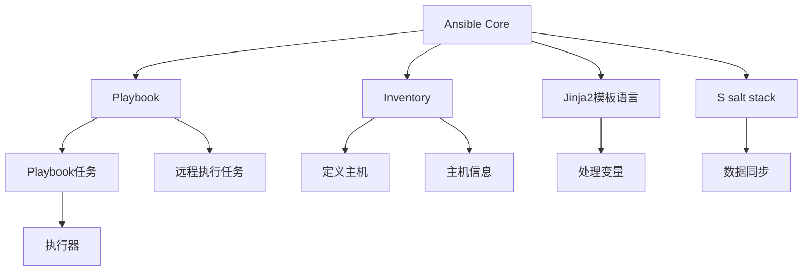

                 

# Ansible自动化：简化IT运维工作流程

> 关键词：Ansible, 自动化, IT运维, 部署管理, 配置管理, 容器化, 云平台

## 1. 背景介绍

### 1.1 问题由来
随着信息技术的发展，IT基础设施变得越来越复杂，IT运维工作也面临着诸多挑战。传统的运维模式往往依赖人工操作，耗时耗力，错误率高。如何通过自动化手段提高运维效率，保障系统的稳定性和安全性，成为IT部门迫切需要解决的问题。

### 1.2 问题核心关键点
自动化是提升IT运维效率的关键。通过自动化，可以大大减少人为操作的错误率，提高系统的可维护性和可扩展性。其中，Ansible作为一种开源自动化工具，因其简单高效、易于部署的特点，成为了IT运维自动化的热门选择。

### 1.3 问题研究意义
研究Ansible自动化，对于提高IT运维效率，降低运维成本，提升系统可靠性具有重要意义。Ansible的灵活性和易用性，使得其成为构建自动化运维工作流程的理想工具。通过深入研究Ansible的工作原理和最佳实践，可以帮助IT人员更高效地完成日常运维任务。

## 2. 核心概念与联系

### 2.1 核心概念概述

Ansible是一款基于Python的开源自动化工具，专门用于配置管理、应用部署、任务调度等IT运维任务。其核心思想是利用SSH协议远程连接和管理Linux/Unix系统，实现自动化执行任务。Ansible的优势在于其简单易用、部署方便、配置灵活、扩展性强，可以满足企业级IT运维的复杂需求。

Ansible主要包括以下几个关键组件：

- **Ansible Core**：Ansible的核心组件，包括控制器(Controller)、执行器(Executors)、模块(Modules)、角色(Roles)、任务(Task)等。
- **Playbook**：Ansible的工作脚本，用于描述自动化任务的具体执行流程。
- **Inventory**：Ansible的资源管理配置，用于定义所有要管理的主机和它们的信息。
- **Jinja2模板语言**：Ansible的任务脚本语言，用于处理变量和模板化。
- **S salt stack**：用于数据同步和状态管理，确保不同节点间的数据一致性。

这些核心组件构成了Ansible的自动化运维生态，使得其能够高效地管理各类IT资源。

### 2.2 核心概念原理和架构的 Mermaid 流程图



## 3. 核心算法原理 & 具体操作步骤

### 3.1 算法原理概述

Ansible的自动化原理基于SSH协议，通过远程连接主机执行任务。其核心工作流程包括以下几个步骤：

1. **定义主机和分组**：使用Inventory定义要管理的主机和它们的信息，如IP地址、用户、密码等。
2. **编写Playbook脚本**：使用Playbook描述任务的执行流程，包含任务和变量定义。
3. **设置任务和模块**：Playbook中设置具体的任务和模块，定义要执行的操作和参数。
4. **模板处理和变量替换**：使用Jinja2模板语言处理变量和任务模板，增强脚本的灵活性。
5. **执行任务**：通过SSH协议远程连接主机，执行任务脚本。
6. **数据同步和状态管理**：使用S salt stack确保数据一致性，避免数据冲突。

### 3.2 算法步骤详解

Ansible的自动化执行流程包括以下几个关键步骤：

**Step 1: 定义主机和分组**

1. **创建Inventory文件**：在Ansible目录下创建Inventory文件，定义所有要管理的主机和它们的分组。

```ini
[all]
web1 ansible_host=192.168.1.10
db1 ansible_host=192.168.1.20
[web]
web1
db1
```

2. **使用`ansible-inventory`命令检查Inventory文件内容**。

```bash
ansible-inventory --list
```

**Step 2: 编写Playbook脚本**

1. **创建Playbook文件**：在Ansible目录下创建Playbook文件，定义任务的执行流程。

```yaml
---
- name: 部署Nginx服务
  hosts: web
  become: yes
  tasks:
    - name: 安装Nginx
      yum:
        name: nginx
        state: present
      notify:
        - reload nginx
    - name: 启动Nginx服务
      service:
        name: nginx
        state: started
        enabled: yes
    - name: 测试Nginx
      command: curl -X GET http://{{ inventory_hostname }}/ | grep 'Welcome'
      register: nginx_test
      ignore_errors: yes
  handlers:
    - name: reload nginx
      service:
        name: nginx
        state: restarted
```

2. **运行Playbook**：使用`ansible-playbook`命令执行Playbook脚本。

```bash
ansible-playbook -i inventory_file.yml playbook_file.yml
```

**Step 3: 执行任务和模块**

1. **选择执行器**：Ansible提供多种执行器，如本地执行器、SSH执行器、Jenkins执行器等。SSH执行器是默认执行器，通过SSH协议远程连接主机执行任务。

2. **设置任务和模块**：在Playbook中设置具体的任务和模块，定义要执行的操作和参数。

3. **模板处理和变量替换**：使用Jinja2模板语言处理变量和任务模板，增强脚本的灵活性。

**Step 4: 数据同步和状态管理**

1. **使用S salt stack进行数据同步**：S salt stack可以确保不同节点间的数据一致性，避免数据冲突。

2. **设置状态管理器**：在Playbook中设置状态管理器，确保数据同步和状态一致。

### 3.3 算法优缺点

Ansible作为一种自动化运维工具，具有以下优点：

1. **简单易用**：Ansible使用Python编写，易于学习和上手，上手门槛低。
2. **部署方便**：支持多种平台和操作系统，可以在本地或云平台快速部署。
3. **配置灵活**：支持复杂的任务和模块，可以灵活满足企业级需求。
4. **扩展性强**：可以通过编写自定义模块和插件，进一步增强功能。
5. **社区活跃**：开源社区活跃，提供丰富的资源和支持。

同时，Ansible也存在以下缺点：

1. **网络依赖**：依赖SSH协议，网络不稳定时可能影响自动化执行。
2. **数据同步问题**：大规模环境下的数据同步和状态管理可能存在问题。
3. **性能瓶颈**：大规模部署时，可能存在性能瓶颈和资源浪费。
4. **缺少可视化界面**：相比其他自动化工具，缺少可视化的界面和图表。

### 3.4 算法应用领域

Ansible在IT运维自动化中有着广泛的应用，主要包括以下几个领域：

1. **部署管理**：自动化部署应用程序、服务、数据库等。
2. **配置管理**：自动化配置系统环境、网络设备、安全策略等。
3. **任务调度**：自动化执行日常任务、备份、监控等。
4. **容器化管理**：自动化管理Docker、Kubernetes等容器化平台。
5. **云平台管理**：自动化管理云平台资源、服务、应用等。

Ansible的灵活性和易用性，使得其在企业级IT运维中得到了广泛应用。随着企业级需求的不断增加，Ansible的应用场景还将不断扩展。

## 4. 数学模型和公式 & 详细讲解 & 举例说明

### 4.1 数学模型构建

Ansible的自动化执行基于SSH协议，其核心模型可以通过以下公式来描述：

$$
Y = f(X, W)
$$

其中，$X$ 为输入变量，包括主机信息、任务参数、变量等；$W$ 为模型权重，包括任务脚本、变量模板等；$Y$ 为输出结果，包括任务执行结果、状态信息等。

### 4.2 公式推导过程

Ansible的任务执行流程可以表示为：

1. **定义变量和模板**：
   - 定义变量：在Playbook中使用`vars`定义变量。
   - 定义模板：使用Jinja2模板语言处理变量和任务模板。

2. **执行任务和模块**：
   - 选择执行器：在Playbook中设置执行器。
   - 设置任务和模块：使用`tasks`定义具体的任务和模块，设置参数和参数值。
   - 模板处理和变量替换：使用Jinja2模板语言处理变量和任务模板。

3. **数据同步和状态管理**：
   - 使用S salt stack进行数据同步：在Playbook中设置状态管理器。
   - 设置状态管理器：使用`handlers`设置状态管理器，确保数据一致性。

### 4.3 案例分析与讲解

以部署Nginx服务为例，展示Ansible的自动化执行过程。

1. **定义变量和模板**

   - 定义变量：在Playbook中使用`vars`定义变量。

   ```yaml
   ---
   - name: 部署Nginx服务
     hosts: web
     become: yes
     tasks:
       - name: 安装Nginx
         yum:
           name: nginx
           state: present
         notify:
           - reload nginx
       - name: 启动Nginx服务
         service:
           name: nginx
           state: started
           enabled: yes
       - name: 测试Nginx
         command: curl -X GET http://{{ inventory_hostname }}/ | grep 'Welcome'
         register: nginx_test
         ignore_errors: yes
     handlers:
       - name: reload nginx
         service:
           name: nginx
           state: restarted
   ```

   - 定义模板：使用Jinja2模板语言处理变量和任务模板。

   ```jinja2
   - name: 安装Nginx
     yum:
       name: {{ nginx_name }}
       state: present
   ```

2. **执行任务和模块**

   - 选择执行器：在Playbook中设置执行器为SSH执行器。

   ```yaml
   ---
   - name: 部署Nginx服务
     hosts: web
     become: yes
     tasks:
       - name: 安装Nginx
         zombo:
           name: nginx
           state: present
         notify:
           - reload nginx
       - name: 启动Nginx服务
         service:
           name: nginx
           state: started
           enabled: yes
       - name: 测试Nginx
         command: curl -X GET http://{{ inventory_hostname }}/ | grep 'Welcome'
         register: nginx_test
         ignore_errors: yes
     handlers:
       - name: reload nginx
         service:
           name: nginx
           state: restarted
   ```

3. **数据同步和状态管理**

   - 使用S salt stack进行数据同步：在Playbook中设置状态管理器。

   ```yaml
   ---
   - name: 部署Nginx服务
     hosts: web
     become: yes
     tasks:
       - name: 安装Nginx
         zombo:
           name: nginx
           state: present
         ignore_errors: yes
       - name: 启动Nginx服务
         service:
           name: nginx
           state: started
           enabled: yes
       - name: 测试Nginx
         command: curl -X GET http://{{ inventory_hostname }}/ | grep 'Welcome'
         register: nginx_test
         ignore_errors: yes
     handlers:
       - name: reload nginx
         service:
           name: nginx
           state: restarted
   ```

## 5. 项目实践：代码实例和详细解释说明

### 5.1 开发环境搭建

在Ansible自动化实践中，需要以下开发环境：

1. **安装Ansible**：
   - 从官网下载Ansible安装程序，并按照官方文档进行安装。
   - 使用pip安装Ansible依赖库。

   ```bash
   pip install ansible
   ```

2. **配置Inventory文件**：
   - 定义要管理的主机和它们的信息。

   ```ini
   [all]
   web1 ansible_host=192.168.1.10
   db1 ansible_host=192.168.1.20
   [web]
   web1
   db1
   ```

3. **编写Playbook脚本**：
   - 使用YAML语言编写Playbook脚本，定义任务的执行流程。

   ```yaml
   ---
   - name: 部署Nginx服务
     hosts: web
     become: yes
     tasks:
       - name: 安装Nginx
         zombo:
           name: nginx
           state: present
         ignore_errors: yes
       - name: 启动Nginx服务
         service:
           name: nginx
           state: started
           enabled: yes
       - name: 测试Nginx
         command: curl -X GET http://{{ inventory_hostname }}/ | grep 'Welcome'
         register: nginx_test
         ignore_errors: yes
     handlers:
       - name: reload nginx
         service:
           name: nginx
           state: restarted
   ```

4. **运行Playbook**：
   - 使用`ansible-playbook`命令执行Playbook脚本。

   ```bash
   ansible-playbook -i inventory.yml playbook.yml
   ```

### 5.2 源代码详细实现

以下是Ansible自动化执行Nginx服务的完整代码实现：

```yaml
---
- name: 部署Nginx服务
  hosts: web
  become: yes
  tasks:
    - name: 安装Nginx
      zombo:
        name: nginx
        state: present
      ignore_errors: yes
    - name: 启动Nginx服务
      service:
        name: nginx
        state: started
        enabled: yes
    - name: 测试Nginx
      command: curl -X GET http://{{ inventory_hostname }}/ | grep 'Welcome'
      register: nginx_test
      ignore_errors: yes
  handlers:
    - name: reload nginx
      service:
        name: nginx
        state: restarted
```

### 5.3 代码解读与分析

Ansible自动化执行的代码实现如下：

1. **定义变量和模板**

   - 使用`vars`定义变量，如`nginx_name`。
   - 使用Jinja2模板语言处理变量和任务模板，增强脚本的灵活性。

   ```yaml
   ---
   - name: 部署Nginx服务
     hosts: web
     become: yes
     tasks:
       - name: 安装Nginx
         zombo:
           name: {{ nginx_name }}
           state: present
         ignore_errors: yes
       - name: 启动Nginx服务
         service:
           name: nginx
           state: started
           enabled: yes
       - name: 测试Nginx
         command: curl -X GET http://{{ inventory_hostname }}/ | grep 'Welcome'
         register: nginx_test
         ignore_errors: yes
     handlers:
       - name: reload nginx
         service:
           name: nginx
           state: restarted
   ```

2. **执行任务和模块**

   - 使用SSH执行器远程连接主机，执行任务脚本。

   ```yaml
   ---
   - name: 部署Nginx服务
     hosts: web
     become: yes
     tasks:
       - name: 安装Nginx
         zombo:
           name: nginx
           state: present
         ignore_errors: yes
       - name: 启动Nginx服务
         service:
           name: nginx
           state: started
           enabled: yes
       - name: 测试Nginx
         command: curl -X GET http://{{ inventory_hostname }}/ | grep 'Welcome'
         register: nginx_test
         ignore_errors: yes
     handlers:
       - name: reload nginx
         service:
           name: nginx
           state: restarted
   ```

3. **数据同步和状态管理**

   - 使用S salt stack进行数据同步，确保不同节点间的数据一致性。

   ```yaml
   ---
   - name: 部署Nginx服务
     hosts: web
     become: yes
     tasks:
       - name: 安装Nginx
         zombo:
           name: nginx
           state: present
         ignore_errors: yes
       - name: 启动Nginx服务
         service:
           name: nginx
           state: started
           enabled: yes
       - name: 测试Nginx
         command: curl -X GET http://{{ inventory_hostname }}/ | grep 'Welcome'
         register: nginx_test
         ignore_errors: yes
     handlers:
       - name: reload nginx
         service:
           name: nginx
           state: restarted
   ```

### 5.4 运行结果展示

执行Playbook后，可以通过以下命令查看任务执行结果：

```bash
ansible-playbook -i inventory.yml playbook.yml
```

## 6. 实际应用场景

### 6.1 智能运维中心

在智能运维中心中，Ansible可以用于自动化执行各种运维任务，如系统部署、配置管理、任务调度等。通过编写Playbook脚本，可以高效地管理各类IT资源，提升运维效率和系统可靠性。

### 6.2 云平台自动化管理

在云平台中，Ansible可以用于自动化管理云资源、服务、应用等。通过使用Playbook脚本，可以自动部署和管理云平台上的各种资源，确保资源的一致性和可用性。

### 6.3 容器化平台管理

在容器化平台中，Ansible可以用于自动化管理Docker、Kubernetes等容器化平台。通过编写Playbook脚本，可以自动部署和管理容器化应用，确保应用的稳定性和扩展性。

## 7. 工具和资源推荐

### 7.1 学习资源推荐

为了帮助IT人员系统掌握Ansible自动化技术，推荐以下学习资源：

1. **《Ansible for DevOps》书籍**：详细介绍了Ansible的工作原理、最佳实践、案例分析等内容。

2. **官方文档**：Ansible的官方文档详细介绍了Ansible的各项功能、命令、配置等内容，是学习Ansible的重要参考资料。

3. **官方社区**：Ansible的官方社区提供了丰富的教程、案例、插件等内容，可以帮助IT人员更好地使用Ansible。

4. **在线课程**：Coursera、Udemy等在线教育平台提供了大量Ansible的课程，适合初学者和进阶用户学习。

5. **开源项目**：GitHub上提供了大量Ansible的实用项目和示例代码，可以帮助IT人员学习和实践Ansible。

### 7.2 开发工具推荐

在Ansible自动化实践中，以下开发工具可以帮助IT人员提升效率：

1. **Ansible Core**：Ansible的核心组件，包括控制器(Controller)、执行器(Executors)、模块(Modules)、角色(Roles)、任务(Task)等。

2. **Playbook**：Ansible的工作脚本，用于描述自动化任务的具体执行流程。

3. **Inventory**：Ansible的资源管理配置，用于定义所有要管理的主机和它们的信息。

4. **Jinja2模板语言**：Ansible的任务脚本语言，用于处理变量和模板化。

5. **S salt stack**：用于数据同步和状态管理，确保不同节点间的数据一致性。

### 7.3 相关论文推荐

Ansible自动化技术不断发展，相关论文涵盖了其工作原理、优化方法、应用场景等内容。以下是几篇具有代表性的论文：

1. **《Ansible: Manage your systems and people with automation》**：Ansible的官方文档，详细介绍了Ansible的工作原理、最佳实践、案例分析等内容。

2. **《Automating Infrastructure as Code with Ansible》**：介绍如何使用Ansible自动化管理云平台基础设施。

3. **《Ansible for Beginners》**：适合初学者的Ansible入门教程，详细介绍了Ansible的各项功能和命令。

4. **《Ansible Best Practices》**：介绍Ansible的最佳实践，帮助IT人员更好地使用Ansible。

## 8. 总结：未来发展趋势与挑战

### 8.1 研究成果总结

本文对Ansible自动化技术进行了全面系统的介绍。通过阐述Ansible的工作原理、核心组件、操作步骤等，详细讲解了Ansible自动化在IT运维中的应用，展示了其灵活性和易用性。通过项目实践和案例分析，帮助IT人员更好地理解和掌握Ansible自动化技术。

### 8.2 未来发展趋势

展望未来，Ansible自动化技术将呈现以下几个发展趋势：

1. **云原生支持**：随着云原生技术的不断发展，Ansible将更加支持云平台和容器化平台，成为云原生架构的重要组成部分。

2. **多语言支持**：随着Ansible社区的不断壮大，未来可能会支持更多语言和平台，如Windows、Kubernetes等。

3. **AI与自动化结合**：通过引入AI技术，Ansible可以更好地进行故障预测、异常检测、智能调度等，提升自动化运维的智能化水平。

4. **DevOps集成**：Ansible将更加紧密地与DevOps流程集成，实现从开发到运维的全生命周期自动化。

5. **安全与合规**：Ansible将更加重视安全与合规问题，提供更强的身份验证、权限控制等功能。

### 8.3 面临的挑战

尽管Ansible自动化技术已经取得了显著成果，但在迈向更高层次应用的过程中，仍面临一些挑战：

1. **网络依赖**：依赖SSH协议，网络不稳定时可能影响自动化执行。

2. **数据同步问题**：大规模环境下的数据同步和状态管理可能存在问题。

3. **性能瓶颈**：大规模部署时，可能存在性能瓶颈和资源浪费。

4. **缺少可视化界面**：相比其他自动化工具，缺少可视化的界面和图表。

5. **复杂性提升**：随着功能的不断增加，Ansible的复杂性也在增加，可能增加学习和使用难度。

### 8.4 研究展望

面对Ansible自动化面临的挑战，未来的研究需要在以下几个方面寻求新的突破：

1. **优化网络依赖**：研究如何通过其他协议或技术，减少对网络稳定性的依赖。

2. **提升数据同步**：研究如何提高数据同步和状态管理的效率，解决大规模环境下的数据一致性问题。

3. **优化性能瓶颈**：研究如何优化Ansible的性能瓶颈，提升大规模部署的效率和稳定性。

4. **增强可视化界面**：研究如何通过可视化界面，提升Ansible的用户体验和操作便捷性。

5. **降低复杂性**：研究如何降低Ansible的复杂性，使其更加易于学习和使用。

总之，Ansible自动化技术在IT运维中具有广阔的应用前景，但也需要不断优化和改进。未来，Ansible将继续在自动化运维中发挥重要作用，助力企业数字化转型升级。

## 9. 附录：常见问题与解答

**Q1：Ansible是否可以跨平台使用？**

A: Ansible支持多种平台和操作系统，包括Linux、Unix、Windows、MacOS等。通过使用不同的模块和插件，可以方便地在不同平台上实现自动化执行。

**Q2：Ansible如何处理异常情况？**

A: Ansible提供了丰富的异常处理机制，可以在任务脚本中设置`ignore_errors`参数，忽略异常情况。同时，通过使用`command`模块，可以在任务脚本中捕获和处理异常情况。

**Q3：Ansible是否可以与云平台集成？**

A: Ansible可以与云平台集成，如AWS、Azure、Google Cloud等。通过使用相应的模块和插件，可以在云平台中实现自动化部署和管理。

**Q4：Ansible是否可以与DevOps工具集成？**

A: Ansible可以与DevOps工具集成，如Jenkins、GitLab CI/CD等。通过使用相应的插件和配置，可以在DevOps流程中实现自动化执行。

**Q5：Ansible是否可以与容器化平台集成？**

A: Ansible可以与容器化平台集成，如Docker、Kubernetes等。通过使用相应的模块和插件，可以在容器化平台中实现自动化部署和管理。

总之，Ansible作为一种强大的自动化工具，具有广泛的应用场景和前景。通过深入研究Ansible的工作原理和最佳实践，可以帮助IT人员更好地实现自动化运维，提升IT运维效率和系统可靠性。相信随着技术的不断进步，Ansible自动化技术必将迎来更加广阔的应用前景。

