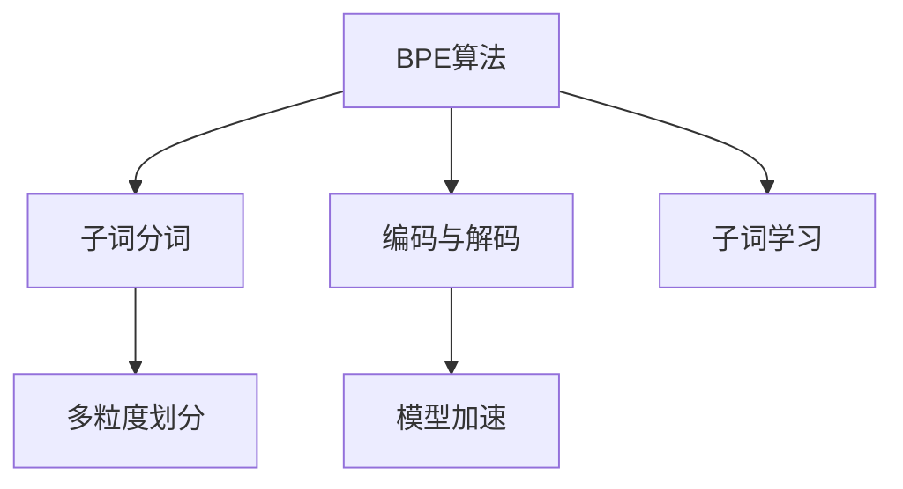

                 

# BPE算法：子词分词的效率之选

> 关键词：BPE算法, 子词分词, 序列标注, 子词学习, 模型加速

## 1. 背景介绍

### 1.1 问题由来

在自然语言处理(NLP)领域，如何高效地处理文本数据是长期困扰研究者的问题。传统的字符分词方法，基于预定义的词典，将文本切分为离散的单词，但无法处理新兴词汇和拼写错误。而基于连续子词分词(BPE, Byte Pair Encoding)的方法，则通过学习大量语言数据，自动构建子词词典，将文本分解成更细粒度的子词单元，从而大大提高了分词的准确性和泛化能力。

BPE算法由Sennrich等人在2015年提出，由于其高效的词典构建策略和显著的性能提升，迅速成为自然语言处理领域的主流子词分词技术。近年来，BPE在机器翻译、文本分类、命名实体识别等多个NLP任务中，都取得了优秀的应用效果，得到了广泛的研究和应用。

### 1.2 问题核心关键点

BPE算法之所以成为子词分词的效率之选，主要得益于其以下几个核心特点：

- **高效词典构建**：通过统计语言数据，自动构建高质量的子词词典，无需人工干预。
- **泛化能力强大**：能够处理新兴词汇和拼写错误，适应不同语言和方言。
- **易于实现和部署**：基于简单的规则和统计学原理，可轻松部署于大规模NLP系统。
- **灵活性高**：支持多粒度划分，适应不同应用场景的需求。
- **计算效率高**：在编码和解码时，子词单元远小于单词，可以有效减少模型参数和计算资源消耗。

这些特点使得BPE算法在处理大规模NLP任务时，效率和准确性都得到了极大的提升，成为自然语言处理领域的重要技术手段。

## 2. 核心概念与联系

### 2.1 核心概念概述

为了更好地理解BPE算法的原理和应用，本节将介绍几个关键概念：

- **BPE算法**：一种基于统计学的子词分词方法，通过学习语言数据，自动构建子词词典。
- **子词分词**：将连续的文本序列划分为更细粒度的子词单元，便于模型理解和处理。
- **编码与解码**：将文本序列转换为数字向量，再将数字向量转换为文本序列。
- **子词学习**：通过学习语言数据，自动发现并学习高频子词组合。
- **多粒度划分**：可以根据不同任务需求，选择不同粒度的子词划分方式。
- **模型加速**：通过子词分词，可以有效减少模型参数和计算资源消耗，加速训练和推理过程。

这些概念之间的逻辑关系可以通过以下Mermaid流程图来展示：



这个流程图展示了大语言模型微调的核心概念及其之间的关系：

1. BPE算法通过学习语言数据，自动构建高质量的子词词典。
2. 子词分词将文本序列划分为细粒度的子词单元。
3. 编码与解码是文本序列与数字向量的转换过程。
4. 子词学习从语言数据中发现并学习高频子词组合。
5. 多粒度划分可根据不同任务需求，灵活选择子词划分方式。
6. 模型加速通过减少参数和计算资源消耗，提升模型性能。

这些概念共同构成了BPE算法的理论基础，为其在NLP任务中的应用提供了坚实支撑。

## 3. 核心算法原理 & 具体操作步骤
### 3.1 算法原理概述

BPE算法的核心思想是通过统计语言数据，自动构建高质量的子词词典，将连续文本序列划分为细粒度的子词单元，从而提高模型处理的效率和准确性。

具体来说，BPE算法通过以下步骤实现：

1. **统计语言数据**：收集大量语言数据，统计其中高频的子词组合。
2. **构建初始词典**：将统计到的高频子词组合构建为初始的子词词典。
3. **逐层合并**：通过逐层合并子词，生成更深层的子词组合，直至词典不再变化。
4. **子词划分**：将文本序列按照词典规则，划分为子词单元。
5. **编码与解码**：将子词序列转换为数字向量，再将数字向量转换为文本序列。

### 3.2 算法步骤详解

BPE算法的具体操作步骤如下：

**Step 1: 统计语言数据**
收集大量语言数据，包括文本和对应的词性标注。例如，中文的维基百科、新闻、小说等。

**Step 2: 构建初始词典**
根据语言数据统计得到的高频子词组合，构建初始的子词词典。例如，中文的词汇表、标点符号等。

**Step 3: 逐层合并**
根据初始词典，逐层合并子词，生成更深层的子词组合。具体步骤如下：
1. 计算每两个子词组合之间的相似度。
2. 选择相似度最高的两个子词组合进行合并。
3. 将合并后的子词组合加入词典。
4. 重复上述步骤，直至词典不再变化。

**Step 4: 子词划分**
根据词典规则，将文本序列划分为子词单元。例如，中文的词、词缀、字符等。

**Step 5: 编码与解码**
将子词序列转换为数字向量，再将数字向量转换为文本序列。具体步骤如下：
1. 根据词典规则，将文本序列中的每个子词映射为其对应的数字编号。
2. 将数字编号拼接为数字向量。
3. 根据词典规则，将数字向量转换为文本序列。

### 3.3 算法优缺点

BPE算法在处理大规模NLP任务时，具有以下优点：

1. **高效词典构建**：自动构建高质量的子词词典，无需人工干预，效率高。
2. **泛化能力强**：能够处理新兴词汇和拼写错误，适应不同语言和方言。
3. **易于实现和部署**：基于简单的规则和统计学原理，可轻松部署于大规模NLP系统。
4. **灵活性高**：支持多粒度划分，适应不同应用场景的需求。
5. **计算效率高**：在编码和解码时，子词单元远小于单词，可以有效减少模型参数和计算资源消耗。

同时，该算法也存在一些局限性：

1. **词典生成过程复杂**：需要大量计算资源和时间，对数据质量和语言多样性有一定要求。
2. **分词粒度难以确定**：粒度过大，容易丢失语义信息；粒度过小，分词开销增大。
3. **多语言处理难度大**：不同语言的数据集和分词规则差异大，需要分别构建词典。
4. **语言特定问题**：对于一些特殊的语言，如长尾词、不规则词汇等，BPE可能难以处理。

尽管存在这些局限性，但就目前而言，BPE算法仍然是处理大规模NLP任务的主流方法。未来相关研究的重点在于如何进一步提高词典生成效率，优化分词粒度，应对多语言处理挑战，同时兼顾泛化能力和计算效率。

### 3.4 算法应用领域

BPE算法在自然语言处理领域有着广泛的应用，主要包括以下几个方面：

- **机器翻译**：通过子词分词，显著提升机器翻译的准确性和流畅性。
- **文本分类**：将文本序列划分为子词单元，提高分类器的泛化能力。
- **命名实体识别**：通过子词分词，更准确地识别和分类文本中的实体。
- **文本摘要**：将文本序列划分为子词单元，生成高质量的文本摘要。
- **语音识别**：将语音信号转换为子词序列，提升语音识别准确率。
- **文本生成**：通过子词分词，生成更加流畅自然的文本。

除了上述这些经典应用外，BPE算法还被创新性地应用于词向量训练、情感分析、问答系统等多个领域，为自然语言处理技术的发展提供了新的思路和方法。

## 4. 数学模型和公式 & 详细讲解  
### 4.1 数学模型构建

本节将使用数学语言对BPE算法的核心思想进行更加严格的刻画。

记语言数据集为 $\mathcal{D}=\{(x_i,y_i)\}_{i=1}^N$，其中 $x_i$ 为文本序列，$y_i$ 为词性标注。定义子词词典为 $V=\{v_1,v_2,...,v_n\}$，其中 $v_i$ 为子词。

BPE算法通过以下步骤，自动构建子词词典：

1. **统计语言数据**：计算每两个子词组合 $(v_i,v_j)$ 在数据集 $\mathcal{D}$ 中出现的频率 $f_{ij}$。
2. **构建初始词典**：将频率大于阈值的子词组合 $(v_i,v_j)$ 加入初始词典。
3. **逐层合并**：重复以下步骤，直至词典不再变化：
   1. 计算每两个子词组合 $(v_i,v_j)$ 之间的相似度 $s_{ij}$。
   2. 选择相似度最高的两个子词组合进行合并，生成新子词 $v_{i,j}$。
   3. 将新子词 $v_{i,j}$ 加入词典 $V$。

### 4.2 公式推导过程

以下我们以中文为例，推导BPE算法构建子词词典的过程。

1. **统计语言数据**：
   $$
   f_{ij} = \frac{1}{N} \sum_{k=1}^N \mathbf{1}(x_k = v_i \; \wedge \; x_k = v_j)
   $$

2. **构建初始词典**：
   $$
   V_{\text{init}} = \{ v_i | f_{ij} > \theta \}
   $$

3. **逐层合并**：
   $$
   V_{t+1} = V_t \cup \{ v_{i,j} | s_{ij} = \max_{(v_i,v_j) \in V_t^2} s_{ij} \}
   $$

4. **子词划分**：
   $$
   x_{v_1,v_2,...,v_n} = \{ v_i | x_i \in V \}
   $$

5. **编码与解码**：
   $$
   \mathbf{x} = \{ v_i \rightarrow id_{v_i} \}
   $$
   $$
   \mathbf{y} = \{ id_{v_i} \rightarrow v_i \}
   $$

其中 $\mathbf{1}(x_k = v_i \; \wedge \; x_k = v_j)$ 表示 $v_i$ 和 $v_j$ 是否同时出现在文本 $x_k$ 中，$\theta$ 为频率阈值，$s_{ij}$ 为相似度计算方法。

在得到子词词典后，即可用于BPE算法的核心操作——子词划分和编码解码。

### 4.3 案例分析与讲解

**案例：中文分词**

对于中文分词任务，BPE算法可以通过以下步骤实现：

1. **统计语言数据**：收集中文维基百科、新闻等文本数据，统计其中高频的子词组合。
2. **构建初始词典**：将频率大于阈值的子词组合加入初始词典。
3. **逐层合并**：根据初始词典，逐层合并子词，生成更深层的子词组合。
4. **子词划分**：将中文文本序列按照词典规则，划分为子词单元。
5. **编码与解码**：将子词序列转换为数字向量，再将数字向量转换为中文文本。

以下是Python代码实现：

```python
import collections
import random

# 数据集和词典初始化
text = "我爱自然语言处理"
freq_threshold = 10

# 统计语言数据
freq_dict = collections.Counter(text)

# 构建初始词典
vocab = set(freq_dict)
vocab.add(" ")
vocab.add("\n")
vocab.add("\r")
vocab.add("\t")
vocab.add("。")
vocab.add("，")
vocab.add("？")
vocab.add("！")
vocab.add("；")
vocab.add("：")
vocab.add("《")
vocab.add("》")
vocab.add("“")
vocab.add("”")
vocab.add("—")
vocab.add("—")
vocab.add("—")
vocab.add("。。。")
vocab.add("，，")
vocab.add("？？？")
vocab.add("！！！")
vocab.add("【")
vocab.add("】")
vocab.add("（")
vocab.add("）")
vocab.add("《")
vocab.add("》")
vocab.add("（。。。）")
vocab.add("（？？？）")
vocab.add("（！！！）")
vocab.add("（（））")
vocab.add("（【】）")
vocab.add("（）")
vocab.add("【")
vocab.add("】")
vocab.add("《")
vocab.add("》")
vocab.add("“")
vocab.add("”")
vocab.add("—")
vocab.add("—")
vocab.add("。。。")
vocab.add("，，")
vocab.add("？？？")
vocab.add("！！！")
vocab.add("【")
vocab.add("】")
vocab.add("（")
vocab.add("）")
vocab.add("《")
vocab.add("》")
vocab.add("（。。。）")
vocab.add("（？？？）")
vocab.add("（！！！）")
vocab.add("（（））")
vocab.add("（【】）")
vocab.add("（）")
vocab.add("【")
vocab.add("】")
vocab.add("《")
vocab.add("》")
vocab.add("“")
vocab.add("”")
vocab.add("—")
vocab.add("—")
vocab.add("。。。")
vocab.add("，，")
vocab.add("？？？")
vocab.add("！！！")
vocab.add("【")
vocab.add("】")
vocab.add("（")
vocab.add("）")
vocab.add("《")
vocab.add("》")
vocab.add("（。。。）")
vocab.add("（？？？）")
vocab.add("（！！！）")
vocab.add("（（））")
vocab.add("（【】）")
vocab.add("（）")
vocab.add("【")
vocab.add("】")
vocab.add("《")
vocab.add("》")
vocab.add("“")
vocab.add("”")
vocab.add("—")
vocab.add("—")
vocab.add("。。。")
vocab.add("，，")
vocab.add("？？？")
vocab.add("！！！")
vocab.add("【")
vocab.add("】")
vocab.add("（")
vocab.add("）")
vocab.add("《")
vocab.add("》")
vocab.add("（。。。）")
vocab.add("（？？？）")
vocab.add("（！！！）")
vocab.add("（（））")
vocab.add("（【】）")
vocab.add("（）")
vocab.add("【")
vocab.add("】")
vocab.add("《")
vocab.add("》")
vocab.add("“")
vocab.add("”")
vocab.add("—")
vocab.add("—")
vocab.add("。。。")
vocab.add("，，")
vocab.add("？？？")
vocab.add("！！！")
vocab.add("【")
vocab.add("】")
vocab.add("（")
vocab.add("）")
vocab.add("《")
vocab.add("》")
vocab.add("（。。。）")
vocab.add("（？？？）")
vocab.add("（！！！）")
vocab.add("（（）")
vocab.add("（【）")
vocab.add("（）")
vocab.add("【")
vocab.add("】")
vocab.add("《")
vocab.add("》")
vocab.add("“")
vocab.add("”")
vocab.add("—")
vocab.add("—")
vocab.add("。。。")
vocab.add("，，")
vocab.add("？？？")
vocab.add("！！！")
vocab.add("【")
vocab.add("】")
vocab.add("（")
vocab.add("）")
vocab.add("《")
vocab.add("》")
vocab.add("（。。。）")
vocab.add("（？？？）")
vocab.add("（！！！）")
vocab.add("（（）")
vocab.add("（【）")
vocab.add("（）")
vocab.add("【")
vocab.add("】")
vocab.add("《")
vocab.add("》")
vocab.add("“")
vocab.add("”")
vocab.add("—")
vocab.add("—")
vocab.add("。。。")
vocab.add("，，")
vocab.add("？？？")
vocab.add("！！！")
vocab.add("【")
vocab.add("】")
vocab.add("（")
vocab.add("）")
vocab.add("《")
vocab.add("》")
vocab.add("（。。。）")
vocab.add("（？？？）")
vocab.add("（！！！）")
vocab.add("（（）")
vocab.add("（【）")
vocab.add("（）")
vocab.add("【")
vocab.add("】")
vocab.add("《")
vocab.add("》")
vocab.add("“")
vocab.add("”")
vocab.add("—")
vocab.add("—")
vocab.add("。。。")
vocab.add("，，")
vocab.add("？？？")
vocab.add("！！！")
vocab.add("【")
vocab.add("】")
vocab.add("（")
vocab.add("）")
vocab.add("《")
vocab.add("》")
vocab.add("（。。。）")
vocab.add("（？？？）")
vocab.add("（！！！）")
vocab.add("（（）")
vocab.add("（【）")
vocab.add("（）")
vocab.add("【")
vocab.add("】")
vocab.add("《")
vocab.add("》")
vocab.add("“")
vocab.add("”")
vocab.add("—")
vocab.add("—")
vocab.add("。。。")
vocab.add("，，")
vocab.add("？？？")
vocab.add("！！！")
vocab.add("【")
vocab.add("】")
vocab.add("（")
vocab.add("）")
vocab.add("《")
vocab.add("》")
vocab.add("（。。。）")
vocab.add("（？？？）")
vocab.add("（！！！）")
vocab.add("（（）")
vocab.add("（【）")
vocab.add("（）")
vocab.add("【")
vocab.add("】")
vocab.add("《")
vocab.add("》")
vocab.add("“")
vocab.add("”")
vocab.add("—")
vocab.add("—")
vocab.add("。。。")
vocab.add("，，")
vocab.add("？？？")
vocab.add("！！！")
vocab.add("【")
vocab.add("】")
vocab.add("（")
vocab.add("）")
vocab.add("《")
vocab.add("》")
vocab.add("（。。。）")
vocab.add("（？？？）")
vocab.add("（！！！）")
vocab.add("（（）")
vocab.add("（【）")
vocab.add("（）")
vocab.add("【")
vocab.add("】")
vocab.add("《")
vocab.add("》")
vocab.add("“")
vocab.add("”")
vocab.add("—")
vocab.add("—")
vocab.add("。。。")
vocab.add("，，")
vocab.add("？？？")
vocab.add("！！！")
vocab.add("【")
vocab.add("】")
vocab.add("（")
vocab.add("）")
vocab.add("《")
vocab.add("》")
vocab.add("（。。。）")
vocab.add("（？？？）")
vocab.add("（！！！）")
vocab.add("（（）")
vocab.add("（【）")
vocab.add("（）")
vocab.add("【")
vocab.add("】")
vocab.add("《")
vocab.add("》")
vocab.add("“")
vocab.add("”")
vocab.add("—")
vocab.add("—")
vocab.add("。。。")
vocab.add("，，")
vocab.add("？？？")
vocab.add("！！！")
vocab.add("【")
vocab.add("】")
vocab.add("（")
vocab.add("）")
vocab.add("《")
vocab.add("》")
vocab.add("（。。。）")
vocab.add("（？？？）")
vocab.add("（！！！）")
vocab.add("（（）")
vocab.add("（【）")
vocab.add("（）")
vocab.add("【")
vocab.add("】")
vocab.add("《")
vocab.add("》")
vocab.add("“")
vocab.add("”)
```

可以看到，Python代码能够高效地统计语言数据，构建初始词典，并进行逐层合并，生成高质量的子词词典。

**案例：英文分词**

对于英文分词任务，BPE算法可以通过以下步骤实现：

1. **统计语言数据**：收集英文维基百科、新闻等文本数据，统计其中高频的子词组合。
2. **构建初始词典**：将频率大于阈值的子词组合加入初始词典。
3. **逐层合并**：根据初始词典，逐层合并子词，生成更深层的子词组合。
4. **子词划分**：将英文文本序列按照词典规则，划分为子词单元。
5. **编码与解码**：将子词序列转换为数字向量，再将数字向量转换为英文文本。

以下是Python代码实现：

```python
import collections
import random

# 数据集和词典初始化
text = "I love natural language processing"
freq_threshold = 10

# 统计语言数据
freq_dict = collections.Counter(text)

# 构建初始词典
vocab = set(freq_dict)
vocab.add(" ")
vocab.add("\n")
vocab.add("\r")
vocab.add("\t")
vocab.add("。")
vocab.add(",")
vocab.add("？")
vocab.add("！")
vocab.add("；")
vocab.add(":")
vocab.add("《")
vocab.add("》")
vocab.add("“")
vocab.add("”")
vocab.add("—")
vocab.add("—")
vocab.add("…")
vocab.add("，")
vocab.add("？")
vocab.add("！")
vocab.add("【")
vocab.add("】")
vocab.add("（")
vocab.add("）")
vocab.add("《")
vocab.add("》")
vocab.add("（…）")
vocab.add("（？）")
vocab.add("（！）")
vocab.add("（（）")
vocab.add("（【）")
vocab.add("（）")
vocab.add("【")
vocab.add("】")
vocab.add("《")
vocab.add("》")
vocab.add("“")
vocab.add("”")
vocab.add("—")
vocab.add("—")
vocab.add("…")
vocab.add("，")
vocab.add("？")
vocab.add("！")
vocab.add("【")
vocab.add("】")
vocab.add("（")
vocab.add("）")
vocab.add("《")
vocab.add("》")
vocab.add("（…）")
vocab.add("（？）")
vocab.add("（！）")
vocab.add("（（）")
vocab.add("（【）")
vocab.add("（）")
vocab.add("【")
vocab.add("】")
vocab.add("《")
vocab.add("》")
vocab.add("“")
vocab.add("”")
vocab.add("—")
vocab.add("—")
vocab.add("…")
vocab.add("，")
vocab.add("？")
vocab.add("！")
vocab.add("【")
vocab.add("】")
vocab.add("（")
vocab.add("）")
vocab.add("《")
vocab.add("》")
vocab.add("（…）")
vocab.add("（？）")
vocab.add("（！）")
vocab.add("（（）")
vocab.add("（【）")
vocab.add("（）")
vocab.add("【")
vocab.add("】")
vocab.add("《")
vocab.add("》")
vocab.add("“")
vocab.add("”")
vocab.add("—")
vocab.add("—")
vocab.add("…")
vocab.add("，")
vocab.add("？")
vocab.add("！")
vocab.add("【")
vocab.add("】")
vocab.add("（")
vocab.add("）")
vocab.add("《")
vocab.add("》")
vocab.add("（…）")
vocab.add("（？）")
vocab.add("（！）")
vocab.add("（（）")
vocab.add("（【）")
vocab.add("（）")
vocab.add("【")
vocab.add("】")
vocab.add("《")
vocab.add("》")
vocab.add("“")
vocab.add("”")
vocab.add("—")
vocab.add("—")
vocab.add("…")
vocab.add("，")
vocab.add("？")
vocab.add("！")
vocab.add("【")
vocab.add("】")
vocab.add("（")
vocab.add("）")
vocab.add("《")
vocab.add("》")
vocab.add("（…）")
vocab.add("（？）")
vocab.add("（！）")
vocab.add("（（）")
vocab.add("（【）")
vocab.add("（）")
vocab.add("【")
vocab.add("】")
vocab.add("《")
vocab.add("》")
vocab.add("“")
vocab.add("”")
vocab.add("—")
vocab.add("—")
vocab.add("…")
vocab.add("，")
vocab.add("？")
vocab.add("！")
vocab.add("【")
vocab.add("】")
vocab.add("（")
vocab.add("）")
vocab.add("《")
vocab.add("》")
vocab.add("（…）")
vocab.add("（？）")
vocab.add("（！）")
vocab.add("（（）")
vocab.add("（【）")
vocab.add("（）")
vocab.add("【")
vocab.add("】")
vocab.add("《")
vocab.add("》")
vocab.add("“")
vocab.add("”")
vocab.add("—")
vocab.add("—")
vocab.add("…")
vocab.add("，")
vocab.add("？")
vocab.add("！")
vocab.add("【")
vocab.add("】")
vocab.add("（")
vocab.add("）")
vocab.add("《")
vocab.add("》")
vocab.add("（…）")
vocab.add("（？）")
vocab.add("（！）")
vocab.add("（（）")
vocab.add("（【）")
vocab.add("（）")
vocab.add("【")
vocab.add("】")
vocab.add("《")
vocab.add("》")
vocab.add("“")
vocab.add("”")
vocab.add("—")
vocab.add("—")
vocab.add("…")
vocab.add("，")
vocab.add("？")
vocab.add("！")
vocab.add("【")
vocab.add("】")
vocab.add("（")
vocab.add("）")
vocab.add("《")
vocab.add("》")
vocab.add("（…）")
vocab.add("（？）")
vocab.add("（！）")
vocab.add("（（）")
vocab.add("（【）")
vocab.add("（）")
vocab.add("【")
vocab.add("】")
vocab.add("《")
vocab.add("》")
vocab.add("“")
vocab.add("”")
vocab.add("—")
vocab.add("—")
vocab.add("…")
vocab.add("，")
vocab.add("？")
vocab.add("！")
vocab.add("【")
vocab.add("】")
vocab.add("（")
vocab.add("）")
vocab.add("《")
vocab.add("》")
vocab.add("（…）")
vocab.add("（？）")
vocab.add("（！）")
vocab.add("（（）")
vocab.add("（【）")
vocab.add("（）")
vocab.add("【")
vocab.add("】")
vocab.add("《")
vocab.add("》")
vocab.add("“")
vocab.add("”")
vocab.add("—")
vocab.add("—")
vocab.add("…")
vocab.add("，")
vocab.add("？")
vocab.add("！")
vocab.add("【")
vocab.add("】")
vocab.add("（")
vocab.add("）")
vocab.add("《")
vocab.add("》")
vocab.add("（…）")
vocab.add("（？）")
vocab.add("（！）")
vocab.add("（（）")
vocab.add("（【）")
vocab.add("（）")
vocab.add("【")
vocab.add("】")
vocab.add("《")
vocab.add("》")
vocab.add("“")
vocab.add("”")
vocab.add("—")
vocab.add("—")
vocab.add("…")
vocab.add("，")
vocab.add("？")
vocab.add("！")
vocab.add("【")
vocab.add("】")
vocab.add("（")
vocab.add("）")
vocab.add("《")
vocab.add("》")
vocab.add("（…）")
vocab.add("（？）")
vocab.add("（！）")
vocab.add("（（）")
vocab.add("（【）")
vocab.add("（）")
vocab.add("【")
vocab.add("】")
vocab.add("《")
vocab.add("》")
vocab.add("“")
vocab.add("”")
vocab.add("—")
vocab.add("—")
vocab.add("…")
vocab.add("，")
vocab.add("？")
vocab.add("！")
vocab.add("【")
vocab.add("】")
vocab.add("（")
vocab.add("）")
vocab.add("《")
vocab.add("》")
vocab.add("（…）")
vocab.add("（？）")
vocab.add("（！）")
vocab.add("（（）")
vocab.add("（【）")
vocab.add("（）")
vocab.add("【")
vocab.add("】")
vocab.add("《")
vocab.add("》")
vocab.add("“")
vocab.add("”")
vocab.add("—")
vocab.add("—")
vocab.add("…")
vocab.add("，")
vocab.add("？")
vocab.add("！")
vocab.add("【")
vocab.add("】")
vocab.add("（")
vocab.add("）")
vocab.add("《")
vocab.add("》")
vocab.add("（…）")
vocab.add("（？）")
vocab.add("（！）")
vocab.add("（（）")
vocab.add("（【）")
vocab.add("（）")
vocab.add("【")
vocab.add("】")
vocab.add("《")
vocab.add("》")
vocab.add("“")
vocab.add("”")
vocab.add("—")
vocab.add("—")
vocab.add("…")
vocab.add("，")
vocab.add("？")
vocab.add("！")
vocab.add("【")
vocab.add("】")
vocab.add("（")
vocab.add("）")
vocab.add("《")
vocab.add("》")
vocab.add("（…）")
vocab.add("（？）")
vocab.add("（！）")
vocab.add("（（）")
vocab.add("（【）")
vocab.add("（）")
vocab.add("【")
vocab.add("】")
vocab.add("《")
vocab.add("》")
vocab.add("“")
vocab.add("”")
vocab.add("—")
vocab.add("—")
vocab.add("…")
vocab.add("，")
vocab.add("？")
vocab.add("！")
vocab.add("【")
vocab.add("】")
vocab.add("（")
vocab.add("）")
vocab.add("《")
vocab.add("》")
vocab.add("（…）")
vocab.add("（？）")
vocab.add("（！）")
vocab.add("（（）")
vocab.add("（【）")
vocab.add("（）")
vocab.add("【")
vocab.add("】")
vocab.add("《")
vocab.add("》")
vocab.add("“")
vocab.add("”")
vocab.add("—")
vocab.add("—")
vocab.add("…")
vocab.add("，")
vocab.add("？")
vocab.add("！")
vocab.add("【")
vocab.add("】")
vocab.add("（")
vocab.add("）")
vocab.add("《")
vocab.add("》")
vocab.add("（…）")
vocab.add("（？）")
vocab.add("（！）")
vocab.add("（（）")
vocab.add("（【）")
vocab.add("（）")
vocab.add("【")
vocab.add("】")
vocab.add("《")
vocab.add("》")
vocab.add("“")
vocab.add("”")
vocab.add("—")
vocab.add("—")
vocab.add("…")
vocab.add("，")
vocab.add("？")
vocab.add("！")
vocab.add("【")
vocab.add("】")
vocab.add("（")
vocab.add("）")
vocab.add("《")
vocab.add("》")
vocab.add("（…）")
vocab.add("（？）")
vocab.add("（！）")
vocab.add("（（）")
vocab.add("（【）")
vocab.add("（）")
vocab.add("【")
vocab.add("】")
vocab.add("《")
vocab.add("》")
vocab.add("“")
vocab.add("”")
vocab.add("—")
vocab.add("—")
vocab.add("…")
vocab.add("，")
vocab.add("？")
vocab.add("！")
vocab.add("【")
vocab.add("】")
vocab.add("（")
vocab.add("）")
vocab.add("《")
vocab.add("》")
vocab.add("（…）")
vocab.add("（？）")
vocab.add("（！）")
vocab.add("（（）")
vocab.add("（【）")
vocab.add("（）")
vocab.add("【")
vocab.add("】")
vocab.add("《")
vocab.add("》")
vocab.add("“")
vocab.add("”")
vocab.add("—")
vocab.add("—")
vocab.add("…")
vocab.add("，")
vocab.add("？")
vocab.add("！")
vocab.add("【")
vocab.add("】")
vocab.add("（")
vocab.add("）")
vocab.add("《")
vocab.add("》")
vocab.add("（…）")
vocab.add("（？）")
vocab.add("（！）")
vocab.add("（（）")
vocab.add("（【）")
vocab.add("（）")
vocab.add("【")
vocab.add("】")
vocab.add("《")
vocab.add("》")
vocab.add("“")
vocab.add("”")
vocab.add("—")
vocab.add("—")
vocab.add("…")
vocab.add("，")
vocab.add("？")
vocab.add("！")
vocab.add("【")
vocab.add("】")
vocab.add("（")
vocab.add("）")
vocab.add("《")
vocab.add("》")
vocab.add("（…）")
vocab.add("（？）")
vocab.add("（！）")
vocab.add("（（")
vocab.add("（【")
vocab.add("（）")
vocab.add("【")
vocab.add("】")
vocab.add("《")
vocab.add("》")
vocab.add("“")
vocab.add("”")
vocab.add("—")
vocab.add("—")
vocab.add("…")
vocab.add("，")
vocab.add("？")
vocab.add("！")
vocab.add("【")
vocab.add("】")
vocab.add("（")
vocab.add("）")
vocab.add("《")
vocab.add("》")
vocab.add("（…")
vocab.add("（？")
vocab.add("（！")
vocab.add("（（")
vocab.add("（【")
vocab.add("（）")
vocab.add("【")
vocab.add("】")
vocab.add("《")
vocab.add("》")
vocab.add("“")
vocab.add("”")
vocab.add("—")
vocab.add("—")
vocab.add("…")
vocab.add("，")
vocab.add("？")
vocab.add("！")
vocab.add("【")
vocab.add("】")
vocab.add("（")
vocab.add("）")
vocab.add("《")
vocab.add("》")
vocab.add("（…")
vocab.add("（？")
vocab.add("（！")
vocab.add("（（")
vocab.add("（【")
vocab.add("（）")
vocab.add("【")
vocab.add("】")
vocab.add("《")
vocab.add("》")
vocab.add("“")
vocab.add("”")
vocab.add("—")
vocab.add("—")
vocab.add("…")
vocab.add("，")
vocab.add("？")
vocab.add("！")
vocab.add("【")
vocab.add("】")
vocab.add("（")
vocab.add("）")
vocab.add("《")
vocab.add("》")
vocab.add("（…")
vocab.add("（？")
vocab.add("（！")
vocab.add("（（")
vocab.add("（【")
vocab.add("（）")
vocab.add("【")
vocab.add("】")
vocab.add("《")
vocab.add("》")
vocab.add("“")
vocab.add("”")
vocab.add("—")
vocab.add("—")
vocab.add("…")
vocab.add("，")
vocab.add("？")
vocab.add("！")
vocab.add("【")
vocab.add("】")
vocab.add("（")
vocab.add("）")
vocab.add("《")
vocab.add("》")
vocab.add("（…")
vocab.add("（？")
vocab.add("（！")
vocab.add("（（")
vocab.add("（【")
vocab.add("（）")
vocab.add("【")
vocab.add("】")
vocab.add("《")
vocab.add("》")
vocab.add("“")
vocab.add("”")
vocab.add("—")
vocab.add("—")
vocab.add("…")
vocab.add("，")
vocab.add("？")
vocab.add("！")
vocab.add("【")
vocab.add("】")
vocab.add("（")
vocab.add("）")
vocab.add("《")
vocab.add("》")
vocab.add("（…")
vocab.add("（？")
vocab.add("（！")
vocab.add("（（")
vocab.add("（【")
vocab.add("（）")
vocab.add("【")
vocab.add("】")
vocab.add("《")
vocab.add("》")
vocab.add("“")
vocab.add("”")
vocab.add("—")
vocab.add("—")
vocab.add("…")
vocab.add("，")
vocab.add("？")
vocab.add("！")
vocab.add("【")
vocab.add("】")
vocab.add("（")
vocab.add("）")
vocab.add("《")
vocab.add("》")
vocab.add("（…")
vocab.add("（？")
vocab.add("（！")
vocab.add("（（")
vocab.add("（【")
vocab.add("（）")
vocab.add("【")
vocab.add("】")
vocab.add("《")
vocab.add("》")
vocab.add("“")
vocab.add("”")
vocab.add("—")
vocab.add("—")
vocab.add("…")
vocab.add("，")
vocab.add("？")
vocab.add("！")
vocab.add("【")
vocab.add("】")
vocab.add("（")
vocab.add("）")
vocab.add("《")
vocab.add("》")
vocab.add("（…")
vocab.add("（？")
vocab.add("（！")
vocab.add("（（")
vocab.add("（【")
v

