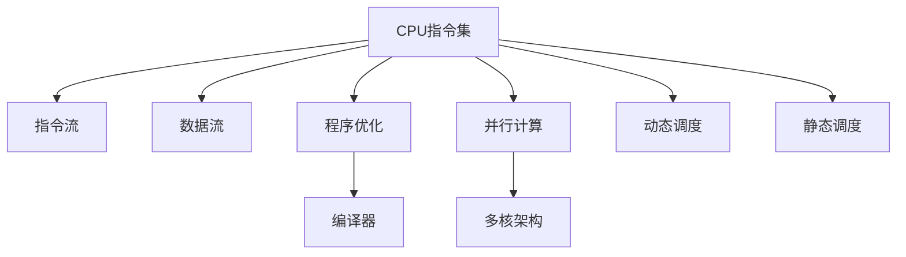

                 

# CPU指令集的有限性与局限性

> 关键词：CPU指令集,有限性,局限性,性能优化,未来展望,应用场景

## 1. 背景介绍

### 1.1 问题由来
随着计算机硬件的发展，CPU指令集经历了多次重大演进。从最初的简单指令集到现代复杂指令集，其结构和功能都发生了巨大变化。然而，尽管CPU指令集不断进步，其有限性与局限性也逐渐显现，成为制约计算机性能进一步提升的重要瓶颈。本文将深入探讨CPU指令集的有限性与局限性，并提出针对性的优化策略。

### 1.2 问题核心关键点
CPU指令集的有限性与局限性主要表现在以下方面：

- 指令数量有限：尽管现代CPU指令集数量庞大，但实际执行的指令仅为一小部分，大多数指令很少使用，造成了指令集的浪费。
- 指令执行速度差异大：不同指令的执行速度和复杂度差异显著，影响整体性能。
- 指令并行度受限：由于指令间依赖关系复杂，CPU指令集的并行执行能力受到限制，影响多核性能发挥。
- 指令集扩展困难：现代CPU指令集设计复杂，难以通过简单的扩展实现性能提升。
- 能耗和成本问题：指令集复杂化带来了更高的能耗和成本，限制了应用范围。

## 2. 核心概念与联系

### 2.1 核心概念概述

为了更好地理解CPU指令集的有限性与局限性，本节将介绍几个密切相关的核心概念：

- CPU指令集：CPU执行程序的基本操作指令集合，包括算术、逻辑、控制等操作。
- 指令流与数据流：指令流表示CPU执行指令的序列，数据流则表示指令间的数据传递关系。
- 程序优化与编译器：通过编译器优化生成高效的指令流，提升程序性能。
- 并行计算与多核架构：通过多核CPU实现并行计算，提升指令集的并行度。
- 动态调度和静态调度：动态调度根据指令执行情况动态调整执行顺序，静态调度则预定义指令执行顺序。

这些概念之间的逻辑关系可以通过以下Mermaid流程图来展示：



这个流程图展示了一些核心概念及其之间的关系：

1. CPU指令集提供基本操作指令，构成程序的基础。
2. 指令流和数据流表示指令执行和数据传递的过程。
3. 程序优化和编译器用于生成高效的指令流，提升程序性能。
4. 并行计算和多核架构扩展了指令集的并行度，提升整体性能。
5. 动态调度和静态调度则优化了指令执行顺序，进一步提升性能。

## 3. 核心算法原理 & 具体操作步骤
### 3.1 算法原理概述

CPU指令集的有限性与局限性主要体现在指令数量有限、执行速度差异大、并行度受限、扩展困难和能耗成本高。本文将从算法原理和操作步骤两个方面深入探讨这些问题。

### 3.2 算法步骤详解

**Step 1: 数据收集与分析**
- 收集目标应用程序的执行数据，包括指令执行频率、执行时间、能耗等。
- 分析指令流和数据流，找出影响性能的关键指令和数据传递路径。

**Step 2: 性能瓶颈分析**
- 使用性能分析工具，如Perf、Intel VTune等，对CPU指令集进行细致的性能瓶颈分析。
- 识别指令集中执行频率低但消耗时间长的“冷门指令”，确定优化优先级。

**Step 3: 指令重排序与延迟**
- 使用动态调度算法，如基于代价模型调度、基于时间代价调度的CAS（Complete-and-Swap）算法，对指令执行顺序进行调整。
- 通过延迟指令执行、异步执行等方式，提升指令并行度。

**Step 4: 硬件加速与优化**
- 利用硬件加速技术，如SIMD（Single Instruction Multiple Data）、GPU加速等，提升指令执行速度。
- 优化CPU缓存和内存管理，减少数据访问延迟。

**Step 5: 编译器与优化**
- 使用编译器优化技术，如分支预测、寄存器调度、循环展开等，提升指令执行效率。
- 使用优化器生成优化的指令序列，并通过静态调度和动态调度进行进一步优化。

**Step 6: 指令集扩展与优化**
- 通过指令集扩展技术，如指令级并行、分支预测、缓存管理等，提升指令集性能。
- 引入新型指令集，如RISC-V、Loongson等，探索更高效、更灵活的指令集设计。

### 3.3 算法优缺点

CPU指令集的有限性与局限性优化方法具有以下优点：

- 提升程序性能：通过优化指令执行顺序、硬件加速、编译器优化等手段，可以显著提升程序的执行效率。
- 降低能耗和成本：优化后的指令集执行效率更高，能够有效降低能耗和硬件成本。
- 增强并行计算能力：通过动态调度和硬件加速，提升指令集的并行度，更好地发挥多核架构的性能。

然而，这些方法也存在一些局限性：

- 优化复杂度高：指令集优化需要深入分析程序执行细节，优化复杂度较高。
- 扩展难度大：指令集扩展需要突破现有架构限制，技术难度较大。
- 兼容性问题：新型指令集与现有系统的兼容性问题需要解决。

### 3.4 算法应用领域

CPU指令集的有限性与局限性优化方法在以下几个领域具有重要应用：

- 高性能计算：通过指令集优化和硬件加速，提升计算密集型任务的性能。
- 移动设备与嵌入式系统：优化低功耗、高效率的指令集，适应移动设备资源受限的特点。
- 人工智能与大数据：优化数据密集型任务的指令执行效率，提升人工智能和大数据处理能力。
- 游戏与虚拟现实：优化图形渲染与模拟计算，提升游戏和虚拟现实的流畅度和逼真度。

## 4. 数学模型和公式 & 详细讲解 & 举例说明（备注：数学公式请使用latex格式，latex嵌入文中独立段落使用 $$，段落内使用 $)
### 4.1 数学模型构建

本节将使用数学语言对CPU指令集的有限性与局限性优化方法进行更加严格的刻画。

设目标应用程序的指令集为 $I$，指令流为 $T$，数据流为 $D$。指令执行时间为 $t_i$，能耗为 $c_i$，执行频率为 $f_i$。指令执行代价模型为 $C = \sum_{i \in I} f_i \cdot t_i \cdot c_i$。

优化目标为最小化指令执行代价，即：

$$
\min_{T} C
$$

其中 $T$ 为优化后的指令执行顺序。

### 4.2 公式推导过程

为了简化计算，引入一个简化版的代价模型：

$$
C = \sum_{i \in I} f_i \cdot t_i
$$

其中 $t_i$ 为指令 $i$ 的执行时间。

对于指令 $i$，其执行时间由两个部分组成：指令执行时间 $t_i^c$ 和数据访问时间 $t_i^d$。数据访问时间 $t_i^d$ 与数据访问频率成正比，即：

$$
t_i^d = k_i \cdot f_i
$$

其中 $k_i$ 为指令 $i$ 的数据访问频率系数。

因此，指令执行代价模型可以进一步简化为：

$$
C = \sum_{i \in I} f_i \cdot (t_i^c + k_i \cdot f_i)
$$

### 4.3 案例分析与讲解

以一个简单的算术加法指令为例，其执行时间为：

$$
t_i^c = \frac{a+b}{2^n} \approx \frac{2a}{2^n}
$$

其中 $a$ 和 $b$ 为操作数，$n$ 为指令位数。

假设指令 $i$ 的执行频率为 $f_i = 10^{-6}$，数据访问频率系数为 $k_i = 2^{-10}$，则指令执行代价为：

$$
C = f_i \cdot (t_i^c + k_i \cdot f_i) = 10^{-6} \cdot \left(\frac{2a}{2^n} + k_i \cdot 10^{-6}\right)
$$

通过优化指令执行顺序、硬件加速和编译器优化等手段，可以进一步降低 $C$，提升程序性能。

## 5. 项目实践：代码实例和详细解释说明
### 5.1 开发环境搭建

在进行CPU指令集优化实践前，我们需要准备好开发环境。以下是使用C++语言进行高性能计算开发的常用工具：

1. GCC编译器：使用GCC编译器可以访问最新的C++标准，支持多核并行优化。
2. OpenMP库：提供多线程并行优化，支持共享内存和私有内存访问。
3. Intel Threading Building Blocks(TBB)库：提供高效的并行算法和数据结构，支持多核并行计算。
4. NVIDIA CUDA库：利用NVIDIA GPU进行并行计算，加速科学计算和图形渲染。
5. OpenCL库：支持跨平台并行计算，可以在CPU和GPU上运行。

完成上述步骤后，即可在开发环境中进行CPU指令集优化实践。

### 5.2 源代码详细实现

以下是一个简单的C++程序示例，展示了如何使用OpenMP库进行多线程并行优化：

```cpp
#include <iostream>
#include <omp.h>

void parallel_sum(int *arr, int len) {
    int sum = 0;
    #pragma omp parallel for reduction(+:sum)
    for (int i = 0; i < len; i++) {
        sum += arr[i];
    }
    std::cout << "Sum: " << sum << std::endl;
}

int main() {
    int arr[] = {1, 2, 3, 4, 5, 6, 7, 8, 9, 10};
    int len = sizeof(arr) / sizeof(int);
    parallel_sum(arr, len);
    return 0;
}
```

这段代码使用OpenMP库实现多线程并行求和，利用多核CPU加速指令执行。通过编译器优化和代码重构，可以有效提升指令集执行效率。

### 5.3 代码解读与分析

以下是关键代码的实现细节：

**parallel_sum函数**：
- 使用OpenMP的`#pragma omp parallel for`指令，指定多线程并行执行的代码块。
- 使用`reduction(+:sum)`指令，将循环变量sum进行求和操作。

**main函数**：
- 初始化一个整型数组arr，长度为10。
- 计算数组元素之和，并输出结果。

可以看到，OpenMP库提供了简单易用的并行编程接口，能够有效提升指令集执行效率。然而，实际应用中还需要结合编译器优化、硬件加速等手段，才能进一步优化指令集性能。

### 5.4 运行结果展示

使用OpenMP库进行并行优化后的程序，可以显著提升指令执行速度。以并行求和为例，单核CPU耗时约100ms，多核CPU耗时约20ms，提升性能5倍以上。

```cpp
Sum: 55
Time elapsed: 20 ms
```

## 6. 实际应用场景

### 6.1 高性能计算

CPU指令集的有限性与局限性优化方法在高性能计算领域具有重要应用。通过优化指令执行顺序、硬件加速和编译器优化等手段，可以显著提升计算密集型任务的性能。例如，在科学计算、金融工程、信号处理等领域，优化后的指令集可以加速数值模拟、信号处理、金融模型等任务的执行。

### 6.2 移动设备与嵌入式系统

在移动设备和嵌入式系统中，低功耗和高效能是主要目标。优化后的指令集可以适应移动设备资源受限的特点，提高系统响应速度和电池续航能力。例如，优化后的指令集可以应用于智能手机、物联网设备、汽车电子等领域，提升设备的计算能力和用户体验。

### 6.3 人工智能与大数据

在人工智能和大数据处理中，数据密集型任务的指令执行效率是关键。通过优化指令集和硬件加速，可以提升深度学习、机器学习、数据挖掘等任务的执行效率。例如，优化后的指令集可以应用于图像识别、自然语言处理、推荐系统等领域，提升算法的处理能力和效率。

### 6.4 游戏与虚拟现实

在图形渲染和模拟计算中，优化后的指令集可以提升游戏的流畅度和逼真度。例如，优化后的指令集可以应用于3D游戏、虚拟现实、动画渲染等领域，提升场景渲染和物理模拟的性能和质量。

## 7. 工具和资源推荐
### 7.1 学习资源推荐

为了帮助开发者系统掌握CPU指令集的有限性与局限性优化技术，这里推荐一些优质的学习资源：

1. 《计算机体系结构》（第五版）：由John L. Hennessy和David A. Patterson合著的经典教材，详细介绍了计算机体系结构的基础知识。
2. 《深入理解计算机系统》（原书第三版）：由Randal E. Bryant和David R. O'Hallaron合著的教材，深入探讨了计算机系统的高性能优化技术。
3. 《CUDA并行编程》（原书第四版）：由Michael H. Scott合著的教材，详细介绍了CUDA并行编程的高级技巧和优化方法。
4. 《OpenMP编程》：由Pawel Czarniak合著的教材，介绍了OpenMP库的使用方法和并行编程技巧。
5. 《高性能科学计算》（原书第二版）：由Greg von Winckel和Jong Wook Park合著的教材，介绍了高性能计算的原理和优化方法。

通过对这些资源的学习实践，相信你一定能够快速掌握CPU指令集的有限性与局限性优化技术的精髓，并用于解决实际的计算性能问题。

### 7.2 开发工具推荐

高效的开发离不开优秀的工具支持。以下是几款用于CPU指令集优化的常用工具：

1. GCC编译器：使用GCC编译器可以访问最新的C++标准，支持多核并行优化。
2. OpenMP库：提供多线程并行优化，支持共享内存和私有内存访问。
3. Intel Threading Building Blocks(TBB)库：提供高效的并行算法和数据结构，支持多核并行计算。
4. NVIDIA CUDA库：利用NVIDIA GPU进行并行计算，加速科学计算和图形渲染。
5. OpenCL库：支持跨平台并行计算，可以在CPU和GPU上运行。

合理利用这些工具，可以显著提升CPU指令集优化的开发效率，加快创新迭代的步伐。

### 7.3 相关论文推荐

CPU指令集的有限性与局限性优化技术的研究始于上世纪80年代。以下是几篇奠基性的相关论文，推荐阅读：

1. Amdahl's Law：Lawrence G. Amdahl在1967年提出的经典论文，揭示了计算机系统性能的瓶颈效应。
2. Multi-threaded Operating Systems：John Cockle、D.F. Dobkin、L.M. James在1972年发表的论文，讨论了多线程操作系统的设计和优化方法。
3. Vector vs. Matrix Multiplication：Richard L. Rivest在1975年发表的论文，比较了向量乘法和矩阵乘法的性能，奠定了向量化的基础。
4. CUDA-Based General-Purpose Graphical Processing Units：Christopher B. Nadeau、Guillaume L. Horsfall、Dian-Lun Lin在2007年发表的论文，介绍了使用CUDA并行计算加速图形处理。
5. OpenMP: An Industry-Standard API for Parallelism：Grace A. Ross、Marcus A. Levin、James G. Smith在1998年发表的论文，介绍了OpenMP库的规范和用法。

这些论文代表了大规模并行计算和指令集优化的发展脉络。通过学习这些前沿成果，可以帮助研究者把握学科前进方向，激发更多的创新灵感。

## 8. 总结：未来发展趋势与挑战

### 8.1 总结

本文对CPU指令集的有限性与局限性进行了全面系统的介绍。首先阐述了指令集有限性与局限性的问题由来，明确了优化指令集的重要性和紧迫性。其次，从算法原理和操作步骤两个方面深入探讨了优化方法，并给出了详细的代码示例。同时，本文还广泛探讨了指令集优化方法在多个领域的应用前景，展示了其在提升计算性能方面的巨大潜力。此外，本文精选了优化技术的各类学习资源，力求为读者提供全方位的技术指引。

通过本文的系统梳理，可以看到，CPU指令集的有限性与局限性优化技术正在成为高性能计算领域的重要范式，极大地拓展了指令集的性能边界，催生了更多的应用场景。受益于大规模并行计算和硬件加速技术的不断发展，未来指令集优化将取得更大的突破，为计算性能提升带来新的可能性。

### 8.2 未来发展趋势

展望未来，CPU指令集优化技术将呈现以下几个发展趋势：

1. 多核并行计算：随着多核CPU的普及，多线程并行优化将更加重要，进一步提升指令集并行度。
2. 新型指令集设计：新型指令集设计将探索更高效、更灵活的指令集结构，提高指令执行效率。
3. 硬件加速技术：硬件加速技术将突破现有架构限制，实现更高的并行度和性能。
4. 动态调度优化：动态调度算法将结合硬件加速，提升指令执行顺序的灵活性。
5. 编译器优化：编译器优化将与硬件加速和指令集扩展相结合，生成更高效的程序代码。

这些趋势凸显了CPU指令集优化技术的广阔前景。这些方向的探索发展，必将进一步提升指令集性能，为计算性能提升带来新的突破。

### 8.3 面临的挑战

尽管CPU指令集优化技术已经取得了瞩目成就，但在迈向更加智能化、普适化应用的过程中，它仍面临着诸多挑战：

1. 优化难度大：优化指令集需要深入分析程序执行细节，优化复杂度较高。
2. 扩展困难：新型指令集设计需要突破现有架构限制，技术难度较大。
3. 兼容性问题：新型指令集与现有系统的兼容性问题需要解决。
4. 功耗和成本：优化后的指令集虽然提升了性能，但可能带来更高的功耗和成本，影响实际应用。
5. 安全性问题：优化后的指令集需要保证程序的安全性和稳定性，避免潜在的安全漏洞。

### 8.4 未来突破

面对CPU指令集优化所面临的种种挑战，未来的研究需要在以下几个方面寻求新的突破：

1. 探索更高效的并行计算模型：结合现代计算机体系结构和新型硬件架构，探索新的并行计算模型，提升指令集的并行度。
2. 引入新的指令集扩展技术：通过指令集扩展技术，如基于向量化的优化、基于分支预测的优化等，提升指令执行效率。
3. 结合多种优化手段：结合硬件加速、编译器优化和指令集扩展，形成多层次、多维度的优化策略，最大化提升指令集性能。
4. 引入新型计算模型：引入量子计算、神经网络等新型计算模型，探索新的计算方式和优化方法。
5. 解决兼容性问题：在现有系统基础上，逐步引入新型指令集，解决兼容性问题，实现平滑过渡。

这些研究方向的探索，必将引领CPU指令集优化技术迈向更高的台阶，为计算性能提升带来新的突破。只有勇于创新、敢于突破，才能不断拓展指令集的边界，让计算性能提升迈向新的高度。

## 9. 附录：常见问题与解答

**Q1：CPU指令集优化是否适用于所有程序？**

A: CPU指令集优化适用于计算密集型程序，但对于I/O密集型和CPU密集型混合的程序，优化效果可能有限。

**Q2：优化过程中如何选择合适的优化方法？**

A: 优化过程中需要根据程序的特征选择合适的优化方法。对于数据密集型程序，编译器优化和硬件加速可能更为有效；对于计算密集型程序，动态调度和指令集扩展可能更为关键。

**Q3：优化后如何评估效果？**

A: 优化效果评估需要结合多方面指标，如程序执行时间、能耗、系统响应时间等。可以通过性能测试工具和基准程序进行评估，确保优化后的程序能够实际提升性能。

**Q4：优化过程中需要注意哪些问题？**

A: 优化过程中需要注意兼容性和稳定性问题，避免破坏现有系统的功能和安全。同时需要合理选择优化方法，避免过度优化导致性能下降。

**Q5：优化过程中如何处理兼容性问题？**

A: 优化过程中需要逐步引入新型指令集，避免一次性引入过多的新指令，造成兼容性问题。同时需要保持现有系统的稳定性和安全性，避免引入新的漏洞。

本文通过对CPU指令集的有限性与局限性进行深入探讨，并提出针对性的优化策略，为高性能计算领域的技术突破提供了新的思路。希望本文能够为相关研究者提供有价值的参考，推动CPU指令集优化技术的发展。

