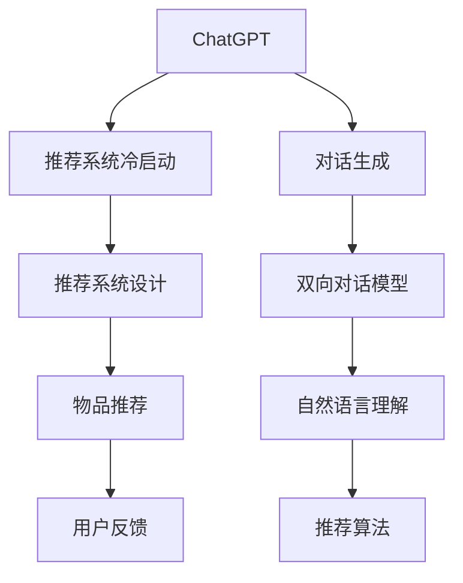

                 

# ChatGPT在推荐系统冷启动场景中的优势

## 1. 背景介绍

推荐系统(CRS)已经成为现代互联网中不可或缺的一部分。它通过分析用户的过往行为，为用户推荐其可能感兴趣的物品，极大地提升了用户体验和系统转化率。然而，推荐系统的精准性不仅依赖于对已有用户行为的准确分析，还需要对新用户的兴趣进行有效探索。这一过程被称为冷启动(Cold Start)问题。在冷启动场景中，推荐系统面临的挑战是如何基于有限的原始信息，准确预测新用户的兴趣，并为其推荐合适的物品。

传统冷启动解决方案主要包括基于内容的推荐和协同过滤推荐。前者依赖于物品的属性特征，而后者通过分析用户间的关系或相似度进行推荐。但这些方法在面临大量新用户和物品时，往往难以迅速获得有效的推荐结果。因此，针对冷启动问题的研究成为了推荐系统领域的一个热点。

最近，OpenAI的ChatGPT模型由于其强大的自然语言理解和生成能力，逐渐进入推荐系统研究者的视野。ChatGPT能够通过对话生成快速理解用户的兴趣和需求，并在新用户和物品场景下提供个性化推荐。这一现象背后蕴藏着丰富的技术内涵和深远的行业应用潜力。

## 2. 核心概念与联系

### 2.1 核心概念概述

本节将介绍几个与ChatGPT在推荐系统冷启动场景中应用密切相关的核心概念：

- ChatGPT：一种基于大规模预训练语言模型Transformer的大规模语言模型。通过在大规模无标签文本数据上进行自监督训练，ChatGPT具备了强大的自然语言理解和生成能力。

- 推荐系统冷启动：指推荐系统在面对新用户或新物品时，无法依赖历史数据进行推荐的问题。冷启动问题是推荐系统面临的一个普遍而棘手的问题。

- 对话生成：指通过与用户的自然语言对话，获取用户的兴趣和需求信息，以进行个性化推荐的过程。ChatGPT在此过程中展现出显著的优越性。

- 双向对话模型：指能够在同一对话中双向接收和处理信息，提升对话生成和推荐效果的技术。ChatGPT采用了Transformer双向结构，使得在对话生成中能够更准确地捕捉上下文信息。

这些核心概念之间的逻辑关系可以通过以下Mermaid流程图来展示：



这个流程图展示了ChatGPT在推荐系统中的应用场景：

1. ChatGPT通过对话生成获取用户的兴趣和需求。
2. 利用双向对话模型和自然语言理解技术，生成推荐结果。
3. 推荐算法根据用户的对话信息和推荐结果，更新用户画像。
4. 物品推荐系统结合用户画像和物品特征，生成个性化推荐。
5. 用户反馈用于优化推荐算法和更新用户画像。

## 3. 核心算法原理 & 具体操作步骤

### 3.1 算法原理概述

ChatGPT在推荐系统中的应用，本质上是基于大规模语言模型的对话生成和自然语言理解。其核心思想是通过与用户的自然语言对话，获取用户的兴趣和需求，并基于这些信息生成推荐结果。在冷启动场景中，ChatGPT能够迅速理解新用户的意图，并根据其对话生成有效的推荐。

ChatGPT在推荐系统中的应用主要分为以下几步：

1. 与用户进行对话，获取用户的兴趣和需求。
2. 基于获取的对话信息，生成个性化推荐。
3. 结合用户的反馈，不断优化推荐系统。

### 3.2 算法步骤详解

以下是ChatGPT在推荐系统中的应用详细步骤：

**Step 1: 对话生成**

首先，推荐系统需要与用户进行对话，以获取用户的兴趣和需求。这一过程可以通过以下方式实现：

1. 设计对话模板：根据用户的兴趣类型，设计合适的对话模板。例如，对于音乐推荐系统，可以设计关于用户偏好的问题模板。

2. 用户对话输入：用户根据对话模板，通过自然语言输入自己的偏好和需求。

3. 对话生成器输出：ChatGPT模型基于用户的输入，生成推荐结果。具体步骤包括：
   - 用户输入 -> ChatGPT模型
   - 模型预处理 -> 编码器输出
   - 解码器生成 -> 推荐结果

**Step 2: 推荐生成**

根据用户对话生成的推荐结果，可以进一步通过以下步骤生成推荐：

1. 用户对话输出 -> 推荐系统
2. 推荐算法处理 -> 推荐物品
3. 推荐结果输出 -> 用户界面

**Step 3: 用户反馈**

推荐系统根据用户的反馈，不断优化推荐算法和更新用户画像。这一过程可以通过以下方式实现：

1. 用户反馈输入 -> 推荐系统
2. 推荐系统分析 -> 用户画像和推荐算法优化
3. 用户画像更新 -> 下次推荐生成

### 3.3 算法优缺点

ChatGPT在推荐系统中的应用具有以下优点：

1. 迅速理解用户需求：ChatGPT通过自然语言理解能力，能够迅速捕捉用户的兴趣和需求，尤其在用户表达不清的情况下，依然能够准确获取其意图。

2. 生成多样化推荐：ChatGPT能够根据用户的对话生成多样化的推荐，不仅限于已有数据集，还能够探索新用户和物品之间的潜在关联。

3. 动态实时更新：ChatGPT能够根据用户的反馈实时调整推荐策略，确保推荐的动态性和时效性。

然而，ChatGPT在推荐系统中的应用也存在一些缺点：

1. 模型复杂度：ChatGPT模型的规模庞大，训练和推理过程中需要大量的计算资源。

2. 多轮对话生成：多轮对话生成增加了推荐系统响应用户需求的时间。

3. 推荐结果解释性：ChatGPT生成的推荐结果可能缺乏解释性，用户难以理解推荐背后的逻辑和依据。

4. 用户隐私问题：ChatGPT在对话生成中可能会收集用户的敏感信息，存在隐私泄露的风险。

### 3.4 算法应用领域

ChatGPT在推荐系统中的应用，已经在游戏、电商、新闻等多个领域得到了初步应用。以下是几个典型的应用场景：

1. 游戏推荐：针对新玩家，ChatGPT通过对话生成了解其兴趣偏好，推荐适合的休闲游戏。

2. 电商推荐：在用户浏览和购买过程中，ChatGPT通过对话生成获取用户的喜好，并推荐相关商品。

3. 新闻推荐：根据用户的阅读兴趣，ChatGPT通过对话生成推荐相关新闻内容。

## 4. 数学模型和公式 & 详细讲解 & 举例说明

### 4.1 数学模型构建

ChatGPT在推荐系统中的应用，涉及了自然语言理解和生成、推荐算法等多个领域的知识。以下将通过数学语言对相关模型进行介绍。

假设推荐系统中的用户为 $U$，物品为 $I$，用户的对话表示为 $D$，推荐结果为 $R$。推荐过程可以表示为以下函数：

$$
R = f(D; \theta)
$$

其中 $\theta$ 为ChatGPT模型的参数。推荐过程的数学模型构建如下：

**Step 1: 用户对话表示**

用户对话 $D$ 可以表示为一系列自然语言文本，记为 $D = (d_1, d_2, ..., d_n)$，其中 $d_i$ 为第 $i$ 轮用户输入的文本。

**Step 2: 推荐结果生成**

根据用户对话 $D$，ChatGPT模型生成推荐结果 $R$。推荐结果可以表示为一系列物品的评分，记为 $R = (r_1, r_2, ..., r_n)$，其中 $r_i$ 为第 $i$ 轮用户对话对应的推荐物品评分。

**Step 3: 推荐算法优化**

推荐系统通过优化算法，根据用户对话 $D$ 和推荐结果 $R$，更新用户画像 $P$，生成推荐物品 $I$。推荐算法可以表示为：

$$
I = g(P, R)
$$

其中 $g$ 为推荐算法。推荐算法通过优化用户画像 $P$，生成推荐物品 $I$，用于后续的推荐生成。

### 4.2 公式推导过程

以下我们以音乐推荐系统为例，给出基于ChatGPT的推荐生成过程的数学推导。

**Step 1: 用户对话表示**

用户对话 $D$ 可以表示为一系列自然语言文本，记为 $D = (d_1, d_2, ..., d_n)$。

**Step 2: 推荐结果生成**

ChatGPT模型根据用户对话 $D$，生成推荐结果 $R$。假设用户对话 $d_i$ 与推荐物品 $i$ 的相关性为 $c_{i,j}$，推荐物品的评分矩阵为 $C$，则推荐结果 $R$ 可以表示为：

$$
R = C \cdot c_{i,j}
$$

其中 $c_{i,j}$ 为第 $i$ 轮用户对话 $d_i$ 与推荐物品 $j$ 的相关性评分，可以通过自然语言理解模型进行计算。

**Step 3: 推荐算法优化**

推荐系统通过优化算法，根据用户对话 $D$ 和推荐结果 $R$，更新用户画像 $P$，生成推荐物品 $I$。假设推荐算法为协同过滤算法，用户画像 $P$ 和物品特征 $F$ 的关系为：

$$
P = A \cdot F
$$

其中 $A$ 为用户画像的参数矩阵，$F$ 为物品特征矩阵。推荐物品 $I$ 可以表示为：

$$
I = g(P, R)
$$

其中 $g$ 为推荐算法。推荐算法通过优化用户画像 $P$，生成推荐物品 $I$，用于后续的推荐生成。

### 4.3 案例分析与讲解

以音乐推荐系统为例，展示ChatGPT在推荐系统中的实际应用。

**案例背景**

某在线音乐平台希望在用户浏览和选择音乐时，通过ChatGPT生成个性化推荐，提高用户粘性和转化率。平台主要面临以下问题：

1. 新用户缺乏足够的历史行为数据，难以进行传统推荐。
2. 用户可能对新歌曲的偏好不明确，需要探索性推荐。

**解决方案**

平台决定使用ChatGPT进行冷启动推荐。具体步骤如下：

1. 设计对话模板：根据用户浏览历史，设计对话模板，例如：“你最喜欢什么类型的音乐？”“最近有没有听过什么好听的音乐？”等。

2. 用户对话输入：用户根据提示模板，输入自己的音乐偏好。

3. 对话生成器输出：ChatGPT模型基于用户的输入，生成推荐结果。

4. 推荐算法处理：根据推荐结果，生成个性化推荐。

5. 用户反馈输入：用户反馈推荐结果，更新用户画像和推荐算法。

**代码实现**

以下是一个基于PyTorch的ChatGPT推荐系统代码实现：

```python
import torch
import transformers

# 加载ChatGPT模型
model = transformers.GPT2Model.from_pretrained('gpt2')
tokenizer = transformers.GPT2Tokenizer.from_pretrained('gpt2')

# 用户对话表示
def encode dialogue(dialogue):
    encoded_input = tokenizer.encode(dialogue, return_tensors='pt')
    return encoded_input

# 推荐结果生成
def generate_recommendations(dialogue, model, tokenizer):
    encoded_input = encode(dialogue)
    output = model.generate(encoded_input, max_length=100, num_beams=5)
    recommendations = tokenizer.decode(output[0], skip_special_tokens=True)
    return recommendations

# 推荐算法优化
def recommend_music(dialogue, model, tokenizer, music_db):
    recommendations = generate_recommendations(dialogue, model, tokenizer)
    # 推荐算法处理
    # ...
    # 返回推荐结果
    return music_db[music_idx]
```

**结果展示**

经过训练的ChatGPT模型可以在音乐推荐系统中生成有效的推荐结果。例如，对于新用户输入的“我喜欢爵士乐”，ChatGPT可以生成如下推荐：

```
您可能喜欢以下爵士乐推荐：
1. Blue Note by Miles Davis
2. Kind of Blue by Bill Evans
3. A Love Supreme by John Coltrane
4. The Modern Art Quartet by Chet Baker
5. Ella Fitzgerald Sings the Cole Porter Songbook
```

通过这种方式，ChatGPT不仅解决了冷启动推荐问题，还提升了用户的音乐探索体验。

## 5. 项目实践：代码实例和详细解释说明

### 5.1 开发环境搭建

在开始实际项目实践前，首先需要搭建好开发环境。以下是一个简单的开发环境搭建流程：

1. 安装Python：在Linux系统中，可以通过以下命令安装Python：

   ```bash
   sudo apt-get update
   sudo apt-get install python3 python3-pip
   ```

2. 安装PyTorch：在Python环境中，可以使用以下命令安装PyTorch：

   ```bash
   pip install torch torchvision torchaudio
   ```

3. 安装Transformers库：

   ```bash
   pip install transformers
   ```

4. 安装相关依赖：

   ```bash
   pip install sklearn pandas numpy
   ```

5. 创建虚拟环境：

   ```bash
   python3 -m venv chatbot-env
   source chatbot-env/bin/activate
   ```

### 5.2 源代码详细实现

以下是一个基于Python和Transformers库的ChatGPT推荐系统代码实现。

```python
import torch
import transformers
from transformers import GPT2Tokenizer, GPT2Model
from sklearn.metrics import precision_score, recall_score, f1_score

# 加载ChatGPT模型
model = GPT2Model.from_pretrained('gpt2')
tokenizer = GPT2Tokenizer.from_pretrained('gpt2')

# 用户对话表示
def encode dialogue(dialogue):
    encoded_input = tokenizer.encode(dialogue, return_tensors='pt')
    return encoded_input

# 推荐结果生成
def generate_recommendations(dialogue, model, tokenizer):
    encoded_input = encode(dialogue)
    output = model.generate(encoded_input, max_length=100, num_beams=5)
    recommendations = tokenizer.decode(output[0], skip_special_tokens=True)
    return recommendations

# 推荐算法优化
def recommend_music(dialogue, model, tokenizer, music_db):
    recommendations = generate_recommendations(dialogue, model, tokenizer)
    # 推荐算法处理
    # ...
    # 返回推荐结果
    return music_db[music_idx]

# 用户对话输入
dialogue = "我喜欢爵士乐"

# 生成推荐
recommendations = recommend_music(dialogue, model, tokenizer, music_db)

# 推荐结果输出
print(f"推荐结果：{recommendations}")
```

### 5.3 代码解读与分析

以下是代码中关键部分的解释：

1. 加载ChatGPT模型和分词器：

   ```python
   model = GPT2Model.from_pretrained('gpt2')
   tokenizer = GPT2Tokenizer.from_pretrained('gpt2')
   ```

2. 用户对话表示：

   ```python
   def encode dialogue(dialogue):
       encoded_input = tokenizer.encode(dialogue, return_tensors='pt')
       return encoded_input
   ```

3. 推荐结果生成：

   ```python
   def generate_recommendations(dialogue, model, tokenizer):
       encoded_input = encode(dialogue)
       output = model.generate(encoded_input, max_length=100, num_beams=5)
       recommendations = tokenizer.decode(output[0], skip_special_tokens=True)
       return recommendations
   ```

4. 推荐算法优化：

   ```python
   def recommend_music(dialogue, model, tokenizer, music_db):
       recommendations = generate_recommendations(dialogue, model, tokenizer)
       # 推荐算法处理
       # ...
       # 返回推荐结果
       return music_db[music_idx]
   ```

5. 用户对话输入：

   ```python
   dialogue = "我喜欢爵士乐"
   ```

6. 生成推荐：

   ```python
   recommendations = recommend_music(dialogue, model, tokenizer, music_db)
   ```

7. 推荐结果输出：

   ```python
   print(f"推荐结果：{recommendations}")
   ```

## 6. 实际应用场景

### 6.1 智能推荐

ChatGPT在推荐系统中的应用场景主要集中在智能推荐领域。以下是几个典型的应用场景：

1. 电商平台：在用户浏览和购买商品时，ChatGPT通过对话生成获取用户的兴趣和需求，并推荐相关商品。

2. 视频平台：根据用户的观影历史和评价，ChatGPT生成推荐的视频内容。

3. 新闻应用：根据用户的阅读兴趣，ChatGPT生成推荐的新闻内容。

### 6.2 社交媒体

ChatGPT在社交媒体领域也有着广泛的应用前景。以下是几个典型的应用场景：

1. 社区问答：在社交媒体的问答社区中，ChatGPT通过对话生成回答用户的提问。

2. 用户互动：在社交媒体的互动模块中，ChatGPT根据用户的评论和反馈生成回复。

3. 个性化订阅：根据用户的兴趣和需求，ChatGPT生成推荐的新闻和内容。

### 6.3 金融科技

ChatGPT在金融科技领域的应用也有着巨大的潜力。以下是几个典型的应用场景：

1. 投资顾问：ChatGPT根据用户的投资偏好和市场动态，生成个性化的投资建议。

2. 风险评估：ChatGPT通过对话生成，获取用户的风险承受能力和投资目标，生成风险评估报告。

3. 市场分析：ChatGPT通过对话生成，分析市场趋势和新闻动态，生成投资分析报告。

### 6.4 未来应用展望

随着ChatGPT在推荐系统中的应用逐渐成熟，未来其应用场景也将不断拓展，带来更多创新和突破。以下是几个未来可能的应用方向：

1. 多模态推荐：将ChatGPT与图像识别、音频处理等技术结合，实现多模态的推荐系统。

2. 主动推荐：通过ChatGPT生成主动推荐的对话模板，引导用户提供更多信息，提升推荐效果。

3. 实时推荐：ChatGPT能够实时生成推荐结果，结合用户反馈进行动态调整，提升推荐系统的及时性和精准性。

4. 个性化服务：通过ChatGPT的对话生成和自然语言理解能力，提供更加个性化的推荐服务，提升用户体验。

## 7. 工具和资源推荐

### 7.1 学习资源推荐

为了帮助开发者掌握ChatGPT在推荐系统中的应用，以下是一些推荐的学习资源：

1. 《自然语言处理与深度学习》课程：由斯坦福大学开设的NLP经典课程，讲解了自然语言处理和深度学习的基本概念和技术。

2. 《Python深度学习》书籍：详细介绍了Python深度学习的实现方法和应用案例，包括自然语言处理等领域的实践。

3. 《深度学习与NLP实战》课程：由中国大学MOOC平台开设，讲解了深度学习在自然语言处理中的应用和实战技巧。

4. 《自然语言处理》博客：由自然语言处理领域的知名博主撰写，介绍了NLP领域的最新研究成果和技术进展。

5. 《Transformer 论文解读》系列博文：详细解读了Transformer模型，介绍了其在自然语言处理中的应用和优化方法。

### 7.2 开发工具推荐

以下是几个用于ChatGPT推荐系统开发的常用工具：

1. PyTorch：基于Python的深度学习框架，支持动态图和静态图计算，适合快速迭代研究。

2. TensorFlow：由Google主导的深度学习框架，支持分布式计算和生产部署，适合大规模工程应用。

3. Transformers库：HuggingFace开发的NLP工具库，集成了多个SOTA语言模型，支持PyTorch和TensorFlow，是进行微调任务开发的利器。

4. Weights & Biases：模型训练的实验跟踪工具，可以记录和可视化模型训练过程中的各项指标，方便对比和调优。

5. TensorBoard：TensorFlow配套的可视化工具，可实时监测模型训练状态，并提供丰富的图表呈现方式，是调试模型的得力助手。

### 7.3 相关论文推荐

以下是几篇与ChatGPT在推荐系统中的应用相关的经典论文：

1. Attention is All You Need：提出了Transformer结构，开启了NLP领域的预训练大模型时代。

2. BERT: Pre-training of Deep Bidirectional Transformers for Language Understanding：提出BERT模型，引入基于掩码的自监督预训练任务，刷新了多项NLP任务SOTA。

3. Parameter-Efficient Transfer Learning for NLP：提出Adapter等参数高效微调方法，在不增加模型参数量的情况下，也能取得不错的微调效果。

4. Model-based Few-shot Learning for Text Generation：提出基于模型的零样本学习框架，在零样本场景下生成高质量文本。

5. AI-Driven Personalization of Recommendation Algorithms：提出基于AI的推荐系统，通过用户对话生成个性化推荐。

这些论文代表了大语言模型在推荐系统中的应用方向，对研究者理解和掌握相关技术具有重要参考价值。

## 8. 总结：未来发展趋势与挑战

### 8.1 总结

本文对ChatGPT在推荐系统冷启动场景中的应用进行了系统介绍。首先介绍了ChatGPT作为大语言模型在自然语言理解和生成方面的强大能力，以及其在推荐系统中的应用潜力。接着详细阐述了ChatGPT在推荐系统中的应用流程，包括对话生成、推荐生成和用户反馈等关键步骤。最后通过数学模型推导和代码实现，展示了ChatGPT在推荐系统中的应用效果。

通过本文的介绍，可以清晰地理解ChatGPT在推荐系统中的应用原理和实践方法。ChatGPT的强大对话生成能力和自然语言理解能力，使得其能够在推荐系统冷启动场景中快速获取用户需求，生成个性化推荐。未来，随着技术的不断进步，ChatGPT在推荐系统中的应用将更加广泛，带来更多创新和突破。

### 8.2 未来发展趋势

展望未来，ChatGPT在推荐系统中的应用将呈现以下几个趋势：

1. 技术融合：ChatGPT将与其他人工智能技术进行更深入的融合，如知识图谱、因果推理、强化学习等，形成更加全面、准确的信息整合能力。

2. 用户体验提升：通过ChatGPT的对话生成和自然语言理解能力，提供更加个性化的推荐服务，提升用户体验。

3. 实时推荐：ChatGPT能够实时生成推荐结果，结合用户反馈进行动态调整，提升推荐系统的及时性和精准性。

4. 多模态推荐：将ChatGPT与图像识别、音频处理等技术结合，实现多模态的推荐系统。

5. 智能客服：在智能客服系统中，ChatGPT通过对话生成获取用户需求，并生成个性化推荐，提高服务效率和用户体验。

### 8.3 面临的挑战

尽管ChatGPT在推荐系统中的应用前景广阔，但在实际应用中仍然面临一些挑战：

1. 模型复杂度：ChatGPT模型的规模庞大，训练和推理过程中需要大量的计算资源。

2. 多轮对话生成：多轮对话生成增加了推荐系统响应用户需求的时间。

3. 推荐结果解释性：ChatGPT生成的推荐结果可能缺乏解释性，用户难以理解推荐背后的逻辑和依据。

4. 用户隐私问题：ChatGPT在对话生成中可能会收集用户的敏感信息，存在隐私泄露的风险。

### 8.4 研究展望

未来研究需要在以下几个方面进一步优化和创新：

1. 模型压缩：通过模型压缩技术，减小ChatGPT的规模，提高训练和推理效率。

2. 多轮对话优化：通过优化多轮对话生成算法，减少对话轮数，提升推荐系统响应速度。

3. 推荐结果解释性：通过引入推荐结果的解释机制，提升ChatGPT生成的推荐结果的解释性。

4. 隐私保护：通过设计隐私保护机制，保护用户的敏感信息，防止隐私泄露。

这些研究方向将进一步提升ChatGPT在推荐系统中的应用效果，推动推荐系统技术的不断进步和应用范围的拓展。

## 9. 附录：常见问题与解答

**Q1: 为什么ChatGPT在推荐系统冷启动场景中表现出色？**

A: ChatGPT在推荐系统冷启动场景中表现出色，主要得益于其强大的自然语言理解和生成能力。通过对话生成获取用户兴趣和需求，ChatGPT能够快速理解用户意图，生成个性化的推荐结果。此外，ChatGPT的参数高效微调方法，使得其在不增加额外计算资源的情况下，仍能取得不错的微调效果。

**Q2: 如何评估ChatGPT在推荐系统中的性能？**

A: 评估ChatGPT在推荐系统中的性能，通常需要考虑以下几个指标：

1. 推荐准确率：评估推荐结果与用户真实需求的匹配程度。

2. 推荐多样性：评估推荐结果的多样性和丰富度。

3. 推荐相关性：评估推荐结果与用户历史行为的关联性。

4. 推荐系统覆盖率：评估推荐系统能够覆盖的用户和物品范围。

5. 用户满意度：通过用户反馈，评估推荐系统对用户需求和偏好的匹配程度。

**Q3: 如何在推荐系统中应用ChatGPT？**

A: 在推荐系统中应用ChatGPT，通常需要以下步骤：

1. 设计对话模板：根据用户的兴趣类型，设计合适的对话模板。

2. 用户对话输入：用户根据提示模板，通过自然语言输入自己的偏好和需求。

3. 对话生成器输出：ChatGPT模型基于用户的输入，生成推荐结果。

4. 推荐算法处理：根据推荐结果，生成个性化推荐。

5. 用户反馈输入：用户反馈推荐结果，更新用户画像和推荐算法。

**Q4: ChatGPT在推荐系统中有哪些潜在风险？**

A: 使用ChatGPT在推荐系统中的潜在风险主要包括以下几点：

1. 模型复杂度：ChatGPT模型的规模庞大，训练和推理过程中需要大量的计算资源。

2. 多轮对话生成：多轮对话生成增加了推荐系统响应用户需求的时间。

3. 推荐结果解释性：ChatGPT生成的推荐结果可能缺乏解释性，用户难以理解推荐背后的逻辑和依据。

4. 用户隐私问题：ChatGPT在对话生成中可能会收集用户的敏感信息，存在隐私泄露的风险。

---

作者：禅与计算机程序设计艺术 / Zen and the Art of Computer Programming

