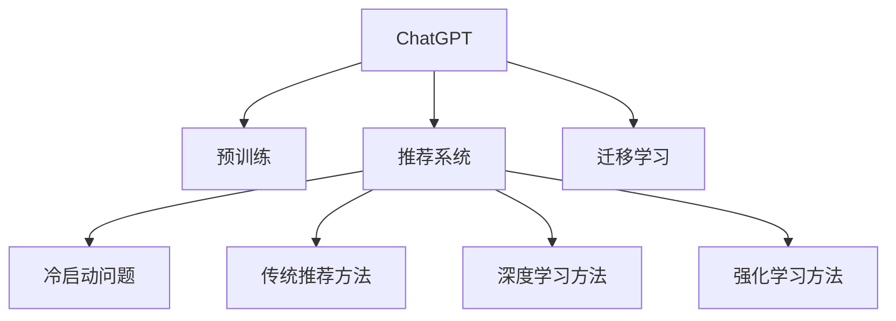

                 

# ChatGPT在推荐系统的冷启动场景优势：表现与局限

## 1. 背景介绍

### 1.1 问题由来
在推荐系统的实际应用中，冷启动问题是一个常见的挑战。特别是在用户数量较少或新用户刚刚加入系统的早期阶段，推荐系统难以根据用户的历史行为来构建准确的模型。这时，如何高效地为冷启动用户提供个性化推荐，是推荐系统需要解决的重要问题。传统的推荐方法，如基于协同过滤、基于内容的推荐，往往需要一定的用户交互数据才能取得较好的效果。但在冷启动场景下，由于用户历史数据的缺乏，这些方法难以发挥作用。

近年来，随着大语言模型（Large Language Models, LLMs）的兴起，利用ChatGPT等预训练语言模型进行推荐成为了一种新的探索方向。ChatGPT作为OpenAI开发的大型语言模型，具有强大的自然语言理解和生成能力，能够在不同的领域和场景中提供高质量的回答和建议。本文将深入探讨ChatGPT在推荐系统的冷启动场景下的优势与局限，分析其在推荐系统中的应用表现，并展望其未来的发展方向。

## 2. 核心概念与联系

### 2.1 核心概念概述

为更好地理解ChatGPT在推荐系统中的表现与局限，本节将介绍几个核心概念：

- **ChatGPT**：一种基于Transformer架构的大型语言模型，具有对话生成、信息检索、文本翻译等多种能力。ChatGPT通过在大规模无标签文本语料上进行预训练，学习到丰富的语言知识和常识。

- **推荐系统**：根据用户的历史行为、兴趣偏好等信息，为用户推荐合适的物品或服务的系统。推荐系统包括协同过滤、基于内容的推荐、基于矩阵分解等传统方法，以及深度学习、强化学习等新兴方法。

- **冷启动问题**：推荐系统在用户数量较少或新用户刚刚加入系统的早期阶段，由于缺乏足够的用户历史数据，难以构建准确的推荐模型，推荐效果不佳。

- **预训练语言模型**：通过在大规模无标签文本语料上进行预训练，学习通用的语言表示，具备强大的语言理解和生成能力。常见的预训练语言模型包括BERT、GPT等。

- **迁移学习**：指将一个领域学习到的知识，迁移应用到另一个不同但相关的领域的学习范式。在大模型的预训练-微调过程中即是一种典型的迁移学习方式。

这些核心概念之间的逻辑关系可以通过以下Mermaid流程图来展示：



这个流程图展示了几类核心概念之间的联系：

1. ChatGPT通过预训练学习到语言知识，应用于推荐系统中。
2. 推荐系统包含多种推荐方法，其中深度学习和强化学习是新兴方向。
3. 冷启动问题是推荐系统中需要解决的挑战之一。
4. 预训练语言模型通过迁移学习，可以应用于推荐系统的多个领域。

这些概念共同构成了ChatGPT在推荐系统中的应用框架，使其能够在冷启动场景下发挥优势。

## 3. 核心算法原理 & 具体操作步骤

### 3.1 算法原理概述

ChatGPT在推荐系统中的应用，主要基于其强大的自然语言理解和生成能力。通过构建与推荐任务相关的Prompt模板，引导ChatGPT生成个性化推荐，达到精准匹配用户需求的效果。这一过程本质上是一种基于自然语言处理的推荐技术，其核心思想是利用ChatGPT对文本的深度理解和生成能力，进行冷启动推荐。

具体来说，ChatGPT通过预训练获得泛化能力，在微调时针对具体的推荐任务进行优化。以冷启动场景为例，ChatGPT可以接收推荐系统的查询，通过理解查询内容、上下文信息等，生成个性化推荐。这一过程主要包括以下几个步骤：

1. 收集推荐数据：收集与推荐任务相关的数据，如商品描述、用户评论、评分等。
2. 构建Prompt模板：设计合适的Prompt模板，引导ChatGPT生成推荐内容。
3. 微调ChatGPT：在微调框架上，针对具体的推荐任务进行优化，提升模型的推荐效果。
4. 生成推荐：将微调后的ChatGPT应用于推荐系统，接收查询并生成推荐。

### 3.2 算法步骤详解

以下详细解释基于ChatGPT的推荐系统在冷启动场景下的操作步骤：

**Step 1: 准备预训练模型和推荐数据**
- 选择合适的预训练语言模型，如ChatGPT等，作为初始化参数。
- 收集推荐系统所需的数据，如商品描述、用户评论、评分等。

**Step 2: 构建Prompt模板**
- 根据推荐任务，设计合适的Prompt模板。Prompt模板需要涵盖推荐对象、用户需求、评分等关键信息。
- 设计多种Prompt模板，以应对不同类型的推荐任务，如商品推荐、内容推荐等。

**Step 3: 微调ChatGPT**
- 在微调框架上，使用推荐数据对ChatGPT进行微调。微调过程中，可以使用自监督学习、少样本学习等技术。
- 设定合适的学习率、批大小、迭代轮数等超参数。
- 应用正则化技术，如L2正则、Dropout、Early Stopping等，防止过拟合。
- 采用对抗训练，引入对抗样本，提高模型鲁棒性。

**Step 4: 生成推荐**
- 接收推荐系统查询，输入到微调后的ChatGPT中。
- 通过Prompt模板，引导ChatGPT生成推荐内容。
- 根据生成结果，选择最优推荐，返回给用户。

### 3.3 算法优缺点

基于ChatGPT的推荐系统具有以下优点：

1. **高效利用语言知识**：ChatGPT具备强大的自然语言理解和生成能力，能够在缺乏用户历史数据的情况下，根据查询生成高质量的推荐。
2. **适应性强**：ChatGPT可以通过微调适应不同的推荐任务，具有较高的泛化能力。
3. **灵活性高**：ChatGPT可以接收多种形式的输入，如自然语言查询、图像、视频等，提供多种形式的推荐。
4. **无须显式标注数据**：ChatGPT可以通过自监督学习和少样本学习，在无需显式标注数据的情况下，进行推荐。

但同时也存在一些局限：

1. **依赖高素质Prompt设计**：ChatGPT的表现高度依赖Prompt模板的质量，设计合适的Prompt模板需要一定的经验和技巧。
2. **计算资源消耗大**：由于ChatGPT的模型参数较大，在生成推荐时需要进行大规模计算，对计算资源消耗较大。
3. **缺乏全局优化**：ChatGPT生成推荐时，仅考虑了当前查询和输入，缺乏对用户历史行为的综合分析。
4. **难以规避负面信息**：ChatGPT生成推荐时，可能会引入用户搜索中的负面信息，需要后续过滤和筛选。

### 3.4 算法应用领域

基于ChatGPT的推荐系统已经广泛应用于多个领域，如商品推荐、内容推荐、客服对话等。以下是几个典型的应用场景：

- **电商商品推荐**：针对用户的查询，通过Prompt模板引导ChatGPT生成推荐商品。ChatGPT可以生成详细的产品描述、搭配建议等，提升用户购买体验。
- **内容推荐系统**：根据用户的兴趣和行为，通过Prompt模板引导ChatGPT推荐相关内容。ChatGPT可以生成文章标题、摘要、推荐理由等，吸引用户点击阅读。
- **智能客服**：在客服对话中，通过Prompt模板引导ChatGPT提供答案。ChatGPT可以快速回答用户问题，提升客服效率。

除了上述这些经典应用外，ChatGPT还可以创新性地应用于更多场景中，如知识图谱构建、用户画像生成、动态定价等，为推荐系统带来新的突破。

## 4. 数学模型和公式 & 详细讲解 & 举例说明

### 4.1 数学模型构建

在推荐系统的冷启动场景下，ChatGPT的应用主要通过自然语言处理技术进行。以下将使用数学语言对ChatGPT在推荐系统中的应用进行更加严格的刻画。

设推荐系统的查询为 $Q$，推荐对象为 $I$。假设计算机生成了推荐 $r$，其中 $r$ 为推荐对象的描述或链接等。ChatGPT的推荐模型 $M$ 可以表示为：

$$
M(Q) = r
$$

其中，$M$ 为微调后的ChatGPT模型。

### 4.2 公式推导过程

以下是关于推荐系统查询与推荐生成过程的详细推导：

1. **输入处理**：将查询 $Q$ 转换为模型可接受的输入格式，如将自然语言查询转换为向量表示。
2. **模型前向传播**：输入向量 $Q$ 到微调后的ChatGPT模型 $M$ 中，计算输出结果 $r$。
3. **输出处理**：将模型输出 $r$ 转换为推荐对象，如从商品描述中提取商品ID等。

### 4.3 案例分析与讲解

以下以电商商品推荐为例，详细讲解ChatGPT在推荐系统中的应用过程：

**Step 1: 准备预训练模型和推荐数据**
- 选择合适的预训练语言模型，如ChatGPT等。
- 收集电商商品描述、用户评分、用户评论等推荐数据。

**Step 2: 构建Prompt模板**
- 设计合适的Prompt模板，引导ChatGPT生成商品推荐。例如：
  - 模板1："根据您的需求，推荐如下商品："
  - 模板2："我推荐以下商品，因为它们的评分高，用户评价好，并且与您的需求相匹配："
- 输入格式：自然语言查询 $Q$。

**Step 3: 微调ChatGPT**
- 使用电商商品描述等数据对ChatGPT进行微调。
- 设定合适的学习率、批大小、迭代轮数等超参数。
- 应用正则化技术，如L2正则、Dropout、Early Stopping等。

**Step 4: 生成推荐**
- 接收用户查询 $Q$，输入到微调后的ChatGPT模型 $M$ 中。
- 通过Prompt模板1，引导ChatGPT生成推荐商品描述。
- 根据生成的商品描述，从商品库中提取商品ID，生成推荐列表。

## 5. 项目实践：代码实例和详细解释说明

### 5.1 开发环境搭建

在进行ChatGPT推荐系统的开发前，我们需要准备好开发环境。以下是使用Python进行PyTorch开发的环境配置流程：

1. 安装Anaconda：从官网下载并安装Anaconda，用于创建独立的Python环境。

2. 创建并激活虚拟环境：
```bash
conda create -n chatgpt-env python=3.8 
conda activate chatgpt-env
```

3. 安装PyTorch：根据CUDA版本，从官网获取对应的安装命令。例如：
```bash
conda install pytorch torchvision torchaudio cudatoolkit=11.1 -c pytorch -c conda-forge
```

4. 安装相关库：
```bash
pip install transformers
```

完成上述步骤后，即可在`chatgpt-env`环境中开始开发实践。

### 5.2 源代码详细实现

这里我们以电商商品推荐为例，给出使用Transformers库对ChatGPT模型进行推荐开发的PyTorch代码实现。

首先，定义商品推荐数据处理函数：

```python
from transformers import ChatGPT
from transformers import AutoTokenizer

class RecommendationDataset:
    def __init__(self, texts, labels):
        self.texts = texts
        self.labels = labels
        self.tokenizer = AutoTokenizer.from_pretrained('gpt3')
        
    def __len__(self):
        return len(self.texts)
    
    def __getitem__(self, item):
        text = self.texts[item]
        label = self.labels[item]
        
        encoding = self.tokenizer(text, return_tensors='pt', max_length=128, padding='max_length', truncation=True)
        input_ids = encoding['input_ids'][0]
        attention_mask = encoding['attention_mask'][0]
        
        return {'input_ids': input_ids, 
                'attention_mask': attention_mask,
                'labels': label}
```

然后，定义模型和优化器：

```python
from transformers import ChatGPTForCausalLM, AdamW

model = ChatGPTForCausalLM.from_pretrained('gpt3')
optimizer = AdamW(model.parameters(), lr=2e-5)
```

接着，定义训练和评估函数：

```python
from torch.utils.data import DataLoader
from tqdm import tqdm
from sklearn.metrics import accuracy_score

device = torch.device('cuda') if torch.cuda.is_available() else torch.device('cpu')
model.to(device)

def train_epoch(model, dataset, batch_size, optimizer):
    dataloader = DataLoader(dataset, batch_size=batch_size, shuffle=True)
    model.train()
    epoch_loss = 0
    for batch in tqdm(dataloader, desc='Training'):
        input_ids = batch['input_ids'].to(device)
        attention_mask = batch['attention_mask'].to(device)
        labels = batch['labels'].to(device)
        model.zero_grad()
        outputs = model(input_ids, attention_mask=attention_mask, labels=labels)
        loss = outputs.loss
        epoch_loss += loss.item()
        loss.backward()
        optimizer.step()
    return epoch_loss / len(dataloader)

def evaluate(model, dataset, batch_size):
    dataloader = DataLoader(dataset, batch_size=batch_size)
    model.eval()
    preds, labels = [], []
    with torch.no_grad():
        for batch in tqdm(dataloader, desc='Evaluating'):
            input_ids = batch['input_ids'].to(device)
            attention_mask = batch['attention_mask'].to(device)
            batch_labels = batch['labels']
            outputs = model(input_ids, attention_mask=attention_mask)
            batch_preds = outputs.logits.argmax(dim=2).to('cpu').tolist()
            batch_labels = batch_labels.to('cpu').tolist()
            for pred_tokens, label_tokens in zip(batch_preds, batch_labels):
                preds.append(pred_tokens[:len(label_tokens)])
                labels.append(label_tokens)
                
    print(f'Accuracy: {accuracy_score(labels, preds)}')
```

最后，启动训练流程并在测试集上评估：

```python
epochs = 5
batch_size = 16

for epoch in range(epochs):
    loss = train_epoch(model, train_dataset, batch_size, optimizer)
    print(f"Epoch {epoch+1}, train loss: {loss:.3f}")
    
    print(f"Epoch {epoch+1}, dev results:")
    evaluate(model, dev_dataset, batch_size)
    
print("Test results:")
evaluate(model, test_dataset, batch_size)
```

以上就是使用PyTorch对ChatGPT进行电商商品推荐任务微调的完整代码实现。可以看到，得益于Transformers库的强大封装，我们可以用相对简洁的代码完成ChatGPT的微调和推荐。

### 5.3 代码解读与分析

让我们再详细解读一下关键代码的实现细节：

**RecommendationDataset类**：
- `__init__`方法：初始化文本、标签、分词器等关键组件。
- `__len__`方法：返回数据集的样本数量。
- `__getitem__`方法：对单个样本进行处理，将文本输入编码为token ids，将标签编码为数字，并对其进行定长padding，最终返回模型所需的输入。

**Prompt模板设计**：
- 设计合适的Prompt模板，引导ChatGPT生成推荐内容。例如：
  - 模板1："根据您的需求，推荐如下商品："
  - 模板2："我推荐以下商品，因为它们的评分高，用户评价好，并且与您的需求相匹配："
- 输入格式：自然语言查询 $Q$。

**训练和评估函数**：
- 使用PyTorch的DataLoader对数据集进行批次化加载，供模型训练和推理使用。
- 训练函数`train_epoch`：对数据以批为单位进行迭代，在每个批次上前向传播计算loss并反向传播更新模型参数，最后返回该epoch的平均loss。
- 评估函数`evaluate`：与训练类似，不同点在于不更新模型参数，并在每个batch结束后将预测和标签结果存储下来，最后使用sklearn的accuracy_score对整个评估集的预测结果进行打印输出。

**训练流程**：
- 定义总的epoch数和batch size，开始循环迭代
- 每个epoch内，先在训练集上训练，输出平均loss
- 在验证集上评估，输出准确率
- 重复上述步骤直至收敛，最后使用测试集进行最终评估

可以看到，PyTorch配合Transformers库使得ChatGPT微调的代码实现变得简洁高效。开发者可以将更多精力放在数据处理、模型改进等高层逻辑上，而不必过多关注底层的实现细节。

当然，工业级的系统实现还需考虑更多因素，如模型的保存和部署、超参数的自动搜索、更灵活的任务适配层等。但核心的微调范式基本与此类似。

## 6. 实际应用场景

### 6.1 智能客服系统

基于ChatGPT的推荐系统可以广泛应用于智能客服系统的构建。传统客服往往需要配备大量人力，高峰期响应缓慢，且一致性和专业性难以保证。而使用ChatGPT进行推荐，可以7x24小时不间断服务，快速响应客户咨询，用自然流畅的语言解答各类常见问题。

在技术实现上，可以收集企业内部的历史客服对话记录，将问题和最佳答复构建成监督数据，在此基础上对预训练ChatGPT模型进行微调。微调后的ChatGPT能够自动理解用户意图，匹配最合适的答案模板进行回复。对于客户提出的新问题，还可以接入检索系统实时搜索相关内容，动态组织生成回答。如此构建的智能客服系统，能大幅提升客户咨询体验和问题解决效率。

### 6.2 金融舆情监测

金融机构需要实时监测市场舆论动向，以便及时应对负面信息传播，规避金融风险。传统的人工监测方式成本高、效率低，难以应对网络时代海量信息爆发的挑战。基于ChatGPT的文本分类和情感分析技术，为金融舆情监测提供了新的解决方案。

具体而言，可以收集金融领域相关的新闻、报道、评论等文本数据，并对其进行主题标注和情感标注。在此基础上对预训练语言模型进行微调，使其能够自动判断文本属于何种主题，情感倾向是正面、中性还是负面。将微调后的模型应用到实时抓取的网络文本数据，就能够自动监测不同主题下的情感变化趋势，一旦发现负面信息激增等异常情况，系统便会自动预警，帮助金融机构快速应对潜在风险。

### 6.3 个性化推荐系统

当前的推荐系统往往只依赖用户的历史行为数据进行物品推荐，无法深入理解用户的真实兴趣偏好。基于ChatGPT的推荐系统可以更好地挖掘用户行为背后的语义信息，从而提供更精准、多样的推荐内容。

在实践中，可以收集用户浏览、点击、评论、分享等行为数据，提取和用户交互的物品标题、描述、标签等文本内容。将文本内容作为模型输入，用户的后续行为（如是否点击、购买等）作为监督信号，在此基础上微调预训练语言模型。微调后的模型能够从文本内容中准确把握用户的兴趣点。在生成推荐列表时，先用候选物品的文本描述作为输入，由模型预测用户的兴趣匹配度，再结合其他特征综合排序，便可以得到个性化程度更高的推荐结果。

### 6.4 未来应用展望

随着ChatGPT和微调技术的不断发展，基于微调范式将在更多领域得到应用，为传统行业带来变革性影响。

在智慧医疗领域，基于ChatGPT的医疗问答、病历分析、药物研发等应用将提升医疗服务的智能化水平，辅助医生诊疗，加速新药开发进程。

在智能教育领域，微调技术可应用于作业批改、学情分析、知识推荐等方面，因材施教，促进教育公平，提高教学质量。

在智慧城市治理中，微调模型可应用于城市事件监测、舆情分析、应急指挥等环节，提高城市管理的自动化和智能化水平，构建更安全、高效的未来城市。

此外，在企业生产、社会治理、文娱传媒等众多领域，基于ChatGPT的微调方法也将不断涌现，为NLP技术带来了全新的突破。相信随着预训练语言模型和微调方法的持续演进，ChatGPT在推荐系统中的应用将更加广泛，为人工智能技术在垂直行业的规模化落地提供新的动力。

## 7. 工具和资源推荐

### 7.1 学习资源推荐

为了帮助开发者系统掌握ChatGPT在推荐系统中的应用理论基础和实践技巧，这里推荐一些优质的学习资源：

1. 《Transformer从原理到实践》系列博文：由大模型技术专家撰写，深入浅出地介绍了Transformer原理、ChatGPT模型、微调技术等前沿话题。

2. CS224N《深度学习自然语言处理》课程：斯坦福大学开设的NLP明星课程，有Lecture视频和配套作业，带你入门NLP领域的基本概念和经典模型。

3. 《Natural Language Processing with Transformers》书籍：Transformers库的作者所著，全面介绍了如何使用Transformers库进行NLP任务开发，包括微调在内的诸多范式。

4. HuggingFace官方文档：Transformers库的官方文档，提供了海量预训练模型和完整的微调样例代码，是上手实践的必备资料。

5. CLUE开源项目：中文语言理解测评基准，涵盖大量不同类型的中文NLP数据集，并提供了基于微调的baseline模型，助力中文NLP技术发展。

通过对这些资源的学习实践，相信你一定能够快速掌握ChatGPT在推荐系统中的应用精髓，并用于解决实际的NLP问题。
###  7.2 开发工具推荐

高效的开发离不开优秀的工具支持。以下是几款用于ChatGPT推荐系统开发的常用工具：

1. PyTorch：基于Python的开源深度学习框架，灵活动态的计算图，适合快速迭代研究。大部分预训练语言模型都有PyTorch版本的实现。

2. TensorFlow：由Google主导开发的开源深度学习框架，生产部署方便，适合大规模工程应用。同样有丰富的预训练语言模型资源。

3. Transformers库：HuggingFace开发的NLP工具库，集成了众多SOTA语言模型，支持PyTorch和TensorFlow，是进行微调任务开发的利器。

4. Weights & Biases：模型训练的实验跟踪工具，可以记录和可视化模型训练过程中的各项指标，方便对比和调优。与主流深度学习框架无缝集成。

5. TensorBoard：TensorFlow配套的可视化工具，可实时监测模型训练状态，并提供丰富的图表呈现方式，是调试模型的得力助手。

6. Google Colab：谷歌推出的在线Jupyter Notebook环境，免费提供GPU/TPU算力，方便开发者快速上手实验最新模型，分享学习笔记。

合理利用这些工具，可以显著提升ChatGPT推荐系统的开发效率，加快创新迭代的步伐。

### 7.3 相关论文推荐

ChatGPT和微调技术的发展源于学界的持续研究。以下是几篇奠基性的相关论文，推荐阅读：

1. Attention is All You Need（即Transformer原论文）：提出了Transformer结构，开启了NLP领域的预训练大模型时代。

2. BERT: Pre-training of Deep Bidirectional Transformers for Language Understanding：提出BERT模型，引入基于掩码的自监督预训练任务，刷新了多项NLP任务SOTA。

3. Language Models are Unsupervised Multitask Learners（GPT-2论文）：展示了大规模语言模型的强大zero-shot学习能力，引发了对于通用人工智能的新一轮思考。

4. Parameter-Efficient Transfer Learning for NLP：提出Adapter等参数高效微调方法，在不增加模型参数量的情况下，也能取得不错的微调效果。

5. Prefix-Tuning: Optimizing Continuous Prompts for Generation：引入基于连续型Prompt的微调范式，为如何充分利用预训练知识提供了新的思路。

6. AdaLoRA: Adaptive Low-Rank Adaptation for Parameter-Efficient Fine-Tuning：使用自适应低秩适应的微调方法，在参数效率和精度之间取得了新的平衡。

这些论文代表了大语言模型微调技术的发展脉络。通过学习这些前沿成果，可以帮助研究者把握学科前进方向，激发更多的创新灵感。

## 8. 总结：未来发展趋势与挑战

### 8.1 总结

本文对基于ChatGPT的推荐系统在冷启动场景下的表现与局限进行了全面系统的介绍。首先阐述了ChatGPT在推荐系统中的应用背景和优势，明确了其在冷启动场景下的巨大潜力。其次，从原理到实践，详细讲解了ChatGPT在推荐系统中的应用过程，包括数据准备、Prompt设计、模型微调、推荐生成等关键步骤。同时，本文还探讨了ChatGPT在推荐系统中的实际应用场景，包括智能客服、金融舆情监测、个性化推荐等，展示了其广泛的应用前景。最后，本文提出了ChatGPT在推荐系统中的未来发展方向和面临的挑战，为未来的研究提供了参考。

通过本文的系统梳理，可以看到，基于ChatGPT的推荐系统在冷启动场景下具有高效利用语言知识、适应性强、灵活性高等优势，但也存在依赖高素质Prompt设计、计算资源消耗大等局限。未来，随着预训练语言模型和微调技术的持续发展，ChatGPT在推荐系统中的应用将更加深入广泛，为人工智能技术在垂直行业的规模化落地提供新的动力。

### 8.2 未来发展趋势

展望未来，基于ChatGPT的推荐系统将呈现以下几个发展趋势：

1. **多模态融合**：ChatGPT将与其他模态的信息进行融合，如视觉、语音等，提升推荐系统的多模态能力。
2. **自监督学习**：通过自监督学习方式，利用未标注数据进行推荐系统训练，降低对标注数据的依赖。
3. **知识图谱增强**：将知识图谱与推荐系统结合，增强模型对领域知识的理解，提升推荐的准确性。
4. **深度强化学习**：结合强化学习技术，优化推荐系统中的决策过程，提高推荐效果。
5. **持续学习与进化**：ChatGPT推荐系统需要具备持续学习能力，实时更新模型参数，适应数据分布的变化。

以上趋势凸显了ChatGPT在推荐系统中的应用前景。这些方向的探索发展，将进一步提升推荐系统的性能和应用范围，为构建更加智能、个性化的推荐系统铺平道路。

### 8.3 面临的挑战

尽管基于ChatGPT的推荐系统已经取得了一定的进展，但在实际应用中仍面临诸多挑战：

1. **数据稀缺性**：推荐系统训练和优化需要大量高质量的数据，但某些领域的数据获取成本较高。
2. **模型复杂度**：ChatGPT等大模型参数量庞大，训练和推理复杂度较高，需要高效的计算资源和算法优化。
3. **模型的可解释性**：ChatGPT推荐系统的决策过程缺乏可解释性，难以进行有效监管和调试。
4. **负面信息的过滤**：ChatGPT推荐系统容易引入用户搜索中的负面信息，需要后续的过滤和筛选。
5. **对抗攻击**：ChatGPT推荐系统可能受到对抗攻击，需要引入对抗训练等技术增强系统的鲁棒性。

这些挑战需要学界和业界共同努力，通过不断优化算法和模型结构，提升推荐系统的性能和可靠性，才能更好地应对未来的应用需求。

### 8.4 研究展望

面向未来，基于ChatGPT的推荐系统需要在以下几个方面进行深入研究：

1. **知识图谱与推荐系统的融合**：将知识图谱与推荐系统结合，增强模型对领域知识的理解，提升推荐的准确性。
2. **推荐系统的自监督学习**：通过自监督学习方式，利用未标注数据进行推荐系统训练，降低对标注数据的依赖。
3. **推荐系统的深度强化学习**：结合强化学习技术，优化推荐系统中的决策过程，提高推荐效果。
4. **推荐系统的多模态融合**：将视觉、语音等模态的信息与文本信息进行融合，提升推荐系统的多模态能力。
5. **推荐系统的知识增强**：结合知识图谱与推荐系统，增强模型对领域知识的理解，提升推荐的准确性。

这些研究方向将进一步推动ChatGPT在推荐系统中的应用，为推荐系统带来新的突破。只有勇于创新、敢于突破，才能不断拓展ChatGPT的应用边界，让推荐系统成为构建智能、个性化的推荐系统的重要工具。

## 9. 附录：常见问题与解答

**Q1：ChatGPT在推荐系统中应用的优势有哪些？**

A: ChatGPT在推荐系统中应用的优势主要体现在以下几个方面：

1. **高效利用语言知识**：ChatGPT具备强大的自然语言理解和生成能力，能够在缺乏用户历史数据的情况下，根据查询生成高质量的推荐。
2. **适应性强**：ChatGPT可以通过微调适应不同的推荐任务，具有较高的泛化能力。
3. **灵活性高**：ChatGPT可以接收多种形式的输入，如自然语言查询、图像、视频等，提供多种形式的推荐。
4. **无须显式标注数据**：ChatGPT可以通过自监督学习和少样本学习，在无需显式标注数据的情况下，进行推荐。

**Q2：ChatGPT推荐系统在冷启动场景下如何设计Prompt模板？**

A: 在冷启动场景下，设计合适的Prompt模板是ChatGPT推荐系统的关键。设计Prompt模板时，需要考虑以下几个因素：

1. **明确任务目标**：根据推荐任务的目标，设计相应的Prompt模板。例如，商品推荐时，可以引导ChatGPT生成推荐商品描述；内容推荐时，可以引导ChatGPT生成文章标题和摘要。
2. **简洁明了**：Prompt模板应该简洁明了，避免过于复杂或冗长，以免影响模型的理解和生成效果。
3. **多样化**：设计多种Prompt模板，以应对不同类型的推荐任务，提高模型的适应性和泛化能力。
4. **合理编码**：将Prompt模板编码成模型可接受的格式，如将自然语言查询转换为向量表示，以便模型处理。

**Q3：ChatGPT推荐系统在实际应用中需要注意哪些问题？**

A: 在实际应用中，ChatGPT推荐系统需要注意以下问题：

1. **数据稀缺性**：推荐系统训练和优化需要大量高质量的数据，但某些领域的数据获取成本较高。需要优化数据获取和标注流程，提高数据利用效率。
2. **模型复杂度**：ChatGPT等大模型参数量庞大，训练和推理复杂度较高，需要高效的计算资源和算法优化。
3. **模型的可解释性**：ChatGPT推荐系统的决策过程缺乏可解释性，难以进行有效监管和调试。需要结合知识图谱等方法，增强模型的可解释性。
4. **负面信息的过滤**：ChatGPT推荐系统容易引入用户搜索中的负面信息，需要后续的过滤和筛选。
5. **对抗攻击**：ChatGPT推荐系统可能受到对抗攻击，需要引入对抗训练等技术增强系统的鲁棒性。

**Q4：ChatGPT推荐系统在冷启动场景下如何降低对标注数据的依赖？**

A: 在冷启动场景下，降低对标注数据的依赖可以通过以下几种方法实现：

1. **自监督学习**：通过自监督学习方式，利用未标注数据进行推荐系统训练，降低对标注数据的依赖。例如，利用语言模型预训练中的掩码预测任务，训练推荐系统模型。
2. **少样本学习**：在有限的标注数据下，通过设计合适的Prompt模板，利用少量样本进行推荐系统的微调，提升模型性能。
3. **知识图谱增强**：结合知识图谱与推荐系统，增强模型对领域知识的理解，提升推荐的准确性，降低对标注数据的依赖。
4. **多任务学习**：通过将多个推荐任务结合，利用共性信息进行联合训练，提升模型的泛化能力和性能。

**Q5：ChatGPT推荐系统在实际应用中如何提升推荐效果？**

A: 在实际应用中，提升ChatGPT推荐系统的推荐效果可以从以下几个方面入手：

1. **优化Prompt设计**：设计合适的Prompt模板，引导ChatGPT生成高质量的推荐内容。根据推荐任务的特点，设计多种Prompt模板，提高模型的适应性和泛化能力。
2. **增强模型复杂度**：通过增加模型的深度、宽度等参数，提升模型的表达能力和泛化能力。
3. **优化训练过程**：采用合适的优化器、学习率调度策略、正则化技术等，提升模型的训练效果。
4. **引入外部知识**：结合知识图谱、领域知识等，增强模型的理解能力和推荐准确性。
5. **结合多模态信息**：将视觉、语音等模态的信息与文本信息进行融合，提升推荐系统的多模态能力。

---

作者：禅与计算机程序设计艺术 / Zen and the Art of Computer Programming

