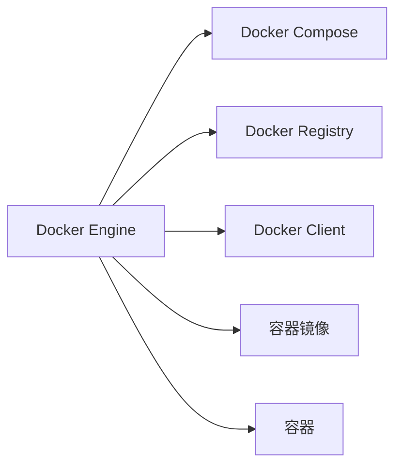
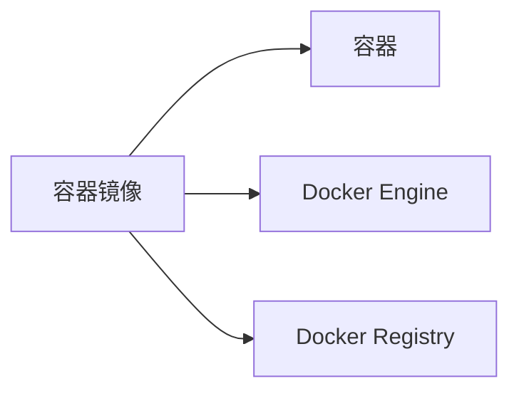

                 

# Docker：轻量级容器化解决方案

> 关键词：Docker, 容器化, 轻量级, 打包, 部署, 微服务, 持续集成(CI), 持续部署(CD)

## 1. 背景介绍

随着云计算和大数据技术的普及，微服务架构、DevOps文化、容器技术等逐渐成为软件开发和部署的标配。在这些技术中，Docker无疑是最具代表性的工具之一。Docker作为一种轻量级的容器化解决方案，以其简单、易用、高效的特点，深受开发者欢迎。

### 1.1 容器化技术兴起背景

传统的软件开发和部署方式面临着诸多挑战：

- 环境一致性问题：在不同的开发和测试环境中，应用依赖的库版本、系统配置、网络环境等可能存在差异，导致程序运行时出现意料之外的错误。
- 部署复杂性问题：在分布式环境中，多台服务器上的应用部署往往需要手工安装和配置，效率低下，出错率高。
- 资源利用率问题：传统虚拟机和物理服务器资源占用率低，难以充分利用硬件资源。

容器化技术的出现，从根本上解决了上述问题。容器化技术将应用程序及其依赖打包在容器镜像中，通过轻量级的容器引擎，以一致的、可移植的方式在任意环境中运行。容器化技术具有如下优点：

- **一致性**：应用程序及其依赖以镜像形式打包，确保在任意环境中的运行一致性。
- **易用性**：容器引擎简单易用，开发和运维效率大大提升。
- **高效性**：容器引擎可以复用底层硬件资源，显著提高资源利用率。

### 1.2 Docker的基本概念和定位

Docker是由Docker Inc.开发的容器化平台，支持在Linux和Windows操作系统上运行。Docker通过其简单、易用的API，实现容器镜像的构建、打包、分发和运行。Docker的目标是成为开发者、运维人员和DevOps团队的必备工具。

Docker的核心组件包括：

- **Docker Engine**：容器引擎，负责创建、管理容器，并与其他组件通信。
- **Docker Registry**：容器镜像仓库，用于存储和管理容器镜像。
- **Docker Compose**：容器编排工具，用于定义、运行和扩展Docker应用。

Docker不仅是一个容器引擎，更是一种完整的容器化解决方案，涵盖从开发到运维的各个环节。

## 2. 核心概念与联系

### 2.1 核心概念概述

为了更好地理解Docker的核心概念和工作原理，我们将通过以下两个Mermaid流程图，展示Docker的基本架构和容器运行机制。





这两个流程图分别展示了Docker的架构和容器运行机制：

1. 架构图展示了Docker的主要组件及其相互关系。Docker Engine负责容器创建和管理，Docker Compose用于容器编排，Docker Registry用于镜像存储和管理，Docker Client负责与Docker Engine通信。

2. 运行机制图展示了从镜像到容器的过程。Docker Engine接收容器镜像，运行在容器中，并将容器镜像存储在Docker Registry中。

### 2.2 核心概念联系

Docker的核心概念主要包括容器、容器镜像、容器引擎等。它们之间相互依赖，形成一个完整的容器化生态系统。

- **容器**：容器是应用程序的运行环境，具有独立运行空间、隔离性和沙箱特性。容器运行在宿主机上，共享宿主机的硬件资源。
- **容器镜像**：容器镜像是一种静态文件，包含应用程序及其依赖，以及运行环境配置。容器镜像通过Docker Engine创建容器实例。
- **容器引擎**：容器引擎是Docker的核心组件，负责创建、管理和运行容器。它负责将容器镜像加载到内存中，并启动容器。

这些概念之间相互作用，共同构成了Docker的容器化解决方案。容器镜像提供了应用程序及其依赖的完整环境，容器引擎负责管理和运行容器，容器编排工具Docker Compose则帮助开发者管理和扩展容器集群。

## 3. 核心算法原理 & 具体操作步骤

### 3.1 算法原理概述

Docker的核心算法原理基于容器化技术，通过将应用程序及其依赖打包在容器镜像中，实现应用程序在任意环境中的一致性和易用性。Docker的算法原理主要包括以下几个方面：

- **容器引擎**：负责将容器镜像加载到内存中，并启动容器。容器引擎通过LXC（Linux Containers）或Wasm（WebAssembly）等技术实现容器的隔离和隔离性。
- **容器镜像**：通过Dockerfile语法定义构建镜像的过程，包括选择基础镜像、复制代码、安装依赖、设置环境变量、定义暴露端口等步骤。容器镜像可以包含任意数量的应用程序和依赖。
- **容器编排**：通过Docker Compose工具，定义和运行多个容器的编排，实现容器间的通信和依赖管理。

### 3.2 算法步骤详解

Docker的核心算法步骤主要包括：

1. **容器镜像构建**：通过Dockerfile语法定义构建容器镜像的步骤，使用docker build命令生成容器镜像。

2. **容器镜像存储**：将容器镜像存储在Docker Registry中，使用docker push命令将镜像推送到仓库。

3. **容器实例创建**：通过docker run命令，创建容器实例并运行在宿主机上。

4. **容器管理**：通过docker stop、docker start、docker pause、docker unpause等命令，管理容器的启动、停止、暂停和恢复。

5. **容器编排**：通过Docker Compose工具，定义和运行多个容器的编排，实现容器间的通信和依赖管理。

6. **容器优化**：通过Docker Swarm和Docker Compose等工具，实现容器的自动部署、扩展和负载均衡。

### 3.3 算法优缺点

Docker作为一种轻量级的容器化解决方案，具有以下优点：

- **轻量级**：容器引擎和容器镜像占用的资源较少，容器运行效率高。
- **易用性**：Docker提供简单易用的API和CLI，可以快速创建、管理和部署容器。
- **可移植性**：容器镜像可以在任意环境中运行，确保应用程序的一致性。

同时，Docker也存在一些缺点：

- **性能瓶颈**：容器之间的通信和网络性能可能不如虚拟机，但在单个主机上性能表现优异。
- **资源限制**：由于容器依赖宿主机的资源，宿主机的资源限制可能成为容器化应用的瓶颈。
- **依赖问题**：容器化应用依赖复杂，可能出现依赖冲突和兼容性问题。

### 3.4 算法应用领域

Docker作为一种通用的容器化解决方案，可以广泛应用于各种软件开发和部署场景，包括：

- **云服务**：Docker与云平台（如AWS、Azure、Google Cloud）无缝集成，实现云服务的自动化部署和运维。
- **微服务架构**：Docker支持微服务架构，通过容器编排工具Docker Compose实现服务之间的依赖管理。
- **持续集成和持续部署**：Docker与CI/CD工具（如Jenkins、Travis CI）集成，实现自动化测试和部署。
- **DevOps**：Docker成为DevOps实践的重要组成部分，支持敏捷开发、自动化测试、持续集成和持续部署。

## 4. 数学模型和公式 & 详细讲解 & 举例说明

### 4.1 数学模型构建

Docker的核心数学模型基于容器化技术和虚拟化技术，通过将应用程序及其依赖打包在容器镜像中，实现应用程序的隔离和一致性。

假设应用程序由多个文件组成，每个文件的大小为$n_i$，应用程序的依赖库和框架大小为$m$。容器镜像的大小可以表示为：

$$
\text{Image Size} = \sum_{i=1}^N n_i + m
$$

其中，$N$为应用程序文件数量，$m$为依赖库和框架大小。

### 4.2 公式推导过程

在容器镜像构建过程中，Dockerfile语法包含多个指令，用于定义构建步骤。例如：

```
FROM ubuntu:20.04
COPY . .
RUN apt update && apt install -y curl && apt clean
CMD ["/bin/bash"]
```

上述Dockerfile将Ubuntu 20.04作为基础镜像，复制本地文件，安装依赖库，最后指定CMD为`/bin/bash`。通过如下过程生成容器镜像：

1. **拉取基础镜像**：从Docker Registry中拉取Ubuntu 20.04镜像。
2. **复制文件**：将本地文件复制到容器中。
3. **安装依赖**：在容器中安装依赖库。
4. **设置环境**：设置环境变量和暴露端口。
5. **运行命令**：指定容器的运行命令。

这些步骤通过Docker引擎进行编排和执行，最终生成容器镜像。

### 4.3 案例分析与讲解

以下是一个简单的Dockerfile示例，用于构建一个运行Hello World的Web服务：

```
FROM python:3.7
WORKDIR /app
COPY . .
RUN pip install Flask gunicorn
EXPOSE 8080
CMD ["gunicorn", "app:app", "-b", "0.0.0.0:8080"]
```

通过上述Dockerfile，可以完成以下步骤：

1. **选择基础镜像**：选择Python 3.7镜像。
2. **设置工作目录**：设置应用程序的工作目录为`/app`。
3. **复制文件**：将应用程序文件复制到容器中。
4. **安装依赖**：在容器中安装Flask和Gunicorn库。
5. **暴露端口**：暴露8080端口，供Web服务访问。
6. **运行命令**：启动Gunicorn服务，监听8080端口。

### 4.4 实际应用示例

以下是一个实际应用示例，演示如何使用Docker容器化Web应用，并通过Docker Compose编排服务。

**Dockerfile**：

```
FROM python:3.7
WORKDIR /app
COPY . .
RUN pip install Flask gunicorn
EXPOSE 8080
CMD ["gunicorn", "app:app", "-b", "0.0.0.0:8080"]
```

**Docker Compose文件**：

```
version: '3'
services:
  web:
    build: .
    ports:
      - "8080:8080"
    volumes:
      - .:/app
```

通过上述Dockerfile和Docker Compose文件，可以构建和运行一个Web应用，并在宿主机上暴露8080端口。

## 5. 项目实践：代码实例和详细解释说明

### 5.1 开发环境搭建

要开始Docker实践，首先需要搭建开发环境。以下是具体的安装步骤：

1. 安装Docker：在Linux系统上安装Docker CE，在Windows系统上安装Docker Desktop。
2. 安装Docker Compose：在Linux和Windows系统上都可以通过apt-get、yum或curl命令安装Docker Compose。
3. 安装Docker Registry：在本地或远程服务器上安装Docker Registry，用于存储和管理容器镜像。

### 5.2 源代码详细实现

以下是一个简单的Dockerfile示例，用于构建一个运行Hello World的Web服务：

```
FROM python:3.7
WORKDIR /app
COPY . .
RUN pip install Flask gunicorn
EXPOSE 8080
CMD ["gunicorn", "app:app", "-b", "0.0.0.0:8080"]
```

通过上述Dockerfile，可以完成以下步骤：

1. **选择基础镜像**：选择Python 3.7镜像。
2. **设置工作目录**：设置应用程序的工作目录为`/app`。
3. **复制文件**：将应用程序文件复制到容器中。
4. **安装依赖**：在容器中安装Flask和Gunicorn库。
5. **暴露端口**：暴露8080端口，供Web服务访问。
6. **运行命令**：启动Gunicorn服务，监听8080端口。

### 5.3 代码解读与分析

在上述Dockerfile中，包含以下关键指令：

- **FROM**：指定基础镜像。
- **WORKDIR**：设置应用程序的工作目录。
- **COPY**：将本地文件复制到容器中。
- **RUN**：在容器中执行命令，安装依赖库。
- **EXPOSE**：暴露容器端口，供外部访问。
- **CMD**：指定容器的启动命令。

这些指令通过Docker引擎进行编排和执行，最终生成容器镜像。

### 5.4 运行结果展示

通过上述Dockerfile，可以生成容器镜像，并通过以下命令运行容器实例：

```
docker build -t hello-world .
docker run -d -p 8080:8080 hello-world
```

通过浏览器访问`http://localhost:8080`，可以看到Hello World的输出。

## 6. 实际应用场景

### 6.1 云服务

Docker与云平台（如AWS、Azure、Google Cloud）无缝集成，实现云服务的自动化部署和运维。在云平台上，可以通过Docker Container Service、Kubernetes等工具，实现容器编排、负载均衡和自动扩展。

### 6.2 微服务架构

Docker支持微服务架构，通过容器编排工具Docker Compose实现服务之间的依赖管理。微服务架构通过将应用程序分解为多个独立的服务，实现服务的独立部署和扩展。

### 6.3 持续集成和持续部署

Docker与CI/CD工具（如Jenkins、Travis CI）集成，实现自动化测试和部署。通过Dockerfile定义容器镜像的构建过程，将应用程序及其依赖打包在容器中，实现自动化构建和部署。

### 6.4 未来应用展望

未来，Docker将在更多领域得到应用，为软件开发和运维带来更多便利：

- **边缘计算**：Docker支持在边缘设备上运行容器，实现本地化部署和低延迟访问。
- **物联网**：Docker支持在物联网设备上运行容器，实现设备间的互操作和远程管理。
- **区块链**：Docker支持区块链技术，实现分布式应用的容器化部署和运行。
- **人工智能**：Docker支持人工智能应用，实现深度学习模型的容器化部署和推理。

## 7. 工具和资源推荐

### 7.1 学习资源推荐

为了帮助开发者系统掌握Docker的理论基础和实践技巧，这里推荐一些优质的学习资源：

1. **Docker官方文档**：Docker官方提供的详细文档，涵盖Docker引擎、Docker Compose、Docker Registry、Docker Swarm等组件的详细说明。
2. **《Docker实战》**：一本详细介绍Docker容器化解决方案的书籍，涵盖Docker的各个方面，适合初学者和进阶者。
3. **《Docker微服务架构》**：一本介绍Docker在微服务架构中应用的书籍，涵盖Docker、Kubernetes等工具的使用。
4. **《Docker权威指南》**：一本介绍Docker生态系统的书籍，涵盖Docker、Docker Compose、Docker Registry、Docker Swarm等组件的详细说明。
5. **《Docker实战指南》**：一本介绍Docker容器化实践的书籍，涵盖Dockerfile语法、Docker Compose、Docker Registry等工具的使用。

通过对这些资源的学习实践，相信你一定能够快速掌握Docker的精髓，并用于解决实际的容器化问题。

### 7.2 开发工具推荐

高效的Docker开发离不开优秀的工具支持。以下是几款用于Docker开发和运维的常用工具：

1. **Docker Hub**：Docker官方提供的镜像仓库，可以搜索和下载Docker镜像，实现容器化应用的快速部署。
2. **Docker Compose**：Docker官方提供的容器编排工具，支持定义和运行多个容器的编排，实现容器间的通信和依赖管理。
3. **Docker Swarm**：Docker官方提供的容器编排工具，支持容器编排和集群管理，实现容器的自动部署、扩展和负载均衡。
4. **Docker Compose UI**：支持Docker Compose的可视化管理工具，方便开发者对容器编排进行调试和监控。
5. **Docker Registry**：Docker官方提供的容器镜像仓库，支持本地和远程镜像的存储和管理。
6. **Docker Desktop**：支持在Windows系统上运行Docker容器的桌面应用，提供可视化的开发和运维界面。

合理利用这些工具，可以显著提升Docker开发和运维的效率，加快创新迭代的步伐。

### 7.3 相关论文推荐

Docker作为一种通用的容器化解决方案，其研究论文涉及多个领域，以下是几篇具有代表性的论文：

1. **Docker: The Union of Operable Systems**：Docker Inc.发表的论文，介绍Docker的架构和核心技术，涵盖容器引擎、容器镜像、容器编排等组件。
2. **Docker Swarm: Simplifying Docker Cluster Management**：Docker Inc.发表的论文，介绍Docker Swarm的架构和核心技术，涵盖容器编排和集群管理。
3. **The Power of Two Tasks**：Docker Inc.发表的论文，介绍Docker在微服务架构中的应用，涵盖Docker、Kubernetes等工具的使用。
4. **Docker Filesystem Minikernel**：Docker Inc.发表的论文，介绍Docker的文件系统实现，涵盖Docker引擎的优化和性能提升。

这些论文代表了大容器化技术的发展脉络。通过学习这些前沿成果，可以帮助研究者把握学科前进方向，激发更多的创新灵感。

## 8. 总结：未来发展趋势与挑战

### 8.1 总结

本文对Docker的基本概念、核心算法原理和具体操作步骤进行了详细介绍。通过介绍Docker的核心概念和实际应用，我们了解了Docker作为轻量级容器化解决方案的强大优势和广泛应用场景。同时，本文对Docker的未来发展趋势和面临的挑战进行了深入分析，展望了Docker在云计算、微服务架构、持续集成和持续部署等领域的未来前景。

### 8.2 未来发展趋势

未来，Docker作为轻量级容器化解决方案，将在更多领域得到应用，为软件开发和运维带来更多便利。以下是Docker未来发展的主要趋势：

1. **容器编排的自动化和智能化**：Docker将与更多的容器编排工具集成，实现自动化的容器编排和管理。通过AI技术优化容器编排算法，实现智能化的容器编排和资源调度。
2. **容器编排的可移植性**：Docker将支持跨平台、跨环境的容器编排，实现容器化应用的可移植性和一致性。
3. **容器编排的微服务化**：Docker将支持微服务架构，实现服务的独立部署和扩展。通过容器编排工具Docker Compose和Kubernetes等，实现服务的编排和管理。
4. **容器编排的安全性**：Docker将加强容器编排的安全性，实现容器镜像的安全扫描和验证。通过容器编排工具的安全功能，确保容器化应用的安全性和合规性。
5. **容器编排的监控和日志**：Docker将支持容器编排的监控和日志管理，实现容器化应用的实时监控和问题诊断。通过容器编排工具的监控功能，实现容器化应用的可靠性和稳定性。

这些趋势凸显了Docker作为轻量级容器化解决方案的强大优势，必将推动容器化技术在更多领域的广泛应用。

### 8.3 面临的挑战

尽管Docker作为轻量级容器化解决方案，已经在软件开发和运维中得到广泛应用，但仍面临一些挑战：

1. **性能瓶颈**：Docker容器在多主机环境下，可能面临网络性能和资源瓶颈。
2. **资源限制**：由于容器依赖宿主机的资源，宿主机的资源限制可能成为容器化应用的瓶颈。
3. **依赖问题**：容器化应用依赖复杂，可能出现依赖冲突和兼容性问题。
4. **安全性问题**：容器编排的安全性仍需加强，避免容器镜像的安全漏洞和攻击。
5. **可移植性问题**：容器编排的可移植性仍需改进，确保在不同环境中容器化应用的稳定性和一致性。

### 8.4 研究展望

为了克服Docker面临的挑战，未来的研究需要从以下几个方向进行探索：

1. **容器编排的优化算法**：开发更高效的容器编排算法，优化容器编排的资源利用率和时间复杂度，提升容器编排的性能。
2. **容器编排的微服务化**：进一步优化微服务架构的容器编排，实现服务的自动化部署和扩展。
3. **容器编排的安全性**：开发更安全的容器编排工具，确保容器镜像的安全性和合规性。
4. **容器编排的监控和日志**：实现容器编排的实时监控和问题诊断，提升容器化应用的可靠性和稳定性。
5. **容器编排的可移植性**：提升容器编排的可移植性，确保在不同环境中容器化应用的稳定性和一致性。

这些研究方向的探索，将推动Docker在容器化领域的进一步发展，为软件开发和运维带来更多便利。

## 9. 附录：常见问题与解答

**Q1：Docker与其他容器化解决方案相比，有何优势？**

A: Docker作为轻量级容器化解决方案，相比其他容器化解决方案，具有以下优势：

1. **轻量级**：容器引擎和容器镜像占用的资源较少，容器运行效率高。
2. **易用性**：Docker提供简单易用的API和CLI，可以快速创建、管理和部署容器。
3. **可移植性**：容器镜像可以在任意环境中运行，确保应用程序的一致性。
4. **安全性和隔离性**：容器提供良好的安全性和隔离性，防止应用程序之间的干扰和攻击。
5. **可扩展性**：Docker支持容器的扩展和集群管理，方便大规模部署和扩展。

**Q2：Docker的容器镜像大小如何计算？**

A: Docker的容器镜像大小可以表示为应用程序及其依赖的静态文件大小之和。具体计算公式为：

$$
\text{Image Size} = \sum_{i=1}^N n_i + m
$$

其中，$N$为应用程序文件数量，$m$为依赖库和框架大小。

**Q3：如何实现Docker容器的持久化存储？**

A: Docker提供多种方式实现容器的持久化存储，包括：

1. **主机文件系统**：将容器数据存储在宿主机的文件系统中。通过VOLUME指令挂载宿主机的文件系统，实现容器的持久化存储。
2. **外部存储**：将容器数据存储在外部存储设备中，如NFS、SAN等。通过VOLUME指令挂载外部存储设备，实现容器的持久化存储。
3. **云存储**：将容器数据存储在云存储服务中，如AWS S3、Google Cloud Storage等。通过VOLUME指令挂载云存储服务，实现容器的持久化存储。

**Q4：Docker与Kubernetes相比，有何优势？**

A: Docker与Kubernetes相比，具有以下优势：

1. **易用性**：Docker提供简单易用的API和CLI，可以快速创建、管理和部署容器。Kubernetes则是一个复杂的容器编排系统，需要更多的配置和管理。
2. **轻量级**：Docker容器引擎和容器镜像占用的资源较少，容器运行效率高。Kubernetes需要更多的资源和配置，对系统资源占用较大。
3. **可移植性**：Docker容器镜像可以在任意环境中运行，确保应用程序的一致性。Kubernetes则需要更多的集群管理和配置。
4. **灵活性**：Docker支持灵活的容器编排和部署，可以实现单容器和集群部署。Kubernetes则需要更多的配置和脚本，实现复杂的容器编排和管理。

**Q5：Docker在微服务架构中的应用有何优势？**

A: Docker在微服务架构中的应用具有以下优势：

1. **独立部署**：通过Docker容器化应用，可以实现服务的独立部署和扩展。
2. **自动部署**：通过Docker Compose和Docker Swarm等工具，可以实现服务的自动部署和扩展。
3. **容器编排**：通过Docker Compose和Kubernetes等工具，可以实现服务的容器编排和依赖管理。
4. **可移植性**：通过Docker容器镜像，可以实现服务的跨平台和跨环境部署。
5. **安全性**：通过Docker容器编排的安全功能，确保服务的安全性和合规性。

通过Docker在微服务架构中的应用，可以实现服务的独立部署和扩展，提升系统的灵活性和可扩展性。

---

作者：禅与计算机程序设计艺术 / Zen and the Art of Computer Programming

