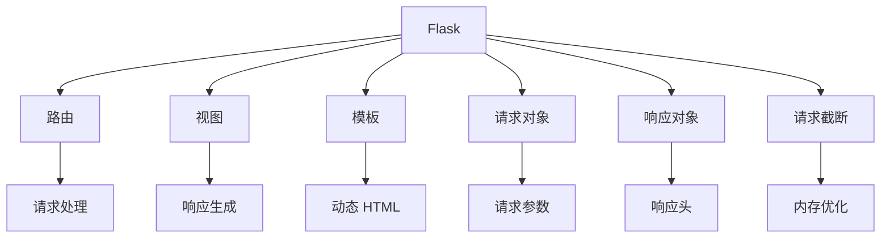
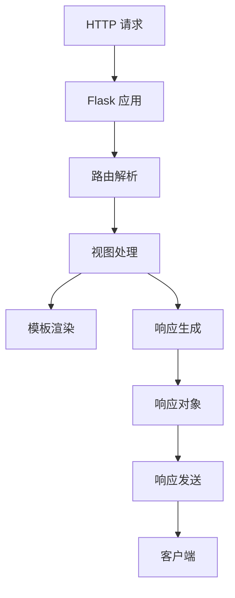

                 

# Flask 框架：微型 Python 框架

## 1. 背景介绍

### 1.1 问题由来
在现代软件开发中，微服务架构逐渐成为主流。微服务架构要求我们对代码进行模块化拆分，每个服务聚焦一个具体的功能，可独立部署、扩展和更新。为了快速开发微服务应用，我们需要一个轻量级的 Web 框架，既能满足开发效率，又能兼顾应用性能。Flask 就是这样的微型 Python 框架，其灵活性、易用性、高效性使其成为开发 Web 应用程序的首选工具之一。

### 1.2 问题核心关键点
Flask 框架作为一个轻量级的微型 Web 框架，主要特点包括：

- 轻量级：Flask 的核心模块非常轻量，启动速度快，内存占用少。
- 灵活性：Flask 允许开发者自定义请求处理流程，插件式架构支持灵活扩展。
- 易用性：Flask 提供了简单的 API 和快速开发工具，上手难度低。
- 高效性：Flask 支持异步请求处理、请求截断、缓存等技术，提升应用性能。
- 社区活跃：Flask 拥有庞大的用户社区，丰富的第三方插件和文档，可以迅速找到解决方案。

这些特点使得 Flask 在构建微服务架构、RESTful API、小型 Web 应用等方面具有很高的适用性。

## 2. 核心概念与联系

### 2.1 核心概念概述

为更好地理解 Flask 框架，本节将介绍几个密切相关的核心概念：

- Flask：基于 Werkzeug 和 Jinja2 开发的微型 Web 框架，具有轻量级、灵活、易用等特点。
- 路由（Routing）：将 URL 映射到对应的视图函数，实现对请求的路由处理。
- 视图（View）：处理请求并返回响应，Flask 框架的核心组件。
- 模板（Templates）：利用 Jinja2 模板引擎生成动态 HTML，实现响应内容的动态渲染。
- 请求对象（Request）：封装 HTTP 请求信息，便于处理请求参数、请求头等。
- 响应对象（Response）：封装 HTTP 响应信息，便于生成响应内容、设置响应头等。
- 请求截断（Request Truncation）：防止大请求体占用过多内存，降低系统负载。

这些核心概念之间的逻辑关系可以通过以下 Mermaid 流程图来展示：



这个流程图展示了这个核心概念的逻辑关系：

1. Flask 框架通过路由将 URL 映射到视图函数，对请求进行路由处理。
2. 视图函数处理请求，并利用模板引擎生成动态 HTML，最终生成响应内容。
3. 请求对象封装 HTTP 请求信息，便于请求参数的处理。
4. 响应对象封装 HTTP 响应信息，便于响应内容的生成。
5. 请求截断技术优化请求体，减少内存占用，提升应用性能。

这些概念共同构成了 Flask 框架的基本功能框架，使其能够高效地处理请求并生成响应。

## 3. 核心算法原理 & 具体操作步骤

### 3.1 算法原理概述

Flask 框架的核心算法原理可以简单概括为请求处理和响应生成的过程。当用户向 Flask 应用程序发送 HTTP 请求时，框架将通过路由将请求映射到对应的视图函数，并由视图函数对请求进行处理。视图函数通过调用模板引擎生成动态 HTML，生成响应内容，并将响应对象返回给框架，最终发送给客户端。

具体来说，Flask 的请求处理流程包括如下几个关键步骤：

1. 请求到达 Flask 应用，框架解析 URL 并调用路由，映射到对应的视图函数。
2. 视图函数对请求进行处理，可能涉及到数据库操作、调用外部 API、业务逻辑等。
3. 视图函数调用模板引擎，动态渲染响应内容。
4. 视图函数生成响应对象，设置响应头、内容等，返回给框架。
5. 框架将响应对象转换为 HTTP 响应，并通过 HTTP 协议发送给客户端。

整个处理流程可以通过如下代码流程图来表示：



### 3.2 算法步骤详解

Flask 框架的核心算法步骤主要包括：

1. 创建 Flask 应用实例：
```python
from flask import Flask
app = Flask(__name__)
```

2. 定义路由和视图函数：
```python
@app.route('/')
def index():
    return 'Hello, Flask!'
```

3. 运行 Flask 应用：
```python
if __name__ == '__main__':
    app.run()
```

4. 请求处理和响应生成：
```python
@app.route('/')
def index():
    # 处理请求，调用视图函数
    return render_template('index.html', message='Hello, Flask!')
```

5. 响应对象生成和返回：
```python
@app.route('/')
def index():
    # 调用模板渲染，生成响应内容
    return render_template('index.html', message='Hello, Flask!')
```

6. 启动 Flask 应用：
```python
if __name__ == '__main__':
    app.run()
```

### 3.3 算法优缺点

Flask 框架具有以下优点：

- 轻量级：Flask 框架没有很多不必要的组件，启动速度快，内存占用少。
- 灵活性：Flask 允许开发者自定义路由和视图函数，支持插件式扩展，满足各种需求。
- 易用性：Flask 提供了简单的 API 和文档，上手难度低，易于快速开发。
- 高效性：Flask 支持异步请求处理、请求截断、缓存等技术，提升应用性能。
- 社区活跃：Flask 拥有庞大的用户社区，丰富的第三方插件和文档，可以快速解决开发中的问题。

但 Flask 框架也有一些缺点：

- 功能简单：Flask 提供的功能相对简单，可能需要依赖第三方插件来实现复杂功能。
- 扩展性有限：Flask 插件生态丰富，但整体扩展性仍受到一定限制，对于大型的微服务应用可能不够理想。
- 安全性问题：Flask 社区维护活跃，但也存在一些安全性问题，需要开发者注意防范。
- 性能瓶颈：对于高并发场景，Flask 的并发性能可能不如其他 Web 框架，需要考虑负载均衡和分布式部署。

### 3.4 算法应用领域

Flask 框架主要应用于以下领域：

- 快速开发原型：Flask 非常适合快速开发原型应用，支持简单功能的快速部署。
- RESTful API 开发：Flask 提供了强大的路由和视图函数，方便构建 RESTful API。
- 微服务架构：Flask 轻量级、灵活性高的特点，使得它非常适合构建微服务架构。
- 小型 Web 应用：Flask 的简单和易用性，使得它非常适合构建小型 Web 应用。
- 企业内部应用：Flask 提供的插件和扩展，可以方便地与企业内部系统集成。

Flask 的这些特点使得它在开发微服务架构、RESTful API、小型 Web 应用等方面具有很高的适用性，是开发者快速构建 Web 应用程序的首选工具之一。

## 4. 数学模型和公式 & 详细讲解 & 举例说明

### 4.1 数学模型构建

本节将使用数学语言对 Flask 框架进行更加严格的刻画。

设 Flask 应用程序的 URL 为 $U$，路由映射关系为 $R:U \rightarrow V$，其中 $V$ 为视图函数集合。设请求参数为 $P$，响应内容为 $R$，响应头为 $H$。

Flask 框架的处理流程可以形式化地表示为：

1. 将请求 $U$ 映射到视图函数 $V$
2. 视图函数 $V$ 处理请求 $U$，生成响应 $R$
3. 设置响应头 $H$，返回响应 $R$

数学表达式如下：

$$
R = V(U, P)
$$

$$
H = R(U, P)
$$

$$
H \rightarrow R
$$

### 4.2 公式推导过程

在 Flask 框架中，路由映射 $R$ 通常由装饰器 `@app.route()` 定义。例如：

```python
@app.route('/')
def index():
    return 'Hello, Flask!'
```

这里，`@app.route('/')` 将请求映射到 `index()` 函数。视图函数 `index()` 处理请求，并返回响应内容。

对于视图函数，Flask 框架支持多种类型的请求处理和响应生成方式。例如，可以使用 `request` 对象获取请求参数，使用 `render_template()` 函数渲染模板。例如：

```python
@app.route('/')
def index():
    message = request.args.get('message', 'Hello, Flask!')
    return render_template('index.html', message=message)
```

这里，`request.args.get('message', 'Hello, Flask!')` 获取请求参数，`render_template('index.html', message=message)` 渲染模板并返回响应内容。

### 4.3 案例分析与讲解

下面以 Flask 框架开发一个简单的 RESTful API 为例，展示 Flask 框架的基本用法。

1. 创建 Flask 应用实例：
```python
from flask import Flask
app = Flask(__name__)
```

2. 定义路由和视图函数：
```python
@app.route('/api/user', methods=['GET'])
def get_user():
    # 处理 GET 请求，返回用户信息
    return {'id': 1, 'name': 'Tom'}
```

3. 启动 Flask 应用：
```python
if __name__ == '__main__':
    app.run()
```

4. 测试 RESTful API：
```python
import requests
response = requests.get('http://127.0.0.1:5000/api/user')
print(response.json())
```

这里，我们定义了一个 `/api/user` 的 RESTful API，支持 GET 请求，返回用户信息。通过使用 `requests` 库测试 API，可以获取响应内容并解析为 JSON 格式。

## 5. 项目实践：代码实例和详细解释说明

### 5.1 开发环境搭建

在进行 Flask 项目开发前，我们需要准备好开发环境。以下是使用 Python 进行 Flask 开发的开发环境配置流程：

1. 安装 Flask：
```bash
pip install Flask
```

2. 创建 Flask 应用目录：
```bash
mkdir flask_project
cd flask_project
```

3. 创建 Flask 应用文件：
```bash
touch app.py
```

4. 创建模板目录：
```bash
mkdir templates
```

5. 创建样式文件：
```bash
touch styles.css
```

6. 安装依赖：
```bash
pip install Jinja2 Flask-JWT-Extended
```

### 5.2 源代码详细实现

下面以 Flask 框架开发一个简单的博客应用为例，展示 Flask 框架的完整代码实现。

1. 创建 Flask 应用实例：
```python
from flask import Flask
app = Flask(__name__)
```

2. 定义路由和视图函数：
```python
@app.route('/')
def index():
    return render_template('index.html', message='Hello, Flask!')
```

3. 定义用户路由：
```python
@app.route('/user', methods=['GET'])
def get_user():
    # 处理 GET 请求，返回用户信息
    return {'id': 1, 'name': 'Tom'}
```

4. 定义用户登录路由：
```python
from flask_login import LoginManager, login_user, login_required, logout_user

login_manager = LoginManager()
login_manager.init_app(app)

@app.route('/login', methods=['POST'])
def login():
    # 处理登录请求，登录用户
    username = request.form['username']
    password = request.form['password']
    # 这里可以调用数据库查询用户信息，如果用户名和密码匹配，则登录用户
    user = {'username': username, 'password': password}
    login_manager.login_user(user)
    return 'Login success'
```

5. 登录退出路由：
```python
@app.route('/logout')
@login_required
def logout():
    # 处理退出请求，退出用户
    logout_user()
    return 'Logout success'
```

6. 启动 Flask 应用：
```python
if __name__ == '__main__':
    app.run(debug=True)
```

### 5.3 代码解读与分析

让我们再详细解读一下关键代码的实现细节：

**模板文件**：
- `index.html`：
```html
<!DOCTYPE html>
<html>
<head>
    <title>Flask Blog</title>
    <link rel="stylesheet" href="{{ url_for('static', filename='styles.css') }}">
</head>
<body>
    <h1>{{ message }}</h1>
</body>
</html>
```

- `styles.css`：
```css
body {
    font-family: Arial, sans-serif;
    background-color: #f0f0f0;
}
```

**登录和退出**：
- `login` 函数：
```python
@app.route('/login', methods=['POST'])
def login():
    # 处理登录请求，登录用户
    username = request.form['username']
    password = request.form['password']
    # 这里可以调用数据库查询用户信息，如果用户名和密码匹配，则登录用户
    user = {'username': username, 'password': password}
    login_manager.login_user(user)
    return 'Login success'
```

- `logout` 函数：
```python
@app.route('/logout')
@login_required
def logout():
    # 处理退出请求，退出用户
    logout_user()
    return 'Logout success'
```

这里使用了 Flask-Login 插件实现用户登录和退出。在 `login` 函数中，调用 `login_manager.login_user` 登录用户。在 `logout` 函数中，调用 `logout_user` 退出用户。

### 5.4 运行结果展示

运行上述代码，可以在浏览器中访问 `http://127.0.0.1:5000/`，看到欢迎信息。可以使用 Postman 或其他工具测试 `/api/user` 和登录功能，确保应用正常工作。

## 6. 实际应用场景

### 6.1 博客系统

Flask 框架非常适合用于开发博客系统。博客系统需要管理文章、用户、评论等数据，同时支持文章编辑、评论发布等操作。Flask 提供的路由和视图函数，可以方便地处理这些数据操作。

### 6.2 RESTful API 服务

Flask 框架的灵活性和易用性，使得它非常适合构建 RESTful API 服务。RESTful API 需要定义清晰的路由和请求处理方式，Flask 提供的路由和视图函数，能够满足这些需求。

### 6.3 在线教育平台

在线教育平台需要处理用户注册、课程管理、视频播放等复杂功能。Flask 框架的灵活性和扩展性，使得它非常适合构建这样的系统。

### 6.4 未来应用展望

随着 Flask 框架的发展和成熟，其应用场景将不断拓展。未来，Flask 将会在以下几个方面得到更广泛的应用：

- 微服务架构：Flask 的轻量级和灵活性，使得它非常适合构建微服务架构，满足分布式、高并发的需求。
- 企业内部系统：Flask 提供的插件和扩展，可以方便地与企业内部系统集成，支持各种复杂功能的开发。
- 物联网应用：Flask 的灵活性和易用性，使得它非常适合构建物联网应用，支持各种传感器和设备的数据处理。

Flask 框架的这些特点，使得它在开发微服务架构、RESTful API、小型 Web 应用等方面具有很高的适用性，是开发者快速构建 Web 应用程序的首选工具之一。

## 7. 工具和资源推荐

### 7.1 学习资源推荐

为了帮助开发者系统掌握 Flask 框架的理论基础和实践技巧，这里推荐一些优质的学习资源：

1. Flask 官方文档：Flask 官方提供的详细文档，包含框架的各个组件和功能，是学习 Flask 的最佳入口。
2. Flask Web Development by Miguel Grinberg：由 Flask 开发者 Miguel Grinberg 编写的书籍，内容全面详细，涵盖 Flask 的各个方面。
3. Flask Mega-Tutorial：由 Miguel Grinberg 编写的 Flask 进阶教程，详细讲解了 Flask 的各个功能，适合有一定 Flask 基础的开发者阅读。
4. Flask by Example：由 Tony Stubblebine 编写的 Flask 实战教程，通过实例讲解 Flask 的使用方法，适合初学者阅读。
5. Flask 社区：Flask 官方社区和第三方插件，提供了丰富的学习资源和交流平台，方便开发者学习使用 Flask。

通过对这些资源的学习实践，相信你一定能够快速掌握 Flask 框架的精髓，并用于解决实际的开发问题。

### 7.2 开发工具推荐

高效的开发离不开优秀的工具支持。以下是几款用于 Flask 开发的常用工具：

1. PyCharm：功能强大的 Python IDE，支持 Flask 开发，提供了许多智能辅助和调试工具。
2. VS Code：轻量级的代码编辑器，支持 Flask 开发，提供了许多插件和扩展。
3. Sublime Text：轻量级的代码编辑器，支持 Flask 开发，提供了许多插件和扩展。
4. IntelliJ IDEA：功能强大的 IDE，支持 Flask 开发，提供了许多智能辅助和调试工具。
5. PyDev：Eclipse 插件，支持 Flask 开发，提供了许多智能辅助和调试工具。

合理利用这些工具，可以显著提升 Flask 开发效率，加快创新迭代的步伐。

### 7.3 相关论文推荐

Flask 框架的发展离不开学界的持续研究。以下是几篇奠基性的相关论文，推荐阅读：

1. The Development of the Flask Microframework：由 Flask 开发者 Miguel Grinberg 撰写的论文，详细介绍了 Flask 的设计思想和实现细节。
2. Flask-RESTful：Flask-RESTful 开发者的论文，详细讲解了 Flask-RESTful 的设计思想和实现细节。
3. Flask-SQLAlchemy：Flask-SQLAlchemy 开发者的论文，详细讲解了 Flask-SQLAlchemy 的设计思想和实现细节。
4. Flask-Login：Flask-Login 开发者的论文，详细讲解了 Flask-Login 的设计思想和实现细节。
5. Flask-Cache：Flask-Cache 开发者的论文，详细讲解了 Flask-Cache 的设计思想和实现细节。

这些论文代表了大语言模型微调技术的发展脉络。通过学习这些前沿成果，可以帮助研究者把握学科前进方向，激发更多的创新灵感。

## 8. 总结：未来发展趋势与挑战

### 8.1 总结

本文对 Flask 框架进行了全面系统的介绍。首先阐述了 Flask 框架的背景和意义，明确了 Flask 在构建微服务架构、RESTful API、小型 Web 应用等方面的独特价值。其次，从原理到实践，详细讲解了 Flask 框架的核心组件和处理流程，给出了 Flask 框架的完整代码实例。同时，本文还广泛探讨了 Flask 框架在多个行业领域的应用前景，展示了 Flask 框架的巨大潜力。

通过本文的系统梳理，可以看到，Flask 框架作为微型 Python 框架，轻量级、灵活性、易用性和高效性使得它在构建微服务架构、RESTful API、小型 Web 应用等方面具有很高的适用性，是开发者快速构建 Web 应用程序的首选工具之一。

### 8.2 未来发展趋势

展望未来，Flask 框架将呈现以下几个发展趋势：

1. 扩展性增强：Flask 框架将进一步扩展其功能，支持更多的插件和扩展，以满足各种复杂的开发需求。
2. 高性能优化：Flask 框架将进一步优化其性能，提升应用的速度和稳定性，以满足高并发和大流量的需求。
3. 社区活跃度提高：Flask 框架将进一步活跃其社区，吸引更多的开发者和用户，共同推动 Flask 的发展。
4. 企业支持增强：Flask 框架将进一步加强与企业的合作，提供更多的企业级功能和服务。
5. 跨平台支持：Flask 框架将进一步支持更多平台，如移动端、桌面端等，拓展应用场景。

这些趋势将使得 Flask 框架更加成熟和稳定，进一步提升 Flask 在开发微服务架构、RESTful API、小型 Web 应用等方面的适用性。

### 8.3 面临的挑战

尽管 Flask 框架已经取得了瞩目成就，但在迈向更加智能化、普适化应用的过程中，它仍面临着诸多挑战：

1. 功能扩展限制：Flask 框架提供的扩展性虽然丰富，但仍受到一定的限制，难以支持非常复杂的功能需求。
2. 性能瓶颈：Flask 框架在高并发场景下的性能可能不如其他 Web 框架，需要考虑负载均衡和分布式部署。
3. 安全性问题：Flask 框架的社区活跃度虽然很高，但也存在一些安全性问题，需要开发者注意防范。
4. 版本兼容性：Flask 框架的版本更新较快，开发者需要不断更新和测试，确保兼容性和稳定性。
5. 学习曲线：Flask 框架的灵活性虽然高，但学习曲线较陡，需要一定的 Python 和 Web 开发基础。

### 8.4 研究展望

面对 Flask 框架面临的挑战，未来的研究需要在以下几个方面寻求新的突破：

1. 功能增强：进一步增强 Flask 框架的功能，支持更多的插件和扩展，满足各种复杂的开发需求。
2. 性能优化：进一步优化 Flask 框架的性能，提升应用的速度和稳定性，以满足高并发和大流量的需求。
3. 安全性提升：进一步提升 Flask 框架的安全性，防止常见的安全漏洞和攻击。
4. 跨平台支持：进一步支持更多平台，如移动端、桌面端等，拓展应用场景。
5. 学习曲线降低：进一步降低 Flask 框架的学习曲线，提升易用性和可访问性。

这些研究方向的探索，必将使得 Flask 框架更加成熟和稳定，进一步提升 Flask 在开发微服务架构、RESTful API、小型 Web 应用等方面的适用性。

## 9. 附录：常见问题与解答

**Q1：Flask 框架的特点有哪些？**

A: Flask 框架的特点包括轻量级、灵活性、易用性、高效性、社区活跃度等。这些特点使得 Flask 框架在构建微服务架构、RESTful API、小型 Web 应用等方面具有很高的适用性。

**Q2：Flask 框架的路由和视图函数如何定义？**

A: Flask 框架的路由和视图函数通过装饰器 `@app.route()` 定义。例如：
```python
@app.route('/')
def index():
    return 'Hello, Flask!'
```

**Q3：Flask 框架如何处理请求和响应？**

A: Flask 框架通过路由将请求映射到视图函数，视图函数处理请求并生成响应。视图函数可以利用模板引擎生成动态 HTML，并将响应对象返回给框架，最终发送给客户端。

**Q4：Flask 框架有哪些常用的插件和扩展？**

A: Flask 框架提供了许多常用的插件和扩展，如 Flask-JWT-Extended、Flask-Login、Flask-Cache、Flask-RESTful 等。这些插件和扩展可以方便地扩展 Flask 框架的功能，满足各种复杂的开发需求。

**Q5：Flask 框架如何处理请求截断？**

A: Flask 框架通过设置请求截断参数 `request.cookies` 和 `request.form`，防止大请求体占用过多内存，降低系统负载。例如：
```python
@app.route('/api/user', methods=['POST'])
def create_user():
    # 处理 POST 请求，创建用户
    if len(request.form) > 1024:
        return 'Request body too large', 413
    # 这里可以调用数据库创建用户，如果用户创建成功，则返回成功信息
    return 'User created successfully'
```

---

作者：禅与计算机程序设计艺术 / Zen and the Art of Computer Programming

