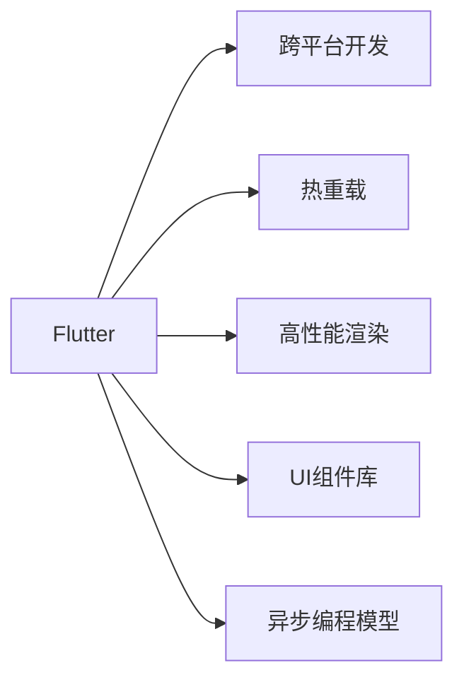

                 

# Flutter跨平台开发：一套代码，多端运行

## 1. 背景介绍

### 1.1 问题由来
随着移动设备的普及，跨平台应用开发成为IT行业的热点需求。传统的跨平台框架如Web App、Xamarin等存在代码冗余、性能差、用户体验不一致等问题，无法满足用户对高性能、低延迟的移动应用需求。而单一平台的应用又难以实现真正的跨设备兼容性。

在此背景下，Google于2015年推出了Flutter，以一套代码、多端运行为目标，通过高性能的渲染引擎、丰富的UI组件、统一的编程模型，显著提升了跨平台开发的效率和质量。

## 2. 核心概念与联系

### 2.1 核心概念概述

为了更好地理解Flutter跨平台开发技术，我们首先介绍几个关键概念：

- Flutter：Google开源的UI开发框架，支持iOS、Android、Web等多种平台，使用Dart语言开发，基于Compositor渲染引擎。Flutter通过生成预渲染像素级图形的渲染树，实现了高性能、低延迟的UI展示。
- 跨平台开发：使用一套代码实现多平台的应用开发，减少开发和维护成本，提升应用的质量和用户体验。
- 热重载(Hot Reload)：Flutter的调试工具，支持实时预览应用效果，加速开发迭代。
- 高性能渲染：Flutter的Compositor引擎通过预渲染像素级图形，实现流畅、高效的UI展示。
- UI组件库：Flutter提供丰富的UI组件，通过模板化的开发方式，提升了开发效率。
- 异步编程模型：Flutter基于观察者模式的异步编程模型，支持单向数据流和事件驱动的编程方式。

这些概念构成了Flutter跨平台开发的理论基础和实践框架，使其能够实现一套代码、多端运行的效果。

### 2.2 核心概念原理和架构的 Mermaid 流程图



## 3. 核心算法原理 & 具体操作步骤

### 3.1 算法原理概述

Flutter的跨平台开发技术基于以下核心算法原理：

1. 一套代码，多端运行：使用统一的Dart语言，通过预编译生成平台特定的代码，实现多平台兼容。

2. 热重载：在调试过程中，通过动态更新代码，即时更新UI效果，实现快速迭代。

3. 高性能渲染：Compositor引擎预渲染像素级图形，提高渲染性能，保证流畅的UI展示。

4. UI组件库：提供丰富的预构建UI组件，通过模板化开发，提升开发效率。

5. 异步编程模型：基于观察者模式的异步编程模型，支持单向数据流和事件驱动的编程方式，提升代码的可读性和可维护性。

### 3.2 算法步骤详解

1. 项目初始化：
   - 安装Flutter SDK和IDE，如Android Studio、VS Code等。
   - 创建一个新的Flutter项目，配置项目依赖和环境。

2. 编写Dart代码：
   - 编写UI组件和业务逻辑，使用Flutter提供的Dart语法和库。
   - 定义路由和状态管理，使用Flutter提供的路由库和状态管理工具。

3. 生成平台代码：
   - Flutter编译器将Dart代码编译为平台特定的原生代码，实现多平台兼容。

4. 热重载调试：
   - 使用热重载工具，实时预览应用效果，快速迭代开发。
   - 通过Flutter Debugger，进行网络调试和性能分析，优化应用性能。

5. 打包发布：
   - 使用Flutter构建工具，生成平台特定的APK或IPA包。
   - 发布到Google Play Store或App Store，部署到用户设备。

### 3.3 算法优缺点

#### 优点：

1. 一套代码，多端运行：减少开发和维护成本，提升应用的质量和用户体验。

2. 热重载：实时预览应用效果，快速迭代开发，提高开发效率。

3. 高性能渲染：预渲染像素级图形，实现流畅、高效的UI展示。

4. UI组件库：提升开发效率，保证UI一致性。

5. 异步编程模型：提高代码可读性和可维护性，简化复杂逻辑。

#### 缺点：

1. 学习曲线陡峭：Flutter依赖Dart语言和Compositor引擎，学习成本较高。

2. 性能优化困难：依赖预渲染图形，调整布局和样式可能导致性能下降。

3. 第三方库有限：相对于原生开发，Flutter的第三方库和工具支持相对较少。

4. 调试复杂：依赖热重载和调试工具，调试过程较为复杂。

### 3.4 算法应用领域

Flutter的跨平台开发技术在以下几个领域得到广泛应用：

1. 移动应用开发：如电商平台、社交网络、新闻阅读等应用。

2. Web应用开发：如企业门户、电子商务网站、SaaS平台等。

3. 游戏开发：如休闲游戏、体育竞技、策略模拟等游戏。

4. 智能家居：如智能音箱、智能穿戴设备、智能电视等。

5. 医疗健康：如电子病历、健康监测、远程诊疗等应用。

6. 教育培训：如在线课程、虚拟教室、自适应学习系统等。

Flutter的应用领域不断扩展，成为跨平台开发的首选框架之一。

## 4. 数学模型和公式 & 详细讲解 & 举例说明

### 4.1 数学模型构建

Flutter的UI组件库通过预构建UI组件，实现了模板化开发，提升开发效率。例如，一个简单的Text组件，其数学模型可以表示为：

$$
\text{Text}(\text{text}, \text{style})
$$

其中，text为文本内容，style为样式信息，包括字体大小、颜色、对齐方式等。

### 4.2 公式推导过程

以Text组件为例，Flutter的渲染过程可以分为以下几个步骤：

1. 生成渲染树：根据代码逻辑生成UI组件的树状结构，称为渲染树。

2. 渲染组件：将渲染树中的每个组件转换为Dart对象，生成对应的渲染代码。

3. 生成图形：Compositor引擎根据渲染代码生成像素级的图形，实现UI展示。

4. 显示图形：将生成的图形显示在设备屏幕上，完成UI渲染。

### 4.3 案例分析与讲解

下面以一个简单的计数器应用为例，展示Flutter的跨平台开发过程。

1. 编写代码：
```dart
import 'package:flutter/material.dart';

void main() {
  runApp(MyApp());
}

class MyApp extends StatelessWidget {
  @override
  Widget build(BuildContext context) {
    return MaterialApp(
      home: Counter(),
    );
  }
}

class Counter extends StatelessWidget {
  @override
  Widget build(BuildContext context) {
    return Scaffold(
      appBar: AppBar(title: Text('Counter')),
      body: Center(
        child: IncrementCounter(),
      ),
    );
  }
}

class IncrementCounter extends StatefulWidget {
  @override
  _IncrementCounterState createState() => _IncrementCounterState();
}

class _IncrementCounterState extends State<IncrementCounter> {
  int _count = 0;

  @override
  void _onIncrement() {
    setState(() {
      _count++;
    });
  }

  @override
  Widget build(BuildContext context) {
    return Column(
      children: [
        Text('Count: $_count'),
        RaisedButton(
          onPressed: _onIncrement,
          child: Text('Increment'),
        ),
      ],
    );
  }
}
```

2. 生成平台代码：
Flutter编译器将Dart代码编译为平台特定的原生代码，生成iOS和Android的渲染组件。

3. 热重载调试：
通过热重载工具，实时预览应用效果，快速迭代开发。

4. 打包发布：
使用Flutter构建工具，生成iOS和Android的APK包，发布到App Store和Google Play Store。

## 5. 项目实践：代码实例和详细解释说明

### 5.1 开发环境搭建

1. 安装Flutter SDK和IDE，如Android Studio、VS Code等。
```bash
gcloud components install flutter
```

2. 创建一个新的Flutter项目，配置项目依赖和环境。
```bash
flutter create my_flutter_app
cd my_flutter_app
```

3. 在IDE中导入项目，配置调试工具。

### 5.2 源代码详细实现

1. 编写Dart代码，定义UI组件和业务逻辑。
```dart
import 'package:flutter/material.dart';

void main() {
  runApp(MyApp());
}

class MyApp extends StatelessWidget {
  @override
  Widget build(BuildContext context) {
    return MaterialApp(
      home: Counter(),
    );
  }
}

class Counter extends StatelessWidget {
  @override
  Widget build(BuildContext context) {
    return Scaffold(
      appBar: AppBar(title: Text('Counter')),
      body: Center(
        child: IncrementCounter(),
      ),
    );
  }
}

class IncrementCounter extends StatefulWidget {
  @override
  _IncrementCounterState createState() => _IncrementCounterState();
}

class _IncrementCounterState extends State<IncrementCounter> {
  int _count = 0;

  @override
  void _onIncrement() {
    setState(() {
      _count++;
    });
  }

  @override
  Widget build(BuildContext context) {
    return Column(
      children: [
        Text('Count: $_count'),
        RaisedButton(
          onPressed: _onIncrement,
          child: Text('Increment'),
        ),
      ],
    );
  }
}
```

2. 运行热重载调试工具，实时预览应用效果。
```bash
flutter run
```

3. 生成平台代码，打包发布。
```bash
flutter build apk --release
flutter build ios --release
```

### 5.3 代码解读与分析

Flutter的UI组件库通过模板化的开发方式，提升了开发效率。例如，一个简单的Text组件，通过一行代码即可实现文本展示：

```dart
Text('Hello, World!', style: TextStyle(fontSize: 24, color: Colors.black))
```

Flutter的异步编程模型通过观察者模式的单向数据流和事件驱动，提高了代码的可读性和可维护性。例如，一个简单的按钮点击事件，可以通过事件驱动实现：

```dart
RaisedButton(
  onPressed: () {
    print('Button clicked');
  },
  child: Text('Click me'),
)
```

### 5.4 运行结果展示

Flutter通过热重载工具，可以实时预览应用效果，快速迭代开发。例如，在调试过程中，可以通过修改代码实现动态效果：

```dart
Text('Count: $_count', style: TextStyle(fontSize: _count * 16))
```

Flutter打包后的应用，可以通过Flutter Debugger进行网络调试和性能分析，优化应用性能。例如，在调试过程中，可以实时查看网络请求和数据流：

```dart
response.then((response) {
  print('Received response: ${response.data}');
});
```

## 6. 实际应用场景

### 6.1 智能家居

Flutter可以用于开发智能家居设备的应用，如智能音箱、智能穿戴设备、智能电视等。通过Flutter的高性能渲染和跨平台开发，可以实现设备间的无缝协同，提升用户体验。

### 6.2 医疗健康

Flutter可以用于开发医疗健康应用，如电子病历、健康监测、远程诊疗等。通过Flutter的异步编程模型和UI组件库，可以实现高效、稳定的应用开发。

### 6.3 教育培训

Flutter可以用于开发教育培训应用，如在线课程、虚拟教室、自适应学习系统等。通过Flutter的热重载工具和跨平台开发，可以快速迭代应用，提升学习效果。

### 6.4 未来应用展望

未来，Flutter将继续拓展应用领域，提升开发效率和用户体验。以下是几个可能的未来趋势：

1. 3D图形渲染：通过改进Compositor引擎，支持3D图形渲染，提升UI的视觉效果。

2. 硬件加速：通过引入GPU加速和硬件加速技术，提高应用的性能和响应速度。

3. 实时渲染：通过改进渲染算法，支持实时渲染，实现更流畅的UI展示。

4. 虚拟现实：通过支持VR和AR技术，开发虚拟现实应用，提升用户体验。

## 7. 工具和资源推荐

### 7.1 学习资源推荐

为了帮助开发者掌握Flutter的跨平台开发技术，这里推荐一些优质的学习资源：

1. Flutter官方文档：Flutter官方提供的详细文档，涵盖Flutter的API、组件、开发指南等内容。

2. Flutter Developer Guide：Google开发者指南，提供Flutter开发的最佳实践和案例。

3. Flutter by Example：Flutter实战项目案例，涵盖Flutter开发的各个方面。

4. Flutter for Beginners：Flutter入门教程，适合初学者学习。

5. Flutter in Action：Flutter实战开发，涵盖Flutter开发的全过程。

6. Flutter State Management：Flutter状态管理，提供Flutter状态管理的各种方案和最佳实践。

### 7.2 开发工具推荐

Flutter的开发工具支持多种IDE和调试工具，提供全面的开发环境：

1. Android Studio：Android平台的主流IDE，支持Flutter开发和调试。

2. VS Code：轻量级的跨平台IDE，支持Flutter开发和调试。

3. Flutter Debugger：Flutter的调试工具，支持热重载、网络调试和性能分析。

4. Flutter DevTools：Flutter的开发工具，支持实时预览和调试。

5. Flutter Fiddle：Flutter在线编辑器，适合快速编写和测试代码。

6. Flutter Creator：Flutter的开发工具，支持实时预览和调试。

### 7.3 相关论文推荐

Flutter的跨平台开发技术源于学界的持续研究。以下是几篇奠基性的相关论文，推荐阅读：

1. Flutter: Fast and interactive user interfaces with native performance.

2. Flutter: A fast and portable visual toolkit for building natively compiled applications in modern mobile, web, and desktop apps.

3. Flutter: Building beautiful and performant user interfaces with one codebase.

4. Flutter: A mobile development framework for building high performance and high fidelity applications.

5. Flutter: Cross-platform development with one codebase.

## 8. 总结：未来发展趋势与挑战

### 8.1 总结

本文对Flutter的跨平台开发技术进行了全面系统的介绍。首先阐述了Flutter的背景和核心概念，明确了跨平台开发在IT行业的重要性和价值。其次，从原理到实践，详细讲解了Flutter的开发流程和关键技术，给出了Flutter项目的完整代码实例。同时，本文还探讨了Flutter在多个行业领域的应用前景，展示了Flutter的广泛应用潜力。

通过本文的系统梳理，可以看到，Flutter的跨平台开发技术已经改变了移动应用的开发方式，提升了开发效率和用户体验。未来，伴随Flutter的不断演进，跨平台开发技术将更加成熟和普及，推动移动应用的进一步发展。

### 8.2 未来发展趋势

展望未来，Flutter的跨平台开发技术将呈现以下几个发展趋势：

1. 性能不断提升：通过改进Compositor引擎和硬件加速技术，Flutter的性能将不断提升，实现更流畅的UI展示。

2. 生态不断完善：Flutter的生态系统将不断完善，支持更多第三方库和插件，提升开发效率。

3. 应用领域不断扩展：Flutter将拓展更多应用领域，如智能家居、医疗健康、教育培训等，为更多行业带来价值。

4. 开发者社区壮大：Flutter的开发者社区将不断壮大，吸引更多的开发者参与，推动技术的进步和应用的创新。

### 8.3 面临的挑战

尽管Flutter的跨平台开发技术已经取得了瞩目成就，但在迈向更加智能化、普适化应用的过程中，它仍面临着诸多挑战：

1. 学习曲线陡峭：Flutter依赖Dart语言和Compositor引擎，学习成本较高。

2. 性能优化困难：依赖预渲染图形，调整布局和样式可能导致性能下降。

3. 第三方库有限：相对于原生开发，Flutter的第三方库和工具支持相对较少。

4. 调试复杂：依赖热重载和调试工具，调试过程较为复杂。

### 8.4 研究展望

未来，Flutter的跨平台开发技术需要在以下几个方面寻求新的突破：

1. 性能优化：通过改进渲染引擎和硬件加速技术，提升应用的性能和响应速度。

2. 开发者体验：提升开发工具的易用性和开发效率，降低学习曲线。

3. 生态建设：丰富第三方库和插件的生态系统，提升应用的灵活性和扩展性。

4. 开发者社区：吸引更多开发者参与，形成良好的开发者社区，推动技术的进步和应用的创新。

这些研究方向的探索，必将引领Flutter的跨平台开发技术迈向更高的台阶，为构建人机协同的智能时代中扮演越来越重要的角色。只有勇于创新、敢于突破，才能不断拓展语言模型的边界，让智能技术更好地造福人类社会。

## 9. 附录：常见问题与解答

**Q1：Flutter的性能如何？**

A: Flutter的性能取决于多个因素，如Compositor引擎的优化程度、设备的硬件配置、应用的复杂度等。一般来说，Flutter的性能表现接近原生应用，但在某些复杂场景下可能略逊于原生应用。通过优化代码和渲染引擎，可以显著提升应用的性能。

**Q2：Flutter的学习曲线陡峭吗？**

A: Flutter的学习曲线相对陡峭，主要原因是Flutter依赖Dart语言和Compositor引擎。但通过丰富的学习资源和实践项目，可以快速掌握Flutter开发技术。

**Q3：Flutter的生态系统如何？**

A: Flutter的生态系统在不断完善，提供了丰富的UI组件、第三方库和插件。开发者可以通过Flutter Package Registry找到适合自己的库和插件，提升开发效率。

**Q4：Flutter的热重载调试工具如何使用？**

A: Flutter的热重载调试工具可以通过IDE或Flutter DevTools进行使用。通过实时预览应用效果，可以快速迭代开发，提升开发效率。

**Q5：Flutter的性能优化有哪些方法？**

A: Flutter的性能优化主要从以下几个方面进行：

1. 渲染优化：通过改进Compositor引擎和渲染算法，提高渲染性能。

2. 布局优化：通过优化布局和样式，减少不必要的计算和渲染。

3. 异步编程：通过异步编程模型，避免阻塞UI线程，提升应用的响应速度。

**Q6：Flutter的开发者社区如何？**

A: Flutter的开发者社区不断壮大，吸引了众多开发者参与。开发者可以通过Flutter社区、Meetup、Twitter等平台，交流经验和技术，推动技术的进步和应用的创新。

---

作者：禅与计算机程序设计艺术 / Zen and the Art of Computer Programming

