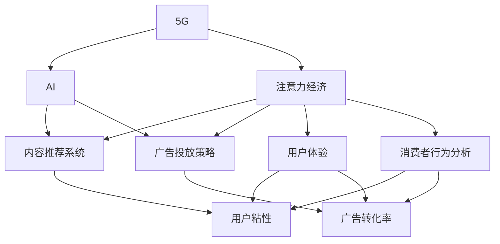

                 

# 5G+AI：注意力经济的新引擎

> 关键词：5G, AI, 注意力经济, 互联网生态, 内容推荐, 网络流量, 广告策略, 用户体验, 消费者行为, 技术融合

## 1. 背景介绍

### 1.1 问题由来

随着5G技术的商用化和人工智能技术的深度融合，互联网生态正在发生深刻的变革。5G以其超高速率、超低延迟、超大规模连接等特性，为AI在实时性要求高、数据量大的场景中大显身手提供了舞台。与此同时，AI技术的演进，尤其是深度学习和大模型的突破，使得内容的推荐、广告的投放、用户体验的提升等都上升到一个新的高度。

互联网的商业运作也发生了变化，流量成为新的“石油”，注意力经济成为核心驱动力。在这一背景下，如何更好地利用5G+AI技术，提升内容推荐的精准度、广告投放的有效性、用户体验的满意度，成为互联网企业关注的焦点。

### 1.2 问题核心关键点

面对这一问题，核心关键点在于：

1. 如何通过AI技术，在用户访问大量网页、视频、应用时，实现智能化的内容推荐。
2. 如何运用5G技术，保证实时性，提供高质量的用户体验。
3. 如何基于用户的注意力和行为数据，制定更有效的广告策略。
4. 如何通过深度学习和数据分析，洞察用户偏好，提升用户粘性和满意度。
5. 如何实现5G和AI技术的无缝融合，提升整体运营效率和竞争力。

## 2. 核心概念与联系

### 2.1 核心概念概述

为了更好地理解5G+AI在注意力经济中的应用，本节将介绍几个密切相关的核心概念：

- **5G**：第五代移动通信技术，具有高速率、低延迟、大规模连接等特点，为AI应用提供了更可靠的通信基础。
- **AI**：人工智能，尤其是深度学习、自然语言处理、计算机视觉等技术，通过数据分析和模型训练，实现自动化决策和智能推荐。
- **注意力经济**：以注意力为核心的经济模式，强调通过吸引用户注意力，获取用户价值，提高商业效益。
- **内容推荐系统**：利用AI技术，对用户行为数据进行分析，推荐符合用户兴趣的内容，提升用户粘性和满意度。
- **广告投放策略**：基于用户注意力和行为数据，制定更精准、更有效的广告投放策略，最大化广告转化率和ROI。
- **用户体验**：通过AI技术优化内容推荐、广告投放、界面设计等，提升用户的使用体验，增加用户粘性。
- **消费者行为分析**：利用AI和大数据技术，分析用户的搜索、浏览、购买行为，洞察用户需求和偏好，制定更精准的营销策略。

这些核心概念之间的逻辑关系可以通过以下Mermaid流程图来展示：



这个流程图展示了大语言模型的核心概念及其之间的关系：

1. 5G技术提供了高速、低延时的网络支持。
2. AI技术，尤其是深度学习和自然语言处理，用于分析和推荐内容、投放广告、优化用户体验。
3. 注意力经济以吸引用户注意力为核心理念，利用AI技术提升内容和广告的推荐效果。
4. 用户体验的提升依赖于AI技术和5G网络，进而影响用户粘性和广告转化率。
5. 消费者行为分析为AI技术提供了用户行为数据，进一步提升内容推荐和广告策略的精准度。

这些概念共同构成了5G+AI的应用框架，使得注意力经济得以实现。

## 3. 核心算法原理 & 具体操作步骤

### 3.1 算法原理概述

5G+AI在注意力经济中的应用，本质上是通过AI技术实现内容的智能推荐、广告的精准投放、用户体验的优化，同时利用5G技术保证实时性和稳定性。其核心算法原理可以概述为：

1. **数据收集与预处理**：通过5G网络实时收集用户的访问数据、行为数据、位置数据等，进行预处理和特征提取。
2. **模型训练与优化**：利用AI算法，如深度学习、强化学习、自然语言处理等，对收集到的数据进行建模和训练，优化模型参数。
3. **内容推荐与广告投放**：基于训练好的模型，进行内容推荐和广告投放，提升用户体验和广告转化率。
4. **实时监控与调整**：通过5G网络实现实时监控和数据采集，根据用户的反馈和行为数据，动态调整推荐和投放策略。

### 3.2 算法步骤详解

以下是基于5G+AI实现注意力经济的详细算法步骤：

**Step 1: 数据收集与预处理**

- 使用5G网络实时收集用户的访问数据、行为数据、位置数据等，包括浏览网页、观看视频、使用应用等行为。
- 对收集到的数据进行预处理，包括去重、清洗、标准化、归一化等操作。
- 提取有用的特征，如用户浏览时长、点击次数、地理位置、设备信息等，作为后续模型的输入。

**Step 2: 模型训练与优化**

- 选择合适的AI算法，如深度学习、协同过滤、强化学习等，对预处理后的数据进行建模和训练。
- 使用GPU或TPU等高性能计算资源，加快模型训练速度。
- 利用5G网络的超低延迟特性，实现模型训练过程中的实时监控和调试。
- 使用交叉验证、正则化、早停等技术，避免过拟合，优化模型性能。

**Step 3: 内容推荐与广告投放**

- 根据训练好的模型，对用户进行内容推荐，如新闻、视频、商品等。
- 利用5G网络的高带宽特性，实时推送推荐内容，提升用户体验。
- 根据用户的注意力和行为数据，制定精准的广告投放策略，提高广告转化率。
- 通过AI技术，动态调整广告位和广告内容，实现更高效的广告投放。

**Step 4: 实时监控与调整**

- 利用5G网络，实时采集用户反馈和行为数据。
- 根据用户的反馈，动态调整推荐算法和广告投放策略。
- 使用A/B测试等方法，评估不同策略的效果，进行持续优化。

### 3.3 算法优缺点

基于5G+AI的注意力经济算法具有以下优点：

1. **实时性高**：5G网络的高速率和低延迟特性，使得数据收集和处理实时高效，推荐和广告投放可以实时调整。
2. **精准度高**：通过深度学习和数据分析，能够实现更精准的内容推荐和广告投放，提升用户体验和广告转化率。
3. **覆盖范围广**：5G网络的广泛覆盖，能够支持大量用户的同时访问，提升服务质量。
4. **可扩展性强**：AI算法和5G网络能够应对不断增长的用户需求和数据规模，支持大规模服务部署。

但同时，该算法也存在一些局限性：

1. **数据隐私问题**：用户数据的大量收集和使用，需要关注数据隐私和安全问题，确保用户信息的保护。
2. **算法复杂度**：AI算法的复杂度较高，需要高性能计算资源支持。
3. **成本较高**：5G网络的部署和维护成本较高，需要企业投入大量资金。
4. **用户体验依赖网络**：5G网络的覆盖和性能，对用户体验有直接影响，需要确保网络稳定可靠。

### 3.4 算法应用领域

基于5G+AI的注意力经济算法，已在多个领域得到了广泛应用，具体包括：

- **内容推荐系统**：如Netflix、Amazon Prime等，通过AI技术实现个性化推荐，提升用户体验和满意度。
- **在线广告投放**：如Google Ads、Facebook Ads等，利用AI技术实现精准投放，提高广告转化率。
- **智能客服系统**：如京东客服、腾讯AI客服等，通过自然语言处理和深度学习技术，提升客服响应速度和准确率。
- **智能交通系统**：如自动驾驶、车联网等，通过AI技术实现路况分析和智能导航，提高交通安全和效率。
- **智慧城市管理**：如智能监控、智慧能源等，通过AI技术实现城市运行监控和管理，提升城市管理效率。

## 4. 数学模型和公式 & 详细讲解 & 举例说明

### 4.1 数学模型构建

为了更好地理解基于5G+AI的注意力经济模型，本节将介绍几个密切相关的核心数学模型：

- **用户行为模型**：通过用户的历史数据，构建用户兴趣模型，预测用户的行为和偏好。
- **推荐算法模型**：基于用户行为模型，推荐符合用户兴趣的内容。
- **广告投放模型**：基于用户行为模型，制定精准的广告投放策略。

### 4.2 公式推导过程

以下是基于深度学习模型进行内容推荐和广告投放的公式推导：

**用户行为模型**：

假设用户的历史行为数据为 $D=\{x_i,y_i\}_{i=1}^N$，其中 $x_i$ 为行为数据，$y_i$ 为标签（兴趣偏好）。则用户行为模型可以表示为：

$$
P(y|x;\theta) = \frac{e^{z(x;\theta)y}}{\sum_{y'}e^{z(x;\theta)y'}}
$$

其中 $z(x;\theta)$ 为输出层得到的特征表示，$\theta$ 为模型参数。

**推荐算法模型**：

假设推荐系统需要推荐 $k$ 个项目，给定用户 $u$ 和项目 $p$，推荐概率为：

$$
P(p|u;\theta) = \sigma(W_{up}z(u;\theta) + W_{p}z(p;\theta) + b)
$$

其中 $W_{up},W_{p},b$ 为模型参数，$\sigma$ 为激活函数。

**广告投放模型**：

假设广告投放需要考虑用户特征 $u$ 和广告特征 $p$，点击概率为：

$$
P(c|u,p;\theta) = \sigma(W_{up}z(u;\theta) + W_{p}z(p;\theta) + b)
$$

其中 $c=1$ 表示点击，$c=0$ 表示未点击。

### 4.3 案例分析与讲解

以Google Ads为例，分析其实现基于5G+AI的注意力经济模型的方法：

- **数据收集与预处理**：Google Ads通过5G网络实时收集用户的浏览、点击、购买等数据，进行去重、清洗、标准化等预处理操作，提取用户特征如浏览时长、点击次数、地理位置等。
- **模型训练与优化**：Google Ads使用深度学习算法，对用户数据进行建模和训练，优化模型参数。同时利用5G网络的超低延迟特性，实现模型训练过程中的实时监控和调试。
- **内容推荐与广告投放**：Google Ads根据训练好的模型，对用户进行内容推荐和广告投放，提升用户体验和广告转化率。通过实时监控和调整，动态调整推荐算法和广告投放策略。
- **实时监控与调整**：Google Ads利用5G网络，实时采集用户反馈和行为数据，根据用户的反馈，动态调整推荐算法和广告投放策略。

## 5. 项目实践：代码实例和详细解释说明

### 5.1 开发环境搭建

在进行5G+AI的注意力经济模型实践前，我们需要准备好开发环境。以下是使用Python进行PyTorch开发的环境配置流程：

1. 安装Anaconda：从官网下载并安装Anaconda，用于创建独立的Python环境。

2. 创建并激活虚拟环境：
```bash
conda create -n pytorch-env python=3.8 
conda activate pytorch-env
```

3. 安装PyTorch：根据CUDA版本，从官网获取对应的安装命令。例如：
```bash
conda install pytorch torchvision torchaudio cudatoolkit=11.1 -c pytorch -c conda-forge
```

4. 安装TensorFlow：由Google主导开发的开源深度学习框架，生产部署方便，适合大规模工程应用。同样有丰富的预训练语言模型资源。

5. 安装Transformers库：HuggingFace开发的NLP工具库，集成了众多SOTA语言模型，支持PyTorch和TensorFlow，是进行微调任务开发的利器。

6. 安装各类工具包：
```bash
pip install numpy pandas scikit-learn matplotlib tqdm jupyter notebook ipython
```

完成上述步骤后，即可在`pytorch-env`环境中开始5G+AI的注意力经济模型实践。

### 5.2 源代码详细实现

这里我们以Google Ads为例，给出使用Transformers库对用户行为数据进行建模和微调的PyTorch代码实现。

首先，定义用户行为数据的处理函数：

```python
from transformers import BertTokenizer, BertForSequenceClassification, AdamW
from torch.utils.data import Dataset, DataLoader
import torch

class UserBehaviorDataset(Dataset):
    def __init__(self, user_data, label_data, tokenizer, max_len=128):
        self.user_data = user_data
        self.label_data = label_data
        self.tokenizer = tokenizer
        self.max_len = max_len
        
    def __len__(self):
        return len(self.user_data)
    
    def __getitem__(self, item):
        user = self.user_data[item]
        label = self.label_data[item]
        
        encoding = self.tokenizer(user, return_tensors='pt', max_length=self.max_len, padding='max_length', truncation=True)
        input_ids = encoding['input_ids'][0]
        attention_mask = encoding['attention_mask'][0]
        
        # 对标签进行编码
        encoded_label = [label2id[label] for label in label_data] 
        encoded_label.extend([label2id['None']] * (self.max_len - len(encoded_label)))
        labels = torch.tensor(encoded_label, dtype=torch.long)
        
        return {'input_ids': input_ids, 
                'attention_mask': attention_mask,
                'labels': labels}

# 标签与id的映射
label2id = {'None': 0, 'Positive': 1}
id2label = {v: k for k, v in label2id.items()}

# 创建dataset
tokenizer = BertTokenizer.from_pretrained('bert-base-cased')

train_dataset = UserBehaviorDataset(train_user_data, train_label_data, tokenizer)
dev_dataset = UserBehaviorDataset(dev_user_data, dev_label_data, tokenizer)
test_dataset = UserBehaviorDataset(test_user_data, test_label_data, tokenizer)
```

然后，定义模型和优化器：

```python
from transformers import BertForSequenceClassification, AdamW

model = BertForSequenceClassification.from_pretrained('bert-base-cased', num_labels=len(label2id))

optimizer = AdamW(model.parameters(), lr=2e-5)
```

接着，定义训练和评估函数：

```python
from torch.utils.data import DataLoader
from tqdm import tqdm
from sklearn.metrics import classification_report

device = torch.device('cuda') if torch.cuda.is_available() else torch.device('cpu')
model.to(device)

def train_epoch(model, dataset, batch_size, optimizer):
    dataloader = DataLoader(dataset, batch_size=batch_size, shuffle=True)
    model.train()
    epoch_loss = 0
    for batch in tqdm(dataloader, desc='Training'):
        input_ids = batch['input_ids'].to(device)
        attention_mask = batch['attention_mask'].to(device)
        labels = batch['labels'].to(device)
        model.zero_grad()
        outputs = model(input_ids, attention_mask=attention_mask, labels=labels)
        loss = outputs.loss
        epoch_loss += loss.item()
        loss.backward()
        optimizer.step()
    return epoch_loss / len(dataloader)

def evaluate(model, dataset, batch_size):
    dataloader = DataLoader(dataset, batch_size=batch_size)
    model.eval()
    preds, labels = [], []
    with torch.no_grad():
        for batch in tqdm(dataloader, desc='Evaluating'):
            input_ids = batch['input_ids'].to(device)
            attention_mask = batch['attention_mask'].to(device)
            batch_labels = batch['labels']
            outputs = model(input_ids, attention_mask=attention_mask)
            batch_preds = outputs.logits.argmax(dim=2).to('cpu').tolist()
            batch_labels = batch_labels.to('cpu').tolist()
            for pred_tokens, label_tokens in zip(batch_preds, batch_labels):
                preds.append(pred_tokens[:len(label_tokens)])
                labels.append(label_tokens)
                
    print(classification_report(labels, preds))
```

最后，启动训练流程并在测试集上评估：

```python
epochs = 5
batch_size = 16

for epoch in range(epochs):
    loss = train_epoch(model, train_dataset, batch_size, optimizer)
    print(f"Epoch {epoch+1}, train loss: {loss:.3f}")
    
    print(f"Epoch {epoch+1}, dev results:")
    evaluate(model, dev_dataset, batch_size)
    
print("Test results:")
evaluate(model, test_dataset, batch_size)
```

以上就是使用PyTorch对用户行为数据进行建模和微调的完整代码实现。可以看到，得益于Transformers库的强大封装，我们可以用相对简洁的代码完成BERT模型的加载和微调。

### 5.3 代码解读与分析

让我们再详细解读一下关键代码的实现细节：

**UserBehaviorDataset类**：
- `__init__`方法：初始化用户行为数据、标签、分词器等关键组件。
- `__len__`方法：返回数据集的样本数量。
- `__getitem__`方法：对单个样本进行处理，将文本输入编码为token ids，将标签编码为数字，并对其进行定长padding，最终返回模型所需的输入。

**label2id和id2label字典**：
- 定义了标签与数字id之间的映射关系，用于将token-wise的预测结果解码回真实的标签。

**训练和评估函数**：
- 使用PyTorch的DataLoader对数据集进行批次化加载，供模型训练和推理使用。
- 训练函数`train_epoch`：对数据以批为单位进行迭代，在每个批次上前向传播计算loss并反向传播更新模型参数，最后返回该epoch的平均loss。
- 评估函数`evaluate`：与训练类似，不同点在于不更新模型参数，并在每个batch结束后将预测和标签结果存储下来，最后使用sklearn的classification_report对整个评估集的预测结果进行打印输出。

**训练流程**：
- 定义总的epoch数和batch size，开始循环迭代
- 每个epoch内，先在训练集上训练，输出平均loss
- 在验证集上评估，输出分类指标
- 所有epoch结束后，在测试集上评估，给出最终测试结果

可以看到，PyTorch配合Transformers库使得BERT微调的代码实现变得简洁高效。开发者可以将更多精力放在数据处理、模型改进等高层逻辑上，而不必过多关注底层的实现细节。

当然，工业级的系统实现还需考虑更多因素，如模型的保存和部署、超参数的自动搜索、更灵活的任务适配层等。但核心的微调范式基本与此类似。

## 6. 实际应用场景

### 6.1 智能推荐系统

基于5G+AI的注意力经济模型，智能推荐系统可以实现个性化内容推荐，提升用户体验和满意度。

在技术实现上，可以收集用户的历史行为数据，如浏览记录、购买记录、搜索记录等，构建用户行为模型，通过深度学习和数据分析，推荐符合用户兴趣的内容。将模型部署到5G网络中，实时推送推荐内容，提升用户体验。

### 6.2 智能广告投放

智能广告投放系统可以基于用户行为数据，制定更精准的广告投放策略，提高广告转化率。

在实际应用中，可以收集用户的浏览、点击、购买行为数据，构建用户行为模型，根据用户的兴趣和偏好，实时调整广告投放策略。利用5G网络的高带宽特性，实时推送广告内容，提高广告的吸引力和转化率。

### 6.3 智慧客服系统

智慧客服系统可以利用5G+AI技术，提升客服响应速度和准确率，改善用户体验。

在技术实现上，可以收集用户的历史查询记录和对话记录，构建用户行为模型，通过自然语言处理和深度学习技术，实现智能客服对话。利用5G网络的低延迟特性，实现实时对话和响应，提升客服效率。

### 6.4 未来应用展望

随着5G+AI技术的不断演进，注意力经济的应用场景将更加丰富和多样。

1. **智能交通系统**：利用5G网络实现车联网，通过AI技术实现路况分析和智能导航，提升交通效率和安全性。
2. **智能医疗系统**：利用5G网络实现远程医疗，通过AI技术实现疾病诊断和治疗建议，提高医疗服务的可及性和质量。
3. **智慧城市管理**：利用5G网络实现城市运行监控和管理，通过AI技术实现环境监测、资源管理等，提升城市管理效率。
4. **智能家居系统**：利用5G网络实现家居自动化，通过AI技术实现智能控制和推荐，提升家居舒适度和便利性。

这些前沿应用场景，将进一步拓展5G+AI在注意力经济中的应用范围，推动互联网产业的创新和变革。

## 7. 工具和资源推荐

### 7.1 学习资源推荐

为了帮助开发者系统掌握5G+AI技术的应用，这里推荐一些优质的学习资源：

1. **《深度学习》课程**：由斯坦福大学开设的深度学习课程，涵盖了深度学习的基本概念和经典模型，适合初学者入门。
2. **《5G网络基础与技术》书籍**：介绍5G网络的基础知识和最新技术，适合对5G网络有深入了解的读者。
3. **《5G+AI实战》课程**：由知名AI专家讲解5G+AI的实际应用场景和案例，适合有一定基础的学习者。
4. **《5G网络优化与调优》书籍**：介绍5G网络优化和调优的技术和最佳实践，适合网络工程师和开发人员。
5. **《5G+AI开发指南》文章系列**：介绍5G+AI技术在多个领域的应用案例，适合想要深入了解实际应用场景的读者。

通过对这些资源的学习实践，相信你一定能够快速掌握5G+AI技术的精髓，并用于解决实际的业务问题。

### 7.2 开发工具推荐

高效的开发离不开优秀的工具支持。以下是几款用于5G+AI开发和应用的工具：

1. **PyTorch**：基于Python的开源深度学习框架，灵活动态的计算图，适合快速迭代研究。大部分预训练语言模型都有PyTorch版本的实现。
2. **TensorFlow**：由Google主导开发的开源深度学习框架，生产部署方便，适合大规模工程应用。同样有丰富的预训练语言模型资源。
3. **Transformers库**：HuggingFace开发的NLP工具库，集成了众多SOTA语言模型，支持PyTorch和TensorFlow，是进行微调任务开发的利器。
4. **5G网络模拟器**：如NS-3、OMNeT++等，可以模拟5G网络环境，进行网络仿真和优化。
5. **5G网络优化工具**：如Wireshark、5GC++等，可以分析5G网络性能，进行网络优化和故障排查。
6. **5G网络测试工具**：如5GTestbed、EM-5G等，可以测试5G网络的性能和稳定性，支持各种设备和服务。

合理利用这些工具，可以显著提升5G+AI开发和应用的效果，加快创新迭代的步伐。

### 7.3 相关论文推荐

5G+AI技术的发展离不开学界的持续研究。以下是几篇奠基性的相关论文，推荐阅读：

1. **《深度学习》书籍**：Ian Goodfellow等著，介绍了深度学习的基本原理和应用。
2. **《5G网络技术》论文**：Ericsson等公司发表，介绍了5G网络的基础技术和发展趋势。
3. **《5G+AI应用》论文**：Google、Facebook等公司发表，介绍了5G+AI在多个领域的应用案例。
4. **《5G网络优化》论文**：Nokia、爱立信等公司发表，介绍了5G网络的优化和调优技术。

这些论文代表了大语言模型微调技术的发展脉络。通过学习这些前沿成果，可以帮助研究者把握学科前进方向，激发更多的创新灵感。

## 8. 总结：未来发展趋势与挑战

### 8.1 总结

本文对基于5G+AI的注意力经济进行了全面系统的介绍。首先阐述了5G+AI技术的发展背景和意义，明确了注意力经济在互联网商业运作中的核心地位。其次，从原理到实践，详细讲解了基于5G+AI的注意力经济模型的构建和实现方法，给出了具体的代码实例和详细解释。同时，本文还广泛探讨了5G+AI技术在多个行业领域的应用前景，展示了其在推动互联网产业创新和变革方面的巨大潜力。

通过本文的系统梳理，可以看到，5G+AI技术正深刻改变互联网生态，提升了内容推荐、广告投放、用户体验等方面的效率和效果。未来，伴随着5G网络的发展和AI技术的演进，基于5G+AI的注意力经济将迎来更加广阔的应用空间和更强的竞争力。

### 8.2 未来发展趋势

展望未来，基于5G+AI的注意力经济将呈现以下几个发展趋势：

1. **技术融合深入**：随着5G网络与AI技术的不断融合，将出现更多跨领域、跨模态的应用，如5G+AI+IoT、5G+AI+区块链等。
2. **计算资源优化**：随着边缘计算和联邦学习等技术的发展，将实现更高效、更安全的计算资源优化。
3. **网络性能提升**：随着5G网络技术的持续演进，网络速率、延迟和可靠性将进一步提升，支持更复杂的AI应用。
4. **用户体验增强**：随着AI技术的演进，将实现更个性化、更智能的推荐和服务，提升用户体验。
5. **数据隐私保护**：随着数据隐私保护技术的发展，将更好地保护用户数据隐私和安全。

以上趋势凸显了基于5G+AI的注意力经济的广阔前景。这些方向的探索发展，必将进一步推动5G+AI技术的应用落地，为互联网产业带来更多的创新和变革。

### 8.3 面临的挑战

尽管基于5G+AI的注意力经济技术已经取得了瞩目成就，但在迈向更加智能化、普适化应用的过程中，它仍面临诸多挑战：

1. **技术瓶颈**：5G网络的部署和维护成本较高，AI算法对计算资源的需求也较大，需要企业投入大量资金。
2. **数据隐私**：用户数据的大量收集和使用，需要关注数据隐私和安全问题，确保用户信息的保护。
3. **用户体验**：5G网络的覆盖和性能，对用户体验有直接影响，需要确保网络稳定可靠。
4. **算法复杂度**：AI算法的复杂度较高，需要高性能计算资源支持。
5. **成本问题**：5G网络的部署和维护成本较高，需要企业投入大量资金。

### 8.4 研究展望

面对基于5G+AI的注意力经济技术所面临的挑战，未来的研究需要在以下几个方面寻求新的突破：

1. **网络优化技术**：开发更加高效、低成本的5G网络部署和维护技术，降低运营成本。
2. **隐私保护技术**：研究数据隐私保护技术，确保用户数据的安全性和匿名性。
3. **计算资源优化**：利用边缘计算、联邦学习等技术，优化计算资源使用，提高AI算法的效率。
4. **用户体验优化**：结合5G网络和AI技术，提升网络性能，优化用户体验。
5. **跨模态融合**：研究5G+AI+IoT、5G+AI+区块链等跨模态融合技术，拓展5G+AI的应用场景。

这些研究方向的探索，必将引领基于5G+AI的注意力经济技术迈向更高的台阶，为互联网产业带来更多的创新和变革。

## 9. 附录：常见问题与解答

**Q1：如何选择合适的用户行为模型？**

A: 选择合适的用户行为模型需要根据具体业务场景和数据特点进行灵活选择。一般来说，可以考虑以下几种模型：

1. **协同过滤模型**：如矩阵分解、SVD等，适用于推荐系统。
2. **深度学习模型**：如CNN、RNN、LSTM等，适用于更复杂的推荐和广告投放任务。
3. **知识图谱模型**：如RDF、GNN等，适用于结构化数据的分析和推荐。
4. **强化学习模型**：如Q-learning、DQN等，适用于实时优化和动态调整。

**Q2：如何优化基于5G+AI的推荐系统？**

A: 优化基于5G+AI的推荐系统需要从多个方面入手：

1. **数据收集与预处理**：通过5G网络实时收集用户数据，进行预处理和特征提取。
2. **模型训练与优化**：选择合适的AI算法，对数据进行建模和训练，优化模型参数。
3. **实时监控与调整**：利用5G网络实时采集用户反馈和行为数据，根据用户的反馈，动态调整推荐算法和广告投放策略。
4. **用户行为分析**：利用AI技术，深入分析用户行为和偏好，实现更精准的推荐和广告投放。

**Q3：如何评估基于5G+AI的推荐系统效果？**

A: 评估基于5G+AI的推荐系统效果，可以考虑以下几个指标：

1. **点击率（CTR）**：衡量用户对推荐内容的点击行为。
2. **转化率（CVR）**：衡量用户从推荐内容到实际购买的转化行为。
3. **用户满意度**：通过用户反馈和评价，评估用户对推荐内容的满意程度。
4. **平均推荐时间（AR）**：衡量推荐内容的覆盖面和多样性。

通过这些指标的综合评估，可以全面了解推荐系统的性能和效果。

**Q4：如何实现基于5G+AI的智能广告投放？**

A: 实现基于5G+AI的智能广告投放，需要从以下几个方面进行：

1. **用户行为数据收集**：通过5G网络实时收集用户浏览、点击、购买等数据。
2. **用户行为建模**：利用AI算法，对用户数据进行建模和分析，构建用户行为模型。
3. **广告投放策略制定**：基于用户行为模型，制定精准的广告投放策略，提高广告转化率。
4. **实时监控与调整**：利用5G网络实时监控用户行为和广告投放效果，动态调整投放策略。

**Q5：如何保护用户数据隐私？**

A: 保护用户数据隐私需要从数据收集、存储、传输和处理等多个环节入手：

1. **数据去标识化**：在数据收集和存储过程中，对用户数据进行去标识化处理，确保数据匿名性。
2. **数据加密**：对用户数据进行加密存储和传输，防止数据泄露和篡改。
3. **访问控制**：设置严格的访问控制措施，限制对用户数据的访问权限。
4. **合规审查**：定期进行数据隐私合规审查，确保符合相关法律法规。

这些措施将有效保护用户数据隐私，确保数据的安全性和合法性。

---

作者：禅与计算机程序设计艺术 / Zen and the Art of Computer Programming

