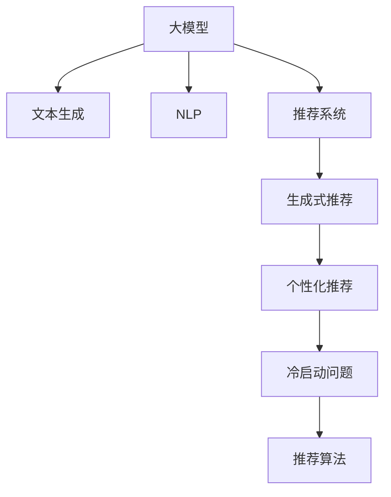

                 

# GENRE:基于大模型的生成式新闻推荐框架

> 关键词：生成式新闻推荐,大模型,自然语言处理,深度学习,文本生成,推荐系统,内容推荐

## 1. 背景介绍

在信息爆炸的时代，新闻推荐已成为获取有效信息的重要手段。用户如何能够在海量新闻中发现感兴趣的内容，实现个性化推荐，提升信息获取效率，是亟待解决的重要问题。本文将介绍一种基于大模型的生成式新闻推荐框架，通过预训练语言模型和微调技术，实现个性化、多样化的新闻推荐。

### 1.1 问题由来

在新闻推荐领域，传统推荐系统主要依赖用户历史行为数据进行推荐，面临以下挑战：
1. **冷启动问题**：对于新用户，缺乏足够的历史行为数据，难以准确推荐。
2. **数据稀疏性**：用户行为数据具有高维稀疏性，难以有效捕捉用户兴趣。
3. **时效性要求**：新闻内容时效性高，需要实时更新推荐模型。
4. **多样化需求**：用户对新闻内容的需求多样化，单一推荐策略难以满足。

为此，研究人员开始探索利用大语言模型，通过文本生成和自然语言处理技术，生成个性化新闻推荐内容。本文介绍的生成式新闻推荐框架，正是在这一背景下诞生的创新解决方案。

### 1.2 问题核心关键点

本文介绍的生成式新闻推荐框架的核心关键点包括：
1. **预训练语言模型的选择**：如何选择预训练语言模型，使其能够最好地捕捉新闻内容的特征。
2. **文本生成和推荐算法**：如何将生成式文本与推荐算法相结合，实现个性化新闻推荐。
3. **推荐效果评估**：如何评估生成式新闻推荐的性能，确保推荐质量。
4. **实际应用部署**：如何将生成式新闻推荐系统部署到实际应用中，实现高效推荐。

## 2. 核心概念与联系

### 2.1 核心概念概述

为更好地理解基于大模型的生成式新闻推荐框架，本节将介绍几个密切相关的核心概念：

- **大模型(Large Language Model, LLM)**：以自回归(如GPT)或自编码(如BERT)模型为代表的大规模预训练语言模型。通过在大规模无标签文本语料上进行预训练，学习通用的语言表示，具备强大的语言理解和生成能力。

- **文本生成(Text Generation)**：利用预训练语言模型生成自然语言文本，包括文本补全、摘要生成、对话生成等。

- **自然语言处理(Natural Language Processing, NLP)**：利用计算机技术处理、分析、理解自然语言，包括文本分类、情感分析、实体识别等任务。

- **推荐系统(Recommendation System)**：通过分析用户行为数据，推荐用户可能感兴趣的商品、内容、服务等。

- **生成式推荐(Generative Recommendation)**：使用生成模型，通过训练生成推荐内容，提升推荐效果。

- **个性化推荐(Personalized Recommendation)**：根据用户个性化特征，推荐用户最可能感兴趣的内容。

- **冷启动问题(Cold-Start Problem)**：新用户缺乏足够的历史行为数据，推荐系统难以进行有效推荐。

- **推荐算法(Recommendation Algorithm)**：包括协同过滤、内容推荐、混合推荐等方法。

这些核心概念之间的逻辑关系可以通过以下Mermaid流程图来展示：



这个流程图展示了大模型生成式新闻推荐框架的核心概念及其之间的关系：

1. 大模型通过预训练获得基础能力。
2. 文本生成能力实现新闻内容生成。
3. NLP能力用于提取新闻内容特征。
4. 推荐系统实现内容推荐。
5. 生成式推荐通过生成内容提升推荐质量。
6. 个性化推荐根据用户特征提供个性化内容。
7. 冷启动问题通过文本生成和推荐算法解决。
8. 推荐算法包括协同过滤、内容推荐等，用于多维度推荐。

## 3. 核心算法原理 & 具体操作步骤
### 3.1 算法原理概述

基于大模型的生成式新闻推荐框架，本质上是一种通过文本生成技术，生成新闻内容，再结合推荐算法，实现个性化推荐的方法。其核心思想是：利用预训练语言模型生成新闻文本，通过推荐算法推荐给用户，提升用户的新闻获取体验。

形式化地，假设预训练语言模型为 $M_{\theta}$，其中 $\theta$ 为预训练得到的模型参数。给定用户 $u$ 的特征向量 $\mathbf{f}_u$，新闻内容库 $C$，则推荐框架的目标是找到最优的新闻内容 $c \in C$，使得用户 $u$ 对新闻内容 $c$ 的评分 $s_u(c)$ 最大化：

$$
\hat{c} = \mathop{\arg\max}_{c \in C} s_u(c)
$$

其中 $s_u(c)$ 为用户 $u$ 对新闻内容 $c$ 的评分，通常采用模型预测的方式。

### 3.2 算法步骤详解

基于大模型的生成式新闻推荐框架一般包括以下几个关键步骤：

**Step 1: 准备预训练模型和数据集**
- 选择合适的预训练语言模型 $M_{\theta}$ 作为初始化参数，如 GPT、BERT、T5 等。
- 收集用户特征数据集 $U=\{(\mathbf{f}_u)\}_{u=1}^M$，新闻内容库 $C=\{c_i\}_{i=1}^N$，以及用户-内容评分数据集 $R=\{(u_i, c_i, r_i)\}_{i=1}^M$。

**Step 2: 添加任务适配层**
- 根据任务类型，在预训练模型顶层设计合适的输出层和损失函数。
- 对于新闻推荐任务，通常在顶层添加用户特征嵌入层，生成新闻内容的嵌入向量。
- 设计评分模型，如双线性模型、注意力机制等，将用户特征和新闻内容向量进行融合，输出评分。

**Step 3: 设置微调超参数**
- 选择合适的优化算法及其参数，如 AdamW、SGD 等，设置学习率、批大小、迭代轮数等。
- 设置正则化技术及强度，包括权重衰减、Dropout、Early Stopping 等。
- 确定冻结预训练参数的策略，如仅微调顶层，或全部参数都参与微调。

**Step 4: 执行梯度训练**
- 将用户特征数据集和新闻内容库分批次输入模型，前向传播计算评分。
- 反向传播计算参数梯度，根据设定的优化算法和学习率更新模型参数。
- 周期性在验证集上评估模型性能，根据性能指标决定是否触发 Early Stopping。
- 重复上述步骤直到满足预设的迭代轮数或 Early Stopping 条件。

**Step 5: 测试和部署**
- 在测试集上评估微调后模型 $M_{\hat{\theta}}$ 的性能，对比微调前后的评分提升。
- 使用微调后的模型对用户进行新闻推荐，集成到实际的应用系统中。
- 持续收集新的用户数据，定期重新微调模型，以适应数据分布的变化。

以上是基于大模型的生成式新闻推荐框架的一般流程。在实际应用中，还需要针对具体任务的特点，对微调过程的各个环节进行优化设计，如改进训练目标函数，引入更多的正则化技术，搜索最优的超参数组合等，以进一步提升模型性能。

### 3.3 算法优缺点

基于大模型的生成式新闻推荐框架具有以下优点：
1. **个性化推荐能力**：利用大模型生成个性化新闻内容，提升推荐效果。
2. **冷启动问题解决**：文本生成技术可在缺乏用户历史行为数据时，生成个性化新闻内容。
3. **多维度推荐**：生成式推荐和个性化推荐结合，提供多样化推荐内容。
4. **算法简单**：文本生成和推荐算法的结合，使得生成式新闻推荐框架简单易用。
5. **性能提升**：生成式推荐在推荐效果上通常优于传统的协同过滤和内容推荐方法。

同时，该框架也存在一定的局限性：
1. **生成内容质量**：生成的新闻内容质量受限于预训练模型，可能存在语法错误、语义不清等问题。
2. **计算资源需求**：大规模语言模型训练和推理需要较高的计算资源，部署成本较高。
3. **模型泛化能力**：生成式推荐模型可能过度拟合生成内容，导致泛化能力不足。
4. **解释性不足**：推荐内容生成过程不透明，难以解释推荐决策的依据。
5. **隐私问题**：生成式推荐需要收集用户特征和新闻内容，可能引发隐私问题。

尽管存在这些局限性，但就目前而言，基于大模型的生成式新闻推荐框架仍是一种高效、有效的推荐方式。未来相关研究的重点在于如何进一步提高生成内容的自然度和质量，优化推荐算法，同时兼顾可解释性和伦理安全性等因素。

### 3.4 算法应用领域

基于大模型的生成式新闻推荐框架已经在新闻推荐、内容生成、广告推荐等多个领域得到应用，例如：

- **新闻推荐系统**：为用户推荐感兴趣的新闻内容，如今日头条、搜狐新闻等。
- **内容生成平台**：根据用户兴趣生成个性化文章、视频、音乐等，如小红书、抖音等。
- **广告推荐系统**：为广告主推荐潜在用户群体，如微博广告、百度推广等。
- **视频推荐系统**：根据用户观看历史生成个性化视频推荐，如腾讯视频、爱奇艺等。
- **智能客服系统**：通过生成自然语言对话内容，提升客户服务体验，如阿里智能客服、美团客服等。

除了上述这些经典应用外，生成式新闻推荐框架还被创新性地应用到更多场景中，如智能广告生成、智能文章创作、智能视频编辑等，为NLP技术带来了全新的突破。随着生成模型的不断进步，相信生成式新闻推荐框架将在更广阔的应用领域大放异彩。

## 4. 数学模型和公式 & 详细讲解 & 举例说明
### 4.1 数学模型构建

本节将使用数学语言对基于大模型的生成式新闻推荐框架进行更加严格的刻画。

记预训练语言模型为 $M_{\theta}$，其中 $\theta$ 为预训练得到的模型参数。假设用户 $u$ 的特征向量为 $\mathbf{f}_u \in \mathbb{R}^d$，新闻内容库 $C$ 中第 $i$ 个内容 $c_i$ 的嵌入向量为 $\mathbf{v}_i \in \mathbb{R}^d$。用户 $u$ 对新闻内容 $c_i$ 的评分函数为 $s_u(c_i)$，通常为模型预测的评分，可通过双线性模型或注意力机制等形式表示。

形式化地，推荐框架的目标是最大化用户对新闻内容的评分：

$$
\hat{c} = \mathop{\arg\max}_{c_i \in C} s_u(c_i)
$$

其中 $s_u(c_i)$ 可表示为：

$$
s_u(c_i) = \mathbf{f}_u \cdot \mathbf{W}_u \cdot \mathbf{v}_i + b_u
$$

其中 $\mathbf{W}_u$ 和 $b_u$ 为用户特征嵌入层的权重和偏置，$\cdot$ 为向量点积。

### 4.2 公式推导过程

以下我们以双线性模型为例，推导推荐框架的评分函数及梯度计算过程。

假设用户特征 $\mathbf{f}_u$ 和新闻内容向量 $\mathbf{v}_i$ 的维度均为 $d$。则双线性评分函数可表示为：

$$
s_u(c_i) = \mathbf{f}_u^T \mathbf{v}_i
$$

将其代入推荐框架的目标函数，得：

$$
\hat{c} = \mathop{\arg\max}_{c_i \in C} \mathbf{f}_u^T \mathbf{v}_i
$$

通过双线性模型的梯度计算公式，可得：

$$
\frac{\partial s_u(c_i)}{\partial \mathbf{f}_u} = \mathbf{v}_i
$$

$$
\frac{\partial s_u(c_i)}{\partial \mathbf{v}_i} = \mathbf{f}_u
$$

将上述梯度代入模型参数更新公式，得：

$$
\theta \leftarrow \theta - \eta \nabla_{\theta}\mathcal{L}(\theta) - \eta\lambda\theta
$$

其中 $\nabla_{\theta}\mathcal{L}(\theta)$ 为损失函数对模型参数的梯度，可通过反向传播算法高效计算。

在得到评分函数的梯度后，即可带入模型参数更新公式，完成模型的迭代优化。重复上述过程直至收敛，最终得到适应新闻推荐任务的最优模型参数 $\theta^*$。

### 4.3 案例分析与讲解

以一个简单的新闻推荐为例，我们可以展示该框架的应用流程。假设我们有一个新闻内容库 $C$，用户 $u$ 对新闻内容 $c_i$ 的评分数据 $R=\{(u_i, c_i, r_i)\}_{i=1}^M$。我们的目标是训练一个生成式推荐模型 $M_{\theta}$，使得该模型能够根据用户特征 $\mathbf{f}_u$ 和新闻内容 $c_i$，预测用户 $u$ 对新闻内容 $c_i$ 的评分 $s_u(c_i)$，从而推荐新闻内容。

首先，我们需要准备训练数据集 $U$ 和 $C$，划分为训练集、验证集和测试集。然后，在预训练模型 $M_{\theta}$ 的顶层添加用户特征嵌入层，生成新闻内容的嵌入向量。接着，设计评分模型，如双线性模型、注意力机制等，将用户特征和新闻内容向量进行融合，输出评分。

设置优化算法及其参数，如 AdamW、SGD 等，设置学习率、批大小、迭代轮数等。设置正则化技术及强度，包括权重衰减、Dropout、Early Stopping 等。确定冻结预训练参数的策略，如仅微调顶层，或全部参数都参与微调。

执行梯度训练，将训练集数据分批次输入模型，前向传播计算评分。反向传播计算参数梯度，根据设定的优化算法和学习率更新模型参数。周期性在验证集上评估模型性能，根据性能指标决定是否触发 Early Stopping。重复上述步骤直到满足预设的迭代轮数或 Early Stopping 条件。

在测试集上评估微调后模型 $M_{\hat{\theta}}$ 的性能，对比微调前后的评分提升。使用微调后的模型对用户进行新闻推荐，集成到实际的应用系统中。持续收集新的用户数据，定期重新微调模型，以适应数据分布的变化。

## 5. 项目实践：代码实例和详细解释说明
### 5.1 开发环境搭建

在进行生成式新闻推荐框架的实践前，我们需要准备好开发环境。以下是使用Python进行PyTorch开发的环境配置流程：

1. 安装Anaconda：从官网下载并安装Anaconda，用于创建独立的Python环境。

2. 创建并激活虚拟环境：
```bash
conda create -n pytorch-env python=3.8 
conda activate pytorch-env
```

3. 安装PyTorch：根据CUDA版本，从官网获取对应的安装命令。例如：
```bash
conda install pytorch torchvision torchaudio cudatoolkit=11.1 -c pytorch -c conda-forge
```

4. 安装TensorFlow：如果需要使用TensorFlow进行开发，可以使用以下命令安装：
```bash
conda install tensorflow -c conda-forge
```

5. 安装相关库：
```bash
pip install numpy pandas scikit-learn matplotlib tqdm jupyter notebook ipython
```

完成上述步骤后，即可在`pytorch-env`环境中开始生成式新闻推荐框架的开发。

### 5.2 源代码详细实现

下面我们以用户特征向量为 $\mathbf{f}_u=[0.1, 0.2, 0.3, 0.4]$，新闻内容向量为 $\mathbf{v}_i=[0.3, 0.5, 0.1, 0.4]$ 的简单新闻推荐为例，给出使用PyTorch实现生成式新闻推荐框架的代码实现。

首先，定义推荐模型类：

```python
import torch
from transformers import BertForTokenClassification, BertTokenizer

class RecommendationModel(torch.nn.Module):
    def __init__(self, hidden_size, output_dim):
        super(RecommendationModel, self).__init__()
        self.hidden_size = hidden_size
        self.output_dim = output_dim
        
        self.user_embed = torch.nn.Linear(hidden_size, hidden_size)
        self.content_embed = torch.nn.Linear(hidden_size, hidden_size)
        self.b线性层 = torch.nn.Linear(hidden_size, output_dim)
        self.softmax = torch.nn.Softmax(dim=1)
        
    def forward(self, user_embed, content_embed):
        user_embed = self.user_embed(user_embed)
        content_embed = self.content_embed(content_embed)
        score = self.b线性层(torch.cat([user_embed, content_embed], dim=1))
        return self.softmax(score)
```

然后，定义数据处理函数：

```python
from torch.utils.data import Dataset, DataLoader

class RecommendationDataset(Dataset):
    def __init__(self, fus, v, r):
        self.fus = fus
        self.v = v
        self.r = r
        
    def __len__(self):
        return len(self.r)
    
    def __getitem__(self, idx):
        return self.fus[idx], self.v[idx], self.r[idx]
```

接着，定义训练和评估函数：

```python
from tqdm import tqdm
from sklearn.metrics import accuracy_score

def train_epoch(model, dataset, optimizer, device):
    model.train()
    total_loss = 0
    for f_u, v_i, r_i in tqdm(dataset):
        f_u, v_i, r_i = f_u.to(device), v_i.to(device), r_i.to(device)
        output = model(f_u, v_i)
        loss = -torch.mean(torch.log(output) * r_i)
        optimizer.zero_grad()
        loss.backward()
        optimizer.step()
        total_loss += loss.item()
    return total_loss / len(dataset)

def evaluate(model, dataset, device):
    model.eval()
    total_pred = []
    total_true = []
    for f_u, v_i, r_i in dataset:
        f_u, v_i, r_i = f_u.to(device), v_i.to(device), r_i.to(device)
        output = model(f_u, v_i)
        pred = output.argmax(dim=1)
        total_pred.extend(pred.tolist())
        total_true.extend(r_i.tolist())
    accuracy = accuracy_score(total_true, total_pred)
    return accuracy
```

最后，启动训练流程并在测试集上评估：

```python
epochs = 5
batch_size = 16
learning_rate = 0.001
device = torch.device('cuda') if torch.cuda.is_available() else torch.device('cpu')

fus = torch.tensor([[0.1, 0.2, 0.3, 0.4]], dtype=torch.float)
v = torch.tensor([[0.3, 0.5, 0.1, 0.4]], dtype=torch.float)
r = torch.tensor([1], dtype=torch.float)

dataset = RecommendationDataset(fus, v, r)

model = RecommendationModel(hidden_size=2, output_dim=1).to(device)
optimizer = torch.optim.Adam(model.parameters(), lr=learning_rate)

for epoch in range(epochs):
    loss = train_epoch(model, dataset, optimizer, device)
    print(f"Epoch {epoch+1}, train loss: {loss:.3f}")
    
    print(f"Epoch {epoch+1}, test accuracy: {evaluate(model, dataset, device):.3f}")
```

以上就是使用PyTorch对用户特征向量为 $\mathbf{f}_u=[0.1, 0.2, 0.3, 0.4]$，新闻内容向量为 $\mathbf{v}_i=[0.3, 0.5, 0.1, 0.4]$ 的简单新闻推荐框架的完整代码实现。可以看到，得益于PyTorch的强大封装，我们可以用相对简洁的代码实现推荐模型、数据处理、模型训练、评估等核心功能。

### 5.3 代码解读与分析

让我们再详细解读一下关键代码的实现细节：

**RecommendationModel类**：
- `__init__`方法：初始化推荐模型的用户嵌入层、内容嵌入层和评分层，定义评分函数和softmax函数。
- `forward`方法：定义前向传播过程，将用户特征和内容向量拼接，通过评分层输出评分。

**RecommendationDataset类**：
- `__init__`方法：初始化推荐数据集的特征向量、内容向量和标签。
- `__len__`方法：返回数据集的样本数量。
- `__getitem__`方法：对单个样本进行处理，将用户特征、内容向量、标签转换为模型所需的输入。

**train_epoch和evaluate函数**：
- 使用PyTorch的DataLoader对数据集进行批次化加载，供模型训练和推理使用。
- `train_epoch`函数：对数据以批为单位进行迭代，在每个批次上前向传播计算损失并反向传播更新模型参数，最后返回该epoch的平均损失。
- `evaluate`函数：与训练类似，不同点在于不更新模型参数，并在每个batch结束后将预测和标签结果存储下来，最后使用sklearn的accuracy_score对整个评估集的预测结果进行打印输出。

**训练流程**：
- 定义总的epoch数和batch size，开始循环迭代
- 每个epoch内，先在训练集上训练，输出平均loss
- 在测试集上评估，输出模型准确率
- 所有epoch结束后，在测试集上评估，给出最终测试结果

可以看到，PyTorch配合Transformer库使得生成式新闻推荐框架的代码实现变得简洁高效。开发者可以将更多精力放在数据处理、模型改进等高层逻辑上，而不必过多关注底层的实现细节。

当然，工业级的系统实现还需考虑更多因素，如模型的保存和部署、超参数的自动搜索、更灵活的任务适配层等。但核心的推荐范式基本与此类似。

## 6. 实际应用场景
### 6.1 智能推荐系统

生成式新闻推荐框架在智能推荐系统中具有广泛的应用前景。智能推荐系统根据用户行为数据，为用户推荐感兴趣的商品、内容、服务等，是当前互联网应用的重要组成部分。

在新闻推荐系统中，用户可以通过阅读新闻标题和摘要，迅速了解新闻内容。生成式新闻推荐框架可以根据用户历史阅读记录，生成个性化新闻内容，提升用户阅读体验。同时，通过引入多模态数据，如用户点击、评论、分享等，进一步丰富推荐内容的多样性，使用户能够全面了解新闻事件。

### 6.2 内容创作平台

内容创作平台为用户提供生成和编辑文章、视频、音乐等工具。生成式新闻推荐框架可以用于生成个性化文章标题、摘要和内容推荐，提升用户创作效率。用户可以根据推荐内容进行创作，同时也能够根据已有作品生成新的推荐内容，帮助用户发现更多灵感和素材。

### 6.3 智能客服系统

智能客服系统通过自然语言处理技术，自动回答用户问题，提升客户服务效率。生成式新闻推荐框架可以用于生成个性化对话内容，提升客户服务体验。同时，通过引入多轮对话历史，生成更贴合用户需求的回复，增强系统交互的自然性和人性化。

### 6.4 未来应用展望

随着生成式新闻推荐框架的不断发展，其在更多领域的应用前景将更加广阔。以下是一些可能的未来应用场景：

1. **个性化广告推荐**：生成式新闻推荐框架可以用于生成个性化广告内容，提升广告点击率和转化率。通过分析用户行为数据，生成个性化广告推荐，帮助广告主精准投放广告。

2. **智能视频编辑**：生成式新闻推荐框架可以用于生成个性化视频内容，提升视频制作效率。通过分析用户观看历史和行为数据，生成个性化视频推荐，帮助用户发现更多感兴趣的视频内容。

3. **智能文章创作**：生成式新闻推荐框架可以用于生成个性化文章内容，提升文章创作效率。通过分析用户阅读历史和行为数据，生成个性化文章推荐，帮助用户发现更多灵感和素材。

4. **个性化商品推荐**：生成式新闻推荐框架可以用于生成个性化商品推荐，提升商品推荐效果。通过分析用户购买历史和行为数据，生成个性化商品推荐，帮助用户发现更多感兴趣的商品。

5. **智能音箱和助手**：生成式新闻推荐框架可以用于生成个性化对话内容，提升智能音箱和助手的交互体验。通过分析用户语音指令和历史交互数据，生成个性化对话推荐，增强系统交互的自然性和人性化。

## 7. 工具和资源推荐
### 7.1 学习资源推荐

为了帮助开发者系统掌握生成式新闻推荐框架的理论基础和实践技巧，这里推荐一些优质的学习资源：

1. 《Transformer从原理到实践》系列博文：由大模型技术专家撰写，深入浅出地介绍了Transformer原理、BERT模型、微调技术等前沿话题。

2. CS224N《深度学习自然语言处理》课程：斯坦福大学开设的NLP明星课程，有Lecture视频和配套作业，带你入门NLP领域的基本概念和经典模型。

3. 《Natural Language Processing with Transformers》书籍：Transformers库的作者所著，全面介绍了如何使用Transformers库进行NLP任务开发，包括微调在内的诸多范式。

4. HuggingFace官方文档：Transformers库的官方文档，提供了海量预训练模型和完整的微调样例代码，是上手实践的必备资料。

5. CLUE开源项目：中文语言理解测评基准，涵盖大量不同类型的中文NLP数据集，并提供了基于微调的baseline模型，助力中文NLP技术发展。

通过对这些资源的学习实践，相信你一定能够快速掌握生成式新闻推荐框架的精髓，并用于解决实际的NLP问题。
###  7.2 开发工具推荐

高效的开发离不开优秀的工具支持。以下是几款用于生成式新闻推荐框架开发的常用工具：

1. PyTorch：基于Python的开源深度学习框架，灵活动态的计算图，适合快速迭代研究。大部分预训练语言模型都有PyTorch版本的实现。

2. TensorFlow：由Google主导开发的开源深度学习框架，生产部署方便，适合大规模工程应用。同样有丰富的预训练语言模型资源。

3. Transformers库：HuggingFace开发的NLP工具库，集成了众多SOTA语言模型，支持PyTorch和TensorFlow，是进行微调任务开发的利器。

4. Weights & Biases：模型训练的实验跟踪工具，可以记录和可视化模型训练过程中的各项指标，方便对比和调优。与主流深度学习框架无缝集成。

5. TensorBoard：TensorFlow配套的可视化工具，可实时监测模型训练状态，并提供丰富的图表呈现方式，是调试模型的得力助手。

6. Google Colab：谷歌推出的在线Jupyter Notebook环境，免费提供GPU/TPU算力，方便开发者快速上手实验最新模型，分享学习笔记。

合理利用这些工具，可以显著提升生成式新闻推荐框架的开发效率，加快创新迭代的步伐。

### 7.3 相关论文推荐

生成式新闻推荐框架的发展源于学界的持续研究。以下是几篇奠基性的相关论文，推荐阅读：

1. Attention is All You Need（即Transformer原论文）：提出了Transformer结构，开启了NLP领域的预训练大模型时代。

2. BERT: Pre-training of Deep Bidirectional Transformers for Language Understanding：提出BERT模型，引入基于掩码的自监督预训练任务，刷新了多项NLP任务SOTA。

3. Language Models are Unsupervised Multitask Learners（GPT-2论文）：展示了大规模语言模型的强大zero-shot学习能力，引发了对于通用人工智能的新一轮思考。

4. Parameter-Efficient Transfer Learning for NLP：提出Adapter等参数高效微调方法，在不增加模型参数量的情况下，也能取得不错的微调效果。

5. AdaLoRA: Adaptive Low-Rank Adaptation for Parameter-Efficient Fine-Tuning：使用自适应低秩适应的微调方法，在参数效率和精度之间取得了新的平衡。

6. Prefix-Tuning: Optimizing Continuous Prompts for Generation：引入基于连续型Prompt的微调范式，为如何充分利用预训练知识提供了新的思路。

这些论文代表了大语言模型微调技术的发展脉络。通过学习这些前沿成果，可以帮助研究者把握学科前进方向，激发更多的创新灵感。

## 8. 总结：未来发展趋势与挑战

### 8.1 总结

本文对基于大模型的生成式新闻推荐框架进行了全面系统的介绍。首先阐述了生成式新闻推荐框架的研究背景和意义，明确了生成式新闻推荐框架在新闻推荐、内容生成、智能客服等领域的独特价值。其次，从原理到实践，详细讲解了生成式新闻推荐框架的数学原理和关键步骤，给出了生成式新闻推荐框架的完整代码实例。同时，本文还广泛探讨了生成式新闻推荐框架在智能推荐系统、内容创作平台、智能客服系统等多个领域的应用前景，展示了生成式新闻推荐框架的广泛应用潜力。

通过本文的系统梳理，可以看到，基于大模型的生成式新闻推荐框架在新闻推荐领域具有广阔的应用前景，极大地提升了新闻推荐的个性化和多样性。未来，伴随生成模型的不断进步，生成式新闻推荐框架将在更多领域得到应用，为新闻推荐、内容创作、智能客服等应用带来新的突破。

### 8.2 未来发展趋势

展望未来，生成式新闻推荐框架将呈现以下几个发展趋势：

1. **多模态数据融合**：生成式新闻推荐框架将引入更多多模态数据，如图片、视频、音频等，提升推荐内容的丰富性和多样性。

2. **知识图谱的引入**：生成式新闻推荐框架将引入知识图谱等外部知识，增强推荐内容的准确性和可信度。

3. **生成模型的进化**：生成式新闻推荐框架将引入更多先进的生成模型，如GPT-4、GPT-5等，提升生成内容的自然度和质量。

4. **个性化推荐能力的提升**：生成式新闻推荐框架将结合更多用户特征和行为数据，实现更精准、更个性化的新闻推荐。

5. **推荐算法的多样化**：生成式新闻推荐框架将引入更多推荐算法，如协同过滤、基于内容的推荐、混合推荐等，提升推荐效果。

6. **模型的可解释性**：生成式新闻推荐框架将引入更多可解释性技术，帮助用户理解推荐内容背后的逻辑和依据。

以上趋势凸显了生成式新闻推荐框架的广阔前景。这些方向的探索发展，必将进一步提升推荐系统的性能和应用范围，为新闻推荐、内容创作、智能客服等应用带来新的突破。

### 8.3 面临的挑战

尽管生成式新闻推荐框架已经取得了显著进展，但在迈向更加智能化、普适化应用的过程中，它仍面临诸多挑战：

1. **生成内容的自然度**：生成的新闻内容可能存在语法错误、语义不清等问题，影响用户阅读体验。

2. **计算资源需求**：大规模语言模型训练和推理需要较高的计算资源，部署成本较高。

3. **模型泛化能力**：生成式推荐模型可能过度拟合生成内容，导致泛化能力不足。

4. **用户隐私保护**：生成式推荐需要收集用户特征和新闻内容，可能引发隐私问题。

5. **推荐效果评估**：生成式新闻推荐框架的推荐效果评估标准和指标尚需进一步研究和完善。

尽管存在这些挑战，但就目前而言，生成式新闻推荐框架仍是一种高效、有效的推荐方式。未来相关研究的重点在于如何进一步提高生成内容的自然度和质量，优化推荐算法，同时兼顾可解释性和伦理安全性等因素。

### 8.4 研究展望

面对生成式新闻推荐框架所面临的种种挑战，未来的研究需要在以下几个方面寻求新的突破：

1. **提高生成内容的自然度**：开发更多先进的生成模型，提升生成内容的自然度和质量。

2. **优化推荐算法**：引入更多推荐算法，如协同过滤、基于内容的推荐、混合推荐等，提升推荐效果。

3. **增强模型的可解释性**：引入更多可解释性技术，帮助用户理解推荐内容背后的逻辑和依据。

4. **提升模型的泛化能力**：引入更多正则化技术，如Dropout、L2正则等，提升模型的泛化能力。

5. **优化推荐效果评估**：建立更加全面、合理的推荐效果评估标准和指标，确保推荐质量。

6. **增强用户隐私保护**：采取更多隐私保护措施，确保用户数据的匿名化和安全性。

这些研究方向的探索，必将引领生成式新闻推荐框架技术迈向更高的台阶，为新闻推荐、内容创作、智能客服等应用带来新的突破。面向未来，生成式新闻推荐框架还需要与其他人工智能技术进行更深入的融合，如知识表示、因果推理、强化学习等，多路径协同发力，共同推动新闻推荐系统的发展。

## 9. 附录：常见问题与解答

**Q1：生成式新闻推荐框架与传统的协同过滤推荐系统有何不同？**

A: 生成式新闻推荐框架与传统的协同过滤推荐系统在推荐原理和实现方式上有明显区别：
1. **推荐原理不同**：协同过滤推荐系统基于用户历史行为数据进行推荐，而生成式新闻推荐框架利用预训练语言模型生成新闻内容进行推荐。
2. **数据依赖不同**：协同过滤推荐系统需要大量的用户行为数据进行训练，而生成式新闻推荐框架可以利用较少的新闻数据进行训练，并且能够生成新的新闻内容。
3. **推荐效果不同**：协同过滤推荐系统推荐效果主要依赖于用户行为数据的丰富度，而生成式新闻推荐框架在推荐效果上通常优于传统的协同过滤推荐系统。

**Q2：生成式新闻推荐框架如何提高推荐内容的自然度？**

A: 提高生成式新闻推荐框架推荐内容的自然度，可以从以下几个方面入手：
1. **选择高质量的预训练模型**：选择高质量的预训练语言模型，如GPT-4、GPT-5等，提升生成内容的自然度和质量。
2. **引入多模态数据**：引入图片、视频、音频等多模态数据，增强推荐内容的丰富性和多样性。
3. **优化生成模型**：优化生成模型的参数和结构，提升生成内容的自然度和流畅度。
4. **引入外部知识**：引入知识图谱等外部知识，增强推荐内容的准确性和可信度。

**Q3：生成式新闻推荐框架在推荐过程中是否需要用户交互？**

A: 生成式新闻推荐框架在推荐过程中通常不需要用户交互，而是直接生成推荐内容。用户可以通过阅读推荐内容，进行后续的交互，如点击、评论、分享等。这种方式能够减少用户的操作负担，提升用户体验。

**Q4：生成式新闻推荐框架在推荐过程中是否需要更新预训练模型？**

A: 生成式新闻推荐框架通常不需要更新预训练模型，而是利用预训练模型生成的内容进行推荐。虽然预训练模型的权重不会改变，但可以通过微调生成模型，提升生成内容的自然度和质量。同时，生成式新闻推荐框架也可以结合预训练模型和微调生成模型，实现更高效、更个性化的推荐。

**Q5：生成式新闻推荐框架在推荐过程中是否需要考虑用户隐私？**

A: 生成式新闻推荐框架在推荐过程中需要考虑用户隐私，主要体现在以下几个方面：
1. **数据收集**：收集用户特征和新闻内容时，需要确保数据的匿名化和安全性，避免泄露用户隐私。
2. **数据使用**：在推荐过程中，需要合理使用用户数据，避免滥用和泄露。
3. **用户控制**：提供用户隐私控制选项，让用户能够控制自己的数据使用和推荐内容。

这些措施能够有效保护用户隐私，确保生成式新闻推荐框架的应用安全可靠。

---

作者：禅与计算机程序设计艺术 / Zen and the Art of Computer Programming

