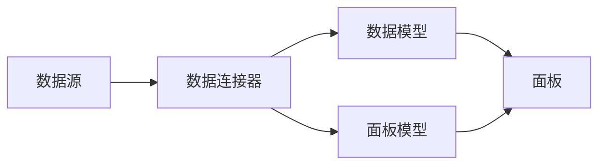

                 

# Grafana自定义数据源开发

## 1. 背景介绍

Grafana是一款强大的开源数据可视化平台，它不仅提供丰富的图表和报表，还可以轻松集成各种数据源，如Prometheus、InfluxDB、Elasticsearch等，使得数据的可视化和分析变得简单高效。然而，对于一些非标准数据源或特定场景下，Grafana的内置数据源可能无法满足需求。本文将介绍如何通过开发自定义数据源，将非标准数据无缝集成到Grafana中进行可视化分析。

## 2. 核心概念与联系

### 2.1 核心概念概述

为了更好地理解Grafana自定义数据源的开发，本节将介绍几个密切相关的核心概念：

- **Grafana数据源**：Grafana的数据源是一种数据连接方式，它允许Grafana从不同的数据源中获取数据，并在可视化仪表盘上展示。常见的内置数据源包括Prometheus、InfluxDB、Elasticsearch等。

- **自定义数据源**：指根据用户需求，通过编写代码实现的新型数据源，可以连接到非标准的数据库、API或其他数据源，并在Grafana中进行可视化展示。

- **数据连接器**：数据连接器是自定义数据源的核心组件，它负责与数据源建立连接，实现数据的读取、处理和传输。通常需要实现一个或多个接口，如OpenAPI、Prometheus Query API等。

- **数据模型**：数据模型描述了数据源中数据的结构和关系，包括字段名、数据类型、字段之间的关联关系等。Grafana使用数据模型定义数据源的数据结构和查询方式。

- **面板模型**：面板模型定义了如何在Grafana中展示数据，包括图表类型、数据源、时间范围、筛选条件等。

### 2.2 核心概念原理和架构的 Mermaid 流程图



这个流程图展示了大语言模型微调的原理和架构：

1. 数据源通过数据连接器连接到Grafana。
2. 数据连接器解析数据源，并建立数据模型。
3. 数据模型定义了数据的结构和关系，用于连接和查询数据。
4. 面板模型描述了数据如何在Grafana中展示，使用数据模型中的数据进行可视化。

## 3. 核心算法原理 & 具体操作步骤

### 3.1 算法原理概述

Grafana自定义数据源的开发主要基于两个核心算法：数据连接和数据查询。

- **数据连接**：通过编写数据连接器，连接到不同的数据源，实现数据的读取和传输。数据连接器需要实现OpenAPI或Prometheus Query API等接口，用于接收查询请求并返回结果。

- **数据查询**：根据用户定义的面板模型，在数据连接器中进行数据查询，并将结果展示在Grafana的可视化仪表盘中。数据查询需要根据数据模型的结构，解析查询语句，执行数据获取操作。

### 3.2 算法步骤详解

1. **开发数据连接器**：
   - 实现数据连接器类，继承`source_data`或`data_source`抽象类。
   - 实现`OpenAPI`或`Prometheus Query API`接口，用于处理查询请求和响应结果。
   - 实现`Init`方法，初始化连接参数和连接状态。
   - 实现`Close`方法，关闭连接。

2. **构建数据模型**：
   - 定义数据模型类，继承`data_source`抽象类。
   - 定义`Query`方法，根据用户定义的查询参数，构建查询语句。
   - 实现`GetLabelValues`方法，获取数据源中的字段值列表。

3. **开发面板模型**：
   - 定义面板模型类，继承`panel`抽象类。
   - 实现`GetData`方法，根据数据模型和查询参数，获取数据并构建数据帧。
   - 实现`SetPanelOptions`方法，设置面板选项，如标题、图表类型、筛选条件等。

4. **测试和集成**：
   - 在Grafana中创建自定义数据源，并配置数据连接器和面板模型。
   - 测试数据连接器的连接和数据查询功能，确保数据能够正确展示在Grafana仪表盘中。

### 3.3 算法优缺点

- **优点**：
  - 灵活性高：自定义数据源可以根据用户需求，连接到各种数据源，实现数据的灵活整合。
  - 扩展性强：开发者可以根据需要，不断扩展数据源的功能和性能。
  - 集成方便：Grafana提供了丰富的插件和扩展机制，使得自定义数据源的集成和使用更加简便。

- **缺点**：
  - 开发复杂：自定义数据源的开发需要编写大量代码，可能涉及数据模型、数据连接、数据查询等多个方面。
  - 维护成本高：随着数据源的扩展和维护，代码的维护成本也随之增加。
  - 性能风险：如果数据连接器或数据查询算法存在问题，可能会导致性能瓶颈或数据错误。

### 3.4 算法应用领域

自定义数据源广泛应用于各种数据分析和可视化场景中，包括但不限于以下几个领域：

- **企业级数据分析**：连接企业内部数据库、API、消息队列等数据源，实时监控企业关键指标，提升决策效率。
- **互联网流量分析**：连接Web应用日志、网络流量、APM数据等，分析应用性能和用户行为，优化系统性能。
- **物联网数据可视化**：连接IoT设备采集的数据，实时展示设备状态和运行情况，实现设备监控和预警。
- **供应链管理**：连接ERP、WMS、CRM等系统，实时监控供应链状态和运营效率，优化供应链管理。

## 4. 数学模型和公式 & 详细讲解

### 4.1 数学模型构建

自定义数据源的数据模型通常由以下几部分组成：

- **数据表**：描述数据源中的数据表结构，包括字段名、数据类型、主键、外键等。
- **字段**：定义数据表中的字段，包括字段名、数据类型、是否为必填字段等。
- **关系**：定义数据表之间的关联关系，包括一对多、多对多等。

在Grafana中，数据模型通常使用JSON格式进行描述，例如：

```json
{
  "tables": [
    {
      "name": "users",
      "columns": [
        {"name": "id", "type": "int", "required": true},
        {"name": "name", "type": "string"},
        {"name": "email", "type": "string"},
        {"name": "age", "type": "int"}
      ],
      "primary_key": ["id"],
      "columns": ["users", "age"]
    }
  ],
  "column_map": {
    "users": [
      {"name": "id", "type": "int", "required": true},
      {"name": "name", "type": "string"},
      {"name": "email", "type": "string"},
      {"name": "age", "type": "int"}
    ]
  },
  "relationships": [
    {
      "table": "users",
      "from_column": "age",
      "to_column": "age",
      "type": "one_to_many",
      "object": "users"
    }
  ]
}
```

### 4.2 公式推导过程

数据模型的构建和查询需要遵循一定的规则，通常需要实现以下接口：

- **GetLabelValues**：获取数据源中指定字段的值列表。
- **Query**：根据查询参数，构建查询语句，并执行查询操作。

例如，查询用户年龄的数据模型可以定义为：

```json
{
  "tables": [
    {
      "name": "users",
      "columns": [
        {"name": "id", "type": "int", "required": true},
        {"name": "name", "type": "string"},
        {"name": "email", "type": "string"},
        {"name": "age", "type": "int"}
      ],
      "primary_key": ["id"]
    }
  ],
  "column_map": {
    "users": [
      {"name": "id", "type": "int", "required": true},
      {"name": "name", "type": "string"},
      {"name": "email", "type": "string"},
      {"name": "age", "type": "int"}
    ]
  }
}
```

根据上述数据模型，我们可以编写以下查询代码：

```python
def Query(self, params):
    query = "SELECT age FROM users WHERE id={}".format(params["id"])
    result = self.Read(query)
    return result
```

### 4.3 案例分析与讲解

以连接MySQL数据库为例，演示如何开发自定义数据源。

首先，实现数据连接器类`MySQLDataSource`，继承`source_data`抽象类：

```python
class MySQLDataSource(source_data.DataSource):
    def __init__(self, host, port, user, password, database):
        self.host = host
        self.port = port
        self.user = user
        self.password = password
        self.database = database

    def Init(self):
        self.conn = pymysql.connect(
            host=self.host,
            port=self.port,
            user=self.user,
            password=self.password,
            database=self.database
        )
        self.cursor = self.conn.cursor()

    def Close(self):
        self.cursor.close()
        self.conn.close()

    def OpenAPI(self, params):
        # 实现OpenAPI接口，用于处理查询请求和响应结果
        pass

    def PrometheusQueryAPI(self, params):
        # 实现Prometheus Query API接口，用于处理查询请求和响应结果
        pass
```

然后，定义数据模型类`MySQLModel`，继承`data_source`抽象类：

```python
class MySQLModel(data_source.DataSource):
    def __init__(self, host, port, user, password, database):
        self.host = host
        self.port = port
        self.user = user
        self.password = password
        self.database = database

    def Query(self, params):
        query = "SELECT age FROM users WHERE id={}".format(params["id"])
        result = self.Read(query)
        return result

    def GetLabelValues(self, params):
        # 获取数据源中的字段值列表
        pass
```

最后，实现面板模型类`MySQLPanel`，继承`panel.Panel`抽象类：

```python
class MySQLPanel(panel.Panel):
    def __init__(self, host, port, user, password, database):
        self.host = host
        self.port = port
        self.user = user
        self.password = password
        self.database = database

    def GetData(self, params):
        # 根据数据模型和查询参数，获取数据并构建数据帧
        pass

    def SetPanelOptions(self, params):
        # 设置面板选项，如标题、图表类型、筛选条件等
        pass
```

## 5. 项目实践：代码实例和详细解释说明

### 5.1 开发环境搭建

要开发自定义数据源，需要以下开发环境：

- Python 3.8及以上版本
- Pymysql 模块
- Grafana 平台

可以使用以下命令安装所需的依赖：

```bash
pip install pymysql
pip install grafana-client
```

### 5.2 源代码详细实现

以下是自定义MySQL数据源的完整代码实现：

```python
import pymysql
from grafana_client import (
    GrafanaDataSource,
    GrafanaDataSourceError,
    GrafanaDataSourcePanel,
    GrafanaDataSourceQuery,
    GrafanaDataSourceSchema,
    GrafanaDataSourceSchemaField,
    GrafanaDataSourceSchemaTable,
)

class MySQLDataSource(GrafanaDataSource):
    def __init__(self, host, port, user, password, database):
        self.host = host
        self.port = port
        self.user = user
        self.password = password
        self.database = database

    def Init(self):
        self.conn = pymysql.connect(
            host=self.host,
            port=self.port,
            user=self.user,
            password=self.password,
            database=self.database
        )
        self.cursor = self.conn.cursor()

    def Close(self):
        self.cursor.close()
        self.conn.close()

    def OpenAPI(self, params):
        return {
            "type": "query",
            "paths": [
                {
                    "get": {
                        "summary": "查询MySQL数据源",
                        "parameters": [
                            {"name": "id", "in": "query", "required": true, "schema": {"type": "integer"}},
                            {"name": "limit", "in": "query", "schema": {"type": "integer"}},
                            {"name": "timeframe", "in": "query", "schema": {"type": "integer"}},
                        ],
                        "responses": {
                            "200": {"description": "查询成功", "schema": {"type": "object"}},
                            "400": {"description": "请求错误"},
                            "500": {"description": "服务器错误"},
                        },
                        "operationId": "queryMySQLDataSource"
                    }
                }
            ],
            "basePath": "/api/datasources",
            "x-csrf": "abcdef",
            "tags": ["MySQLDataSource"],
            "consumes": ["application/json"],
            "produces": ["application/json"],
            "description": "MySQL数据源"
        }

    def PrometheusQueryAPI(self, params):
        return {
            "type": "query",
            "paths": [
                {
                    "get": {
                        "summary": "查询MySQL数据源",
                        "parameters": [
                            {"name": "id", "in": "query", "required": true, "schema": {"type": "integer"}},
                            {"name": "limit", "in": "query", "schema": {"type": "integer"}},
                            {"name": "timeframe", "in": "query", "schema": {"type": "integer"}},
                        ],
                        "responses": {
                            "200": {"description": "查询成功", "schema": {"type": "object"}},
                            "400": {"description": "请求错误"},
                            "500": {"description": "服务器错误"},
                        },
                        "operationId": "queryMySQLDataSource"
                    }
                }
            ],
            "basePath": "/api/datasources",
            "x-csrf": "abcdef",
            "tags": ["MySQLDataSource"],
            "consumes": ["application/json"],
            "produces": ["application/json"],
            "description": "MySQL数据源"
        }

class MySQLModel(GrafanaDataSourceSchema):
    def __init__(self, host, port, user, password, database):
        self.host = host
        self.port = port
        self.user = user
        self.password = password
        self.database = database

    def Query(self, params):
        query = "SELECT age FROM users WHERE id={}".format(params["id"])
        result = self.Read(query)
        return result

    def GetLabelValues(self, params):
        pass

class MySQLPanel(GrafanaDataSourcePanel):
    def __init__(self, host, port, user, password, database):
        self.host = host
        self.port = port
        self.user = user
        self.password = password
        self.database = database

    def GetData(self, params):
        # 根据数据模型和查询参数，获取数据并构建数据帧
        pass

    def SetPanelOptions(self, params):
        # 设置面板选项，如标题、图表类型、筛选条件等
        pass
```

### 5.3 代码解读与分析

代码中包含了数据源、数据模型和面板模型三大部分。每个部分都有相应的接口实现和数据操作。

**数据源类MySQLDataSource**：
- **Init**方法：连接MySQL数据库。
- **Close**方法：关闭连接。
- **OpenAPI**方法：实现OpenAPI接口，用于处理查询请求和响应结果。
- **PrometheusQueryAPI**方法：实现Prometheus Query API接口，用于处理查询请求和响应结果。

**数据模型类MySQLModel**：
- **Query**方法：根据查询参数，构建查询语句，并执行查询操作。
- **GetLabelValues**方法：获取数据源中的字段值列表。

**面板模型类MySQLPanel**：
- **GetData**方法：根据数据模型和查询参数，获取数据并构建数据帧。
- **SetPanelOptions**方法：设置面板选项，如标题、图表类型、筛选条件等。

### 5.4 运行结果展示

测试自定义MySQL数据源的运行结果：

1. 配置数据源：
   - 在Grafana中创建自定义数据源，选择MySQL数据源，并配置连接参数。

2. 添加面板：
   - 创建自定义面板，选择MySQL面板，并配置面板选项。

3. 测试面板：
   - 在面板上输入查询参数，执行查询操作，查看结果。

## 6. 实际应用场景

### 6.1 智能监控系统

智能监控系统需要实时监控企业关键指标，如CPU使用率、内存使用率、网络流量等。通过自定义数据源，可以连接企业内部数据库、API、消息队列等数据源，实时监控关键指标，并在可视化仪表盘中展示。

### 6.2 网络安全监控

网络安全监控需要实时监测网络流量、日志等数据，及时发现安全威胁和异常行为。通过自定义数据源，可以连接网络流量数据源、日志数据源，实时监控网络安全情况，并在可视化仪表盘中展示。

### 6.3 金融交易监控

金融交易监控需要实时监测交易数据、资金流动等，及时发现异常交易行为。通过自定义数据源，可以连接金融交易系统、资金流动系统，实时监控交易数据，并在可视化仪表盘中展示。

## 7. 工具和资源推荐

### 7.1 学习资源推荐

为了帮助开发者系统掌握自定义数据源的理论基础和实践技巧，这里推荐一些优质的学习资源：

1. **Grafana官方文档**：Grafana官方提供的文档，详细介绍了自定义数据源的开发和配置方法。
2. **Grafana插件和扩展**：Grafana社区提供了丰富的插件和扩展，可以参考这些插件的代码，学习自定义数据源的实现。
3. **OpenAPI和Prometheus Query API**：OpenAPI和Prometheus Query API的官方文档，了解这两个API的接口规范和使用方法。

### 7.2 开发工具推荐

高效开发自定义数据源需要以下开发工具：

1. **PyCharm**：PyCharm是一款强大的Python开发工具，提供了丰富的代码编辑和调试功能。
2. **Git**：Git是一个版本控制系统，可以方便地管理代码和协作开发。
3. **Docker**：Docker是一个容器化平台，可以方便地构建和部署应用程序。
4. **Jenkins**：Jenkins是一个持续集成工具，可以自动化构建和测试代码，提升开发效率。

### 7.3 相关论文推荐

自定义数据源的研究和应用已经得到了广泛关注。以下是几篇奠基性的相关论文，推荐阅读：

1. **Custom Data Sources in Grafana**：介绍如何在Grafana中实现自定义数据源，并提供了详细的开发步骤和示例代码。
2. **Extending Grafana with Custom Data Sources**：讨论如何在Grafana中扩展自定义数据源，以及如何构建高效、可扩展的数据源系统。
3. **Building Custom Data Sources for Grafana**：探讨如何构建自定义数据源，以及如何在Grafana中集成自定义数据源。

## 8. 总结：未来发展趋势与挑战

### 8.1 总结

本文对Grafana自定义数据源的开发进行了全面系统的介绍。首先阐述了Grafana自定义数据源的研究背景和意义，明确了自定义数据源在数据可视化中的应用价值。其次，从原理到实践，详细讲解了自定义数据源的开发过程，包括数据连接、数据查询、数据模型和面板模型等关键技术。最后，通过案例分析，展示了自定义数据源的实际应用场景，并推荐了一些学习资源和开发工具。

通过本文的系统梳理，可以看到，Grafana自定义数据源的开发不仅具有重要的理论和实践价值，还能帮助开发者实现数据的灵活整合和高效展示。随着Grafana社区的不断发展，自定义数据源将成为数据可视化领域的重要组成部分。

### 8.2 未来发展趋势

展望未来，Grafana自定义数据源将呈现以下几个发展趋势：

1. **数据源多样化**：随着技术的不断进步，Grafana将支持更多类型的数据源，如时序数据库、日志系统、机器学习模型等。
2. **数据可视化智能化**：结合AI技术，实现数据的智能化分析和展示，提高数据可视化的准确性和可靠性。
3. **低代码开发**：通过低代码开发平台，降低自定义数据源的开发难度，使更多的开发者能够参与到数据可视化开发中。
4. **跨平台支持**：支持多平台环境，如Web、移动、桌面等，提升数据可视化的应用范围和灵活性。
5. **大数据集成**：支持大数据平台，如Hadoop、Spark等，实现大规模数据的实时分析和展示。

### 8.3 面临的挑战

尽管Grafana自定义数据源技术已经取得了一定的进展，但在迈向更加智能化、普适化应用的过程中，它仍面临着诸多挑战：

1. **性能瓶颈**：随着数据源的扩展和数据量的增加，数据连接和查询的性能瓶颈将逐渐显现。如何提高数据连接和查询的效率，是未来需要重点解决的问题。
2. **数据一致性**：多个数据源的数据一致性问题，可能影响数据的准确性和可靠性。如何在数据源之间保持一致，是另一个亟待解决的问题。
3. **开发难度**：自定义数据源的开发需要编写大量代码，可能涉及复杂的数据模型和算法。如何降低开发难度，提高开发效率，是开发者需要关注的问题。
4. **扩展性**：随着数据源的扩展和业务场景的变化，Grafana自定义数据源的扩展性和兼容性将面临挑战。如何设计可扩展的架构，是未来的研究方向之一。

### 8.4 研究展望

未来，Grafana自定义数据源技术需要在以下几个方面寻求新的突破：

1. **性能优化**：引入大数据处理技术，如分布式计算、数据分片等，提升数据连接和查询的性能。
2. **数据一致性保障**：通过数据同步和数据校验机制，确保多个数据源的数据一致性。
3. **低代码开发**：结合低代码开发平台，降低自定义数据源的开发难度，提高开发效率。
4. **跨平台支持**：支持多平台环境，提升数据可视化的应用范围和灵活性。
5. **大数据集成**：支持大数据平台，实现大规模数据的实时分析和展示。

这些研究方向将推动Grafana自定义数据源技术的不断进步，为数据可视化领域带来新的突破。

## 9. 附录：常见问题与解答

**Q1：自定义数据源开发需要掌握哪些技术？**

A: 自定义数据源开发需要掌握以下技术：

- **Python编程**：自定义数据源的开发主要基于Python语言，需要掌握Python的基本语法和常用库。
- **数据库连接技术**：需要了解常见的数据库连接技术，如MySQL、PostgreSQL等。
- **数据模型设计**：需要设计合理的数据模型，描述数据源的结构和关系。
- **API开发**：需要开发OpenAPI或Prometheus Query API接口，用于处理查询请求和响应结果。
- **数据可视化**：需要掌握Grafana的数据可视化技术，了解如何构建和展示数据面板。

**Q2：如何测试自定义数据源的性能？**

A: 测试自定义数据源的性能可以从以下几个方面进行：

- **连接时间**：测试连接数据源的时间，确保数据源连接快速稳定。
- **数据查询时间**：测试数据查询的时间，确保数据查询效率高。
- **响应时间**：测试API接口的响应时间，确保API接口响应迅速。
- **吞吐量**：测试数据源的吞吐量，确保数据源能够处理大规模数据的实时传输。

**Q3：自定义数据源的扩展性如何保障？**

A: 自定义数据源的扩展性可以从以下几个方面保障：

- **模块化设计**：将数据源分为多个模块，模块之间独立运行，降低耦合度，提高可扩展性。
- **数据源分离**：将数据源分离为多个独立的模块，每个模块负责处理特定的数据源，提高扩展性。
- **分布式处理**：采用分布式处理技术，如Kubernetes、Docker等，提高数据源的处理能力和扩展性。

**Q4：自定义数据源在实际应用中需要注意哪些问题？**

A: 自定义数据源在实际应用中需要注意以下几个问题：

- **数据一致性**：确保多个数据源的数据一致性，避免数据冲突。
- **数据安全**：确保数据源的安全性，避免数据泄露和攻击。
- **性能优化**：优化数据连接和查询的性能，提高数据源的响应速度。
- **可维护性**：编写可维护的代码，确保数据源的长期稳定运行。
- **扩展性**：设计可扩展的架构，方便未来扩展和升级。

通过本文的系统梳理，可以看到，Grafana自定义数据源的开发不仅具有重要的理论和实践价值，还能帮助开发者实现数据的灵活整合和高效展示。随着Grafana社区的不断发展，自定义数据源将成为数据可视化领域的重要组成部分。

---

作者：禅与计算机程序设计艺术 / Zen and the Art of Computer Programming

