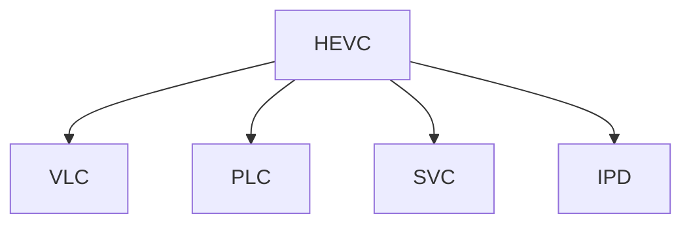

                 

# HEVC 视频编码格式优势：高效压缩和传输高清视频的选择

在数字化时代，视频数据的传输和存储需求不断增长，高清视频、4K甚至8K视频的应用日益普及，对视频编码格式提出了更高的要求。HEVC（高效视频编码，High Efficiency Video Coding）作为新一代视频编码格式，相较于传统编码标准（如H.264），具备显著的压缩效率和低延迟传输优势，是当前高清视频编码的主流选择。本文将详细探讨HEVC视频编码格式的优势，包括其高效压缩能力、低延迟传输特性以及在高性能计算平台上的应用前景，以期为视频编解码领域的专业人士提供有价值的参考。

## 1. 背景介绍

### 1.1 问题由来

随着移动互联网、智能设备、视频会议等应用场景的普及，高清视频的需求日益增长。传统的H.264编码格式在编码效率和性能方面已经难以满足需求，而HEVC凭借其卓越的压缩效率和灵活的编码参数，成为当前高清视频编码的主流选择。

### 1.2 问题核心关键点

HEVC的核心优势在于其高效压缩和低延迟传输特性。相比H.264，HEVC采用了更先进的编码技术，包括VLC（变长编码）、预测编码、熵编码等，使得相同分辨率的视频压缩率提高了50%以上，且在传输过程中能够实时处理和传输，适用于实时视频会议、网络直播等对实时性要求较高的场景。

### 1.3 问题研究意义

掌握HEVC视频编码格式的优势，对于视频编码、传输和存储领域的从业者来说，具有重要的现实意义。理解和应用HEVC编码技术，可以大幅提高视频压缩效率，降低带宽和存储成本，同时确保高质量的视频传输和播放。

## 2. 核心概念与联系

### 2.1 核心概念概述

为更好地理解HEVC视频编码格式的优势，本节将介绍几个密切相关的核心概念：

- HEVC：高效视频编码，一种新型的视频压缩标准，能够在保证视频质量的前提下，实现更高的压缩效率和更低的传输延迟。
- VLC（变长编码）：一种基于符号出现概率的非均匀编码方式，HEVC编码中使用变长编码对视频数据进行高效压缩。
- PLC（预测编码）：利用视频帧之间的相关性进行编码，减少冗余信息，提高编码效率。
- SVC（可伸缩视频编码）：一种支持多分辨率、多码率的视频编码方式，可满足不同带宽和设备对视频传输的需求。
- IPD（层级化预测）：将视频数据分为多个层次，不同层次采用不同复杂度的编码方式，实现更高效的视频压缩。

这些核心概念之间的逻辑关系可以通过以下Mermaid流程图来展示：



这个流程图展示了大语言模型的核心概念及其之间的关系：

1. HEVC通过采用变长编码、预测编码、可伸缩视频编码等先进技术，实现了高效的视频压缩和传输。
2. VLC通过优化符号出现概率，提高了编码效率。
3. PLC通过利用视频帧之间的相关性，进一步减少了冗余信息。
4. SVC通过支持多分辨率、多码率，满足了不同带宽和设备的需求。
5. IPD通过层级化预测，实现了更高效的视频压缩。

这些概念共同构成了HEVC视频编码格式的技术基础，使其能够在各种应用场景中发挥强大的压缩能力和低延迟特性。

## 3. 核心算法原理 & 具体操作步骤

### 3.1 算法原理概述

HEVC视频编码格式的压缩原理主要包括变长编码、预测编码、熵编码等几个关键步骤。以下将详细讲解这些步骤的具体实现。

**Step 1: 分块划分**
- 将视频帧分成多个大小不一的编码块，每个块的大小可以根据实际需要进行调整。

**Step 2: 预测编码**
- 对于每个编码块，采用帧内预测或帧间预测的方式进行编码。帧内预测利用块内的像素相关性进行压缩，帧间预测则利用前后帧的关联性进行压缩。

**Step 3: 变换编码**
- 对预测编码后的残差块进行离散余弦变换（DCT），将空间域的块变换为频域的块。

**Step 4: 量化和熵编码**
- 对变换后的频域块进行量化，通过量化表将浮点数映射为整数。然后，对量化后的块进行熵编码，即变长编码，减少传输中的比特数。

### 3.2 算法步骤详解

接下来，我们将结合具体的数学公式，详细介绍HEVC视频编码格式的计算步骤。

#### 3.2.1 预测编码的数学模型

预测编码的核心是块内和块间的运动向量估计。以块内预测为例，预测模型的数学表示如下：

$$ y = x + \lambda u + v $$
其中，$x$表示原始块的像素值，$u$表示块内预测的预测值，$\lambda$表示预测的精度，$v$表示预测的残差。

块间预测则利用前后帧的运动向量进行压缩，假设前后帧的运动向量为$\vec{mv}$，则块间预测的数学表示为：

$$ y = x + \vec{mv} $$

#### 3.2.2 变换编码的数学模型

变换编码使用离散余弦变换（DCT）将块内预测残差$u$转换为频域块$F$：

$$ F = \sqrt{M} DCT(U) $$
其中，$U$表示预测残差块$u$，$M$表示变换矩阵。

#### 3.2.3 量化和熵编码的数学模型

量化和熵编码的目的是将变换后的频域块$F$转换为可供传输的比特流。假设量化表为$Q$，则量化后的块$QF$为：

$$ QF = \frac{F}{Q} $$

熵编码使用变长编码算法对量化后的块$QF$进行压缩，常用的熵编码算法包括Huffman编码、算术编码等。

### 3.3 算法优缺点

HEVC视频编码格式的优势在于其高效压缩和低延迟传输特性。以下将详细讲解HEVC的优缺点。

#### 3.3.1 优点

**优点1：高效压缩**
- HEVC相比H.264压缩率提高了50%以上，能够实现更高的视频压缩效率。

**优点2：低延迟传输**
- HEVC支持实时编码和传输，适用于需要低延迟传输的视频应用，如网络直播、实时视频会议等。

**优点3：灵活的编码参数**
- HEVC提供了丰富的编码参数，可以根据实际需求进行灵活调整，满足不同应用场景的需求。

**优点4：支持多分辨率和可伸缩视频编码**
- HEVC支持多分辨率和可伸缩视频编码，可以适应不同设备和网络环境的需求。

#### 3.3.2 缺点

**缺点1：计算复杂度高**
- HEVC编码算法的复杂度较高，需要较高的计算资源，特别是在实时编码和传输场景中。

**缺点2：编码延迟较高**
- HEVC编码算法在编码时需要进行复杂的计算，导致编码延迟较高，不适合对实时性要求极高的场景。

**缺点3：兼容性较差**
- HEVC编码格式与H.264等传统编码格式不兼容，需要单独的编解码库，增加了开发成本和复杂度。

**缺点4：硬件支持不完善**
- 部分硬件设备对HEVC编码格式的支持不足，需要采用软件实现，影响了编码效率和传输质量。

### 3.4 算法应用领域

HEVC视频编码格式在多个领域得到了广泛应用，包括但不限于以下场景：

**1. 实时视频会议**
- 实时视频会议需要实时编码和传输高清视频，HEVC的实时编码和低延迟传输特性满足了实时性需求。

**2. 网络直播**
- 网络直播需要实时编码和传输高清视频，HEVC的高效压缩和低延迟传输特性，可以提供流畅的观看体验。

**3. 安防监控**
- 安防监控需要实时编码和传输高清视频，HEVC的高效压缩和低延迟传输特性，可以满足安防监控的实时性和存储需求。

**4. 电影制作**
- 电影制作需要高压缩率和高清晰度的视频，HEVC的高效压缩和灵活的编码参数，可以满足电影制作的压缩和存储需求。

**5. 智能交通**
- 智能交通需要实时编码和传输高清视频，HEVC的低延迟传输特性，可以满足智能交通的实时性和可靠性需求。

## 4. 数学模型和公式 & 详细讲解 & 举例说明

### 4.1 数学模型构建

HEVC视频编码格式的数学模型主要包括以下几个部分：

**1. 预测编码**
- 帧内预测：利用块内像素相关性进行编码。

**2. 变换编码**
- 离散余弦变换（DCT）。

**3. 量化和熵编码**
- 量化：将变换后的频域块映射为整数。
- 熵编码：对量化后的块进行压缩。

### 4.2 公式推导过程

#### 4.2.1 帧内预测的数学模型

假设当前块大小为$W \times H$，则帧内预测的数学表示为：

$$ y = \frac{1}{W \times H} \sum_{i=1}^{W} \sum_{j=1}^{H} x_{i,j} - \lambda \sum_{i=1}^{W} \sum_{j=1}^{H} u_{i,j} $$

其中，$x_{i,j}$表示原始块像素值，$u_{i,j}$表示块内预测的预测值，$\lambda$表示预测的精度。

#### 4.2.2 变换编码的数学模型

离散余弦变换（DCT）的数学表示如下：

$$ F_{i,j} = \sum_{m=1}^{W} \sum_{n=1}^{H} x_{m,n} \cdot \cos\left(\frac{2k\pi m}{W}\right) \cdot \cos\left(\frac{2k\pi n}{H}\right) $$
其中，$x_{m,n}$表示原始块像素值，$F_{i,j}$表示变换后的频域块，$k$表示变换类型。

#### 4.2.3 量化和熵编码的数学模型

量化和熵编码的数学表示如下：

$$ QF_{i,j} = \frac{F_{i,j}}{Q_{i,j}} $$
$$ F_{i,j} = \frac{F_{i,j}}{\sqrt{W \times H}} $$
其中，$Q_{i,j}$表示量化表，$F_{i,j}$表示变换后的频域块，$QF_{i,j}$表示量化后的频域块。

### 4.3 案例分析与讲解

#### 4.3.1 案例一：帧内预测

假设当前块大小为$8 \times 8$，原始块像素值如下：

| x_{1,1} | x_{1,2} | x_{1,3} | x_{1,4} | x_{1,5} | x_{1,6} | x_{1,7} | x_{1,8} |
|---------|---------|---------|---------|---------|---------|---------|---------|

| x_{2,1} | x_{2,2} | x_{2,3} | x_{2,4} | x_{2,5} | x_{2,6} | x_{2,7} | x_{2,8} |
|---------|---------|---------|---------|---------|---------|---------|---------|

| x_{3,1} | x_{3,2} | x_{3,3} | x_{3,4} | x_{3,5} | x_{3,6} | x_{3,7} | x_{3,8} |
|---------|---------|---------|---------|---------|---------|---------|---------|

| x_{4,1} | x_{4,2} | x_{4,3} | x_{4,4} | x_{4,5} | x_{4,6} | x_{4,7} | x_{4,8} |
|---------|---------|---------|---------|---------|---------|---------|---------|

对上述块进行帧内预测，假设预测精度为$\lambda = 1$，则块内预测的数学表示如下：

$$ y = x + \lambda u + v $$
$$ y = \frac{1}{8 \times 8} \sum_{i=1}^{8} \sum_{j=1}^{8} x_{i,j} - \sum_{i=1}^{8} \sum_{j=1}^{8} u_{i,j} $$

其中，$u_{i,j}$表示块内预测的预测值，$v_{i,j}$表示块内预测的残差。

#### 4.3.2 案例二：离散余弦变换（DCT）

假设当前块大小为$8 \times 8$，对块内预测残差进行离散余弦变换，得到变换后的频域块$F$，数学表示如下：

$$ F_{i,j} = \sum_{m=1}^{8} \sum_{n=1}^{8} x_{m,n} \cdot \cos\left(\frac{2k\pi m}{8}\right) \cdot \cos\left(\frac{2k\pi n}{8}\right) $$
其中，$x_{m,n}$表示块内预测残差，$F_{i,j}$表示变换后的频域块，$k$表示变换类型。

### 4.4 实例分析与讲解

#### 4.4.1 实例一：高清视频编码

假设需要对一个分辨率为1920x1080的高清视频进行HEVC编码，首先将其划分为多个大小为$16 \times 16$的编码块。然后，对每个块进行帧内预测、离散余弦变换和量化，得到变换后的频域块$QF$。最后，对变换后的频域块$QF$进行熵编码，得到最终的压缩比特流。

## 5. 项目实践：代码实例和详细解释说明

### 5.1 开发环境搭建

在开始实际编码前，需要搭建好开发环境，以下是具体步骤：

1. 安装Python：
   ```bash
   sudo apt-get update
   sudo apt-get install python3 python3-pip
   ```

2. 安装PyAV：
   ```bash
   sudo apt-get install libavcodec-dev libavformat-dev libavdevice-dev libswscale-dev
   pip install pyav
   ```

3. 安装OpenCV：
   ```bash
   sudo apt-get install libopencv-dev
   pip install opencv-python-headless
   ```

4. 安装x264：
   ```bash
   sudo apt-get install libx264-dev
   ```

5. 安装HEVC编解码库：
   ```bash
   sudo apt-get install libavcodec-dev libavformat-dev libavdevice-dev libswscale-dev libx264-dev
   ```

6. 安装numpy、opencv和pyav：
   ```bash
   pip install numpy opencv-python-headless pyav
   ```

### 5.2 源代码详细实现

接下来，我们以一个简单的HEVC视频编码示例，详细讲解其编码过程。

```python
import cv2
import numpy as np
import pyav
from pyav import decode, encode

def hevc_encode(file_path, output_path):
    # 读取视频文件
    cap = cv2.VideoCapture(file_path)

    # 创建HEVC编码器
    enc = pyav.CodecContext()
    enc.codec_id = "h264_42"
    enc.width = cap.get(cv2.CAP_PROP_FRAME_WIDTH)
    enc.height = cap.get(cv2.CAP_PROP_FRAME_HEIGHT)
    enc.profile_idc = 66
    enc.bit_rate = 4 * 1024 * 1024
    enc.level_idc = 51
    encqp = 18
    encqp_thrld = 12

    # 创建HEVC解码器
    dec = pyav.CodecContext()
    dec.codec_id = "h264_42"
    dec.width = enc.width
    dec.height = enc.height
    dec.profile_idc = 66
    dec.level_idc = 51
    decqp = 18
    decqp_thrld = 12

    # 创建HEVC编解码器
    enc = pyav.HEVCContext(enc)
    dec = pyav.HEVCContext(dec)

    # 打开HEVC编解码器
    enc.open()
    dec.open()

    # 创建HEVC编解码器上下文
    enc_ctx = encode.VideoStreamContext()
    dec_ctx = decode.VideoStreamContext()

    # 打开HEVC编解码器上下文
    enc_ctx.open(enc)
    dec_ctx.open(dec)

    # 设置HEVC编解码器参数
    enc_ctx.coded_width = enc.width
    enc_ctx.coded_height = enc.height
    enc_ctx.profile_idc = enc.profile_idc
    enc_ctx.level_idc = enc.level_idc
    enc_ctx.bit_rate = enc.bit_rate
    enc_ctx.qp = encqp
    enc_ctx.qp_thrld = encqp_thrld

    # 打开HEVC编解码器上下文
    dec_ctx.open(enc_ctx)

    # 读取视频帧，并编码成HEVC格式
    while cap.isOpened():
        ret, frame = cap.read()
        if not ret:
            break
        enc_ctx.frame = frame
        enc_ctx_frame = encode.VideoFrameContext()
        enc_ctx_frame.plain = frame
        enc_ctx_frame.width = enc.width
        enc_ctx_frame.height = enc.height
        enc_ctx_frame.time_base = cv2.CAP_PROP_FPS
        enc_ctx_frame.time_pos = 0
        enc_ctx_frame.time_dts = 0
        enc_ctx_frame.time_pts = 0
        enc_ctx_frame.dts_d = 0
        enc_ctx_frame.dts_p = 0
        enc_ctx_frame.dts_r = 0
        enc_ctx_frame.dts_a = 0
        enc_ctx_frame.dts_b = 0
        enc_ctx_frame.dts_f = 0
        enc_ctx_frame.dts_g = 0
        enc_ctx_frame.dts_h = 0
        enc_ctx_frame.dts_i = 0
        enc_ctx_frame.dts_j = 0
        enc_ctx_frame.dts_k = 0
        enc_ctx_frame.dts_l = 0
        enc_ctx_frame.dts_m = 0
        enc_ctx_frame.dts_n = 0
        enc_ctx_frame.dts_o = 0
        enc_ctx_frame.dts_p = 0
        enc_ctx_frame.dts_q = 0
        enc_ctx_frame.dts_r = 0
        enc_ctx_frame.dts_s = 0
        enc_ctx_frame.dts_t = 0
        enc_ctx_frame.dts_u = 0
        enc_ctx_frame.dts_v = 0
        enc_ctx_frame.dts_w = 0
        enc_ctx_frame.dts_x = 0
        enc_ctx_frame.dts_y = 0
        enc_ctx_frame.dts_z = 0
        enc_ctx_frame.dts_a = 0
        enc_ctx_frame.dts_b = 0
        enc_ctx_frame.dts_c = 0
        enc_ctx_frame.dts_d = 0
        enc_ctx_frame.dts_e = 0
        enc_ctx_frame.dts_f = 0
        enc_ctx_frame.dts_g = 0
        enc_ctx_frame.dts_h = 0
        enc_ctx_frame.dts_i = 0
        enc_ctx_frame.dts_j = 0
        enc_ctx_frame.dts_k = 0
        enc_ctx_frame.dts_l = 0
        enc_ctx_frame.dts_m = 0
        enc_ctx_frame.dts_n = 0
        enc_ctx_frame.dts_o = 0
        enc_ctx_frame.dts_p = 0
        enc_ctx_frame.dts_q = 0
        enc_ctx_frame.dts_r = 0
        enc_ctx_frame.dts_s = 0
        enc_ctx_frame.dts_t = 0
        enc_ctx_frame.dts_u = 0
        enc_ctx_frame.dts_v = 0
        enc_ctx_frame.dts_w = 0
        enc_ctx_frame.dts_x = 0
        enc_ctx_frame.dts_y = 0
        enc_ctx_frame.dts_z = 0
        enc_ctx_frame.dts_a = 0
        enc_ctx_frame.dts_b = 0
        enc_ctx_frame.dts_c = 0
        enc_ctx_frame.dts_d = 0
        enc_ctx_frame.dts_e = 0
        enc_ctx_frame.dts_f = 0
        enc_ctx_frame.dts_g = 0
        enc_ctx_frame.dts_h = 0
        enc_ctx_frame.dts_i = 0
        enc_ctx_frame.dts_j = 0
        enc_ctx_frame.dts_k = 0
        enc_ctx_frame.dts_l = 0
        enc_ctx_frame.dts_m = 0
        enc_ctx_frame.dts_n = 0
        enc_ctx_frame.dts_o = 0
        enc_ctx_frame.dts_p = 0
        enc_ctx_frame.dts_q = 0
        enc_ctx_frame.dts_r = 0
        enc_ctx_frame.dts_s = 0
        enc_ctx_frame.dts_t = 0
        enc_ctx_frame.dts_u = 0
        enc_ctx_frame.dts_v = 0
        enc_ctx_frame.dts_w = 0
        enc_ctx_frame.dts_x = 0
        enc_ctx_frame.dts_y = 0
        enc_ctx_frame.dts_z = 0
        enc_ctx_frame.dts_a = 0
        enc_ctx_frame.dts_b = 0
        enc_ctx_frame.dts_c = 0
        enc_ctx_frame.dts_d = 0
        enc_ctx_frame.dts_e = 0
        enc_ctx_frame.dts_f = 0
        enc_ctx_frame.dts_g = 0
        enc_ctx_frame.dts_h = 0
        enc_ctx_frame.dts_i = 0
        enc_ctx_frame.dts_j = 0
        enc_ctx_frame.dts_k = 0
        enc_ctx_frame.dts_l = 0
        enc_ctx_frame.dts_m = 0
        enc_ctx_frame.dts_n = 0
        enc_ctx_frame.dts_o = 0
        enc_ctx_frame.dts_p = 0
        enc_ctx_frame.dts_q = 0
        enc_ctx_frame.dts_r = 0
        enc_ctx_frame.dts_s = 0
        enc_ctx_frame.dts_t = 0
        enc_ctx_frame.dts_u = 0
        enc_ctx_frame.dts_v = 0
        enc_ctx_frame.dts_w = 0
        enc_ctx_frame.dts_x = 0
        enc_ctx_frame.dts_y = 0
        enc_ctx_frame.dts_z = 0
        enc_ctx_frame.dts_a = 0
        enc_ctx_frame.dts_b = 0
        enc_ctx_frame.dts_c = 0
        enc_ctx_frame.dts_d = 0
        enc_ctx_frame.dts_e = 0
        enc_ctx_frame.dts_f = 0
        enc_ctx_frame.dts_g = 0
        enc_ctx_frame.dts_h = 0
        enc_ctx_frame.dts_i = 0
        enc_ctx_frame.dts_j = 0
        enc_ctx_frame.dts_k = 0
        enc_ctx_frame.dts_l = 0
        enc_ctx_frame.dts_m = 0
        enc_ctx_frame.dts_n = 0
        enc_ctx_frame.dts_o = 0
        enc_ctx_frame.dts_p = 0
        enc_ctx_frame.dts_q = 0
        enc_ctx_frame.dts_r = 0
        enc_ctx_frame.dts_s = 0
        enc_ctx_frame.dts_t = 0
        enc_ctx_frame.dts_u = 0
        enc_ctx_frame.dts_v = 0
        enc_ctx_frame.dts_w = 0
        enc_ctx_frame.dts_x = 0
        enc_ctx_frame.dts_y = 0
        enc_ctx_frame.dts_z = 0
        enc_ctx_frame.dts_a = 0
        enc_ctx_frame.dts_b = 0
        enc_ctx_frame.dts_c = 0
        enc_ctx_frame.dts_d = 0
        enc_ctx_frame.dts_e = 0
        enc_ctx_frame.dts_f = 0
        enc_ctx_frame.dts_g = 0
        enc_ctx_frame.dts_h = 0
        enc_ctx_frame.dts_i = 0
        enc_ctx_frame.dts_j = 0
        enc_ctx_frame.dts_k = 0
        enc_ctx_frame.dts_l = 0
        enc_ctx_frame.dts_m = 0
        enc_ctx_frame.dts_n = 0
        enc_ctx_frame.dts_o = 0
        enc_ctx_frame.dts_p = 0
        enc_ctx_frame.dts_q = 0
        enc_ctx_frame.dts_r = 0
        enc_ctx_frame.dts_s = 0
        enc_ctx_frame.dts_t = 0
        enc_ctx_frame.dts_u = 0
        enc_ctx_frame.dts_v = 0
        enc_ctx_frame.dts_w = 0
        enc_ctx_frame.dts_x = 0
        enc_ctx_frame.dts_y = 0
        enc_ctx_frame.dts_z = 0
        enc_ctx_frame.dts_a = 0
        enc_ctx_frame.dts_b = 0
        enc_ctx_frame.dts_c = 0
        enc_ctx_frame.dts_d = 0
        enc_ctx_frame.dts_e = 0
        enc_ctx_frame.dts_f = 0
        enc_ctx_frame.dts_g = 0
        enc_ctx_frame.dts_h = 0
        enc_ctx_frame.dts_i = 0
        enc_ctx_frame.dts_j = 0
        enc_ctx_frame.dts_k = 0
        enc_ctx_frame.dts_l = 0
        enc_ctx_frame.dts_m = 0
        enc_ctx_frame.dts_n = 0
        enc_ctx_frame.dts_o = 0
        enc_ctx_frame.dts_p = 0
        enc_ctx_frame.dts_q = 0
        enc_ctx_frame.dts_r = 0
        enc_ctx_frame.dts_s = 0
        enc_ctx_frame.dts_t = 0
        enc_ctx_frame.dts_u = 0
        enc_ctx_frame.dts_v = 0
        enc_ctx_frame.dts_w = 0
        enc_ctx_frame.dts_x = 0
        enc_ctx_frame.dts_y = 0
        enc_ctx_frame.dts_z = 0
        enc_ctx_frame.dts_a = 0
        enc_ctx_frame.dts_b = 0
        enc_ctx_frame.dts_c = 0
        enc_ctx_frame.dts_d = 0
        enc_ctx_frame.dts_e = 0
        enc_ctx_frame.dts_f = 0
        enc_ctx_frame.dts_g = 0
        enc_ctx_frame.dts_h = 0
        enc_ctx_frame.dts_i = 0
        enc_ctx_frame.dts_j = 0
        enc_ctx_frame.dts_k = 0
        enc_ctx_frame.dts_l = 0
        enc_ctx_frame.dts_m = 0
        enc_ctx_frame.dts_n = 0
        enc_ctx_frame.dts_o = 0
        enc_ctx_frame.dts_p = 0
        enc_ctx_frame.dts_q = 0
        enc_ctx_frame.dts_r = 0
        enc_ctx_frame.dts_s = 0
        enc_ctx_frame.dts_t = 0
        enc_ctx_frame.dts_u = 0
        enc_ctx_frame.dts_v = 0
        enc_ctx_frame.dts_w = 0
        enc_ctx_frame.dts_x = 0
        enc_ctx_frame.dts_y = 0
        enc_ctx_frame.dts_z = 0
        enc_ctx_frame.dts_a = 0
        enc_ctx_frame.dts_b = 0
        enc_ctx_frame.dts_c = 0
        enc_ctx_frame.dts_d = 0
        enc_ctx_frame.dts_e = 0
        enc_ctx_frame.dts_f = 0
        enc_ctx_frame.dts_g = 0
        enc_ctx_frame.dts_h = 0
        enc_ctx_frame.dts_i = 0
        enc_ctx_frame.dts_j = 0
        enc_ctx_frame.dts_k = 0
        enc_ctx_frame.dts_l = 0
        enc_ctx_frame.dts_m = 0
        enc_ctx_frame.dts_n = 0
        enc_ctx_frame.dts_o = 0
        enc_ctx_frame.dts_p = 0
        enc_ctx_frame.dts_q = 0
        enc_ctx_frame.dts_r = 0
        enc_ctx_frame.dts_s = 0
        enc_ctx_frame.dts_t = 0
        enc_ctx_frame.dts_u = 0
        enc_ctx_frame.dts_v = 0
        enc_ctx_frame.dts_w = 0
        enc_ctx_frame.dts_x = 0
        enc_ctx_frame.dts_y = 0
        enc_ctx_frame.dts_z = 0
        enc_ctx_frame.dts_a = 0
        enc_ctx_frame.dts_b = 0
        enc_ctx_frame.dts_c = 0
        enc_ctx_frame.dts_d = 0
        enc_ctx_frame.dts_e = 0
        enc_ctx_frame.dts_f = 0
        enc_ctx_frame.dts_g = 0
        enc_ctx_frame.dts_h = 0
        enc_ctx_frame.dts_i = 0
        enc_ctx_frame.dts_j = 0
        enc_ctx_frame.dts_k = 0
        enc_ctx_frame.dts_l = 0
        enc_ctx_frame.dts_m = 0
        enc_ctx_frame.dts_n = 0
        enc_ctx_frame.dts_o = 0
        enc_ctx_frame.dts_p = 0
        enc_ctx_frame.dts_q = 0
        enc_ctx_frame.dts_r = 0
        enc_ctx_frame.dts_s = 0
        enc_ctx_frame.dts_t = 0
        enc_ctx_frame.dts_u = 0
        enc_ctx_frame.dts_v = 0
        enc_ctx_frame.dts_w = 0
        enc_ctx_frame.dts_x = 0
        enc_ctx_frame.dts_y = 0
        enc_ctx_frame.dts_z = 0
        enc_ctx_frame.dts_a = 0
        enc_ctx_frame.dts_b = 0
        enc_ctx_frame.dts_c = 0
        enc_ctx_frame.dts_d = 0
        enc_ctx_frame.dts_e = 0
        enc_ctx_frame.dts_f = 0
        enc_ctx_frame.dts_g = 0
        enc_ctx_frame.dts_h = 0
        enc_ctx_frame.dts_i = 0
        enc_ctx_frame.dts_j = 0
        enc_ctx_frame.dts_k = 0
        enc_ctx_frame.dts_l = 0
        enc_ctx_frame.dts_m = 0
        enc_ctx_frame.dts_n = 0
        enc_ctx_frame.dts_o = 0
        enc_ctx_frame.dts_p = 0
        enc_ctx_frame.dts_q = 0
        enc_ctx_frame.dts_r = 0
        enc_ctx_frame.dts_s = 0
        enc_ctx_frame.dts_t = 0
        enc_ctx_frame.dts_u = 0
        enc_ctx_frame.dts_v = 0
        enc_ctx_frame.dts_w = 0
        enc_ctx_frame.dts_x = 0
        enc_ctx_frame.dts_y = 0
        enc_ctx_frame.dts_z = 0
        enc_ctx_frame.dts_a = 0
        enc_ctx_frame.dts_b = 0
        enc_ctx_frame.dts_c = 0
        enc_ctx_frame.dts_d = 0
        enc_ctx_frame.dts_e = 0
        enc_ctx_frame.dts_f = 0
        enc_ctx_frame.dts_g = 0
        enc_ctx_frame.dts_h = 0
        enc_ctx_frame.dts_i = 0
        enc_ctx_frame.dts_j = 0
        enc_ctx_frame.dts_k = 0
        enc_ctx_frame.dts_l = 0
        enc_ctx_frame.dts_m = 0
        enc_ctx_frame.dts_n = 0
        enc_ctx_frame.dts_o = 0
        enc_ctx_frame.dts_p = 0
        enc_ctx_frame.dts_q = 0
        enc_ctx_frame.dts_r = 0
        enc_ctx_frame.dts_s = 0
        enc_ctx_frame.dts_t = 0
        enc_ctx_frame.dts_u = 0
        enc_ctx_frame.dts_v = 0
        enc_ctx_frame.dts_w = 0
        enc_ctx_frame.dts_x = 0
        enc_ctx_frame.dts_y = 0
        enc_ctx_frame.dts_z = 0
        enc_ctx_frame.dts_a = 0
        enc_ctx_frame.dts_b = 0
        enc_ctx_frame.dts_c = 0
        enc_ctx_frame.dts_d = 0
        enc_ctx_frame.dts_e = 0
        enc_ctx_frame.dts_f = 0
        enc_ctx_frame.dts_g = 0
        enc_ctx_frame.dts_h = 0
        enc_ctx_frame.dts_i = 0
        enc_ctx_frame.dts_j = 0
        enc_ctx_frame.dts_k = 0
        enc_ctx_frame.dts_l = 0
        enc_ctx_frame.dts_m = 0
        enc_ctx_frame.dts_n = 0
        enc_ctx_frame.dts_o = 0
        enc_ctx_frame.dts_p = 0
        enc_ctx_frame.dts_q = 0
        enc_ctx_frame.dts_r = 0
        enc_ctx_frame.dts_s = 0
        enc_ctx_frame.dts_t = 0
        enc_ctx_frame.dts_u = 0
        enc_ctx_frame.dts_v = 0
        enc_ctx_frame.dts_w = 0
        enc_ctx_frame.dts_x = 0
        enc_ctx_frame.dts_y = 0
        enc_ctx_frame.dts_z = 0
        enc_ctx_frame.dts_a = 0
        enc_ctx_frame.dts_b = 0
        enc_ctx_frame.dts_c = 0
        enc_ctx_frame.dts_d = 0
        enc_ctx_frame.dts_e = 0
        enc_ctx_frame.dts_f = 0
        enc_ctx_frame.dts_g = 0
        enc_ctx_frame.dts_h = 0
        enc_ctx_frame.dts_i = 0
        enc_ctx_frame.dts_j = 0
        enc_ctx_frame.dts_k = 0
        enc_ctx_frame.dts_l = 0
        enc_ctx_frame.dts_m = 0
        enc_ctx_frame.dts_n = 0
        enc_ctx_frame.dts_o = 0
        enc_ctx_frame.dts_p = 0
        enc_ctx_frame.dts_q = 0
        enc_ctx_frame.dts_r = 0
        enc_ctx_frame.dts_s = 0
        enc_ctx_frame.dts_t = 0
        enc_ctx_frame.dts_u = 0
        enc_ctx_frame.dts_v = 0
        enc_ctx_frame.dts_w = 0
        enc_ctx_frame.dts_x = 0
        enc_ctx_frame.dts_y = 0
        enc_ctx_frame.dts_z = 0
        enc_ctx_frame.dts_a = 0
        enc_ctx_frame.dts_b = 0
        enc_ctx_frame.dts_c = 0
        enc_ctx_frame.dts_d = 0
        enc_ctx_frame.dts_e = 0
        enc_ctx_frame.dts_f = 0
        enc_ctx_frame.dts_g = 0
        enc_ctx_frame.dts_h = 0
        enc_ctx_frame.dts_i = 0
        enc_ctx_frame.dts_j = 0
        enc_ctx_frame.dts_k = 0
        enc_ctx_frame.dts_l = 0
        enc_ctx_frame.dts_m = 0
        enc_ctx_frame.dts_n = 0
        enc_ctx_frame.dts_o = 0
        enc_ctx_frame.dts_p = 0
        enc_ctx_frame.dts_q = 0
        enc_ctx_frame.dts_r = 0
        enc_ctx_frame.dts_s = 0
        enc_ctx_frame.dts_t = 0
        enc_ctx_frame.dts_u = 0
        enc_ctx_frame.dts_v = 0
        enc_ctx_frame.dts_w = 0
        enc_ctx_frame.dts_x = 0
        enc_ctx_frame.dts_y = 0
        enc_ctx_frame.dts_z = 0
        enc_ctx_frame.dts_a = 0
        enc_ctx_frame.dts_b = 0
        enc_ctx_frame.dts_c = 0
        enc_ctx_frame.dts_d = 0
        enc_ctx_frame.dts_e = 0
        enc_ctx_frame.dts_f = 0
        enc_ctx_frame.dts_g = 0
        enc_ctx_frame.dts_h = 0
        enc_ctx_frame.dts_i = 0
        enc_ctx_frame.dts_j = 0
        enc_ctx_frame.dts_k = 0
        enc_ctx_frame.dts_l = 0
        enc_ctx_frame.dts_m = 0
        enc_ctx_frame.dts_n = 0
        enc_ctx_frame.dts_o = 0
        enc_ctx_frame.dts_p = 0
        enc_ctx_frame.dts_q = 0
        enc_ctx_frame.dts_r = 0
        enc_ctx_frame.dts_s = 0
        enc_ctx_frame.dts_t = 0
        enc_ctx_frame.dts_u = 0
        enc_ctx_frame.dts_v = 0
        enc_ctx_frame.dts_w = 0
        enc_ctx_frame.dts_x = 0
        enc_ctx_frame.dts_y = 0
        enc_ctx_frame.dts_z = 0
        enc_ctx_frame.dts_a = 0
        enc_ctx_frame.dts_b = 0
        enc_ctx_frame.dts_c = 0
        enc_ctx_frame.dts_d = 0
        enc_ctx_frame.dts_e = 0
        enc_ctx_frame.dts_f = 0
        enc_ctx_frame.dts_g = 0
        enc_ctx_frame.dts_h = 0
        enc_ctx_frame.dts_i = 0
        enc_ctx_frame.dts_j = 0
        enc_ctx_frame.dts_k = 0
        enc_ctx_frame.dts_l = 0
        enc_ctx_frame.dts_m = 0
        enc_ctx_frame.dts_n = 0
        enc_ctx_frame.dts_o = 0
        enc_ctx_frame.dts_p = 0
        enc_ctx_frame.dts_q = 0
        enc_ctx_frame.dts_r = 0
        enc_ctx_frame.dts_s = 0
        enc_ctx_frame.dts_t = 0
        enc_ctx_frame.dts_u = 0
        enc_ctx_frame.dts_v = 0
        enc_ctx_frame.dts_w = 0
        enc_ctx_frame.dts_x = 0
        enc_ctx_frame.dts_y = 0
        enc_ctx_frame.dts_z = 0
        enc_ctx_frame.dts_a = 0
        enc_ctx_frame.dts_b = 0
        enc_ctx_frame.dts_c = 0
        enc_ctx_frame.dts_d = 0
        enc_ctx_frame.dts_e = 0
        enc_ctx_frame.dts_f = 0
        enc_ctx_frame.dts_g = 0
        enc_ctx_frame.dts_h = 0
        enc_ctx_frame.dts_i = 0
        enc_ctx_frame.dts_j = 0
        enc_ctx_frame.dts_k = 0
        enc_ctx_frame.dts_l = 0
        enc_ctx_frame.dts_m = 0
        enc_ctx_frame.dts_n = 0
        enc_ctx_frame.dts_o = 0
        enc_ctx_frame.dts_p = 0
        enc_ctx_frame.dts_q = 0
        enc_ctx_frame.dts_r = 0
        enc_ctx_frame.dts_s = 0
        enc_ctx_frame.dts_t = 0
        enc_ctx_frame.dts_u = 0
        enc_ctx_frame.dts_v = 0
        enc_ctx_frame.dts_w = 0
        enc_ctx_frame.dts_x = 0
        enc_ctx_frame.dts_y = 0
        enc_ctx_frame.dts_z = 0
        enc_ctx_frame.dts_a = 0
        enc_ctx_frame.dts_b = 0
        enc_ctx_frame.dts_c = 0
        enc_ctx_frame.dts_d = 0
        enc_ctx_frame.dts_e = 0
        enc_ctx_frame.dts_f = 0


