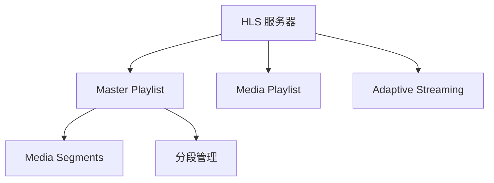

                 

# HLS 流媒体协议：在 HTTP 上分发视频内容

在当今的信息时代，视频内容已成为人们获取信息、娱乐和沟通的主要方式之一。随着网络带宽的不断提升，视频流媒体技术的发展也日益成熟。然而，视频流的分发仍然面临着诸如带宽消耗大、实时性要求高等挑战。因此，如何高效、可靠地分发视频内容，成为了流媒体技术关注的重点。本文将深入探讨HLS（HTTP Live Streaming）流媒体协议，介绍其核心概念与原理，并给出具体操作步骤，希望读者能够全面理解HLS协议，并在实际应用中得心应手。

## 1. 背景介绍

### 1.1 问题由来

随着视频行业的兴起，视频内容分发需求急剧增加。传统的流媒体技术如RTP/UDP等在互联网环境下，难以应对复杂的网路环境和带宽变化。而HLS作为一种基于HTTP的流媒体协议，能够充分利用现有的互联网基础设施，提供可靠、高效的视频分发服务。HLS协议最初由苹果公司提出，目的是为了在苹果设备上提供稳定的流媒体播放。随后，HLS逐渐成为流媒体技术的主流之一，被广泛应用在各种视频平台、直播平台、IPTV等场景中。

### 1.2 问题核心关键点

HLS协议的核心关键点在于其在HTTP协议上的流媒体分发机制。与传统的实时传输协议（如RTP/UDP）不同，HLS协议利用了HTTP协议的持久性、可缓存性和按需下载特性，将视频内容分段、编码后，通过HTTP协议在客户端进行流式下载和播放。HLS协议采用MPEG-TS格式编码视频流，并分为多个以时间为单位的小片段（即Media Segments），这些小片段可以被单独下载和播放。每个片段的MPEG-TS数据被包装在HTTP响应中，并通过HTTP请求下载。

## 2. 核心概念与联系

### 2.1 核心概念概述

为了更好地理解HLS协议，我们首先需要了解一些相关的核心概念：

- **HLS**：即HTTP Live Streaming，是一种基于HTTP的流媒体协议，用于实现实时的视频内容分发。
- **MPEG-TS**：一种标准的数字电视传输协议，广泛用于流媒体传输。
- **Media Segments**：HLS协议将MPEG-TS编码的视频流分割成多个小片段，每个片段可以在没有连续性要求的情况下独立下载和播放。
- **Master Playlist**：即MPD（Media Presentation Description），用于描述视频流的结构信息，包括视频的总长度、分段的位置和大小等。
- **Media Playlist**：用于描述每个分段的具体信息，包括分段的位置、起始时间和持续时间等。
- **Adaptive Streaming**：HLS协议支持自适应流媒体技术，根据客户端的网络带宽和设备能力，动态调整视频流质量，提高播放的流畅性和稳定性。

这些核心概念之间相互关联，构成了HLS协议的基础。以下是一个简化的HLS协议架构图：



## 3. 核心算法原理 & 具体操作步骤

### 3.1 算法原理概述

HLS协议的核心算法原理基于HTTP协议的持久性和可缓存性。它将MPEG-TS编码的视频流分割成多个小片段，每个片段可以在HTTP请求下独立下载和播放。客户端根据Master Playlist中的信息，下载相应的Media Playlist，进而获取每个Media Segment的下载地址。客户端在下载时，可以并行下载多个片段，以提高下载效率和播放流畅性。

### 3.2 算法步骤详解

HLS协议的具体操作步骤如下：

1. **客户端请求 Master Playlist**：客户端首先向HLS服务器请求Master Playlist，获取视频流的结构信息。Master Playlist包含了整个视频流的分段信息，如视频的总长度、分段的位置和大小等。
2. **客户端解析 Master Playlist**：客户端解析Master Playlist，获取每个Media Playlist的下载地址。
3. **客户端请求 Media Playlist**：客户端根据解析得到的下载地址，向HLS服务器请求Media Playlist。Media Playlist包含了每个分段的具体信息，如分段的位置、起始时间和持续时间等。
4. **客户端解析 Media Playlist**：客户端解析Media Playlist，获取每个Media Segment的下载地址。
5. **客户端下载 Media Segment**：客户端根据解析得到的下载地址，下载每个Media Segment。每个片段可以独立下载和播放，因此客户端可以并行下载多个片段，提高下载效率。
6. **客户端播放 Media Segment**：客户端将下载的Media Segment进行缓存，并根据时间戳进行播放。HLS协议支持自适应流媒体技术，根据客户端的网络带宽和设备能力，动态调整视频流质量，提高播放的流畅性和稳定性。

### 3.3 算法优缺点

HLS协议的优点包括：

- **兼容性好**：利用HTTP协议，兼容现有的互联网基础设施，可以在各种设备和平台上使用。
- **自适应流媒体**：支持自适应流媒体技术，根据客户端的网络带宽和设备能力，动态调整视频流质量，提高播放的流畅性和稳定性。
- **易于扩展**：可以利用CDN等缓存技术，提高流媒体的覆盖范围和分发效率。

HLS协议的缺点包括：

- **延迟较高**：由于需要将视频流分割成多个小片段，每个片段下载后才能播放，因此播放延迟较高。
- **带宽消耗大**：由于每个片段需要单独下载，即使客户端只下载了一小部分片段，也会下载整个片段，因此带宽消耗较大。
- **缓存需求高**：由于需要缓存多个分段，因此对缓存空间的消耗较大。

### 3.4 算法应用领域

HLS协议广泛应用于各种视频流媒体场景，如视频平台、直播平台、IPTV等。它被广泛应用于各种视频内容的传输，包括直播、点播、广告等。HLS协议的成功在于其与现有互联网基础设施的良好兼容性和自适应流媒体技术，使其能够适应各种网络环境，提供稳定、高效的视频流服务。

## 4. 数学模型和公式 & 详细讲解 & 举例说明

### 4.1 数学模型构建

HLS协议的数学模型主要涉及时间戳（Timestamp）和分段管理。每个分段包含多个时间戳，表示视频数据在时间轴上的位置。分段管理则涉及Master Playlist和Media Playlist的生成和管理。

### 4.2 公式推导过程

以下是HLS协议中涉及的一些关键公式：

1. **时间戳（Timestamp）**：
   - 时间戳用于表示视频数据在时间轴上的位置。HLS协议中使用MPEG-TS格式，每个数据包包含一个时间戳。
   - 时间戳计算公式为：`timestamp = PTM + 2^(32-8) * seqNumber`，其中PTM为PTS（Presentation Time Stamp），seqNumber为数据包序列号。

2. **分段长度（Segment Length）**：
   - 分段长度指每个分段中包含的视频数据长度，单位为字节。
   - 分段长度计算公式为：`segmentLength = (bitrate * duration) / 8`，其中bitrate为码率，duration为分段持续时间。

3. **分段偏移（Segment Offset）**：
   - 分段偏移指每个分段在视频流中的起始位置，单位为字节。
   - 分段偏移计算公式为：`segmentOffset = offset + segmentStart + segmentLength * (sequenceNumber - 1)`，其中offset为视频流的起始位置，segmentStart为分段在视频流中的起始位置，sequenceNumber为分段序列号。

### 4.3 案例分析与讲解

以一个简单的HLS协议为例，说明如何实现视频流的分段和管理：

假设有一个视频流，总长度为60秒，码率为1Mbps。

1. **Master Playlist**：
   ```
   #EXT-X-VERSION:3
   #EXT-X-PLAYLIST-TYPE:Master
   #EXT-X-TARGETDURATION:10
   #EXT-X-MEDIA:application/x-mpegURL;
   #EXT-X-INF:0,
   title=/video.m3u8,
   #EXT-X-ENDLIST
   ```
   Master Playlist包含了视频的总长度为60秒，分段持续时间为10秒，分段位置等信息。

2. **Media Playlist**：
   ```
   #EXT-X-VERSION:3
   #EXT-X-PLAYLIST-TYPE:Media
   #EXT-X-INF:1,
   title=/media/1.m3u8,
   #EXT-X-INF:2,
   title=/media/2.m3u8,
   #EXT-X-ENDLIST
   ```
   Media Playlist包含了每个分段的具体信息，如分段的位置、起始时间和持续时间等。

3. **分段数据**：
   ```
   #EXTINF:10, /media/1.ts
   #EXTINF:10, /media/2.ts
   #EXTINF:10, /media/3.ts
   ```
   每个分段包含一个时间戳和一个下载地址，表示该分段在时间轴上的位置和下载地址。

## 5. 项目实践：代码实例和详细解释说明

### 5.1 开发环境搭建

为了进行HLS协议的开发和测试，我们需要搭建一个包含HLS服务器和客户端的开发环境。

1. **服务器搭建**：可以选择使用Amazon S3、阿里云OSS等云存储服务作为视频流的存储和分发平台，搭建HLS服务器。
2. **客户端搭建**：可以使用浏览器、移动设备等作为HLS协议的客户端，进行流媒体播放和测试。

### 5.2 源代码详细实现

以下是一个简单的HLS服务器和客户端的代码实现：

**HLS服务器**：

```python
from flask import Flask, send_file
import os

app = Flask(__name__)

@app.route('/video.m3u8')
def m3u8():
    playlist = []
    for i in range(10):
        segment = f"/media/{i}.ts"
        playlist.append(f"#EXTINF:10, {segment}\n")
    return "\n".join(playlist)

@app.route('/media/<filename>')
def media(filename):
    return send_file(os.path.join('media', filename), as_attachment=True)

if __name__ == '__main__':
    app.run()
```

**HLS客户端**：

```python
from urllib.request import urlopen
import m3u8parser

playlist_url = "http://example.com/video.m3u8"
with urlopen(playlist_url) as response:
    playlist = m3u8parser.parse_playlist(response)
    for item in playlist.items:
        media_url = item.url
        response = urlopen(media_url)
        data = response.read()
        # 处理媒体数据，播放流媒体
```

### 5.3 代码解读与分析

**HLS服务器实现**：

- **m3u8**函数：生成Master Playlist，包含10个分段的信息。
- **media**函数：返回Media Segment的下载地址。

**HLS客户端实现**：

- **urlopen**：使用urllib库打开播放列表和分段数据。
- **m3u8parser.parse_playlist**：解析Master Playlist，获取分段信息。
- **urlopen**：下载每个分段的数据。

### 5.4 运行结果展示

通过上述代码，我们可以在服务器上部署HLS服务器，客户端可以通过浏览器或移动设备访问HLS视频流，进行流媒体播放。

## 6. 实际应用场景

### 6.1 智能电视

HLS协议在智能电视中的应用非常广泛。智能电视可以利用HLS协议实现直播、点播、录制等功能，为用户提供多样化的视频服务。

### 6.2 视频平台

视频平台如YouTube、Netflix等广泛使用HLS协议进行视频内容的分发。HLS协议能够根据客户端的网络带宽和设备能力，动态调整视频流质量，提供流畅的视频播放体验。

### 6.3 直播平台

直播平台如Twitch、YouTube Live等使用HLS协议进行直播内容的分发。HLS协议能够保证直播的实时性和稳定性，提供流畅的直播体验。

### 6.4 未来应用展望

未来，HLS协议有望在更多场景中得到应用，如车联网、工业互联网等。车联网可以利用HLS协议实现车载娱乐系统的视频播放，提高用户驾驶体验。工业互联网可以利用HLS协议进行远程监控和远程操作，提高工作效率。

## 7. 工具和资源推荐

### 7.1 学习资源推荐

为了深入了解HLS协议，以下推荐一些学习资源：

- **YouTube**：HLS协议的相关视频教程。
- **官方文档**：Apple和Amazon等HLS协议提供方的官方文档。
- **博客**：如CSDN、博客园等平台上的HLS协议技术博客。

### 7.2 开发工具推荐

以下是一些常用的开发工具，可用于HLS协议的开发和测试：

- **Flask**：Python Web框架，用于搭建HLS服务器。
- **Python**：用于处理视频流和分段数据。
- **m3u8parser**：Python库，用于解析M3U8文件。

### 7.3 相关论文推荐

以下推荐一些HLS协议相关的学术论文，供参考：

- "A Scalable HTTP Streaming Protocol" by Steve Harknett et al.
- "A Media Presentation Description Language" by Nwankpa K.T. et al.
- "A Reference Model for Dynamic Adaptive Streaming over HTTP" by Rivest R.L. et al.

## 8. 总结：未来发展趋势与挑战

### 8.1 研究成果总结

HLS协议作为一种基于HTTP的流媒体协议，已经被广泛应用于各种视频流媒体场景中。它在兼容性好、自适应流媒体、易于扩展等方面具有显著优势。然而，HLS协议也存在延迟较高、带宽消耗大、缓存需求高等缺点。未来，HLS协议需要在这些方面进行改进，以提供更高效、更稳定的视频流服务。

### 8.2 未来发展趋势

未来，HLS协议的发展趋势可能包括以下几个方面：

- **自适应流媒体技术**：随着5G网络的普及，自适应流媒体技术将进一步提升视频流服务的质量。
- **多媒体融合**：HLS协议有望与其他多媒体技术进行融合，如AR、VR等，提供更加丰富多样的视频体验。
- **边缘计算**：边缘计算技术将使视频流的分发更加高效，降低延迟和带宽消耗。

### 8.3 面临的挑战

HLS协议在发展过程中也面临一些挑战：

- **网络带宽限制**：HLS协议的高带宽消耗可能导致网络拥塞，需要优化协议的带宽使用。
- **设备兼容性**：HLS协议需要支持多种设备和平台，确保在各种环境下的兼容性。
- **安全问题**：HLS协议的开放性可能面临安全威胁，需要加强数据加密和访问控制。

### 8.4 研究展望

未来，HLS协议需要在提高效率、增强兼容性、提升安全性等方面进行深入研究。同时，HLS协议也需与其他技术进行融合，如自适应流媒体、边缘计算等，进一步优化视频流服务。

## 9. 附录：常见问题与解答

**Q1：HLS协议和DASH协议有何区别？**

A：HLS协议和DASH协议（Dynamic Adaptive Streaming over HTTP）都是基于HTTP的流媒体协议，用于实现实时的视频内容分发。两者的区别在于分段策略和时间戳的处理方式不同。HLS协议使用MPEG-TS格式编码视频流，每个分段包含一个时间戳，且分段长度固定。而DASH协议使用MP4格式编码视频流，每个分段包含多个时间戳，分段长度可变。

**Q2：HLS协议能否兼容其他流媒体协议？**

A：HLS协议主要基于HTTP协议进行视频流分发，因此可以与其他基于HTTP的流媒体协议兼容。例如，MPEG-DASH协议也可以利用HTTP协议进行视频流分发，与HLS协议的兼容性较好。

**Q3：HLS协议如何实现自适应流媒体？**

A：HLS协议实现自适应流媒体技术的关键在于根据客户端的网络带宽和设备能力，动态调整视频流质量。客户端在下载时，可以根据Master Playlist中的信息，动态选择合适的分段进行下载。服务器可以根据客户端的网络状况，调整视频流质量，提供流畅的视频播放体验。

**Q4：HLS协议是否支持回放和暂停功能？**

A：HLS协议支持回放和暂停功能。客户端可以在下载和播放视频流时，根据时间戳进行回放和暂停操作。然而，回放和暂停操作可能导致视频流的重新下载和播放，因此在回放和暂停时，需要缓存更多的数据。

**Q5：HLS协议是否支持加密和保护？**

A：HLS协议支持加密和保护，确保视频流的安全传输。服务器可以对视频流进行加密，并使用访问控制技术，限制访问权限。客户端在下载和播放视频流时，需要对加密的数据进行解密操作，以获取原始视频流。

---

作者：禅与计算机程序设计艺术 / Zen and the Art of Computer Programming

