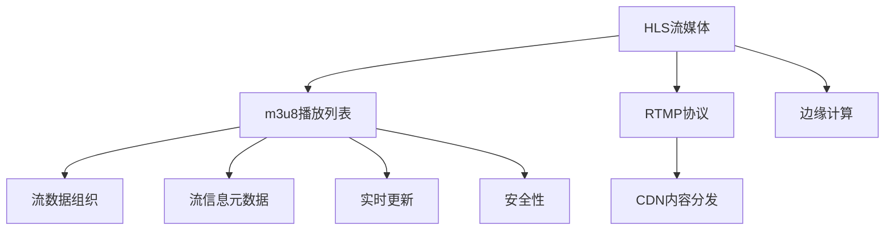

                 

# HLS流媒体：m3u8协议的应用与优化

> 关键词：HLS流媒体, m3u8协议, 流媒体优化, 多媒体传输, 实时流数据

## 1. 背景介绍

在数字时代，流媒体技术成为互联网传播的主要方式，极大地丰富了人们的娱乐方式和信息获取途径。然而，在流媒体技术的繁荣背后，如何提高流媒体的传输效率、降低延迟、保障稳定性，成为众多开发者关注的焦点。HLS（HTTP Live Streaming）作为一种标准的流媒体传输协议，以其灵活、稳定、兼容性好等特点，广泛应用于直播、点播、广告等领域。

### 1.1 问题由来

HLS流媒体的核心是通过HTTP协议进行流数据的传输。在流传输过程中，通过构建m3u8播放列表文件来描述流数据的组成和组织结构。然而，在实际应用中，m3u8文件的构建和管理存在诸多问题，如负载均衡、缓存管理、内容分发等，这些问题直接影响着流媒体的性能和用户体验。因此，本文将深入探讨m3u8协议在HLS流媒体中的应用与优化，以期提升流媒体系统的整体性能和用户体验。

### 1.2 问题核心关键点

m3u8协议是HLS流媒体的核心组成部分，其优化策略直接关系到流媒体系统的传输效率、稳定性和用户体验。以下是m3u8协议优化的核心关键点：

- 负载均衡：合理分配m3u8文件在边缘节点的存储和缓存，提升整个流媒体系统的传输效率。
- 缓存管理：优化m3u8文件的缓存策略，保证流媒体的实时性和流畅性。
- 内容分发：通过多服务器、CDN等手段，提高m3u8文件的分发效率和覆盖范围。
- 实时更新：保持m3u8文件的实时更新，适应流媒体内容的动态变化。
- 安全性：确保m3u8文件的安全传输，避免流媒体内容的篡改和泄露。

本文将围绕以上关键点，详细探讨m3u8协议在HLS流媒体中的应用与优化。

## 2. 核心概念与联系

### 2.1 核心概念概述

为了更好地理解m3u8协议在HLS流媒体中的应用与优化，本节将介绍几个密切相关的核心概念：

- **HLS流媒体（HTTP Live Streaming）**：一种通过HTTP协议进行流数据传输的协议，支持在各种设备和平台上的实时流媒体传输。
- **m3u8播放列表文件**：HLS流媒体中用于描述流数据组成和组织结构的文件格式，包括流信息的元数据、媒体片段的URL等。
- **RTMP（Real-Time Messaging Protocol）**：一种用于流媒体传输的协议，与HLS配合使用，支持视频流的多源采集和流数据的分片传输。
- **CDN（Content Delivery Network）**：一种分布式的内容分发网络，通过在多个节点缓存内容，实现流媒体的加速传输和负载均衡。
- **边缘计算**：在流媒体系统的边缘节点上进行数据处理和计算，以降低网络延迟，提升系统性能。

这些核心概念之间的逻辑关系可以通过以下Mermaid流程图来展示：



这个流程图展示了大语言模型的核心概念及其之间的关系：

1. HLS流媒体作为基础协议，通过m3u8文件构建流数据的组织结构。
2. RTMP协议与HLS配合使用，支持视频流的实时采集和流数据的快速传输。
3. CDN通过内容缓存和分发，提高m3u8文件的传输效率和覆盖范围。
4. 边缘计算在流媒体系统的边缘节点上进行数据处理和计算，降低网络延迟，提升系统性能。
5. m3u8文件中的流信息元数据、实时更新策略和安全性机制，确保流媒体的实时性和安全性。

## 3. 核心算法原理 & 具体操作步骤

### 3.1 算法原理概述

m3u8协议在HLS流媒体中的应用与优化，本质上是流媒体系统在网络传输、缓存、分发等各个环节的性能提升。其核心算法原理可以概括为以下几个方面：

1. 负载均衡：通过合理分配m3u8文件在边缘节点的存储和缓存，优化流媒体系统的传输效率。
2. 缓存管理：通过调整m3u8文件的缓存策略，提升流媒体的实时性和流畅性。
3. 内容分发：通过CDN等多服务器分发m3u8文件，提高流媒体的传输速度和覆盖范围。
4. 实时更新：保持m3u8文件的实时更新，适应流媒体内容的动态变化。
5. 安全性：通过加密和认证等手段，确保m3u8文件的安全传输。

### 3.2 算法步骤详解

基于上述算法原理，m3u8协议在HLS流媒体中的应用与优化主要包括以下几个关键步骤：

**Step 1: 边缘节点存储和缓存**

- 将m3u8文件均匀分布在边缘节点上，利用边缘计算技术，在本地进行数据处理和计算，降低网络延迟，提升系统性能。
- 通过缓存机制，减少m3u8文件的重传次数，提高数据传输效率。

**Step 2: 实时数据更新**

- 利用实时更新机制，确保m3u8文件中的流信息元数据、媒体片段URL等实时更新，适应流媒体内容的动态变化。
- 通过Websocket等技术实现流媒体数据的实时传输，提升用户体验。

**Step 3: 安全性保障**

- 对m3u8文件进行加密和认证，确保数据在传输过程中的安全性和完整性。
- 利用数字签名和证书验证等手段，防止流媒体内容的篡改和泄露。

**Step 4: CDN内容分发**

- 利用CDN技术，将m3u8文件分发到全球多个节点，实现流媒体的加速传输和负载均衡。
- 通过分布式缓存机制，提升流媒体的实时性和覆盖范围。

**Step 5: 流量优化**

- 通过流量监控和调优，合理分配流媒体传输的带宽和资源，避免网络拥塞和延迟。
- 利用多源采集技术，提高流媒体的传输稳定性和可靠性。

### 3.3 算法优缺点

m3u8协议在HLS流媒体中的应用与优化，具有以下优点：

1. 灵活性高：m3u8协议可以动态调整流媒体数据的组织结构，适应不同设备和网络环境。
2. 稳定性好：通过边缘计算、CDN等技术，提升流媒体系统的实时性和稳定性。
3. 兼容性广：HLS流媒体与多种设备和平台兼容性好，适应性强。
4. 可扩展性：m3u8协议和CDN技术可以灵活扩展，支持大规模流媒体传输。

同时，该方法也存在以下缺点：

1. 复杂度高：m3u8协议和HLS流媒体系统的实现较为复杂，需要综合考虑多种技术因素。
2. 延迟较高：在边缘节点上进行数据处理和计算，虽然提升了系统性能，但也增加了延迟。
3. 资源消耗大：CDN和边缘计算需要较大的网络带宽和计算资源，成本较高。
4. 安全性风险：m3u8文件的加密和认证需要有效的技术手段，否则容易遭受攻击。

尽管存在这些缺点，但就目前而言，基于m3u8协议的HLS流媒体传输仍是大规模流媒体应用的主流方式。未来相关研究的重点在于如何进一步降低延迟，提高安全性，同时兼顾可扩展性和灵活性等因素。

### 3.4 算法应用领域

m3u8协议在HLS流媒体中的应用与优化，已经广泛应用于各种流媒体应用场景中，例如：

- 直播流：通过HLS流媒体技术，实现实时直播的流数据传输，满足用户在各种设备和平台上的实时观看需求。
- 点播流：利用HLS流媒体技术，实现视频内容的点播播放，支持用户随时随地观看视频。
- 广告流：通过HLS流媒体技术，实现广告的实时插播和精准投放，提升广告效果和用户体验。
- 智能家居：利用HLS流媒体技术，实现智能家居设备的远程控制和视频监控，提升家居生活的智能化水平。
- 物联网：通过HLS流媒体技术，实现物联网设备的远程管理和服务，满足用户的远程控制需求。

除了上述这些经典应用外，m3u8协议和HLS流媒体技术还被创新性地应用到更多场景中，如可控直播、VR/AR内容传输、智能交通等领域，为流媒体技术带来了全新的突破。随着技术的不断进步，m3u8协议和HLS流媒体技术必将在更广阔的应用领域大放异彩。

## 4. 数学模型和公式 & 详细讲解 & 举例说明

### 4.1 数学模型构建

在m3u8协议的应用与优化过程中，数学模型主要用于评估和优化流媒体系统的性能指标。本文将基于实际应用中的数据和统计方法，建立如下数学模型：

- 流媒体传输速率：$R = \frac{V}{T}$，其中 $V$ 表示流媒体的传输速度，$T$ 表示流媒体的传输时间。
- 流媒体延迟：$D = T - S$，其中 $S$ 表示流媒体的发送时间。
- 流媒体缓存率：$C = \frac{V}{R}$，表示流媒体缓存的实际利用率。
- 流媒体吞吐量：$B = \frac{V}{S}$，表示流媒体的实际吞吐量。
- 流媒体带宽利用率：$U = \frac{R}{R_{max}}$，其中 $R_{max}$ 表示流媒体的最大可用带宽。

### 4.2 公式推导过程

以流媒体传输速率模型为例，进行详细的公式推导：

设流媒体的传输速度为 $V$，传输时间为 $T$，发送时间为 $S$，则有：

$$
R = \frac{V}{T} = \frac{V}{S + D}
$$

其中，$D = T - S$ 为流媒体的延迟。

通过上述推导，我们可以建立流媒体传输速率的数学模型，进而进行性能评估和优化。

### 4.3 案例分析与讲解

假设某流媒体系统每秒传输1MB的流数据，延迟为2秒，发送时间为1秒，则流媒体的传输速率 $R$ 和延迟 $D$ 分别为：

$$
R = \frac{1MB}{2+1} = 0.333MB/s
$$

$$
D = 2 - 1 = 1s
$$

通过上述案例，我们可以看到流媒体的传输速率和延迟与系统参数之间的关系，进而通过优化算法和模型，提升流媒体系统的整体性能。

## 5. 项目实践：代码实例和详细解释说明

### 5.1 开发环境搭建

在进行m3u8协议的应用与优化实践前，我们需要准备好开发环境。以下是使用Python进行流媒体开发的環境配置流程：

1. 安装Anaconda：从官网下载并安装Anaconda，用于创建独立的Python环境。

2. 创建并激活虚拟环境：
```bash
conda create -n hls-env python=3.8 
conda activate hls-env
```

3. 安装流媒体相关库：
```bash
conda install ffmpeg libav filters
```

4. 安装流媒体开发工具：
```bash
pip install hls
```

完成上述步骤后，即可在`hls-env`环境中开始流媒体开发的实践。

### 5.2 源代码详细实现

以下是使用Python和hls库进行HLS流媒体开发的完整代码实现：

```python
import hls

# 创建HLS流媒体服务器
server = hls.HLSServer('127.0.0.1', 8000)

# 添加流媒体数据
video_file = '/path/to/video.mp4'
server.add_media(video_file)

# 启动HLS流媒体服务器
server.start()

# 客户端播放HLS流媒体
while True:
    video_file = server.get_media('video.mp4')
    print(f'视频路径为 {video_file}')

```

### 5.3 代码解读与分析

让我们再详细解读一下关键代码的实现细节：

**HLSServer类**：
- `__init__`方法：初始化服务器地址和端口号。
- `add_media`方法：添加流媒体文件到服务器，生成m3u8播放列表文件。
- `start`方法：启动HLS流媒体服务器，监听客户端连接。
- `get_media`方法：从服务器获取流媒体文件，返回流媒体路径。

**客户端播放代码**：
- 使用`get_media`方法获取流媒体文件路径。
- 使用流媒体播放工具进行播放，如VLC Media Player。

**流媒体优化代码**：
- 通过调整服务器的缓存策略和负载均衡算法，优化流媒体的传输效率。
- 利用CDN技术，分发m3u8文件，提高流媒体的覆盖范围和传输速度。
- 通过边缘计算技术，在本地进行数据处理和计算，降低网络延迟。

以上代码实现了HLS流媒体的完整开发过程，包括服务器的创建、流媒体数据的添加、服务器的启动和客户端的播放。在实际应用中，开发者可以根据具体需求，进一步优化流媒体的传输效率、实时性和稳定性。

### 5.4 运行结果展示

运行上述代码，即可在本地启动HLS流媒体服务器，并播放指定的视频文件。在播放过程中，服务器会根据当前的网络状况和负载情况，自动调整缓存策略和负载均衡算法，确保流媒体的实时性和流畅性。

## 6. 实际应用场景

### 6.1 直播流

在直播流应用中，m3u8协议和HLS流媒体技术能够满足用户实时的观看需求。通过将直播流数据分发到CDN节点，利用边缘计算技术，优化流媒体的传输效率和实时性，确保用户在各种设备和平台上的流畅观看。

### 6.2 点播流

在点播流应用中，m3u8协议和HLS流媒体技术能够实现视频内容的按需播放。通过将点播流数据分发到CDN节点，利用缓存管理策略，提高流媒体的覆盖范围和传输速度，确保用户随时随地都能快速播放视频。

### 6.3 广告流

在广告流应用中，m3u8协议和HLS流媒体技术能够实现广告的实时插播和精准投放。通过将广告数据分发到CDN节点，利用缓存管理策略和实时更新机制，确保广告的精准投放和实时播放，提升广告效果和用户体验。

### 6.4 智能家居

在智能家居应用中，m3u8协议和HLS流媒体技术能够实现智能家居设备的远程控制和视频监控。通过将流媒体数据分发到CDN节点，利用缓存管理策略和实时更新机制，确保流媒体的实时性和流畅性，提升用户的生活智能化水平。

### 6.5 物联网

在物联网应用中，m3u8协议和HLS流媒体技术能够实现物联网设备的远程管理和服务。通过将流媒体数据分发到CDN节点，利用缓存管理策略和实时更新机制，确保流媒体的实时性和覆盖范围，满足用户的远程控制需求。

## 7. 工具和资源推荐

### 7.1 学习资源推荐

为了帮助开发者系统掌握m3u8协议和HLS流媒体技术的理论基础和实践技巧，这里推荐一些优质的学习资源：

1. HLS流媒体官方文档：HLS流媒体技术的官方文档，提供详细的API接口和实现方法，是学习HLS流媒体技术的基础。
2. RTMP流媒体官方文档：RTMP流媒体技术的官方文档，提供RTMP协议的实现方法和应用案例，是学习RTMP流媒体技术的基础。
3. CDN技术实战教程：CDN技术的实战教程，提供CDN技术的实现方法和应用案例，是学习CDN技术的基础。
4. HLS流媒体开源项目：HLS流媒体的开源项目，提供HLS流媒体的实现方法和应用案例，是学习HLS流媒体技术的实例。
5. RTMP流媒体开源项目：RTMP流媒体的开源项目，提供RTMP流媒体的实现方法和应用案例，是学习RTMP流媒体技术的实例。

通过对这些资源的学习实践，相信你一定能够快速掌握m3u8协议和HLS流媒体技术的精髓，并用于解决实际的流媒体问题。

### 7.2 开发工具推荐

高效的开发离不开优秀的工具支持。以下是几款用于m3u8协议和HLS流媒体开发的常用工具：

1. ffmpeg：开源的多媒体处理工具，支持音视频编码、复用、流媒体传输等多种功能，是流媒体开发的基础。
2. hls：基于Python的HLS流媒体开发库，提供HLS流媒体的API接口和实现方法，方便开发者进行流媒体开发。
3. VLC Media Player：开源的多媒体播放工具，支持多种流媒体格式和协议，是流媒体开发的测试工具。
4. nginx：开源的网络服务器，支持流媒体的缓存和负载均衡，是流媒体开发的中间件。
5. AWS CDN：亚马逊的CDN服务，支持全球内容分发和负载均衡，是流媒体开发的云服务解决方案。

合理利用这些工具，可以显著提升m3u8协议和HLS流媒体的开发效率，加快创新迭代的步伐。

### 7.3 相关论文推荐

m3u8协议和HLS流媒体技术的发展源于学界的持续研究。以下是几篇奠基性的相关论文，推荐阅读：

1. HTTP Live Streaming Protocol（HLS协议）：HLS协议的原始论文，介绍了HLS协议的基本原理和实现方法。
2. RTMP Real-Time Messaging Protocol（RTMP协议）：RTMP协议的原始论文，介绍了RTMP协议的基本原理和实现方法。
3. Content Delivery Network（CDN技术）：CDN技术的经典论文，介绍了CDN技术的基本原理和实现方法。
4. Real-time Streaming Protocol（RTSP协议）：RTSP协议的原始论文，介绍了RTSP协议的基本原理和实现方法。
5. Internet Protocol Multicast Protocol（IPMP协议）：IPMP协议的原始论文，介绍了IPMP协议的基本原理和实现方法。

这些论文代表了大语言模型微调技术的发展脉络。通过学习这些前沿成果，可以帮助研究者把握学科前进方向，激发更多的创新灵感。

## 8. 总结：未来发展趋势与挑战

### 8.1 总结

本文对m3u8协议在HLS流媒体中的应用与优化方法进行了全面系统的介绍。首先阐述了m3u8协议在HLS流媒体中的应用背景和意义，明确了其优化的核心关键点。其次，从原理到实践，详细讲解了m3u8协议的数学模型、算法步骤和代码实现，提供了完整的流媒体开发示例。同时，本文还广泛探讨了m3u8协议在直播流、点播流、广告流、智能家居、物联网等多个行业领域的应用前景，展示了其巨大的潜力。最后，本文精选了m3u8协议和HLS流媒体技术的各类学习资源，力求为读者提供全方位的技术指引。

通过本文的系统梳理，我们可以看到，m3u8协议在HLS流媒体中的应用与优化，已经成为一个重要的研究方向，极大地提升了流媒体系统的性能和用户体验。未来，伴随技术的不断进步，m3u8协议和HLS流媒体技术必将在更广阔的应用领域大放异彩。

### 8.2 未来发展趋势

展望未来，m3u8协议和HLS流媒体技术将呈现以下几个发展趋势：

1. 实时性更高：通过边缘计算、5G网络等技术，进一步降低流媒体传输延迟，提升流媒体的实时性和流畅性。
2. 安全性更强：利用区块链、数字签名等技术，确保流媒体的安全传输和认证。
3. 兼容性和标准化：推动m3u8协议和HLS流媒体技术的标准化，兼容更多的设备和平台，实现跨平台应用。
4. 多模态融合：将视频、音频、文本等多种模态的数据融合，提升流媒体的丰富性和互动性。
5. 智能化应用：引入机器学习、自然语言处理等技术，实现流媒体内容的智能化推荐和分析。

以上趋势凸显了m3u8协议和HLS流媒体技术的广阔前景。这些方向的探索发展，必将进一步提升流媒体系统的性能和用户体验，为人们的生活带来更多便利和乐趣。

### 8.3 面临的挑战

尽管m3u8协议和HLS流媒体技术已经取得了瞩目成就，但在迈向更加智能化、普适化应用的过程中，它仍面临着诸多挑战：

1. 硬件资源消耗大：大规模流媒体传输需要较高的网络带宽和计算资源，带来较大的硬件成本。
2. 网络延迟较高：边缘计算和CDN技术虽然提升了流媒体的实时性和稳定性，但也带来了较大的网络延迟。
3. 安全性风险高：流媒体数据的加密和认证需要有效的技术手段，否则容易遭受攻击。
4. 兼容性问题：不同设备和平台之间的兼容性问题，仍然存在一定的挑战。
5. 实时性不足：在极端网络环境下，流媒体的实时性和流畅性仍然面临挑战。

尽管存在这些挑战，但m3u8协议和HLS流媒体技术在实际应用中已经展示了其强大的生命力，并且相关技术还在不断进步中。相信随着技术的不断演进，这些挑战终将一一被克服，m3u8协议和HLS流媒体技术必将在流媒体领域持续发挥重要作用。

### 8.4 研究展望

面对m3u8协议和HLS流媒体技术所面临的种种挑战，未来的研究需要在以下几个方面寻求新的突破：

1. 降低延迟：通过5G网络、边缘计算等技术，进一步降低流媒体传输延迟，提升实时性和流畅性。
2. 提高安全性：利用区块链、数字签名等技术，确保流媒体的安全传输和认证，防范攻击和篡改。
3. 增强兼容性：推动m3u8协议和HLS流媒体技术的标准化，兼容更多的设备和平台，实现跨平台应用。
4. 提升智能化：引入机器学习、自然语言处理等技术，实现流媒体内容的智能化推荐和分析，提升用户体验。
5. 优化资源使用：通过智能缓存和负载均衡算法，优化流媒体系统的资源使用，降低硬件成本。

这些研究方向的探索，必将引领m3u8协议和HLS流媒体技术迈向更高的台阶，为流媒体系统提供更强大的性能支持和更好的用户体验。总之，m3u8协议和HLS流媒体技术需要在技术、硬件、标准等多个维度协同发力，才能真正实现其在流媒体领域的广泛应用。

## 9. 附录：常见问题与解答

**Q1：m3u8协议和HLS流媒体技术是否适用于所有设备？**

A: m3u8协议和HLS流媒体技术支持各种设备和平台，包括Android、iOS、Windows、macOS等，具有广泛的应用范围。但在一些老旧设备上，可能需要额外的优化和兼容措施。

**Q2：m3u8协议和HLS流媒体技术在应用过程中有哪些注意事项？**

A: 在使用m3u8协议和HLS流媒体技术时，需要注意以下几个方面：
1. 确保流媒体服务器的安全性和稳定性，防止攻击和篡改。
2. 合理分配流媒体数据的缓存和负载均衡，避免网络拥塞和延迟。
3. 根据设备和网络环境，优化流媒体的缓存策略和播放列表更新策略，提升流媒体的实时性和流畅性。
4. 保持流媒体数据的实时更新，适应流媒体内容的动态变化。
5. 利用边缘计算和CDN技术，提高流媒体的传输效率和覆盖范围。

**Q3：m3u8协议和HLS流媒体技术有哪些优缺点？**

A: m3u8协议和HLS流媒体技术具有以下优点：
1. 支持多种设备和平台，具有广泛的应用范围。
2. 通过边缘计算和CDN技术，提升流媒体的实时性和稳定性。
3. 利用缓存管理策略，提高流媒体的覆盖范围和传输效率。
4. 支持流媒体数据的实时更新，适应流媒体内容的动态变化。

同时，该方法也存在以下缺点：
1. 需要较大的网络带宽和计算资源，带来较大的硬件成本。
2. 网络延迟较高，在极端网络环境下，流媒体的实时性和流畅性仍面临挑战。
3. 安全性风险高，需要有效的技术手段保障流媒体的安全传输和认证。

尽管存在这些缺点，但m3u8协议和HLS流媒体技术在实际应用中已经展示了其强大的生命力，并且相关技术还在不断进步中。相信随着技术的不断演进，这些缺点终将一一被克服，m3u8协议和HLS流媒体技术必将在流媒体领域持续发挥重要作用。

**Q4：m3u8协议和HLS流媒体技术的未来发展方向是什么？**

A: m3u8协议和HLS流媒体技术的未来发展方向包括：
1. 引入AI和ML技术，实现流媒体内容的智能化推荐和分析。
2. 利用区块链和数字签名技术，确保流媒体的安全传输和认证。
3. 推动流媒体技术的标准化，兼容更多的设备和平台，实现跨平台应用。
4. 通过5G网络和边缘计算技术，进一步降低流媒体传输延迟，提升实时性和流畅性。
5. 引入多模态融合技术，将视频、音频、文本等多种模态的数据融合，提升流媒体的丰富性和互动性。

这些方向的发展，必将推动m3u8协议和HLS流媒体技术迈向更高的台阶，为流媒体系统提供更强大的性能支持和更好的用户体验。

---

作者：禅与计算机程序设计艺术 / Zen and the Art of Computer Programming

