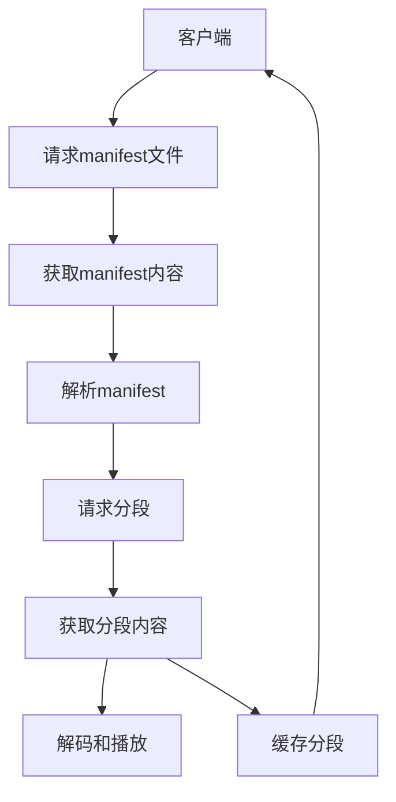

                 

# HLS流媒体：m3u8协议详解与应用

> 关键词：HLS流媒体, m3u8协议, HTTP Live Streaming, HTTP Live Streaming格式, 实时流媒体, 多媒体技术, 实时数据传输

## 1. 背景介绍

随着互联网的普及和多媒体技术的飞速发展，视频流媒体成为一种新兴的传播形式，丰富了人们的生活娱乐方式。在视频流媒体技术中，HLS（HTTP Live Streaming）流媒体技术因其高效、稳定、易于使用而广泛应用于各种流媒体平台，包括YouTube、Apple TV、Netflix等。HLS的核心是m3u8协议，本文将详细介绍m3u8协议及其应用，帮助读者深入理解HLS流媒体的工作原理和实际应用。

## 2. 核心概念与联系

### 2.1 核心概念概述

为了更好地理解HLS和m3u8协议，我们首先需要明确以下几个关键概念：

- **HLS（HTTP Live Streaming）**：一种基于HTTP协议的流媒体传输技术，通过将视频流分片（Segment）并封装成标准的MPEG-TS格式，以适应不同带宽和网络环境，实现高效率、高可靠性的实时数据传输。

- **m3u8协议**：用于描述HLS流媒体播放清单的文本文件格式，列出了所有视频分段（Segment）的URL地址和元数据，客户端可以根据这些信息获取并播放相应的视频内容。

- **分段（Segment）**：将大视频流分割成多个小片段，每个片段大小一般控制在数秒至数十秒之间，便于适应不同的网络环境，同时也便于恢复断点播放。

- **连续性（Continuity）**：HLS分段之间的逻辑关系，即前后分段之间的引用关系，使得用户可以跨网络断点恢复播放。

- ** manifest文件**：包含了HLS流媒体的总体信息，如视频流名称、分段信息、索引信息等，通常以m3u8格式存储。

这些核心概念构成了HLS流媒体和m3u8协议的基本框架，使得流媒体技术能够高效、可靠地传输实时数据，满足各种终端设备的播放需求。

### 2.2 核心概念原理和架构的 Mermaid 流程图



该流程图展示了HLS流媒体的请求和播放流程：客户端首先请求manifest文件，解析其中的分段信息，然后根据分段信息请求具体的分段内容，解码后进行播放或缓存。这个过程通过m3u8协议进行描述和控制，确保了流媒体传输的稳定性和可靠性。

## 3. 核心算法原理 & 具体操作步骤

### 3.1 算法原理概述

m3u8协议是HLS流媒体的核心，用于描述视频分段（Segment）的URL地址和元数据，支持客户端获取并播放相应的视频内容。其原理主要包括以下几个方面：

- **分段描述**：m3u8文件以文本形式描述了所有视频分段（Segment）的URL地址和元数据，包括起始时间戳、结束时间戳、码率等信息，确保客户端能够根据这些信息获取分段内容。

- **连续性维护**：m3u8文件还描述了分段之间的连续性关系，即每个分段在哪个时间段内，客户端可以根据这些信息进行断点播放，确保播放的连续性和稳定性。

- **索引信息**：m3u8文件包含了视频流的总体信息，如视频流名称、分段信息、索引信息等，帮助客户端快速定位和播放视频内容。

### 3.2 算法步骤详解

m3u8协议的基本步骤包括：

1. **客户端请求manifest文件**：客户端首先向服务器发送请求manifest文件的HTTP GET请求，获取对应的m3u8文件。

2. **服务器响应manifest文件**：服务器返回请求的m3u8文件，其中包含了所有视频分段的URL地址和元数据。

3. **客户端解析manifest文件**：客户端解析m3u8文件，获取所有视频分段的信息，包括URL地址、起始时间戳、结束时间戳、码率等。

4. **客户端请求分段内容**：根据解析得到的视频分段信息，客户端向服务器发送请求分段内容的HTTP GET请求。

5. **服务器响应分段内容**：服务器返回请求的分段内容，客户端接收到后进行解码和播放。

6. **缓存分段内容**：客户端将下载的分段内容缓存，以备断点恢复播放时使用。

### 3.3 算法优缺点

**优点**：

- **易于实现**：m3u8协议采用标准的HTTP协议，易于在各种环境下实现，适应性强。
- **灵活性强**：m3u8协议支持多种格式的分段和元数据描述，可以灵活适应不同设备和网络环境。
- **稳定可靠**：m3u8协议支持断点播放和缓存机制，确保了流媒体传输的稳定性和可靠性。

**缺点**：

- **资源消耗大**：m3u8协议需要服务器和客户端分别维护manifest文件和分段缓存，增加了资源消耗。
- **实时性要求高**：m3u8协议需要服务器和客户端实时通信，对网络环境要求较高。
- **数据冗余**：m3u8协议中包含了大量的元数据信息，导致数据冗余。

### 3.4 算法应用领域

m3u8协议广泛应用于各种流媒体平台，包括YouTube、Apple TV、Netflix等。其应用领域包括但不限于：

- **视频点播**：如YouTube、Netflix等平台，提供实时的视频点播服务。
- **直播**：如Apple TV、YouTube Live等平台，提供实时的视频直播服务。
- **录播**：如教育机构、企业培训等，提供录播的在线视频课程。
- **虚拟会议**：如Zoom、Teams等平台，提供实时的视频会议和录制服务。

这些应用场景都利用了m3u8协议的高效、稳定和灵活性，满足了不同用户的需求。

## 4. 数学模型和公式 & 详细讲解 & 举例说明

### 4.1 数学模型构建

m3u8协议的数学模型主要涉及分段描述、连续性维护和索引信息三个方面。

- **分段描述**：每个分段描述包含起始时间戳、结束时间戳、码率、URL地址等信息，以文本格式存储在m3u8文件中。
- **连续性维护**：通过描述分段之间的连续性关系，确保分段播放的连续性和稳定性。
- **索引信息**：包含视频流的总体信息，如视频流名称、分段信息、索引信息等。

### 4.2 公式推导过程

以下是m3u8协议中常用的几个公式：

1. **分段时间戳计算**：分段时间戳用于确定分段的播放时间范围，计算公式如下：

$$
\text{Start Time} = \text{ts}-\text{duration}
$$

$$
\text{End Time} = \text{ts}+\text{duration}
$$

其中，$\text{ts}$表示分段的时间戳，$\text{duration}$表示分段的持续时长。

2. **码率计算**：码率用于描述分段的数据传输速率，计算公式如下：

$$
\text{Bitrate} = \frac{\text{Segment Size}}{\text{Duration}}
$$

其中，$\text{Segment Size}$表示分段的字节大小，$\text{Duration}$表示分段的持续时长。

### 4.3 案例分析与讲解

以YouTube的HLS流媒体为例，分析m3u8协议的应用。YouTube使用m3u8协议描述了实时的视频分段和元数据，支持实时的视频点播和直播。服务器会根据客户端的请求，动态生成m3u8文件，包含所有视频分段的信息，客户端解析后根据时间段和码率进行分段请求和播放。

## 5. 项目实践：代码实例和详细解释说明

### 5.1 开发环境搭建

要进行HLS流媒体的实践开发，需要搭建相应的开发环境，包括Python、Flask、ffmpeg等工具。

- **Python**：用于编写服务器端和客户端的代码。
- **Flask**：用于搭建Web服务器，提供RESTful API接口。
- **ffmpeg**：用于将视频文件转换为HLS格式的分段和manifest文件。

### 5.2 源代码详细实现

以下是Python和Flask的HLS流媒体开发示例代码：

**服务器端代码**：

```python
from flask import Flask, jsonify, send_file
import os
import ffmpeg

app = Flask(__name__)

@app.route('/manifest/<file_id>')
def get_manifest(file_id):
    # 生成manifest文件
    file_path = os.path.join(app.config['STATIC_DIR'], file_id + '.m3u8')
    manifest_content = ''
    with open(file_path, 'r') as f:
        manifest_content = f.read()
    return jsonify(manifest_content)

@app.route('/<file_id>/<segment_id>')
def get_segment(file_id, segment_id):
    # 生成分段文件
    segment_path = os.path.join(app.config['STATIC_DIR'], file_id, f'{segment_id}.ts')
    return send_file(segment_path, as_attachment=True)

if __name__ == '__main__':
    app.run(debug=True)
```

**客户端代码**：

```python
import requests
import ffmpeg

def get_manifest(file_id):
    # 请求manifest文件
    manifest_url = f'http://{HOST}:{PORT}/manifest/{file_id}.m3u8'
    response = requests.get(manifest_url)
    manifest_content = response.text
    return manifest_content

def get_segment(file_id, segment_id):
    # 请求分段文件
    segment_url = f'http://{HOST}:{PORT}/{file_id}/{segment_id}.ts'
    response = requests.get(segment_url)
    segment_content = response.content
    return segment_content

if __name__ == '__main__':
    file_id = 'example'
    manifest_content = get_manifest(file_id)
    # 解析manifest文件，获取分段信息
    # 根据分段信息请求分段文件并播放
```

### 5.3 代码解读与分析

**服务器端**：

- 使用Flask框架搭建Web服务器，提供两个API接口：`/manifest/<file_id>`和`/<file_id>/<segment_id>`，分别用于获取manifest文件和分段文件。
- 在`get_manifest`函数中，通过指定文件ID获取对应的manifest文件内容。
- 在`get_segment`函数中，通过指定文件ID和分段ID获取对应的分段文件内容。

**客户端**：

- 使用requests库向服务器请求manifest文件和分段文件。
- 解析manifest文件，获取分段信息，并根据分段信息请求分段文件。
- 在播放时，根据分段信息进行断点播放。

### 5.4 运行结果展示

运行服务器端和客户端代码后，客户端可以成功获取manifest文件和分段文件，并进行播放。服务器端可以通过Flask提供的API接口，动态生成manifest文件，支持实时的视频流传输。

## 6. 实际应用场景

### 6.1 智能电视应用

智能电视设备广泛应用了HLS流媒体技术，用户可以通过智能电视观看YouTube、Netflix等平台上的实时光影节目。HLS流媒体的高效、稳定和灵活性，使得智能电视能够提供流畅的观看体验，满足用户的多样化需求。

### 6.2 企业视频会议

企业视频会议系统使用HLS流媒体技术，支持实时的视频会议和录制服务。HLS流媒体的高效传输和低延迟特性，使得视频会议能够实时、稳定地进行，满足企业的远程协作需求。

### 6.3 教育平台

在线教育平台使用HLS流媒体技术，提供实时的在线课程直播和录播服务。HLS流媒体的高效、稳定和灵活性，使得教育平台能够提供高质量的在线课程服务，支持大规模的在线教育。

### 6.4 未来应用展望

未来，随着HLS流媒体技术的不断发展和完善，其在更多场景中的应用将更加广泛。例如：

- **5G网络**：5G网络的低延迟和高带宽特性将进一步提升HLS流媒体的传输效率和用户体验。
- **虚拟现实**：HLS流媒体的高效传输和实时性，使得虚拟现实应用中的实时光源传输成为可能。
- **物联网**：HLS流媒体的灵活性和稳定性，使得物联网设备之间的实时数据传输变得更加高效。

总之，HLS流媒体技术将在未来的智能生活、智慧城市、工业互联网等领域中发挥越来越重要的作用，推动社会生产和生活方式的深刻变革。

## 7. 工具和资源推荐

### 7.1 学习资源推荐

为了帮助读者深入理解HLS流媒体和m3u8协议，推荐以下学习资源：

- **《HTTP Live Streaming: The Definitive Guide》**：一本关于HLS流媒体的权威指南，详细介绍了HLS流媒体的原理、应用和最佳实践。
- **《HLS Live Streaming with Java》**：一本关于使用Java实现HLS流媒体的实战教程，适合开发人员参考。
- **《m3u8协议详解》**：一篇关于m3u8协议的详细讲解文章，适合初学者了解m3u8协议的基本原理和应用。
- **《HLS流媒体开发实战》**：一本关于HLS流媒体开发的实战教程，包括服务器端和客户端的详细实现。

### 7.2 开发工具推荐

HLS流媒体的开发需要使用一些专业的工具，以下是几款推荐工具：

- **Flask**：轻量级的Web框架，适合搭建API接口，支持HLS流媒体的服务器端开发。
- **ffmpeg**：一个开源的音视频处理工具，支持将视频文件转换为HLS格式的分段和manifest文件。
- **Nginx**：高性能的Web服务器，支持HLS流媒体的实时传输和缓存。
- **iPad 平板**：支持实时的视频播放和断点播放，适合测试和演示。

### 7.3 相关论文推荐

以下是几篇关于HLS流媒体和m3u8协议的论文，推荐阅读：

- **《HTTP Live Streaming over HTTP/2》**：探讨了HLS流媒体在HTTP/2协议下的优化和改进，提升传输效率和用户体验。
- **《Live Streaming with Secure and Reactive Transport》**：研究了HLS流媒体在网络安全和实时性方面的优化方法，提升流媒体的安全性和稳定性。
- **《Real-time Streaming Protocol Over Hypertext Transfer Protocol》**：探讨了HLS流媒体和HTTP协议的结合，提供了多种优化策略和改进方案。

## 8. 总结：未来发展趋势与挑战

### 8.1 总结

本文详细介绍了HLS流媒体和m3u8协议的原理和应用，从服务器端和客户端两个角度，展示了HLS流媒体的开发流程和技术细节。通过实际案例和代码实现，帮助读者深入理解HLS流媒体的工作原理和应用场景。

### 8.2 未来发展趋势

未来，HLS流媒体技术将在更多领域得到应用，推动社会生产和生活方式的深刻变革。具体发展趋势包括：

- **5G网络**：5G网络的高带宽和低延迟特性将进一步提升HLS流媒体的传输效率和用户体验。
- **虚拟现实**：HLS流媒体的高效传输和实时性，使得虚拟现实应用中的实时光源传输成为可能。
- **物联网**：HLS流媒体的灵活性和稳定性，使得物联网设备之间的实时数据传输变得更加高效。
- **人工智能**：HLS流媒体与人工智能的结合，将推动智能视频监控、智能家居等领域的发展。

### 8.3 面临的挑战

尽管HLS流媒体技术已经取得了显著进展，但在实际应用中也面临一些挑战：

- **网络环境**：HLS流媒体的实时性和高效性对网络环境要求较高，不同网络环境下表现可能不一致。
- **服务器负载**：HLS流媒体的实时性要求服务器端能够快速响应请求，维护大量的manifest文件和分段缓存，增加了服务器负载。
- **用户体验**：HLS流媒体的缓存和分段机制可能导致用户等待时间增加，影响用户体验。

### 8.4 研究展望

未来的HLS流媒体研究将重点关注以下几个方面：

- **网络优化**：进一步优化HLS流媒体在5G网络、物联网等环境下的传输效率和稳定性。
- **服务器优化**：探索高效的服务器端算法和数据结构，减少服务器负载，提升服务器响应速度。
- **用户体验优化**：引入智能缓存和分段机制，减少用户等待时间，提升用户体验。
- **安全性增强**：研究HLS流媒体的安全性问题，防止恶意攻击和数据泄露。

总之，HLS流媒体技术在未来的智能生活、智慧城市、工业互联网等领域中仍具有广阔的发展前景。通过持续优化和创新，HLS流媒体技术将更好地服务于社会生产和生活，带来更高的效率和更优质的用户体验。

## 9. 附录：常见问题与解答

### Q1：HLS流媒体与传统流媒体技术的区别是什么？

A: HLS流媒体与传统的RTSP、RTP等流媒体技术相比，具有以下几个区别：

- **基于HTTP**：HLS流媒体采用HTTP协议进行传输，无需安装额外的流媒体客户端，支持多种设备接入。
- **分段传输**：HLS流媒体将大视频流分割成多个小片段，便于适应不同的网络环境，也便于断点播放。
- **实时性**：HLS流媒体支持实时的视频点播和直播，支持断点播放和缓存机制，满足用户的多样化需求。
- **可扩展性**：HLS流媒体支持多种格式的分段和元数据描述，可以灵活适应不同设备和网络环境。

### Q2：HLS流媒体的分段是如何实现的？

A: HLS流媒体的分段实现基于MPEG-TS格式，将大视频流分割成多个小片段。每个分段包含视频编码、音频编码和元数据信息，以ts格式存储。服务器将生成的分段存储在指定的路径中，客户端根据manifest文件获取分段信息，进行分段请求和播放。

### Q3：HLS流媒体的缓存机制是什么？

A: HLS流媒体的缓存机制用于提高流媒体的播放稳定性，减少网络中断对播放的影响。客户端在获取分段文件后，会将分段文件缓存到本地，以备断点播放。如果网络中断，客户端可以从缓存中获取分段文件，继续播放。

### Q4：HLS流媒体的安全性问题有哪些？

A: HLS流媒体的安全性问题主要集中在以下几个方面：

- **数据泄露**：HLS流媒体的实时传输可能被监听和截取，导致数据泄露。
- **恶意攻击**：HLS流媒体的实时传输可能受到DDoS攻击、重放攻击等威胁。
- **身份认证**：HLS流媒体的实时传输需要身份认证机制，防止未授权访问。

总之，HLS流媒体技术在未来的智能生活、智慧城市、工业互联网等领域中具有广阔的应用前景。通过不断优化和创新，HLS流媒体技术将更好地服务于社会生产和生活，推动社会生产和生活方式的深刻变革。

---

作者：禅与计算机程序设计艺术 / Zen and the Art of Computer Programming

