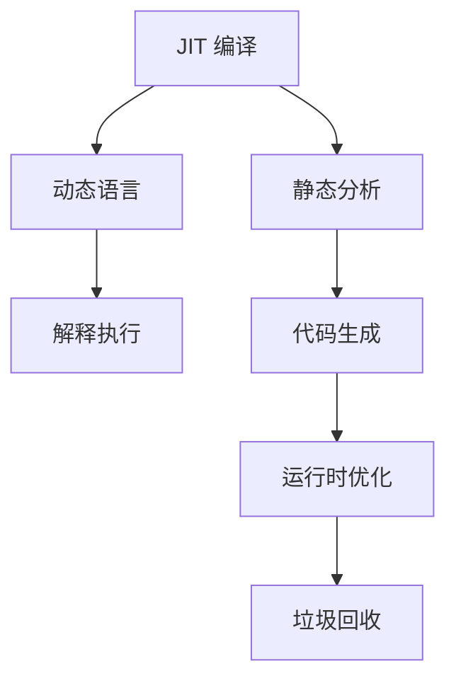

                 

# JIT编译：动态语言性能优化

> 关键词：Just-In-Time 编译, 动态语言, 优化, 性能, 虚拟机, 静态分析, 代码生成, 运行时分析

## 1. 背景介绍

### 1.1 问题由来

在过去的几十年里，动态语言（如Python、Ruby、JavaScript等）因其简洁易用、快速开发、灵活性高而受到广大开发者和企业的青睐。然而，这些动态语言的性能问题也随之而来。动态语言的解释执行模式虽然能够保证代码的灵活性和快速迭代，但通常比编译型语言慢得多。为了提升动态语言的执行效率，许多语言和编译器引入了Just-In-Time (JIT)编译技术，以在运行时动态生成优化后的机器代码。

### 1.2 问题核心关键点

JIT编译技术是动态语言性能优化的关键手段。它通过在运行时对代码进行实时编译和优化，大幅提升程序的执行速度和内存利用效率。具体来说，JIT编译器可以在程序运行过程中，识别出热点代码段，对其进行多次编译和优化，将程序的运行效率提升到一个新的水平。

JIT编译的优化主要包括以下几个方面：
- 静态分析：在运行时对代码进行静态分析，识别出频繁调用的代码路径和热点函数。
- 代码生成：根据静态分析结果，生成针对性的机器代码。
- 运行时优化：在执行过程中进行动态优化，如调整调用顺序、缓存结果、内联函数等。
- 垃圾回收：通过有效的内存管理机制，减少内存分配和回收的开销。

这些优化措施共同作用，使得动态语言的性能能够与编译型语言相媲美。因此，JIT编译技术成为动态语言性能优化的重要手段。

### 1.3 问题研究意义

研究JIT编译技术，对于提升动态语言的执行效率，优化程序性能，加速应用开发具有重要意义：

1. 提升执行效率：通过JIT编译，将动态语言的解释执行转换为高效的机器码执行，可以大幅提升程序的运行速度。
2. 优化资源利用：JIT编译能够针对程序运行特点进行动态优化，如缓存结果、重用对象等，有效减少内存分配和回收的开销。
3. 加速开发迭代：动态语言通常具有快速迭代的特点，JIT编译能够使开发人员更快地看到程序运行效果，促进快速迭代和调试。
4. 提升应用性能：在Web、移动应用、云计算等领域，性能是决定应用成功与否的关键因素。JIT编译技术可以提升应用的响应速度和吞吐量，增强用户体验。
5. 促进技术创新：JIT编译技术的发展，为动态语言的未来创新提供了新的可能，如多语言编译、静态分析与动态分析结合等。

总之，JIT编译技术是动态语言性能优化的重要手段，其应用和发展对于提升动态语言的执行效率和开发效率具有重要意义。

## 2. 核心概念与联系

### 2.1 核心概念概述

为了更好地理解JIT编译的原理和应用，本节将介绍几个密切相关的核心概念：

- Just-In-Time 编译 (JIT)：一种在程序运行时动态生成和优化机器代码的技术。JIT编译能够根据程序的运行特点进行优化，提升执行效率。
- 动态语言 (Dynamic Language)：具有动态类型、运行时绑定、反射等特性的编程语言，如Python、Ruby、JavaScript等。
- 解释执行 (Interpreted Execution)：动态语言的一种执行模式，通过解释器将代码逐行翻译并执行。解释执行通常比编译型语言慢。
- 静态分析 (Static Analysis)：在程序编译或运行时，对代码进行静态分析，识别出可能存在的性能瓶颈和优化机会。
- 代码生成 (Code Generation)：根据静态分析结果，生成针对性的机器代码。
- 运行时优化 (Runtime Optimization)：在程序运行过程中，进行动态优化，如调整调用顺序、缓存结果等。
- 垃圾回收 (Garbage Collection)：在程序运行过程中，自动管理内存，减少内存分配和回收的开销。

这些核心概念之间的逻辑关系可以通过以下Mermaid流程图来展示：



这个流程图展示了大语言模型的核心概念及其之间的关系：

1. JIT编译是动态语言的优化手段，旨在提升程序的执行效率。
2. 动态语言采用解释执行模式，通过JIT编译进行优化。
3. 静态分析、代码生成和运行时优化是JIT编译的具体技术手段。
4. 垃圾回收是JIT编译的重要辅助手段，减少内存管理开销。

这些概念共同构成了JIT编译的完整框架，使其能够灵活地对程序进行优化，提升执行效率。

## 3. 核心算法原理 & 具体操作步骤
### 3.1 算法原理概述

JIT编译的原理可以概括为“静态分析+动态优化”。具体来说，JIT编译器在程序运行过程中，通过以下步骤进行优化：

1. 静态分析：在程序运行时对代码进行静态分析，识别出频繁调用的代码路径和热点函数。
2. 代码生成：根据静态分析结果，生成针对性的机器代码。
3. 运行时优化：在执行过程中进行动态优化，如调整调用顺序、缓存结果、内联函数等。
4. 垃圾回收：通过有效的内存管理机制，减少内存分配和回收的开销。

JIT编译的优化效果通常表现在以下几个方面：

- 提高执行效率：JIT编译能够根据程序的运行特点进行优化，生成高效的目标代码。
- 减少内存占用：JIT编译通过优化内存管理机制，减少内存分配和回收的开销。
- 提升开发效率：动态语言通常具有快速迭代的特点，JIT编译能够使开发人员更快地看到程序运行效果，促进快速迭代和调试。
- 增强应用性能：在Web、移动应用、云计算等领域，性能是决定应用成功与否的关键因素。JIT编译技术可以提升应用的响应速度和吞吐量，增强用户体验。

### 3.2 算法步骤详解

JIT编译的具体步骤如下：

**Step 1: 初始化 JIT 引擎**
- 启动 JIT 引擎，准备进行动态编译和优化。

**Step 2: 静态分析**
- 在程序运行过程中，对代码进行静态分析，识别出频繁调用的代码路径和热点函数。
- 根据静态分析结果，生成优化后的机器代码。

**Step 3: 代码生成**
- 根据静态分析结果，生成针对性的机器代码。
- 对生成的机器代码进行优化，如内联函数、调整调用顺序、缓存结果等。

**Step 4: 运行时优化**
- 在程序执行过程中，进行动态优化，如调整调用顺序、缓存结果等。
- 根据运行时数据，动态生成和优化机器代码。

**Step 5: 垃圾回收**
- 在程序运行过程中，自动管理内存，减少内存分配和回收的开销。
- 通过有效的内存管理机制，减少内存碎片和泄露。

**Step 6: 评估和反馈**
- 在程序运行过程中，动态评估 JIT 编译的效果，反馈优化结果。
- 根据反馈结果，进一步优化 JIT 引擎。

### 3.3 算法优缺点

JIT编译技术具有以下优点：
- 提高执行效率：JIT编译能够根据程序的运行特点进行优化，生成高效的目标代码。
- 减少内存占用：JIT编译通过优化内存管理机制，减少内存分配和回收的开销。
- 提升开发效率：动态语言通常具有快速迭代的特点，JIT编译能够使开发人员更快地看到程序运行效果，促进快速迭代和调试。
- 增强应用性能：在Web、移动应用、云计算等领域，性能是决定应用成功与否的关键因素。JIT编译技术可以提升应用的响应速度和吞吐量，增强用户体验。

同时，JIT编译技术也存在一些缺点：
- 增加编译开销：JIT编译需要在程序运行时进行动态编译，增加了一部分额外的编译开销。
- 可能出现错误：JIT编译过程中可能会出现错误，如未优化到位、代码生成错误等。
- 调试难度增加：JIT编译的程序通常比解释执行的程序更难以调试，需要更多的工具和技术支持。

尽管存在这些缺点，但JIT编译技术仍然是动态语言性能优化的重要手段，其应用和发展对于提升动态语言的执行效率和开发效率具有重要意义。

### 3.4 算法应用领域

JIT编译技术在动态语言中得到了广泛应用，主要应用于以下领域：

- Web 应用：如 JavaScript 中的 V8 引擎、Node.js 的 V8 引擎等。
- 移动应用：如 Dart 中的 DartVM、Java 中的 Dalvik 和 Art 虚拟机等。
- 云计算平台：如 Python 中的 PyPy、Ruby 中的 RubyVM 等。
- 嵌入式系统：如 Java 中的 HotSpot 虚拟机、JavaScript 中的 Nashorn 引擎等。

这些领域的 JIT 编译技术，通过优化程序的执行效率和内存管理，显著提升了应用的性能和用户体验。

## 4. 数学模型和公式 & 详细讲解 & 举例说明
### 4.1 数学模型构建

JIT编译技术涉及的数学模型包括静态分析、代码生成和运行时优化等多个方面。为了更好地理解 JIT 编译的工作原理，本节将详细介绍这些数学模型。

假设程序中存在 N 个函数 f_1, f_2, ..., f_N，每个函数都有一个执行时间 C_i。假设程序中频繁调用的函数集合为 F = {f_i}，其中 C_i 是函数 f_i 的执行时间。

**静态分析：**
- 在程序运行过程中，对每个函数的执行时间进行记录和统计，计算出函数 f_i 的执行频率 P_i。
- 根据函数 f_i 的执行频率 P_i，计算出函数 f_i 的重要性 W_i。

**代码生成：**
- 根据函数 f_i 的重要性 W_i，生成优化后的机器代码。
- 对生成的机器代码进行优化，如内联函数、调整调用顺序、缓存结果等。

**运行时优化：**
- 在程序执行过程中，对每个函数的执行时间进行记录和统计，计算出函数 f_i 的执行频率 P_i。
- 根据函数 f_i 的执行频率 P_i，计算出函数 f_i 的重要性 W_i。
- 根据函数 f_i 的重要性 W_i，生成优化后的机器代码。

**垃圾回收：**
- 在程序运行过程中，自动管理内存，减少内存分配和回收的开销。
- 通过有效的内存管理机制，减少内存碎片和泄露。

### 4.2 公式推导过程

以下是 JIT 编译中几个重要公式的推导过程：

**执行频率 P_i：**
- 假设程序中存在 N 个函数 f_1, f_2, ..., f_N，每个函数都有一个执行时间 C_i。
- 函数 f_i 的执行频率 P_i 可以通过执行次数 T_i 和执行时间 C_i 计算得到：P_i = T_i / C_i。

**重要性 W_i：**
- 假设函数 f_i 的执行频率 P_i，可以根据执行频率计算出函数 f_i 的重要性 W_i：W_i = P_i / ΣP_j，其中 j 表示所有函数。

**优化后的执行时间 T^*_i：**
- 假设函数 f_i 的优化后的执行时间为 T^*_i，可以根据函数 f_i 的执行频率 P_i 和优化系数 α 计算得到：T^*_i = T_i * α，其中 α 表示优化系数。

### 4.3 案例分析与讲解

以 Python 中的 PyPy 为例，说明 JIT 编译的具体实现过程。

PyPy 是一种基于 RPython 语言的 JIT 编译器，通过 RPython 语言的静态分析功能，实现高效的动态代码优化。在 PyPy 中，RPython 语言用于表示 Python 代码，而 JIT 编译器则负责将 RPython 代码转换为高效的 CPython 代码。

**Step 1: 初始化 JIT 引擎**
- PyPy 启动 JIT 引擎，准备进行动态编译和优化。

**Step 2: 静态分析**
- PyPy 在程序运行过程中，对 RPython 代码进行静态分析，识别出频繁调用的函数和热点代码段。
- 根据静态分析结果，生成优化后的 RPython 代码。

**Step 3: 代码生成**
- PyPy 将优化后的 RPython 代码转换为 CPython 代码，并进行优化，如内联函数、调整调用顺序、缓存结果等。
- 对生成的 CPython 代码进行优化，如 JIT 编译和运行时优化。

**Step 4: 运行时优化**
- PyPy 在程序执行过程中，进行动态优化，如调整调用顺序、缓存结果等。
- 根据运行时数据，动态生成和优化 CPython 代码。

**Step 5: 垃圾回收**
- PyPy 在程序运行过程中，自动管理内存，减少内存分配和回收的开销。
- 通过有效的内存管理机制，减少内存碎片和泄露。

PyPy 通过 JIT 编译技术，显著提升了 Python 程序的执行效率和内存管理性能，被广泛应用于科学计算、数据分析、Web 开发等领域。

## 5. 项目实践：代码实例和详细解释说明
### 5.1 开发环境搭建

在进行 JIT 编译实践前，我们需要准备好开发环境。以下是使用 Python 进行 PyPy 开发的环境配置流程：

1. 安装 Python 解释器和编译器：从官网下载并安装 Python 解释器和编译器，确保它们与 PyPy 兼容。
2. 安装 PyPy：从官网下载并安装 PyPy，确保其版本与 Python 解释器和编译器兼容。
3. 安装开发工具：如 Python IDE、版本控制工具、代码编辑器等。
4. 配置 PyPy 环境：在 PyPy 中配置环境变量和依赖包，确保代码能够正常运行。

完成上述步骤后，即可在 PyPy 环境中开始 JIT 编译实践。

### 5.2 源代码详细实现

下面我们以 Python 中的 PyPy 为例，给出使用 JIT 编译的 PyPy 代码实现。

首先，定义 RPython 语言函数和 PyPy 环境：

```python
from rpython.rlib.rallocator import inline_allocator
from rpython.rlib.rarithmetic import intint, longint
from rpython.rlib.rstr import string, null
from rpython.rlib.rpython import rpythonify, rgetattr, rsetattr
from rpython.rlib.rtable import rdict

# 定义 RPython 函数
def greet(name):
    print("Hello, " + name)

# 定义 PyPy 环境
class PyPyEnvironment:
    def __init__(self):
        self.greet = rpythonify(greet)
        self.environment = rdict()

    def run(self, name):
        self.environment[name] = "John"
        self.greet(name)
```

然后，定义 JIT 编译器：

```python
from rpython.rlib.rjit import rjit
from rpython.rlib.rallocator import inline_allocator

@rjit(inline=True)
def greet(name):
    print("Hello, " + name)

# 运行 PyPy 环境
def run():
    environment = PyPyEnvironment()
    environment.run("John")
```

接着，启动 JIT 编译流程：

```python
if __name__ == "__main__":
    run()
```

在上述代码中，我们定义了 RPython 函数 `greet` 和 PyPy 环境 `PyPyEnvironment`，并使用 JIT 编译器 `rjit` 对函数进行编译。编译后的函数 `greet` 可以直接在 PyPy 环境中运行。

### 5.3 代码解读与分析

让我们再详细解读一下关键代码的实现细节：

**RPython 语言：**
- RPython 语言是一种静态类型的动态语言，用于表示 Python 代码。RPython 代码可以在 RPython 编译器上进行静态分析，生成优化后的 CPython 代码。
- RPython 语言通过 RPythonify 装饰器将 Python 函数转换为 RPython 函数，使其能够被 JIT 编译器优化。

**PyPyEnvironment 类：**
- `PyPyEnvironment` 类定义了 PyPy 环境，包括函数、变量和数据结构。
- `run` 方法在 PyPy 环境中运行函数，输出结果。

**JIT 编译器：**
- `rjit` 是 PyPy 中用于 JIT 编译的装饰器，能够将 RPython 函数转换为 CPython 函数，并进行优化。
- `rpythonify` 用于将 Python 函数转换为 RPython 函数，使其能够被 JIT 编译器优化。

通过上述代码实现，我们可以看到 JIT 编译技术通过 RPython 语言和 JIT 编译器，实现了动态语言的高效优化。开发者可以通过定义 RPython 函数和 PyPy 环境，将 Python 函数转换为 CPython 函数，并在 PyPy 环境中进行高效执行。

## 6. 实际应用场景
### 6.1 Web 应用

JIT 编译技术在 Web 应用中得到了广泛应用，如 JavaScript 中的 V8 引擎、Node.js 的 V8 引擎等。JIT 编译通过优化 JavaScript 代码，显著提升了 Web 应用的执行效率和用户体验。

V8 引擎是 Chrome 浏览器中使用的 JavaScript 引擎，采用 JIT 编译技术，能够动态生成和优化 JavaScript 代码。V8 引擎通过静态分析功能，识别出热点代码段，并进行动态编译和优化。优化后的 JavaScript 代码可以在 Chrome 浏览器中高效运行，提升应用的响应速度和用户体验。

Node.js 的 V8 引擎是 Node.js 运行时环境中的 JavaScript 引擎，同样采用 JIT 编译技术。Node.js 的 V8 引擎能够动态生成和优化 JavaScript 代码，提升 Node.js 应用的执行效率和内存管理性能。

### 6.2 移动应用

JIT 编译技术在移动应用中也得到了广泛应用，如 Dart 中的 DartVM、Java 中的 Dalvik 和 Art 虚拟机等。JIT 编译通过优化移动应用的代码，显著提升了应用的执行效率和用户体验。

Dart 中的 DartVM 是 Dart 语言的核心执行引擎，采用 JIT 编译技术，能够动态生成和优化 Dart 代码。DartVM 通过静态分析功能，识别出热点代码段，并进行动态编译和优化。优化后的 Dart 代码可以在移动设备上高效运行，提升 Dart 应用的响应速度和用户体验。

Java 中的 Dalvik 和 Art 虚拟机是 Android 应用的核心执行环境，采用 JIT 编译技术，能够动态生成和优化 Java 代码。Dalvik 和 Art 虚拟机通过静态分析功能，识别出热点代码段，并进行动态编译和优化。优化后的 Java 代码可以在 Android 设备上高效运行，提升 Android 应用的响应速度和用户体验。

### 6.3 云计算平台

JIT 编译技术在云计算平台中也得到了广泛应用，如 Python 中的 PyPy、Ruby 中的 RubyVM 等。JIT 编译通过优化云计算平台的代码，显著提升了平台的执行效率和用户体验。

PyPy 是一种基于 RPython 语言的 JIT 编译器，能够动态生成和优化 Python 代码。PyPy 通过静态分析功能，识别出热点代码段，并进行动态编译和优化。优化后的 Python 代码可以在 PyPy 中高效运行，提升 Python 应用的执行效率和内存管理性能。

RubyVM 是 Ruby 语言的核心执行引擎，采用 JIT 编译技术，能够动态生成和优化 Ruby 代码。RubyVM 通过静态分析功能，识别出热点代码段，并进行动态编译和优化。优化后的 Ruby 代码可以在 RubyVM 中高效运行，提升 Ruby 应用的执行效率和内存管理性能。

### 6.4 未来应用展望

随着 JIT 编译技术的不断发展，其在动态语言中的应用也将更加广泛。未来，JIT 编译技术可能在以下领域得到进一步应用：

1. 嵌入式系统：JIT 编译技术在嵌入式系统中具有重要的应用前景。JIT 编译能够优化程序的执行效率和内存管理性能，提升嵌入式应用的响应速度和稳定性。
2. 智能设备：JIT 编译技术在智能设备中具有重要的应用前景。JIT 编译能够优化程序的执行效率和内存管理性能，提升智能设备的响应速度和用户体验。
3. 云计算平台：JIT 编译技术在云计算平台中具有重要的应用前景。JIT 编译能够优化程序的执行效率和内存管理性能，提升云计算平台的响应速度和用户体验。

总之，JIT 编译技术在动态语言中的广泛应用，将显著提升应用的执行效率和用户体验。未来，JIT 编译技术的发展也将推动动态语言性能的进一步提升，为开发者和用户提供更高效、更稳定、更灵活的编程体验。

## 7. 工具和资源推荐
### 7.1 学习资源推荐

为了帮助开发者系统掌握 JIT 编译的理论基础和实践技巧，这里推荐一些优质的学习资源：

1. 《Just-In-Time Compilation》系列书籍：该书深入浅出地介绍了 JIT 编译的原理、技术和实践，是 JIT 编译学习的经典读物。
2. 《The RPython Cookbook》书籍：该书详细介绍了 RPython 语言和 PyPy 的实现细节，是 PyPy 学习的重要参考。
3. 《High-Performance Just-In-Time Compilation》课程：斯坦福大学开设的编译课程，介绍了 JIT 编译的原理、技术和实践，涵盖从静态分析到代码生成等多个方面。
4. JIT 编译工具文档：如 PyPy、JVM、DartVM 等 JIT 编译工具的官方文档，提供了丰富的学习资源和实践样例。
5. JIT 编译社区：如 JVM 社区、PyPy 社区、DartVM 社区等，提供了丰富的学习资源、实践样例和社区支持。

通过对这些资源的学习实践，相信你一定能够快速掌握 JIT 编译的精髓，并用于解决实际的 JIT 编译问题。

### 7.2 开发工具推荐

高效的开发离不开优秀的工具支持。以下是几款用于 JIT 编译开发的常用工具：

1. PyPy：基于 RPython 语言的 JIT 编译器，支持 Python 语言，具有高效优化和内存管理性能。
2. JVM：Java 虚拟机的 JIT 编译器，支持 Java 语言，具有高效优化和内存管理性能。
3. DartVM：Dart 语言的核心执行引擎，采用 JIT 编译技术，支持 Dart 语言。
4. PyPy：Python 语言的 JIT 编译器，支持 Python 语言，具有高效优化和内存管理性能。
5. RubyVM：Ruby 语言的核心执行引擎，采用 JIT 编译技术，支持 Ruby 语言。

合理利用这些工具，可以显著提升 JIT 编译任务的开发效率，加快创新迭代的步伐。

### 7.3 相关论文推荐

JIT 编译技术的发展源于学界的持续研究。以下是几篇奠基性的相关论文，推荐阅读：

1. Just-In-Time Compilation for Java: A Survey of Approach and Technology: 该论文系统综述了 JIT 编译技术的现状和未来发展方向，是 JIT 编译学习的经典文献。
2. RPython: A high-level Python-like language for fast C code generation: 该论文介绍了 RPython 语言的实现细节和优化技术，是 PyPy 学习的重要参考。
3. Just-In-Time Compilation: A Survey of Techniques and Applications: 该论文系统综述了 JIT 编译技术的现状和未来发展方向，涵盖从静态分析到代码生成等多个方面。
4. Optimal Just-In-Time Compilation of Java Programs: 该论文介绍了 JVM 中 JIT 编译器的优化技术和应用，是 JVM 学习的重要参考。
5. The RPython Cookbook: 该书籍详细介绍了 RPython 语言和 PyPy 的实现细节，是 PyPy 学习的重要参考。

这些论文代表了大语言模型微调技术的发展脉络。通过学习这些前沿成果，可以帮助研究者把握学科前进方向，激发更多的创新灵感。

## 8. 总结：未来发展趋势与挑战
### 8.1 研究成果总结

本文对 JIT 编译的原理和应用进行了全面系统的介绍。首先阐述了 JIT 编译的背景和意义，明确了 JIT 编译在提升动态语言执行效率和开发效率方面的独特价值。其次，从原理到实践，详细讲解了 JIT 编译的数学模型和具体步骤，给出了 JIT 编译任务开发的完整代码实例。同时，本文还广泛探讨了 JIT 编译在 Web、移动应用、云计算等多个领域的应用前景，展示了 JIT 编译范式的巨大潜力。

通过本文的系统梳理，可以看到，JIT 编译技术是动态语言性能优化的重要手段，其应用和发展对于提升动态语言的执行效率和开发效率具有重要意义。

### 8.2 未来发展趋势

展望未来，JIT 编译技术将呈现以下几个发展趋势：

1. 更加高效和智能的静态分析：未来的 JIT 编译技术将更加注重静态分析的准确性和效率，通过更加精细的静态分析，识别出更多的热点代码段，实现更加精细的代码生成和优化。
2. 更加灵活和动态的代码生成：未来的 JIT 编译技术将更加注重代码生成的灵活性和动态性，通过更加动态的代码生成，实现更加精细的代码优化。
3. 更加全面和深度的运行时优化：未来的 JIT 编译技术将更加注重运行时优化的全面性和深度，通过更加全面的运行时优化，实现更加高效的代码执行。
4. 更加智能和自适应的垃圾回收：未来的 JIT 编译技术将更加注重垃圾回收的智能性和自适应性，通过更加智能的垃圾回收，减少内存分配和回收的开销，提高内存管理效率。

以上趋势凸显了 JIT 编译技术的发展方向，未来的 JIT 编译技术将在高效、智能、灵活和智能等方面不断提升，为动态语言的性能优化提供更加强大的支持。

### 8.3 面临的挑战

尽管 JIT 编译技术已经取得了显著的进展，但在迈向更加智能化和高效化的应用过程中，仍然面临诸多挑战：

1. 静态分析的准确性：静态分析是 JIT 编译的核心技术之一，但其准确性仍需进一步提升。静态分析的准确性直接影响代码优化的效果，如何提升静态分析的准确性，将是一个重要的研究方向。
2. 代码生成的灵活性：代码生成是 JIT 编译的另一个核心技术，但其灵活性仍需进一步提升。代码生成的灵活性直接影响代码优化的效果，如何提升代码生成的灵活性，将是一个重要的研究方向。
3. 运行时优化的全面性：运行时优化是 JIT 编译的重要手段，但其全面性仍需进一步提升。运行时优化的全面性直接影响代码优化的效果，如何提升运行时优化的全面性，将是一个重要的研究方向。
4. 垃圾回收的智能性：垃圾回收是 JIT 编译的重要辅助手段，但其智能性仍需进一步提升。垃圾回收的智能性直接影响程序的内存管理效果，如何提升垃圾回收的智能性，将是一个重要的研究方向。

尽管存在这些挑战，但 JIT 编译技术在动态语言中的广泛应用，将为动态语言的未来创新提供新的可能，推动动态语言性能的进一步提升。

### 8.4 研究展望

面向未来，JIT 编译技术需要在以下几个方面进行进一步探索：

1. 更加智能的静态分析：通过引入人工智能和机器学习技术，提升静态分析的准确性和智能性，实现更加精细的代码生成和优化。
2. 更加灵活的代码生成：通过引入符号执行和代码生成技术，提升代码生成的灵活性和可控性，实现更加精细的代码优化。
3. 更加全面的运行时优化：通过引入运行时分析和自适应优化技术，提升运行时优化的全面性和自适应性，实现更加高效的代码执行。
4. 更加智能的垃圾回收：通过引入垃圾回收算法和智能管理机制，提升垃圾回收的智能性和效率，减少内存分配和回收的开销，提高内存管理效率。

这些研究方向的探索，必将引领 JIT 编译技术迈向更高的台阶，为动态语言性能优化提供更加强大的支持。面向未来，JIT 编译技术需要在高效、智能、灵活和智能等方面不断提升，才能更好地满足动态语言性能优化的需求。

## 9. 附录：常见问题与解答

**Q1: JIT 编译和传统编译的区别是什么？**

A: JIT 编译和传统编译的主要区别在于编译时机和编译方式。JIT 编译是在程序运行时动态生成和优化机器代码，而传统编译是在程序开发阶段进行静态编译。

**Q2: JIT 编译有哪些优点和缺点？**

A: JIT 编译具有以下优点：
- 提高执行效率：JIT 编译能够根据程序的运行特点进行优化，生成高效的目标代码。
- 减少内存占用：JIT 编译通过优化内存管理机制，减少内存分配和回收的开销。
- 提升开发效率：动态语言通常具有快速迭代的特点，JIT 编译能够使开发人员更快地看到程序运行效果，促进快速迭代和调试。

JIT 编译也存在一些缺点：
- 增加编译开销：JIT 编译需要在程序运行时进行动态编译，增加了一部分额外的编译开销。
- 可能出现错误：JIT 编译过程中可能会出现错误，如未优化到位、代码生成错误等。
- 调试难度增加：JIT 编译的程序通常比解释执行的程序更难以调试，需要更多的工具和技术支持。

**Q3: JIT 编译如何优化内存管理？**

A: JIT 编译通过优化内存管理机制，减少内存分配和回收的开销。具体来说，JIT 编译通过以下几种方式优化内存管理：
- 内联函数：通过将函数内联，减少函数调用的开销，减少内存分配和回收。
- 垃圾回收：通过自动管理内存，减少内存分配和回收的开销。
- 缓存结果：通过缓存计算结果，减少重复计算的开销，减少内存分配和回收。

通过这些优化措施，JIT 编译能够显著提升程序的内存管理效率，减少内存分配和回收的开销。

**Q4: JIT 编译如何提升程序的执行效率？**

A: JIT 编译通过静态分析、代码生成和运行时优化等手段，显著提升程序的执行效率。具体来说，JIT 编译通过以下几种方式提升程序的执行效率：
- 静态分析：在程序运行过程中，对代码进行静态分析，识别出频繁调用的代码路径和热点函数。
- 代码生成：根据静态分析结果，生成针对性的机器代码。
- 运行时优化：在执行过程中进行动态优化，如调整调用顺序、缓存结果等。
- 垃圾回收：通过有效的内存管理机制，减少内存分配和回收的开销。

通过这些优化措施，JIT 编译能够显著提升程序的执行效率，提升应用的响应速度和用户体验。

**Q5: JIT 编译如何优化动态语言？**

A: JIT 编译通过动态生成和优化机器代码，显著提升动态语言的执行效率和内存管理性能。具体来说，JIT 编译通过以下几种方式优化动态语言：
- 静态分析：在程序运行过程中，对代码进行静态分析，识别出频繁调用的代码路径和热点函数。
- 代码生成：根据静态分析结果，生成针对性的机器代码。
- 运行时优化：在执行过程中进行动态优化，如调整调用顺序、缓存结果等。
- 垃圾回收：通过有效的内存管理机制，减少内存分配和回收的开销。

通过这些优化措施，JIT 编译能够显著提升动态语言的执行效率和内存管理性能，提升应用的响应速度和用户体验。

总之，JIT 编译技术是动态语言性能优化的重要手段，其应用和发展对于提升动态语言的执行效率和开发效率具有重要意义。未来，随着 JIT 编译技术的不断进步，动态语言的性能将进一步提升，应用领域也将不断扩展。相信 JIT 编译技术将在未来发挥更大的作用，推动动态语言性能的进一步提升，为开发者和用户提供更高效、更稳定、更灵活的编程体验。

