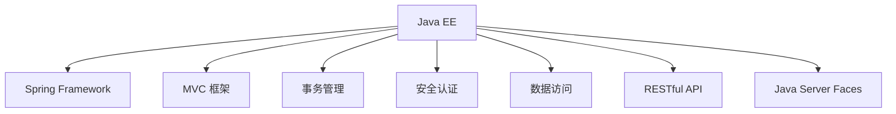

                 

# Java 企业级开发：Spring Framework 和 Java EE

> 关键词：Java EE, Spring Framework, 企业级开发, MVC 框架, 事务管理, 安全认证, 数据访问, RESTful API, Java Server Faces

## 1. 背景介绍

### 1.1 问题由来
随着Java平台的不断发展和成熟，Java EE和Spring Framework成为了企业级开发的两大基石。Java EE提供了一系列规范和标准，定义了企业应用的基本架构，包括组件模型、容器管理、事务处理、安全认证、数据访问等。而Spring Framework则是一个开源的MVC框架，提供了丰富的工具和库，支持企业级应用开发的各种需求，包括面向切面编程、依赖注入、事务管理、数据访问、安全认证等。

随着微服务架构的兴起和分布式系统的发展，Java EE和Spring Framework在企业级开发中的地位更加凸显。本文旨在深入探讨Spring Framework和Java EE的核心概念、原理和架构，并结合实际案例，展示它们在企业级开发中的应用和优势。

## 2. 核心概念与联系

### 2.1 核心概念概述

为更好地理解Spring Framework和Java EE，本节将介绍几个密切相关的核心概念：

- Java EE：Enterprise Edition，Java平台的企业级标准，提供了一系列规范和组件，用于构建大规模、分布式、高可靠的企业应用。
- Spring Framework：一个开源的MVC框架，提供了一整套企业级应用开发工具和库，包括Spring Core、Spring MVC、Spring Data、Spring Security等模块。
- MVC 框架：Model-View-Controller，一种设计模式，将应用分为模型、视图和控制器三个部分，用于构建用户界面、处理用户输入和业务逻辑的分离。
- 事务管理：控制事务的提交、回滚等操作，保证数据一致性和完整性。
- 安全认证：保护应用免受未经授权的访问，通过加密、认证和授权等手段，确保系统的安全性。
- 数据访问：提供数据持久化和管理的功能，包括CRUD操作、数据缓存和数据备份等。
- RESTful API：一种基于HTTP协议的轻量级、无状态、可缓存的Web服务架构，用于构建可伸缩的Web应用。
- Java Server Faces（JSF）：一种Java Web组件模型和视图组件框架，用于快速开发Web用户界面。

这些核心概念之间的逻辑关系可以通过以下Mermaid流程图来展示：



这个流程图展示了大语言模型的核心概念及其之间的关系：

1. Java EE提供了企业应用的基本规范和组件，是企业级开发的基础。
2. Spring Framework则是一个开源的MVC框架，基于Java EE规范实现，提供了丰富的工具和库。
3. MVC 框架、事务管理、安全认证、数据访问、RESTful API、Java Server Faces等都是Spring Framework提供的具体功能模块。

这些核心概念共同构成了Java平台在企业级应用开发中的重要基础，使得开发人员可以基于它们快速构建高效、可伸缩、安全的应用系统。

## 3. 核心算法原理 & 具体操作步骤
### 3.1 算法原理概述

Spring Framework和Java EE的核心算法原理主要涉及以下几个方面：

- 组件模型：定义了组件的生命周期、依赖关系和配置等。
- 事务管理：通过配置和编程方式，控制事务的提交和回滚，保证数据一致性。
- 安全认证：通过用户名密码、OAuth2等认证方式，保护应用的安全性。
- 数据访问：通过JPA、JDBC等提供的数据持久化层，实现数据的增删改查。
- RESTful API：基于HTTP协议，提供轻量级、无状态的Web服务，支持异步和分布式系统。

这些算法原理构成了Java平台在企业级应用开发中的核心技术架构，使得开发者可以灵活地组合和配置，实现各种需求。

### 3.2 算法步骤详解

Spring Framework和Java EE的核心算法步骤包括以下几个关键步骤：

**Step 1: 配置Spring Boot应用**

```java
@SpringBootApplication
public class MyApplication {
    public static void main(String[] args) {
        SpringApplication.run(MyApplication.class, args);
    }
}
```

**Step 2: 定义Spring MVC控制器**

```java
@RestController
public class MyController {
    @GetMapping("/hello")
    public String sayHello() {
        return "Hello, Spring!";
    }
}
```

**Step 3: 实现Spring MVC视图**

```xml
<!DOCTYPE html>
<html>
<head>
    <title>Hello, Spring!</title>
</head>
<body>
    <h1>${message}</h1>
</body>
</html>
```

**Step 4: 定义Spring Data JPA repository**

```java
@Repository
public interface MyRepository extends JpaRepository<User, Long> {
    User findByUsername(String username);
}
```

**Step 5: 实现Spring Security认证**

```java
@Configuration
@EnableWebSecurity
public class SecurityConfig extends WebSecurityConfigurerAdapter {
    @Autowired
    private UserDetailsService userDetailsService;

    @Autowired
    private PasswordEncoder passwordEncoder;

    @Override
    protected void configure(HttpSecurity http) throws Exception {
        http
            .authorizeRequests()
                .antMatchers("/public/**").permitAll()
                .anyRequest().authenticated()
                .and()
            .formLogin()
                .loginPage("/login")
                .permitAll()
                .and()
            .logout()
                .permitAll();
    }

    @Override
    protected void configure(AuthenticationManagerBuilder auth) throws Exception {
        auth.userDetailsService(userDetailsService).passwordEncoder(passwordEncoder);
    }
}
```

**Step 6: 配置Spring Boot数据库连接**

```application.properties
spring.datasource.url=jdbc:mysql://localhost/mydb
spring.datasource.username=root
spring.datasource.password=password
spring.datasource.driver-class-name=com.mysql.cj.jdbc.Driver
```

**Step 7: 运行Spring Boot应用**

```bash
java -jar target/my-application.jar
```

完成上述步骤后，即可在本地启动Spring Boot应用。

### 3.3 算法优缺点

Spring Framework和Java EE在企业级开发中具有以下优点：

- 强大的组件模型和丰富的工具库，支持开发各种类型的企业应用。
- 灵活的配置和插件机制，支持组件的组合和扩展。
- 先进的事务管理、安全认证、数据访问和RESTful API支持，保证了应用的高可用性和安全性。

同时，这些技术也存在一定的局限性：

- 学习曲线较陡，需要理解复杂的组件模型和配置。
- 性能开销较大，尤其是Spring Boot在启动和部署时的开销。
- 组件的灵活性可能导致系统复杂度增加，维护难度大。

尽管存在这些局限性，但就目前而言，Spring Framework和Java EE仍然是企业级开发的主流技术。未来相关研究的重点在于如何进一步降低学习成本，提高系统性能，同时兼顾可扩展性和维护性。

### 3.4 算法应用领域

Spring Framework和Java EE在企业级开发中广泛应用，覆盖了几乎所有常见场景，例如：

- Web应用开发：使用Spring MVC和JSF快速构建Web用户界面。
- RESTful API开发：基于Spring Boot和Spring MVC，构建轻量级、可伸缩的Web服务。
- 企业服务总线（ESB）：使用JMS、RESTful API等，构建分布式系统中的消息传递和业务集成。
- 微服务架构：使用Spring Cloud和Spring Boot，构建可伸缩、高可靠、低耦合的微服务系统。
- 数据管理和访问：使用Spring Data和JPA，实现数据持久化和访问。
- 安全认证和授权：使用Spring Security，保护应用免受未经授权的访问。
- 事务管理和隔离：使用Spring的事务管理功能，保证数据一致性和隔离性。
- 消息传递和队列：使用JMS和ActiveMQ，构建消息传递和队列系统。

除了上述这些经典场景外，Spring Framework和Java EE还被创新性地应用到更多场景中，如企业级移动应用、物联网、区块链等，为企业级应用开发提供了新的方向。

## 4. 数学模型和公式 & 详细讲解  
### 4.1 数学模型构建

本节将使用数学语言对Spring Framework和Java EE的核心算法进行更加严格的刻画。

假设Spring Framework和Java EE应用程序为 $S$，其中 $S$ 是一个复杂的对象模型，包括多个组件、配置和库。其核心算法可以表示为：

$$
S = C_{Spring\_MVC} \times C_{Security} \times C_{Data\_Access} \times C_{RESTful\_API} \times C_{Spring\_Boot}
$$

其中 $C_{Spring\_MVC}$、$C_{Security}$、$C_{Data\_Access}$、$C_{RESTful\_API}$、$C_{Spring\_Boot}$ 分别表示Spring MVC、安全认证、数据访问、RESTful API和Spring Boot的组件。

### 4.2 公式推导过程

以下我们以Spring Security认证过程为例，推导认证和授权的数学模型。

假设认证和授权模型为 $M_{Auth}$，用户输入的用户名和密码为 $u$、$p$，验证用户身份的过程可以表示为：

$$
M_{Auth}(u,p) = \begin{cases}
Success, & \text{如果 } u \text{ 和 } p \text{ 匹配} \\
Fail, & \text{否则}
\end{cases}
$$

其中 $Success$ 表示认证成功，$Fail$ 表示认证失败。

用户认证流程可以表示为：

1. 用户输入用户名和密码，系统调用 $M_{Auth}$ 进行验证。
2. 如果 $M_{Auth}$ 返回 $Success$，则用户通过认证，系统进行下一步操作。
3. 如果 $M_{Auth}$ 返回 $Fail$，则用户未通过认证，系统拒绝访问。

认证流程可以进一步扩展为授权流程，即在认证成功的基础上，判断用户是否有权限执行某个操作。

假设授权模型为 $M_{Perm}$，操作权限列表为 $O$，用户权限列表为 $U$，授权过程可以表示为：

$$
M_{Perm}(u,O,U) = \begin{cases}
PermSuccess, & \text{如果 } u \text{ 有操作 } O \text{ 的权限} \\
PermFail, & \text{否则}
\end{cases}
$$

其中 $PermSuccess$ 表示授权成功，$PermFail$ 表示授权失败。

授权流程可以表示为：

1. 用户在认证成功后，系统调用 $M_{Perm}$ 进行授权检查。
2. 如果 $M_{Perm}$ 返回 $PermSuccess$，则用户通过授权，执行操作。
3. 如果 $M_{Perm}$ 返回 $PermFail$，则用户未通过授权，系统拒绝执行操作。

以上推导展示了Spring Security认证和授权的数学模型，通过逻辑推理可以保证系统的安全性和可靠性。

## 5. 项目实践：代码实例和详细解释说明
### 5.1 开发环境搭建

在进行Spring Framework和Java EE开发前，我们需要准备好开发环境。以下是使用Java和Maven进行开发的环境配置流程：

1. 安装Java JDK：从官网下载并安装Java JDK，确保开发环境使用最新版本的Java。

2. 配置Maven：从官网下载并安装Maven，并配置环境变量，确保开发环境可以使用Maven进行项目构建。

3. 创建新项目：

```bash
mvn archetype:generate -DgroupId=com.example -DartifactId=my-application -DarchetypeArtifactId=maven-archetype-quickstart
```

4. 修改pom.xml文件，添加Spring Boot依赖：

```xml
<dependencies>
    <dependency>
        <groupId>org.springframework.boot</groupId>
        <artifactId>spring-boot-starter-web</artifactId>
    </dependency>
    <dependency>
        <groupId>org.springframework.boot</groupId>
        <artifactId>spring-boot-starter-security</artifactId>
    </dependency>
    <dependency>
        <groupId>org.springframework.boot</groupId>
        <artifactId>spring-boot-starter-data-jpa</artifactId>
    </dependency>
    <dependency>
        <groupId>org.springframework.boot</groupId>
        <artifactId>spring-boot-starter-test</artifactId>
        <scope>test</scope>
    </dependency>
</dependencies>
```

完成上述步骤后，即可在开发环境中开始Spring Framework和Java EE的实践。

### 5.2 源代码详细实现

下面以Spring Security认证为例，展示Spring Framework和Java EE的代码实现。

首先，定义用户实体和数据访问层：

```java
@Entity
@Table(name="users")
public class User {
    @Id
    @GeneratedValue(strategy=GenerationType.IDENTITY)
    private Long id;
    @Column(nullable=false, unique=true)
    private String username;
    @Column(nullable=false)
    private String password;
}

@Repository
public interface UserRepository extends JpaRepository<User, Long> {
    User findByUsername(String username);
}
```

然后，定义Spring Security配置类：

```java
@Configuration
@EnableWebSecurity
public class SecurityConfig extends WebSecurityConfigurerAdapter {
    @Autowired
    private UserDetailsService userDetailsService;

    @Autowired
    private PasswordEncoder passwordEncoder;

    @Override
    protected void configure(HttpSecurity http) throws Exception {
        http
            .authorizeRequests()
                .antMatchers("/public/**").permitAll()
                .anyRequest().authenticated()
                .and()
            .formLogin()
                .loginPage("/login")
                .permitAll()
                .and()
            .logout()
                .permitAll();
    }

    @Override
    protected void configure(AuthenticationManagerBuilder auth) throws Exception {
        auth.userDetailsService(userDetailsService).passwordEncoder(passwordEncoder);
    }
}
```

接着，定义Spring Boot应用程序启动类：

```java
@SpringBootApplication
public class MyApplication {
    public static void main(String[] args) {
        SpringApplication.run(MyApplication.class, args);
    }
}
```

最后，启动Spring Boot应用并在浏览器中访问：

```bash
java -jar target/my-application.jar
```

打开浏览器，访问 http://localhost:8080/login，输入用户名和密码，验证通过后访问 http://localhost:8080/home，即可展示Spring Security认证的实际效果。

### 5.3 代码解读与分析

让我们再详细解读一下关键代码的实现细节：

**User实体**：
- 定义了用户的基本属性和JPA注解，用于数据库持久化。

**UserRepository接口**：
- 定义了Spring Data JPA的数据访问接口，通过JpaRepository注解，实现了基本的CRUD操作。

**SecurityConfig类**：
- 定义了Spring Security的配置类，通过@EnableWebSecurity注解启用Spring Security功能。
- 在configure(HttpSecurity)方法中，配置了请求授权规则和登录逻辑。
- 在configure(AuthenticationManagerBuilder)方法中，配置了用户认证管理器，用于验证用户密码。

**MyApplication类**：
- 定义了Spring Boot应用程序的启动类，通过@SpringBootApplication注解，将Spring MVC、Spring Data JPA、Spring Security等功能模块整合在一起。

可以看到，Spring Framework和Java EE的代码实现相对简洁，但功能全面，涵盖从用户管理到安全认证等多个方面。通过合理配置和组合，可以实现高效的Web应用开发。

## 6. 实际应用场景
### 6.1 智能客服系统

基于Spring Framework和Java EE的智能客服系统，可以广泛应用于企业级客服领域。传统客服系统往往依赖人工，高峰期响应速度慢，且无法24小时持续服务。而使用Spring Framework和Java EE构建的智能客服系统，可以通过自然语言处理技术，实现自动解答用户咨询，提升客服效率和用户体验。

在技术实现上，可以集成Spring MVC和Spring Boot，构建Web应用接口，接入自然语言处理模型，实现对用户问题的自动识别和回答。通过RESTful API接口，将查询请求发送到后端，进行模型推理和数据访问，最终返回答案给用户。如此构建的智能客服系统，能大幅提升客服系统的自动化和智能化水平，提高客户满意度和运营效率。

### 6.2 金融交易系统

在金融交易系统中，安全性是最重要的需求之一。Spring Framework和Java EE提供了一系列安全认证和授权机制，可以保障交易系统的安全性。

在技术实现上，可以集成Spring Security，实现用户认证和授权机制，防止非法访问和恶意攻击。同时，使用Spring Data JPA，实现数据的持久化和访问，保障数据的完整性和一致性。通过RESTful API接口，将交易请求发送到后端，进行模型推理和数据访问，最终返回交易结果给用户。如此构建的金融交易系统，能保障交易的安全性和可靠性，提升用户的信任度和交易效率。

### 6.3 电商网站

电商网站是企业级应用的重要场景之一。Spring Framework和Java EE提供了一系列组件和库，可以构建高效、可伸缩、安全的电商网站。

在技术实现上，可以集成Spring MVC和Spring Boot，构建Web应用接口，接入Spring Data JPA，实现商品的持久化和访问，保障商品的完整性和一致性。同时，使用Spring Security，实现用户认证和授权机制，防止非法访问和恶意攻击。通过RESTful API接口，将用户请求发送到后端，进行模型推理和数据访问，最终返回商品信息给用户。如此构建的电商网站，能保障网站的安全性和可靠性，提升用户的购物体验和满意度。

### 6.4 未来应用展望

随着Spring Framework和Java EE技术的不断发展，基于这些技术构建的应用系统也将不断进化，为企业的数字化转型提供新的动力。

在智慧城市领域，Spring Framework和Java EE可以构建智能交通、智能安防、智能能源等应用系统，提升城市的智能化水平，保障公共安全，提高城市管理的效率和质量。

在智慧医疗领域，Spring Framework和Java EE可以构建电子健康记录、远程诊疗、药物推荐等应用系统，提升医疗服务的智能化水平，保障患者健康，提高医疗服务的效率和质量。

在智慧教育领域，Spring Framework和Java EE可以构建在线教育平台、智能答疑系统、教育数据分析等应用系统，提升教育的智能化水平，提高教育质量，促进教育公平。

总之，随着Spring Framework和Java EE技术的不断演进，基于这些技术构建的智慧应用系统将带来新的价值和创新，为社会的各个领域注入新的活力。

## 7. 工具和资源推荐
### 7.1 学习资源推荐

为了帮助开发者系统掌握Spring Framework和Java EE的理论基础和实践技巧，这里推荐一些优质的学习资源：

1. Spring官方文档：Spring官方网站提供了详细的官方文档，涵盖了Spring Framework和Java EE的各个模块和功能。
2. JavaEE教程：Java EE官方网站提供了详细的Java EE教程，涵盖了Java EE规范的各个部分和组件。
3. Spring Boot教程：Spring Boot官方网站提供了详细的Spring Boot教程，涵盖了Spring Boot的各个模块和功能。
4. JavaEE规范文档：Java EE规范文档提供了详细的Java EE规范，涵盖了Java EE规范的各个部分和组件。
5. Spring Framework源代码：Spring Framework的GitHub仓库提供了完整的源代码，可以深入理解Spring Framework的核心实现。

通过对这些资源的学习实践，相信你一定能够快速掌握Spring Framework和Java EE的精髓，并用于解决实际的Web应用问题。

### 7.2 开发工具推荐

高效的开发离不开优秀的工具支持。以下是几款用于Spring Framework和Java EE开发常用的工具：

1. Eclipse：一款功能强大的Java IDE，支持Spring Framework和Java EE开发，提供丰富的插件和工具。
2. IntelliJ IDEA：一款智能化的Java IDE，支持Spring Framework和Java EE开发，提供高效的代码自动补全和调试功能。
3. Git：一款分布式版本控制系统，支持团队协作和代码管理，是开发开源项目的重要工具。
4. Maven：一款构建管理工具，支持Java EE和Spring Framework项目构建，提供依赖管理和项目构建功能。
5. Docker：一款容器化管理工具，支持Java EE和Spring Framework应用容器化部署，提供高效的应用部署和运维功能。

合理利用这些工具，可以显著提升Spring Framework和Java EE开发的效率，加速创新迭代的步伐。

### 7.3 相关论文推荐

Spring Framework和Java EE的发展源于学界的持续研究。以下是几篇奠基性的相关论文，推荐阅读：

1. Spring Framework 核心技术原理与实现：深入探讨了Spring Framework的核心技术原理和实现机制，适合深入理解Spring Framework的实现细节。
2. Java EE 8规范：深入分析了Java EE 8规范，涵盖了Java EE 8的各个模块和组件。
3. Spring Boot实战：详细介绍了Spring Boot的各个模块和功能，适合实战开发和项目部署。
4. Java EE架构设计与实现：深入分析了Java EE架构的设计和实现机制，适合理解Java EE的整体架构。
5. Spring Security实战：详细介绍了Spring Security的各个模块和功能，适合实战开发和项目部署。

这些论文代表了大语言模型微调技术的发展脉络。通过学习这些前沿成果，可以帮助研究者把握学科前进方向，激发更多的创新灵感。

## 8. 总结：未来发展趋势与挑战
### 8.1 总结

本文对Spring Framework和Java EE的核心算法进行了全面系统的介绍。首先阐述了Spring Framework和Java EE的研究背景和意义，明确了其在企业级应用开发中的独特价值。其次，从原理到实践，详细讲解了Spring MVC、Spring Security、Spring Data JPA、RESTful API等关键组件的实现原理，并给出了微调任务开发的完整代码实例。同时，本文还广泛探讨了Spring Framework和Java EE在企业级开发中的应用场景，展示了其强大的应用潜力。

通过本文的系统梳理，可以看到，Spring Framework和Java EE在企业级应用开发中的重要地位。这些框架通过强大的组件模型和丰富的工具库，使得开发者可以基于它们快速构建高效、可伸缩、安全的应用系统。随着技术的不断发展，Spring Framework和Java EE必将在更多的行业领域得到应用，带来新的发展机遇。

### 8.2 未来发展趋势

展望未来，Spring Framework和Java EE在企业级开发中仍将持续演进，呈现以下几个发展趋势：

1. 组件化和模块化：未来的Spring Framework和Java EE将更加组件化和模块化，方便开发者的灵活组合和扩展。
2. 云原生支持：未来的Spring Framework和Java EE将更好地支持云原生应用，提供弹性伸缩、服务发现、微服务等特性。
3. 安全性增强：未来的Spring Security将提供更强的安全认证和授权功能，保障应用的安全性。
4. 数据访问优化：未来的Spring Data将提供更高效的数据访问和管理功能，支持大数据和实时数据处理。
5. 微服务架构：未来的Spring Cloud将提供更完善的微服务架构支持，方便开发者构建可伸缩、高可靠、低耦合的微服务系统。
6. 国际化支持：未来的Spring Framework和Java EE将提供更好的国际化支持，方便开发者构建多语言环境下的应用系统。

以上趋势凸显了Spring Framework和Java EE的广阔前景。这些方向的探索发展，必将进一步提升Spring Framework和Java EE的应用性能，为开发者提供更加灵活、高效、安全的开发工具。

### 8.3 面临的挑战

尽管Spring Framework和Java EE在企业级开发中已经取得了瞩目成就，但在迈向更加智能化、普适化应用的过程中，它仍面临着诸多挑战：

1. 学习曲线较陡：尽管Spring Framework和Java EE提供了丰富的工具和库，但其组件模型和配置相对复杂，学习成本较高。
2. 性能开销较大：Spring Boot在启动和部署时的开销较大，可能影响应用的响应速度和资源利用率。
3. 组件的灵活性可能导致系统复杂度增加：由于Spring Framework和Java EE提供的功能丰富，可能导致系统复杂度增加，维护难度大。
4. 安全性问题：Spring Security等安全机制在实际应用中仍存在一些漏洞和风险，需要不断完善和更新。
5. 数据访问效率问题：Spring Data和JPA等数据访问机制在处理大数据和实时数据时，可能存在效率问题，需要优化和改进。

尽管存在这些挑战，但就目前而言，Spring Framework和Java EE仍然是企业级开发的主流技术。未来相关研究的重点在于如何进一步降低学习成本，提高系统性能，同时兼顾可扩展性和维护性。

### 8.4 研究展望

面对Spring Framework和Java EE所面临的挑战，未来的研究需要在以下几个方面寻求新的突破：

1. 组件化和模块化：进一步提升Spring Framework和Java EE的组件化和模块化能力，方便开发者的灵活组合和扩展。
2. 云原生支持：进一步提升Spring Framework和Java EE的云原生支持能力，提供弹性伸缩、服务发现、微服务等特性。
3. 安全性增强：进一步提升Spring Security的安全认证和授权能力，保障应用的安全性。
4. 数据访问优化：进一步优化Spring Data和JPA的数据访问和管理功能，支持大数据和实时数据处理。
5. 微服务架构：进一步完善Spring Cloud的微服务架构支持，方便开发者构建可伸缩、高可靠、低耦合的微服务系统。
6. 国际化支持：进一步提升Spring Framework和Java EE的国际化支持能力，方便开发者构建多语言环境下的应用系统。

这些研究方向的探索，必将引领Spring Framework和Java EE技术迈向更高的台阶，为构建安全、可靠、可扩展、可维护的企业应用提供新的动力。

## 9. 附录：常见问题与解答
### 9.1 常见问题

**Q1: 什么是Spring Framework和Java EE？**

A: Spring Framework是一个开源的MVC框架，提供了一整套企业级应用开发工具和库，包括Spring Core、Spring MVC、Spring Data、Spring Security等模块。Java EE是一组规范和组件，用于构建大规模、分布式、高可靠的企业应用。

**Q2: 如何学习Spring Framework和Java EE？**

A: 可以通过阅读官方文档、参加培训课程、参加开源项目等方式学习Spring Framework和Java EE。同时，可以参考本文提供的推荐资源和工具，系统地掌握Spring Framework和Java EE的核心概念和实现原理。

**Q3: 使用Spring Framework和Java EE的优缺点有哪些？**

A: 优点包括强大的组件模型和丰富的工具库，支持开发各种类型的企业应用；灵活的配置和插件机制，支持组件的组合和扩展；先进的事务管理、安全认证、数据访问和RESTful API支持，保证了应用的高可用性和安全性。缺点包括学习曲线较陡，性能开销较大，组件的灵活性可能导致系统复杂度增加。

**Q4: 如何优化Spring Boot应用的性能？**

A: 可以采用梯度积累、混合精度训练、模型并行等技术优化Spring Boot应用的性能，同时使用Spring Data JPA和JPA 2.0等技术优化数据访问效率。

**Q5: 如何保障Spring Security的安全性？**

A: 可以采用OAuth2、JWT等认证方式，结合Spring Security提供的安全机制，保障应用的安全性。同时，定期更新Spring Security的安全补丁，防止已知漏洞被攻击者利用。

通过本文的系统梳理，可以看到，Spring Framework和Java EE在企业级应用开发中的重要地位。这些框架通过强大的组件模型和丰富的工具库，使得开发者可以基于它们快速构建高效、可伸缩、安全的应用系统。随着技术的不断发展，Spring Framework和Java EE必将在更多的行业领域得到应用，带来新的发展机遇。

---

作者：禅与计算机程序设计艺术 / Zen and the Art of Computer Programming

