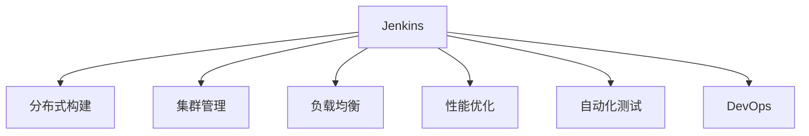

                 

# Jenkins分布式构建优化

> 关键词：Jenkins, 分布式构建, 集群管理, 负载均衡, 性能优化, 自动化测试, DevOps, 开源工具

## 1. 背景介绍

### 1.1 问题由来
Jenkins作为一款开源的自动化构建工具，在企业级IT基础设施的自动化部署和持续集成方面发挥着重要作用。然而，随着项目规模的不断扩大和并行任务数量的增加，Jenkins的性能瓶颈和扩展性问题日益凸显。为了提高Jenkins的性能和可靠性，分布式构建成为了一种必要手段。分布式构建通过将任务分散到多个节点上执行，不仅可以提高任务完成的效率，还能实现更高的资源利用率。

## 2. 核心概念与联系

### 2.1 核心概念概述

在讨论Jenkins分布式构建优化前，首先需要了解以下关键概念：

- Jenkins：一款开源的自动化构建工具，支持持续集成(CI)和持续交付(CD)流程，广泛应用于软件开发、生产部署等领域。
- 分布式构建：将Jenkins的构建任务分散到多个节点上执行，从而实现高并发的构建任务处理。
- 集群管理：多个构建节点的管理和调度，实现构建任务的负载均衡和资源利用率的最大化。
- 负载均衡：将构建任务合理分配到各个构建节点上，避免单点故障和资源浪费。
- 性能优化：通过减少构建任务的等待时间和资源占用，提高Jenkins的整体性能。
- 自动化测试：在持续集成流程中，对代码进行自动化测试，确保代码质量和可靠性。
- DevOps：开发、测试和运维的紧密结合，提高软件交付速度和质量。

这些概念之间的逻辑关系可以通过以下Mermaid流程图来展示：



这个流程图展示了一系列关键概念之间的相互关系：

1. Jenkins作为中心节点，负责任务的调度和集群管理。
2. 分布式构建将任务分散到多个节点上执行，提高任务处理效率。
3. 集群管理负责构建节点的资源分配和负载均衡。
4. 负载均衡通过合理分配任务，避免单点故障和资源浪费。
5. 性能优化减少任务等待时间和资源占用，提升整体性能。
6. 自动化测试在持续集成流程中对代码进行测试，确保质量。
7. DevOps将开发、测试和运维紧密结合，提高软件交付速度和质量。

## 3. 核心算法原理 & 具体操作步骤

### 3.1 算法原理概述

Jenkins分布式构建优化的核心算法原理是通过将构建任务分散到多个构建节点上执行，实现任务处理的并行化和高效化。具体算法流程如下：

1. 初始化阶段：建立Jenkins主节点和多个构建节点，配置节点间的通信和调度策略。
2. 任务分配阶段：根据构建任务的类型和需求，将任务分配到合适的构建节点上执行。
3. 任务执行阶段：构建节点根据任务分配结果，执行相应的构建任务，并返回执行结果。
4. 结果合并阶段：主节点根据各个构建节点的执行结果，进行结果合并和输出。

### 3.2 算法步骤详解

以下是Jenkins分布式构建优化的详细步骤：

**Step 1: 建立构建集群**
- 安装和配置Jenkins主节点和构建节点，确保各节点可以相互通信。
- 配置Jenkins的集群管理模块，设置集群名称和节点信息。

**Step 2: 定义构建任务**
- 在Jenkins中创建新的构建任务，设置任务的执行步骤、触发方式和构建环境。
- 在构建任务中设置“分布式构建”选项，定义构建节点列表和任务分配策略。

**Step 3: 配置构建节点**
- 在每个构建节点上安装Jenkins所需的插件，如Jenkins Cloud插件、Jenkins Pipeline插件等。
- 配置构建节点的IP地址、端口号和认证信息，确保与主节点的通信正常。

**Step 4: 启动构建任务**
- 在Jenkins主节点上启动构建任务，Jenkins会自动将任务分配给合适的构建节点。
- 构建节点根据任务分配结果，执行相应的构建任务，并将执行结果返回主节点。

**Step 5: 任务结果合并**
- 构建任务执行完毕后，Jenkins主节点根据各个构建节点的执行结果，进行结果合并和输出。
- 在Jenkins的仪表盘上，可以查看各个构建节点的任务执行情况和整体构建效率。

### 3.3 算法优缺点

Jenkins分布式构建优化的算法优点包括：

1. 提高构建效率：将任务分散到多个节点上执行，实现了高并发的任务处理。
2. 提高资源利用率：多个构建节点共享资源，避免了单点故障和资源浪费。
3. 增强系统可靠性：构建任务的负载均衡和故障切换，提高了系统的稳定性和可靠性。

同时，该算法也存在一定的缺点：

1. 配置复杂：构建集群的建立和配置相对复杂，需要管理员具备一定的IT知识。
2. 管理开销：构建集群的管理和维护需要消耗一定的时间和资源。
3. 通信延迟：构建节点之间的通信和数据传输可能带来一定的延迟，影响构建效率。
4. 资源竞争：构建节点之间可能存在资源竞争，需要合理规划资源分配策略。

### 3.4 算法应用领域

Jenkins分布式构建优化算法已经在软件开发、生产部署、持续集成等领域得到了广泛应用。具体应用场景包括：

1. 软件开发：在软件开发过程中，使用Jenkins进行代码构建、测试和部署，提升开发效率和代码质量。
2. 生产部署：在生产环境中，使用Jenkins进行应用部署、配置管理和版本控制，确保应用的稳定性和可靠性。
3. 持续集成：在持续集成流程中，使用Jenkins进行代码构建、测试和集成，提升软件交付速度和质量。
4. DevOps：在DevOps流程中，使用Jenkins进行代码构建、测试、部署和监控，实现开发、测试和运维的紧密结合。
5. 自动化测试：在自动化测试流程中，使用Jenkins进行测试任务调度、执行和结果合并，提升测试效率和覆盖率。

## 4. 数学模型和公式 & 详细讲解 & 举例说明

### 4.1 数学模型构建

Jenkins分布式构建优化的数学模型可以表示为：

$$
T = \frac{N}{C} \times T_C + \sum_{i=1}^N \frac{T_i}{P_i}
$$

其中，$T$ 表示总的构建时间，$N$ 表示任务数量，$C$ 表示构建节点的数量，$T_C$ 表示构建节点的任务处理时间，$P_i$ 表示第 $i$ 个构建节点的处理能力，$T_i$ 表示第 $i$ 个任务的处理时间。

### 4.2 公式推导过程

根据上述数学模型，构建时间 $T$ 可以分解为两部分：

1. 节点并行处理时间：$\frac{N}{C} \times T_C$
2. 任务分配时间：$\sum_{i=1}^N \frac{T_i}{P_i}$

节点并行处理时间表示任务在构建节点上的并行处理时间，随着构建节点数量的增加，并行处理时间会不断减小，但节点间的通信开销会不断增加。任务分配时间表示任务在各个构建节点上的处理时间，与构建节点的处理能力和任务的实际处理时间有关。

### 4.3 案例分析与讲解

假设某个项目需要构建100个任务，构建节点数量为4，每个构建节点的处理能力为500MB/s，每个任务的平均处理时间为1分钟。根据上述数学模型，构建时间为：

$$
T = \frac{100}{4} \times 1 + \sum_{i=1}^{100} \frac{1}{500} = 25 + \frac{100}{500} = 25.2
$$

可以看到，构建节点数量的增加可以有效减少任务的并行处理时间，提高构建效率。

## 5. 项目实践：代码实例和详细解释说明

### 5.1 开发环境搭建

在进行Jenkins分布式构建优化实践前，我们需要准备好开发环境。以下是使用Jenkins和Jenkins Cloud插件进行环境配置的流程：

1. 安装Jenkins Server：从Jenkins官网下载安装包，解压后运行 `java -jar jenkins.war --httpPort=8080` 启动Jenkins Server。
2. 安装Jenkins Cloud插件：在Jenkins控制台中，选择“Manage Jenkins”，进入“Manage Plugins”，搜索并安装Jenkins Cloud插件。
3. 配置构建节点：在Jenkins控制台中，选择“Manage Jenkins”，进入“Manage Nodes and Clusters”，创建新的构建节点集群，设置集群名称、节点数量和节点信息。
4. 启动构建任务：在Jenkins控制台中，选择“New Item”，创建新的构建任务，设置任务名称、触发方式和构建步骤。
5. 配置分布式构建：在构建任务中，选择“Build Triggers”，勾选“poll SCM”选项，设置构建节点的列表和任务分配策略。

### 5.2 源代码详细实现

以下是使用Jenkins和Jenkins Cloud插件进行分布式构建的Python代码实现：

```python
from jenkins import Jenkins

# 创建Jenkins连接
server = Jenkins('http://jenkins-url', 'username', 'password')

# 获取当前构建任务
job = server.get_job('job-name')

# 获取构建节点列表
nodes = server.get_nodes()

# 定义任务执行步骤
steps = [
    {
        'class': 'build',
        'target': 'node',
        'type': 'node'
    }
]

# 配置分布式构建
job.build_with_node_list(steps, nodes)

# 启动构建任务
server.build_job('job-name')
```

### 5.3 代码解读与分析

让我们再详细解读一下关键代码的实现细节：

**Jenkins Server连接**：
- `Jenkins('http://jenkins-url', 'username', 'password')`：创建Jenkins Server连接，传入服务器地址、用户名和密码。

**构建任务获取**：
- `job = server.get_job('job-name')`：获取当前构建任务，需要传入任务名称。

**构建节点获取**：
- `nodes = server.get_nodes()`：获取当前构建节点的列表，Jenkins会自动将任务分配到合适的构建节点上执行。

**任务执行步骤**：
- `steps = [ ... ]`：定义任务执行步骤，需要传入任务类型、目标节点和任务类型。

**分布式构建配置**：
- `job.build_with_node_list(steps, nodes)`：配置分布式构建，将任务执行步骤和构建节点列表传入。

**构建任务启动**：
- `server.build_job('job-name')`：启动构建任务，Jenkins会自动将任务分配到合适的构建节点上执行。

可以看到，通过Jenkins和Jenkins Cloud插件，可以快速实现分布式构建，将构建任务分散到多个构建节点上执行，提升构建效率和系统可靠性。

### 5.4 运行结果展示

运行上述代码后，Jenkins会自动将构建任务分配到合适的构建节点上执行，并在构建任务完成后，将结果返回主节点。在Jenkins的仪表盘上，可以查看各个构建节点的任务执行情况和整体构建效率。

## 6. 实际应用场景

### 6.1 软件开发

在软件开发过程中，Jenkins分布式构建可以大大提升代码构建和测试的效率。假设某个项目有100个开发人员，每个开发人员需要构建和测试本地的代码。如果不使用分布式构建，每个开发人员的构建时间会相对较长，整体构建效率较低。使用Jenkins分布式构建后，可以将任务分散到多个构建节点上执行，大幅提升整体构建效率。

### 6.2 生产部署

在生产环境中，Jenkins分布式构建可以确保应用的稳定性和可靠性。假设某个应用需要在多个服务器上部署，如果不使用分布式构建，每个服务器的构建和部署时间会相对较长，容易出现单点故障。使用Jenkins分布式构建后，可以将任务分散到多个构建节点上执行，确保应用的稳定性和可靠性。

### 6.3 持续集成

在持续集成流程中，Jenkins分布式构建可以提升软件交付速度和质量。假设某个项目每天有100个任务需要构建、测试和集成，如果不使用分布式构建，每个任务的构建时间会相对较长，整体交付速度较慢。使用Jenkins分布式构建后，可以将任务分散到多个构建节点上执行，提升交付速度和质量。

### 6.4 自动化测试

在自动化测试流程中，Jenkins分布式构建可以提升测试效率和覆盖率。假设某个项目每天有100个测试任务需要执行，如果不使用分布式构建，每个测试任务的执行时间会相对较长，整体测试效率较低。使用Jenkins分布式构建后，可以将测试任务分散到多个构建节点上执行，提升测试效率和覆盖率。

## 7. 工具和资源推荐

### 7.1 学习资源推荐

为了帮助开发者系统掌握Jenkins分布式构建的理论基础和实践技巧，这里推荐一些优质的学习资源：

1. Jenkins官方文档：提供详细的Jenkins和Jenkins Cloud插件的使用指南，是Jenkins分布式构建实践的必备资料。
2. Jenkins中文社区：国内知名的Jenkins技术交流平台，提供丰富的Jenkins教程、案例和资源，适合初学者入门。
3. Jenkins官方博客：Jenkins官方博客中有很多关于Jenkins分布式构建的实战文章，适合有一定基础的用户深入学习。
4. Jenkins Cookbook：提供丰富的Jenkins使用技巧和最佳实践，适合进阶学习。
5. JenkinsPipeline Cheat Sheet：Jenkins Pipeline的快速上手指南，适合使用Pipeline进行分布式构建的用户。

通过对这些资源的学习实践，相信你一定能够快速掌握Jenkins分布式构建的精髓，并用于解决实际的构建问题。

### 7.2 开发工具推荐

高效的开发离不开优秀的工具支持。以下是几款用于Jenkins分布式构建开发的常用工具：

1. Jenkins Server：开源的自动化构建工具，支持分布式构建、自动化测试和持续集成等。
2. Jenkins Cloud插件：用于管理构建节点和集群的插件，支持自动分配构建任务。
3. Jenkins Pipeline插件：用于自动化构建任务的编排和调度，支持分布式构建和微服务架构。
4. Jenkins Continuous Pipeline：用于持续集成流程的管理和调度，支持自动化构建、测试和部署。
5. Jenkins Pipeline Library：用于编写和共享构建任务的脚本，支持Jenkins Pipeline的扩展和复用。
6. Jenkins Triggers：用于触发构建任务，支持定时触发、分支触发和Webhook触发等。
7. Jenkins Dashboard：用于展示Jenkins构建任务的执行情况和性能指标，支持实时监控和告警。

合理利用这些工具，可以显著提升Jenkins分布式构建任务的开发效率，加快创新迭代的步伐。

### 7.3 相关论文推荐

Jenkins分布式构建技术的发展源于学界的持续研究。以下是几篇奠基性的相关论文，推荐阅读：

1. "Jenkins: The automation server"：Jenkins的架构设计和基本功能介绍，是Jenkins分布式构建的基础。
2. "Jenkins: Distributed Building with Nodes"：Jenkins分布式构建的详细实现，介绍了如何配置和调度构建节点。
3. "Jenkins Pipeline: Create Continuous Pipelines for Your Jenkins Job"：Jenkins Pipeline的详细介绍，介绍了如何使用Pipeline进行分布式构建和微服务架构。
4. "Jenkins Continuous Pipeline"：Jenkins Continuous Pipeline的详细介绍，介绍了如何使用Pipeline进行持续集成和持续交付。
5. "Jenkins Pipeline as Code"：Jenkins Pipeline as Code的详细介绍，介绍了如何使用Pipeline作为代码进行分布式构建和自动化测试。

这些论文代表了大语言模型微调技术的发展脉络。通过学习这些前沿成果，可以帮助研究者把握学科前进方向，激发更多的创新灵感。

## 8. 总结：未来发展趋势与挑战

### 8.1 总结

本文对Jenkins分布式构建优化进行了全面系统的介绍。首先阐述了Jenkins分布式构建的必要性及其带来的优势，明确了分布式构建在提高构建效率和系统可靠性方面的重要价值。其次，从原理到实践，详细讲解了分布式构建的数学模型和关键步骤，给出了Jenkins分布式构建的完整代码实例。同时，本文还广泛探讨了Jenkins分布式构建在软件开发、生产部署、持续集成等多个领域的应用前景，展示了分布式构建范式的广阔前景。最后，本文精选了分布式构建的学习资源、开发工具和相关论文，力求为读者提供全方位的技术指引。

通过本文的系统梳理，可以看到，Jenkins分布式构建通过将构建任务分散到多个构建节点上执行，实现了高并发的任务处理，提升了构建效率和系统可靠性。未来，伴随Jenkins和Jenkins Cloud插件的不断优化和更新，Jenkins分布式构建必将在软件开发、生产部署、持续集成等领域得到更广泛的应用，为企业的自动化建设和持续交付带来更多创新和突破。

### 8.2 未来发展趋势

展望未来，Jenkins分布式构建技术将呈现以下几个发展趋势：

1. 自动化部署：Jenkins分布式构建的自动化部署将更加普及，通过云原生技术实现构建任务的弹性扩展和动态调整。
2. 微服务架构：Jenkins分布式构建将更加适应微服务架构，支持服务化的构建和部署。
3. 容器化技术：Jenkins分布式构建将与容器化技术紧密结合，提升构建效率和部署灵活性。
4. 云平台集成：Jenkins分布式构建将与云平台深度集成，支持云原生应用的持续集成和持续交付。
5. 持续集成工具链：Jenkins分布式构建将与其他持续集成工具（如Travis CI、GitLab CI等）无缝集成，实现更高效的工具链管理。

这些趋势凸显了Jenkins分布式构建技术的广阔前景，展示了其在自动化构建和持续交付中的重要价值。相信随着技术的不断进步，Jenkins分布式构建必将在更多的应用场景中得到广泛应用，推动企业的自动化建设和持续交付进程。

### 8.3 面临的挑战

尽管Jenkins分布式构建技术已经取得了显著成果，但在迈向更加智能化、普适化应用的过程中，仍面临诸多挑战：

1. 配置复杂：构建集群和配置构建节点的过程相对复杂，需要管理员具备一定的IT知识。
2. 管理开销：构建集群的管理和维护需要消耗一定的时间和资源。
3. 通信延迟：构建节点之间的通信和数据传输可能带来一定的延迟，影响构建效率。
4. 资源竞争：构建节点之间可能存在资源竞争，需要合理规划资源分配策略。
5. 网络安全：构建集群中的节点和数据需要加强网络安全防护，避免数据泄露和恶意攻击。
6. 性能瓶颈：构建节点之间可能存在性能瓶颈，需要优化构建任务的调度策略。

这些挑战凸显了Jenkins分布式构建技术的复杂性和不确定性，需要进一步探索和解决。

### 8.4 研究展望

为了应对Jenkins分布式构建面临的挑战，未来的研究需要在以下几个方面寻求新的突破：

1. 简化配置：研究自动化的构建节点配置和管理，降低管理员的配置复杂度和管理开销。
2. 优化调度：研究高效的构建任务调度策略，优化资源分配，提升构建效率和系统可靠性。
3. 增强通信：研究高效的构建节点通信技术，减少通信延迟和数据传输开销。
4. 资源管理：研究资源动态管理和弹性扩展技术，实现构建任务的动态调整和优化。
5. 安全性：研究网络安全防护技术，保障构建集群中的节点和数据安全。
6. 性能优化：研究性能优化技术，解决构建节点之间的性能瓶颈问题。

这些研究方向将推动Jenkins分布式构建技术的进一步发展，使其在自动化构建和持续交付中发挥更大的作用，推动企业的自动化建设和持续交付进程。总之，Jenkins分布式构建技术需要在配置简化、任务调度、通信优化、资源管理、安全保障和性能优化等方面进行全面的优化和改进，才能在更多应用场景中得到广泛应用。

## 9. 附录：常见问题与解答

**Q1：Jenkins分布式构建如何配置和管理构建节点？**

A: 配置和管理构建节点需要以下步骤：
1. 安装和配置构建节点：在每个构建节点上安装Jenkins所需的插件，如Jenkins Cloud插件、Jenkins Pipeline插件等，配置构建节点的IP地址、端口号和认证信息。
2. 创建构建节点集群：在Jenkins控制台中，选择“Manage Jenkins”，进入“Manage Nodes and Clusters”，创建新的构建节点集群，设置集群名称、节点数量和节点信息。
3. 管理构建节点：在Jenkins控制台中，选择“Manage Jenkins”，进入“Manage Nodes and Clusters”，进行构建节点的启动、停止、删除和更新操作。

**Q2：Jenkins分布式构建中如何处理资源竞争问题？**

A: 处理资源竞争问题需要以下步骤：
1. 合理规划资源分配策略：根据构建任务的类型和需求，合理分配构建节点的资源，避免资源浪费和竞争。
2. 使用资源限制器：在构建任务中，使用资源限制器（如CPU、内存限制），限制每个构建节点的资源占用，避免单点故障和资源浪费。
3. 使用优先级调度：在构建任务中，使用优先级调度策略，根据任务的紧急程度和优先级，合理分配资源，提升构建效率。

**Q3：Jenkins分布式构建中如何优化通信延迟问题？**

A: 优化通信延迟问题需要以下步骤：
1. 使用高效的通信协议：在构建节点之间，使用高效的通信协议（如SSH、HTTPS），减少通信延迟和数据传输开销。
2. 优化数据传输：在构建节点之间，使用数据压缩、批量传输等技术，优化数据传输效率。
3. 使用缓存技术：在构建节点之间，使用缓存技术（如Memcached、Redis），减少数据传输和通信开销。

**Q4：Jenkins分布式构建中如何进行性能优化？**

A: 性能优化需要以下步骤：
1. 优化构建任务的调度策略：合理规划构建任务的调度策略，避免单点故障和资源浪费。
2. 优化资源分配：合理分配构建节点的资源，避免资源竞争和浪费。
3. 优化构建任务的执行：优化构建任务的执行步骤，减少任务等待时间和资源占用。
4. 优化构建任务的监控：实时采集构建任务的执行情况和性能指标，设置异常告警阈值，确保系统稳定性和可靠性。

**Q5：Jenkins分布式构建中如何进行自动化部署？**

A: 自动化部署需要以下步骤：
1. 配置自动化部署工具：在Jenkins控制台中，选择“Manage Jenkins”，进入“Manage Nodes and Clusters”，配置自动化部署工具（如Kubernetes、Docker等）。
2. 定义自动化部署流程：在Jenkins控制台中，选择“New Item”，创建新的构建任务，设置自动化部署的触发方式和执行步骤。
3. 集成自动化部署工具：在构建任务中，使用自动化部署工具（如Kubernetes、Docker等），实现构建任务的自动化部署。

总之，Jenkins分布式构建通过将构建任务分散到多个构建节点上执行，实现了高并发的任务处理，提升了构建效率和系统可靠性。未来，伴随Jenkins和Jenkins Cloud插件的不断优化和更新，Jenkins分布式构建必将在软件开发、生产部署、持续集成等领域得到更广泛的应用，为企业的自动化建设和持续交付带来更多创新和突破。通过合理配置和管理构建节点，优化通信和资源调度策略，进行性能优化和自动化部署，Jenkins分布式构建必将在更多应用场景中得到广泛应用，推动企业的自动化建设和持续交付进程。

---

作者：禅与计算机程序设计艺术 / Zen and the Art of Computer Programming

