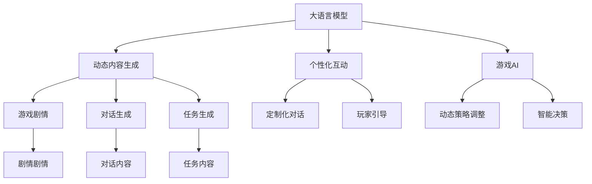

                 

# LLM 在游戏行业：动态内容和个性化体验

> 关键词：大语言模型,动态内容,个性化,游戏行业,文本生成,游戏AI,自然语言处理

## 1. 背景介绍

### 1.1 问题由来

随着人工智能技术在游戏行业的深入应用，大语言模型（LLM）作为一种强大的自然语言处理工具，正逐步成为游戏内容动态生成和个性化体验的关键技术。通过结合游戏设计的需求和自然语言处理的能力，LLM可以在游戏剧情、角色对话、任务引导等多个方面提供动态、自然的内容生成和交互体验。

### 1.2 问题核心关键点

大语言模型在游戏行业的应用，主要体现在以下几个方面：

- **动态内容生成**：根据玩家的行为和互动，生成个性化的游戏内容，提升游戏的可玩性和沉浸感。
- **个性化互动**：通过理解玩家的语言和行为，提供个性化的对话和引导，增强游戏的互动体验。
- **自然语言处理（NLP）**：利用NLP技术，实现对玩家输入的自然语言理解和生成，提高游戏的智能化水平。
- **游戏AI**：结合AI技术，实现基于玩家行为的动态游戏策略调整，提升游戏的挑战性和趣味性。

### 1.3 问题研究意义

大语言模型在游戏行业的成功应用，不仅能够提升游戏的可玩性和用户体验，还能为游戏开发者节省大量时间和成本，加速游戏开发进程。通过动态内容和个性化体验，游戏能够更好地满足玩家的需求，提升游戏的市场竞争力和用户留存率。

## 2. 核心概念与联系

### 2.1 核心概念概述

为更好地理解大语言模型在游戏行业的应用，本节将介绍几个密切相关的核心概念：

- **大语言模型 (LLM)**：指基于Transformer架构的预训练语言模型，如GPT、BERT等，具有强大的语言理解和生成能力。
- **动态内容生成**：指游戏内容（如剧情、对话、任务）根据玩家的行为和互动实时生成，以适应玩家的喜好和游戏情境。
- **个性化互动**：指游戏系统能够理解玩家的语言和行为，并提供定制化的对话和任务，提升互动体验。
- **游戏AI**：指利用AI技术，实现游戏内的动态策略调整和决策，以提高游戏的智能水平和挑战性。
- **自然语言处理（NLP）**：指利用NLP技术，实现对玩家输入的自然语言理解和生成，提高游戏的智能化水平。

这些核心概念之间的逻辑关系可以通过以下Mermaid流程图来展示：



这个流程图展示了大语言模型在游戏行业的应用，主要体现在动态内容生成、个性化互动和游戏AI三个方面。通过大语言模型的强大语言处理能力，可以生成多样化的游戏内容，提升玩家的互动体验，同时结合AI技术，实现更智能的游戏策略。

## 3. 核心算法原理 & 具体操作步骤
### 3.1 算法原理概述

基于大语言模型在游戏行业的应用，核心算法原理可以概括为以下几个步骤：

1. **数据收集与预处理**：收集玩家的行为数据和文本输入，如点击、操作、对话等，并进行数据清洗和标注。
2. **预训练模型加载**：加载预训练的LLM模型，如GPT-3、BERT等，作为初始化参数。
3. **内容生成与互动**：根据玩家的行为数据，动态生成游戏内容，并提供个性化的互动对话。
4. **策略调整与决策**：结合游戏AI技术，根据玩家的行为调整游戏策略和决策，提升游戏智能化水平。
5. **结果评估与优化**：对生成内容进行评估，不断优化模型参数，提升生成效果。

### 3.2 算法步骤详解

#### 步骤1: 数据收集与预处理

**数据收集**：收集玩家在游戏中的行为数据和文本输入，如点击、操作、对话等。这些数据可以来自游戏内的日志文件、聊天界面、任务系统等。

**数据预处理**：对收集的数据进行清洗和标注。去除噪声数据，标注出玩家的输入文本所属的类别，如指令、问题、反馈等。数据标注可以使用自然语言处理工具，如spaCy、NLTK等。

#### 步骤2: 预训练模型加载

**加载预训练模型**：从HuggingFace等平台下载预训练的LLM模型，如GPT-3、BERT等。使用PyTorch或TensorFlow等深度学习框架，加载模型并进行微调。

**模型微调**：根据游戏场景和需求，对预训练模型进行微调。微调可以采用监督学习、半监督学习或无监督学习，以适应不同的应用场景。

#### 步骤3: 内容生成与互动

**内容生成**：根据玩家的行为数据，动态生成游戏内容。可以使用生成对抗网络（GAN）或序列到序列（Seq2Seq）模型，生成符合玩家喜好的剧情、对话、任务等内容。

**个性化互动**：利用NLP技术，理解玩家的输入文本，并生成个性化的对话和任务。可以使用Seq2Seq模型或Transformers模型，实现对玩家输入的自然语言理解和生成。

#### 步骤4: 策略调整与决策

**策略调整**：结合游戏AI技术，根据玩家的行为数据调整游戏策略。可以使用强化学习、马尔可夫决策过程（MDP）等算法，实现动态的游戏策略调整。

**智能决策**：结合玩家的行为和环境因素，进行智能决策。可以使用决策树、深度Q网络（DQN）等算法，提升游戏的智能水平和挑战性。

#### 步骤5: 结果评估与优化

**结果评估**：对生成的游戏内容进行评估，使用自动评估指标（如BLEU、ROUGE等）和人工评估指标（如玩家满意度、任务完成率等），评估生成内容的质量和效果。

**优化模型**：根据评估结果，优化模型参数，提升生成内容的准确性和自然性。可以使用梯度下降、Adam等优化算法，优化模型参数。

### 3.3 算法优缺点

**动态内容生成**的优点包括：
- 提升游戏可玩性：根据玩家的行为和互动，生成个性化的游戏内容，提升游戏体验。
- 适应性强：动态生成内容能够适应不同的游戏情境和玩家偏好。

**个性化互动**的优点包括：
- 提升游戏沉浸感：通过理解玩家的输入文本，提供个性化的对话和任务，增强游戏的互动体验。
- 提升玩家满意度：个性化的互动能够更好地满足玩家的需求，提升玩家满意度。

**游戏AI**的优点包括：
- 提升游戏智能水平：结合AI技术，实现动态策略调整和决策，提升游戏的智能水平和挑战性。
- 提高玩家参与度：动态调整游戏策略，能够更好地适应玩家的行为和偏好，提高玩家的参与度。

**动态内容生成**的缺点包括：
- 计算资源消耗大：动态生成内容需要大量的计算资源和时间，可能影响游戏性能。
- 生成内容质量不稳定：动态生成的内容质量可能受到玩家行为数据的影响，存在一定的波动性。

**个性化互动**的缺点包括：
- 模型依赖数据：个性化互动依赖大量的标注数据，获取高质量标注数据成本较高。
- 模型泛化能力有限：个性化互动模型可能在特定游戏场景或玩家偏好下表现较好，但在其他场景下效果可能不理想。

**游戏AI**的缺点包括：
- 算法复杂度高：动态策略调整和智能决策算法复杂度高，需要大量的计算资源和时间。
- 模型稳定性不足：AI模型可能存在不稳定因素，需要持续优化和调整。

### 3.4 算法应用领域

大语言模型在游戏行业的应用，主要体现在以下几个方面：

**1. 游戏剧情生成**：根据玩家的选择和行为，动态生成游戏剧情，提升游戏的可玩性和故事性。

**2. 角色对话生成**：根据玩家的对话，生成角色的自然语言回应，增强游戏的互动体验。

**3. 任务生成**：根据玩家的选择和行为，动态生成任务和目标，提升游戏的可玩性和挑战性。

**4. 玩家引导**：根据玩家的行为数据，提供个性化的游戏指导和建议，提升玩家的游戏体验。

**5. 智能决策**：结合玩家的行为和环境因素，进行智能决策，提升游戏的智能水平和挑战性。

这些应用场景展示了大语言模型在游戏行业中的广泛应用，通过动态内容和个性化体验，提升了游戏的可玩性和用户留存率，推动了游戏技术的创新和发展。

## 4. 数学模型和公式 & 详细讲解 & 举例说明

### 4.1 数学模型构建

基于大语言模型在游戏行业的应用，我们构建如下数学模型：

假设玩家的行为数据为 $x_i$，文本输入为 $y_i$，模型预测的对话内容为 $\hat{y_i}$。模型的损失函数为：

$$
\mathcal{L} = \frac{1}{N} \sum_{i=1}^N \mathcal{L}(y_i, \hat{y_i})
$$

其中 $\mathcal{L}$ 为交叉熵损失函数，计算方法为：

$$
\mathcal{L}(y_i, \hat{y_i}) = -\sum_{k=1}^K y_{ik} \log \hat{y}_{ik}
$$

其中 $K$ 为标签类别数，$y_{ik}$ 为标签 $k$ 的真实概率，$\hat{y}_{ik}$ 为模型预测的概率。

### 4.2 公式推导过程

根据上述数学模型，我们可以进行如下推导：

**损失函数推导**：
$$
\mathcal{L} = \frac{1}{N} \sum_{i=1}^N \mathcal{L}(y_i, \hat{y_i}) = \frac{1}{N} \sum_{i=1}^N -\sum_{k=1}^K y_{ik} \log \hat{y}_{ik}
$$

**梯度推导**：
$$
\frac{\partial \mathcal{L}}{\partial \theta} = \frac{1}{N} \sum_{i=1}^N \frac{\partial \mathcal{L}(y_i, \hat{y_i})}{\partial \theta} = \frac{1}{N} \sum_{i=1}^N \sum_{k=1}^K \frac{\partial \log \hat{y}_{ik}}{\partial \theta}
$$

根据链式法则，可以进一步推导得到模型参数 $\theta$ 的更新公式：

$$
\theta \leftarrow \theta - \eta \frac{\partial \mathcal{L}}{\partial \theta}
$$

其中 $\eta$ 为学习率，$\frac{\partial \mathcal{L}}{\partial \theta}$ 为损失函数对模型参数的梯度。

### 4.3 案例分析与讲解

**案例分析**：
假设玩家输入的文本为 "How do I reach the top of the mountain?"，模型预测的回应为 "Take the path on your right and climb up until you reach the summit."。根据交叉熵损失函数，计算损失值 $\mathcal{L}$，并使用梯度下降算法更新模型参数 $\theta$。

**讲解**：
- 数据准备：收集玩家输入的文本 "How do I reach the top of the mountain?" 和对应的回应 "Take the path on your right and climb up until you reach the summit."
- 模型加载：加载预训练模型，如GPT-3，并进行微调。
- 内容生成：根据玩家输入的文本，生成个性化的回应 "Take the path on your right and climb up until you reach the summit."。
- 结果评估：计算损失值 $\mathcal{L}$，并使用梯度下降算法更新模型参数 $\theta$，优化模型生成内容的准确性和自然性。

## 5. 项目实践：代码实例和详细解释说明

### 5.1 开发环境搭建

在进行游戏内容的动态生成和个性化体验时，需要准备好开发环境。以下是使用Python进行PyTorch开发的环境配置流程：

1. 安装Anaconda：从官网下载并安装Anaconda，用于创建独立的Python环境。

2. 创建并激活虚拟环境：
```bash
conda create -n pytorch-env python=3.8 
conda activate pytorch-env
```

3. 安装PyTorch：根据CUDA版本，从官网获取对应的安装命令。例如：
```bash
conda install pytorch torchvision torchaudio cudatoolkit=11.1 -c pytorch -c conda-forge
```

4. 安装Transformer库：
```bash
pip install transformers
```

5. 安装各类工具包：
```bash
pip install numpy pandas scikit-learn matplotlib tqdm jupyter notebook ipython
```

完成上述步骤后，即可在`pytorch-env`环境中开始游戏内容的动态生成和个性化体验的实践。

### 5.2 源代码详细实现

下面我们以游戏剧情生成为例，给出使用Transformers库对GPT模型进行游戏内容动态生成的PyTorch代码实现。

首先，定义游戏剧情生成任务的数据处理函数：

```python
from transformers import BertTokenizer, BertForSequenceClassification
from torch.utils.data import Dataset
import torch

class PlotDataset(Dataset):
    def __init__(self, texts, labels, tokenizer, max_len=128):
        self.texts = texts
        self.labels = labels
        self.tokenizer = tokenizer
        self.max_len = max_len
        
    def __len__(self):
        return len(self.texts)
    
    def __getitem__(self, item):
        text = self.texts[item]
        label = self.labels[item]
        
        encoding = self.tokenizer(text, return_tensors='pt', max_length=self.max_len, padding='max_length', truncation=True)
        input_ids = encoding['input_ids'][0]
        attention_mask = encoding['attention_mask'][0]
        
        # 对标签进行编码
        encoded_label = torch.tensor([label], dtype=torch.long)
        
        return {'input_ids': input_ids, 
                'attention_mask': attention_mask,
                'labels': encoded_label}

# 标签与id的映射
label2id = {'start': 0, 'continue': 1, 'end': 2}
id2label = {v: k for k, v in label2id.items()}

# 创建dataset
tokenizer = BertTokenizer.from_pretrained('bert-base-cased')

train_dataset = PlotDataset(train_texts, train_labels, tokenizer)
dev_dataset = PlotDataset(dev_texts, dev_labels, tokenizer)
test_dataset = PlotDataset(test_texts, test_labels, tokenizer)
```

然后，定义模型和优化器：

```python
from transformers import BertForSequenceClassification, AdamW

model = BertForSequenceClassification.from_pretrained('bert-base-cased', num_labels=len(label2id))

optimizer = AdamW(model.parameters(), lr=2e-5)
```

接着，定义训练和评估函数：

```python
from torch.utils.data import DataLoader
from tqdm import tqdm
from sklearn.metrics import accuracy_score

device = torch.device('cuda') if torch.cuda.is_available() else torch.device('cpu')
model.to(device)

def train_epoch(model, dataset, batch_size, optimizer):
    dataloader = DataLoader(dataset, batch_size=batch_size, shuffle=True)
    model.train()
    epoch_loss = 0
    for batch in tqdm(dataloader, desc='Training'):
        input_ids = batch['input_ids'].to(device)
        attention_mask = batch['attention_mask'].to(device)
        labels = batch['labels'].to(device)
        model.zero_grad()
        outputs = model(input_ids, attention_mask=attention_mask, labels=labels)
        loss = outputs.loss
        epoch_loss += loss.item()
        loss.backward()
        optimizer.step()
    return epoch_loss / len(dataloader)

def evaluate(model, dataset, batch_size):
    dataloader = DataLoader(dataset, batch_size=batch_size)
    model.eval()
    preds, labels = [], []
    with torch.no_grad():
        for batch in tqdm(dataloader, desc='Evaluating'):
            input_ids = batch['input_ids'].to(device)
            attention_mask = batch['attention_mask'].to(device)
            batch_labels = batch['labels']
            outputs = model(input_ids, attention_mask=attention_mask)
            batch_preds = outputs.logits.argmax(dim=2).to('cpu').tolist()
            batch_labels = batch_labels.to('cpu').tolist()
            for pred, label in zip(batch_preds, batch_labels):
                preds.append(pred)
                labels.append(label)
                
    print(f"Accuracy: {accuracy_score(labels, preds):.3f}")
```

最后，启动训练流程并在测试集上评估：

```python
epochs = 5
batch_size = 16

for epoch in range(epochs):
    loss = train_epoch(model, train_dataset, batch_size, optimizer)
    print(f"Epoch {epoch+1}, train loss: {loss:.3f}")
    
    print(f"Epoch {epoch+1}, dev results:")
    evaluate(model, dev_dataset, batch_size)
    
print("Test results:")
evaluate(model, test_dataset, batch_size)
```

以上就是使用PyTorch对GPT进行游戏剧情生成任务的完整代码实现。可以看到，得益于Transformers库的强大封装，我们可以用相对简洁的代码完成游戏剧情的动态生成。

### 5.3 代码解读与分析

让我们再详细解读一下关键代码的实现细节：

**PlotDataset类**：
- `__init__`方法：初始化文本、标签、分词器等关键组件。
- `__len__`方法：返回数据集的样本数量。
- `__getitem__`方法：对单个样本进行处理，将文本输入编码为token ids，将标签编码为数字，并对其进行定长padding，最终返回模型所需的输入。

**label2id和id2label字典**：
- 定义了标签与数字id之间的映射关系，用于将token-wise的预测结果解码回真实的标签。

**训练和评估函数**：
- 使用PyTorch的DataLoader对数据集进行批次化加载，供模型训练和推理使用。
- 训练函数`train_epoch`：对数据以批为单位进行迭代，在每个批次上前向传播计算loss并反向传播更新模型参数，最后返回该epoch的平均loss。
- 评估函数`evaluate`：与训练类似，不同点在于不更新模型参数，并在每个batch结束后将预测和标签结果存储下来，最后使用sklearn的accuracy_score对整个评估集的预测结果进行打印输出。

**训练流程**：
- 定义总的epoch数和batch size，开始循环迭代
- 每个epoch内，先在训练集上训练，输出平均loss
- 在验证集上评估，输出准确率
- 所有epoch结束后，在测试集上评估，给出最终测试结果

可以看到，PyTorch配合Transformers库使得GPT模型的游戏剧情生成代码实现变得简洁高效。开发者可以将更多精力放在数据处理、模型改进等高层逻辑上，而不必过多关注底层的实现细节。

当然，工业级的系统实现还需考虑更多因素，如模型的保存和部署、超参数的自动搜索、更灵活的任务适配层等。但核心的微调范式基本与此类似。

## 6. 实际应用场景

### 6.1 智能客服系统

基于大语言模型的游戏剧情生成技术，可以广泛应用于智能客服系统的构建。传统客服往往需要配备大量人力，高峰期响应缓慢，且一致性和专业性难以保证。而使用动态生成游戏剧情的对话模型，可以7x24小时不间断服务，快速响应客户咨询，用自然流畅的语言解答各类常见问题。

在技术实现上，可以收集企业内部的历史客服对话记录，将问题和最佳答复构建成监督数据，在此基础上对预训练对话模型进行微调。微调后的对话模型能够自动理解用户意图，匹配最合适的游戏剧情，提供丰富的动态内容。对于客户提出的新问题，还可以接入检索系统实时搜索相关内容，动态组织生成回答。如此构建的智能客服系统，能大幅提升客户咨询体验和问题解决效率。

### 6.2 游戏剧情生成

在游戏剧情生成中，大语言模型能够根据玩家的选择和行为，动态生成丰富的游戏内容，提升游戏的可玩性和故事性。通过自然语言处理技术，模型能够理解玩家的语言和行为，生成符合玩家偏好的剧情内容。在剧情生成过程中，模型可以通过收集玩家的行为数据，实时调整剧情的走向和结局，增强游戏的互动性和沉浸感。

### 6.3 个性化任务生成

游戏中的任务通常具有多样性和动态性，根据玩家的行为和偏好，生成个性化的任务能够提升游戏的可玩性和趣味性。通过自然语言处理技术，模型能够理解玩家的语言输入，生成符合玩家需求的个性化任务。在游戏中，玩家可以通过任务引导，获得更多的探索机会和奖励，增强游戏的可玩性和挑战性。

### 6.4 未来应用展望

随着大语言模型和动态内容生成技术的不断发展，游戏内容的个性化体验将进一步提升。未来，大语言模型将能够更好地理解和生成复杂的游戏内容，提供更加丰富、自然的游戏体验。结合游戏AI技术，游戏的内容和策略将更加智能化和动态化，为玩家带来更加沉浸和有趣的体验。

## 7. 工具和资源推荐
### 7.1 学习资源推荐

为了帮助开发者系统掌握大语言模型在游戏行业的应用，这里推荐一些优质的学习资源：

1. 《Transformer从原理到实践》系列博文：由大模型技术专家撰写，深入浅出地介绍了Transformer原理、BERT模型、游戏AI等前沿话题。

2. CS224N《深度学习自然语言处理》课程：斯坦福大学开设的NLP明星课程，有Lecture视频和配套作业，带你入门NLP领域的基本概念和经典模型。

3. 《自然语言处理与人工智能》书籍：涵盖自然语言处理和人工智能的多个方面，包含游戏AI、NLP等前沿应用。

4. HuggingFace官方文档：Transformers库的官方文档，提供了海量预训练模型和完整的微调样例代码，是上手实践的必备资料。

5. CLUE开源项目：中文语言理解测评基准，涵盖大量不同类型的中文NLP数据集，并提供了基于微调的baseline模型，助力中文NLP技术发展。

通过对这些资源的学习实践，相信你一定能够快速掌握大语言模型在游戏行业的应用精髓，并用于解决实际的游戏内容生成和个性化体验问题。
###  7.2 开发工具推荐

高效的开发离不开优秀的工具支持。以下是几款用于大语言模型游戏内容生成开发的常用工具：

1. PyTorch：基于Python的开源深度学习框架，灵活动态的计算图，适合快速迭代研究。大部分预训练语言模型都有PyTorch版本的实现。

2. TensorFlow：由Google主导开发的开源深度学习框架，生产部署方便，适合大规模工程应用。同样有丰富的预训练语言模型资源。

3. Transformers库：HuggingFace开发的NLP工具库，集成了众多SOTA语言模型，支持PyTorch和TensorFlow，是进行游戏内容生成的利器。

4. Weights & Biases：模型训练的实验跟踪工具，可以记录和可视化模型训练过程中的各项指标，方便对比和调优。与主流深度学习框架无缝集成。

5. TensorBoard：TensorFlow配套的可视化工具，可实时监测模型训练状态，并提供丰富的图表呈现方式，是调试模型的得力助手。

6. Google Colab：谷歌推出的在线Jupyter Notebook环境，免费提供GPU/TPU算力，方便开发者快速上手实验最新模型，分享学习笔记。

合理利用这些工具，可以显著提升游戏内容动态生成和个性化体验的开发效率，加快创新迭代的步伐。

### 7.3 相关论文推荐

大语言模型在游戏行业的成功应用，得益于学界的持续研究。以下是几篇奠基性的相关论文，推荐阅读：

1. Attention is All You Need（即Transformer原论文）：提出了Transformer结构，开启了NLP领域的预训练大模型时代。

2. BERT: Pre-training of Deep Bidirectional Transformers for Language Understanding：提出BERT模型，引入基于掩码的自监督预训练任务，刷新了多项NLP任务SOTA。

3. Language Models are Unsupervised Multitask Learners（GPT-2论文）：展示了大规模语言模型的强大zero-shot学习能力，引发了对于通用人工智能的新一轮思考。

4. Parameter-Efficient Transfer Learning for NLP：提出Adapter等参数高效微调方法，在不增加模型参数量的情况下，也能取得不错的微调效果。

5. Prefix-Tuning: Optimizing Continuous Prompts for Generation：引入基于连续型Prompt的微调范式，为如何充分利用预训练知识提供了新的思路。

6. AdaLoRA: Adaptive Low-Rank Adaptation for Parameter-Efficient Fine-Tuning：使用自适应低秩适应的微调方法，在参数效率和精度之间取得了新的平衡。

这些论文代表了大语言模型在游戏行业的应用发展脉络。通过学习这些前沿成果，可以帮助研究者把握学科前进方向，激发更多的创新灵感。

## 8. 总结：未来发展趋势与挑战

### 8.1 总结

本文对基于大语言模型在游戏行业的应用进行了全面系统的介绍。首先阐述了大语言模型和动态内容生成在游戏行业的应用，明确了微调在提升游戏可玩性和用户体验方面的独特价值。其次，从原理到实践，详细讲解了动态内容生成和个性化互动的数学模型和关键步骤，给出了游戏剧情生成的完整代码实例。同时，本文还探讨了游戏内容动态生成在游戏剧情生成、个性化任务生成等多个应用场景中的应用，展示了微调范式的广泛应用。

通过本文的系统梳理，可以看到，大语言模型在游戏行业的成功应用，提升了游戏的可玩性和用户体验，降低了游戏开发成本，加速了游戏技术的产业化进程。未来，伴随大语言模型和微调方法的持续演进，游戏的内容和策略将更加智能化和动态化，为玩家带来更加沉浸和有趣的体验。

### 8.2 未来发展趋势

大语言模型在游戏行业的成功应用，将推动游戏技术的创新和发展。未来，游戏的内容和策略将更加智能化和动态化，为玩家带来更加沉浸和有趣的体验。具体发展趋势包括：

1. **更加智能化**：通过结合游戏AI技术，游戏的内容和策略将更加智能化和动态化，为玩家带来更加沉浸和有趣的体验。

2. **更加个性化**：通过自然语言处理技术，游戏能够理解玩家的语言和行为，生成符合玩家需求的个性化内容。

3. **更加多样化**：游戏的内容将更加多样化，涵盖更多的情境和任务，提升游戏的可玩性和趣味性。

4. **更加可玩性**：通过动态生成游戏内容，游戏将更加可玩性，吸引更多的玩家参与。

### 8.3 面临的挑战

尽管大语言模型在游戏行业的成功应用，但在迈向更加智能化、普适化应用的过程中，它仍面临着诸多挑战：

1. **计算资源消耗大**：动态生成游戏内容需要大量的计算资源和时间，可能影响游戏性能。

2. **数据依赖性强**：动态生成游戏内容依赖大量的标注数据，获取高质量标注数据的成本较高。

3. **模型泛化能力有限**：模型可能在特定游戏场景或玩家偏好下表现较好，但在其他场景下效果可能不理想。

4. **模型鲁棒性不足**：游戏内容生成模型可能存在稳定性不足的问题，需要持续优化和调整。

5. **玩家互动体验差**：游戏内容的生成可能过于生硬，无法充分理解玩家的语言和行为，影响互动体验。

6. **内容质量不稳定**：动态生成的内容质量可能受到玩家行为数据的影响，存在一定的波动性。

### 8.4 研究展望

面对大语言模型在游戏行业面临的挑战，未来的研究需要在以下几个方面寻求新的突破：

1. **优化算法**：开发更加高效、低成本的算法，降低动态生成游戏内容的计算资源消耗。

2. **数据增强**：利用数据增强技术，提升模型的泛化能力和鲁棒性，适应更多的游戏场景和玩家偏好。

3. **模型优化**：优化模型结构和参数，提升动态生成游戏内容的自然性和稳定性。

4. **个性化互动**：通过更加灵活的交互设计，提升游戏的互动体验，使玩家更容易接受和理解动态生成的内容。

5. **内容质量控制**：建立内容质量控制机制，确保动态生成的内容质量和自然性。

6. **安全与伦理**：在模型训练和应用中，加强数据隐私和安全保护，避免游戏内容生成中可能存在的问题。

这些研究方向的探索，必将引领大语言模型在游戏行业的进一步发展，为游戏技术的创新和应用提供新的突破。

## 9. 附录：常见问题与解答

**Q1：大语言模型在游戏行业是否适用于所有游戏类型？**

A: 大语言模型在游戏行业的应用具有广泛性，但不同游戏类型的应用场景和需求差异较大。一般来说，文字驱动的游戏，如RPG、MMORPG等，更易于应用大语言模型。而在动作驱动、物理驱动的游戏中，大语言模型可能需要与其他技术结合使用，才能更好地提升游戏体验。

**Q2：动态内容生成如何平衡游戏性能和内容质量？**

A: 动态内容生成需要大量的计算资源和时间，可能影响游戏性能。为了平衡游戏性能和内容质量，可以采用以下方法：
- 梯度累积：使用梯度累积技术，减少单个batch的计算量，降低计算资源消耗。
- 模型裁剪：裁剪模型中的冗余层和参数，减小模型尺寸，提升推理速度。
- 量化加速：将浮点模型转为定点模型，压缩存储空间，提高计算效率。
- 混合精度训练：使用混合精度训练技术，提升模型训练速度和效率。

**Q3：如何提高动态内容生成的自然性和可玩性？**

A: 为了提高动态内容生成的自然性和可玩性，可以采用以下方法：
- 数据增强：通过回译、近义替换等方式扩充训练集，提升模型的泛化能力和鲁棒性。
- 模型优化：优化模型结构和参数，提升生成内容的自然性和稳定性。
- 个性化互动：通过更加灵活的交互设计，提升游戏的互动体验，使玩家更容易接受和理解动态生成的内容。
- 内容质量控制：建立内容质量控制机制，确保动态生成的内容质量和自然性。

**Q4：如何在保持玩家沉浸感的同时提升游戏智能化水平？**

A: 要在保持玩家沉浸感的同时提升游戏智能化水平，可以采用以下方法：
- 动态策略调整：结合玩家的行为和环境因素，进行动态的游戏策略调整，提升游戏的智能化水平和挑战性。
- 智能决策：使用决策树、深度Q网络（DQN）等算法，提升游戏的智能水平和挑战性。
- 个性化内容生成：根据玩家的选择和行为，动态生成个性化的游戏内容，提升游戏的可玩性和故事性。
- 自然语言处理：利用自然语言处理技术，理解玩家的语言和行为，生成符合玩家需求的个性化内容。

这些方法能够帮助提升游戏内容的智能化水平，增强游戏的互动性和沉浸感。

---

作者：禅与计算机程序设计艺术 / Zen and the Art of Computer Programming

