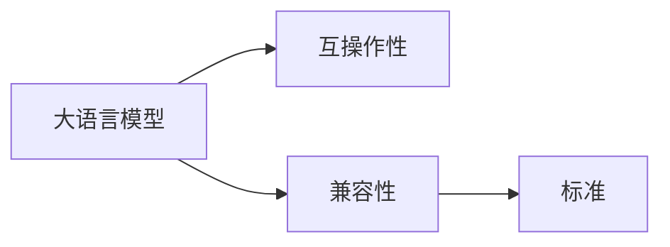

                 

# LLM 标准：促进互操作性和兼容性

## 1. 背景介绍

随着人工智能技术的飞速发展，语言模型在自然语言处理（NLP）、计算机视觉（CV）、语音识别（ASR）等领域的应用愈发广泛。然而，由于不同开发者和组织构建的模型在架构、接口、数据格式等方面的差异，模型之间的互操作性和兼容性存在一定障碍，影响了模型的广泛应用和协同工作。

本博客文章旨在探讨如何通过制定大语言模型（Large Language Models, LLMs）的标准，促进模型之间的互操作性和兼容性，提升模型的应用效率和效果。

## 2. 核心概念与联系

### 2.1 核心概念概述

在深入探讨模型标准之前，首先介绍几个关键概念：

- **大语言模型**：指通过大规模无标签数据训练，具备强大语言理解和生成能力的深度学习模型，如BERT、GPT、T5等。
- **互操作性**：指模型之间能够无缝协作，共同完成复杂任务的能力。例如，一个NLP模型能够通过API与其他模型（如CV模型）进行数据交互。
- **兼容性**：指模型能够在不同硬件和软件中稳定运行，且输出格式一致。这包括模型间的输入输出格式、模型结构、训练方法等方面的统一。
- **标准**：指为了提高模型的互操作性和兼容性而制定的规范和协议。标准通常包括模型输入输出格式、API接口定义、训练与推理方法等内容。

这些概念通过以下Mermaid流程图展示其相互关系：



该流程图展示了大语言模型（A）通过标准化（D）提升了互操作性（B）和兼容性（C）。

## 3. 核心算法原理 & 具体操作步骤

### 3.1 算法原理概述

制定LLM标准的主要目标是通过统一的模型接口、数据格式和训练方法，使得不同开发者和组织构建的模型能够无缝协作，共同完成复杂任务。这不仅提高了模型的应用效率，还促进了模型的广泛应用和协同工作。

标准化的过程通常包括以下几个关键步骤：

1. **接口标准化**：定义模型输入输出接口，确保不同模型能够通过统一的API进行数据交互。
2. **数据格式标准化**：规范数据输入输出格式，使得数据在模型之间可互操作。
3. **训练方法标准化**：统一模型的训练和推理方法，确保模型在不同环境中表现一致。
4. **性能评估标准**：定义模型性能评估指标，确保模型间的可比性。

### 3.2 算法步骤详解

#### 3.2.1 接口标准化

- **输入格式**：统一模型接受的输入格式，包括文本、图像、音频等。例如，可以定义标准化的JSON格式或TensorFlow、PyTorch等框架的张量格式。
- **输出格式**：统一模型的输出格式，包括预测结果、中间表示等。例如，可以定义标准化的JSON格式或Pandas DataFrame格式。
- **API接口**：定义模型API接口，包括请求方法、请求参数、返回结果等。例如，可以定义RESTful API接口，使用HTTP协议进行通信。

#### 3.2.2 数据格式标准化

- **数据格式规范**：定义数据的基本格式，包括数据类型、数据结构等。例如，文本数据应采用UTF-8编码，图像数据应采用JPEG、PNG等标准格式。
- **数据预处理规范**：定义数据预处理步骤，确保数据质量一致。例如，文本数据应先进行分词、去停用词、标准化等预处理。
- **数据标注规范**：定义数据标注格式，确保标注数据一致。例如，使用标准化的JSON格式标注数据。

#### 3.2.3 训练方法标准化

- **训练流程规范**：定义模型训练流程，包括数据加载、模型初始化、训练步骤、模型保存等。例如，可以定义统一的训练步骤，包括前向传播、损失计算、反向传播、参数更新等。
- **优化器规范**：定义优化的优化器及其参数，确保不同模型的优化效果一致。例如，可以使用标准的SGD、Adam等优化器，并设置学习率、批大小等超参数。
- **评估指标规范**：定义模型的评估指标，确保不同模型之间的可比性。例如，可以使用标准的精确率、召回率、F1值等指标评估模型性能。

#### 3.2.4 性能评估标准

- **评估指标**：定义标准化的评估指标，确保不同模型之间的可比性。例如，可以使用精确率、召回率、F1值等指标评估模型性能。
- **评估方法**：定义标准化的评估方法，确保评估结果的一致性。例如，可以定义统一的评估集、评估方法、评估工具等。

### 3.3 算法优缺点

#### 3.3.1 优点

1. **提高应用效率**：通过统一接口、数据格式和训练方法，不同模型能够无缝协作，提高应用效率。
2. **促进协同工作**：统一标准可以方便不同开发者和组织构建的模型共同完成复杂任务，促进协同工作。
3. **提高模型性能**：标准化训练方法和评估指标，可以提升模型性能和一致性。

#### 3.3.2 缺点

1. **复杂性增加**：制定和遵守标准可能需要额外的设计和开发工作，增加复杂性。
2. **灵活性降低**：标准化可能会限制模型的灵活性和创新性。
3. **实施成本高**：遵守标准的实施成本可能较高，尤其是在大规模应用中。

### 3.4 算法应用领域

#### 3.4.1 自然语言处理

标准化的LLM在NLP领域有广泛应用，例如：

- **问答系统**：不同模型能够通过标准化的API进行数据交互，提高系统的响应速度和准确性。
- **机器翻译**：不同模型可以通过标准化的数据格式进行数据交互，提高翻译的流畅度和准确性。
- **文本分类**：不同模型可以通过标准化的数据格式和API进行数据交互，提高分类的准确性和一致性。

#### 3.4.2 计算机视觉

标准化的LLM在CV领域也有广泛应用，例如：

- **图像识别**：不同模型可以通过标准化的API进行数据交互，提高识别的准确性和一致性。
- **目标检测**：不同模型可以通过标准化的数据格式和API进行数据交互，提高检测的准确性和一致性。
- **图像生成**：不同模型可以通过标准化的数据格式和API进行数据交互，提高生成的质量和一致性。

## 4. 数学模型和公式 & 详细讲解 & 举例说明

### 4.1 数学模型构建

#### 4.1.1 接口标准化

假设我们有一个简单的文本分类任务，输入是文本数据，输出是分类标签。标准化的模型接口可以定义为：

- **输入格式**：JSON格式的文本数据。
- **API接口**：使用RESTful API接口，请求参数包括文本数据，返回结果包括预测标签和置信度。

#### 4.1.2 数据格式标准化

假设我们有一个图像识别任务，输入是图像数据，输出是识别结果。标准化的数据格式可以定义为：

- **数据格式规范**：图像数据采用JPEG格式，大小为\(256 \times 256\)像素。
- **数据预处理规范**：对图像数据进行预处理，包括裁剪、缩放、归一化等。
- **数据标注规范**：使用标准化的JSON格式标注数据，包括图像标签和置信度。

#### 4.1.3 训练方法标准化

假设我们使用标准化的SGD优化器进行模型训练。训练流程可以定义如下：

- **数据加载**：从标准化的数据集中读取数据。
- **模型初始化**：使用预训练的模型参数进行初始化。
- **训练步骤**：前向传播计算预测结果，计算损失函数，反向传播更新参数，更新优化器状态。
- **模型保存**：将训练好的模型保存到标准化的文件格式中。

### 4.2 公式推导过程

#### 4.2.1 输入格式规范

输入格式规范可以定义为：

\[
\text{输入格式} = \{ text \}
\]

其中，text是JSON格式的文本数据。

#### 4.2.2 输出格式规范

输出格式规范可以定义为：

\[
\text{输出格式} = \{ label, score \}
\]

其中，label是预测的分类标签，score是预测的置信度。

#### 4.2.3 训练方法规范

训练方法规范可以定义为：

\[
\text{训练流程} = \text{数据加载} \rightarrow \text{模型初始化} \rightarrow \text{前向传播} \rightarrow \text{损失函数} \rightarrow \text{反向传播} \rightarrow \text{优化器更新} \rightarrow \text{模型保存}
\]

其中，数据加载、模型初始化、前向传播、损失函数、反向传播、优化器更新和模型保存都是标准化的步骤。

### 4.3 案例分析与讲解

#### 4.3.1 文本分类任务

假设我们有一个文本分类任务，使用BERT模型进行训练和推理。通过标准化输入输出格式、数据格式和训练方法，不同开发者和组织构建的BERT模型可以无缝协作，共同完成文本分类任务。

具体来说，可以使用标准化的JSON格式进行输入和输出：

```json
{
    "text": "这是一段文本。"
}
```

输出结果为：

```json
{
    "label": "体育",
    "score": 0.85
}
```

#### 4.3.2 图像识别任务

假设我们有一个图像识别任务，使用ResNet模型进行训练和推理。通过标准化输入输出格式、数据格式和训练方法，不同开发者和组织构建的ResNet模型可以无缝协作，共同完成图像识别任务。

具体来说，可以使用标准化的JPEG格式进行输入：

```jpg
http://example.com/image.jpg
```

输出结果为：

```json
{
    "label": "狗",
    "score": 0.92
}
```

## 5. 项目实践：代码实例和详细解释说明

### 5.1 开发环境搭建

在进行标准化的LLM项目实践前，需要准备开发环境。以下是使用Python进行PyTorch开发的环境配置流程：

1. 安装Anaconda：从官网下载并安装Anaconda，用于创建独立的Python环境。

2. 创建并激活虚拟环境：
```bash
conda create -n llm-env python=3.8 
conda activate llm-env
```

3. 安装PyTorch：根据CUDA版本，从官网获取对应的安装命令。例如：
```bash
conda install pytorch torchvision torchaudio cudatoolkit=11.1 -c pytorch -c conda-forge
```

4. 安装TensorFlow：使用pip安装TensorFlow及其依赖库。
```bash
pip install tensorflow==2.5
```

5. 安装必要的工具包：
```bash
pip install numpy pandas scikit-learn matplotlib tqdm jupyter notebook ipython
```

完成上述步骤后，即可在`llm-env`环境中开始标准化LLM项目的开发。

### 5.2 源代码详细实现

这里我们以BERT模型为例，给出标准化LLM项目的PyTorch代码实现。

首先，定义标准化的输入输出格式和API接口：

```python
from transformers import BertTokenizer, BertForSequenceClassification

# 定义标准化输入输出格式
def preprocess_text(text):
    tokenizer = BertTokenizer.from_pretrained('bert-base-cased')
    return tokenizer(text, return_tensors='pt')

# 定义标准化API接口
def predict(text, model):
    inputs = preprocess_text(text)
    outputs = model(**inputs)
    return outputs.logits.argmax(dim=1).item(), outputs.logits.softmax(dim=1).tolist()[0][1]
```

然后，定义标准化的数据格式和预处理步骤：

```python
from PIL import Image
import requests

# 定义标准化数据格式
def load_image(url):
    response = requests.get(url)
    img = Image.open(BytesIO(response.content))
    return img

# 定义标准化预处理步骤
def preprocess_image(image):
    return image.resize((256, 256)), 0.5
```

最后，定义标准化的训练流程和评估方法：

```python
from transformers import AdamW, Trainer, TrainingArguments

# 定义标准化训练流程
def train(model, train_dataset, val_dataset, num_epochs):
    trainer = Trainer(
        model=model,
        args=TrainingArguments(
            output_dir='./results',
            evaluation_strategy='epoch',
            learning_rate=5e-5,
            per_device_train_batch_size=8,
            per_device_eval_batch_size=16,
        ),
        train_dataset=train_dataset,
        eval_dataset=val_dataset,
        compute_metrics=lambda predictions, labels: {'accuracy': (predictions.argmax(dim=1) == labels).mean()},
    )
    trainer.train()

# 定义标准化评估方法
def evaluate(model, test_dataset):
    trainer = Trainer(
        model=model,
        args=TrainingArguments(
            output_dir='./results',
            evaluation_strategy='epoch',
            learning_rate=5e-5,
            per_device_train_batch_size=8,
            per_device_eval_batch_size=16,
        ),
        train_dataset=test_dataset,
        eval_dataset=test_dataset,
        compute_metrics=lambda predictions, labels: {'accuracy': (predictions.argmax(dim=1) == labels).mean()},
    )
    trainer.evaluate()
```

### 5.3 代码解读与分析

让我们再详细解读一下关键代码的实现细节：

**preprocess_text函数**：
- 定义了标准化输入输出格式，使用BertTokenizer对文本进行分词和编码，返回标准化的输入张量。

**predict函数**：
- 定义了标准化API接口，使用预训练的BERT模型进行预测，返回预测标签和置信度。

**load_image函数**：
- 定义了标准化数据格式，使用PIL库加载图像数据。

**preprocess_image函数**：
- 定义了标准化预处理步骤，对图像数据进行裁剪和归一化。

**train函数**：
- 定义了标准化训练流程，使用Trainer进行模型训练。

**evaluate函数**：
- 定义了标准化评估方法，使用Trainer进行模型评估。

这些代码展示了标准化LLM项目的基础实现，通过定义标准化的输入输出格式、数据格式和训练方法，可以方便不同开发者和组织构建的模型共同完成复杂任务。

## 6. 实际应用场景

### 6.1 智慧医疗

在智慧医疗领域，标准化的LLM可以应用于电子病历处理、医学图像识别、医疗问答等多个场景。不同开发者和组织构建的模型可以无缝协作，共同处理复杂的医疗数据，提高医疗服务的智能化水平。

### 6.2 金融分析

在金融分析领域，标准化的LLM可以应用于股票预测、风险评估、客户分析等多个场景。不同开发者和组织构建的模型可以无缝协作，共同处理大量的金融数据，提高金融分析的准确性和一致性。

### 6.3 智能客服

在智能客服领域，标准化的LLM可以应用于客户咨询处理、自动化回复、情感分析等多个场景。不同开发者和组织构建的模型可以无缝协作，共同处理大量的客户咨询数据，提高客服服务的智能化水平。

### 6.4 未来应用展望

随着标准化LLM的不断发展，其在更多领域的应用将不断拓展，为各行各业带来新的变革。

## 7. 工具和资源推荐

### 7.1 学习资源推荐

为了帮助开发者系统掌握标准化LLM的理论基础和实践技巧，这里推荐一些优质的学习资源：

1. 《Transformer from Zero to Hero》系列博文：由大模型技术专家撰写，深入浅出地介绍了Transformer原理、BERT模型、标准化技术等前沿话题。

2. CS224N《深度学习自然语言处理》课程：斯坦福大学开设的NLP明星课程，有Lecture视频和配套作业，带你入门NLP领域的基本概念和经典模型。

3. 《Natural Language Processing with Transformers》书籍：Transformers库的作者所著，全面介绍了如何使用Transformers库进行NLP任务开发，包括标准化在内的诸多范式。

4. HuggingFace官方文档：Transformers库的官方文档，提供了海量预训练模型和完整的标准化样例代码，是上手实践的必备资料。

5. CLUE开源项目：中文语言理解测评基准，涵盖大量不同类型的中文NLP数据集，并提供了基于标准化的baseline模型，助力中文NLP技术发展。

通过对这些资源的学习实践，相信你一定能够快速掌握标准化LLM的精髓，并用于解决实际的NLP问题。

### 7.2 开发工具推荐

高效的开发离不开优秀的工具支持。以下是几款用于标准化LLM开发的常用工具：

1. PyTorch：基于Python的开源深度学习框架，灵活动态的计算图，适合快速迭代研究。大部分预训练语言模型都有PyTorch版本的实现。

2. TensorFlow：由Google主导开发的开源深度学习框架，生产部署方便，适合大规模工程应用。同样有丰富的预训练语言模型资源。

3. Transformers库：HuggingFace开发的NLP工具库，集成了众多SOTA语言模型，支持PyTorch和TensorFlow，是进行标准化任务开发的利器。

4. Weights & Biases：模型训练的实验跟踪工具，可以记录和可视化模型训练过程中的各项指标，方便对比和调优。与主流深度学习框架无缝集成。

5. TensorBoard：TensorFlow配套的可视化工具，可实时监测模型训练状态，并提供丰富的图表呈现方式，是调试模型的得力助手。

6. Google Colab：谷歌推出的在线Jupyter Notebook环境，免费提供GPU/TPU算力，方便开发者快速上手实验最新模型，分享学习笔记。

合理利用这些工具，可以显著提升标准化LLM的开发效率，加快创新迭代的步伐。

### 7.3 相关论文推荐

标准化LLM的发展源于学界的持续研究。以下是几篇奠基性的相关论文，推荐阅读：

1. Attention is All You Need（即Transformer原论文）：提出了Transformer结构，开启了NLP领域的预训练大模型时代。

2. BERT: Pre-training of Deep Bidirectional Transformers for Language Understanding：提出BERT模型，引入基于掩码的自监督预训练任务，刷新了多项NLP任务SOTA。

3. Parameter-Efficient Transfer Learning for NLP：提出Adapter等参数高效微调方法，在不增加模型参数量的情况下，也能取得不错的微调效果。

4. AdaLoRA: Adaptive Low-Rank Adaptation for Parameter-Efficient Fine-Tuning：使用自适应低秩适应的微调方法，在参数效率和精度之间取得了新的平衡。

5. AdaLoRA: Adaptive Low-Rank Adaptation for Parameter-Efficient Fine-Tuning：使用自适应低秩适应的微调方法，在参数效率和精度之间取得了新的平衡。

这些论文代表了大语言模型标准化技术的发展脉络。通过学习这些前沿成果，可以帮助研究者把握学科前进方向，激发更多的创新灵感。

## 8. 总结：未来发展趋势与挑战

### 8.1 研究成果总结

本文对标准化LLM方法进行了全面系统的介绍。首先阐述了标准化LLM的研究背景和意义，明确了标准化在提升模型互操作性和兼容性方面的独特价值。其次，从原理到实践，详细讲解了标准化LLM的数学原理和关键步骤，给出了标准化任务开发的完整代码实例。同时，本文还广泛探讨了标准化LLM在智慧医疗、金融分析、智能客服等多个行业领域的应用前景，展示了标准化范式的巨大潜力。最后，本文精选了标准化技术的学习资源，力求为读者提供全方位的技术指引。

通过本文的系统梳理，可以看到，标准化LLM技术正在成为NLP领域的重要范式，极大地拓展了预训练语言模型的应用边界，催生了更多的落地场景。得益于大规模语料的预训练和标准化的微调，标准化LLM能够快速高效地处理复杂任务，为人类认知智能的进化带来深远影响。

### 8.2 未来发展趋势

展望未来，标准化LLM技术将呈现以下几个发展趋势：

1. **模型规模持续增大**：随着算力成本的下降和数据规模的扩张，预训练语言模型的参数量还将持续增长。超大规模语言模型蕴含的丰富语言知识，有望支撑更加复杂多变的下游任务标准化。

2. **标准化方法日趋多样**：除了传统的全参数标准化外，未来会涌现更多参数高效的规范化方法，如Prefix-Tuning、LoRA等，在节省计算资源的同时也能保证标准化精度。

3. **持续学习成为常态**：随着数据分布的不断变化，标准化模型也需要持续学习新知识以保持性能。如何在不遗忘原有知识的同时，高效吸收新样本信息，将成为重要的研究课题。

4. **标注样本需求降低**：受启发于提示学习(Prompt-based Learning)的思路，未来的标准化方法将更好地利用大模型的语言理解能力，通过更加巧妙的任务描述，在更少的标注样本上也能实现理想的标准化效果。

5. **多模态标准化崛起**：当前的标准化主要聚焦于纯文本数据，未来会进一步拓展到图像、视频、语音等多模态数据标准化。多模态信息的融合，将显著提升语言模型对现实世界的理解和建模能力。

6. **模型通用性增强**：经过海量数据的预训练和多领域任务的标准化，未来的语言模型将具备更强大的常识推理和跨领域迁移能力，逐步迈向通用人工智能(AGI)的目标。

以上趋势凸显了标准化LLM技术的广阔前景。这些方向的探索发展，必将进一步提升NLP系统的性能和应用范围，为人类认知智能的进化带来深远影响。

### 8.3 面临的挑战

尽管标准化LLM技术已经取得了瞩目成就，但在迈向更加智能化、普适化应用的过程中，它仍面临着诸多挑战：

1. **标注成本瓶颈**：虽然标准化降低了标注数据的需求，但对于长尾应用场景，难以获得充足的高质量标注数据，成为制约标准化性能的瓶颈。如何进一步降低标准化对标注样本的依赖，将是一大难题。

2. **模型鲁棒性不足**：当前标准化模型面对域外数据时，泛化性能往往大打折扣。对于测试样本的微小扰动，标准化模型的预测也容易发生波动。如何提高标准化模型的鲁棒性，避免灾难性遗忘，还需要更多理论和实践的积累。

3. **推理效率有待提高**：大规模语言模型虽然精度高，但在实际部署时往往面临推理速度慢、内存占用大等效率问题。如何在保证性能的同时，简化模型结构，提升推理速度，优化资源占用，将是重要的优化方向。

4. **可解释性亟需加强**：当前标准化模型更像是"黑盒"系统，难以解释其内部工作机制和决策逻辑。对于医疗、金融等高风险应用，算法的可解释性和可审计性尤为重要。如何赋予标准化模型更强的可解释性，将是亟待攻克的难题。

5. **安全性有待保障**：预训练语言模型难免会学习到有偏见、有害的信息，通过标准化传递到下游任务，产生误导性、歧视性的输出，给实际应用带来安全隐患。如何从数据和算法层面消除模型偏见，避免恶意用途，确保输出的安全性，也将是重要的研究课题。

6. **知识整合能力不足**：现有的标准化模型往往局限于任务内数据，难以灵活吸收和运用更广泛的先验知识。如何让标准化过程更好地与外部知识库、规则库等专家知识结合，形成更加全面、准确的信息整合能力，还有很大的想象空间。

正视标准化面临的这些挑战，积极应对并寻求突破，将是大语言模型标准化技术走向成熟的必由之路。相信随着学界和产业界的共同努力，这些挑战终将一一被克服，标准化大语言模型必将在构建人机协同的智能时代中扮演越来越重要的角色。

### 8.4 未来突破

面对标准化LLM所面临的种种挑战，未来的研究需要在以下几个方面寻求新的突破：

1. **探索无监督和半监督标准化方法**：摆脱对大规模标注数据的依赖，利用自监督学习、主动学习等无监督和半监督范式，最大限度利用非结构化数据，实现更加灵活高效的标准化。

2. **研究参数高效和计算高效的规范化范式**：开发更加参数高效的规范化方法，在固定大部分预训练参数的同时，只更新极少量的任务相关参数。同时优化规范化模型的计算图，减少前向传播和反向传播的资源消耗，实现更加轻量级、实时性的部署。

3. **融合因果和对比学习范式**：通过引入因果推断和对比学习思想，增强标准化模型建立稳定因果关系的能力，学习更加普适、鲁棒的语言表征，从而提升模型泛化性和抗干扰能力。

4. **引入更多先验知识**：将符号化的先验知识，如知识图谱、逻辑规则等，与神经网络模型进行巧妙融合，引导标准化过程学习更准确、合理的语言模型。同时加强不同模态数据的整合，实现视觉、语音等多模态信息与文本信息的协同建模。

5. **结合因果分析和博弈论工具**：将因果分析方法引入标准化模型，识别出模型决策的关键特征，增强输出解释的因果性和逻辑性。借助博弈论工具刻画人机交互过程，主动探索并规避模型的脆弱点，提高系统稳定性。

6. **纳入伦理道德约束**：在模型训练目标中引入伦理导向的评估指标，过滤和惩罚有偏见、有害的输出倾向。同时加强人工干预和审核，建立模型行为的监管机制，确保输出符合人类价值观和伦理道德。

这些研究方向的探索，必将引领标准化LLM技术迈向更高的台阶，为构建安全、可靠、可解释、可控的智能系统铺平道路。面向未来，标准化LLM技术还需要与其他人工智能技术进行更深入的融合，如知识表示、因果推理、强化学习等，多路径协同发力，共同推动自然语言理解和智能交互系统的进步。只有勇于创新、敢于突破，才能不断拓展语言模型的边界，让智能技术更好地造福人类社会。

## 9. 附录：常见问题与解答

**Q1：大语言模型标准化是否适用于所有NLP任务？**

A: 标准化大语言模型在大多数NLP任务上都能取得不错的效果，特别是对于数据量较小的任务。但对于一些特定领域的任务，如医学、法律等，仅仅依靠通用语料预训练的模型可能难以很好地适应。此时需要在特定领域语料上进一步预训练，再进行标准化，才能获得理想效果。此外，对于一些需要时效性、个性化很强的任务，如对话、推荐等，标准化方法也需要针对性的改进优化。

**Q2：在标准化过程中如何选择合适的学习率？**

A: 标准化学习率一般要比预训练时小1-2个数量级，以避免破坏预训练权重，导致过拟合。一般建议从1e-5开始调参，逐步减小学习率，直至收敛。也可以使用warmup策略，在开始阶段使用较小的学习率，再逐渐过渡到预设值。需要注意的是，不同的优化器(如SGD、Adam等)以及不同的学习率调度策略，可能需要设置不同的学习率阈值。

**Q3：采用标准化后的模型在落地部署时需要注意哪些问题？**

A: 将标准化模型转化为实际应用，还需要考虑以下因素：

1. **模型裁剪**：去除不必要的层和参数，减小模型尺寸，加快推理速度。
2. **量化加速**：将浮点模型转为定点模型，压缩存储空间，提高计算效率。
3. **服务化封装**：将模型封装为标准化服务接口，便于集成调用。
4. **弹性伸缩**：根据请求流量动态调整资源配置，平衡服务质量和成本。
5. **监控告警**：实时采集系统指标，设置异常告警阈值，确保服务稳定性。
6. **安全防护**：采用访问鉴权、数据脱敏等措施，保障数据和模型安全。

标准化大语言模型为NLP应用开启了广阔的想象空间，但如何将强大的性能转化为稳定、高效、安全的业务价值，还需要工程实践的不断打磨。唯有从数据、算法、工程、业务等多个维度协同发力，才能真正实现人工智能技术在垂直行业的规模化落地。总之，标准化需要开发者根据具体任务，不断迭代和优化模型、数据和算法，方能得到理想的效果。

---

作者：禅与计算机程序设计艺术 / Zen and the Art of Computer Programming

