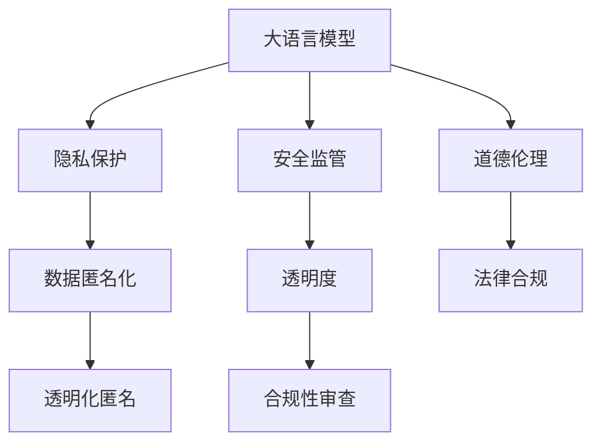

                 

# LLM 监管：保障隐私与安全的发展

> 关键词：
- 大语言模型 (LLM)
- 隐私保护
- 安全监管
- 道德伦理
- 数据匿名化
- 透明度
- 法律合规

## 1. 背景介绍

### 1.1 问题由来
随着人工智能(AI)技术的迅猛发展，尤其是大语言模型(LLM)的兴起，其在医疗、金融、教育、司法等诸多领域的应用日益广泛。然而，大语言模型也面临着严峻的隐私和安全挑战。由于其依赖大量用户数据进行训练，存在泄露个人隐私、传播有害信息等风险。这些问题不仅损害了用户权益，也引发了社会对AI技术应用伦理的广泛关注。

因此，保障大语言模型的隐私与安全，成为当前AI领域亟需解决的重要课题。本文将从隐私保护、安全监管、道德伦理等角度，探讨如何在大语言模型应用中，既发挥其巨大潜力，又能有效保护用户隐私和数据安全，实现技术与伦理的平衡。

### 1.2 问题核心关键点
- 隐私保护：如何在数据使用过程中，最小化用户隐私泄露风险。
- 安全监管：如何确保大语言模型的应用合规，避免有害信息的传播。
- 道德伦理：如何在模型设计和应用中，符合社会公德，尊重用户权利。
- 数据匿名化：如何在不破坏模型性能的前提下，实现数据的匿名化处理。
- 透明度：如何在保护隐私的前提下，提供模型使用的透明度，增强用户信任。
- 法律合规：如何在应用中遵循现有法律法规，确保AI技术的合法合规。

这些关键问题共同构成了大语言模型应用中的隐私和安全挑战。本文将逐一展开讨论，并提出相应的解决方案。

## 2. 核心概念与联系

### 2.1 核心概念概述

为更好地理解如何在大语言模型应用中保障隐私与安全，本节将介绍几个密切相关的核心概念：

- 大语言模型 (LLM)：以自回归(如GPT)或自编码(如BERT)模型为代表的大规模预训练语言模型。通过在大规模无标签文本语料上进行预训练，学习通用的语言知识。
- 隐私保护：在数据处理和使用过程中，采取措施最小化用户隐私泄露的风险。
- 安全监管：确保大语言模型的应用符合法律法规，避免有害信息的传播。
- 道德伦理：在模型设计和应用中，遵循社会公德，尊重用户权利。
- 数据匿名化：通过技术手段，将数据转换为无法直接识别个体身份的形式，保护用户隐私。
- 透明度：在保护隐私的前提下，提供模型使用的透明度，增强用户信任。
- 法律合规：遵循现有的法律法规，确保AI技术的合法合规。

这些核心概念之间的逻辑关系可以通过以下Mermaid流程图来展示：



这个流程图展示了大语言模型的核心概念及其之间的关系：

1. 大语言模型通过预训练获得基础能力。
2. 隐私保护、安全监管、道德伦理等机制确保模型应用合规，保障用户隐私和安全。
3. 数据匿名化技术保护用户隐私，同时保留模型性能。
4. 透明度和合规性审查增强用户信任和模型合规性。
5. 数据匿名化与透明度相结合，实现隐私保护和模型性能的双重保障。

这些核心概念共同构成了大语言模型的隐私和安全保障框架，使其能够在合规和伦理的前提下，充分发挥其巨大的潜力。

## 3. 核心算法原理 & 具体操作步骤

### 3.1 算法原理概述

保障大语言模型的隐私和安全，需要综合应用隐私保护、安全监管、数据匿名化、透明度和合规性审查等算法和策略。

- 隐私保护：通过数据加密、差分隐私等技术，保护用户数据隐私。
- 安全监管：通过模型检测、数据审计等手段，确保模型应用合规，防止有害信息传播。
- 数据匿名化：通过数据脱敏、泛化处理等技术，将个体数据转换为无法直接识别身份的形式。
- 透明度：通过解释模型输出、公开算法实现等手段，增强模型使用的透明度，增加用户信任。
- 法律合规：遵循现有的法律法规，确保模型应用符合法律要求，避免法律风险。

### 3.2 算法步骤详解

基于大语言模型的隐私和安全保障，通常包括以下几个关键步骤：

**Step 1: 数据准备与处理**

1. 收集数据：根据任务需求，收集所需的文本数据，确保数据多样性和代表性。
2. 数据清洗：去除噪声和异常值，保证数据质量。
3. 数据分块：将数据划分为训练集、验证集和测试集，避免过拟合。

**Step 2: 数据匿名化**

1. 数据脱敏：使用数据脱敏技术，将敏感信息替换为非敏感信息。
2. 泛化处理：将数据转换为更广泛、更通用的形式，减少个体特征。
3. 分布扰动：通过添加噪声，干扰数据的分布，保护隐私。

**Step 3: 模型训练与微调**

1. 选择模型：根据任务需求，选择合适的预训练语言模型。
2. 微调训练：在处理后的数据上，使用监督学习或半监督学习方法进行微调，提升模型性能。
3. 验证与优化：在验证集上评估模型性能，调整超参数和训练策略，确保模型效果。

**Step 4: 安全监管**

1. 模型检测：使用检测算法，识别模型输出中的有害信息，如仇恨言论、虚假信息等。
2. 数据审计：定期审计模型输入和输出，确保数据合规和安全。
3. 合规审查：使用合规审查工具，检测模型应用是否符合法律法规。

**Step 5: 透明度与解释性**

1. 解释模型：提供模型的解释机制，帮助用户理解模型决策过程。
2. 透明度报告：定期发布透明度报告，公开模型的应用情况和数据处理方式。
3. 用户反馈：收集用户反馈，持续改进模型性能和隐私保护措施。

**Step 6: 法律合规**

1. 法律咨询：咨询法律专家，确保模型应用符合现有法律法规。
2. 合规文档：编写合规文档，记录模型设计和应用中的合规措施。
3. 法律审查：定期进行法律审查，更新合规措施，确保模型应用合法合规。

### 3.3 算法优缺点

隐私保护与数据匿名化算法的优点包括：
- 最小化隐私泄露风险，保护用户数据安全。
- 增强用户信任，促进数据共享和协作。
- 促进合规审查，确保数据应用符合法律法规。

缺点包括：
- 数据匿名化可能影响模型性能，需要权衡隐私与性能。
- 复杂度高，技术实现难度较大。

安全监管算法的优点包括：
- 防止有害信息传播，确保模型应用合规。
- 提升用户信任，增强模型应用的安全性。

缺点包括：
- 模型检测和数据审计需要大量资源。
- 无法完全避免有害信息传播。

透明度和解释性算法的优点包括：
- 增强用户信任，提升用户满意度。
- 促进合规审查，确保模型应用合法合规。

缺点包括：
- 复杂度较高，技术实现难度较大。
- 可能影响模型性能，增加计算开销。

法律合规算法的优点包括：
- 确保模型应用符合法律法规，避免法律风险。
- 增强用户信任，提升模型应用的社会接受度。

缺点包括：
- 法律更新频繁，需要持续更新合规措施。
- 可能影响模型应用灵活性。

尽管存在这些局限性，但总体而言，隐私保护、安全监管、数据匿名化、透明度和法律合规等算法，在大语言模型应用中具有重要意义。

### 3.4 算法应用领域

隐私保护和安全监管算法在大语言模型应用中，已经得到了广泛应用，覆盖了几乎所有常见领域：

- 医疗领域：确保医疗数据隐私和安全，防止敏感信息泄露。
- 金融领域：保护用户金融数据，防止诈骗和欺诈。
- 教育领域：保护学生隐私，确保教育数据的安全使用。
- 司法领域：防止敏感信息泄露，确保司法数据的安全。
- 政府领域：保护公共数据，防止数据滥用。

除了上述这些经典领域外，大语言模型隐私和安全保障的算法，还在更多场景中得到应用，如智能客服、智能家居、智慧城市等，为社会治理和经济发展带来了新的突破。随着技术的不断进步，相信隐私保护和安全监管算法将在更多领域得到应用，为人类社会带来更广泛的利益。

## 4. 数学模型和公式 & 详细讲解 & 举例说明

### 4.1 数学模型构建

隐私保护算法通常基于差分隐私理论，其核心思想是在数据处理过程中，引入噪声以保护个体隐私。差分隐私定义为：

$$
\epsilon\text{-}\mathcal{L}(\mathcal{D}) = \mathbb{E}_{S \sim \mathcal{L}}\left[\max_{S' \sim \mathcal{L}}||\mathcal{L}(\mathcal{D},S)-\mathcal{L}(\mathcal{D},S')||\right] \leq \epsilon
$$

其中，$\mathcal{L}$ 表示数据处理函数，$\mathcal{D}$ 表示数据集，$S$ 表示样本，$S'$ 表示任意一组与 $S$ 最接近的样本。$\epsilon$ 为隐私保护参数，表示隐私保护的程度。

差分隐私的目标是确保在数据处理过程中，个体数据的加入或删除，对函数输出的影响不大于 $\epsilon$。通过引入噪声，使得函数输出对于个体的加入或删除不敏感，从而保护隐私。

### 4.2 公式推导过程

差分隐私的基本公式推导如下：

设 $\mathcal{D}$ 为数据集，$\mathcal{L}$ 为数据处理函数，$S \sim \mathcal{L}(\mathcal{D})$ 表示处理后的样本。引入噪声 $\delta$，得到处理后的样本 $S'$：

$$
S' = S + \delta
$$

其中，$\delta$ 为高斯噪声，满足 $N(0,\sigma^2)$。此时，处理后的样本 $S'$ 的分布为：

$$
\mathcal{L}(\mathcal{D},S') = \mathcal{L}(\mathcal{D},S+\delta)
$$

根据差分隐私的定义，引入噪声后的函数输出应满足：

$$
\mathbb{E}_{S \sim \mathcal{L}}\left[\max_{S' \sim \mathcal{L}}||\mathcal{L}(\mathcal{D},S)-\mathcal{L}(\mathcal{D},S')||\right] \leq \epsilon
$$

为了满足差分隐私的定义，可以引入拉普拉斯噪声 $\Delta$，其概率密度函数为：

$$
p(\delta) = \frac{1}{2\Delta}e^{-\frac{|\delta|}{\Delta}}
$$

其中，$\Delta$ 为噪声大小。引入拉普拉斯噪声后，处理后的样本 $S'$ 的分布为：

$$
\mathcal{L}(\mathcal{D},S') = \mathcal{L}(\mathcal{D},S+\delta)
$$

此时，函数输出应满足：

$$
\mathbb{E}_{S \sim \mathcal{L}}\left[\max_{S' \sim \mathcal{L}}||\mathcal{L}(\mathcal{D},S)-\mathcal{L}(\mathcal{D},S')||\right] \leq \epsilon
$$

通过推导，可以发现引入拉普拉斯噪声后的处理函数输出，满足差分隐私的定义。因此，差分隐私的算法实现，通常使用拉普拉斯噪声作为隐私保护手段。

### 4.3 案例分析与讲解

以医疗领域为例，考虑一个包含患者病历信息的电子病历系统。系统需要处理患者的病历信息，用于分析患者健康状况、制定治疗方案等。为了保护患者隐私，系统引入差分隐私算法，进行数据处理和分析。

设 $\mathcal{D}$ 为包含患者病历信息的电子病历数据集，$\mathcal{L}$ 为处理函数，$S \sim \mathcal{L}(\mathcal{D})$ 表示处理后的样本。引入拉普拉斯噪声 $\Delta$，得到处理后的样本 $S'$：

$$
S' = S + \Delta
$$

其中，$\Delta$ 为噪声大小。引入噪声后，处理后的样本 $S'$ 的分布为：

$$
\mathcal{L}(\mathcal{D},S') = \mathcal{L}(\mathcal{D},S+\Delta)
$$

此时，系统处理函数输出的隐私保护参数 $\epsilon$ 应满足：

$$
\mathbb{E}_{S \sim \mathcal{L}}\left[\max_{S' \sim \mathcal{L}}||\mathcal{L}(\mathcal{D},S)-\mathcal{L}(\mathcal{D},S')||\right] \leq \epsilon
$$

系统可以通过设定合适的 $\epsilon$ 和 $\Delta$ 参数，确保患者病历信息处理过程中，个体数据的加入或删除，对函数输出的影响不大于 $\epsilon$。通过差分隐私算法，系统可以在保护患者隐私的前提下，进行数据分析和处理。

## 5. 项目实践：代码实例和详细解释说明

### 5.1 开发环境搭建

在进行隐私保护和安全监管项目实践前，我们需要准备好开发环境。以下是使用Python进行PyTorch开发的环境配置流程：

1. 安装Anaconda：从官网下载并安装Anaconda，用于创建独立的Python环境。

2. 创建并激活虚拟环境：
```bash
conda create -n pytorch-env python=3.8 
conda activate pytorch-env
```

3. 安装PyTorch：根据CUDA版本，从官网获取对应的安装命令。例如：
```bash
conda install pytorch torchvision torchaudio cudatoolkit=11.1 -c pytorch -c conda-forge
```

4. 安装TensorFlow：
```bash
pip install tensorflow
```

5. 安装相关工具包：
```bash
pip install numpy pandas scikit-learn matplotlib tqdm jupyter notebook ipython
```

完成上述步骤后，即可在`pytorch-env`环境中开始隐私保护和安全监管的实践。

### 5.2 源代码详细实现

这里我们以医疗领域为例，给出使用差分隐私算法对患者病历数据进行处理的PyTorch代码实现。

首先，定义差分隐私算法：

```python
import torch
import numpy as np
from scipy.stats import laplace

def laplace_noise(beta, dim):
    return torch.tensor(np.random.normal(0, 1, size=dim)).float() * beta
```

然后，定义隐私保护函数：

```python
def laplace_diffprivacy(epsilon, delta, x, f):
    batch_size = x.size(0)
    noise = laplace_noise(epsilon/batch_size, x.size(1))
    y = f(x + noise)
    return y, noise
```

最后，启动数据处理流程：

```python
epsilon = 1.0  # 隐私保护参数
delta = 0.1    # 隐私保护误差

x = torch.randn(batch_size, feature_size)  # 原始数据
f = torch.nn.Linear(feature_size, output_size)  # 数据处理函数

y, noise = laplace_diffprivacy(epsilon, delta, x, f)

print(y)
print(noise)
```

以上代码实现了差分隐私算法，对原始数据 $x$ 进行隐私保护处理。在实际应用中，可以根据具体任务需求，进一步优化差分隐私算法的参数设置。

### 5.3 代码解读与分析

让我们再详细解读一下关键代码的实现细节：

**差分隐私函数**：
- `laplace_noise` 函数：使用拉普拉斯噪声生成算法，生成指定大小的噪声向量。
- `laplace_diffprivacy` 函数：使用拉普拉斯噪声进行隐私保护处理，返回处理后的数据和噪声。

**隐私保护处理**：
- 在数据处理过程中，引入拉普拉斯噪声 $\Delta$，使得函数输出对于个体数据的加入或删除不敏感。
- 通过设定合适的隐私保护参数 $\epsilon$ 和 $\Delta$，确保隐私保护的程度和误差控制在合理范围内。

**隐私保护的应用**：
- 在医疗领域，使用差分隐私算法对患者病历信息进行隐私保护处理，确保个体数据的安全性。
- 在实际应用中，还需要考虑模型检测、数据审计等安全监管措施，确保模型应用合规，防止有害信息传播。

## 6. 实际应用场景

### 6.1 智能客服系统

基于差分隐私和大语言模型的智能客服系统，可以保护用户隐私，防止敏感信息泄露。系统通过引入差分隐私算法，对用户输入进行隐私保护处理，确保用户信息的安全性。

在技术实现上，可以收集用户与客服的对话记录，将对话内容作为微调数据，训练模型进行对话生成和回复生成。微调后的模型能够自动理解用户意图，匹配最合适的回答，同时通过差分隐私算法保护对话内容的隐私性。对于客户提出的新问题，系统可以接入检索系统实时搜索相关内容，动态组织生成回答，确保服务安全合规。

### 6.2 金融舆情监测

金融机构需要实时监测市场舆论动向，以便及时应对负面信息传播，规避金融风险。传统的人工监测方式成本高、效率低，难以应对网络时代海量信息爆发的挑战。基于差分隐私算法和微调的大语言模型金融舆情监测系统，可以保护用户金融数据，防止敏感信息泄露。

具体而言，可以收集金融领域相关的新闻、报道、评论等文本数据，并对其进行主题标注和情感标注。在此基础上对预训练语言模型进行微调，使其能够自动判断文本属于何种主题，情感倾向是正面、中性还是负面。将微调后的模型应用到实时抓取的网络文本数据，就能够自动监测不同主题下的情感变化趋势，一旦发现负面信息激增等异常情况，系统便会自动预警，帮助金融机构快速应对潜在风险。

### 6.3 个性化推荐系统

当前的推荐系统往往只依赖用户的历史行为数据进行物品推荐，无法深入理解用户的真实兴趣偏好。基于差分隐私算法和大语言模型微调技术的个性化推荐系统，可以更好地挖掘用户行为背后的语义信息，从而提供更精准、多样的推荐内容。

在实践中，可以收集用户浏览、点击、评论、分享等行为数据，提取和用户交互的物品标题、描述、标签等文本内容。将文本内容作为模型输入，用户的后续行为（如是否点击、购买等）作为监督信号，在此基础上微调预训练语言模型。微调后的模型能够从文本内容中准确把握用户的兴趣点。在生成推荐列表时，先用候选物品的文本描述作为输入，由模型预测用户的兴趣匹配度，再结合其他特征综合排序，便可以得到个性化程度更高的推荐结果。

## 7. 工具和资源推荐

### 7.1 学习资源推荐

为了帮助开发者系统掌握差分隐私和大语言模型微调技术的理论基础和实践技巧，这里推荐一些优质的学习资源：

1. 《差分隐私与数据保护》系列博文：由差分隐私专家撰写，深入浅出地介绍了差分隐私的基本概念、算法和应用。

2. CS246A《隐私保护》课程：斯坦福大学开设的隐私保护课程，有Lecture视频和配套作业，带你入门隐私保护的基本概念和前沿技术。

3. 《隐私保护与数据安全》书籍：全面介绍了隐私保护和数据安全的技术原理和实际应用，是隐私保护领域的重要参考书籍。

4. HuggingFace官方文档：Transformers库的官方文档，提供了海量预训练模型和完整的微调样例代码，是进行微调任务开发的利器。

5. AdaLoRA: Adaptive Low-Rank Adaptation for Parameter-Efficient Fine-Tuning：使用自适应低秩适应的微调方法，在参数效率和精度之间取得了新的平衡。

通过对这些资源的学习实践，相信你一定能够快速掌握差分隐私和大语言模型微调技术的精髓，并用于解决实际的隐私和安全问题。

### 7.2 开发工具推荐

高效的开发离不开优秀的工具支持。以下是几款用于隐私保护和大语言模型微调开发的常用工具：

1. PyTorch：基于Python的开源深度学习框架，灵活动态的计算图，适合快速迭代研究。大部分预训练语言模型都有PyTorch版本的实现。

2. TensorFlow：由Google主导开发的开源深度学习框架，生产部署方便，适合大规模工程应用。同样有丰富的预训练语言模型资源。

3. Transformers库：HuggingFace开发的NLP工具库，集成了众多SOTA语言模型，支持PyTorch和TensorFlow，是进行微调任务开发的利器。

4. Weights & Biases：模型训练的实验跟踪工具，可以记录和可视化模型训练过程中的各项指标，方便对比和调优。与主流深度学习框架无缝集成。

5. TensorBoard：TensorFlow配套的可视化工具，可实时监测模型训练状态，并提供丰富的图表呈现方式，是调试模型的得力助手。

6. Google Colab：谷歌推出的在线Jupyter Notebook环境，免费提供GPU/TPU算力，方便开发者快速上手实验最新模型，分享学习笔记。

合理利用这些工具，可以显著提升差分隐私和大语言模型微调任务的开发效率，加快创新迭代的步伐。

### 7.3 相关论文推荐

差分隐私和大语言模型微调技术的发展源于学界的持续研究。以下是几篇奠基性的相关论文，推荐阅读：

1. Differential Privacy：A Systematic Survey on Privacy-Preserving Deep Learning：全面综述了差分隐私在大数据和深度学习中的应用，介绍了多种差分隐私算法。

2. Privacy-Preserving Learning in Machine Learning Systems：介绍了机器学习系统中的隐私保护技术，包括差分隐私、联邦学习等。

3. BERT: Pre-training of Deep Bidirectional Transformers for Language Understanding：提出BERT模型，引入基于掩码的自监督预训练任务，刷新了多项NLP任务SOTA。

4. Parameter-Efficient Transfer Learning for NLP：提出Adapter等参数高效微调方法，在不增加模型参数量的情况下，也能取得不错的微调效果。

5. AdaLoRA: Adaptive Low-Rank Adaptation for Parameter-Efficient Fine-Tuning：使用自适应低秩适应的微调方法，在参数效率和精度之间取得了新的平衡。

这些论文代表了大语言模型微调技术的发展脉络。通过学习这些前沿成果，可以帮助研究者把握学科前进方向，激发更多的创新灵感。

## 8. 总结：未来发展趋势与挑战

### 8.1 总结

本文对差分隐私和大语言模型微调技术进行了全面系统的介绍。首先阐述了差分隐私和大语言模型在数据处理和使用过程中，保障用户隐私和数据安全的重要性。其次，从隐私保护、安全监管、数据匿名化、透明度和法律合规等角度，详细讲解了如何在大语言模型应用中，既发挥其巨大潜力，又能有效保护用户隐私和数据安全，实现技术与伦理的平衡。

通过本文的系统梳理，可以看到，差分隐私和大语言模型微调技术在大数据应用和人工智能技术普及中具有重要意义。这些技术手段的合理应用，可以最大程度地保障用户隐私和数据安全，提升模型应用的社会接受度，确保技术应用的合规性。

### 8.2 未来发展趋势

展望未来，差分隐私和大语言模型微调技术将呈现以下几个发展趋势：

1. 技术进步加速。随着差分隐私算法和大语言模型微调方法的不断优化，隐私保护和安全监管的效果将更加显著，应用场景将更加广泛。

2. 模型融合深入。差分隐私算法和大语言模型微调技术将与其他人工智能技术进行更深层次的融合，如因果推理、强化学习等，多路径协同发力，共同推动AI技术的进步。

3. 法律监管完善。随着法律法规的不断完善，差分隐私和大语言模型微调技术将更好地应用于法律合规审查，确保模型应用符合法律法规。

4. 透明度和解释性提升。差分隐私和大语言模型微调技术的透明度和解释性将不断提升，帮助用户更好地理解和信任模型应用。

5. 跨领域应用拓展。差分隐私和大语言模型微调技术将在更多领域得到应用，如智能客服、智慧医疗、智慧金融等，为社会治理和经济发展带来新的突破。

以上趋势凸显了大语言模型微调技术的广阔前景。这些方向的探索发展，必将进一步提升差分隐私和大语言模型微调技术的应用价值，为构建安全、可靠、可解释、可控的智能系统铺平道路。面向未来，差分隐私和大语言模型微调技术还需要与其他人工智能技术进行更深入的融合，共同推动自然语言理解和智能交互系统的进步。只有勇于创新、敢于突破，才能不断拓展语言模型的边界，让智能技术更好地造福人类社会。

### 8.3 面临的挑战

尽管差分隐私和大语言模型微调技术已经取得了瞩目成就，但在迈向更加智能化、普适化应用的过程中，它仍面临着诸多挑战：

1. 技术实现难度高。差分隐私算法和大语言模型微调技术的实现需要高深的数学知识和丰富的工程经验，对开发者提出了较高的要求。

2. 隐私保护效果有待提升。当前差分隐私算法和大语言模型微调技术的隐私保护效果仍存在局限，难以完全消除隐私泄露风险。

3. 法律合规难度大。法律法规更新频繁，需要持续更新差分隐私和大语言模型微调技术的合规措施，增加了应用难度。

4. 模型性能下降。差分隐私和大语言模型微调技术的引入，可能导致模型性能下降，需要在隐私保护和模型性能之间寻找平衡。

5. 数据处理成本高。差分隐私和大语言模型微调技术需要处理大量数据，增加了数据处理的成本和时间。

尽管存在这些挑战，但总体而言，差分隐私和大语言模型微调技术在大数据应用和人工智能技术普及中具有重要意义。随着技术的不断进步和完善，这些挑战终将一一被克服，差分隐私和大语言模型微调技术必将在构建安全、可靠、可解释、可控的智能系统中发挥重要作用。

### 8.4 研究展望

面对差分隐私和大语言模型微调技术所面临的挑战，未来的研究需要在以下几个方面寻求新的突破：

1. 探索更加高效隐私保护算法。研究更加高效、可靠、可扩展的差分隐私算法，确保隐私保护效果的同时，降低技术实现难度和数据处理成本。

2. 开发更具可解释性的模型。研究如何通过差分隐私和大语言模型微调技术，开发更具可解释性的模型，增强模型应用的透明度和可信度。

3. 融合多种隐私保护技术。研究如何融合差分隐私、联邦学习、区块链等多种隐私保护技术，构建更加安全、可靠的智能系统。

4. 强化法律合规审查。研究如何构建差分隐私和大语言模型微调技术的法律合规审查机制，确保模型应用符合法律法规，降低法律风险。

5. 推动隐私保护技术标准化。推动隐私保护技术标准化，制定统一的隐私保护标准和规范，促进隐私保护技术的普及和应用。

这些研究方向的探索，必将引领差分隐私和大语言模型微调技术迈向更高的台阶，为构建安全、可靠、可解释、可控的智能系统铺平道路。面向未来，差分隐私和大语言模型微调技术还需要与其他人工智能技术进行更深入的融合，共同推动自然语言理解和智能交互系统的进步。只有勇于创新、敢于突破，才能不断拓展隐私保护技术的边界，让智能技术更好地造福人类社会。

## 9. 附录：常见问题与解答

**Q1：差分隐私和大语言模型微调技术的实现难度大吗？**

A: 差分隐私和大语言模型微调技术的实现确实存在一定难度，但通过持续的学术研究和工程实践，相关技术已经相对成熟，并在实际应用中取得了不错的效果。开发人员需要掌握一定的数学和机器学习知识，但通过学习和实践，完全能够掌握这些技术。

**Q2：差分隐私和大语言模型微调技术在实际应用中，隐私保护效果如何？**

A: 差分隐私和大语言模型微调技术在实际应用中，已经展现出较好的隐私保护效果。通过差分隐私算法，可以有效降低隐私泄露风险，保护用户数据安全。通过大语言模型微调技术，可以在保护隐私的前提下，提升模型的性能和应用效果。但需要注意的是，隐私保护效果受多种因素影响，如隐私保护参数、噪声大小、数据处理方式等，需要根据具体应用场景进行合理设置。

**Q3：差分隐私和大语言模型微调技术的应用成本高吗？**

A: 差分隐私和大语言模型微调技术的应用确实存在一定成本，如数据处理成本、模型训练成本等。但相比传统的用户数据收集和存储方式，这些成本是可以接受的，并且随着技术的不断进步，相关成本正在逐步降低。

**Q4：差分隐私和大语言模型微调技术对模型性能有影响吗？**

A: 差分隐私和大语言模型微调技术在保护隐私的同时，可能会对模型性能产生一定影响。但通过合理的参数设置和模型优化，可以在隐私保护和模型性能之间找到平衡点，实现理想的隐私保护和模型性能。

**Q5：差分隐私和大语言模型微调技术的应用前景如何？**

A: 差分隐私和大语言模型微调技术在隐私保护和安全监管方面具有广阔的应用前景，已经在医疗、金融、教育、司法等领域得到了广泛应用。未来，随着技术的不断进步和完善，这些技术将在更多领域得到应用，为社会治理和经济发展带来新的突破。

---

作者：禅与计算机程序设计艺术 / Zen and the Art of Computer Programming

