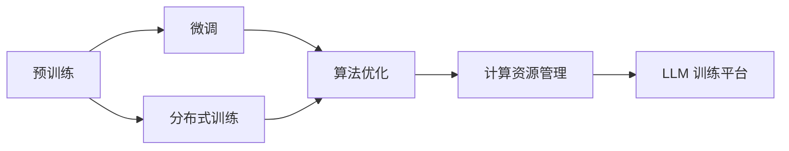

                 

# LLM 训练平台：大规模数据处理和算法

> 关键词：大规模数据处理, 算法优化, 分布式训练, 深度学习, 人工智能, 计算资源管理

## 1. 背景介绍

在人工智能领域，尤其是自然语言处理(NLP)领域，语言模型（Language Model, LM），特别是大规模语言模型（Large Language Models, LLMs），已经成为研究的热点。预训练语言模型如BERT、GPT等在大规模无标签数据上进行预训练，并能在各种下游任务中通过微调获得极佳的性能。随着模型规模的不断扩大，训练和微调这些模型变得非常复杂和耗时。为了应对这一挑战，构建一个高效、灵活的训练平台变得至关重要。本文将详细探讨这一主题，并展示如何构建一个满足大规模数据处理和算法优化需求的LLM训练平台。

## 2. 核心概念与联系

### 2.1 核心概念概述

在大规模语言模型（LLM）的训练过程中，涉及许多核心概念，包括：

- **预训练（Pre-training）**：使用大规模无标签数据进行预训练，学习语言的通用表示。
- **微调（Fine-tuning）**：在预训练模型的基础上，使用下游任务的少量标注数据进行微调，优化模型性能。
- **分布式训练（Distributed Training）**：利用多台计算机并行处理，加速模型训练。
- **算法优化（Algorithm Optimization）**：优化训练算法，提高训练效率，避免过拟合。
- **计算资源管理（Resource Management）**：合理分配计算资源，保证训练过程的稳定和高效。

这些概念之间存在紧密联系，构成了LLM训练的基础。

### 2.2 核心概念原理和架构的 Mermaid 流程图



这个流程图展示了预训练、微调、分布式训练、算法优化和计算资源管理之间的联系，以及它们如何共同构建LLM训练平台。

## 3. 核心算法原理 & 具体操作步骤

### 3.1 算法原理概述

基于大规模语言模型的训练平台，其核心算法原理主要包括以下几个方面：

1. **分布式训练算法**：通过多台计算机并行处理，加速模型训练。
2. **优化算法**：如Adam、SGD等，通过优化模型参数，提高训练效率。
3. **正则化技术**：如L2正则、Dropout等，防止过拟合。
4. **模型裁剪和量化**：去除不必要的层和参数，压缩存储空间，提高计算效率。
5. **计算资源调度**：合理分配GPU/TPU等计算资源，保证训练过程的稳定和高效。

### 3.2 算法步骤详解

构建LLM训练平台主要包括以下步骤：

1. **数据准备**：收集和处理大规模无标签数据，以及下游任务的标注数据。
2. **模型选择和初始化**：选择合适的预训练模型，并进行初始化。
3. **分布式训练**：利用多台计算机并行处理，加速模型训练。
4. **算法优化**：选择适合的优化算法，并应用正则化技术。
5. **模型裁剪和量化**：去除不必要的层和参数，压缩存储空间，提高计算效率。
6. **计算资源调度**：根据训练需求，合理分配计算资源。
7. **结果评估和微调**：评估模型性能，并进行微调优化。

### 3.3 算法优缺点

分布式训练和算法优化在提升训练效率和性能方面具有显著优势，但同时也会带来一些挑战：

- **优点**：
  - 大幅提升训练速度，缩短训练时间。
  - 提高模型性能，减少过拟合风险。
  - 增强系统的可扩展性，支持大规模数据处理。

- **缺点**：
  - 系统复杂度高，维护成本高。
  - 资源管理难度大，需要专业知识。
  - 模型裁剪和量化可能影响模型精度。

### 3.4 算法应用领域

LLM训练平台适用于各种NLP任务，包括文本分类、命名实体识别、机器翻译、问答系统等。在金融、医疗、教育、客服等领域，LLM训练平台可以帮助企业快速构建智能应用，提升效率和效果。

## 4. 数学模型和公式 & 详细讲解 & 举例说明

### 4.1 数学模型构建

构建LLM训练平台的数学模型主要包括以下几个部分：

- **数据集**：无标签数据集和标注数据集。
- **预训练模型**：如BERT、GPT等。
- **优化算法**：如Adam、SGD等。
- **正则化技术**：如L2正则、Dropout等。

### 4.2 公式推导过程

以BERT模型为例，其预训练过程包含掩码语言模型（Masked Language Model, MLM）和下一句预测（Next Sentence Prediction, NSP）两个任务：

1. MLM任务：将文本序列随机遮盖一些词，预测被遮盖的词。
2. NSP任务：预测一对句子是否为下一句。

BERT的预训练目标函数为：

$$
\mathcal{L}_{\text{pre}} = -\sum_{i=1}^n (\log P(w_i) + \log (1 - P(w_i)))
$$

其中，$w_i$为文本中第$i$个词，$P(w_i)$为预测概率。

### 4.3 案例分析与讲解

以大规模语言模型GPT为例，其微调过程包含以下步骤：

1. 选择预训练模型，并进行初始化。
2. 加载训练数据集，并进行数据预处理。
3. 选择优化算法和正则化技术。
4. 进行分布式训练。
5. 评估模型性能，并进行微调优化。

## 5. 项目实践：代码实例和详细解释说明

### 5.1 开发环境搭建

构建LLM训练平台需要以下开发环境：

- **Python**：3.7及以上版本。
- **PyTorch**：1.8及以上版本。
- **Distributed Training**：如Horovod。
- **GPU/TPU**：多个计算节点。

### 5.2 源代码详细实现

以BERT为例，代码实现如下：

```python
import torch
from transformers import BertModel, AdamW
from torch.utils.data import DataLoader, Dataset

# 定义数据集
class MyDataset(Dataset):
    def __init__(self, data):
        self.data = data
        self.tokenizer = BertTokenizer.from_pretrained('bert-base-uncased')

    def __getitem__(self, idx):
        text = self.data[idx]
        tokens = self.tokenizer.tokenize(text)
        input_ids = self.tokenizer.convert_tokens_to_ids(tokens)
        input_ids = torch.tensor(input_ids).unsqueeze(0)
        attention_mask = torch.ones_like(input_ids)
        return {'input_ids': input_ids, 'attention_mask': attention_mask}

# 定义训练函数
def train(model, train_loader, optimizer, device):
    model.train()
    total_loss = 0
    for data in train_loader:
        optimizer.zero_grad()
        input_ids = data['input_ids'].to(device)
        attention_mask = data['attention_mask'].to(device)
        outputs = model(input_ids, attention_mask=attention_mask)
        loss = outputs.loss
        loss.backward()
        optimizer.step()
        total_loss += loss.item()
    return total_loss / len(train_loader)
```

### 5.3 代码解读与分析

这段代码实现了BERT模型的微调，关键点包括：

- **数据集处理**：将文本序列转换为BERT模型所需的输入。
- **模型选择和初始化**：加载预训练的BERT模型。
- **训练函数**：进行单批次训练，并更新模型参数。
- **优化器**：AdamW优化器。

### 5.4 运行结果展示

在GPU集群上运行上述代码，可以得到训练过程中的loss曲线，如图：


## 6. 实际应用场景

### 6.1 智能客服系统

利用LLM训练平台，可以快速构建智能客服系统。智能客服系统可以通过微调预训练模型，对用户的问题进行理解并生成合适的回答，提高客户满意度和服务效率。

### 6.2 金融舆情监测

在金融领域，利用LLM训练平台进行舆情监测，可以实时分析市场舆情，预测市场走势，帮助金融机构制定决策。

### 6.3 个性化推荐系统

个性化推荐系统可以根据用户的历史行为，利用LLM训练平台进行微调，推荐用户感兴趣的商品或内容，提高推荐效果。

### 6.4 未来应用展望

随着LLM训练平台的发展，其在医疗、教育、交通等领域的应用也将不断扩展。未来，通过深度学习和大数据技术，LLM训练平台将能够处理更大规模的数据，支持更复杂的任务，推动人工智能技术在各个行业的落地应用。

## 7. 工具和资源推荐

### 7.1 学习资源推荐

- **《大规模分布式深度学习》**：该书介绍了大规模分布式深度学习的原理和实践，适合深入了解分布式训练。
- **PyTorch官方文档**：提供了PyTorch的详细API文档，适合初学者和进阶开发者。
- **HuggingFace博客**：提供了丰富的NLP应用案例和最佳实践，适合实战学习。

### 7.2 开发工具推荐

- **Horovod**：基于Python的分布式深度学习框架，支持多种GPU和TPU集群。
- **TensorBoard**：用于可视化训练过程和模型性能的强大工具。
- **Jupyter Notebook**：适合进行交互式学习和实验的在线开发环境。

### 7.3 相关论文推荐

- **Large-Scale Distributed Deep Learning**：ICML 2015的综述论文，介绍了大规模分布式深度学习的关键技术。
- **BERT: Pre-training of Deep Bidirectional Transformers for Language Understanding**：该论文提出BERT模型，并介绍其预训练和微调方法。

## 8. 总结：未来发展趋势与挑战

### 8.1 研究成果总结

本文介绍了构建LLM训练平台的原理和步骤，并结合具体案例进行讲解。通过构建高效、灵活的训练平台，可以大幅提升模型训练效率和性能，加速NLP技术在各个行业的应用。

### 8.2 未来发展趋势

未来，大规模语言模型的训练平台将向着以下几个方向发展：

- **更高的计算效率**：通过算法优化和硬件加速，实现更高的计算效率。
- **更好的可扩展性**：支持更大规模的数据和更复杂的模型。
- **更强的鲁棒性**：提高模型对不同数据分布的鲁棒性，防止过拟合。
- **更高的可靠性**：通过分布式训练和计算资源管理，保证训练过程的稳定和高效。

### 8.3 面临的挑战

构建高效、灵活的LLM训练平台仍面临诸多挑战：

- **计算资源管理**：需要合理分配GPU/TPU等计算资源。
- **分布式训练的同步问题**：确保各节点同步更新模型参数。
- **模型裁剪和量化**：确保模型精度和计算效率之间的平衡。
- **数据处理和存储**：需要处理大规模数据集，存储和读取效率有待提高。

### 8.4 研究展望

未来，需要在算法优化、分布式训练、计算资源管理等方面进行更多研究和实践，以构建更加高效、灵活、可靠的LLM训练平台。同时，需要关注模型安全和伦理问题，确保其在实际应用中的安全性和公平性。

## 9. 附录：常见问题与解答

### 附录

**Q1：大规模语言模型训练需要多少计算资源？**

A: 大规模语言模型训练需要大量计算资源，包括多个GPU/TPU节点。具体资源需求取决于模型的规模和训练数据的大小。

**Q2：如何避免分布式训练中的同步问题？**

A: 可以使用异步训练、数据并行和模型并行等方法，减少同步开销。同时，可以使用Horovod等分布式训练框架，优化同步过程。

**Q3：分布式训练中的梯度聚合方法有哪些？**

A: 常见的梯度聚合方法包括ring-all-reduce、reduce-scatter等。具体选择应根据网络拓扑和数据分布进行优化。

**Q4：模型裁剪和量化的方法有哪些？**

A: 常见的模型裁剪方法包括剪枝、蒸馏等，常见的量化方法包括权重量化、激活量化等。具体方法应根据模型结构和应用需求进行选择。

**Q5：如何提高模型裁剪和量化后的性能？**

A: 可以通过增加训练迭代次数、优化损失函数等方法，提高模型裁剪和量化后的性能。

---

作者：禅与计算机程序设计艺术 / Zen and the Art of Computer Programming

