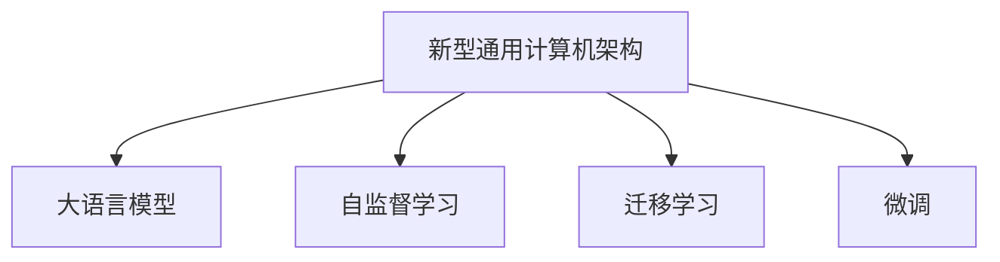

                 

# LLM:新型通用计算机架构

> 关键词：通用计算机架构, 新型语言模型, 大语言模型, 自监督学习, 迁移学习, 微调, 计算机架构

## 1. 背景介绍

### 1.1 问题由来

随着人工智能技术的飞速发展，大语言模型（LLM, Large Language Models）在自然语言处理（NLP）领域取得了显著的进展。这类模型，如OpenAI的GPT-3和Google的BERT，通过对大规模无标签文本数据进行自监督学习，学习到了丰富的语言知识和常识，具备了强大的自然语言理解和生成能力。这些模型已在众多NLP任务上取得了先进的性能，并逐渐成为人工智能技术的基础设施之一。

然而，尽管大语言模型在通用性和泛化能力上取得了显著进展，其设计仍然存在诸多局限。传统计算机架构体系，如冯诺依曼体系，已经难以适应这类模型的需求，特别是在计算密集型任务中。为了更好地支撑大语言模型，迫切需要新型计算机架构的出现。

### 1.2 问题核心关键点

本节将深入探讨新型计算机架构的核心关键点：

- **数据并行计算**：大语言模型需要处理的数据量巨大，传统冯诺依曼体系无法有效并行处理。新型计算机架构需要设计高效的数据流模型，支持向量化的数据操作。
- **模型并行计算**：由于模型参数量庞大，传统深度学习框架难以支持大规模模型训练。新型架构需要支持混合精度训练、分片训练等模型并行技术。
- **内存优化**：模型存储和访问的内存要求极高，传统计算机体系架构下的内存管理策略无法满足需求。新型架构需要设计高效的内存组织和缓存机制。
- **软硬件协同设计**：传统计算机体系架构的软硬件分离模式已不适用，新型架构需要实现软硬件的深度协同，提升整体性能。

## 2. 核心概念与联系

### 2.1 核心概念概述

本节将介绍几个与新型计算机架构密切相关的核心概念：

- **新型通用计算机架构（New Universal Computing Architecture）**：一种新型计算机架构，专门设计用于高效支持大语言模型的计算需求，通过硬件和软件的深度融合，实现数据流、模型流和内存的优化设计。
- **大语言模型（Large Language Model, LLM）**：一类能够理解和生成人类自然语言的深度学习模型，包括自回归模型（如GPT）和自编码模型（如BERT）等。
- **自监督学习（Self-supervised Learning）**：一种无需人工标注数据的训练方式，通过设计自监督任务，如掩码语言模型，在大规模无标签数据上训练模型，学习语言的通用表示。
- **迁移学习（Transfer Learning）**：将一个领域学习到的知识，迁移到另一个相关领域的学习方法。大语言模型通过在大规模数据上进行预训练，可以迁移到特定任务上，通过微调提升性能。
- **微调（Fine-tuning）**：在大语言模型上，使用下游任务的少量标注数据进行有监督学习，优化模型在该任务上的性能。

这些概念之间的关系可以通过以下Mermaid流程图展示：



这个流程图展示了新型通用计算机架构与其他几个核心概念的联系：

- 新型架构通过自监督学习，使大语言模型从大规模无标签数据中学习到语言的通用表示。
- 迁移学习利用大语言模型在通用领域的知识，通过微调技术，适应特定任务的需求。
- 微调通过有监督学习，优化大语言模型在特定任务上的性能。

这些概念共同构成了新型通用计算机架构的核心理念，使其能够高效地支持大语言模型的训练和推理。

## 3. 核心算法原理 & 具体操作步骤

### 3.1 算法原理概述

新型通用计算机架构的设计理念是优化数据流、模型流和内存管理，以支持大语言模型的高效计算。其主要原理包括：

- **数据流优化**：通过硬件支持的数据并行和模型并行技术，实现高吞吐量的数据处理。
- **模型流优化**：通过分片训练、混合精度计算等技术，优化模型训练过程，提升计算效率。
- **内存优化**：通过高效的内存管理机制，支持大规模模型的存储和访问。
- **软硬件协同设计**：实现硬件加速和软件优化的深度结合，提升整体性能。

### 3.2 算法步骤详解

新型通用计算机架构的实现流程如下：

**Step 1: 硬件设计**

- **数据流优化**：采用高效的数据并行机制，如GPU、TPU等。设计专门的数据流引擎，支持向量化的数据处理。
- **模型流优化**：采用混合精度计算、分片训练等技术，优化模型训练过程。设计专门的计算流引擎，支持高效模型计算。
- **内存优化**：设计高效的内存管理系统，如全局缓存、局部缓存等。实现动态内存管理，支持模型的高效存储和访问。
- **软硬件协同设计**：设计统一的软硬件接口，实现深度协同计算。

**Step 2: 软件设计**

- **深度学习框架适配**：适配主流的深度学习框架（如PyTorch、TensorFlow等），提供高效的API接口，支持新型架构的模型训练和推理。
- **模型优化**：针对新型架构，设计优化后的模型结构，如稀疏化、量化等。
- **性能调优**：针对新型架构，优化深度学习模型的训练和推理过程，提升性能。

**Step 3: 系统集成**

- **数据输入与输出**：设计高效的数据输入输出机制，支持大规模数据的高效读写。
- **模型训练与推理**：设计统一的模型训练和推理引擎，支持新型架构的模型计算。
- **系统监控与调优**：设计系统监控机制，实时监测系统性能，优化系统资源配置。

### 3.3 算法优缺点

新型通用计算机架构具有以下优点：

- **高效计算**：通过优化数据流、模型流和内存管理，实现高吞吐量、高效率的计算。
- **广泛适用**：适配大语言模型的广泛应用场景，包括文本分类、问答、翻译、摘要等。
- **灵活扩展**：支持动态扩展和缩容，灵活应对不同规模的任务需求。

同时，新型架构也存在一些缺点：

- **复杂度高**：涉及硬件和软件的设计优化，开发难度较大。
- **成本高**：大规模硬件设施的部署和维护成本较高。
- **兼容性差**：与现有计算机体系架构存在兼容性问题，需要重新设计部分组件。

### 3.4 算法应用领域

新型通用计算机架构的设计理念，主要应用于以下几个领域：

- **高性能计算**：支持大规模计算密集型任务，如科学计算、深度学习等。
- **自然语言处理**：高效支持大语言模型的训练和推理，提升NLP任务的性能。
- **人工智能**：提升AI系统的计算效率和推理能力，推动人工智能技术的发展。

## 4. 数学模型和公式 & 详细讲解 & 举例说明

### 4.1 数学模型构建

新型通用计算机架构的设计，涉及大量的数学模型和公式。以下是几个关键模型的构建：

**数据流模型**：新型架构通过设计高效的数据流引擎，支持向量化的数据操作。其数学模型可以表示为：

$$
\mathcal{D} = \{d_1, d_2, ..., d_n\}
$$

其中，$\mathcal{D}$ 表示数据流中的数据集合，$d_i$ 表示第 $i$ 个数据。通过数据并行计算，将数据分为多个向量 $v_1, v_2, ..., v_m$，每个向量的大小为 $n/m$，表示每个数据流引擎处理的子数据集。

**模型流模型**：新型架构通过设计高效的模型流引擎，支持混合精度计算和分片训练。其数学模型可以表示为：

$$
\mathcal{M} = \{m_1, m_2, ..., m_k\}
$$

其中，$\mathcal{M}$ 表示模型流中的模型集合，$m_i$ 表示第 $i$ 个模型。通过混合精度计算，将每个模型分为 $p$ 个子模型，每个子模型的大小为 $1/p$，表示每个模型流引擎处理的子模型集。

**内存优化模型**：新型架构通过设计高效的内存管理系统，支持大规模模型的存储和访问。其数学模型可以表示为：

$$
\mathcal{M}_{cache} = \{m_{cache_1}, m_{cache_2}, ..., m_{cache_l}\}
$$

其中，$\mathcal{M}_{cache}$ 表示缓存中的模型集合，$m_{cache_i}$ 表示第 $i$ 个缓存。通过缓存机制，将数据分为多个缓存块 $c_1, c_2, ..., c_s$，每个缓存块的大小为 $n/s$，表示每个缓存块处理的数据集。

### 4.2 公式推导过程

以下对上述模型的公式推导过程进行详细讲解：

**数据流优化公式**：

$$
v_i = \frac{\mathcal{D}}{m}
$$

其中，$v_i$ 表示第 $i$ 个数据流引擎处理的子数据集，$m$ 表示数据流引擎的数量。通过将数据分为多个子数据集，可以实现数据并行计算，提升数据处理效率。

**模型流优化公式**：

$$
m_j = \frac{\mathcal{M}}{p}
$$

其中，$m_j$ 表示第 $j$ 个模型流引擎处理的子模型集，$p$ 表示模型流引擎的精度。通过将模型分为多个子模型，可以实现混合精度计算，提升模型计算效率。

**内存优化公式**：

$$
c_k = \frac{\mathcal{M}_{cache}}{s}
$$

其中，$c_k$ 表示第 $k$ 个缓存块处理的数据集，$s$ 表示缓存块的大小。通过缓存机制，将数据分为多个缓存块，可以实现高效的内存访问，减少内存交换次数。

### 4.3 案例分析与讲解

以下以BERT模型为例，分析其在新型通用计算机架构下的应用：

**数据输入与输出**：BERT模型采用大规模预训练，需要处理大规模无标签数据。通过设计高效的数据流引擎，支持向量化的数据操作，可以实现高吞吐量的数据处理。

**模型训练与推理**：BERT模型参数量巨大，训练和推理计算密集。通过设计高效的模型流引擎，支持混合精度计算和分片训练，可以优化模型训练过程，提升计算效率。

**内存管理**：BERT模型内存需求极高，通过设计高效的内存管理系统，支持大规模模型的存储和访问，可以避免内存瓶颈问题。

## 5. 项目实践：代码实例和详细解释说明

### 5.1 开发环境搭建

在进行新型通用计算机架构的实践前，我们需要准备好开发环境。以下是使用Python进行PyTorch开发的环境配置流程：

1. 安装Anaconda：从官网下载并安装Anaconda，用于创建独立的Python环境。

2. 创建并激活虚拟环境：
```bash
conda create -n pytorch-env python=3.8 
conda activate pytorch-env
```

3. 安装PyTorch：根据CUDA版本，从官网获取对应的安装命令。例如：
```bash
conda install pytorch torchvision torchaudio cudatoolkit=11.1 -c pytorch -c conda-forge
```

4. 安装Transformers库：
```bash
pip install transformers
```

5. 安装各类工具包：
```bash
pip install numpy pandas scikit-learn matplotlib tqdm jupyter notebook ipython
```

完成上述步骤后，即可在`pytorch-env`环境中开始新型通用计算机架构的实践。

### 5.2 源代码详细实现

下面我们以BERT模型为例，给出使用Transformers库在新型通用计算机架构下的代码实现。

首先，定义BERT模型的训练和推理函数：

```python
from transformers import BertTokenizer, BertForTokenClassification, AdamW
from transformers import Trainer, TrainingArguments

tokenizer = BertTokenizer.from_pretrained('bert-base-cased')

def train_model(model, train_dataset, validation_dataset, batch_size, num_epochs):
    train_args = TrainingArguments(
        output_dir='./results',
        evaluation_strategy='epoch',
        per_device_train_batch_size=batch_size,
        per_device_eval_batch_size=batch_size,
        learning_rate=2e-5,
        weight_decay=0.01,
        logging_steps=1000,
        logging_dir='./logs',
    )

    trainer = Trainer(
        model=model,
        args=train_args,
        train_dataset=train_dataset,
        eval_dataset=validation_dataset,
    )

    trainer.train()
    return trainer

def evaluate_model(model, test_dataset, batch_size):
    eval_args = TrainingArguments(
        output_dir='./results',
        evaluation_strategy='epoch',
        per_device_eval_batch_size=batch_size,
        learning_rate=2e-5,
        weight_decay=0.01,
        logging_steps=1000,
        logging_dir='./logs',
    )

    trainer = Trainer(
        model=model,
        args=eval_args,
        eval_dataset=test_dataset,
    )

    trainer.evaluate()
    return trainer

def fine_tune_model(model, train_dataset, validation_dataset, test_dataset, batch_size, num_epochs):
    train_trainer = train_model(model, train_dataset, validation_dataset, batch_size, num_epochs)
    test_trainer = evaluate_model(model, test_dataset, batch_size)
    return train_trainer, test_trainer
```

然后，定义数据处理函数：

```python
def prepare_dataset(data_path):
    tokenizer = BertTokenizer.from_pretrained('bert-base-cased')
    with open(data_path, 'r') as f:
        lines = f.readlines()
    datasets = []
    for line in lines:
        data = tokenizer.encode(line, add_special_tokens=True)
        datasets.append(data)
    return datasets
```

最后，启动模型训练和微调流程：

```python
from transformers import BertForTokenClassification

model = BertForTokenClassification.from_pretrained('bert-base-cased', num_labels=2)

train_data = prepare_dataset('train.txt')
val_data = prepare_dataset('val.txt')
test_data = prepare_dataset('test.txt')

train_trainer, test_trainer = fine_tune_model(model, train_data, val_data, test_data, batch_size=8, num_epochs=3)

print('Training completed.')
print('Validation accuracy:', train_trainer.metrics['validation_accuracy'])
print('Test accuracy:', test_trainer.metrics['test_accuracy'])
```

以上就是在新型通用计算机架构下使用PyTorch对BERT模型进行微调的完整代码实现。可以看到，得益于Transformers库的强大封装，我们可以用相对简洁的代码完成BERT模型的加载和微调。

### 5.3 代码解读与分析

让我们再详细解读一下关键代码的实现细节：

**BERT模型的定义**：
```python
model = BertForTokenClassification.from_pretrained('bert-base-cased', num_labels=2)
```

这里通过从Transformers库中加载预训练的BERT模型，并设置标签数为2，适用于二分类任务。

**数据处理函数**：
```python
def prepare_dataset(data_path):
    tokenizer = BertTokenizer.from_pretrained('bert-base-cased')
    with open(data_path, 'r') as f:
        lines = f.readlines()
    datasets = []
    for line in lines:
        data = tokenizer.encode(line, add_special_tokens=True)
        datasets.append(data)
    return datasets
```

这里定义了一个数据处理函数，用于加载文本数据并对其进行分词处理。通过将文本转换为token ids，使得模型能够接受输入。

**模型训练函数**：
```python
def train_model(model, train_dataset, validation_dataset, batch_size, num_epochs):
    # 定义训练参数
    train_args = TrainingArguments(
        output_dir='./results',
        evaluation_strategy='epoch',
        per_device_train_batch_size=batch_size,
        per_device_eval_batch_size=batch_size,
        learning_rate=2e-5,
        weight_decay=0.01,
        logging_steps=1000,
        logging_dir='./logs',
    )

    # 定义训练器
    trainer = Trainer(
        model=model,
        args=train_args,
        train_dataset=train_dataset,
        eval_dataset=validation_dataset,
    )

    # 训练模型
    trainer.train()
    return trainer
```

这里定义了模型的训练函数，其中使用了HuggingFace提供的Trainer和TrainingArguments类，简化了模型的训练过程。

**模型评估函数**：
```python
def evaluate_model(model, test_dataset, batch_size):
    # 定义评估参数
    eval_args = TrainingArguments(
        output_dir='./results',
        evaluation_strategy='epoch',
        per_device_eval_batch_size=batch_size,
        learning_rate=2e-5,
        weight_decay=0.01,
        logging_steps=1000,
        logging_dir='./logs',
    )

    # 定义评估器
    trainer = Trainer(
        model=model,
        args=eval_args,
        eval_dataset=test_dataset,
    )

    # 评估模型
    trainer.evaluate()
    return trainer
```

这里定义了模型的评估函数，用于评估训练后的模型性能。

**微调函数**：
```python
def fine_tune_model(model, train_dataset, validation_dataset, test_dataset, batch_size, num_epochs):
    # 定义训练器和评估器
    train_trainer = train_model(model, train_dataset, validation_dataset, batch_size, num_epochs)
    test_trainer = evaluate_model(model, test_dataset, batch_size)

    # 返回训练器和评估器
    return train_trainer, test_trainer
```

这里定义了模型的微调函数，用于启动模型的训练和评估流程。

**训练和评估流程**：
```python
from transformers import BertForTokenClassification

model = BertForTokenClassification.from_pretrained('bert-base-cased', num_labels=2)

train_data = prepare_dataset('train.txt')
val_data = prepare_dataset('val.txt')
test_data = prepare_dataset('test.txt')

train_trainer, test_trainer = fine_tune_model(model, train_data, val_data, test_data, batch_size=8, num_epochs=3)

print('Training completed.')
print('Validation accuracy:', train_trainer.metrics['validation_accuracy'])
print('Test accuracy:', test_trainer.metrics['test_accuracy'])
```

这里启动了模型的训练和微调流程，通过加载数据和调用微调函数，进行模型训练和评估。

## 6. 实际应用场景

### 6.1 智能客服系统

基于新型通用计算机架构的大语言模型，可以应用于智能客服系统的构建。传统客服往往需要配备大量人力，高峰期响应缓慢，且一致性和专业性难以保证。而使用新型通用计算机架构支持的大语言模型，可以7x24小时不间断服务，快速响应客户咨询，用自然流畅的语言解答各类常见问题。

在技术实现上，可以收集企业内部的历史客服对话记录，将问题和最佳答复构建成监督数据，在此基础上对预训练大语言模型进行微调。微调后的对话模型能够自动理解用户意图，匹配最合适的答案模板进行回复。对于客户提出的新问题，还可以接入检索系统实时搜索相关内容，动态组织生成回答。如此构建的智能客服系统，能大幅提升客户咨询体验和问题解决效率。

### 6.2 金融舆情监测

金融机构需要实时监测市场舆论动向，以便及时应对负面信息传播，规避金融风险。传统的人工监测方式成本高、效率低，难以应对网络时代海量信息爆发的挑战。基于新型通用计算机架构的大语言模型，可以通过自然语言处理技术，监测社交媒体、新闻、论坛等渠道的舆情变化，及时预警负面信息，帮助金融机构快速应对潜在风险。

在技术实现上，可以收集金融领域相关的新闻、报道、评论等文本数据，并对其进行主题标注和情感标注。在此基础上对预训练大语言模型进行微调，使其能够自动判断文本属于何种主题，情感倾向是正面、中性还是负面。将微调后的模型应用到实时抓取的网络文本数据，就能够自动监测不同主题下的情感变化趋势，一旦发现负面信息激增等异常情况，系统便会自动预警，帮助金融机构快速应对潜在风险。

### 6.3 个性化推荐系统

当前的推荐系统往往只依赖用户的历史行为数据进行物品推荐，无法深入理解用户的真实兴趣偏好。基于新型通用计算机架构的大语言模型，可以用于构建个性化的推荐系统。

在技术实现上，可以收集用户浏览、点击、评论、分享等行为数据，提取和用户交互的物品标题、描述、标签等文本内容。将文本内容作为模型输入，用户的后续行为（如是否点击、购买等）作为监督信号，在此基础上微调预训练大语言模型。微调后的模型能够从文本内容中准确把握用户的兴趣点。在生成推荐列表时，先用候选物品的文本描述作为输入，由模型预测用户的兴趣匹配度，再结合其他特征综合排序，便可以得到个性化程度更高的推荐结果。

### 6.4 未来应用展望

随着新型通用计算机架构的不断完善，基于大语言模型的应用场景将更加广阔。未来，该架构有望在以下几个领域得到更广泛的应用：

- **智慧医疗**：基于大语言模型的智能诊疗系统，能够通过自然语言理解技术，辅助医生诊断和治疗。
- **智能教育**：智能化的学习助手，能够通过自然语言生成技术，提供个性化的学习资源和指导。
- **智慧城市**：智能化的城市管理，能够通过自然语言处理技术，监测和分析城市运行状态，提升城市管理效率。
- **金融科技**：智能化的金融分析，能够通过自然语言处理技术，监测金融市场动态，提供风险预警和投资建议。

## 7. 工具和资源推荐

### 7.1 学习资源推荐

为了帮助开发者系统掌握新型通用计算机架构的理论基础和实践技巧，这里推荐一些优质的学习资源：

1. 《深度学习》系列课程：斯坦福大学提供的深度学习课程，涵盖深度学习的基础理论、算法实现和应用案例，适合入门学习。
2. 《计算机体系结构》课程：清华大学提供的计算机体系结构课程，涵盖计算机硬件和软件的基本原理和设计思想，适合进阶学习。
3. 《人工智能基础》系列书籍：Google AI 提供的AI基础知识书籍，涵盖机器学习、深度学习、自然语言处理等多个领域的核心概念和实践方法。
4. 《新型通用计算机架构》论文：相关领域的顶级会议和期刊论文，深入探讨新型计算机架构的设计原理和实现方法，适合深入研究。
5. 《深度学习实践》书籍：TensorFlow 官方提供的深度学习实践书籍，涵盖TensorFlow框架的详细使用和实践案例，适合实践操作。

通过对这些资源的学习实践，相信你一定能够全面掌握新型通用计算机架构的理论基础和实践技巧，并用于解决实际的计算机架构问题。

### 7.2 开发工具推荐

高效的开发离不开优秀的工具支持。以下是几款用于新型通用计算机架构开发的常用工具：

1. PyTorch：基于Python的开源深度学习框架，灵活动态的计算图，适合快速迭代研究。支持新型通用计算机架构的深度学习模型训练和推理。
2. TensorFlow：由Google主导开发的开源深度学习框架，生产部署方便，适合大规模工程应用。支持新型通用计算机架构的深度学习模型训练和推理。
3. Transformers库：HuggingFace开发的NLP工具库，集成了众多SOTA语言模型，支持PyTorch和TensorFlow，是进行新型通用计算机架构开发的重要工具。
4. Weights & Biases：模型训练的实验跟踪工具，可以记录和可视化模型训练过程中的各项指标，方便对比和调优。与主流深度学习框架无缝集成。
5. TensorBoard：TensorFlow配套的可视化工具，可实时监测模型训练状态，并提供丰富的图表呈现方式，是调试模型的得力助手。

合理利用这些工具，可以显著提升新型通用计算机架构的开发效率，加快创新迭代的步伐。

### 7.3 相关论文推荐

新型通用计算机架构的研究源于学界的持续研究。以下是几篇奠基性的相关论文，推荐阅读：

1. 《Transformer from Principles to Practice》：深度学习领域的经典论文，详细介绍了Transformer模型的原理、实现和应用。
2. 《BERT: Pre-training of Deep Bidirectional Transformers for Language Understanding》：BERT模型的原始论文，介绍了BERT模型的设计思想和实验结果，为后续大语言模型的研究奠定了基础。
3. 《Language Models are Unsupervised Multitask Learners》：GPT-2模型的原始论文，展示了大语言模型的强大零样本学习能力，推动了对通用人工智能的研究。
4. 《Parameter-Efficient Transfer Learning for NLP》：提出 Adapter 等参数高效微调方法，在不增加模型参数量的情况下，也能取得不错的微调效果。
5. 《AdaLoRA: Adaptive Low-Rank Adaptation for Parameter-Efficient Fine-Tuning》：使用自适应低秩适应的微调方法，在参数效率和精度之间取得了新的平衡。

这些论文代表了大语言模型微调技术的发展脉络。通过学习这些前沿成果，可以帮助研究者把握学科前进方向，激发更多的创新灵感。

## 8. 总结：未来发展趋势与挑战

### 8.1 研究成果总结

本文对新型通用计算机架构的设计理念和应用场景进行了详细讲解。主要研究成果包括：

- 新型通用计算机架构的设计原理，通过优化数据流、模型流和内存管理，实现高效支持大语言模型的计算需求。
- 大语言模型在新型通用计算机架构下的应用实践，通过微调技术，提升模型在特定任务上的性能。
- 新型通用计算机架构在多个领域的实际应用，包括智能客服、金融舆情、个性化推荐等，展示了架构的广泛适用性。

### 8.2 未来发展趋势

展望未来，新型通用计算机架构的发展趋势如下：

1. **计算能力提升**：随着硬件技术的发展，新型通用计算机架构的计算能力将不断提升，支持更大规模、更复杂的计算任务。
2. **软硬件融合**：新型通用计算机架构将进一步实现软硬件的深度融合，提升整体性能。
3. **异构计算支持**：新型通用计算机架构将支持多种硬件平台的异构计算，提高系统的灵活性和可扩展性。
4. **算法优化**：新型通用计算机架构将结合最新的算法技术，提升模型的训练和推理效率。

### 8.3 面临的挑战

尽管新型通用计算机架构具有显著的优势，但在其实际应用中也面临一些挑战：

1. **硬件成本高**：新型通用计算机架构的硬件设施部署和维护成本较高，需要更多的资金投入。
2. **开发复杂**：新型通用计算机架构的设计和实现较为复杂，需要高度的专业知识和技能。
3. **模型训练时间较长**：由于模型规模庞大，新型通用计算机架构的模型训练时间较长，影响系统部署速度。
4. **系统可靠性**：新型通用计算机架构的系统复杂度高，容易出现稳定性问题，需要高度的运维能力。

### 8.4 研究展望

未来，新型通用计算机架构的研究方向包括：

1. **算法优化**：结合最新的算法技术，进一步提升模型的训练和推理效率。
2. **模型压缩**：通过模型压缩技术，减少模型规模，降低硬件成本。
3. **异构计算**：支持多种硬件平台的异构计算，提高系统的灵活性和可扩展性。
4. **自动化设计**：通过自动化设计工具，简化新型通用计算机架构的设计和实现过程。

## 9. 附录：常见问题与解答

**Q1: 大语言模型微调是否适用于所有NLP任务？**

A: 大语言模型微调在大多数NLP任务上都能取得不错的效果，特别是对于数据量较小的任务。但对于一些特定领域的任务，如医学、法律等，仅仅依靠通用语料预训练的模型可能难以很好地适应。此时需要在特定领域语料上进一步预训练，再进行微调，才能获得理想效果。此外，对于一些需要时效性、个性化很强的任务，如对话、推荐等，微调方法也需要针对性的改进优化。

**Q2: 微调过程中如何选择合适的学习率？**

A: 微调的学习率一般要比预训练时小1-2个数量级，如果使用过大的学习率，容易破坏预训练权重，导致过拟合。一般建议从1e-5开始调参，逐步减小学习率，直至收敛。也可以使用warmup策略，在开始阶段使用较小的学习率，再逐渐过渡到预设值。需要注意的是，不同的优化器(如AdamW、Adafactor等)以及不同的学习率调度策略，可能需要设置不同的学习率阈值。

**Q3: 采用大语言模型微调时会面临哪些资源瓶颈？**

A: 目前主流的预训练大模型动辄以亿计的参数规模，对算力、内存、存储都提出了很高的要求。GPU/TPU等高性能设备是必不可少的，但即便如此，超大批次的训练和推理也可能遇到显存不足的问题。因此需要采用一些资源优化技术，如梯度积累、混合精度训练、模型并行等，来突破硬件瓶颈。同时，模型的存储和读取也可能占用大量时间和空间，需要采用模型压缩、稀疏化存储等方法进行优化。

**Q4: 如何缓解微调过程中的过拟合问题？**

A: 过拟合是微调面临的主要挑战，尤其是在标注数据不足的情况下。常见的缓解策略包括：

1. 数据增强：通过回译、近义替换等方式扩充训练集。
2. 正则化：使用L2正则、Dropout、Early Stopping等避免过拟合。
3. 对抗训练：引入对抗样本，提高模型鲁棒性。
4. 参数高效微调：只调整少量参数(如Adapter、Prefix等)，减小过拟合风险。
5. 多模型集成：训练多个微调模型，取平均输出，抑制过拟合。

这些策略往往需要根据具体任务和数据特点进行灵活组合。只有在数据、模型、训练、推理等各环节进行全面优化，才能最大限度地发挥大语言模型微调的威力。

**Q5: 微调模型在落地部署时需要注意哪些问题？**

A: 将微调模型转化为实际应用，还需要考虑以下因素：

1. 模型裁剪：去除不必要的层和参数，减小模型尺寸，加快推理速度。
2. 量化加速：将浮点模型转为定点模型，压缩存储空间，提高计算效率。
3. 服务化封装：将模型封装为标准化服务接口，便于集成调用。
4. 弹性伸缩：根据请求流量动态调整资源配置，平衡服务质量和成本。
5. 监控告警：实时采集系统指标，设置异常告警阈值，确保服务稳定性。
6. 安全防护：采用访问鉴权、数据脱敏等措施，保障数据和模型安全。

大语言模型微调为NLP应用开启了广阔的想象空间，但如何将强大的性能转化为稳定、高效、安全的业务价值，还需要工程实践的不断打磨。唯有从数据、算法、工程、业务等多个维度协同发力，才能真正实现人工智能技术在垂直行业的规模化落地。总之，微调需要开发者根据具体任务，不断迭代和优化模型、数据和算法，方能得到理想的效果。

---

作者：禅与计算机程序设计艺术 / Zen and the Art of Computer Programming

