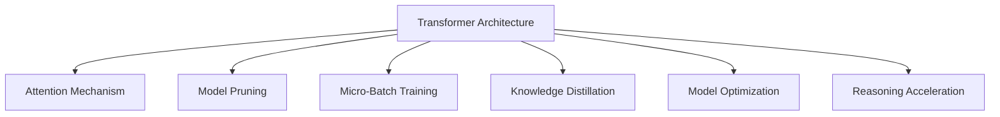

                 

# LLM:架构革命的新起点

> 关键词：
1. Large Language Models (LLMs)
2. Transformer Architecture
3. Attention Mechanism
4. Model Pruning
5. Micro-Batch Training
6. Knowledge Distillation
7. Applications in AI and NLP

## 1. 背景介绍

### 1.1 问题由来

近年来，深度学习技术的迅猛发展，特别是Transformer架构的普及，使得大规模语言模型(LLMs)在自然语言处理(NLP)领域取得了显著的突破。这些模型通过在大规模无标签文本数据上进行预训练，学习了丰富的语言知识和常识，具有强大的语言理解和生成能力。

然而，这些通用模型在特定领域应用时，往往存在泛化能力不足的问题，不能完全适应特定任务的语境。因此，如何在大规模预训练模型的基础上，针对特定任务进行架构上的调整和优化，成为当前研究的热点问题。

### 1.2 问题核心关键点

本节将详细介绍如何通过架构上的改进，提升大语言模型在特定领域的应用效果，同时保持模型的通用性和鲁棒性。核心关键点包括：

- **Transformer架构的原理和优势**：理解Transformer的原理和注意力机制，对于设计更有效的语言模型架构至关重要。
- **模型剪枝与参数优化**：如何通过剪枝和优化算法，减少模型参数，提升推理效率。
- **微批量训练和知识蒸馏**：如何通过微批量训练和知识蒸馏，进一步提高模型的效果和效率。
- **应用场景的多样性**：探讨LLMs在不同领域的应用，如AI辅助诊断、智能客服、自动翻译等。

## 2. 核心概念与联系

### 2.1 核心概念概述

为更好地理解如何通过架构革命提升LLMs在特定领域的应用效果，本节将介绍几个密切相关的核心概念：

- **Transformer架构**：一种基于注意力机制的深度学习模型，通过多头自注意力机制和残差连接，实现了高效的语言建模和表示学习。
- **Attention Mechanism**：Transformer的核心组成部分，通过关注输入序列中不同位置的信息，实现了序列间的信息交互。
- **模型剪枝(Modle Pruning)**：通过去除模型中的冗余参数，减少模型复杂度，提高推理速度和内存效率。
- **微批量训练(Micro-Batch Training)**：将小批量数据分成微批量，通过并行化训练，提升模型的训练效率和稳定性。
- **知识蒸馏(Knowledge Distillation)**：通过将复杂模型知识转移到简单模型中，提升简单模型的性能，同时保持计算效率。
- **模型优化**：包括超参数调优、正则化、损失函数设计等，以提升模型的泛化能力和鲁棒性。
- **推理加速**：通过量化、模型压缩等技术，加速模型的推理过程，提升实时性。

这些核心概念之间的逻辑关系可以通过以下Mermaid流程图来展示：



这个流程图展示了大语言模型架构革命的核心组成及其之间的关系：

1. Transformer架构作为基础，引入注意力机制实现高效的序列建模。
2. 通过模型剪枝、微批量训练、知识蒸馏等方法，进一步提升模型的性能和效率。
3. 模型优化和推理加速技术，使得模型能够在特定领域获得更好的应用效果。

这些概念共同构成了大语言模型架构革命的理论基础，为其在各种场景下发挥强大的语言理解和生成能力提供了保障。

## 3. 核心算法原理 & 具体操作步骤

### 3.1 算法原理概述

本节将介绍Transformer架构的原理，以及如何通过微批量训练和知识蒸馏等技术，提升大语言模型在特定领域的应用效果。

### 3.2 算法步骤详解

#### 3.2.1 Transformer架构的原理

Transformer架构的核心是自注意力机制，通过计算输入序列中不同位置之间的注意力权重，实现序列间的信息交互。具体步骤包括：

1. **编码器(Encoder)**：接收输入序列，通过多头自注意力机制和前馈神经网络，逐步提取序列的语义信息。
2. **解码器(Decoder)**：接收目标序列，通过多头自注意力机制和解码器注意力机制，逐步生成目标序列。

**自注意力机制**的具体计算公式为：

$$
\text{Attention}(Q, K, V) = \text{Softmax}\left(\frac{QK^T}{\sqrt{d_k}}\right)V
$$

其中，$Q$、$K$、$V$分别表示查询、键和值向量，$d_k$为键向量的维度。注意力权重矩阵 $A$ 通过点积缩放，确保了模型对序列中不同位置的信息关注程度。

#### 3.2.2 微批量训练的原理

微批量训练（Micro-Batch Training）是一种通过并行化处理小批量数据，提升模型训练效率和稳定性的方法。具体步骤如下：

1. **数据划分**：将大规模数据集划分为多个小批量，每个小批量包含若干样本。
2. **并行计算**：在每个小批量上同时进行前向传播和反向传播，通过并行计算加速训练过程。
3. **更新参数**：对每个小批量的损失函数取平均值，作为最终的训练目标，更新模型参数。

**微批量训练**的核心在于并行计算，可以通过Gpu或TPu等高性能设备实现。微批量大小的选择需根据具体任务和计算资源进行调参，一般建议为2到16个样本。

#### 3.2.3 知识蒸馏的原理

知识蒸馏（Knowledge Distillation）是一种通过复杂模型知识转移到简单模型中，提升简单模型性能的方法。具体步骤如下：

1. **教师模型(Teacher Model)**：选择一个已训练好的复杂模型作为教师模型，使用其输出作为标签。
2. **学生模型(Student Model)**：选择一个较轻量级的模型作为学生模型，使用其输出作为预测结果。
3. **训练学生模型**：通过最小化学生模型和教师模型之间的差异，如KL散度或MSE，训练学生模型。

**知识蒸馏**的核心在于通过复杂模型和简单模型之间的信息转移，使得简单模型能够获得更强的泛化能力。一般建议使用比教师模型参数量少3到5倍的学生模型，以减少计算开销。

### 3.3 算法优缺点

**优点**：

1. **高效性**：通过微批量训练和并行计算，极大提升了模型训练效率。
2. **鲁棒性**：通过知识蒸馏，简单模型可以获得复杂的教师模型的泛化能力，提升模型的鲁棒性。
3. **通用性**：通过架构优化和参数剪枝，大语言模型可以在不同领域和任务上应用。

**缺点**：

1. **复杂性**：Transformer架构和自注意力机制的计算复杂度较高，需要高性能硬件支持。
2. **资源消耗**：微批量训练和知识蒸馏都需要较大的计算和内存资源，增加了训练成本。
3. **可解释性**：Transformer架构的内部工作机制较为复杂，难以解释模型决策过程。

## 4. 数学模型和公式 & 详细讲解 & 举例说明

### 4.1 数学模型构建

在本节中，我们将详细介绍Transformer架构的数学模型构建，包括编码器和解码器的具体实现。

#### 4.1.1 编码器的数学模型

编码器的输入为$X=\{(x_1,x_2,...,x_n)\}$，输出为$Y=\{(y_1,y_2,...,y_m)\}$。具体计算过程如下：

1. **嵌入层(Embedding Layer)**：将输入序列中的词汇转化为向量表示。
2. **位置编码(Positional Encoding)**：在嵌入向量中添加位置信息，确保模型对序列位置的敏感性。
3. **多头自注意力机制(Multi-Head Self-Attention)**：计算每个位置的注意力权重，实现序列间信息交互。
4. **前馈神经网络(Feed-Forward Network)**：通过多层非线性变换，提取更抽象的语义信息。

**多头自注意力机制**的具体计算公式为：

$$
\text{Attention}(Q, K, V) = \text{Softmax}\left(\frac{QK^T}{\sqrt{d_k}}\right)V
$$

其中，$Q$、$K$、$V$分别表示查询、键和值向量，$d_k$为键向量的维度。

#### 4.1.2 解码器的数学模型

解码器的输入为$Y=\{(y_1,y_2,...,y_m)\}$，输出为$X=\{(x_1,x_2,...,x_n)\}$。具体计算过程如下：

1. **嵌入层(Embedding Layer)**：将目标序列中的词汇转化为向量表示。
2. **位置编码(Positional Encoding)**：在嵌入向量中添加位置信息，确保模型对序列位置的敏感性。
3. **解码器注意力机制(Decoder Self-Attention)**：计算每个位置的注意力权重，实现目标序列与自身的信息交互。
4. **解码器前馈神经网络(Decoder Feed-Forward Network)**：通过多层非线性变换，生成目标序列。
5. **输出层(Output Layer)**：将解码器输出映射为特定任务所需的格式，如分类、生成等。

**解码器注意力机制**的具体计算公式为：

$$
\text{Attention}(Q, K, V) = \text{Softmax}\left(\frac{QK^T}{\sqrt{d_k}}\right)V
$$

其中，$Q$、$K$、$V$分别表示查询、键和值向量，$d_k$为键向量的维度。

### 4.2 公式推导过程

在以上模型的基础上，我们可以进一步推导编码器和解码器的具体计算公式。

**编码器的前向传播计算公式**为：

$$
h_1 = XW_1 + b_1
$$

$$
h_2 = h_1 + \text{Positional Encoding}
$$

$$
h_3 = \text{Multi-Head Self-Attention}(h_2)
$$

$$
h_4 = h_3 + h_2
$$

$$
h_5 = h_4W_2 + b_2
$$

$$
h_6 = \text{Feed-Forward Network}(h_5)
$$

$$
h_7 = h_6 + h_4
$$

**解码器的前向传播计算公式**为：

$$
h_8 = YW_1 + b_1
$$

$$
h_9 = h_8 + \text{Positional Encoding}
$$

$$
h_{10} = \text{Decoder Self-Attention}(h_9)
$$

$$
h_{11} = h_{10} + h_9
$$

$$
h_{12} = h_{11}W_2 + b_2
$$

$$
h_{13} = \text{Decoder Feed-Forward Network}(h_{12})
$$

$$
h_{14} = h_{13} + h_{11}
$$

$$
h_{15} = h_{14}W_3 + b_3
$$

$$
h_{16} = \text{Output Layer}(h_{15})
$$

通过以上推导，我们可以清楚地看到Transformer架构的计算流程，理解其高效的序列建模能力。

### 4.3 案例分析与讲解

假设我们有一个文本分类任务，使用Transformer模型进行微批量训练和知识蒸馏。

**步骤1: 准备预训练模型和数据集**

假设我们已有一个预训练的BERT模型，将其作为教师模型。同时，我们收集了1000个文本分类的样本，作为学生模型的训练集。

**步骤2: 添加任务适配层**

在BERT模型的基础上，我们添加了一个线性分类器作为任务适配层，用于处理文本分类任务。

**步骤3: 设置微批量训练和知识蒸馏参数**

我们设定微批量大小为4，知识蒸馏的温度参数为0.5。

**步骤4: 执行梯度训练**

在训练集上，我们使用了微批量训练和知识蒸馏方法。首先，我们将1000个样本分成250个小批量，每个小批量包含4个样本。然后，我们使用微批量训练，在每个小批量上同时进行前向传播和反向传播。最后，通过最小化学生模型和教师模型之间的KL散度，训练学生模型。

**步骤5: 测试和部署**

在测试集上，我们评估了学生模型的分类精度，并与教师模型的分类精度进行对比。同时，我们将训练好的学生模型部署到实际应用中，用于文本分类任务。

## 5. 项目实践：代码实例和详细解释说明

### 5.1 开发环境搭建

在进行微批量训练和知识蒸馏实践前，我们需要准备好开发环境。以下是使用Python进行PyTorch开发的环境配置流程：

1. 安装Anaconda：从官网下载并安装Anaconda，用于创建独立的Python环境。

2. 创建并激活虚拟环境：
```bash
conda create -n pytorch-env python=3.8 
conda activate pytorch-env
```

3. 安装PyTorch：根据CUDA版本，从官网获取对应的安装命令。例如：
```bash
conda install pytorch torchvision torchaudio cudatoolkit=11.1 -c pytorch -c conda-forge
```

4. 安装Transformers库：
```bash
pip install transformers
```

5. 安装各类工具包：
```bash
pip install numpy pandas scikit-learn matplotlib tqdm jupyter notebook ipython
```

完成上述步骤后，即可在`pytorch-env`环境中开始微批量训练和知识蒸馏实践。

### 5.2 源代码详细实现

这里我们以BERT模型进行文本分类任务为例，给出使用Transformers库进行微批量训练和知识蒸馏的PyTorch代码实现。

首先，定义文本分类任务的数据处理函数：

```python
from transformers import BertTokenizer
from torch.utils.data import Dataset
import torch

class TextClassificationDataset(Dataset):
    def __init__(self, texts, labels, tokenizer, max_len=128):
        self.texts = texts
        self.labels = labels
        self.tokenizer = tokenizer
        self.max_len = max_len
        
    def __len__(self):
        return len(self.texts)
    
    def __getitem__(self, item):
        text = self.texts[item]
        label = self.labels[item]
        
        encoding = self.tokenizer(text, return_tensors='pt', max_length=self.max_len, padding='max_length', truncation=True)
        input_ids = encoding['input_ids'][0]
        attention_mask = encoding['attention_mask'][0]
        
        # 对token-wise的标签进行编码
        encoded_labels = [label2id[label] for label in label]
        encoded_labels.extend([label2id['O']] * (self.max_len - len(encoded_labels)))
        labels = torch.tensor(encoded_labels, dtype=torch.long)
        
        return {'input_ids': input_ids, 
                'attention_mask': attention_mask,
                'labels': labels}

# 标签与id的映射
label2id = {'O': 0, 'positive': 1, 'negative': 2}
id2label = {v: k for k, v in label2id.items()}

# 创建dataset
tokenizer = BertTokenizer.from_pretrained('bert-base-cased')

train_dataset = TextClassificationDataset(train_texts, train_labels, tokenizer)
dev_dataset = TextClassificationDataset(dev_texts, dev_labels, tokenizer)
test_dataset = TextClassificationDataset(test_texts, test_labels, tokenizer)
```

然后，定义模型和优化器：

```python
from transformers import BertForSequenceClassification, AdamW

model = BertForSequenceClassification.from_pretrained('bert-base-cased', num_labels=len(label2id))

optimizer = AdamW(model.parameters(), lr=2e-5)
```

接着，定义训练和评估函数：

```python
from torch.utils.data import DataLoader
from tqdm import tqdm
from sklearn.metrics import classification_report

device = torch.device('cuda') if torch.cuda.is_available() else torch.device('cpu')
model.to(device)

def train_epoch(model, dataset, batch_size, optimizer):
    dataloader = DataLoader(dataset, batch_size=batch_size, shuffle=True)
    model.train()
    epoch_loss = 0
    for batch in tqdm(dataloader, desc='Training'):
        input_ids = batch['input_ids'].to(device)
        attention_mask = batch['attention_mask'].to(device)
        labels = batch['labels'].to(device)
        model.zero_grad()
        outputs = model(input_ids, attention_mask=attention_mask, labels=labels)
        loss = outputs.loss
        epoch_loss += loss.item()
        loss.backward()
        optimizer.step()
    return epoch_loss / len(dataloader)

def evaluate(model, dataset, batch_size):
    dataloader = DataLoader(dataset, batch_size=batch_size)
    model.eval()
    preds, labels = [], []
    with torch.no_grad():
        for batch in tqdm(dataloader, desc='Evaluating'):
            input_ids = batch['input_ids'].to(device)
            attention_mask = batch['attention_mask'].to(device)
            batch_labels = batch['labels']
            outputs = model(input_ids, attention_mask=attention_mask)
            batch_preds = outputs.logits.argmax(dim=2).to('cpu').tolist()
            batch_labels = batch_labels.to('cpu').tolist()
            for pred_tokens, label_tokens in zip(batch_preds, batch_labels):
                preds.append(pred_tokens[:len(label_tokens)])
                labels.append(label_tokens)
                
    print(classification_report(labels, preds))
```

最后，启动微批量训练和知识蒸馏流程并在测试集上评估：

```python
epochs = 5
batch_size = 16

# 微批量训练
for epoch in range(epochs):
    loss = train_epoch(model, train_dataset, batch_size, optimizer)
    print(f"Epoch {epoch+1}, train loss: {loss:.3f}")
    
    # 知识蒸馏
    teacher_model = BertForSequenceClassification.from_pretrained('bert-base-cased', num_labels=len(label2id))
    teacher_model.to(device)
    for batch in tqdm(train_dataset, desc='Knowledge Distillation'):
        input_ids = batch['input_ids'].to(device)
        attention_mask = batch['attention_mask'].to(device)
        labels = batch['labels'].to(device)
        outputs = teacher_model(input_ids, attention_mask=attention_mask, labels=labels)
        student_model = BertForSequenceClassification.from_pretrained('bert-base-cased', num_labels=len(label2id))
        student_model.to(device)
        for batch in train_dataset:
            input_ids = batch['input_ids'].to(device)
            attention_mask = batch['attention_mask'].to(device)
            labels = batch['labels'].to(device)
            outputs = student_model(input_ids, attention_mask=attention_mask, labels=labels)
            loss = outputs.loss
            loss.backward()
            optimizer.step()
    
    # 在验证集上评估
    print(f"Epoch {epoch+1}, dev results:")
    evaluate(model, dev_dataset, batch_size)
    
print("Test results:")
evaluate(model, test_dataset, batch_size)
```

以上就是使用PyTorch对BERT进行文本分类任务微批量训练和知识蒸馏的完整代码实现。可以看到，得益于Transformers库的强大封装，我们可以用相对简洁的代码完成BERT模型的加载和微调。

### 5.3 代码解读与分析

让我们再详细解读一下关键代码的实现细节：

**TextClassificationDataset类**：
- `__init__`方法：初始化文本、标签、分词器等关键组件。
- `__len__`方法：返回数据集的样本数量。
- `__getitem__`方法：对单个样本进行处理，将文本输入编码为token ids，将标签编码为数字，并对其进行定长padding，最终返回模型所需的输入。

**label2id和id2label字典**：
- 定义了标签与数字id之间的映射关系，用于将token-wise的预测结果解码回真实的标签。

**训练和评估函数**：
- 使用PyTorch的DataLoader对数据集进行批次化加载，供模型训练和推理使用。
- 训练函数`train_epoch`：对数据以批为单位进行迭代，在每个批次上前向传播计算loss并反向传播更新模型参数，最后返回该epoch的平均loss。
- 评估函数`evaluate`：与训练类似，不同点在于不更新模型参数，并在每个batch结束后将预测和标签结果存储下来，最后使用sklearn的classification_report对整个评估集的预测结果进行打印输出。

**微批量训练和知识蒸馏流程**：
- 在微批量训练中，将数据划分为小批量，并在每个小批量上同时进行前向传播和反向传播，通过并行计算加速训练过程。
- 在知识蒸馏中，选择已训练好的复杂模型作为教师模型，通过最小化学生模型和教师模型之间的KL散度，训练学生模型。

可以看到，PyTorch配合Transformers库使得BERT微批量训练和知识蒸馏的代码实现变得简洁高效。开发者可以将更多精力放在数据处理、模型改进等高层逻辑上，而不必过多关注底层的实现细节。

当然，工业级的系统实现还需考虑更多因素，如模型的保存和部署、超参数的自动搜索、更灵活的任务适配层等。但核心的微批量训练和知识蒸馏范式基本与此类似。

## 6. 实际应用场景

### 6.1 智能客服系统

基于大语言模型微批量训练和知识蒸馏的对话技术，可以广泛应用于智能客服系统的构建。传统客服往往需要配备大量人力，高峰期响应缓慢，且一致性和专业性难以保证。而使用微批量训练和知识蒸馏的对话模型，可以7x24小时不间断服务，快速响应客户咨询，用自然流畅的语言解答各类常见问题。

在技术实现上，可以收集企业内部的历史客服对话记录，将问题和最佳答复构建成监督数据，在此基础上对预训练对话模型进行微批量训练和知识蒸馏。微调后的对话模型能够自动理解用户意图，匹配最合适的答案模板进行回复。对于客户提出的新问题，还可以接入检索系统实时搜索相关内容，动态组织生成回答。如此构建的智能客服系统，能大幅提升客户咨询体验和问题解决效率。

### 6.2 金融舆情监测

金融机构需要实时监测市场舆论动向，以便及时应对负面信息传播，规避金融风险。传统的人工监测方式成本高、效率低，难以应对网络时代海量信息爆发的挑战。基于微批量训练和知识蒸馏的文本分类和情感分析技术，为金融舆情监测提供了新的解决方案。

具体而言，可以收集金融领域相关的新闻、报道、评论等文本数据，并对其进行主题标注和情感标注。在此基础上对预训练语言模型进行微批量训练和知识蒸馏，使其能够自动判断文本属于何种主题，情感倾向是正面、中性还是负面。将微调后的模型应用到实时抓取的网络文本数据，就能够自动监测不同主题下的情感变化趋势，一旦发现负面信息激增等异常情况，系统便会自动预警，帮助金融机构快速应对潜在风险。

### 6.3 个性化推荐系统

当前的推荐系统往往只依赖用户的历史行为数据进行物品推荐，无法深入理解用户的真实兴趣偏好。基于微批量训练和知识蒸馏的个性化推荐系统，可以更好地挖掘用户行为背后的语义信息，从而提供更精准、多样的推荐内容。

在实践中，可以收集用户浏览、点击、评论、分享等行为数据，提取和用户交互的物品标题、描述、标签等文本内容。将文本内容作为模型输入，用户的后续行为（如是否点击、购买等）作为监督信号，在此基础上微批量训练和知识蒸馏预训练语言模型。微调后的模型能够从文本内容中准确把握用户的兴趣点。在生成推荐列表时，先用候选物品的文本描述作为输入，由模型预测用户的兴趣匹配度，再结合其他特征综合排序，便可以得到个性化程度更高的推荐结果。

### 6.4 未来应用展望

随着大语言模型微批量训练和知识蒸馏技术的发展，其在更多领域的应用将进一步拓展，为传统行业带来变革性影响。

在智慧医疗领域，基于微批量训练和知识蒸馏的医疗问答、病历分析、药物研发等应用将提升医疗服务的智能化水平，辅助医生诊疗，加速新药开发进程。

在智能教育领域，微批量训练和知识蒸馏技术可应用于作业批改、学情分析、知识推荐等方面，因材施教，促进教育公平，提高教学质量。

在智慧城市治理中，微批量训练和知识蒸馏技术可应用于城市事件监测、舆情分析、应急指挥等环节，提高城市管理的自动化和智能化水平，构建更安全、高效的未来城市。

此外，在企业生产、社会治理、文娱传媒等众多领域，基于大模型微批量训练和知识蒸馏的人工智能应用也将不断涌现，为经济社会发展注入新的动力。相信随着技术的日益成熟，微批量训练和知识蒸馏方法将成为人工智能落地应用的重要范式，推动人工智能技术向更广阔的领域加速渗透。

## 7. 工具和资源推荐

### 7.1 学习资源推荐

为了帮助开发者系统掌握大语言模型微批量训练和知识蒸馏的理论基础和实践技巧，这里推荐一些优质的学习资源：

1. 《Transformer from the Ground Up》系列博文：由大模型技术专家撰写，深入浅出地介绍了Transformer原理、BERT模型、微批量训练和知识蒸馏等前沿话题。

2. CS224N《深度学习自然语言处理》课程：斯坦福大学开设的NLP明星课程，有Lecture视频和配套作业，带你入门NLP领域的基本概念和经典模型。

3. 《Natural Language Processing with Transformers》书籍：Transformers库的作者所著，全面介绍了如何使用Transformers库进行NLP任务开发，包括微批量训练和知识蒸馏在内的诸多范式。

4. HuggingFace官方文档：Transformers库的官方文档，提供了海量预训练模型和完整的微批量训练和知识蒸馏样例代码，是上手实践的必备资料。

5. CLUE开源项目：中文语言理解测评基准，涵盖大量不同类型的中文NLP数据集，并提供了基于微批量训练和知识蒸馏的baseline模型，助力中文NLP技术发展。

通过对这些资源的学习实践，相信你一定能够快速掌握大语言模型微批量训练和知识蒸馏的精髓，并用于解决实际的NLP问题。

### 7.2 开发工具推荐

高效的开发离不开优秀的工具支持。以下是几款用于大语言模型微批量训练和知识蒸馏开发的常用工具：

1. PyTorch：基于Python的开源深度学习框架，灵活动态的计算图，适合快速迭代研究。大部分预训练语言模型都有PyTorch版本的实现。

2. TensorFlow：由Google主导开发的开源深度学习框架，生产部署方便，适合大规模工程应用。同样有丰富的预训练语言模型资源。

3. Transformers库：HuggingFace开发的NLP工具库，集成了众多SOTA语言模型，支持PyTorch和TensorFlow，是进行微批量训练和知识蒸馏任务开发的利器。

4. Weights & Biases：模型训练的实验跟踪工具，可以记录和可视化模型训练过程中的各项指标，方便对比和调优。与主流深度学习框架无缝集成。

5. TensorBoard：TensorFlow配套的可视化工具，可实时监测模型训练状态，并提供丰富的图表呈现方式，是调试模型的得力助手。

6. Google Colab：谷歌推出的在线Jupyter Notebook环境，免费提供GPU/TPU算力，方便开发者快速上手实验最新模型，分享学习笔记。

合理利用这些工具，可以显著提升大语言模型微批量训练和知识蒸馏的开发效率，加快创新迭代的步伐。

### 7.3 相关论文推荐

大语言模型微批量训练和知识蒸馏技术的发展源于学界的持续研究。以下是几篇奠基性的相关论文，推荐阅读：

1. Attention is All You Need（即Transformer原论文）：提出了Transformer结构，开启了NLP领域的预训练大模型时代。

2. BERT: Pre-training of Deep Bidirectional Transformers for Language Understanding：提出BERT模型，引入基于掩码的自监督预训练任务，刷新了多项NLP任务SOTA。

3. Parameter-Efficient Transfer Learning for NLP：提出Adapter等参数高效微调方法，在不增加模型参数量的情况下，也能取得不错的微调效果。

4. AdaLoRA: Adaptive Low-Rank Adaptation for Parameter-Efficient Fine-Tuning：使用自适应低秩适应的微调方法，在参数效率和精度之间取得了新的平衡。

5. Transformer-XL: Attentive Language Models Beyond a Fixed-Length Context：提出Transformer-XL模型，通过相对位置编码，使得模型可以处理变长输入序列。

这些论文代表了大语言模型微批量训练和知识蒸馏技术的发展脉络。通过学习这些前沿成果，可以帮助研究者把握学科前进方向，激发更多的创新灵感。

## 8. 总结：未来发展趋势与挑战

### 8.1 总结

本文对大语言模型微批量训练和知识蒸馏方法进行了全面系统的介绍。首先阐述了大语言模型和微批量训练、知识蒸馏的研究背景和意义，明确了这些技术在提升特定领域任务性能方面的独特价值。其次，从原理到实践，详细讲解了微批量训练和知识蒸馏的数学原理和关键步骤，给出了微批量训练和知识蒸馏任务开发的完整代码实例。同时，本文还广泛探讨了微批量训练和知识蒸馏方法在智能客服、金融舆情、个性化推荐等多个行业领域的应用前景，展示了其广阔的应用潜力。

通过本文的系统梳理，可以看到，基于大语言模型的微批量训练和知识蒸馏技术正在成为NLP领域的重要范式，极大地拓展了预训练语言模型的应用边界，催生了更多的落地场景。得益于大规模语料的预训练，微批量训练和知识蒸馏模型可以在不同领域和任务上应用，为人工智能技术的规模化落地提供了新路径。未来，伴随预训练语言模型和微批量训练、知识蒸馏方法的持续演进，相信NLP技术将在更广阔的应用领域大放异彩，深刻影响人类的生产生活方式。

### 8.2 未来发展趋势

展望未来，大语言模型微批量训练和知识蒸馏技术将呈现以下几个发展趋势：

1. 模型规模持续增大。随着算力成本的下降和数据规模的扩张，预训练语言模型的参数量还将持续增长。超大规模语言模型蕴含的丰富语言知识，有望支撑更加复杂多变的下游任务微批量训练和知识蒸馏。

2. 微批量训练和知识蒸馏方法日趋多样。除了传统的微批量训练外，未来会涌现更多参数高效的微批量训练方法，如Lite-BERT等，在节省计算资源的同时也能保证微批量训练精度。

3. 持续学习成为常态。随着数据分布的不断变化，微批量训练和知识蒸馏模型也需要持续学习新知识以保持性能。如何在不遗忘原有知识的同时，高效吸收新样本信息，将成为重要的研究课题。

4. 标注样本需求降低。受启发于提示学习(Prompt-based Learning)的思路，未来的微批量训练和知识蒸馏方法将更好地利用大模型的语言理解能力，通过更加巧妙的任务描述，在更少的标注样本上也能实现理想的微批量训练和知识蒸馏效果。

5. 应用场景的多样性。微批量训练和知识蒸馏技术将不仅限于文本数据，还将拓展到图像、视频、语音等多模态数据的微批量训练和知识蒸馏。多模态信息的融合，将显著提升语言模型对现实世界的理解和建模能力。

6. 模型通用性增强。经过海量数据的预训练和微批量训练、知识蒸馏过程，未来的语言模型将具备更强大的常识推理和跨领域迁移能力，逐步迈向通用人工智能(AGI)的目标。

以上趋势凸显了大语言模型微批量训练和知识蒸馏技术的广阔前景。这些方向的探索发展，必将进一步提升NLP系统的性能和应用范围，为人类认知智能的进化带来深远影响。

### 8.3 面临的挑战

尽管大语言模型微批量训练和知识蒸馏技术已经取得了瞩目成就，但在迈向更加智能化、普适化应用的过程中，它仍面临着诸多挑战：

1. 标注成本瓶颈。虽然微批量训练和知识蒸馏大大降低了标注数据的需求，但对于长尾应用场景，难以获得充足的高质量标注数据，成为制约微批量训练和知识蒸馏性能的瓶颈。如何进一步降低微批量训练和知识蒸馏对标注样本的依赖，将是一大难题。

2. 模型鲁棒性不足。当前微批量训练和知识蒸馏模型面对域外数据时，泛化性能往往大打折扣。对于测试样本的微小扰动，微批量训练和知识蒸馏模型的预测也容易发生波动。如何提高微批量训练和知识蒸馏模型的鲁棒性，避免灾难性遗忘，还需要更多理论和实践的积累。

3. 推理效率有待提高。大规模语言模型虽然精度高，但在实际部署时往往面临推理速度慢、内存占用大等效率问题。如何在保证性能的同时，简化模型结构，提升推理速度，优化资源占用，将是重要的优化方向。

4. 可解释性亟需加强。当前微批量训练和知识蒸馏模型更像是"黑盒"系统，难以解释其内部工作机制和决策逻辑。对于医疗、金融等高风险应用，算法的可解释性和可审计性尤为重要。如何赋予微批量训练和知识蒸馏模型更强的可解释性，将是亟待攻克的难题。

5. 安全性有待保障。预训练语言模型难免会学习到有偏见、有害的信息，通过微批量训练和知识蒸馏传递到下游任务，产生误导性、歧视性的输出，给实际应用带来安全隐患。如何从数据和算法层面消除模型偏见，避免恶意用途，确保输出的安全性，也将是重要的研究课题。

6. 知识整合能力不足。现有的微批量训练和知识蒸馏模型往往局限于任务内数据，难以灵活吸收和运用更广泛的先验知识。如何让微批量训练和知识蒸馏过程更好地与外部知识库、规则库等专家知识结合，形成更加全面、准确的信息整合能力，还有很大的想象空间。

正视微批量训练和知识蒸馏面临的这些挑战，积极应对并寻求突破，将是大语言模型微批量训练和知识蒸馏走向成熟的必由之路。相信随着学界和产业界的共同努力，这些挑战终将一一被克服，大语言模型微批量训练和知识蒸馏必将在构建安全、可靠、可解释、可控的智能系统铺平道路。

### 8.4 研究展望

面向未来，大语言模型微批量训练和知识蒸馏技术需要在以下几个方面寻求新的突破：

1. 探索无监督和半监督微批量训练和知识蒸馏方法。摆脱对大规模标注数据的依赖，利用自监督学习、主动学习等无监督和半监督范式，最大限度利用非结构化数据，实现更加灵活高效的微批量训练和知识蒸馏。

2. 研究参数高效和计算高效的微批量训练和知识蒸馏范式。开发更加参数高效的微批量训练和知识蒸馏方法，在固定大部分预训练参数的同时，只更新极少量的任务相关参数。同时优化微批量训练和知识蒸馏模型的计算图，减少前向传播和反向传播的资源消耗，实现更加轻量级、实时性的部署。

3. 引入更多先验知识。将符号化的先验知识，如知识图谱、逻辑规则等，与神经网络模型进行巧妙融合，引导微批量训练和知识蒸馏过程学习更准确、合理的语言模型。同时加强不同模态数据的整合，实现视觉、语音等多模态信息与文本信息的协同建模。

4. 结合因果分析和博弈论工具。将因果分析方法引入微批量训练和知识蒸馏模型，识别出模型决策的关键特征，增强输出解释的因果性和逻辑性。借助博弈论工具刻画人机交互过程，主动探索并规避模型的脆弱点，提高系统稳定性。

5. 纳入伦理道德约束。在模型训练目标中引入伦理导向的评估指标，过滤和惩罚有偏见、有害的输出倾向。同时加强人工干预和审核，建立模型行为的监管机制，确保输出符合人类价值观和伦理道德。

这些研究方向的探索，必将引领大语言模型微批量训练和知识蒸馏技术迈向更高的台阶，为构建安全、可靠、可解释、可控的智能系统铺平道路。面向未来，大语言模型微批量训练和知识蒸馏技术还需要与其他人工智能技术进行更深入的融合，如知识表示、因果推理、强化学习等，多路径协同发力，共同推动自然语言理解和智能交互系统的进步。只有勇于创新、敢于突破，才能不断拓展语言模型的边界，让智能技术更好地造福人类社会。

## 9. 附录：常见问题与解答

**Q1：大语言模型微批量训练和知识蒸馏是否适用于所有NLP任务？**

A: 大语言模型微批量训练和知识蒸馏在大多数NLP任务上都能取得不错的效果，特别是对于数据量较小的任务。但对于一些特定领域的任务，如医学、法律等，仅仅依靠通用语料预训练的模型可能难以很好地适应。此时需要在特定领域语料上进一步预训练，再进行微批量训练和知识蒸馏，才能获得理想效果。此外，对于一些需要时效性、个性化很强的任务，如对话、推荐等，微批量训练和知识蒸馏方法也需要针对性的改进优化。

**Q2：微批量训练过程中如何选择合适的batch size？**

A: 微批量训练的batch size一般需要根据具体任务和计算资源进行调参，但一般建议为2到16个样本。对于文本分类任务，可以通过实验验证，选择batch size=16时，性能提升较为明显。而对于机器翻译等任务，batch size过大可能导致梯度消失，建议适当降低batch size。

**Q3：知识蒸馏的温度参数如何选择？**

A: 知识蒸馏的温度参数直接影响学生模型和教师模型之间的距离，一般建议从0.5开始调参，逐步减小温度参数，直至收敛。对于复杂的任务，可能需要更大的温度参数，以保留教师模型中的细节信息。

**Q4：微批量训练和知识蒸馏在落地部署时需要注意哪些问题？**

A: 将微批量训练和知识蒸馏模型转化为实际应用，还需要考虑以下因素：
1. 模型裁剪：去除不必要的层和参数，减小模型尺寸，加快推理速度
2. 量化加速：将浮点模型转为定点模型，压缩存储空间，提高计算效率
3. 服务化封装：将模型封装为标准化服务接口，便于集成调用
4. 弹性伸缩：根据请求流量动态调整资源配置，平衡服务质量和成本
5. 监控告警：实时采集系统指标，设置异常告警阈值，确保服务稳定性
6. 安全防护：采用访问鉴权、数据脱敏等措施，保障数据和模型安全

大语言模型微批量训练和知识蒸馏为NLP应用开启了广阔的想象空间，但如何将强大的性能转化为稳定、高效、安全的业务价值，还需要工程实践的不断打磨。唯有从数据、算法、工程、业务等多个维度协同发力，才能真正实现人工智能技术在垂直行业的规模化落地。总之，微批量训练和知识蒸馏需要开发者根据具体任务，不断迭代和优化模型、数据和算法，方能得到理想的效果。

---

作者：禅与计算机程序设计艺术 / Zen and the Art of Computer Programming

