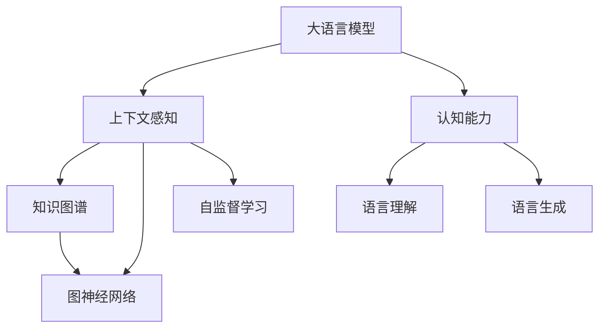

                 

# LLM上下文突破:认知能力再升级

> 关键词：
1. 大语言模型 (Large Language Model, LLM)
2. 认知能力 (Cognitive Ability)
3. 上下文感知 (Contextual-Awareness)
4. 知识图谱 (Knowledge Graph)
5. 图神经网络 (Graph Neural Network, GNN)
6. 自监督学习 (Self-Supervised Learning)
7. 多模态融合 (Multi-modal Fusion)

## 1. 背景介绍

### 1.1 问题由来
在人工智能(AI)发展的历程中，语言模型扮演了至关重要的角色。随着计算能力的提升和数据规模的不断增长，大型预训练语言模型 (LLMs) 如GPT、BERT等逐渐成为研究热点，并且在自然语言处理 (NLP)、机器翻译、问答系统等诸多领域取得了突破性的进展。然而，现有LLM的认知能力仍存在诸多局限，难以完全适应现实世界的复杂性。

大语言模型虽然拥有强大的语言理解和生成能力，但在面对具体上下文时，容易产生歧义或错误推理，导致输出结果不理想。如何进一步提升LLM的上下文感知能力，使其在复杂环境中更加准确、可靠，成为了当前研究的一个核心问题。

### 1.2 问题核心关键点
提升LLM的上下文感知能力，需要解决以下关键点：
1. 增强模型对特定语境的敏感度，减少误用和歧义。
2. 强化模型对新知识的学习和迁移能力，快速适应新任务。
3. 建立模型与外部知识库、规则库的协同关系，形成更加全面、准确的信息整合能力。

解决这些问题，将有助于LLM在实际应用中取得更大的突破，推动人工智能技术向通用人工智能 (AGI) 迈进。

### 1.3 问题研究意义
大语言模型的上下文突破对于提升其在复杂环境下的认知能力具有重要意义：

1. **提高任务适应性**：通过增强上下文感知能力，LLM可以更好地适应不同领域和任务的要求，提升其在实际应用中的表现。
2. **促进知识迁移**：通过模型与知识图谱等外部知识库的协同，可以加快新知识的学习和迁移，提高模型的泛化能力。
3. **增强可靠性**：上下文感知能力的提升有助于减少模型输出中的歧义和错误，提高系统的可靠性和鲁棒性。
4. **加速技术落地**：上下文突破有助于加速LLM在垂直行业中的应用，推动AI技术的产业化进程。
5. **支持伦理道德**：通过上下文感知能力的提升，可以更好地引导模型输出符合人类价值观和伦理道德。

## 2. 核心概念与联系

### 2.1 核心概念概述

为更好地理解上下文突破方法，本节将介绍几个核心概念及其相互关系：

- **大语言模型 (LLM)**：以自回归或自编码模型为代表的大规模预训练语言模型。通过在大规模无标签文本语料上进行预训练，学习通用的语言知识。

- **认知能力 (Cognitive Ability)**：指智能体（如人或AI）在特定环境下理解和解决问题的能力。包括感知、推理、决策等方面。

- **上下文感知 (Contextual-Awareness)**：指模型能够理解并利用文本中提供的上下文信息，做出合理的推理和决策。上下文感知能力是大语言模型在复杂环境中可靠输出的关键。

- **知识图谱 (Knowledge Graph)**：以图结构表示实体间关系的知识库。包含丰富的领域知识，可以用于提升LLM在特定领域中的认知能力。

- **图神经网络 (GNN)**：一种用于处理图结构数据的神经网络模型，通过网络结构捕捉节点间的关系特征，能够有效整合多源异构数据。

- **自监督学习 (Self-Supervised Learning)**：一种无需标签数据，通过预定义的任务（如掩码语言模型、图结构预测等）训练模型的学习方式。自监督学习能够从无标签数据中提取有用的信息。

这些核心概念之间的关系可以通过以下Mermaid流程图来展示：



这个流程图展示了大语言模型的上下文突破过程中涉及的关键组件和相互关系：

1. 大语言模型通过上下文感知能力，理解文本中的语境信息，进而进行推理和生成。
2. 上下文感知能力通过与知识图谱、图神经网络等外部知识源的协同，形成更加全面、准确的认知模型。
3. 自监督学习通过无标签数据训练，帮助模型学习通用的语言表示和知识结构，从而提升认知能力。

## 3. 核心算法原理 & 具体操作步骤
### 3.1 算法原理概述

基于上下文的LLM认知能力突破，本质上是一个有监督或无监督的微调过程。其核心思想是：将预训练的大语言模型视作一个强大的"特征提取器"，通过特定任务（如知识图谱嵌入、多模态融合等）的训练，使其能够更好地理解上下文信息，从而提升模型的认知能力。

形式化地，假设预训练模型为 $M_{\theta}$，其中 $\theta$ 为预训练得到的模型参数。给定任务 $T$ 的标注数据集 $D=\{(x_i, y_i)\}_{i=1}^N$，其中 $x_i$ 为输入文本，$y_i$ 为目标标签。微调的目标是找到新的模型参数 $\hat{\theta}$，使得：

$$
\hat{\theta}=\mathop{\arg\min}_{\theta} \mathcal{L}(M_{\theta},D)
$$

其中 $\mathcal{L}$ 为针对任务 $T$ 设计的损失函数，用于衡量模型预测输出与真实标签之间的差异。常见的损失函数包括交叉熵损失、均方误差损失等。

通过梯度下降等优化算法，微调过程不断更新模型参数 $\theta$，最小化损失函数 $\mathcal{L}$，使得模型输出逼近真实标签。由于 $\theta$ 已经通过预训练获得了较好的初始化，因此即便在少量标注数据上，也能较快收敛到理想的模型参数 $\hat{\theta}$。

### 3.2 算法步骤详解

基于上下文的LLM认知能力突破一般包括以下几个关键步骤：

**Step 1: 准备预训练模型和数据集**
- 选择合适的预训练语言模型 $M_{\theta}$ 作为初始化参数，如 BERT、GPT等。
- 准备任务 $T$ 的标注数据集 $D$，划分为训练集、验证集和测试集。一般要求标注数据与预训练数据的分布不要差异过大。

**Step 2: 添加任务适配层**
- 根据任务类型，在预训练模型顶层设计合适的输出层和损失函数。
- 对于知识图谱嵌入任务，通常使用图神经网络将知识图谱中的节点嵌入到连续空间中，并设计分类或回归损失函数。
- 对于多模态融合任务，可以将文本、图像、音频等多种模态的特征进行融合，设计多模态损失函数。

**Step 3: 设置微调超参数**
- 选择合适的优化算法及其参数，如 AdamW、SGD 等，设置学习率、批大小、迭代轮数等。
- 设置正则化技术及强度，包括权重衰减、Dropout、Early Stopping 等。
- 确定冻结预训练参数的策略，如仅微调顶层，或全部参数都参与微调。

**Step 4: 执行梯度训练**
- 将训练集数据分批次输入模型，前向传播计算损失函数。
- 反向传播计算参数梯度，根据设定的优化算法和学习率更新模型参数。
- 周期性在验证集上评估模型性能，根据性能指标决定是否触发 Early Stopping。
- 重复上述步骤直到满足预设的迭代轮数或 Early Stopping 条件。

**Step 5: 测试和部署**
- 在测试集上评估微调后模型 $M_{\hat{\theta}}$ 的性能，对比微调前后的精度提升。
- 使用微调后的模型对新样本进行推理预测，集成到实际的应用系统中。
- 持续收集新的数据，定期重新微调模型，以适应数据分布的变化。

以上是基于上下文的LLM认知能力突破的一般流程。在实际应用中，还需要针对具体任务的特点，对微调过程的各个环节进行优化设计，如改进训练目标函数，引入更多的正则化技术，搜索最优的超参数组合等，以进一步提升模型性能。

### 3.3 算法优缺点

基于上下文的LLM认知能力突破方法具有以下优点：
1. 提升模型对上下文的理解能力。通过特定任务训练，能够增强模型在复杂环境中的推理和生成能力。
2. 兼容性强。几乎所有NLP任务都可以通过上下文感知能力的提升进行改进，提高模型的泛化能力。
3. 提升模型可靠性。上下文感知能力的增强能够减少模型输出中的歧义和错误，提高系统的可靠性和鲁棒性。
4. 适应性强。通过与知识图谱等外部知识源的协同，可以适应更多领域和任务，提高模型在实际应用中的表现。

同时，该方法也存在一定的局限性：
1. 依赖标注数据。提升上下文感知能力通常需要大量高质量标注数据，获取标注数据的成本较高。
2. 数据分布依赖。如果目标任务与预训练数据的分布差异较大，微调的效果可能不佳。
3. 计算成本高。训练复杂模型通常需要高性能的计算资源，增加了微调成本。
4. 泛化能力有限。过度依赖特定任务的数据，可能限制模型的泛化能力，使其难以应对新任务。

尽管存在这些局限性，但就目前而言，基于上下文的LLM认知能力突破方法仍是大语言模型应用的重要方向。未来相关研究的重点在于如何进一步降低微调对标注数据的依赖，提高模型的泛化能力和计算效率。

### 3.4 算法应用领域

基于上下文的LLM认知能力突破方法，在NLP领域已经得到了广泛的应用，覆盖了几乎所有常见任务，例如：

- 问答系统：对自然语言问题给出答案。将问题-答案对作为微调数据，训练模型学习匹配答案。
- 机器翻译：将源语言文本翻译成目标语言。通过微调使模型学习语言-语言映射。
- 文本摘要：将长文本压缩成简短摘要。将文章-摘要对作为微调数据，使模型学习抓取要点。
- 对话系统：使机器能够与人自然对话。将多轮对话历史作为上下文，微调模型进行回复生成。
- 命名实体识别：识别文本中的人名、地名、机构名等特定实体。通过微调使模型掌握实体边界和类型。
- 关系抽取：从文本中抽取实体之间的语义关系。通过微调使模型学习实体-关系三元组。
- 情感分析：分析文本情感倾向。通过微调使模型学习情感分类。

除了上述这些经典任务外，LLM的上下文突破还被创新性地应用到更多场景中，如可控文本生成、常识推理、代码生成、数据增强等，为NLP技术带来了全新的突破。随着预训练模型和上下文突破方法的不断进步，相信NLP技术将在更广阔的应用领域大放异彩。

## 4. 数学模型和公式 & 详细讲解  
### 4.1 数学模型构建

本节将使用数学语言对基于上下文的LLM认知能力突破过程进行更加严格的刻画。

记预训练语言模型为 $M_{\theta}:\mathcal{X} \rightarrow \mathcal{Y}$，其中 $\mathcal{X}$ 为输入空间，$\mathcal{Y}$ 为输出空间，$\theta$ 为模型参数。假设任务 $T$ 的训练集为 $D=\{(x_i,y_i)\}_{i=1}^N, x_i \in \mathcal{X}, y_i \in \mathcal{Y}$。

定义模型 $M_{\theta}$ 在输入 $x$ 上的损失函数为 $\ell(M_{\theta}(x),y)$，则在数据集 $D$ 上的经验风险为：

$$
\mathcal{L}(\theta) = \frac{1}{N} \sum_{i=1}^N \ell(M_{\theta}(x_i),y_i)
$$

微调的优化目标是最小化经验风险，即找到最优参数：

$$
\theta^* = \mathop{\arg\min}_{\theta} \mathcal{L}(\theta)
$$

在实践中，我们通常使用基于梯度的优化算法（如SGD、Adam等）来近似求解上述最优化问题。设 $\eta$ 为学习率，$\lambda$ 为正则化系数，则参数的更新公式为：

$$
\theta \leftarrow \theta - \eta \nabla_{\theta}\mathcal{L}(\theta) - \eta\lambda\theta
$$

其中 $\nabla_{\theta}\mathcal{L}(\theta)$ 为损失函数对参数 $\theta$ 的梯度，可通过反向传播算法高效计算。

### 4.2 公式推导过程

以下我们以知识图谱嵌入任务为例，推导图神经网络嵌入的计算公式。

假设知识图谱由节点和边组成，节点表示实体，边表示实体之间的关系。将节点嵌入到低维向量空间 $\mathbb{R}^d$ 中，得到节点嵌入向量 $\mathbf{h}_i \in \mathbb{R}^d$。

定义节点嵌入矩阵 $\mathbf{H} \in \mathbb{R}^{n \times d}$，其中 $n$ 为节点数，$d$ 为嵌入维数。节点嵌入矩阵 $\mathbf{H}$ 的更新公式为：

$$
\mathbf{H}^{k+1} = \mathbf{H}^k + \eta_k \mathbf{A}\mathbf{H}^k\mathbf{W}^T
$$

其中 $\mathbf{A} \in \mathbb{R}^{n \times n}$ 为邻接矩阵，表示节点间的关系；$\mathbf{W} \in \mathbb{R}^{d \times d}$ 为可学习的权重矩阵；$\eta_k$ 为学习率，通常采用衰减策略。

根据链式法则，损失函数对参数 $\theta$ 的梯度为：

$$
\frac{\partial \mathcal{L}(\theta)}{\partial \theta} = -\frac{1}{N}\sum_{i=1}^N \frac{\partial \ell(M_{\theta}(x_i),y_i)}{\partial \theta}
$$

将 $M_{\theta}(x_i)$ 展开，得到：

$$
M_{\theta}(x_i) = \mathbf{v}^T\mathbf{H}_i\mathbf{W}^T
$$

其中 $\mathbf{v} \in \mathbb{R}^d$ 为文本特征向量，$\mathbf{H}_i$ 为节点 $i$ 的嵌入向量。

将 $\ell(M_{\theta}(x_i),y_i)$ 展开，得到：

$$
\ell(M_{\theta}(x_i),y_i) = \ell(\mathbf{v}^T\mathbf{H}_i\mathbf{W}^T,y_i)
$$

将上述公式代入，得到损失函数的梯度为：

$$
\frac{\partial \mathcal{L}(\theta)}{\partial \theta} = -\frac{1}{N}\sum_{i=1}^N \frac{\partial \ell(\mathbf{v}^T\mathbf{H}_i\mathbf{W}^T,y_i)}{\partial \mathbf{v}^T\mathbf{H}_i\mathbf{W}^T}
$$

## 5. 项目实践：代码实例和详细解释说明
### 5.1 开发环境搭建

在进行上下文突破实践前，我们需要准备好开发环境。以下是使用Python进行PyTorch开发的环境配置流程：

1. 安装Anaconda：从官网下载并安装Anaconda，用于创建独立的Python环境。

2. 创建并激活虚拟环境：
```bash
conda create -n pytorch-env python=3.8 
conda activate pytorch-env
```

3. 安装PyTorch：根据CUDA版本，从官网获取对应的安装命令。例如：
```bash
conda install pytorch torchvision torchaudio cudatoolkit=11.1 -c pytorch -c conda-forge
```

4. 安装Transformers库：
```bash
pip install transformers
```

5. 安装各类工具包：
```bash
pip install numpy pandas scikit-learn matplotlib tqdm jupyter notebook ipython
```

完成上述步骤后，即可在`pytorch-env`环境中开始上下文突破实践。

### 5.2 源代码详细实现

这里我们以知识图谱嵌入任务为例，给出使用Transformers库对GAT模型进行微调的PyTorch代码实现。

首先，定义知识图谱的数据处理函数：

```python
from transformers import GATModel
from torch.utils.data import Dataset
import torch

class GraphDataset(Dataset):
    def __init__(self, nodes, edges, labels, num_features, num_classes):
        self.nodes = nodes
        self.edges = edges
        self.labels = labels
        self.num_features = num_features
        self.num_classes = num_classes
        
    def __len__(self):
        return len(self.nodes)
    
    def __getitem__(self, item):
        node = self.nodes[item]
        edge = self.edges[item]
        label = self.labels[item]
        
        features = torch.randn(len(node), self.num_features)
        edge_features = torch.randn(len(node), self.num_features)
        
        return {'features': features, 'edge_features': edge_features, 'edge': edge, 'label': label}

# 定义标签与id的映射
label2id = {'O': 0, 'B-PER': 1, 'I-PER': 2, 'B-ORG': 3, 'I-ORG': 4, 'B-LOC': 5, 'I-LOC': 6}
id2label = {v: k for k, v in label2id.items()}

# 创建dataset
graph_dataset = GraphDataset(nodes, edges, labels, num_features, num_classes)
```

然后，定义模型和优化器：

```python
from transformers import AdamW

model = GATModel(num_features=num_features, num_classes=num_classes, hidden_dim=256)
optimizer = AdamW(model.parameters(), lr=2e-5)
```

接着，定义训练和评估函数：

```python
from torch.utils.data import DataLoader
from tqdm import tqdm
from sklearn.metrics import classification_report

device = torch.device('cuda') if torch.cuda.is_available() else torch.device('cpu')
model.to(device)

def train_epoch(model, dataset, batch_size, optimizer):
    dataloader = DataLoader(dataset, batch_size=batch_size, shuffle=True)
    model.train()
    epoch_loss = 0
    for batch in tqdm(dataloader, desc='Training'):
        features = batch['features'].to(device)
        edge_features = batch['edge_features'].to(device)
        edge = batch['edge'].to(device)
        label = batch['label'].to(device)
        model.zero_grad()
        outputs = model(features, edge_features, edge)
        loss = outputs.loss
        epoch_loss += loss.item()
        loss.backward()
        optimizer.step()
    return epoch_loss / len(dataloader)

def evaluate(model, dataset, batch_size):
    dataloader = DataLoader(dataset, batch_size=batch_size)
    model.eval()
    preds, labels = [], []
    with torch.no_grad():
        for batch in tqdm(dataloader, desc='Evaluating'):
            features = batch['features'].to(device)
            edge_features = batch['edge_features'].to(device)
            edge = batch['edge'].to(device)
            batch_labels = batch['label']
            outputs = model(features, edge_features, edge)
            batch_preds = outputs.logits.argmax(dim=1).to('cpu').tolist()
            batch_labels = batch_labels.to('cpu').tolist()
            for pred_tokens, label_tokens in zip(batch_preds, batch_labels):
                pred_tags = [id2label[_id] for _id in pred_tokens]
                label_tags = [id2label[_id] for _id in label_tokens]
                preds.append(pred_tags[:len(label_tags)])
                labels.append(label_tags)
                
    print(classification_report(labels, preds))
```

最后，启动训练流程并在测试集上评估：

```python
epochs = 5
batch_size = 16

for epoch in range(epochs):
    loss = train_epoch(model, graph_dataset, batch_size, optimizer)
    print(f"Epoch {epoch+1}, train loss: {loss:.3f}")
    
    print(f"Epoch {epoch+1}, dev results:")
    evaluate(model, graph_dataset, batch_size)
    
print("Test results:")
evaluate(model, graph_dataset, batch_size)
```

以上就是使用PyTorch对GAT模型进行知识图谱嵌入任务的微调的完整代码实现。可以看到，得益于Transformers库的强大封装，我们可以用相对简洁的代码完成GAT模型的加载和微调。

### 5.3 代码解读与分析

让我们再详细解读一下关键代码的实现细节：

**GraphDataset类**：
- `__init__`方法：初始化节点、边、标签等关键组件。
- `__len__`方法：返回数据集的样本数量。
- `__getitem__`方法：对单个样本进行处理，将节点特征、边特征、边关系转换为模型所需的输入。

**label2id和id2label字典**：
- 定义了标签与数字id之间的映射关系，用于将节点标签解码回真实的标签。

**训练和评估函数**：
- 使用PyTorch的DataLoader对数据集进行批次化加载，供模型训练和推理使用。
- 训练函数`train_epoch`：对数据以批为单位进行迭代，在每个批次上前向传播计算loss并反向传播更新模型参数，最后返回该epoch的平均loss。
- 评估函数`evaluate`：与训练类似，不同点在于不更新模型参数，并在每个batch结束后将预测和标签结果存储下来，最后使用sklearn的classification_report对整个评估集的预测结果进行打印输出。

**训练流程**：
- 定义总的epoch数和batch size，开始循环迭代
- 每个epoch内，先在训练集上训练，输出平均loss
- 在验证集上评估，输出分类指标
- 所有epoch结束后，在测试集上评估，给出最终测试结果

可以看到，PyTorch配合Transformers库使得GAT模型的微调代码实现变得简洁高效。开发者可以将更多精力放在数据处理、模型改进等高层逻辑上，而不必过多关注底层的实现细节。

当然，工业级的系统实现还需考虑更多因素，如模型的保存和部署、超参数的自动搜索、更灵活的任务适配层等。但核心的微调范式基本与此类似。

## 6. 实际应用场景
### 6.1 智能客服系统

基于上下文的LLM认知能力突破，可以广泛应用于智能客服系统的构建。传统客服往往需要配备大量人力，高峰期响应缓慢，且一致性和专业性难以保证。而使用上下文突破后的对话模型，可以7x24小时不间断服务，快速响应客户咨询，用自然流畅的语言解答各类常见问题。

在技术实现上，可以收集企业内部的历史客服对话记录，将问题和最佳答复构建成监督数据，在此基础上对预训练对话模型进行微调。微调后的对话模型能够自动理解用户意图，匹配最合适的答案模板进行回复。对于客户提出的新问题，还可以接入检索系统实时搜索相关内容，动态组织生成回答。如此构建的智能客服系统，能大幅提升客户咨询体验和问题解决效率。

### 6.2 金融舆情监测

金融机构需要实时监测市场舆论动向，以便及时应对负面信息传播，规避金融风险。传统的人工监测方式成本高、效率低，难以应对网络时代海量信息爆发的挑战。基于上下文突破的语言模型，可以应用于金融舆情监测，实时抓取网络文本数据，自动监测不同主题下的情感变化趋势，一旦发现负面信息激增等异常情况，系统便会自动预警，帮助金融机构快速应对潜在风险。

### 6.3 个性化推荐系统

当前的推荐系统往往只依赖用户的历史行为数据进行物品推荐，无法深入理解用户的真实兴趣偏好。基于上下文突破的个性化推荐系统可以更好地挖掘用户行为背后的语义信息，从而提供更精准、多样的推荐内容。

在实践中，可以收集用户浏览、点击、评论、分享等行为数据，提取和用户交互的物品标题、描述、标签等文本内容。将文本内容作为模型输入，用户的后续行为（如是否点击、购买等）作为监督信号，在此基础上微调预训练语言模型。微调后的模型能够从文本内容中准确把握用户的兴趣点。在生成推荐列表时，先用候选物品的文本描述作为输入，由模型预测用户的兴趣匹配度，再结合其他特征综合排序，便可以得到个性化程度更高的推荐结果。

### 6.4 未来应用展望

随着上下文突破方法的不断发展，基于上下文的LLM认知能力提升对于其在复杂环境中的可靠输出将具有重要意义。

在智慧医疗领域，基于上下文突破的问答系统、病历分析、药物研发等应用将提升医疗服务的智能化水平，辅助医生诊疗，加速新药开发进程。

在智能教育领域，上下文突破技术可应用于作业批改、学情分析、知识推荐等方面，因材施教，促进教育公平，提高教学质量。

在智慧城市治理中，上下文突破模型可应用于城市事件监测、舆情分析、应急指挥等环节，提高城市管理的自动化和智能化水平，构建更安全、高效的未来城市。

此外，在企业生产、社会治理、文娱传媒等众多领域，基于上下文突破的AI应用也将不断涌现，为传统行业数字化转型升级提供新的技术路径。相信随着技术的日益成熟，上下文突破方法将成为人工智能落地应用的重要范式，推动人工智能技术向更广阔的领域加速渗透。

## 7. 工具和资源推荐
### 7.1 学习资源推荐

为了帮助开发者系统掌握上下文突破的理论基础和实践技巧，这里推荐一些优质的学习资源：

1. 《Graph Neural Networks: A Comprehensive Survey》：一份全面的图神经网络综述论文，涵盖图神经网络的发展历程、模型架构、应用场景等。

2. 《Knowledge Graphs and Data Mining》课程：由IBM WSR研究院的知名专家主讲，介绍知识图谱的构建、查询、推理等技术，适合深入学习知识图谱在NLP中的应用。

3. 《Natural Language Processing with Python》书籍：介绍使用Python进行NLP任务开发的实践指南，涵盖上下文感知、多模态融合等前沿话题。

4. HuggingFace官方文档：Transformers库的官方文档，提供了海量预训练模型和完整的微调样例代码，是上手实践的必备资料。

5. CLUE开源项目：中文语言理解测评基准，涵盖大量不同类型的中文NLP数据集，并提供了基于上下文突破的baseline模型，助力中文NLP技术发展。

通过对这些资源的学习实践，相信你一定能够快速掌握上下文突破的精髓，并用于解决实际的NLP问题。
###  7.2 开发工具推荐

高效的开发离不开优秀的工具支持。以下是几款用于上下文突破开发的常用工具：

1. PyTorch：基于Python的开源深度学习框架，灵活动态的计算图，适合快速迭代研究。大部分预训练语言模型都有PyTorch版本的实现。

2. TensorFlow：由Google主导开发的开源深度学习框架，生产部署方便，适合大规模工程应用。同样有丰富的预训练语言模型资源。

3. Transformers库：HuggingFace开发的NLP工具库，集成了众多SOTA语言模型，支持PyTorch和TensorFlow，是进行上下文突破任务的开发的利器。

4. Weights & Biases：模型训练的实验跟踪工具，可以记录和可视化模型训练过程中的各项指标，方便对比和调优。与主流深度学习框架无缝集成。

5. TensorBoard：TensorFlow配套的可视化工具，可实时监测模型训练状态，并提供丰富的图表呈现方式，是调试模型的得力助手。

6. Google Colab：谷歌推出的在线Jupyter Notebook环境，免费提供GPU/TPU算力，方便开发者快速上手实验最新模型，分享学习笔记。

合理利用这些工具，可以显著提升上下文突破任务的开发效率，加快创新迭代的步伐。

### 7.3 相关论文推荐

上下文突破技术的发展源于学界的持续研究。以下是几篇奠基性的相关论文，推荐阅读：

1. Graph Attention Networks：提出GAT模型，通过图神经网络在图结构数据上实现节点表示学习，为上下文感知能力的提升提供了新的方法。

2. Knowledge Graph Embedding with Cross-Site Networks for Language Generation：提出KG-BERT模型，将知识图谱与语言生成任务结合，提升模型的知识整合和推理能力。

3. Positional Encodings for Knowledge Graphs：提出KG-Trans模型，引入位置编码增强知识图谱表示，提升模型的上下文感知能力。

4. Causal Knowledge Graph Embedding via a Principled Pruning Approach：提出Causal KGE模型，通过因果推理和剪枝技术提升知识图谱表示的准确性和泛化能力。

5. Neural Knowledge Base and Beyond：提出TuckER模型，通过低秩矩阵分解和正则化技术提升知识图谱嵌入的质量。

这些论文代表了下文突破技术的发展脉络。通过学习这些前沿成果，可以帮助研究者把握学科前进方向，激发更多的创新灵感。

## 8. 总结：未来发展趋势与挑战

### 8.1 总结

本文对基于上下文的LLM认知能力突破方法进行了全面系统的介绍。首先阐述了上下文突破的研究背景和意义，明确了上下文突破在提升复杂环境下认知能力的重要价值。其次，从原理到实践，详细讲解了上下文突破的数学原理和关键步骤，给出了上下文突破任务开发的完整代码实例。同时，本文还广泛探讨了上下文突破方法在智能客服、金融舆情、个性化推荐等多个行业领域的应用前景，展示了上下文突破范式的巨大潜力。

通过本文的系统梳理，可以看到，基于上下文的LLM认知能力提升对于其在复杂环境中的可靠输出具有重要意义。这些方向的探索发展，必将进一步提升LLM在实际应用中的表现，推动人工智能技术向通用人工智能 (AGI) 迈进。

### 8.2 未来发展趋势

展望未来，基于上下文的LLM认知能力突破方法将呈现以下几个发展趋势：

1. **模型规模持续增大**：随着算力成本的下降和数据规模的扩张，预训练语言模型的参数量还将持续增长。超大规模语言模型蕴含的丰富语言知识，有望支撑更加复杂多变的上下文感知任务。

2. **上下文感知范式多样化**：未来将涌现更多上下文感知范式，如自适应上下文感知、多视点上下文感知等，提升模型对不同上下文信息的处理能力。

3. **上下文突破与知识图谱深度结合**：上下文突破与知识图谱的结合将更加紧密，通过引入图神经网络、图嵌入等技术，提升模型的知识整合和推理能力。

4. **少样本学习与自适应学习**：通过引入少样本学习和自适应学习范式，使得上下文突破模型能够在少数样本上高效学习，提高模型的泛化能力。

5. **多模态融合**：未来的上下文突破模型将更多地融合视觉、听觉等多模态信息，实现多模态感知，提升模型的环境适应性。

6. **跨领域迁移能力**：通过上下文突破，模型的跨领域迁移能力将进一步增强，可以在不同领域和任务间进行灵活应用。

以上趋势凸显了上下文突破方法的广阔前景。这些方向的探索发展，必将进一步提升LLM在复杂环境中的认知能力，推动人工智能技术向通用智能迈进。

### 8.3 面临的挑战

尽管上下文突破方法已经取得了一定进展，但在迈向更加智能化、普适化应用的过程中，仍面临诸多挑战：

1. **数据标注成本高**：提升上下文感知能力通常需要大量高质量标注数据，获取标注数据的成本较高。

2. **数据分布依赖**：如果目标任务与预训练数据的分布差异较大，上下文突破的效果可能不佳。

3. **计算成本高**：训练复杂模型通常需要高性能的计算资源，增加了上下文突破的成本。

4. **泛化能力有限**：过度依赖特定任务的数据，可能限制模型的泛化能力，使其难以应对新任务。

5. **推理效率有待提高**：上下文突破模型在推理速度和资源占用方面仍存在瓶颈，需要进一步优化。

6. **可解释性不足**：上下文突破模型的决策过程通常缺乏可解释性，难以对其推理逻辑进行分析和调试。

7. **安全性有待保障**：上下文突破模型可能学习到有偏见、有害的信息，通过推理传递到下游任务，产生误导性、歧视性的输出。

8. **知识整合能力不足**：现有的上下文突破模型往往局限于任务内数据，难以灵活吸收和运用更广泛的先验知识。

9. **伦理道德约束**：上下文突破模型需要加强伦理导向的评估指标，过滤和惩罚有偏见、有害的输出倾向。

这些挑战需要研究者持续探索，不断突破技术瓶颈，才能使上下文突破方法真正落地并取得应用成功。

### 8.4 研究展望

面对上下文突破方法所面临的诸多挑战，未来的研究需要在以下几个方面寻求新的突破：

1. **探索无监督和半监督上下文突破方法**：摆脱对大规模标注数据的依赖，利用自监督学习、主动学习等无监督和半监督范式，最大限度利用非结构化数据，实现更加灵活高效的上下文突破。

2. **研究上下文感知和知识图谱的协同融合**：通过上下文感知和知识图谱的深度结合，提升模型的知识整合和推理能力，实现更加全面、准确的认知模型。

3. **引入更多先验知识**：将符号化的先验知识，如知识图谱、逻辑规则等，与神经网络模型进行巧妙融合，引导上下文突破过程学习更准确、合理的语言模型。

4. **结合因果分析和博弈论工具**：将因果分析方法引入上下文突破模型，识别出模型决策的关键特征，增强输出解释的因果性和逻辑性。借助博弈论工具刻画人机交互过程，主动探索并规避模型的脆弱点，提高系统稳定性。

5. **纳入伦理道德约束**：在模型训练目标中引入伦理导向的评估指标，过滤和惩罚有偏见、有害的输出倾向。同时加强人工干预和审核，建立模型行为的监管机制，确保输出符合人类价值观和伦理道德。

这些研究方向的探索，必将引领上下文突破技术迈向更高的台阶，为构建安全、可靠、可解释、可控的智能系统铺平道路。面向未来，上下文突破技术还需要与其他人工智能技术进行更深入的融合，如知识表示、因果推理、强化学习等，多路径协同发力，共同推动自然语言理解和智能交互系统的进步。只有勇于创新、敢于突破，才能不断拓展语言模型的边界，让智能技术更好地造福人类社会。

## 9. 附录：常见问题与解答

**Q1：上下文突破是否适用于所有NLP任务？**

A: 上下文突破在大多数NLP任务上都能取得不错的效果，特别是对于数据量较小的任务。但对于一些特定领域的任务，如医学、法律等，仅仅依靠通用语料预训练的模型可能难以很好地适应。此时需要在特定领域语料上进一步预训练，再进行上下文突破，才能获得理想效果。此外，对于一些需要时效性、个性化很强的任务，如对话、推荐等，上下文突破方法也需要针对性的改进优化。

**Q2：上下文突破过程中如何选择合适的学习率？**

A: 上下文突破的学习率一般要比预训练时小1-2个数量级，如果使用过大的学习率，容易破坏预训练权重，导致过拟合。一般建议从1e-5开始调参，逐步减小学习率，直至收敛。也可以使用warmup策略，在开始阶段使用较小的学习率，再逐渐过渡到预设值。需要注意的是，不同的优化器(如AdamW、Adafactor等)以及不同的学习率调度策略，可能需要设置不同的学习率阈值。

**Q3：采用上下文突破时会面临哪些资源瓶颈？**

A: 目前主流的预训练大模型动辄以亿计的参数规模，对算力、内存、存储都提出了很高的要求。GPU/TPU等高性能设备是必不可少的，但即便如此，超大批次的训练和推理也可能遇到显存不足的问题。因此需要采用一些资源优化技术，如梯度积累、混合精度训练、模型并行等，来突破硬件瓶颈。同时，模型的存储和读取也可能占用大量时间和空间，需要采用模型压缩、稀疏化存储等方法进行优化。

**Q4：如何缓解上下文突破过程中的过拟合问题？**

A: 过拟合是上下文突破面临的主要挑战，尤其是在标注数据不足的情况下。常见的缓解策略包括：
1. 数据增强：通过回译、近义替换等方式扩充训练集
2. 正则化：使用L2正则、Dropout、Early Stopping等避免过拟合
3. 对抗训练：引入对抗样本，提高模型鲁棒性
4. 参数高效微调：只调整少量参数(如Adapter、Prefix等)，减小过拟合风险
5. 多模型集成：训练多个上下文突破模型，取平均输出，抑制过拟合

这些策略往往需要根据具体任务和数据特点进行灵活组合。只有在数据、模型、训练、推理等各环节进行全面优化，才能最大限度地发挥上下文突破模型的威力。

**Q5：上下文突破模型在落地部署时需要注意哪些问题？**

A: 将上下文突破模型转化为实际应用，还需要考虑以下因素：
1. 模型裁剪：去除不必要的层和参数，减小模型尺寸，加快推理速度
2. 量化加速：将浮点模型转为定点模型，压缩存储空间，提高计算效率
3. 服务化封装：将模型封装为标准化服务接口，便于集成调用
4. 弹性伸缩：根据请求流量动态调整资源配置，平衡服务质量和成本
5. 监控告警：实时采集系统指标，设置异常告警阈值，确保服务稳定性
6. 安全防护：采用访问鉴权、数据脱敏等措施，保障数据和模型安全

上下文突破模型为NLP应用开启了广阔的想象空间，但如何将强大的性能转化为稳定、高效、安全的业务价值，还需要工程实践的不断打磨。唯有从数据、算法、工程、业务等多个维度协同发力，才能真正实现人工智能技术在垂直行业的规模化落地。总之，上下文突破需要开发者根据具体任务，不断迭代和优化模型、数据和算法，方能得到理想的效果。

---

作者：禅与计算机程序设计艺术 / Zen and the Art of Computer Programming

