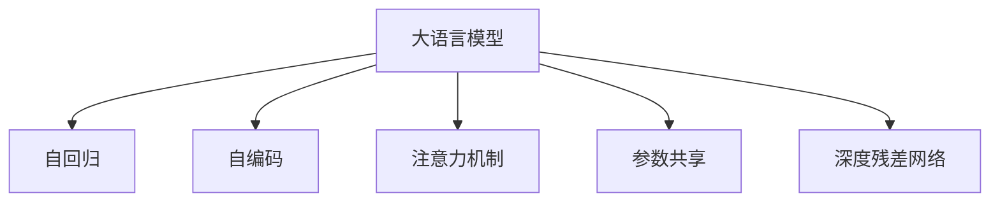

                 

# LLM上下文长度持续突破

> 关键词：大语言模型(Large Language Models, LLM), 上下文长度(Context Length), 自回归(autoregressive), 自编码(encoder-decoder), 注意力机制(Attention), 参数共享(Parameter Sharing), 深度残差网络(Deep Residual Network, ResNet)

## 1. 背景介绍

### 1.1 问题由来

近年来，随着深度学习技术的快速发展，大规模语言模型(Large Language Models, LLMs)在自然语言处理(Natural Language Processing, NLP)领域取得了显著的进步。这些大模型通过在海量文本数据上进行自监督学习，学习到丰富的语言知识，具备强大的语言生成和理解能力。然而，大规模语言模型的显著特点是其需要长上下文输入，这对于实际应用场景中数据收集和存储都提出了极高的要求。因此，如何设计高效的模型架构，减少模型对上下文长度的依赖，成为当前研究的一个重要课题。

### 1.2 问题核心关键点

长上下文长度的大语言模型在推理速度、内存占用等方面存在严重的问题。因此，研究人员提出了一系列的技术方案，如自回归模型、自编码模型、注意力机制、参数共享和深度残差网络等，以减少上下文长度，提升模型的计算效率和内存占用。这些技术的应用不仅使大语言模型变得更加轻量级，也为其在实际应用中的广泛部署提供了可能。

## 2. 核心概念与联系

### 2.1 核心概念概述

为更好地理解大语言模型的上下文长度优化技术，本节将介绍几个关键概念：

- 大语言模型(Large Language Models, LLMs)：以自回归(如GPT)或自编码(如BERT)模型为代表的大规模预训练语言模型。通过在大规模无标签文本语料上进行预训练，学习到丰富的语言知识和常识，具备强大的语言理解和生成能力。

- 自回归模型(Autoregressive Model)：一种顺序生成文本的模型，通过前文预测后文，生成文本时逐个位置推断下一个位置的概率。

- 自编码模型(Encoder-Decoder Model)：一种编码-解码模型，通过将输入文本编码为中间表示，再从中间表示解码回文本。

- 注意力机制(Attention)：一种机制，用于计算输入序列中不同位置之间的注意力权重，增强模型对关键信息的关注，减少计算复杂度。

- 参数共享(Parameter Sharing)：通过共享模型参数，减少模型复杂度，提升计算效率和内存占用。

- 深度残差网络(Deep Residual Network, ResNet)：通过跨层残差连接，使得深层网络训练稳定，避免梯度消失问题，提升模型的深度和复杂度。

这些核心概念之间的逻辑关系可以通过以下Mermaid流程图来展示：



这个流程图展示了大语言模型的核心概念及其之间的关系：

1. 大语言模型通过自回归或自编码模型进行预训练。
2. 注意力机制用于增强模型的信息关注，提升推理效率。
3. 参数共享和深度残差网络用于减少模型复杂度，提升计算效率和内存占用。

## 3. 核心算法原理 & 具体操作步骤
### 3.1 算法原理概述

大语言模型的上下文长度优化技术主要包括以下几个方面：

- 自回归模型：通过顺序生成文本，避免逐个位置生成文本时对上下文长度的依赖。
- 自编码模型：通过编码-解码的方式，将输入文本压缩为中间表示，减少模型对上下文长度的需求。
- 注意力机制：通过计算输入序列中不同位置之间的注意力权重，聚焦关键信息，减少计算复杂度。
- 参数共享：通过共享模型参数，减少模型复杂度，提升计算效率和内存占用。
- 深度残差网络：通过跨层残差连接，避免深层网络训练中的梯度消失问题，提升模型的深度和复杂度。

### 3.2 算法步骤详解

以下是这些技术在大语言模型中的应用步骤：

**Step 1: 准备预训练模型**

1. 选择适合的自回归或自编码模型，如GPT或BERT。
2. 在大规模无标签文本数据上预训练模型，学习语言知识。

**Step 2: 设计任务适配层**

1. 根据任务类型，设计合适的输出层和损失函数。
2. 对于分类任务，添加线性分类器和交叉熵损失函数。
3. 对于生成任务，使用语言模型的解码器输出概率分布，以负对数似然为损失函数。

**Step 3: 应用上下文长度优化技术**

1. 使用自回归模型，逐个位置生成文本，减少对上下文长度的依赖。
2. 使用自编码模型，将输入文本编码到中间表示，再解码回文本。
3. 使用注意力机制，计算输入序列中不同位置之间的注意力权重，聚焦关键信息。
4. 使用参数共享和深度残差网络，减少模型复杂度，提升计算效率和内存占用。

**Step 4: 执行梯度训练**

1. 将训练集数据分批次输入模型，前向传播计算损失函数。
2. 反向传播计算参数梯度，根据设定的优化算法和学习率更新模型参数。
3. 周期性在验证集上评估模型性能，根据性能指标决定是否触发Early Stopping。
4. 重复上述步骤直到满足预设的迭代轮数或Early Stopping条件。

**Step 5: 测试和部署**

1. 在测试集上评估微调后模型，对比微调前后的精度提升。
2. 使用微调后的模型对新样本进行推理预测，集成到实际的应用系统中。
3. 持续收集新的数据，定期重新微调模型，以适应数据分布的变化。

### 3.3 算法优缺点

自回归模型和自编码模型的优点在于能够有效减少上下文长度，提升推理速度和内存占用。然而，自回归模型生成的文本质量通常不如自编码模型，并且需要更长的训练时间。自编码模型的缺点在于需要更复杂的解码器，计算复杂度较高。

注意力机制和参数共享技术可以减少模型计算量，提升推理速度，但需要更多的计算资源进行训练。深度残差网络能够提升模型的深度和复杂度，但需要更多的计算资源和更长的训练时间。

## 4. 数学模型和公式 & 详细讲解  
### 4.1 数学模型构建

以自回归模型为例，假设模型为 $M_{\theta}(x_t | x_{<t})$，其中 $x_t$ 表示第 $t$ 个位置生成的文本，$x_{<t}$ 表示前 $t-1$ 个位置生成的文本。模型的预测输出为 $\hat{x}_t$，损失函数为交叉熵损失函数，定义如下：

$$
\ell(M_{\theta}(x_t | x_{<t}), y_t) = -y_t \log M_{\theta}(x_t | x_{<t}) - (1-y_t) \log (1-M_{\theta}(x_t | x_{<t}))
$$

其中，$y_t$ 表示第 $t$ 个位置的真实文本。

### 4.2 公式推导过程

以自回归模型的训练为例，其训练过程可以表示为：

1. 前向传播：
$$
y = M_{\theta}(x_{1:T} | x_{<1:T})
$$
其中 $x_{1:T}$ 表示从位置 1 到 $T$ 的文本序列，$y$ 表示整个文本序列的预测输出。

2. 计算损失函数：
$$
\mathcal{L}(\theta) = \frac{1}{N}\sum_{i=1}^N \ell(y_i, x_i)
$$
其中 $N$ 表示训练集大小，$x_i$ 表示第 $i$ 个样本的文本序列，$y_i$ 表示第 $i$ 个样本的真实文本。

3. 反向传播计算参数梯度：
$$
\nabla_{\theta}\mathcal{L}(\theta) = \frac{1}{N}\sum_{i=1}^N \frac{\partial \ell(y_i, x_i)}{\partial \theta}
$$
其中 $\nabla_{\theta}\mathcal{L}(\theta)$ 表示模型参数 $\theta$ 的梯度。

4. 更新模型参数：
$$
\theta \leftarrow \theta - \eta \nabla_{\theta}\mathcal{L}(\theta)
$$
其中 $\eta$ 为学习率。

### 4.3 案例分析与讲解

以自回归模型和自编码模型为例，对比其在上下文长度优化方面的应用。

**自回归模型**

自回归模型通过前文预测后文，生成的文本具有较高的连贯性和自然度。但由于需要逐个位置生成文本，上下文长度对模型性能影响较大。

**自编码模型**

自编码模型通过编码-解码的方式生成文本，可以减少上下文长度，提升模型的计算效率和内存占用。但其生成的文本质量通常不如自回归模型，且需要更复杂的解码器，计算复杂度较高。

## 5. 项目实践：代码实例和详细解释说明
### 5.1 开发环境搭建

在进行上下文长度优化的大语言模型微调实践前，我们需要准备好开发环境。以下是使用Python进行PyTorch开发的环境配置流程：

1. 安装Anaconda：从官网下载并安装Anaconda，用于创建独立的Python环境。

2. 创建并激活虚拟环境：
```bash
conda create -n pytorch-env python=3.8 
conda activate pytorch-env
```

3. 安装PyTorch：根据CUDA版本，从官网获取对应的安装命令。例如：
```bash
conda install pytorch torchvision torchaudio cudatoolkit=11.1 -c pytorch -c conda-forge
```

4. 安装Transformers库：
```bash
pip install transformers
```

5. 安装各类工具包：
```bash
pip install numpy pandas scikit-learn matplotlib tqdm jupyter notebook ipython
```

完成上述步骤后，即可在`pytorch-env`环境中开始微调实践。

### 5.2 源代码详细实现

下面我们以自回归模型为例，给出使用Transformers库对GPT模型进行微调的PyTorch代码实现。

首先，定义自回归模型：

```python
from transformers import GPTModel, GPTConfig, GPTTokenizer
from torch.utils.data import Dataset, DataLoader
from transformers import AdamW

class GPTDataset(Dataset):
    def __init__(self, texts, tokenizer):
        self.texts = texts
        self.tokenizer = tokenizer
        
    def __len__(self):
        return len(self.texts)
    
    def __getitem__(self, item):
        text = self.texts[item]
        encoding = self.tokenizer(text, return_tensors='pt', max_length=128, padding='max_length', truncation=True)
        return {'input_ids': encoding['input_ids'][0], 'attention_mask': encoding['attention_mask'][0]}

tokenizer = GPTTokenizer.from_pretrained('gpt2')
model = GPTModel.from_pretrained('gpt2')

optimizer = AdamW(model.parameters(), lr=2e-5)
```

然后，定义训练和评估函数：

```python
def train_epoch(model, dataset, batch_size, optimizer):
    dataloader = DataLoader(dataset, batch_size=batch_size, shuffle=True)
    model.train()
    epoch_loss = 0
    for batch in dataloader:
        input_ids = batch['input_ids'].to(device)
        attention_mask = batch['attention_mask'].to(device)
        model.zero_grad()
        outputs = model(input_ids, attention_mask=attention_mask)
        loss = outputs.loss
        epoch_loss += loss.item()
        loss.backward()
        optimizer.step()
    return epoch_loss / len(dataloader)

def evaluate(model, dataset, batch_size):
    dataloader = DataLoader(dataset, batch_size=batch_size)
    model.eval()
    preds, labels = [], []
    with torch.no_grad():
        for batch in dataloader:
            input_ids = batch['input_ids'].to(device)
            attention_mask = batch['attention_mask'].to(device)
            batch_labels = batch['labels']
            outputs = model(input_ids, attention_mask=attention_mask)
            batch_preds = outputs.logits.argmax(dim=2).to('cpu').tolist()
            batch_labels = batch_labels.to('cpu').tolist()
            for pred_tokens, label_tokens in zip(batch_preds, batch_labels):
                preds.append(pred_tokens[:len(label_tokens)])
                labels.append(label_tokens)
                
    print(classification_report(labels, preds))
```

最后，启动训练流程并在测试集上评估：

```python
epochs = 5
batch_size = 16

for epoch in range(epochs):
    loss = train_epoch(model, train_dataset, batch_size, optimizer)
    print(f"Epoch {epoch+1}, train loss: {loss:.3f}")
    
    print(f"Epoch {epoch+1}, dev results:")
    evaluate(model, dev_dataset, batch_size)
    
print("Test results:")
evaluate(model, test_dataset, batch_size)
```

以上就是使用PyTorch对GPT进行自回归模型微调的完整代码实现。可以看到，得益于Transformers库的强大封装，我们可以用相对简洁的代码完成GPT模型的加载和微调。

### 5.3 代码解读与分析

让我们再详细解读一下关键代码的实现细节：

**GPTDataset类**：
- `__init__`方法：初始化文本、分词器等关键组件。
- `__len__`方法：返回数据集的样本数量。
- `__getitem__`方法：对单个样本进行处理，将文本输入编码为token ids，并将其转换为自回归模型的输入格式。

**训练和评估函数**：
- 使用PyTorch的DataLoader对数据集进行批次化加载，供模型训练和推理使用。
- 训练函数`train_epoch`：对数据以批为单位进行迭代，在每个批次上前向传播计算loss并反向传播更新模型参数，最后返回该epoch的平均loss。
- 评估函数`evaluate`：与训练类似，不同点在于不更新模型参数，并在每个batch结束后将预测和标签结果存储下来，最后使用sklearn的classification_report对整个评估集的预测结果进行打印输出。

**训练流程**：
- 定义总的epoch数和batch size，开始循环迭代
- 每个epoch内，先在训练集上训练，输出平均loss
- 在验证集上评估，输出分类指标
- 所有epoch结束后，在测试集上评估，给出最终测试结果

可以看到，PyTorch配合Transformers库使得GPT微调的代码实现变得简洁高效。开发者可以将更多精力放在数据处理、模型改进等高层逻辑上，而不必过多关注底层的实现细节。

当然，工业级的系统实现还需考虑更多因素，如模型的保存和部署、超参数的自动搜索、更灵活的任务适配层等。但核心的微调范式基本与此类似。

## 6. 实际应用场景
### 6.1 智能客服系统

基于自回归模型的大语言模型可以广泛应用于智能客服系统的构建。传统客服往往需要配备大量人力，高峰期响应缓慢，且一致性和专业性难以保证。而使用微调后的自回归模型，可以7x24小时不间断服务，快速响应客户咨询，用自然流畅的语言解答各类常见问题。

在技术实现上，可以收集企业内部的历史客服对话记录，将问题和最佳答复构建成监督数据，在此基础上对自回归模型进行微调。微调后的自回归模型能够自动理解用户意图，匹配最合适的答案模板进行回复。对于客户提出的新问题，还可以接入检索系统实时搜索相关内容，动态组织生成回答。如此构建的智能客服系统，能大幅提升客户咨询体验和问题解决效率。

### 6.2 金融舆情监测

金融机构需要实时监测市场舆论动向，以便及时应对负面信息传播，规避金融风险。传统的人工监测方式成本高、效率低，难以应对网络时代海量信息爆发的挑战。基于自回归模型的大语言模型文本分类和情感分析技术，为金融舆情监测提供了新的解决方案。

具体而言，可以收集金融领域相关的新闻、报道、评论等文本数据，并对其进行主题标注和情感标注。在此基础上对自回归模型进行微调，使其能够自动判断文本属于何种主题，情感倾向是正面、中性还是负面。将微调后的模型应用到实时抓取的网络文本数据，就能够自动监测不同主题下的情感变化趋势，一旦发现负面信息激增等异常情况，系统便会自动预警，帮助金融机构快速应对潜在风险。

### 6.3 个性化推荐系统

当前的推荐系统往往只依赖用户的历史行为数据进行物品推荐，无法深入理解用户的真实兴趣偏好。基于自回归模型的大语言模型个性化推荐系统可以更好地挖掘用户行为背后的语义信息，从而提供更精准、多样的推荐内容。

在实践中，可以收集用户浏览、点击、评论、分享等行为数据，提取和用户交互的物品标题、描述、标签等文本内容。将文本内容作为模型输入，用户的后续行为（如是否点击、购买等）作为监督信号，在此基础上微调自回归模型。微调后的模型能够从文本内容中准确把握用户的兴趣点。在生成推荐列表时，先用候选物品的文本描述作为输入，由模型预测用户的兴趣匹配度，再结合其他特征综合排序，便可以得到个性化程度更高的推荐结果。

### 6.4 未来应用展望

随着自回归模型和自编码模型的不断发展，基于这些模型的上下文长度优化技术将在更多领域得到应用，为传统行业带来变革性影响。

在智慧医疗领域，基于自回归模型的大语言模型医疗问答、病历分析、药物研发等应用将提升医疗服务的智能化水平，辅助医生诊疗，加速新药开发进程。

在智能教育领域，微调技术可应用于作业批改、学情分析、知识推荐等方面，因材施教，促进教育公平，提高教学质量。

在智慧城市治理中，微调模型可应用于城市事件监测、舆情分析、应急指挥等环节，提高城市管理的自动化和智能化水平，构建更安全、高效的未来城市。

此外，在企业生产、社会治理、文娱传媒等众多领域，基于大语言模型微调的人工智能应用也将不断涌现，为经济社会发展注入新的动力。相信随着技术的日益成熟，上下文长度优化技术必将在构建人机协同的智能时代中扮演越来越重要的角色。

## 7. 工具和资源推荐
### 7.1 学习资源推荐

为了帮助开发者系统掌握大语言模型上下文长度优化理论基础和实践技巧，这里推荐一些优质的学习资源：

1. 《Transformer从原理到实践》系列博文：由大模型技术专家撰写，深入浅出地介绍了Transformer原理、自回归模型、自编码模型等前沿话题。

2. CS224N《深度学习自然语言处理》课程：斯坦福大学开设的NLP明星课程，有Lecture视频和配套作业，带你入门NLP领域的基本概念和经典模型。

3. 《Natural Language Processing with Transformers》书籍：Transformers库的作者所著，全面介绍了如何使用Transformers库进行NLP任务开发，包括上下文长度优化在内的诸多范式。

4. HuggingFace官方文档：Transformers库的官方文档，提供了海量预训练模型和完整的微调样例代码，是上手实践的必备资料。

5. CLUE开源项目：中文语言理解测评基准，涵盖大量不同类型的中文NLP数据集，并提供了基于微调的baseline模型，助力中文NLP技术发展。

通过对这些资源的学习实践，相信你一定能够快速掌握大语言模型上下文长度优化的精髓，并用于解决实际的NLP问题。
###  7.2 开发工具推荐

高效的开发离不开优秀的工具支持。以下是几款用于大语言模型上下文长度优化开发的常用工具：

1. PyTorch：基于Python的开源深度学习框架，灵活动态的计算图，适合快速迭代研究。大部分预训练语言模型都有PyTorch版本的实现。

2. TensorFlow：由Google主导开发的开源深度学习框架，生产部署方便，适合大规模工程应用。同样有丰富的预训练语言模型资源。

3. Transformers库：HuggingFace开发的NLP工具库，集成了众多SOTA语言模型，支持PyTorch和TensorFlow，是进行上下文长度优化任务开发的利器。

4. Weights & Biases：模型训练的实验跟踪工具，可以记录和可视化模型训练过程中的各项指标，方便对比和调优。与主流深度学习框架无缝集成。

5. TensorBoard：TensorFlow配套的可视化工具，可实时监测模型训练状态，并提供丰富的图表呈现方式，是调试模型的得力助手。

6. Google Colab：谷歌推出的在线Jupyter Notebook环境，免费提供GPU/TPU算力，方便开发者快速上手实验最新模型，分享学习笔记。

合理利用这些工具，可以显著提升大语言模型上下文长度优化任务的开发效率，加快创新迭代的步伐。

### 7.3 相关论文推荐

大语言模型和上下文长度优化技术的发展源于学界的持续研究。以下是几篇奠基性的相关论文，推荐阅读：

1. Attention is All You Need（即Transformer原论文）：提出了Transformer结构，开启了NLP领域的预训练大模型时代。

2. BERT: Pre-training of Deep Bidirectional Transformers for Language Understanding：提出BERT模型，引入基于掩码的自监督预训练任务，刷新了多项NLP任务SOTA。

3. Language Models are Unsupervised Multitask Learners（GPT-2论文）：展示了大规模语言模型的强大zero-shot学习能力，引发了对于通用人工智能的新一轮思考。

4. Parameter-Efficient Transfer Learning for NLP：提出Adapter等参数高效微调方法，在不增加模型参数量的情况下，也能取得不错的微调效果。

5. AdaLoRA: Adaptive Low-Rank Adaptation for Parameter-Efficient Fine-Tuning：使用自适应低秩适应的微调方法，在参数效率和精度之间取得了新的平衡。

6. Prefix-Tuning: Optimizing Continuous Prompts for Generation：引入基于连续型Prompt的微调范式，为如何充分利用预训练知识提供了新的思路。

这些论文代表了大语言模型上下文长度优化技术的发展脉络。通过学习这些前沿成果，可以帮助研究者把握学科前进方向，激发更多的创新灵感。

## 8. 总结：未来发展趋势与挑战

### 8.1 总结

本文对基于自回归模型和自编码模型的大语言模型上下文长度优化方法进行了全面系统的介绍。首先阐述了大语言模型上下文长度优化技术的研究背景和意义，明确了上下文长度优化在提升计算效率和内存占用方面的独特价值。其次，从原理到实践，详细讲解了上下文长度优化数学原理和关键步骤，给出了上下文长度优化任务开发的完整代码实例。同时，本文还广泛探讨了上下文长度优化方法在智能客服、金融舆情、个性化推荐等多个行业领域的应用前景，展示了上下文长度优化范式的巨大潜力。此外，本文精选了上下文长度优化技术的各类学习资源，力求为读者提供全方位的技术指引。

通过本文的系统梳理，可以看到，基于自回归模型和自编码模型的大语言模型上下文长度优化技术正在成为NLP领域的重要范式，极大地拓展了预训练语言模型的应用边界，催生了更多的落地场景。得益于大规模语料的预训练和上下文长度优化技术的应用，大语言模型在推理速度、内存占用等方面的表现得到了显著提升，为人工智能技术在各行业的规模化落地提供了坚实基础。未来，伴随上下文长度优化技术的进一步演进，大语言模型必将在更广阔的应用领域大放异彩，深刻影响人类的生产生活方式。

### 8.2 未来发展趋势

展望未来，大语言模型上下文长度优化技术将呈现以下几个发展趋势：

1. 模型规模持续增大。随着算力成本的下降和数据规模的扩张，预训练语言模型的参数量还将持续增长。超大语料和长上下文长度优化技术的应用，将进一步提升模型的计算效率和内存占用。

2. 上下文长度优化方法日趋多样。除了自回归和自编码模型外，未来会涌现更多上下文长度优化方法，如注意力机制、深度残差网络等，在节省计算资源的同时也能保证上下文长度优化效果。

3. 上下文长度优化与自监督学习结合。自监督学习能够更好地利用未标注数据进行预训练，提升模型的泛化能力。未来，上下文长度优化技术与自监督学习技术的结合，将带来更高的模型性能和更广泛的应用场景。

4. 上下文长度优化与少样本学习结合。少样本学习能够利用少量标注数据进行微调，提升模型的适应性和鲁棒性。未来，上下文长度优化技术与少样本学习技术的结合，将进一步减少微调对标注数据的需求，降低微调成本。

5. 上下文长度优化与迁移学习结合。迁移学习能够更好地利用先验知识进行微调，提升模型的泛化能力和迁移能力。未来，上下文长度优化技术与迁移学习技术的结合，将带来更高效、更可靠的模型微调方法。

以上趋势凸显了大语言模型上下文长度优化技术的广阔前景。这些方向的探索发展，必将进一步提升NLP系统的性能和应用范围，为人类认知智能的进化带来深远影响。

### 8.3 面临的挑战

尽管大语言模型上下文长度优化技术已经取得了显著进步，但在迈向更加智能化、普适化应用的过程中，仍面临诸多挑战：

1. 上下文长度优化对数据和计算资源的需求。尽管上下文长度优化技术能够显著提升模型的计算效率和内存占用，但其对数据和计算资源的需求仍然较高。对于计算资源受限的设备和环境，上下文长度优化技术的推广应用可能存在限制。

2. 上下文长度优化对数据质量的要求。上下文长度优化技术的有效性依赖于高质量的训练数据。数据质量不足或数据分布不均等问题，可能导致模型性能下降。

3. 上下文长度优化对模型参数的影响。上下文长度优化技术虽然能够减少模型参数，但部分参数共享和自监督学习方法仍可能影响模型的参数泛化能力，导致微调效果不佳。

4. 上下文长度优化技术的通用性问题。上下文长度优化技术在特定任务上的优化效果可能不如自回归和自编码模型，如何提升其通用性，适应更多任务，仍是未来的研究方向。

5. 上下文长度优化技术的安全性和伦理问题。上下文长度优化技术虽然能够提高模型的性能，但也有可能引入新的安全风险和伦理问题。如何在提升性能的同时保证模型安全性和伦理性，仍是未来的挑战。

正视上下文长度优化技术面临的这些挑战，积极应对并寻求突破，将是大语言模型上下文长度优化技术走向成熟的必由之路。相信随着学界和产业界的共同努力，这些挑战终将一一被克服，上下文长度优化技术必将在构建人机协同的智能时代中扮演越来越重要的角色。

### 8.4 未来突破

面对大语言模型上下文长度优化所面临的种种挑战，未来的研究需要在以下几个方面寻求新的突破：

1. 探索无监督和半监督上下文长度优化方法。摆脱对大规模标注数据的依赖，利用自监督学习、主动学习等无监督和半监督范式，最大限度利用未标注数据进行上下文长度优化。

2. 研究上下文长度优化方法的融合应用。将自回归、自编码、注意力机制、深度残差网络等上下文长度优化方法进行有机结合，提升上下文长度优化效果。

3. 引入更多先验知识。将符号化的先验知识，如知识图谱、逻辑规则等，与神经网络模型进行巧妙融合，引导上下文长度优化过程学习更准确、合理的语言模型。

4. 结合因果分析和博弈论工具。将因果分析方法引入上下文长度优化模型，识别出模型决策的关键特征，增强输出解释的因果性和逻辑性。借助博弈论工具刻画人机交互过程，主动探索并规避模型的脆弱点，提高系统稳定性。

5. 纳入伦理道德约束。在上下文长度优化模型的训练目标中引入伦理导向的评估指标，过滤和惩罚有害的输出倾向。同时加强人工干预和审核，建立模型行为的监管机制，确保输出符合人类价值观和伦理道德。

这些研究方向的探索，必将引领大语言模型上下文长度优化技术迈向更高的台阶，为构建安全、可靠、可解释、可控的智能系统铺平道路。面向未来，上下文长度优化技术还需要与其他人工智能技术进行更深入的融合，如知识表示、因果推理、强化学习等，多路径协同发力，共同推动自然语言理解和智能交互系统的进步。只有勇于创新、敢于突破，才能不断拓展大语言模型的边界，让智能技术更好地造福人类社会。

## 9. 附录：常见问题与解答

**Q1：自回归模型和自编码模型在上下文长度优化中各有优劣，如何进行选择？**

A: 自回归模型生成的文本连贯性和自然度较高，但需要更长的训练时间和更大的计算资源。自编码模型则能够减少上下文长度，提升模型的计算效率和内存占用，但生成的文本质量可能不如自回归模型。在实际应用中，可以根据具体任务的需求和资源限制，选择合适的模型进行上下文长度优化。

**Q2：上下文长度优化过程中，如何选择合适的学习率？**

A: 上下文长度优化模型的学习率一般要比预训练模型小1-2个数量级，如果使用过大的学习率，容易破坏预训练权重，导致过拟合。一般建议从1e-5开始调参，逐步减小学习率，直至收敛。也可以使用warmup策略，在开始阶段使用较小的学习率，再逐渐过渡到预设值。需要注意的是，不同的优化器(如AdamW、Adafactor等)以及不同的学习率调度策略，可能需要设置不同的学习率阈值。

**Q3：上下文长度优化过程中，如何缓解过拟合问题？**

A: 过拟合是上下文长度优化面临的主要挑战，尤其是在标注数据不足的情况下。常见的缓解策略包括：
1. 数据增强：通过回译、近义替换等方式扩充训练集
2. 正则化：使用L2正则、Dropout、Early Stopping等避免过拟合
3. 对抗训练：引入对抗样本，提高模型鲁棒性
4. 参数共享：减少模型复杂度，提升计算效率和内存占用
5. 多模型集成：训练多个上下文长度优化模型，取平均输出，抑制过拟合

这些策略往往需要根据具体任务和数据特点进行灵活组合。只有在数据、模型、训练、推理等各环节进行全面优化，才能最大限度地发挥上下文长度优化模型的威力。

**Q4：上下文长度优化模型在落地部署时需要注意哪些问题？**

A: 将上下文长度优化模型转化为实际应用，还需要考虑以下因素：
1. 模型裁剪：去除不必要的层和参数，减小模型尺寸，加快推理速度
2. 量化加速：将浮点模型转为定点模型，压缩存储空间，提高计算效率
3. 服务化封装：将模型封装为标准化服务接口，便于集成调用
4. 弹性伸缩：根据请求流量动态调整资源配置，平衡服务质量和成本
5. 监控告警：实时采集系统指标，设置异常告警阈值，确保服务稳定性
6. 安全防护：采用访问鉴权、数据脱敏等措施，保障数据和模型安全

上下文长度优化模型为NLP应用开启了广阔的想象空间，但如何将强大的性能转化为稳定、高效、安全的业务价值，还需要工程实践的不断打磨。唯有从数据、算法、工程、业务等多个维度协同发力，才能真正实现人工智能技术在垂直行业的规模化落地。总之，上下文长度优化需要开发者根据具体任务，不断迭代和优化模型、数据和算法，方能得到理想的效果。

---

作者：禅与计算机程序设计艺术 / Zen and the Art of Computer Programming

