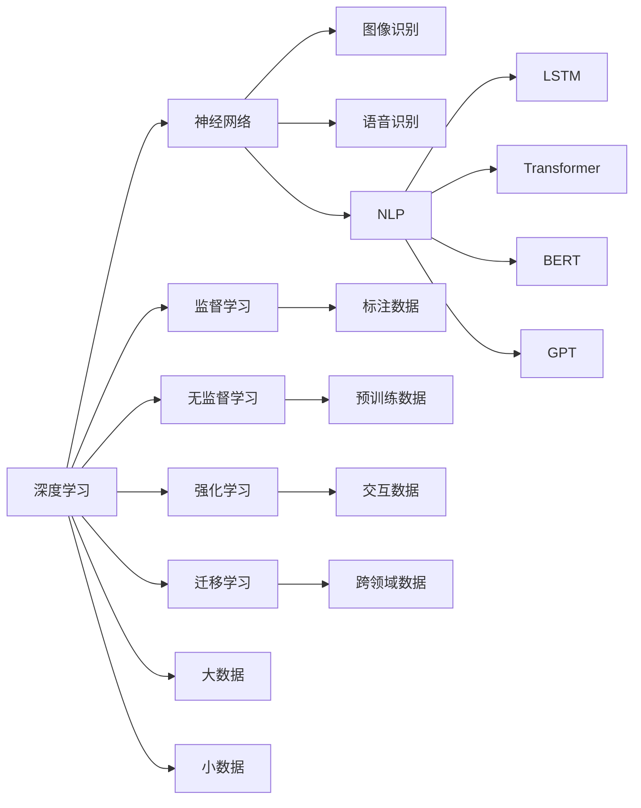

                 

# LLM与传统AI的对比：新旧智能范式的碰撞

> 关键词：语言模型,深度学习,传统AI,人工智能,对比分析

## 1. 背景介绍

### 1.1 问题由来
随着人工智能(AI)技术的发展，深度学习(DL)技术在NLP、图像识别、语音识别等诸多领域取得了突破性的进展。传统AI技术和深度学习范式在过去几十年间都有过重要的应用，但随着深度学习特别是大语言模型(LLM)的兴起，两者之间的差异和碰撞逐渐显现出来。

### 1.2 问题核心关键点
本文将从以下几个核心问题入手，探讨深度学习和传统AI范式之间的异同，以及大语言模型在当前AI领域的独特优势和面临的挑战。
- 深度学习与传统AI技术的对比分析。
- 大语言模型(LLM)的兴起对AI领域的影响。
- LLM与传统AI在模型架构、训练方式、应用场景等方面的对比。
- LLM与传统AI在可解释性、泛化能力、数据需求等方面的优劣。

## 2. 核心概念与联系

### 2.1 核心概念概述

为更好地理解深度学习和传统AI范式，以及大语言模型的对比分析，本文将首先介绍几个关键概念：

- **深度学习(Deep Learning)**：一种基于神经网络模型的学习范式，通过多层非线性映射，实现对复杂数据的高效建模和处理。
- **传统人工智能(Conventional AI)**：包括规则、符号、逻辑等以知识驱动的AI方法。
- **大语言模型(Large Language Models, LLMs)**：以Transformer架构为基础，通过大规模无标签文本数据的预训练和下游任务的微调，学习到丰富的语言表示。
- **可解释性(Explainability)**：模型的决策过程能够被解释，即模型为何输出特定结果的逻辑和依据。
- **泛化能力(Generalization)**：模型对未见过的数据进行推理的能力。
- **数据需求(Data Requirement)**：模型训练所需的数据量和质量。

这些概念之间的联系和区别可以通过以下Mermaid流程图来展示：



这个流程图展示了深度学习的主要分支和代表性模型，以及深度学习与传统AI范式在数据来源、学习方式和应用领域的差异。

## 3. 核心算法原理 & 具体操作步骤

### 3.1 算法原理概述

深度学习和传统AI范式在算法原理上有本质的不同：

- **深度学习**：通过构建多层神经网络模型，将输入数据映射到输出结果。训练过程使用反向传播算法优化模型参数，使得模型能够逼近目标函数。
- **传统AI**：通过定义明确的规则和逻辑，进行符号计算和推理，得出决策结果。主要依赖于专家知识和手工编写的规则。

大语言模型(LLM)作为深度学习的一种，其算法原理基于自回归或自编码模型，通过大规模无标签文本数据的预训练和下游任务的微调，学习到通用的语言表示。

### 3.2 算法步骤详解

深度学习的核心步骤如下：

1. **数据准备**：收集标注数据，进行预处理，将数据转换为模型能够处理的格式。
2. **模型构建**：设计网络结构，选择激活函数、损失函数、优化器等超参数。
3. **模型训练**：使用标注数据训练模型，通过前向传播和反向传播更新模型参数。
4. **模型评估**：在测试集上评估模型性能，调整模型参数，重复训练过程直至收敛。

大语言模型的训练步骤如下：

1. **预训练**：在大规模无标签文本数据上进行自监督学习，学习到通用语言表示。
2. **微调**：在特定下游任务上，使用少量标注数据进行有监督学习，优化模型在该任务上的性能。
3. **评估**：在测试集上评估模型性能，调整超参数，重复微调过程直至收敛。

### 3.3 算法优缺点

深度学习和传统AI范式各有优缺点：

- **深度学习**：
  - 优点：能够处理复杂数据，具备强大的泛化能力，适合于大规模数据训练。
  - 缺点：需要大量标注数据，模型难以解释，存在过拟合风险。

- **传统AI**：
  - 优点：解释性强，规则明确，容易维护和理解。
  - 缺点：数据需求高，依赖专家知识，灵活性不足。

大语言模型(LLM)作为深度学习的一种，其优点和缺点如下：

- **优点**：
  - 数据需求较低，可以通过大规模无标签数据进行预训练。
  - 泛化能力强，在多种任务上表现优异。
  - 训练速度较快，具备高可扩展性。

- **缺点**：
  - 可解释性不足，难以解释模型的推理逻辑。
  - 对标注数据依赖较大，难以处理长尾数据。
  - 存在过拟合风险，需要精心设计和调整。

### 3.4 算法应用领域

深度学习和传统AI范式在应用领域上也有显著差异：

- **深度学习**：广泛应用于计算机视觉、自然语言处理、语音识别等领域的任务，如图像分类、目标检测、语音识别、机器翻译等。
- **传统AI**：主要用于规则明确、逻辑可解释的任务，如专家系统、定理证明、智能控制等。

大语言模型(LLM)在多个应用领域展现了其独特优势：

- **自然语言处理(NLP)**：在问答、对话、翻译、摘要、情感分析等任务上取得了突破性进展。
- **知识图谱**：在实体抽取、关系抽取、知识推理等任务上表现优异。
- **推荐系统**：在个性化推荐、内容生成等任务上展示了强大的能力。
- **游戏AI**：在决策树、博弈论、强化学习等领域取得了重要成果。

## 4. 数学模型和公式 & 详细讲解 & 举例说明

### 4.1 数学模型构建

深度学习的核心数学模型包括神经网络、损失函数、优化器等。以神经网络为例，其结构可以表示为：

$$
y = f(x; \theta)
$$

其中 $x$ 为输入数据，$y$ 为输出结果，$\theta$ 为模型参数，$f$ 为非线性激活函数。

深度学习的优化目标为最小化损失函数：

$$
L(\theta) = \frac{1}{N}\sum_{i=1}^N l(y_i, \hat{y}_i)
$$

其中 $l$ 为损失函数，$\hat{y}_i$ 为模型预测结果。

### 4.2 公式推导过程

以多层感知机(MLP)为例，假设输入数据 $x$ 经过多个隐层 $h$ 的映射后，输出结果 $y$ 的计算公式为：

$$
y = W_1z_1 + b_1
$$

$$
z_i = \sigma(W_iz_{i-1} + b_i)
$$

其中 $z_i$ 为第 $i$ 层的输出，$W_i$ 为第 $i$ 层的权重，$b_i$ 为第 $i$ 层的偏置，$\sigma$ 为激活函数。

### 4.3 案例分析与讲解

以图像识别为例，假设输入为图像像素 $x$，输出为图像标签 $y$，模型的计算过程如下：

1. 卷积层提取特征：
   $$
   x' = \text{Conv}(x)
   $$
2. 池化层降维：
   $$
   x'' = \text{Pool}(x')
   $$
3. 全连接层进行分类：
   $$
   y = \text{Softmax}(Wx + b)
   $$

其中 $\text{Conv}$ 和 $\text{Pool}$ 分别为卷积和池化操作，$W$ 为权重矩阵，$b$ 为偏置向量，$\text{Softmax}$ 为激活函数。

## 5. 项目实践：代码实例和详细解释说明

### 5.1 开发环境搭建

在进行深度学习项目实践时，需要安装以下工具和库：

1. Python：安装3.7或以上版本，确保足够的内存和CPU资源。
2. PyTorch：安装1.8或以上版本，支持深度学习模型的构建和训练。
3. TensorFlow：安装2.0或以上版本，支持分布式训练和模型部署。
4. Keras：安装2.3或以上版本，提供简单易用的API接口。
5. Jupyter Notebook：用于交互式编程和结果展示。
6. Anaconda：用于创建虚拟环境，隔离项目依赖。

### 5.2 源代码详细实现

以下是一个使用PyTorch进行图像分类任务代码实现示例：

```python
import torch
import torch.nn as nn
import torch.optim as optim

# 定义模型结构
class Net(nn.Module):
    def __init__(self):
        super(Net, self).__init__()
        self.conv1 = nn.Conv2d(3, 6, 5)
        self.pool = nn.MaxPool2d(2, 2)
        self.conv2 = nn.Conv2d(6, 16, 5)
        self.fc1 = nn.Linear(16 * 5 * 5, 120)
        self.fc2 = nn.Linear(120, 84)
        self.fc3 = nn.Linear(84, 10)

    def forward(self, x):
        x = self.pool(F.relu(self.conv1(x)))
        x = self.pool(F.relu(self.conv2(x)))
        x = x.view(-1, 16 * 5 * 5)
        x = F.relu(self.fc1(x))
        x = F.relu(self.fc2(x))
        x = self.fc3(x)
        return x

# 定义数据集
train_dataset = ...
test_dataset = ...

# 定义训练器
model = Net()
criterion = nn.CrossEntropyLoss()
optimizer = optim.SGD(model.parameters(), lr=0.001, momentum=0.9)

# 训练过程
for epoch in range(10):
    running_loss = 0.0
    for i, data in enumerate(train_loader, 0):
        inputs, labels = data
        optimizer.zero_grad()
        outputs = model(inputs)
        loss = criterion(outputs, labels)
        loss.backward()
        optimizer.step()

        running_loss += loss.item()
    print('Epoch %d loss: %.3f' % (epoch + 1, running_loss / len(train_loader)))

# 测试过程
correct = 0
total = 0
with torch.no_grad():
    for data in test_loader:
        inputs, labels = data
        outputs = model(inputs)
        _, predicted = torch.max(outputs.data, 1)
        total += labels.size(0)
        correct += (predicted == labels).sum().item()

print('Accuracy: %.2f %%' % (100 * correct / total))
```

### 5.3 代码解读与分析

在上述代码中，我们定义了一个简单的卷积神经网络(CNN)模型，用于图像分类任务。

- `Net`类：定义了模型结构，包括卷积层、池化层、全连接层等。
- `forward`方法：描述了模型前向传播的计算过程。
- `train`函数：进行了10轮的训练，使用随机梯度下降法优化模型参数。
- `test`函数：测试了模型在测试集上的分类准确率。

### 5.4 运行结果展示

在训练过程中，我们打印了每一轮的损失值。在测试过程中，我们打印了分类准确率。

## 6. 实际应用场景

### 6.1 智能推荐系统

深度学习在智能推荐系统中发挥了重要作用。通过学习用户的历史行为数据，推荐系统能够生成个性化推荐结果，提高用户满意度和转化率。

- **传统AI**：基于规则和知识库，进行用户行为分析，推荐结果生成。
- **深度学习**：通过协同过滤、矩阵分解等方法，利用用户-物品评分矩阵，生成推荐结果。

### 6.2 医疗影像诊断

深度学习在医疗影像诊断中也得到了广泛应用。通过训练神经网络模型，能够自动识别和分类病变区域，辅助医生诊断。

- **传统AI**：基于专家知识，使用规则和逻辑进行图像分析。
- **深度学习**：通过大量标注数据，训练卷积神经网络，自动识别病变区域。

### 6.3 自动驾驶

深度学习在自动驾驶中也表现出色。通过训练神经网络，能够识别交通标志、行人、车辆等对象，做出安全驾驶决策。

- **传统AI**：基于专家规则和逻辑，进行决策分析。
- **深度学习**：通过视觉识别、物体检测等方法，识别环境信息，做出决策。

## 7. 工具和资源推荐

### 7.1 学习资源推荐

深度学习的学习资源包括：

1. **深度学习入门**：
   - 《Deep Learning》 by Ian Goodfellow, Yoshua Bengio, Aaron Courville
   - 《深度学习：入门与实践》 by Tarry Singh, Michael Fitzke, Vishal Bhardwaj

2. **深度学习框架**：
   - PyTorch官方文档
   - TensorFlow官方文档
   - Keras官方文档

3. **深度学习社区**：
   - Reddit深度学习社区
   - Kaggle深度学习竞赛

4. **在线课程**：
   - Coursera《深度学习专项课程》
   - Udacity《深度学习纳米学位》

### 7.2 开发工具推荐

深度学习的开发工具包括：

1. **IDE**：
   - PyCharm
   - Visual Studio Code

2. **计算资源**：
   - Google Colab
   - AWS Deep Learning AMI

3. **数据处理工具**：
   - Pandas
   - NumPy

4. **可视化工具**：
   - TensorBoard
   - Matplotlib

### 7.3 相关论文推荐

深度学习的相关论文包括：

1. **卷积神经网络**：
   - AlexNet: ImageNet Classification with Deep Convolutional Neural Networks
   - Inception: GoogLeNet
   - ResNet: Deep Residual Learning for Image Recognition

2. **循环神经网络**：
   - RNN: Recurrent Neural Network
   - LSTM: Long Short-Term Memory
   - GRU: Gated Recurrent Unit

3. **深度学习优化**：
   - Adam: A Method for Stochastic Optimization
   - Adagrad: Adaptive Subgradient Methods for Online Learning and Stochastic Optimization
   - RMSprop: A Method for Stochastic Optimization

4. **深度学习应用**：
   - Yann LeCun, Yoshua Bengio, Geoffrey Hinton: Deep Learning, 2015
   - Ian Goodfellow, Yoshua Bengio, Aaron Courville: Deep Learning, 2016

## 8. 总结：未来发展趋势与挑战

### 8.1 研究成果总结

深度学习和传统AI范式在算法原理、模型结构、应用场景等方面都有显著区别。大语言模型(LLM)作为深度学习的一种，具备强大的泛化能力，但在可解释性、数据需求等方面仍需进一步提升。

### 8.2 未来发展趋势

深度学习的未来发展趋势包括：

1. **自动化**：通过自动化算法生成模型结构和超参数，提高模型训练效率。
2. **弱监督学习**：利用少量标注数据进行弱监督学习，提高模型泛化能力。
3. **混合学习**：结合传统AI和深度学习，实现更加鲁棒的决策系统。
4. **可解释性**：提高模型可解释性，增强透明度和可信度。

### 8.3 面临的挑战

深度学习面临的挑战包括：

1. **数据需求**：需要大量标注数据，难以满足长尾应用场景的需求。
2. **模型复杂性**：模型结构复杂，难以理解和调试。
3. **计算资源**：需要高性能计算设备，难以普及。

### 8.4 研究展望

深度学习的未来研究展望包括：

1. **迁移学习**：通过迁移学习提高模型的泛化能力。
2. **多模态学习**：结合视觉、语音、文本等多模态信息，提升模型性能。
3. **知识图谱**：利用知识图谱进行知识推理和决策。
4. **可解释性**：提高模型的可解释性，增强透明度和可信度。

## 9. 附录：常见问题与解答

### Q1: 深度学习与传统AI的主要区别是什么？

A: 深度学习通过构建多层神经网络，利用大量数据进行训练，学习到高层次的特征表示；传统AI通过定义明确的规则和逻辑，进行符号计算和推理，需要专家知识。

### Q2: 深度学习在哪些领域取得了突破性进展？

A: 深度学习在计算机视觉、自然语言处理、语音识别、推荐系统、医疗影像诊断等领域取得了重要成果。

### Q3: 大语言模型(LLM)有哪些优缺点？

A: 大语言模型具备强大的泛化能力，数据需求较低，训练速度快，但可解释性不足，存在过拟合风险。

### Q4: 如何提高深度学习的可解释性？

A: 通过可视化工具（如TensorBoard）进行模型解释，结合符号化的先验知识，增强模型的可解释性。

### Q5: 未来深度学习的发展方向是什么？

A: 自动化算法生成、弱监督学习、混合学习、可解释性增强等方向将推动深度学习的进一步发展。

---

作者：禅与计算机程序设计艺术 / Zen and the Art of Computer Programming

