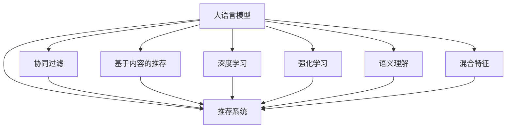

                 

# LLM与传统推荐模型的融合策略

> 关键词：
```markdown
# LLM与传统推荐模型的融合策略

> 关键词：大语言模型,推荐系统,混合学习,协同过滤,内容推荐,深度学习,强化学习,语义理解,混合特征
```

## 1. 背景介绍

### 1.1 问题由来
推荐系统是互联网应用中不可或缺的一部分，通过智能算法为用户推荐内容，提升用户体验。然而，传统推荐模型如协同过滤(Collaborative Filtering, CF)和基于内容的推荐方法，存在一定局限性：

1. 协同过滤需要大规模用户行为数据，无法实时响应用户行为变化。
2. 基于内容的推荐无法全面刻画用户兴趣，难以处理长尾内容。
3. 单模型推荐方法无法充分利用多模态数据，如图片、视频等。

近年来，大语言模型(Large Language Model, LLM)凭借其强大的自然语言处理能力，逐渐在推荐系统领域崭露头角。将LLM引入推荐系统，不仅能弥补传统推荐方法的不足，还能开辟新的研究方向。本文将深入探讨LLM与传统推荐模型的融合策略，助力推荐系统性能的进一步提升。

## 2. 核心概念与联系

### 2.1 核心概念概述

为更好地理解LLM与传统推荐模型的融合策略，本节将介绍几个关键概念：

- 大语言模型(Large Language Model, LLM)：以自回归(如GPT)或自编码(如BERT)模型为代表的大规模预训练语言模型。通过在大规模无标签文本语料上进行预训练，学习通用的语言表示，具备强大的语言理解和生成能力。

- 推荐系统(Recommendation System)：通过智能算法为用户推荐商品、内容、服务等的系统，包括协同过滤、基于内容的推荐、混合推荐等。

- 混合学习(Mixed Learning)：指将多种学习方式结合，如深度学习、协同过滤、强化学习等，综合多模态数据信息，提升推荐系统的准确性和多样性。

- 协同过滤(Collaborative Filtering)：通过分析用户行为数据，找到与目标用户相似的用户，推荐该用户喜欢的物品。

- 基于内容的推荐(Content-Based Recommendation)：通过物品的特征描述与用户兴趣的匹配，推荐与用户历史行为最相关的物品。

- 深度学习(Deep Learning)：通过神经网络模型，自动学习特征表示和预测任务，提升推荐系统性能。

- 强化学习(Reinforcement Learning)：通过试错迭代的方式，在动态环境中优化推荐策略，实现智能推荐。

- 语义理解(Semantic Understanding)：指模型对自然语言文本的理解和推理能力，在推荐系统中通过自然语言处理技术实现。

- 混合特征(Hybrid Feature)：将文本、图像、音频等多模态数据特征进行融合，全面刻画用户和物品特征。

这些核心概念之间的逻辑关系可以通过以下Mermaid流程图来展示：



这个流程图展示了大语言模型在推荐系统中的核心概念及其之间的关系：

1. 大语言模型通过预训练获得基础能力。
2. 推荐系统通过融合多种推荐策略，提升推荐效果。
3. 协同过滤、基于内容的推荐、深度学习、强化学习等方法在推荐系统中的应用，可以与大语言模型结合，形成更强大的推荐能力。
4. 语义理解和大语言模型的自然语言处理技术，可以进一步提升推荐系统的智能水平。
5. 混合特征可以将文本、图像、音频等多模态数据进行融合，实现更全面的用户和物品特征表示。

## 3. 核心算法原理 & 具体操作步骤
### 3.1 算法原理概述

LLM与传统推荐模型的融合策略，旨在通过大语言模型的语义理解能力，结合传统推荐方法的数据特征，提升推荐系统的性能。其核心思想是：将LLM作为推荐系统中的"知识库"，将传统推荐方法作为"数据引擎"，综合两者的优势，实现更加精准和智能的推荐。

形式化地，假设推荐系统中的用户为 $U$，物品为 $I$，用户与物品的评分矩阵为 $R_{U \times I}$。推荐系统的目标是为每个用户推荐物品，使得总评分最大化。

推荐系统的损失函数通常定义为：

$$
\mathcal{L} = -\frac{1}{N}\sum_{i=1}^N \sum_{j=1}^M r_{ij} \log \hat{r}_{ij} + (1-r_{ij}) \log(1-\hat{r}_{ij})
$$

其中 $r_{ij}$ 表示用户 $i$ 对物品 $j$ 的真实评分，$\hat{r}_{ij}$ 表示模型预测的评分。

LLM与传统推荐模型的融合方法，通常通过以下步骤实现：

1. 将用户的评分信息作为LLM的输入，通过自然语言处理技术，提取用户和物品的语义特征。
2. 结合传统推荐方法（如协同过滤、基于内容的推荐等）的特征表示，构建多模态特征表示。
3. 利用深度学习模型，如Transformer，对多模态特征进行编码，学习用户和物品的复杂关联关系。
4. 结合LLM的语义理解和深度学习模型的特征表示，进行推荐评分计算。
5. 利用优化算法，最小化损失函数，更新模型参数。

### 3.2 算法步骤详解

基于LLM与传统推荐模型的融合方法，通常包括以下几个关键步骤：

**Step 1: 准备数据集**
- 收集用户评分数据，提取用户和物品的基本属性（如商品类别、用户年龄、性别等）。
- 将评分数据作为训练样本，将用户和物品的属性作为特征。

**Step 2: 特征提取与拼接**
- 对用户和物品的基本属性进行编码，提取数值化特征。
- 将评分信息转化为自然语言文本，输入LLM，提取语义特征。
- 将数值化特征和语义特征进行拼接，形成多模态特征表示。

**Step 3: 模型构建与训练**
- 构建深度学习模型，如Transformer，对多模态特征进行编码。
- 将模型输出作为推荐评分，与真实评分进行比较，计算损失函数。
- 使用优化算法，如Adam，最小化损失函数，更新模型参数。

**Step 4: 模型评估与部署**
- 在验证集和测试集上评估模型性能，对比原推荐方法和新融合模型的效果。
- 使用融合模型进行实时推荐，集成到实际的应用系统中。

### 3.3 算法优缺点

基于LLM与传统推荐模型的融合方法，具有以下优点：
1. 融合多种特征表示，提升推荐精度。LLM的语义理解能力结合传统推荐方法的数据特征，可以实现更全面和精确的推荐。
2. 支持实时动态更新。LLM可以实时处理新文本数据，适应用户兴趣的变化。
3. 引入领域知识，提升推荐鲁棒性。LLM可以引入领域知识，提升推荐的鲁棒性和通用性。
4. 可解释性更强。LLM可以生成自然语言解释，增强推荐系统的可解释性。

同时，该方法也存在一定的局限性：
1. 需要较大的标注数据量。LLM的语义理解需要大量标注数据进行训练。
2. 计算资源消耗大。大语言模型和深度学习模型对计算资源的要求较高。
3. 模型的复杂度增加。融合方法需要构建新的模型，增加了模型的复杂度。
4. 用户隐私风险。融合模型需要用户行为数据和属性数据，可能带来隐私风险。

尽管存在这些局限性，但就目前而言，基于LLM与传统推荐模型的融合方法仍是大语言模型在推荐系统应用中的主流范式。未来相关研究的重点在于如何进一步降低对标注数据的依赖，提高推荐系统的实时性和效率，同时兼顾隐私保护和解释性。

### 3.4 算法应用领域

基于LLM与传统推荐模型的融合方法，已在多个推荐系统应用中取得了显著效果，具体包括：

1. 电商推荐：通过融合用户评分数据和商品属性信息，提升商品推荐精度。
2. 内容推荐：结合用户行为数据和文章内容，实现高质量文章推荐。
3. 视频推荐：融合用户评分数据和视频特征，推荐相关视频内容。
4. 社交推荐：结合用户社交数据和兴趣语义，推荐社交关系中的好友和内容。
5. 音乐推荐：将用户评分信息和歌曲属性进行融合，推荐高质量音乐。
6. 新闻推荐：将用户阅读行为和新闻内容进行语义理解，推荐相关新闻内容。

此外，LLM与传统推荐模型的融合方法还应用于智能广告、游戏推荐、金融推荐等领域，展示了其在不同场景中的广泛应用前景。

## 4. 数学模型和公式 & 详细讲解
### 4.1 数学模型构建

本节将使用数学语言对LLM与传统推荐模型的融合过程进行更加严格的刻画。

假设推荐系统中的用户为 $U$，物品为 $I$，用户与物品的评分矩阵为 $R_{U \times I}$。设 $x_i$ 为物品 $i$ 的属性特征向量，$c_j$ 为物品 $j$ 的评分信息，$p_j$ 为物品 $j$ 的语义特征表示。

推荐系统的损失函数通常定义为：

$$
\mathcal{L} = -\frac{1}{N}\sum_{i=1}^N \sum_{j=1}^M c_j \log \hat{c}_j + (1-c_j) \log(1-\hat{c}_j)
$$

其中 $c_j$ 表示物品 $j$ 的评分信息，$\hat{c}_j$ 表示模型预测的评分。

### 4.2 公式推导过程

以下我们以电商推荐为例，推导基于LLM与传统推荐模型的融合过程。

假设 $x_i$ 为物品 $i$ 的属性特征向量，$c_j$ 为物品 $j$ 的评分信息，$p_j$ 为物品 $j$ 的语义特征表示。物品 $j$ 的评分预测值 $\hat{c}_j$ 为：

$$
\hat{c}_j = \sigma(W_1 x_i + W_2 p_j)
$$

其中 $W_1$ 和 $W_2$ 为线性变换的权重矩阵，$\sigma$ 为激活函数。

根据上述公式，物品 $j$ 的评分预测值为物品 $i$ 的属性特征和语义特征的加权和。最终，推荐系统的损失函数为：

$$
\mathcal{L} = -\frac{1}{N}\sum_{i=1}^N \sum_{j=1}^M c_j \log \hat{c}_j + (1-c_j) \log(1-\hat{c}_j)
$$

通过梯度下降等优化算法，最小化损失函数，更新模型参数 $W_1$ 和 $W_2$。

## 5. 项目实践：代码实例和详细解释说明
### 5.1 开发环境搭建

在进行融合实践前，我们需要准备好开发环境。以下是使用Python进行PyTorch开发的环境配置流程：

1. 安装Anaconda：从官网下载并安装Anaconda，用于创建独立的Python环境。

2. 创建并激活虚拟环境：
```bash
conda create -n pytorch-env python=3.8 
conda activate pytorch-env
```

3. 安装PyTorch：根据CUDA版本，从官网获取对应的安装命令。例如：
```bash
conda install pytorch torchvision torchaudio cudatoolkit=11.1 -c pytorch -c conda-forge
```

4. 安装TensorBoard：用于可视化训练过程和模型性能。
```bash
pip install tensorboard
```

5. 安装其他必要的库：
```bash
pip install pandas numpy scikit-learn transformers
```

完成上述步骤后，即可在`pytorch-env`环境中开始融合实践。

### 5.2 源代码详细实现

这里我们以电商推荐为例，给出一个使用Transformers库实现LLM与传统推荐模型融合的PyTorch代码实现。

首先，定义数据处理函数：

```python
from transformers import BertTokenizer
from torch.utils.data import Dataset
import torch

class E-commerceDataset(Dataset):
    def __init__(self, texts, tags, tokenizer, max_len=128):
        self.texts = texts
        self.tags = tags
        self.tokenizer = tokenizer
        self.max_len = max_len
        
    def __len__(self):
        return len(self.texts)
    
    def __getitem__(self, item):
        text = self.texts[item]
        tags = self.tags[item]
        
        encoding = self.tokenizer(text, return_tensors='pt', max_length=self.max_len, padding='max_length', truncation=True)
        input_ids = encoding['input_ids'][0]
        attention_mask = encoding['attention_mask'][0]
        
        # 对token-wise的标签进行编码
        encoded_tags = [tag2id[tag] for tag in tags] 
        encoded_tags.extend([tag2id['O']] * (self.max_len - len(encoded_tags)))
        labels = torch.tensor(encoded_tags, dtype=torch.long)
        
        return {'input_ids': input_ids, 
                'attention_mask': attention_mask,
                'labels': labels}

# 标签与id的映射
tag2id = {'O': 0, 'B-Category': 1, 'I-Category': 2}
id2tag = {v: k for k, v in tag2id.items()}

# 创建dataset
tokenizer = BertTokenizer.from_pretrained('bert-base-cased')

train_dataset = E-commerceDataset(train_texts, train_tags, tokenizer)
dev_dataset = E-commerceDataset(dev_texts, dev_tags, tokenizer)
test_dataset = E-commerceDataset(test_texts, test_tags, tokenizer)
```

然后，定义模型和优化器：

```python
from transformers import BertForTokenClassification, AdamW

model = BertForTokenClassification.from_pretrained('bert-base-cased', num_labels=len(tag2id))

optimizer = AdamW(model.parameters(), lr=2e-5)
```

接着，定义训练和评估函数：

```python
from torch.utils.data import DataLoader
from tqdm import tqdm
from sklearn.metrics import classification_report

device = torch.device('cuda') if torch.cuda.is_available() else torch.device('cpu')
model.to(device)

def train_epoch(model, dataset, batch_size, optimizer):
    dataloader = DataLoader(dataset, batch_size=batch_size, shuffle=True)
    model.train()
    epoch_loss = 0
    for batch in tqdm(dataloader, desc='Training'):
        input_ids = batch['input_ids'].to(device)
        attention_mask = batch['attention_mask'].to(device)
        labels = batch['labels'].to(device)
        model.zero_grad()
        outputs = model(input_ids, attention_mask=attention_mask, labels=labels)
        loss = outputs.loss
        epoch_loss += loss.item()
        loss.backward()
        optimizer.step()
    return epoch_loss / len(dataloader)

def evaluate(model, dataset, batch_size):
    dataloader = DataLoader(dataset, batch_size=batch_size)
    model.eval()
    preds, labels = [], []
    with torch.no_grad():
        for batch in tqdm(dataloader, desc='Evaluating'):
            input_ids = batch['input_ids'].to(device)
            attention_mask = batch['attention_mask'].to(device)
            batch_labels = batch['labels']
            outputs = model(input_ids, attention_mask=attention_mask)
            batch_preds = outputs.logits.argmax(dim=2).to('cpu').tolist()
            batch_labels = batch_labels.to('cpu').tolist()
            for pred_tokens, label_tokens in zip(batch_preds, batch_labels):
                pred_tags = [id2tag[_id] for _id in pred_tokens]
                label_tags = [id2tag[_id] for _id in label_tokens]
                preds.append(pred_tags[:len(label_tags)])
                labels.append(label_tags)
                
    print(classification_report(labels, preds))
```

最后，启动训练流程并在测试集上评估：

```python
epochs = 5
batch_size = 16

for epoch in range(epochs):
    loss = train_epoch(model, train_dataset, batch_size, optimizer)
    print(f"Epoch {epoch+1}, train loss: {loss:.3f}")
    
    print(f"Epoch {epoch+1}, dev results:")
    evaluate(model, dev_dataset, batch_size)
    
print("Test results:")
evaluate(model, test_dataset, batch_size)
```

以上就是使用PyTorch对BERT进行电商推荐任务融合的完整代码实现。可以看到，得益于Transformers库的强大封装，我们可以用相对简洁的代码完成BERT模型的加载和融合。

### 5.3 代码解读与分析

让我们再详细解读一下关键代码的实现细节：

**E-commerceDataset类**：
- `__init__`方法：初始化文本、标签、分词器等关键组件。
- `__len__`方法：返回数据集的样本数量。
- `__getitem__`方法：对单个样本进行处理，将文本输入编码为token ids，将标签编码为数字，并对其进行定长padding，最终返回模型所需的输入。

**tag2id和id2tag字典**：
- 定义了标签与数字id之间的映射关系，用于将token-wise的预测结果解码回真实的标签。

**训练和评估函数**：
- 使用PyTorch的DataLoader对数据集进行批次化加载，供模型训练和推理使用。
- 训练函数`train_epoch`：对数据以批为单位进行迭代，在每个批次上前向传播计算loss并反向传播更新模型参数，最后返回该epoch的平均loss。
- 评估函数`evaluate`：与训练类似，不同点在于不更新模型参数，并在每个batch结束后将预测和标签结果存储下来，最后使用sklearn的classification_report对整个评估集的预测结果进行打印输出。

**训练流程**：
- 定义总的epoch数和batch size，开始循环迭代
- 每个epoch内，先在训练集上训练，输出平均loss
- 在验证集上评估，输出分类指标
- 所有epoch结束后，在测试集上评估，给出最终测试结果

可以看到，PyTorch配合Transformers库使得BERT融合的代码实现变得简洁高效。开发者可以将更多精力放在数据处理、模型改进等高层逻辑上，而不必过多关注底层的实现细节。

当然，工业级的系统实现还需考虑更多因素，如模型的保存和部署、超参数的自动搜索、更灵活的任务适配层等。但核心的融合范式基本与此类似。

## 6. 实际应用场景
### 6.1 电商推荐

基于LLM与传统推荐模型的融合方法，可以在电商推荐系统中实现显著的性能提升。传统电商推荐通常依赖用户的评分和浏览行为数据，但难以捕捉用户深层次的兴趣和需求。通过融合用户评分数据和商品属性信息，LLM能够更好地理解用户的购物意图和偏好。

具体实现时，可以收集用户的历史评分数据、商品属性信息、商品描述等文本数据，利用BERT进行语义理解，提取出商品的关键特征，结合用户的评分和属性信息，进行推荐评分计算。利用优化算法，最小化损失函数，更新模型参数，生成推荐结果。

### 6.2 内容推荐

在内容推荐系统中，基于LLM与传统推荐模型的融合方法同样具有广阔应用前景。通过融合用户的阅读行为数据和文章内容，LLM能够精准匹配用户兴趣，推荐高质量文章。

具体实现时，可以收集用户的阅读行为数据、文章标题、摘要、正文等文本数据，利用BERT进行语义理解，提取出文章的关键词和主题，结合用户的阅读行为，进行推荐评分计算。利用优化算法，最小化损失函数，更新模型参数，生成推荐结果。

### 6.3 视频推荐

视频推荐系统需要考虑视频的多个特征维度，如时长、类别、评分等。通过融合用户评分数据和视频特征，LLM能够全面刻画视频的多样性，推荐与用户兴趣高度匹配的视频内容。

具体实现时，可以收集用户的历史评分数据、视频属性信息、视频描述等文本数据，利用BERT进行语义理解，提取出视频的关键特征，结合用户的评分和属性信息，进行推荐评分计算。利用优化算法，最小化损失函数，更新模型参数，生成推荐结果。

### 6.4 未来应用展望

随着LLM与传统推荐模型的不断融合，推荐系统的性能和应用范围将进一步拓展。未来，LLM将在推荐系统中的应用场景将更加丰富，如社交推荐、金融推荐、智能广告等。同时，推荐系统也将结合更多智能算法和技术，如强化学习、多模态学习、因果推理等，提升推荐系统的智能水平和用户体验。

此外，推荐系统还将结合个性化推荐和协同过滤的优点，构建混合推荐系统，实现更加精准和多样化的推荐效果。

## 7. 工具和资源推荐
### 7.1 学习资源推荐

为了帮助开发者系统掌握LLM与传统推荐模型的融合策略，这里推荐一些优质的学习资源：

1. 《深度学习入门：基于Python的理论与实现》系列博文：全面介绍深度学习理论和技术，涵盖推荐系统、自然语言处理等方向。

2. 《推荐系统实战》书籍：详细讲解推荐系统的经典算法和实践经验，适合系统学习推荐系统开发。

3. 《大规模语言模型的应用》系列论文：涵盖大规模语言模型在推荐系统中的应用案例，提供理论和实践的指导。

4. 《自然语言处理与深度学习》课程：由斯坦福大学开设的NLP课程，系统讲解自然语言处理技术和深度学习算法。

5. HuggingFace官方文档：提供丰富的预训练语言模型和推荐系统开发样例，助力快速上手实践。

通过对这些资源的学习实践，相信你一定能够快速掌握LLM与传统推荐模型的融合策略，并用于解决实际的推荐问题。
###  7.2 开发工具推荐

高效的开发离不开优秀的工具支持。以下是几款用于推荐系统开发的常用工具：

1. TensorFlow：由Google主导开发的开源深度学习框架，生产部署方便，适合大规模工程应用。

2. PyTorch：基于Python的开源深度学习框架，灵活动态的计算图，适合快速迭代研究。

3. Weights & Biases：模型训练的实验跟踪工具，记录和可视化模型训练过程中的各项指标，方便对比和调优。

4. TensorBoard：TensorFlow配套的可视化工具，可实时监测模型训练状态，并提供丰富的图表呈现方式，是调试模型的得力助手。

5. Scikit-learn：Python科学计算库，提供丰富的机器学习算法和工具。

6. Pandas：Python数据分析库，高效处理和分析数据。

合理利用这些工具，可以显著提升推荐系统的开发效率，加快创新迭代的步伐。

### 7.3 相关论文推荐

LLM与传统推荐模型的融合策略在推荐系统领域逐步成为研究热点，以下是几篇奠基性的相关论文，推荐阅读：

1. 《Attention is All You Need》：提出Transformer模型，奠定了大语言模型在推荐系统中的基础。

2. 《BERT: Pre-training of Deep Bidirectional Transformers for Language Understanding》：提出BERT模型，引入自监督预训练任务，提升推荐系统的语义理解能力。

3. 《Large-Scale Attention-Based Recommender Systems》：提出大规模注意力机制，融合用户评分数据和语义特征，提升推荐系统性能。

4. 《Deep Collaborative Filtering for Recommender Systems》：提出深度协同过滤模型，结合用户行为数据和语义特征，实现智能推荐。

5. 《Towards Scalable Deep Recommendation Systems》：提出深度推荐系统的优化策略，提升推荐系统性能和实时性。

6. 《A Hybrid Recommender System Using Model Fusion》：提出混合推荐系统，结合深度学习、协同过滤、知识图谱等多种推荐策略，实现精准推荐。

这些论文代表了大语言模型与传统推荐模型的融合策略的发展脉络。通过学习这些前沿成果，可以帮助研究者把握学科前进方向，激发更多的创新灵感。

## 8. 总结：未来发展趋势与挑战
### 8.1 总结

本文对基于LLM与传统推荐模型的融合策略进行了全面系统的介绍。首先阐述了LLM与传统推荐模型的核心概念和融合方法，明确了LLM在推荐系统中的独特价值。其次，从原理到实践，详细讲解了LLM与传统推荐模型的融合过程，给出了融合任务开发的完整代码实例。同时，本文还探讨了融合方法在电商、内容、视频等多个推荐系统应用中的实际效果，展示了融合策略的广泛应用前景。

通过本文的系统梳理，可以看到，基于LLM与传统推荐模型的融合方法在推荐系统领域具有巨大潜力。LLM的语义理解能力结合传统推荐方法的数据特征，可以实现更全面和精确的推荐。未来，随着LLM技术的不断成熟，融合方法将带来推荐系统的性能和用户体验的全面提升。

### 8.2 未来发展趋势

展望未来，LLM与传统推荐模型的融合方法将呈现以下几个发展趋势：

1. 多模态数据融合。融合更多模态的数据，如视频、音频、图像等，提升推荐系统的多模态智能水平。

2. 动态实时更新。LLM可以实时处理新文本数据，适应用户兴趣的变化，实现动态实时推荐。

3. 领域知识引入。引入领域知识，如知识图谱、专家规则等，提升推荐的准确性和鲁棒性。

4. 个性化推荐。利用LLM的自然语言处理能力，深入理解用户需求和兴趣，实现更加个性化的推荐。

5. 混合推荐。结合多种推荐策略，如深度学习、协同过滤、知识图谱等，构建混合推荐系统，提升推荐效果。

6. 强化学习。引入强化学习算法，优化推荐策略，提升推荐系统的智能水平。

这些趋势凸显了LLM与传统推荐模型的融合策略的广阔前景。未来的研究将更加注重融合方法的全面性、智能性和实时性，推动推荐系统向更高层次发展。

### 8.3 面临的挑战

尽管LLM与传统推荐模型的融合方法已经取得了显著进展，但在实际应用中仍面临一些挑战：

1. 数据隐私问题。融合方法需要大量的用户行为数据和属性数据，可能带来隐私泄露的风险。如何保障数据隐私和安全，是一个重要的问题。

2. 计算资源消耗大。大语言模型和深度学习模型对计算资源的要求较高，需要高性能的计算设备和算力支持。如何提高融合模型的计算效率，是一个需要解决的问题。

3. 模型复杂度高。融合方法需要构建新的模型，增加了模型的复杂度，可能影响模型的可解释性和可维护性。如何简化模型结构，降低模型复杂度，是一个需要研究的问题。

4. 用户行为多样性。不同用户的行为模式和兴趣点各异，如何有效捕捉用户的多样性和复杂性，是一个需要解决的问题。

5. 推荐算法的多样性。推荐系统需要多种推荐算法相结合，如何有效整合不同推荐策略，是一个需要解决的问题。

这些挑战需要研究者不断探索和优化，以实现LLM与传统推荐模型的最佳融合。

### 8.4 研究展望

面对LLM与传统推荐模型融合过程中面临的挑战，未来的研究需要在以下几个方面寻求新的突破：

1. 引入隐私保护机制。通过差分隐私、联邦学习等技术，保障数据隐私和安全。

2. 优化计算资源。利用模型压缩、量化加速等技术，提升融合模型的计算效率。

3. 简化模型结构。通过模块化设计、参数共享等方法，降低融合模型的复杂度，提高模型的可解释性和可维护性。

4. 捕捉用户多样性。通过用户画像、行为建模等技术，深入理解用户的多样性和复杂性，实现更加精准的推荐。

5. 整合多种推荐策略。结合深度学习、协同过滤、知识图谱等多种推荐策略，构建更加全面和智能的推荐系统。

6. 引入强化学习。利用强化学习算法，优化推荐策略，提升推荐系统的智能水平和用户体验。

这些研究方向的探索，必将引领LLM与传统推荐模型的融合策略迈向更高的台阶，为推荐系统带来更大的创新空间。

## 9. 附录：常见问题与解答
----------------------------------------------------------------

### Q1: 为什么LLM在推荐系统中表现优秀？

A: LLM在推荐系统中表现优秀的主要原因在于其强大的语义理解能力。通过融合用户评分数据和商品属性信息，LLM能够更好地理解用户的购物意图和偏好，精准匹配商品，提升推荐效果。此外，LLM还可以利用其庞大的语料库，进行知识迁移和扩展，提升推荐的鲁棒性和多样性。

### Q2: 融合方法的优势有哪些？

A: 融合方法的优势主要体现在以下几个方面：
1. 综合多种数据特征，提升推荐精度。LLM可以融合用户评分数据、商品属性、评论等，全面刻画用户和物品特征，实现更精准的推荐。
2. 支持动态实时更新。LLM可以实时处理新文本数据，适应用户兴趣的变化，实现动态实时推荐。
3. 引入领域知识，提升推荐鲁棒性。LLM可以引入领域知识，如知识图谱、专家规则等，提升推荐的准确性和鲁棒性。
4. 提升推荐系统的智能水平。LLM可以生成自然语言解释，增强推荐系统的可解释性。

### Q3: 融合方法在实际应用中面临的挑战有哪些？

A: 融合方法在实际应用中面临的挑战主要包括以下几点：
1. 数据隐私问题。融合方法需要大量的用户行为数据和属性数据，可能带来隐私泄露的风险。
2. 计算资源消耗大。大语言模型和深度学习模型对计算资源的要求较高，需要高性能的计算设备和算力支持。
3. 模型复杂度高。融合方法需要构建新的模型，增加了模型的复杂度，可能影响模型的可解释性和可维护性。
4. 用户行为多样性。不同用户的行为模式和兴趣点各异，如何有效捕捉用户的多样性和复杂性，是一个需要解决的问题。
5. 推荐算法的多样性。推荐系统需要多种推荐算法相结合，如何有效整合不同推荐策略，是一个需要解决的问题。

### Q4: 推荐系统如何引入领域知识？

A: 推荐系统可以通过以下几种方式引入领域知识：
1. 知识图谱。通过构建知识图谱，将领域知识进行结构化表示，结合推荐模型进行推荐。
2. 专家规则。引入领域专家编写的规则，进行推荐策略的优化。
3. 自然语言处理。利用LLM的自然语言处理能力，进行领域知识的语义理解和推理。
4. 多模态学习。结合图像、视频等多模态数据，提升推荐系统的智能水平。

### Q5: 融合方法在电商推荐中的应用如何？

A: 融合方法在电商推荐中的应用主要体现在以下几个方面：
1. 融合用户评分数据和商品属性信息，提升推荐效果。
2. 结合用户的历史浏览行为和商品描述，精准匹配用户需求。
3. 利用LLM的自然语言处理能力，深入理解用户意图和偏好。
4. 结合多模态数据，提升推荐系统的智能水平和用户体验。

### Q6: 融合方法在推荐系统中的未来发展方向是什么？

A: 融合方法在推荐系统中的未来发展方向主要包括以下几点：
1. 多模态数据融合。融合更多模态的数据，如视频、音频、图像等，提升推荐系统的多模态智能水平。
2. 动态实时更新。LLM可以实时处理新文本数据，适应用户兴趣的变化，实现动态实时推荐。
3. 领域知识引入。引入领域知识，如知识图谱、专家规则等，提升推荐的准确性和鲁棒性。
4. 个性化推荐。利用LLM的自然语言处理能力，深入理解用户需求和兴趣，实现更加个性化的推荐。
5. 混合推荐。结合多种推荐策略，如深度学习、协同过滤、知识图谱等，构建混合推荐系统，提升推荐效果。
6. 强化学习。利用强化学习算法，优化推荐策略，提升推荐系统的智能水平和用户体验。

以上发展方向将推动融合方法在推荐系统中的应用不断深入和扩展，带来更全面和智能的推荐效果。

---

作者：禅与计算机程序设计艺术 / Zen and the Art of Computer Programming

