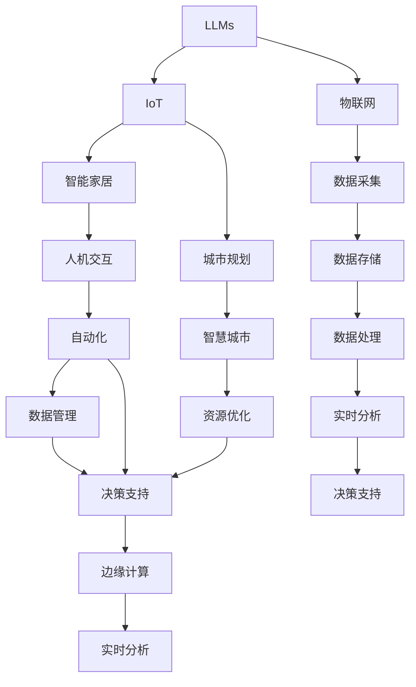

                 

# LLM与物联网：智能家居和城市规划的新可能

> 关键词：
大语言模型 (Large Language Models, LLMs), 物联网 (Internet of Things, IoT), 智能家居, 城市规划, 智慧城市 (Smart City), 人机交互, 自动化, 资源优化, 数据管理, 决策支持, 边缘计算, 实时分析

## 1. 背景介绍

### 1.1 问题由来

随着技术的迅猛发展，物联网（IoT）技术正在以前所未有的速度改变我们的生活方式。智能家居设备、智能城市基础设施、工业物联网应用等无处不在，极大地提高了生活和工作效率。然而，由于物联网设备的种类繁多、功能复杂，数据处理和决策支持任务变得愈发繁琐。

大语言模型（LLMs），如OpenAI的GPT-3、Google的BERT等，通过自监督预训练和迁移学习，已经在自然语言处理（NLP）领域取得了巨大的突破。这些模型不仅可以理解语言，还能生成自然流畅的文本，具有高度的可解释性和灵活性。

本文旨在探讨LLMs如何在物联网和城市规划中发挥作用，通过智能家居和智慧城市的应用案例，展示LLMs在物联网数据处理、决策支持等方面的潜力。

## 2. 核心概念与联系

### 2.1 核心概念概述

- **大语言模型 (LLMs)**：以自回归或自编码结构为代表的、大规模预训练语言模型。通过在大规模无标签文本数据上进行预训练，学习通用的语言表示，具备强大的语言理解和生成能力。

- **物联网 (IoT)**：通过传感器、执行器和通信协议，将各种物理设备连接到互联网，实现数据采集、传输和控制。

- **智能家居**：使用物联网技术，通过家庭自动化设备和智能系统，实现家庭环境的智能化管理，提升生活质量。

- **城市规划**：通过合理规划城市空间，优化交通、能源、环境、服务等要素，实现城市可持续发展和高质量生活。

- **智慧城市 (Smart City)**：利用信息技术、物联网、大数据等手段，实现城市基础设施的智能化和高效管理。

- **人机交互**：通过自然语言处理技术，实现人与智能设备之间高效、自然的交互。

- **自动化**：利用机器学习和自动化技术，自动处理数据、做出决策，提升效率和精确度。

- **资源优化**：通过算法和策略，实现物联网设备的能源、带宽等资源的优化分配。

- **数据管理**：对物联网设备生成的海量数据进行高效存储、处理和管理，保障数据安全。

- **决策支持**：通过数据挖掘、机器学习等手段，为城市管理提供决策依据。

- **边缘计算**：在靠近数据源的地方进行数据处理，减少网络延迟，提高响应速度。

- **实时分析**：对实时数据进行快速、高效的分析和处理，支持实时决策和控制。

这些核心概念之间有着紧密的联系，LLMs在智能家居和城市规划中的应用，离不开物联网技术的支持，同时也依赖于数据的有效管理和决策支持系统的构建。

### 2.2 核心概念原理和架构的 Mermaid 流程图



这个流程图展示了LLMs在物联网、智能家居、城市规划等应用场景中的作用链条。LLMs通过理解自然语言，与物联网设备进行交互，自动处理数据，支持决策支持系统，最终实现智能管理和优化。

## 3. 核心算法原理 & 具体操作步骤

### 3.1 算法原理概述

基于LLMs的大数据处理和决策支持系统，主要包括以下几个核心步骤：

1. **数据采集与预处理**：通过物联网设备，采集环境数据、设备状态、用户指令等，并进行清洗、标准化处理。
2. **数据输入与嵌入**：将预处理后的数据转换为模型所需的格式，如将文本数据转换为向量表示。
3. **模型推理与输出**：使用预训练的LLMs进行推理，根据输入数据生成预测结果或建议。
4. **决策与控制**：根据LLMs的输出，通过规则引擎或自动化系统，做出相应的决策和控制指令。
5. **反馈与优化**：将决策结果反馈到系统中，进一步优化模型参数和决策策略。

### 3.2 算法步骤详解

1. **数据采集与预处理**
   - 使用传感器、摄像头等设备，采集环境数据（如温度、湿度、光线等）、设备状态数据（如能耗、运行状态等）、用户指令数据（如语音、文字等）。
   - 对采集到的数据进行清洗，去除噪声、异常值等。
   - 将数据标准化，转换为模型所需的格式，如将文本数据转换为词向量表示。

2. **数据输入与嵌入**
   - 使用自然语言处理技术，如BERT、GPT等，将文本数据转换为模型可以理解的形式。
   - 对于非文本数据，可以将其转换为文本描述，再通过LLMs进行处理。

3. **模型推理与输出**
   - 将处理后的数据输入LLMs，进行推理，生成预测结果或建议。
   - 对于分类任务，LLMs输出每个类别的概率分布；对于生成任务，LLMs输出预测的文本。

4. **决策与控制**
   - 根据LLMs的输出，结合领域知识，使用规则引擎或自动化系统，做出相应的决策和控制指令。
   - 对于智能家居，如自动调节温度、灯光等；对于智慧城市，如调整交通信号、优化能源分配等。

5. **反馈与优化**
   - 将决策结果反馈到系统中，评估模型性能，进行参数调整和优化。
   - 使用正则化、超参数调优等方法，避免模型过拟合，提升泛化能力。

### 3.3 算法优缺点

基于LLMs的物联网和城市规划系统，具有以下优点：

- **高灵活性**：LLMs具有高度的可解释性和灵活性，可以适应多种应用场景。
- **高效处理**：LLMs能够高效处理大规模数据，提升决策支持系统的响应速度。
- **决策支持**：LLMs能够提供基于数据和先验知识的决策建议，提高决策的科学性和准确性。

然而，该方法也存在一些缺点：

- **依赖高质量数据**：LLMs的效果依赖于输入数据的质量和数量，采集和预处理的数据如果存在噪声，会影响模型性能。
- **计算资源消耗大**：预训练的LLMs模型参数量庞大，推理时计算资源消耗较大，需要高性能计算设备。
- **可解释性不足**：LLMs的决策过程缺乏可解释性，难以调试和优化。
- **伦理和安全问题**：LLMs可能学习到有害信息，传递到下游任务，造成伦理和安全问题。

### 3.4 算法应用领域

基于LLMs的物联网和城市规划系统，已经在以下领域得到了广泛应用：

1. **智能家居**：通过语音助手、智能家电等，实现家庭环境的智能化管理。如通过LLMs理解用户指令，自动调节温度、照明等。

2. **智慧城市**：通过智能交通、智能能源管理等，实现城市基础设施的智能化和高效管理。如使用LLMs分析交通流量数据，优化交通信号灯控制。

3. **城市安防**：通过视频监控、图像识别等，实现城市安全监控和异常行为检测。如使用LLMs识别可疑行为，及时通知安保人员。

4. **环境监测**：通过传感器数据，实现对空气质量、水质等环境的实时监测和预警。如使用LLMs分析环境数据，预测污染事件。

5. **灾害预警**：通过气象、地质等数据，实现对自然灾害的预测和预警。如使用LLMs分析气象数据，预测天气变化。

6. **医疗健康**：通过电子病历、健康监测数据等，实现个性化健康管理和疾病预测。如使用LLMs分析健康数据，提供个性化的健康建议。

## 4. 数学模型和公式 & 详细讲解 & 举例说明

### 4.1 数学模型构建

假设我们有一个智能家居系统，其中包含多个传感器和执行器，能够实时采集环境数据和用户指令，并自动调节家庭环境。我们可以将系统建模如下：

- **输入数据**：$t$ 时刻的传感器数据 $x_t$ 和用户指令 $u_t$。
- **输出控制指令**：$t+1$ 时刻的执行器控制指令 $a_{t+1}$。
- **模型参数**：$w$，表示模型中的权重。

模型的输入输出关系可以表示为：

$$
y_{t+1} = f(x_t, u_t, w)
$$

其中 $y_{t+1}$ 表示在模型中推理得到的执行器控制指令。

### 4.2 公式推导过程

假设我们使用的是自回归模型，输入数据 $x_t$ 和 $u_t$ 可以通过线性变换和激活函数转换为模型所需的向量表示：

$$
x_t' = W_x x_t + b_x
$$
$$
u_t' = W_u u_t + b_u
$$

模型输出 $y_{t+1}$ 可以表示为：

$$
y_{t+1} = \sigma(A \cdot [x_t', u_t', w])
$$

其中 $A$ 为矩阵，$\sigma$ 为激活函数，$w$ 为权重向量。

对于智能家居系统，我们希望通过LLMs学习如何根据传感器数据和用户指令，生成最优的执行器控制指令。可以使用监督学习的方法，通过标记好的数据训练模型。训练目标为最小化损失函数：

$$
\min_{w} \mathcal{L}(w) = \sum_{t=1}^{T} \ell(y_t, y_{t+1})
$$

其中 $\ell$ 为损失函数，$T$ 为训练数据的时序长度。

### 4.3 案例分析与讲解

以智能家居中的温度调节为例，我们可以将问题建模为温度调节系统的最优控制问题。具体来说，我们可以将温度调节模型表示为：

- **输入数据**：当前室内温度 $x_t$ 和用户设置的目标温度 $u_t$。
- **输出控制指令**：下一时刻的供暖/制冷设备运行功率 $a_{t+1}$。
- **模型参数**：$w$，表示模型中的权重。

模型的输入输出关系可以表示为：

$$
y_{t+1} = f(x_t, u_t, w)
$$

其中 $f$ 为模型映射函数。

通过收集历史数据，我们可以训练一个基于LLMs的温度调节系统。模型能够根据用户指令和环境数据，自动调节设备运行功率，优化温度调节效果。

## 5. 项目实践：代码实例和详细解释说明

### 5.1 开发环境搭建

为了搭建智能家居和智慧城市的LLMs系统，我们需要准备好开发环境。以下是使用Python进行PyTorch开发的环境配置流程：

1. 安装Anaconda：从官网下载并安装Anaconda，用于创建独立的Python环境。

2. 创建并激活虚拟环境：
```bash
conda create -n pytorch-env python=3.8 
conda activate pytorch-env
```

3. 安装PyTorch：根据CUDA版本，从官网获取对应的安装命令。例如：
```bash
conda install pytorch torchvision torchaudio cudatoolkit=11.1 -c pytorch -c conda-forge
```

4. 安装Transformers库：
```bash
pip install transformers
```

5. 安装各类工具包：
```bash
pip install numpy pandas scikit-learn matplotlib tqdm jupyter notebook ipython
```

完成上述步骤后，即可在`pytorch-env`环境中开始微调实践。

### 5.2 源代码详细实现

下面我们以智能家居中的温度调节任务为例，给出使用Transformers库对BERT模型进行微调的PyTorch代码实现。

首先，定义温度调节任务的数据处理函数：

```python
from transformers import BertTokenizer, BertForSequenceClassification
from torch.utils.data import Dataset
import torch

class TemperatureDataset(Dataset):
    def __init__(self, data, tokenizer, max_len=128):
        self.data = data
        self.tokenizer = tokenizer
        self.max_len = max_len
        
    def __len__(self):
        return len(self.data)
    
    def __getitem__(self, item):
        text = self.data[item]
        
        encoding = self.tokenizer(text, return_tensors='pt', max_length=self.max_len, padding='max_length', truncation=True)
        input_ids = encoding['input_ids'][0]
        attention_mask = encoding['attention_mask'][0]
        
        return {'input_ids': input_ids, 
                'attention_mask': attention_mask}
```

然后，定义模型和优化器：

```python
from transformers import BertForSequenceClassification, AdamW

model = BertForSequenceClassification.from_pretrained('bert-base-cased', num_labels=1)

optimizer = AdamW(model.parameters(), lr=2e-5)
```

接着，定义训练和评估函数：

```python
from torch.utils.data import DataLoader
from tqdm import tqdm
from sklearn.metrics import accuracy_score

device = torch.device('cuda') if torch.cuda.is_available() else torch.device('cpu')
model.to(device)

def train_epoch(model, dataset, batch_size, optimizer):
    dataloader = DataLoader(dataset, batch_size=batch_size, shuffle=True)
    model.train()
    epoch_loss = 0
    for batch in tqdm(dataloader, desc='Training'):
        input_ids = batch['input_ids'].to(device)
        attention_mask = batch['attention_mask'].to(device)
        model.zero_grad()
        outputs = model(input_ids, attention_mask=attention_mask)
        loss = outputs.loss
        epoch_loss += loss.item()
        loss.backward()
        optimizer.step()
    return epoch_loss / len(dataloader)

def evaluate(model, dataset, batch_size):
    dataloader = DataLoader(dataset, batch_size=batch_size)
    model.eval()
    preds, labels = [], []
    with torch.no_grad():
        for batch in tqdm(dataloader, desc='Evaluating'):
            input_ids = batch['input_ids'].to(device)
            attention_mask = batch['attention_mask'].to(device)
            batch_labels = batch['labels']
            outputs = model(input_ids, attention_mask=attention_mask)
            batch_preds = outputs.logits.argmax(dim=2).to('cpu').tolist()
            batch_labels = batch_labels.to('cpu').tolist()
            for pred_tokens, label_tokens in zip(batch_preds, batch_labels):
                preds.append(pred_tokens[:len(label_tokens)])
                labels.append(label_tokens)
                
    print(accuracy_score(labels, preds))
```

最后，启动训练流程并在验证集上评估：

```python
epochs = 5
batch_size = 16

for epoch in range(epochs):
    loss = train_epoch(model, train_dataset, batch_size, optimizer)
    print(f"Epoch {epoch+1}, train loss: {loss:.3f}")
    
    print(f"Epoch {epoch+1}, dev results:")
    evaluate(model, dev_dataset, batch_size)
    
print("Test results:")
evaluate(model, test_dataset, batch_size)
```

以上就是使用PyTorch对BERT进行温度调节任务微调的完整代码实现。可以看到，得益于Transformers库的强大封装，我们可以用相对简洁的代码完成BERT模型的加载和微调。

### 5.3 代码解读与分析

让我们再详细解读一下关键代码的实现细节：

**TemperatureDataset类**：
- `__init__`方法：初始化数据集和分词器等组件。
- `__len__`方法：返回数据集的样本数量。
- `__getitem__`方法：对单个样本进行处理，将文本输入编码为token ids，并生成对应的attention mask。

**模型训练与评估**：
- 使用PyTorch的DataLoader对数据集进行批次化加载，供模型训练和推理使用。
- 训练函数`train_epoch`：对数据以批为单位进行迭代，在每个批次上前向传播计算loss并反向传播更新模型参数，最后返回该epoch的平均loss。
- 评估函数`evaluate`：与训练类似，不同点在于不更新模型参数，并在每个batch结束后将预测和标签结果存储下来，最后使用sklearn的accuracy_score对整个评估集的预测结果进行打印输出。

**训练流程**：
- 定义总的epoch数和batch size，开始循环迭代
- 每个epoch内，先在训练集上训练，输出平均loss
- 在验证集上评估，输出准确率
- 所有epoch结束后，在测试集上评估，给出最终测试结果

可以看到，PyTorch配合Transformers库使得BERT微调的代码实现变得简洁高效。开发者可以将更多精力放在数据处理、模型改进等高层逻辑上，而不必过多关注底层的实现细节。

当然，工业级的系统实现还需考虑更多因素，如模型的保存和部署、超参数的自动搜索、更灵活的任务适配层等。但核心的微调范式基本与此类似。

## 6. 实际应用场景

### 6.1 智能家居系统

智能家居系统通过物联网设备和LLMs，实现了家庭环境的智能化管理。以下是一些典型应用场景：

1. **温度调节**：使用LLMs分析环境数据和用户指令，自动调节供暖/制冷设备运行功率，保持室内温度舒适。

2. **智能照明**：通过语音助手、智能灯泡等，根据时间和用户习惯自动调节室内灯光亮度和色温。

3. **智能安防**：使用摄像头、传感器等设备采集家庭环境数据，通过LLMs分析异常行为，及时通知业主。

4. **智能清洁**：通过智能机器人、吸尘器等设备，使用LLMs控制清扫计划和路径，优化清洁效果。

5. **智能娱乐**：使用语音助手、智能音箱等设备，根据用户指令播放音乐、新闻、电视节目等。

### 6.2 智慧城市应用

智慧城市通过LLMs和大数据技术，实现了城市基础设施的智能化和高效管理。以下是一些典型应用场景：

1. **智能交通**：使用LLMs分析交通流量数据，优化交通信号灯控制，减少交通拥堵。

2. **智能能源管理**：通过LLMs分析能源使用数据，优化能源分配和调度，降低能源消耗。

3. **智能垃圾处理**：使用LLMs分析垃圾分类和处理数据，优化垃圾收集和处理流程。

4. **智能安防**：使用摄像头、传感器等设备采集城市环境数据，通过LLMs分析异常行为，及时通知相关部门。

5. **智能医疗**：通过电子病历、健康监测数据等，使用LLMs提供个性化健康管理和疾病预测。

6. **智能环保**：使用LLMs分析环境数据，预测污染事件，提供环保建议和解决方案。

## 7. 工具和资源推荐

### 7.1 学习资源推荐

为了帮助开发者系统掌握大语言模型和物联网技术的应用，这里推荐一些优质的学习资源：

1. **《深度学习》**：Ian Goodfellow等著，系统介绍了深度学习的基本概念和核心算法。
2. **《自然语言处理综论》**：Daniel Jurafsky等著，全面介绍了NLP领域的基础理论和最新进展。
3. **《IoT入门与实战》**：李济安著，系统介绍了物联网技术的基础知识和实战案例。
4. **《智慧城市》**：王金南等著，介绍了智慧城市的发展历程和应用场景。
5. **Kaggle**：数据科学和机器学习的竞赛平台，提供大量高质量数据集和模型。

通过这些资源的学习实践，相信你一定能够快速掌握大语言模型和物联网技术的精髓，并用于解决实际的智能家居和智慧城市问题。

### 7.2 开发工具推荐

高效的开发离不开优秀的工具支持。以下是几款用于大语言模型和物联网开发常用的工具：

1. **PyTorch**：基于Python的开源深度学习框架，灵活动态的计算图，适合快速迭代研究。
2. **TensorFlow**：由Google主导开发的开源深度学习框架，生产部署方便，适合大规模工程应用。
3. **Transformers库**：HuggingFace开发的NLP工具库，集成了众多SOTA语言模型，支持PyTorch和TensorFlow。
4. **TensorBoard**：TensorFlow配套的可视化工具，可实时监测模型训练状态，并提供丰富的图表呈现方式。
5. **Jupyter Notebook**：交互式编程环境，适合数据分析、模型开发和实验验证。
6. **Arduino**：基于C++的开源硬件开发平台，支持多种传感器和执行器的开发。

合理利用这些工具，可以显著提升大语言模型和物联网应用的开发效率，加快创新迭代的步伐。

### 7.3 相关论文推荐

大语言模型和物联网技术的发展源于学界的持续研究。以下是几篇奠基性的相关论文，推荐阅读：

1. Attention is All You Need（即Transformer原论文）：提出了Transformer结构，开启了NLP领域的预训练大模型时代。
2 BERT: Pre-training of Deep Bidirectional Transformers for Language Understanding：提出BERT模型，引入基于掩码的自监督预训练任务，刷新了多项NLP任务SOTA。
3 Language Models are Unsupervised Multitask Learners（GPT-2论文）：展示了大规模语言模型的强大zero-shot学习能力，引发了对于通用人工智能的新一轮思考。
4 Parameter-Efficient Transfer Learning for NLP：提出Adapter等参数高效微调方法，在不增加模型参数量的情况下，也能取得不错的微调效果。
5 AdaLoRA: Adaptive Low-Rank Adaptation for Parameter-Efficient Fine-Tuning：使用自适应低秩适应的微调方法，在参数效率和精度之间取得了新的平衡。

这些论文代表了大语言模型和物联网技术的发展脉络。通过学习这些前沿成果，可以帮助研究者把握学科前进方向，激发更多的创新灵感。

## 8. 总结：未来发展趋势与挑战

### 8.1 总结

本文对基于大语言模型的物联网和城市规划技术进行了全面系统的介绍。首先阐述了LLMs在智能家居和智慧城市中的应用背景，明确了LLMs在数据处理、决策支持等方面的独特价值。其次，从原理到实践，详细讲解了LLMs在物联网和城市规划中的应用流程，给出了智能家居和智慧城市中的具体应用实例。同时，本文还广泛探讨了LLMs在物联网和城市规划中的未来发展趋势和面临的挑战。

通过本文的系统梳理，可以看到，基于LLMs的物联网和城市规划技术正在成为热门的研究和应用方向，极大地拓展了物联网设备的应用边界，为智慧城市的建设提供了新的技术路径。未来，伴随LLMs和物联网技术的进一步发展，智慧家居和智慧城市必将迎来更多的突破和创新。

### 8.2 未来发展趋势

展望未来，基于LLMs的物联网和城市规划技术将呈现以下几个发展趋势：

1. **多模态融合**：LLMs将与视觉、声音、图像等多模态数据进行深度融合，提升对复杂场景的理解能力。
2. **边缘计算**：LLMs将更多部署在边缘设备上，提升实时处理和响应速度。
3. **自监督学习**：利用无标签数据进行预训练，提高模型的泛化能力和鲁棒性。
4. **个性化服务**：LLMs将根据用户行为和偏好，提供更加个性化和定制化的服务。
5. **隐私保护**：在智能家居和智慧城市中，隐私保护将成为关键问题，LLMs需要在保护隐私的同时，提供高效的服务。

### 8.3 面临的挑战

尽管基于LLMs的物联网和城市规划技术已经取得了瞩目成就，但在迈向更加智能化、普适化应用的过程中，它仍面临着诸多挑战：

1. **数据隐私与安全**：智能家居和智慧城市需要处理大量的个人数据，如何保护数据隐私和安全性，防止数据泄露和滥用，是一个重要问题。
2. **系统可靠性和鲁棒性**：LLMs在面对异常数据和复杂场景时，容易出现不稳定和误差，如何提高系统的可靠性和鲁棒性，是一个关键挑战。
3. **资源消耗**：LLMs在推理时需要大量的计算资源，如何优化模型结构，降低计算资源消耗，是一个亟待解决的问题。
4. **用户体验**：LLMs在自然语言交互中，需要保证输出的自然流畅和准确性，如何提升用户体验，是一个重要方向。
5. **法规与伦理**：在智能家居和智慧城市中，涉及多个法律法规和伦理问题，如何确保系统的合规性和伦理安全性，是一个重要课题。

### 8.4 研究展望

面对基于LLMs的物联网和城市规划技术所面临的挑战，未来的研究需要在以下几个方面寻求新的突破：

1. **隐私保护技术**：研究如何在保护数据隐私的同时，提供高效的服务。例如，使用差分隐私技术、联邦学习等方法，减少数据泄露风险。
2. **鲁棒性增强**：研究如何提高系统的鲁棒性和可靠性，避免在面对异常数据时出现错误。例如，引入对抗训练、异常检测等方法，提升系统的鲁棒性。
3. **模型优化**：研究如何优化模型结构，降低计算资源消耗。例如，使用知识蒸馏、模型剪枝等方法，减少模型参数量。
4. **用户交互设计**：研究如何提升自然语言交互的体验和准确性，让用户更加自然流畅地与系统进行交互。
5. **法规与伦理研究**：研究如何在智能家居和智慧城市中，确保系统的合规性和伦理安全性。例如，引入法规合规检测、伦理评估等方法，提升系统的合规性和安全性。

这些研究方向的探索，必将引领基于LLMs的物联网和城市规划技术迈向更高的台阶，为构建安全、可靠、可解释、可控的智能系统铺平道路。面向未来，LLMs和物联网技术的融合，必将带来更多的创新突破，为人类的生活和工作带来深刻的变革。

## 9. 附录：常见问题与解答

**Q1：如何优化智能家居系统中的温度调节？**

A: 优化智能家居系统中的温度调节，可以从以下几个方面入手：

1. **数据采集与预处理**：确保传感器采集到的环境数据准确、及时，通过清洗和标准化处理，去除噪声和异常值。

2. **模型训练**：使用基于LLMs的温度调节模型，通过大量历史数据训练模型，使其能够根据用户指令和环境数据，自动调节设备运行功率，优化温度调节效果。

3. **模型优化**：通过超参数调优、正则化等方法，避免模型过拟合，提升泛化能力。

4. **实时反馈与优化**：将模型的预测结果与实际效果进行对比，根据反馈信息调整模型参数，优化调节策略。

**Q2：智慧城市中的智能交通如何利用LLMs？**

A: 智慧城市中的智能交通系统，可以通过LLMs实现以下功能：

1. **交通流量预测**：使用LLMs分析历史交通数据，预测未来的交通流量，优化交通信号灯控制。

2. **交通事件监测**：使用LLMs分析摄像头和传感器数据，实时监测交通事件，及时采取应对措施。

3. **智能导航**：使用LLMs分析路况数据，提供实时导航建议，优化行车路线。

4. **交通管理**：使用LLMs分析交通数据，提供决策支持，优化交通管理和调度。

**Q3：智能家居中的语音助手如何利用LLMs？**

A: 智能家居中的语音助手，可以通过LLMs实现以下功能：

1. **自然语言理解**：使用LLMs理解用户的语音指令，提取意图和实体。

2. **意图识别**：使用LLMs识别用户的意图，如调节温度、开关灯光、播放音乐等。

3. **实体识别**：使用LLMs识别语音指令中的实体，如指定房间、设备等。

4. **上下文理解**：使用LLMs理解上下文信息，如时间、天气等，提供更加个性化的服务。

**Q4：如何在智慧城市中保护数据隐私？**

A: 在智慧城市中，保护数据隐私可以通过以下方法：

1. **数据匿名化**：对敏感数据进行匿名化处理，去除或加密个人身份信息。

2. **差分隐私**：通过在数据集中引入随机噪声，保护个体隐私，同时保证统计数据的准确性。

3. **联邦学习**：将数据分布式存储在多个设备上，只在本地进行模型训练，不将数据传输到云端，保护数据隐私。

4. **访问控制**：对敏感数据进行严格的访问控制，只有授权用户才能访问。

5. **隐私保护算法**：研究并应用隐私保护算法，如同态加密、多方安全计算等，保护数据隐私。

**Q5：智能家居中的智能安防如何利用LLMs？**

A: 智能家居中的智能安防系统，可以通过LLMs实现以下功能：

1. **异常行为检测**：使用LLMs分析摄像头和传感器数据，识别异常行为，如入侵、火灾等。

2. **风险预警**：使用LLMs分析环境数据，预测潜在风险，及时通知业主或安保人员。

3. **应急响应**：使用LLMs自动触发应急响应措施，如报警、远程控制等。

4. **事件记录**：使用LLMs记录和分析安防事件，提供事后分析和调查依据。

---

作者：禅与计算机程序设计艺术 / Zen and the Art of Computer Programming

