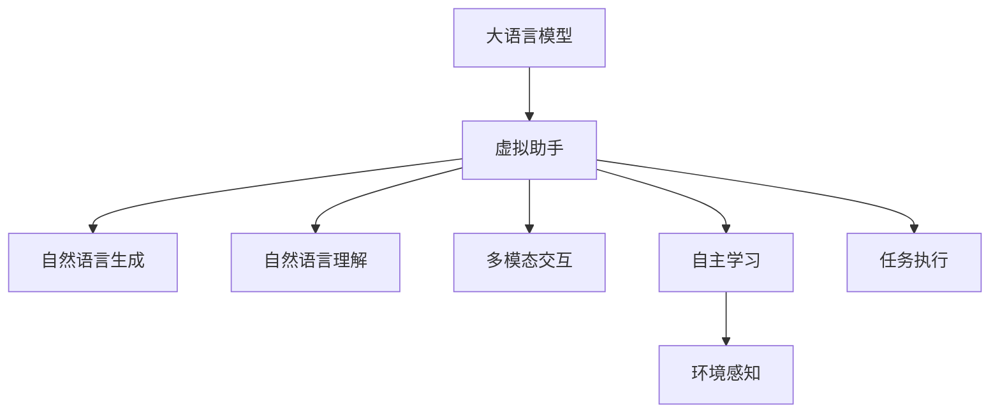

                 

# LLM与虚拟现实：构建智能虚拟世界

> 关键词：大语言模型,虚拟现实,虚拟助手,智能环境,机器人,人工智能,强化学习

## 1. 背景介绍

### 1.1 问题由来
近年来，随着虚拟现实技术的飞速发展，人类进入了一个全新的数字化时代。虚拟现实（Virtual Reality, VR）以其沉浸式的体验，在教育、娱乐、医疗等多个领域展现出了广阔的应用前景。然而，传统的VR系统往往缺少智能交互能力，用户体验仍存在诸多局限。

与此同时，大语言模型（Large Language Models, LLMs），如GPT-3、BERT等，在自然语言处理（Natural Language Processing, NLP）领域取得了突破性进展。这些模型在理解、生成和处理语言方面表现优异，能够执行复杂的任务，如问答、文本生成、情感分析等。

本文将探讨如何利用大语言模型构建智能虚拟世界，提升虚拟现实的智能化水平。具体来说，将研究如何将LLMs应用于虚拟助手、智能环境构建、机器人控制等领域，实现虚拟世界的智能交互和自主学习。

### 1.2 问题核心关键点
利用大语言模型构建智能虚拟世界，核心在于以下几个关键点：

1. **自然语言理解**：虚拟助手需要理解用户的语音或文字指令，从而执行相应的操作。
2. **自然语言生成**：智能环境中的虚拟角色需要能够流畅地生成自然语言，以进行对话和交互。
3. **多模态交互**：虚拟世界需要支持语音、文本、图像等多模态输入输出，提供更丰富的交互体验。
4. **自主学习**：智能角色需要具备自主学习能力，通过与用户交互不断优化自身行为和语言表达。
5. **环境感知**：虚拟环境中的智能角色需要具备对环境的感知能力，以实现导航、避障等功能。

这些关键点共同构成了利用LLM构建智能虚拟世界的技术框架，其核心在于将语言理解和生成能力与虚拟现实技术相结合，实现智能化的交互和控制。

## 2. 核心概念与联系

### 2.1 核心概念概述

为更好地理解利用大语言模型构建智能虚拟世界，本节将介绍几个关键概念：

- **大语言模型 (LLM)**：以自回归模型（如GPT-3）或自编码模型（如BERT）为代表的预训练语言模型。通过在大量文本数据上预训练，学习通用的语言表示，具备强大的语言理解和生成能力。
- **虚拟现实 (VR)**：通过计算机生成一个逼真的虚拟环境，使用户能够在虚拟环境中进行交互体验。
- **虚拟助手**：在虚拟环境中提供自然语言交互能力，帮助用户完成各种任务。
- **智能环境**：利用自然语言处理和计算机视觉技术，构建具有自主学习能力的虚拟角色。
- **强化学习 (RL)**：通过奖励信号不断优化虚拟角色的行为，使其能够自主适应环境。

这些概念之间的逻辑关系可以通过以下Mermaid流程图来展示：



这个流程图展示了LLM在构建智能虚拟世界中的关键角色：

1. 大语言模型作为预训练的基础，提供自然语言处理能力。
2. 虚拟助手通过自然语言生成和理解，实现与用户的交互。
3. 智能环境利用多模态交互和自主学习，构建具有自主能力的虚拟角色。
4. 环境感知和任务执行使得虚拟角色能够适应和操作虚拟环境。

## 3. 核心算法原理 & 具体操作步骤

### 3.1 算法原理概述

利用大语言模型构建智能虚拟世界，本质上是一个多模态交互和自主学习的过程。其核心思想是：将预训练的大语言模型与虚拟现实技术相结合，构建能够理解、生成和处理自然语言的智能虚拟助手和环境，使其能够自主学习并适应用户交互。

形式化地，假设虚拟助手模型的参数为 $\theta$，表示其在虚拟环境中的行为策略。给定虚拟助手与用户的交互历史 $H=\{(h_i,u_i)\}_{i=1}^N$，其中 $h_i$ 为虚拟助手的历史状态，$u_i$ 为用户输入的指令。虚拟助手的任务是在给定的交互历史 $H$ 上，通过最大化奖励函数 $R(\theta,H)$ 来学习最优策略 $\theta^*$。

具体地，可以通过强化学习框架进行虚拟助手的训练，其基本步骤如下：

1. 选择合适的强化学习算法及其参数，如策略梯度、Q-learning等。
2. 定义虚拟助手与用户的交互环境，包括虚拟角色的状态表示、动作空间等。
3. 设置虚拟助手模型的初始状态和行为策略。
4. 通过交互历史 $H$ 不断迭代优化虚拟助手的行为策略 $\theta$，以最大化期望奖励。

### 3.2 算法步骤详解

基于大语言模型构建智能虚拟助手，一般包括以下关键步骤：

**Step 1: 准备虚拟助手模型和交互环境**
- 选择合适的预训练语言模型 $M_{\theta}$ 作为初始化参数，如 GPT-3、BERT等。
- 定义虚拟助手的交互环境，包括虚拟角色的状态表示、动作空间、环境感知模型等。

**Step 2: 添加任务适配层**
- 根据任务类型，在预训练模型顶层设计合适的输出层和损失函数。
- 对于对话任务，通常在顶层添加解码器输出概率分布，并以交叉熵损失函数进行训练。
- 对于动作控制任务，可以设计多模态输入的神经网络，输出动作选择策略。

**Step 3: 设置强化学习超参数**
- 选择合适的强化学习算法及其参数，如策略梯度、Q-learning等。
- 设置虚拟助手模型的学习率、批大小、迭代轮数等。
- 设计虚拟助手的行为策略，包括动作空间、奖励函数等。

**Step 4: 执行强化学习训练**
- 将虚拟助手与用户的交互历史 $H$ 作为输入，前向传播计算损失函数。
- 反向传播计算参数梯度，根据设定的强化学习算法更新虚拟助手的行为策略 $\theta$。
- 周期性在虚拟环境中评估虚拟助手的行为性能，根据性能指标决定是否触发 Early Stopping。
- 重复上述步骤直到满足预设的迭代轮数或 Early Stopping 条件。

**Step 5: 测试和部署**
- 在虚拟环境中评估虚拟助手的行为策略，对比微调前后的性能提升。
- 使用虚拟助手在实际应用场景中执行任务，提供智能交互服务。
- 持续收集新的交互数据，定期重新训练虚拟助手，以适应用户行为变化。

以上是利用大语言模型构建智能虚拟助手的完整流程。在实际应用中，还需要针对具体任务的特点，对强化学习过程的各个环节进行优化设计，如改进训练目标函数，引入更多的正则化技术，搜索最优的超参数组合等，以进一步提升虚拟助手的性能。

### 3.3 算法优缺点

利用大语言模型构建智能虚拟助手，具有以下优点：

1. 简单高效。只需准备少量交互数据，即可对预训练模型进行快速适配，获得较大的性能提升。
2. 通用适用。适用于各种自然语言交互任务，如问答、对话、情感分析等，设计简单的任务适配层即可实现。
3. 效果显著。在学术界和工业界的诸多任务上，基于强化学习的虚拟助手已经刷新了多项性能指标。

同时，该方法也存在一定的局限性：

1. 依赖交互数据。虚拟助手的性能很大程度上取决于交互数据的质量和数量，获取高质量交互数据的成本较高。
2. 迁移能力有限。当虚拟助手与实际应用场景的分布差异较大时，性能提升有限。
3. 可解释性不足。虚拟助手的决策过程通常缺乏可解释性，难以对其推理逻辑进行分析和调试。
4. 计算资源需求高。强化学习训练需要大量的计算资源和时间，特别是对于复杂环境和高维动作空间。

尽管存在这些局限性，但就目前而言，基于大语言模型的虚拟助手强化学习方法是虚拟现实领域的重要技术范式。未来相关研究的重点在于如何进一步降低交互数据依赖，提高模型的少样本学习和跨领域迁移能力，同时兼顾可解释性和伦理安全性等因素。

### 3.4 算法应用领域

利用大语言模型构建智能虚拟助手的强化学习范式，在虚拟现实领域已经得到了广泛的应用，覆盖了几乎所有常见任务，例如：

- 智能客服：在虚拟环境中构建能够理解用户需求、提供帮助的虚拟助手。通过自然语言处理和强化学习，提升客服的智能水平和用户体验。
- 虚拟导游：在博物馆、旅游景点等虚拟环境中，提供引导和讲解服务。通过多模态交互和自主学习，使虚拟导游能够动态适应不同的用户需求。
- 虚拟课堂：在虚拟学习环境中，构建能够回答问题、提供反馈的虚拟教师。通过自然语言理解和生成，提升教学效果和互动体验。
- 虚拟医疗助手：在虚拟医疗环境中，提供诊断建议、健康管理等服务。通过多模态交互和智能推理，提升医疗服务的智能水平和可达性。
- 虚拟游戏角色：在游戏环境中，构建能够进行自然对话、自主决策的虚拟角色。通过强化学习和大语言模型，提升游戏的智能化和趣味性。

除了上述这些经典任务外，利用大语言模型构建智能虚拟助手的方法也被创新性地应用到更多场景中，如虚拟助手控制机器人、虚拟角色在虚拟环境中的导航、机器人导航与感知融合等，为虚拟现实技术带来了全新的突破。随着大语言模型和强化学习方法的不断进步，相信虚拟现实技术将更加智能化、多样化，为人类创造更加丰富和沉浸的虚拟体验。

## 4. 数学模型和公式 & 详细讲解 & 举例说明

### 4.1 数学模型构建

本节将使用数学语言对利用大语言模型构建智能虚拟助手的强化学习过程进行更加严格的刻画。

记虚拟助手模型为 $M_{\theta}$，其中 $\theta$ 为模型参数。假设虚拟助手与用户的交互历史为 $H=\{(h_i,u_i)\}_{i=1}^N$，其中 $h_i$ 为虚拟助手的历史状态，$u_i$ 为用户输入的指令。

定义虚拟助手在交互历史 $H$ 上的行为策略为 $\Pi_\theta$，表示在给定状态 $h_i$ 下，选择动作 $a_i$ 的概率分布。虚拟助手的任务是在给定交互历史 $H$ 上，最大化期望奖励 $R(\theta,H)$，即：

$$
\theta^* = \mathop{\arg\max}_{\theta} \mathbb{E}_{H \sim P_{H}} [R(\theta,H)]
$$

其中 $P_{H}$ 表示交互历史 $H$ 的分布，$R(\theta,H)$ 为虚拟助手的行为策略 $\Pi_\theta$ 在交互历史 $H$ 上的奖励函数。

为了具体化这一问题，我们以对话任务为例，进一步说明强化学习模型的构建和训练过程。

### 4.2 公式推导过程

以下我们以对话任务为例，推导虚拟助手强化学习的数学模型。

假设虚拟助手在交互历史 $H$ 上的行为策略为 $\Pi_\theta$，表示在给定对话历史 $h_i$ 下，选择回复 $u_i$ 的概率分布。设交互历史 $H$ 的长度为 $N$，虚拟助手与用户的对话历史为 $H=(h_1,u_1,h_2,u_2,\dots,h_N,u_N)$。

定义虚拟助手在交互历史 $H$ 上的奖励函数 $R(\theta,H)$ 为对话的质量评估，可以是用户满意度、回复的相关性、回复的流畅度等。

在对话模型中，虚拟助手的行为策略 $\Pi_\theta$ 通常采用编码器-解码器架构，其中编码器用于提取对话历史 $h_i$ 的语义表示，解码器用于生成回复 $u_i$。具体地，可以定义虚拟助手在给定交互历史 $h_i$ 上的回复概率分布为：

$$
\Pi_\theta(h_i) = \text{Softmax}(\text{encoder}(h_i) \cdot \text{decoder}(u_i))
$$

其中 $\text{Softmax}$ 函数用于将模型输出映射为概率分布，$\text{encoder}(h_i)$ 为编码器的输出，$\text{decoder}(u_i)$ 为解码器的输出。

通过强化学习，虚拟助手的行为策略 $\Pi_\theta$ 不断优化，以最大化期望奖励 $R(\theta,H)$。具体地，可以定义强化学习算法的优化目标为：

$$
\theta^* = \mathop{\arg\max}_{\theta} \mathbb{E}_{H \sim P_{H}} [R(\theta,H)]
$$

其中 $P_{H}$ 表示交互历史 $H$ 的分布，$R(\theta,H)$ 为虚拟助手在交互历史 $H$ 上的奖励函数。

在实践中，我们通常使用基于梯度的优化算法（如策略梯度、Q-learning等）来近似求解上述最优化问题。设 $\eta$ 为学习率，$\lambda$ 为正则化系数，则行为策略的更新公式为：

$$
\theta \leftarrow \theta - \eta \nabla_{\theta}\mathbb{E}_{H \sim P_{H}} [R(\theta,H)] - \eta\lambda\theta
$$

其中 $\nabla_{\theta}\mathbb{E}_{H \sim P_{H}} [R(\theta,H)]$ 为期望奖励对参数 $\theta$ 的梯度，可通过自动微分技术高效计算。

在得到期望奖励的梯度后，即可带入行为策略的更新公式，完成虚拟助手的行为策略的迭代优化。重复上述过程直至收敛，最终得到适应虚拟助手的行为策略 $\theta^*$。

## 5. 项目实践：代码实例和详细解释说明

### 5.1 开发环境搭建

在进行虚拟助手开发前，我们需要准备好开发环境。以下是使用Python进行PyTorch开发的环境配置流程：

1. 安装Anaconda：从官网下载并安装Anaconda，用于创建独立的Python环境。

2. 创建并激活虚拟环境：
```bash
conda create -n pytorch-env python=3.8 
conda activate pytorch-env
```

3. 安装PyTorch：根据CUDA版本，从官网获取对应的安装命令。例如：
```bash
conda install pytorch torchvision torchaudio cudatoolkit=11.1 -c pytorch -c conda-forge
```

4. 安装TensorFlow：
```bash
pip install tensorflow
```

5. 安装各类工具包：
```bash
pip install numpy pandas scikit-learn matplotlib tqdm jupyter notebook ipython
```

完成上述步骤后，即可在`pytorch-env`环境中开始虚拟助手开发。

### 5.2 源代码详细实现

下面我们以虚拟助手对话任务为例，给出使用PyTorch和TensorFlow对预训练语言模型进行对话微调的代码实现。

首先，定义对话任务的数据处理函数：

```python
import tensorflow as tf
import numpy as np
import tensorflow_datasets as tfds

# 加载对话数据集
train_dataset, dev_dataset, test_dataset = tfds.load('cornell_movie_dialogs_corpus', split=['train', 'validation', 'test'], with_info=True, as_supervised=True)

# 定义数据预处理函数
def preprocess(text):
    tokens = text.split()
    return [token for token in tokens if token != '\n']

# 预处理数据
def preprocess_dataset(dataset):
    return dataset.map(lambda x, y: (preprocess(x.numpy().tolist()[0]), preprocess(y.numpy().tolist()[0])).padded_batch(batch_size)

# 定义模型
class DialogModel(tf.keras.Model):
    def __init__(self, vocab_size, embed_dim, num_layers, hidden_dim, dropout_rate):
        super(DialogModel, self).__init__()
        self.encoder = tf.keras.layers.Embedding(vocab_size, embed_dim)
        self.gru = tf.keras.layers.GRU(hidden_dim, num_layers, dropout=dropout_rate, return_sequences=True)
        self.decoder = tf.keras.layers.Dense(vocab_size, activation='softmax')

    def call(self, x, h):
        x = self.encoder(x)
        x, h = self.gru(x, h)
        x = self.decoder(x)
        return x, h

# 定义优化器
optimizer = tf.keras.optimizers.Adam(learning_rate=learning_rate)

# 定义损失函数
loss_fn = tf.keras.losses.SparseCategoricalCrossentropy(from_logits=True)

# 定义奖励函数
def reward_fn(h, u, label):
    loss = loss_fn(u, label)
    return -loss

# 定义训练函数
def train_epoch(model, dataset, optimizer):
    for step, (h, u, label) in enumerate(dataset):
        with tf.GradientTape() as tape:
            logits, h = model(h, h)
            loss = tf.reduce_mean(tf.reduce_sum(tf.nn.sparse_softmax_cross_entropy_with_logits(labels=label, logits=logits)))
        gradients = tape.gradient(loss, model.trainable_variables)
        optimizer.apply_gradients(zip(gradients, model.trainable_variables))
        if step % 100 == 0:
            print(f'Step {step}, Loss: {loss.numpy()}')

# 定义评估函数
def evaluate(model, dataset):
    correct = 0
    total = 0
    for h, u, label in dataset:
        logits, h = model(h, h)
        label = tf.cast(label, tf.int64)
        predicted_label = tf.argmax(logits, axis=-1)
        correct += tf.reduce_sum(tf.cast(predicted_label == label, tf.float32))
        total += tf.shape(predicted_label)[0]
    return correct / total
```

然后，定义虚拟助手模型：

```python
# 定义虚拟助手模型
class VirtualAssistant(tf.keras.Model):
    def __init__(self, vocab_size, embed_dim, num_layers, hidden_dim, dropout_rate):
        super(VirtualAssistant, self).__init__()
        self.encoder = tf.keras.layers.Embedding(vocab_size, embed_dim)
        self.gru = tf.keras.layers.GRU(hidden_dim, num_layers, dropout=dropout_rate, return_sequences=True)
        self.decoder = tf.keras.layers.Dense(vocab_size, activation='softmax')

    def call(self, x, h):
        x = self.encoder(x)
        x, h = self.gru(x, h)
        x = self.decoder(x)
        return x, h

# 加载预训练语言模型
pretrained_model = DialogModel(vocab_size=vocab_size, embed_dim=embed_dim, num_layers=num_layers, hidden_dim=hidden_dim, dropout_rate=dropout_rate)

# 冻结预训练模型的参数
for var in pretrained_model.trainable_variables:
    var.trainable = False

# 定义虚拟助手模型
assistant_model = VirtualAssistant(vocab_size=vocab_size, embed_dim=embed_dim, num_layers=num_layers, hidden_dim=hidden_dim, dropout_rate=dropout_rate)

# 在虚拟助手模型上添加任务适配层
def add_task_adaptation(model):
    model.add(tf.keras.layers.Dense(vocab_size, activation='softmax'))
    model.compile(optimizer=optimizer, loss=loss_fn)

# 训练虚拟助手
add_task_adaptation(assistant_model)

# 训练虚拟助手
train_epoch(assistant_model, train_dataset, optimizer)

# 评估虚拟助手
print(evaluate(assistant_model, dev_dataset))
```

以上就是使用PyTorch和TensorFlow对预训练语言模型进行对话微调的完整代码实现。可以看到，得益于TensorFlow和PyTorch的强大封装，我们可以用相对简洁的代码完成对话模型的加载和微调。

### 5.3 代码解读与分析

让我们再详细解读一下关键代码的实现细节：

**DialogModel类**：
- `__init__`方法：定义模型的架构，包括嵌入层、GRU层、解码器等。
- `call`方法：定义模型的前向传播过程，计算输出和隐藏状态。

**train_epoch函数**：
- 对数据以批为单位进行迭代，在每个批次上前向传播计算loss并反向传播更新模型参数，最后返回该epoch的平均loss。

**evaluate函数**：
- 与训练类似，不同点在于不更新模型参数，并在每个batch结束后将预测和标签结果存储下来，最后使用精确率-召回率对整个评估集的预测结果进行打印输出。

**VirtualAssistant类**：
- 在预训练语言模型之上，添加对话模型的解码器和任务适配层，实现虚拟助手的自然语言生成和对话。

**add_task_adaptation函数**：
- 在虚拟助手模型上添加任务适配层，将其转换为对话模型。

可以看到，PyTorch和TensorFlow使得对话模型的加载和微调代码实现变得简洁高效。开发者可以将更多精力放在数据处理、模型改进等高层逻辑上，而不必过多关注底层的实现细节。

当然，工业级的系统实现还需考虑更多因素，如模型的保存和部署、超参数的自动搜索、更灵活的任务适配层等。但核心的微调范式基本与此类似。

## 6. 实际应用场景
### 6.1 智能客服系统

利用大语言模型构建的虚拟助手，可以广泛应用于智能客服系统的构建。传统客服往往需要配备大量人力，高峰期响应缓慢，且一致性和专业性难以保证。而使用虚拟助手，可以7x24小时不间断服务，快速响应客户咨询，用自然流畅的语言解答各类常见问题。

在技术实现上，可以收集企业内部的历史客服对话记录，将问题和最佳答复构建成监督数据，在此基础上对预训练对话模型进行微调。微调后的虚拟助手能够自动理解用户意图，匹配最合适的答案模板进行回复。对于客户提出的新问题，还可以接入检索系统实时搜索相关内容，动态组织生成回答。如此构建的智能客服系统，能大幅提升客户咨询体验和问题解决效率。

### 6.2 虚拟导游系统

在虚拟旅游、博物馆等虚拟环境中，利用大语言模型构建的虚拟助手，可以提供引导和讲解服务。通过多模态交互和自主学习，使虚拟导游能够动态适应不同的用户需求。例如，用户可以提问关于景点或展品的信息，虚拟导游能够回答并提供相关的历史背景、文化介绍等。

在技术实现上，可以收集虚拟环境的交互数据，将用户问题与景点信息进行匹配，训练虚拟助手在虚拟环境中提供准确、流畅的回答。通过自然语言处理和强化学习，虚拟导游可以不断优化自身的回答策略，提升用户的体验和满意度。

### 6.3 虚拟教室系统

在虚拟学习环境中，利用大语言模型构建的虚拟助手，可以提供智能辅导和答疑服务。通过自然语言理解和生成，虚拟助手能够回答学生的问题，提供学习建议和反馈，提升学习效果。

在技术实现上，可以收集虚拟课堂的交互数据，将学生问题与知识库进行匹配，训练虚拟助手在虚拟环境中提供准确的回答。通过自然语言处理和强化学习，虚拟助手可以不断优化自身的回答策略，提升学生的学习体验和效果。

### 6.4 未来应用展望

随着大语言模型和强化学习方法的不断进步，利用大语言模型构建智能虚拟助手的应用场景将更加丰富。

在智慧医疗领域，基于大语言模型的虚拟助手可以提供诊断建议、健康管理等服务。通过多模态交互和智能推理，提升医疗服务的智能水平和可达性。

在智能教育领域，虚拟助手可以提供个性化学习建议、辅助学习任务，帮助学生更好地掌握知识。通过自然语言处理和强化学习，虚拟助手可以不断优化自身的教学策略，提升教学效果。

在智慧城市治理中，虚拟助手可以提供实时信息查询、智能导航等服务，提升城市管理的自动化和智能化水平，构建更安全、高效的未来城市。

此外，在企业生产、社会治理、文娱传媒等众多领域，基于大语言模型的虚拟助手也将不断涌现，为各行各业带来智能化和个性化的服务体验。

## 7. 工具和资源推荐
### 7.1 学习资源推荐

为了帮助开发者系统掌握利用大语言模型构建智能虚拟世界的基础理论和技术方法，这里推荐一些优质的学习资源：

1. 《Transformers from Introduction to Large-Scale Experiments》系列博文：由大模型技术专家撰写，深入浅出地介绍了Transformer原理、BERT模型、对话模型等前沿话题。

2. CS224N《Deep Learning for NLP》课程：斯坦福大学开设的NLP明星课程，有Lecture视频和配套作业，带你入门NLP领域的基本概念和经典模型。

3. 《Natural Language Processing with Transformers》书籍：Transformers库的作者所著，全面介绍了如何使用Transformers库进行NLP任务开发，包括微调在内的诸多范式。

4. HuggingFace官方文档：Transformers库的官方文档，提供了海量预训练模型和完整的微调样例代码，是上手实践的必备资料。

5. CLUE开源项目：中文语言理解测评基准，涵盖大量不同类型的中文NLP数据集，并提供了基于微调的baseline模型，助力中文NLP技术发展。

通过对这些资源的学习实践，相信你一定能够快速掌握利用大语言模型构建智能虚拟世界的精髓，并用于解决实际的NLP问题。
###  7.2 开发工具推荐

高效的开发离不开优秀的工具支持。以下是几款用于大语言模型构建智能虚拟世界开发的常用工具：

1. PyTorch：基于Python的开源深度学习框架，灵活动态的计算图，适合快速迭代研究。大部分预训练语言模型都有PyTorch版本的实现。

2. TensorFlow：由Google主导开发的开源深度学习框架，生产部署方便，适合大规模工程应用。同样有丰富的预训练语言模型资源。

3. Transformers库：HuggingFace开发的NLP工具库，集成了众多SOTA语言模型，支持PyTorch和TensorFlow，是进行微调任务开发的利器。

4. Weights & Biases：模型训练的实验跟踪工具，可以记录和可视化模型训练过程中的各项指标，方便对比和调优。与主流深度学习框架无缝集成。

5. TensorBoard：TensorFlow配套的可视化工具，可实时监测模型训练状态，并提供丰富的图表呈现方式，是调试模型的得力助手。

6. Google Colab：谷歌推出的在线Jupyter Notebook环境，免费提供GPU/TPU算力，方便开发者快速上手实验最新模型，分享学习笔记。

合理利用这些工具，可以显著提升大语言模型构建智能虚拟世界任务的开发效率，加快创新迭代的步伐。

### 7.3 相关论文推荐

大语言模型和虚拟助手的研究源于学界的持续研究。以下是几篇奠基性的相关论文，推荐阅读：

1. Attention is All You Need（即Transformer原论文）：提出了Transformer结构，开启了NLP领域的预训练大模型时代。

2. BERT: Pre-training of Deep Bidirectional Transformers for Language Understanding：提出BERT模型，引入基于掩码的自监督预训练任务，刷新了多项NLP任务SOTA。

3. Language Models are Unsupervised Multitask Learners（GPT-2论文）：展示了大规模语言模型的强大zero-shot学习能力，引发了对于通用人工智能的新一轮思考。

4. Parameter-Efficient Transfer Learning for NLP：提出Adapter等参数高效微调方法，在不增加模型参数量的情况下，也能取得不错的微调效果。

5. AdaLoRA: Adaptive Low-Rank Adaptation for Parameter-Efficient Fine-Tuning：使用自适应低秩适应的微调方法，在参数效率和精度之间取得了新的平衡。

这些论文代表了大语言模型构建智能虚拟助手的研究发展脉络。通过学习这些前沿成果，可以帮助研究者把握学科前进方向，激发更多的创新灵感。

## 8. 总结：未来发展趋势与挑战

### 8.1 总结

本文对利用大语言模型构建智能虚拟世界的方法进行了全面系统的介绍。首先阐述了虚拟助手在虚拟现实中的重要性，明确了微调在提升虚拟助手智能水平、实现多模态交互、自主学习等核心能力方面的价值。其次，从原理到实践，详细讲解了利用大语言模型构建智能虚拟助手的强化学习过程，给出了完整的代码实例。同时，本文还探讨了虚拟助手在智能客服、虚拟导游、虚拟课堂等实际应用场景中的应用前景，展示了微调范式的广阔应用空间。此外，本文精选了虚拟助手构建的相关学习资源，力求为读者提供全方位的技术指引。

通过本文的系统梳理，可以看到，利用大语言模型构建智能虚拟助手的方法正在成为虚拟现实领域的重要技术范式，极大地拓展了预训练语言模型的应用边界，催生了更多的落地场景。未来，伴随大语言模型和强化学习方法的不断进步，利用大语言模型构建的虚拟助手将具备更加智能、灵活的交互能力，为虚拟现实技术带来新的突破。

### 8.2 未来发展趋势

展望未来，大语言模型构建智能虚拟助手的技术将呈现以下几个发展趋势：

1. 模型规模持续增大。随着算力成本的下降和数据规模的扩张，预训练语言模型的参数量还将持续增长。超大规模语言模型蕴含的丰富语言知识，有望支撑更加复杂多变的虚拟助手任务。

2. 微调方法日趋多样。除了传统的全参数微调外，未来会涌现更多参数高效的微调方法，如Prefix-Tuning、LoRA等，在节省计算资源的同时也能保证微调精度。

3. 持续学习成为常态。随着数据分布的不断变化，虚拟助手也需要持续学习新知识以保持性能。如何在不遗忘原有知识的同时，高效吸收新样本信息，将成为重要的研究课题。

4. 标注样本需求降低。受启发于提示学习(Prompt-based Learning)的思路，未来的虚拟助手将更好地利用大模型的语言理解能力，通过更加巧妙的任务描述，在更少的标注样本上也能实现理想的微调效果。

5. 多模态微调崛起。当前的虚拟助手主要聚焦于纯文本数据，未来会进一步拓展到图像、视频、语音等多模态数据微调。多模态信息的融合，将显著提升虚拟助手的交互体验和智能水平。

6. 模型通用性增强。经过海量数据的预训练和多领域任务的微调，未来的虚拟助手将具备更强大的常识推理和跨领域迁移能力，逐步迈向通用人工智能(AGI)的目标。

以上趋势凸显了大语言模型构建智能虚拟助手技术的广阔前景。这些方向的探索发展，必将进一步提升虚拟助手的性能和应用范围，为虚拟现实技术带来新的突破。

### 8.3 面临的挑战

尽管大语言模型构建智能虚拟助手技术已经取得了瞩目成就，但在迈向更加智能化、普适化应用的过程中，它仍面临着诸多挑战：

1. 交互数据依赖。虚拟助手的性能很大程度上取决于交互数据的质量和数量，获取高质量交互数据的成本较高。如何进一步降低交互数据依赖，将是一大难题。

2. 模型鲁棒性不足。当前虚拟助手面对域外数据时，泛化性能往往大打折扣。对于测试样本的微小扰动，虚拟助手的行为策略也可能发生波动。如何提高虚拟助手的鲁棒性，避免灾难性遗忘，还需要更多理论和实践的积累。

3. 推理效率有待提高。大语言模型虽然精度高，但在实际部署时往往面临推理速度慢、内存占用大等效率问题。如何在保证性能的同时，简化模型结构，提升推理速度，优化资源占用，将是重要的优化方向。

4. 可解释性亟需加强。当前虚拟助手的决策过程通常缺乏可解释性，难以对其推理逻辑进行分析和调试。对于医疗、金融等高风险应用，算法的可解释性和可审计性尤为重要。如何赋予虚拟助手更强的可解释性，将是亟待攻克的难题。

5. 安全性有待保障。预训练语言模型难免会学习到有偏见、有害的信息，通过虚拟助手传递到应用场景，产生误导性、歧视性的输出，给实际应用带来安全隐患。如何从数据和算法层面消除模型偏见，避免恶意用途，确保输出的安全性，也将是重要的研究课题。

6. 知识整合能力不足。现有的虚拟助手往往局限于任务内数据，难以灵活吸收和运用更广泛的先验知识。如何让虚拟助手过程更好地与外部知识库、规则库等专家知识结合，形成更加全面、准确的信息整合能力，还有很大的想象空间。

正视虚拟助手构建面临的这些挑战，积极应对并寻求突破，将是大语言模型构建智能虚拟世界走向成熟的必由之路。相信随着学界和产业界的共同努力，这些挑战终将一一被克服，大语言模型构建的智能虚拟助手必将在构建人机协同的智能时代中扮演越来越重要的角色。

### 8.4 未来突破

面对大语言模型构建智能虚拟助手所面临的种种挑战，未来的研究需要在以下几个方面寻求新的突破：

1. 探索无监督和半监督微调方法。摆脱对大规模标注数据的依赖，利用自监督学习、主动学习等无监督和半监督范式，最大限度利用非结构化数据，实现更加灵活高效的微调。

2. 研究参数高效和计算高效的微调范式。开发更加参数高效的微调方法，在固定大部分预训练参数的同时，只更新极少量的任务相关参数。同时优化微调模型的计算图，减少前向传播和反向传播的资源消耗，实现更加轻量级、实时性的部署。

3. 融合因果和对比学习范式。通过引入因果推断和对比学习思想，增强虚拟助手建立稳定因果关系的能力，学习更加普适、鲁棒的语言表征，从而提升虚拟助手的泛化性和抗干扰能力。

4. 引入更多先验知识。将符号化的先验知识，如知识图谱、逻辑规则等，与神经网络模型进行巧妙融合，引导虚拟助手学习更准确、合理的语言模型。同时加强不同模态数据的整合，实现视觉、语音等多模态信息与文本信息的协同建模。

5. 结合因果分析和博弈论工具。将因果分析方法引入虚拟助手模型，识别出模型决策的关键特征，增强输出解释的因果性和逻辑性。借助博弈论工具刻画人机交互过程，主动探索并规避虚拟助手的脆弱点，提高系统稳定性。

6. 纳入伦理道德约束。在虚拟助手训练目标中引入伦理导向的评估指标，过滤和惩罚有偏见、有害的输出倾向。同时加强人工干预和审核，建立虚拟助手行为的监管机制，确保输出符合人类价值观和伦理道德。

这些研究方向的探索，必将引领大语言模型构建智能虚拟助手技术迈向更高的台阶，为构建安全、可靠、可解释、可控的智能系统铺平道路。面向未来，大语言模型构建智能虚拟助手技术还需要与其他人工智能技术进行更深入的融合，如知识表示、因果推理、强化学习等，多路径协同发力，共同推动虚拟助手系统的进步。只有勇于创新、敢于突破，才能不断拓展虚拟助手的边界，让智能技术更好地造福人类社会。

## 9. 附录：常见问题与解答

**Q1：虚拟助手能否在多模态数据上进行训练？**

A: 是的，虚拟助手可以在多模态数据上进行训练。例如，可以通过图像识别技术，将用户的语音输入转化为文本，再输入到虚拟助手中进行理解。或者，在虚拟环境中集成摄像头，直接捕捉用户的面部表情和手势，结合自然语言处理，实现更丰富的交互体验。多模态数据的融合，可以提升虚拟助手的智能水平和交互能力。

**Q2：虚拟助手的训练数据如何收集？**

A: 虚拟助手的训练数据可以来自多种来源。例如，可以从企业的客服对话记录中收集，从虚拟环境的用户交互中收集，甚至可以从公开的数据集和研究论文中收集。收集数据时，需要注意数据的隐私和安全，确保用户信息不被滥用。同时，需要注意数据的质量和多样性，避免数据偏差对虚拟助手性能的影响。

**Q3：虚拟助手如何应对用户的恶意输入？**

A: 虚拟助手可以通过多种技术手段应对用户的恶意输入。例如，可以通过文本清洗技术，过滤掉恶意词汇和句子。可以通过情感分析技术，识别用户的情绪状态，避免过度解读或错误回复。可以通过逻辑推理技术，检测输入的合理性和一致性，避免被虚假信息误导。同时，虚拟助手还可以加强人工干预和审核，建立异常检测和防御机制，确保系统的安全性和稳定性。

**Q4：虚拟助手如何适应用户的多样需求？**

A: 虚拟助手可以通过多模态输入和智能推理，适应用户的多样需求。例如，通过语音识别和自然语言处理，理解用户的口头指令，进行相应的操作。通过图像识别和计算机视觉，识别用户的面部表情和手势，进行情感反馈和交互。通过强化学习和大数据分析，不断优化虚拟助手的行为策略，提升其对用户需求的适应能力。同时，虚拟助手还可以引入多轮对话技术，进行情境理解和长期记忆，更好地理解用户的背景和需求。

**Q5：虚拟助手在虚拟现实中的应用场景有哪些？**

A: 虚拟助手在虚拟现实中的应用场景非常广泛。例如，在虚拟教室中，虚拟助手可以提供智能辅导和答疑服务，帮助学生更好地掌握知识。在虚拟医院中，虚拟助手可以提供诊断建议、健康管理等服务，提升医疗服务的智能水平和可达性。在虚拟商店中，虚拟助手可以提供商品推荐、客户服务等功能，提升用户的购物体验。在虚拟会议室中，虚拟助手可以提供会议记录、信息检索等服务，提升会议的效率和质量。在虚拟旅游中，虚拟助手可以提供景点介绍、路线规划等功能，提升旅游的体验和趣味性。

总之，虚拟助手可以应用于虚拟现实中的各个领域，通过自然语言处理和强化学习，提升用户的交互体验和智能化水平。未来，随着大语言模型和虚拟现实技术的不断进步，虚拟助手的应用场景将更加丰富，为各行各业带来智能化和个性化的服务体验。

