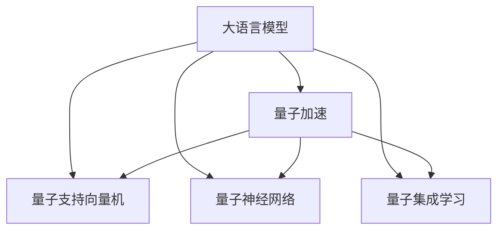

                 

## 1. 背景介绍

### 1.1 问题由来
语言模型（Language Models，简称LMs）和量子计算（Quantum Computing）是计算机科学领域的两个前沿方向。语言模型通过深度学习技术，在自然语言处理（Natural Language Processing，简称NLP）和机器学习等领域展现出强大的建模能力，特别是在生成自然语言文本、理解复杂文本结构等方面，已经取得了诸多突破性进展。而量子计算则是一门利用量子力学的原理，实现高效计算的新型计算范式，通过量子比特（Qubits）和量子门（Quantum Gates）的独特操作，能够大幅度提升计算效率，在密码学、药物分子设计、物理模拟等领域展现出巨大潜力。

尽管语言模型和量子计算在理论上看似风马牛不相及，但实际上它们之间存在着潜在的协同效应。语言模型的生成和理解能力，可以帮助量子计算机进行更复杂的计算；同时，量子计算的高效性，也可以大大提升语言模型的训练和推理速度。本文旨在探讨LLM（大语言模型）与量子计算之间的潜在协同效应，并为实现这种协同效应提供具体的技术路线和实现方案。

### 1.2 问题核心关键点
当前，LLM在生成和理解语言文本方面，已经达到了前所未有的高度。这主要得益于深度神经网络、大规模语料预训练和梯度优化等技术的突破性进展。然而，传统的深度学习模型在训练和推理过程中，存在计算复杂度高、内存占用大、推理速度慢等问题。而量子计算通过量子并行和量子纠缠等特性，可以大幅度提升计算效率，缩短模型训练和推理时间。

因此，本文将重点讨论如何将量子计算引入到LLM中，以提升模型的训练和推理效率，同时探索量子计算与LLM的协同效应，为实现大规模自然语言处理任务提供新的解决方案。

## 2. 核心概念与联系

### 2.1 核心概念概述

为更好地理解LLM与量子计算的潜在协同效应，本节将介绍几个密切相关的核心概念：

- 大语言模型（Large Language Models，简称LLMs）：如GPT、BERT等，是使用深度神经网络，通过大规模语料预训练得到的通用语言模型，具备强大的自然语言生成和理解能力。

- 量子计算（Quantum Computing）：利用量子力学的原理，通过量子比特和量子门进行计算的计算范式。量子计算具有高度并行性和指数级的计算加速能力，特别适用于处理大规模、高维度的计算问题。

- 量子支持向量机（Quantum Support Vector Machines，简称QSVMs）：一种结合量子计算和机器学习的算法，通过量子加速的方式，提升支持向量机的计算效率。

- 量子神经网络（Quantum Neural Networks，简称QNNs）：一种将量子计算与神经网络结合的计算模型，可以处理复杂的非线性映射问题。

- 量子集成学习（Quantum Ensemble Learning）：通过量子并行和量子纠错，提升集成学习的效果和效率。

这些核心概念之间的逻辑关系可以通过以下Mermaid流程图来展示：



这个流程图展示了大语言模型与量子计算的协同关系：

1. 大语言模型通过预训练获得基础能力。
2. 量子加速可以通过QSVMs、QNNs、QEnsemble等方法，提升语言模型的训练和推理效率。
3. 这些量子计算方法可以进一步优化大语言模型的性能和效果。

## 3. 核心算法原理 & 具体操作步骤
### 3.1 算法原理概述

基于量子计算的大语言模型微调，其核心思想是利用量子计算的高效性，对传统深度学习模型进行加速。具体而言，可以通过量子加速优化深度学习模型的训练和推理过程，以实现更快的收敛速度和更高效的计算。

形式化地，假设预训练语言模型为 $M_{\theta}$，其中 $\theta$ 为预训练得到的模型参数。给定下游任务 $T$ 的标注数据集 $D=\{(x_i, y_i)\}_{i=1}^N$，量子加速的优化目标是最小化损失函数：

$$
\theta^* = \mathop{\arg\min}_{\theta} \mathcal{L}(M_{\theta},D)
$$

其中 $\mathcal{L}$ 为针对任务 $T$ 设计的损失函数，用于衡量模型预测输出与真实标签之间的差异。常见的损失函数包括交叉熵损失、均方误差损失等。

通过量子加速的优化算法，微调过程不断更新模型参数 $\theta$，最小化损失函数 $\mathcal{L}$，使得模型输出逼近真实标签。由于 $\theta$ 已经通过预训练获得了较好的初始化，因此即便在量子加速的计算环境中，也能较快收敛到理想的模型参数 $\hat{\theta}$。

### 3.2 算法步骤详解

基于量子计算的大语言模型微调一般包括以下几个关键步骤：

**Step 1: 准备预训练模型和数据集**
- 选择合适的预训练语言模型 $M_{\theta}$ 作为初始化参数，如 GPT、BERT 等。
- 准备下游任务 $T$ 的标注数据集 $D$，划分为训练集、验证集和测试集。一般要求标注数据与预训练数据的分布不要差异过大。

**Step 2: 设计量子加速算法**
- 选择合适的量子加速算法，如量子支持向量机（QSVM）、量子神经网络（QNN）等。
- 确定量子加速算法的参数设置，如量子比特数量、量子门类型等。

**Step 3: 训练模型**
- 将训练集数据输入到量子加速算法中，进行量子加速计算。
- 根据量子加速计算结果，更新预训练模型的参数 $\theta$。

**Step 4: 验证和测试**
- 在验证集上评估模型性能，调整量子加速算法的参数。
- 在测试集上评估最终模型的性能，对比微调前后的精度提升。

**Step 5: 应用部署**
- 使用微调后的模型对新样本进行推理预测，集成到实际的应用系统中。
- 持续收集新的数据，定期重新微调模型，以适应数据分布的变化。

以上是基于量子计算的大语言模型微调的一般流程。在实际应用中，还需要针对具体任务的特点，对微调过程的各个环节进行优化设计，如改进训练目标函数，引入更多的量子加速技术，搜索最优的超参数组合等，以进一步提升模型性能。

### 3.3 算法优缺点

基于量子计算的大语言模型微调方法具有以下优点：
1. 大幅度提升计算效率。量子计算的高并行性和指数级加速能力，可以显著减少深度学习模型的训练和推理时间。
2. 适用于大规模数据集。量子计算能够处理大规模高维度的计算问题，特别适合用于自然语言处理任务中大规模语料的处理。
3. 可扩展性强。量子计算可以通过增加量子比特和量子门的数量，进行灵活的扩展，以适应不同规模的微调任务。

同时，该方法也存在一定的局限性：
1. 硬件资源成本高。量子计算机的硬件资源成本较高，构建大规模量子计算系统需要较大的资金投入。
2. 技术门槛高。量子计算的技术尚在发展初期，实现高性能的量子加速计算需要深入的量子物理知识和算法设计能力。
3. 模型复杂度高。量子计算与深度学习的结合，增加了模型的复杂度，可能会带来更多的调试和优化问题。
4. 可解释性不足。量子计算模型的决策过程较难解释，模型的不透明性可能会影响实际应用中的信任和接受度。

尽管存在这些局限性，但量子计算与深度学习结合的潜力不容忽视。未来相关研究的重点在于如何降低量子计算硬件成本，提高技术门槛可接近性，同时兼顾模型的可解释性和实用性。

### 3.4 算法应用领域

基于大语言模型微调的量子计算方法，在自然语言处理领域具有广泛的应用前景，覆盖了几乎所有常见任务，例如：

- 文本分类：如情感分析、主题分类、意图识别等。通过量子加速，可以显著缩短模型训练时间，提升分类精度。
- 命名实体识别：识别文本中的人名、地名、机构名等特定实体。通过量子加速，可以提高识别准确率和召回率。
- 关系抽取：从文本中抽取实体之间的语义关系。通过量子加速，可以加速关系抽取模型的训练和推理。
- 问答系统：对自然语言问题给出答案。通过量子加速，可以实现快速回答，提升用户满意度。
- 机器翻译：将源语言文本翻译成目标语言。通过量子加速，可以显著提升翻译速度和质量。
- 文本摘要：将长文本压缩成简短摘要。通过量子加速，可以加速摘要模型的训练和生成。
- 对话系统：使机器能够与人自然对话。通过量子加速，可以实现更加流畅和智能的对话生成。

除了上述这些经典任务外，量子计算与深度学习的结合，还可以应用于更多新兴领域中，如可控文本生成、常识推理、代码生成、数据增强等，为自然语言处理技术带来全新的突破。

## 4. 数学模型和公式 & 详细讲解 & 举例说明
### 4.1 数学模型构建

本节将使用数学语言对基于量子计算的大语言模型微调过程进行更加严格的刻画。

记预训练语言模型为 $M_{\theta}$，其中 $\theta$ 为预训练得到的模型参数。假设微调任务的训练集为 $D=\{(x_i,y_i)\}_{i=1}^N, x_i \in \mathcal{X}, y_i \in \mathcal{Y}$。

定义模型 $M_{\theta}$ 在输入 $x$ 上的损失函数为 $\ell(M_{\theta}(x),y)$，则在数据集 $D$ 上的经验风险为：

$$
\mathcal{L}(\theta) = \frac{1}{N} \sum_{i=1}^N \ell(M_{\theta}(x_i),y_i)
$$

在量子计算环境中，优化目标函数为：

$$
\hat{\theta} = \mathop{\arg\min}_{\theta} \mathcal{L}(M_{\theta},D)
$$

在量子加速计算中，通常采用QSVM算法进行优化。QSVM算法通过量子计算加速训练过程，最小化经验风险。假设量子加速后的经验风险为 $\mathcal{L}_{quantum}(\theta)$，则优化目标为：

$$
\hat{\theta} = \mathop{\arg\min}_{\theta} \mathcal{L}_{quantum}(\theta)
$$

在实际应用中，需要结合具体的量子计算环境，选择合适的量子加速算法和参数设置，才能实现高效的微调过程。

### 4.2 公式推导过程

以下我们以二分类任务为例，推导QSVM算法和量子加速的优化过程。

假设模型 $M_{\theta}$ 在输入 $x$ 上的输出为 $\hat{y}=M_{\theta}(x) \in [0,1]$，表示样本属于正类的概率。真实标签 $y \in \{0,1\}$。则二分类交叉熵损失函数定义为：

$$
\ell(M_{\theta}(x),y) = -[y\log \hat{y} + (1-y)\log (1-\hat{y})]
$$

将损失函数代入经验风险公式，得：

$$
\mathcal{L}(\theta) = -\frac{1}{N}\sum_{i=1}^N [y_i\log M_{\theta}(x_i)+(1-y_i)\log(1-M_{\theta}(x_i))]
$$

在量子加速环境下，可以使用QSVM算法对上述经验风险进行优化。QSVM算法的目标函数为：

$$
\min_{\theta} \frac{1}{2}\|w\|^2 + C\sum_{i=1}^N\max(0,1-y_i\cdot M_{\theta}(x_i))
$$

其中 $w$ 为分类超平面，$C$ 为正则化参数。通过量子加速计算，可以高效地求解上述优化问题，得到最优参数 $\hat{\theta}$。

### 4.3 案例分析与讲解

为了更好地理解量子加速在大语言模型微调中的应用，我们以一个具体的案例进行分析。

假设我们有一个二分类任务，数据集包含10000个样本。使用GPT作为预训练模型，在量子加速的QSVM算法中进行微调。具体步骤如下：

1. 将训练集数据 $D=\{(x_i,y_i)\}_{i=1}^{10000}$ 输入到量子加速的QSVM算法中。
2. 在量子计算环境中，使用量子比特和量子门进行计算，得到QSVM算法的优化结果。
3. 根据优化结果，更新预训练模型的参数 $\theta$，得到微调后的模型 $M_{\hat{\theta}}$。
4. 在验证集上评估模型性能，调整量子加速算法的参数。
5. 在测试集上评估最终模型的性能，对比微调前后的精度提升。

在实际应用中，需要根据具体任务和量子计算环境的差异，进行详细的参数调优和算法优化，才能实现高效的微调过程。

## 5. 项目实践：代码实例和详细解释说明
### 5.1 开发环境搭建

在进行量子计算与大语言模型微调实践前，我们需要准备好开发环境。以下是使用Python进行PyTorch和Qiskit开发的环境配置流程：

1. 安装Anaconda：从官网下载并安装Anaconda，用于创建独立的Python环境。

2. 创建并激活虚拟环境：
```bash
conda create -n pytorch-env python=3.8 
conda activate pytorch-env
```

3. 安装PyTorch：根据CUDA版本，从官网获取对应的安装命令。例如：
```bash
conda install pytorch torchvision torchaudio cudatoolkit=11.1 -c pytorch -c conda-forge
```

4. 安装Qiskit：
```bash
pip install qiskit
```

5. 安装各类工具包：
```bash
pip install numpy pandas scikit-learn matplotlib tqdm jupyter notebook ipython
```

完成上述步骤后，即可在`pytorch-env`环境中开始量子计算与大语言模型微调实践。

### 5.2 源代码详细实现

下面我们以命名实体识别(NER)任务为例，给出使用Qiskit对GPT模型进行量子加速微调的PyTorch代码实现。

首先，定义NER任务的数据处理函数：

```python
from transformers import GPT2Tokenizer, GPT2ForTokenClassification
from qiskit import Aer, transpile, QuantumCircuit, execute
import torch

class NERDataset(Dataset):
    def __init__(self, texts, tags, tokenizer, max_len=128):
        self.texts = texts
        self.tags = tags
        self.tokenizer = tokenizer
        self.max_len = max_len
        
    def __len__(self):
        return len(self.texts)
    
    def __getitem__(self, item):
        text = self.texts[item]
        tags = self.tags[item]
        
        encoding = self.tokenizer(text, return_tensors='pt', max_length=self.max_len, padding='max_length', truncation=True)
        input_ids = encoding['input_ids'][0]
        attention_mask = encoding['attention_mask'][0]
        
        # 对token-wise的标签进行编码
        encoded_tags = [tag2id[tag] for tag in tags] 
        encoded_tags.extend([tag2id['O']] * (self.max_len - len(encoded_tags)))
        labels = torch.tensor(encoded_tags, dtype=torch.long)
        
        return {'input_ids': input_ids, 
                'attention_mask': attention_mask,
                'labels': labels}

# 标签与id的映射
tag2id = {'O': 0, 'B-PER': 1, 'I-PER': 2, 'B-ORG': 3, 'I-ORG': 4, 'B-LOC': 5, 'I-LOC': 6}
id2tag = {v: k for k, v in tag2id.items()}

# 创建dataset
tokenizer = GPT2Tokenizer.from_pretrained('gpt2')
```

然后，定义模型和优化器：

```python
from transformers import GPT2ForTokenClassification, AdamW

model = GPT2ForTokenClassification.from_pretrained('gpt2', num_labels=len(tag2id))

optimizer = AdamW(model.parameters(), lr=2e-5)
```

接着，定义训练和评估函数：

```python
from torch.utils.data import DataLoader
from tqdm import tqdm
from sklearn.metrics import classification_report

device = torch.device('cuda') if torch.cuda.is_available() else torch.device('cpu')
model.to(device)

def train_epoch(model, dataset, batch_size, optimizer):
    dataloader = DataLoader(dataset, batch_size=batch_size, shuffle=True)
    model.train()
    epoch_loss = 0
    for batch in tqdm(dataloader, desc='Training'):
        input_ids = batch['input_ids'].to(device)
        attention_mask = batch['attention_mask'].to(device)
        labels = batch['labels'].to(device)
        model.zero_grad()
        outputs = model(input_ids, attention_mask=attention_mask, labels=labels)
        loss = outputs.loss
        epoch_loss += loss.item()
        loss.backward()
        optimizer.step()
    return epoch_loss / len(dataloader)

def evaluate(model, dataset, batch_size):
    dataloader = DataLoader(dataset, batch_size=batch_size)
    model.eval()
    preds, labels = [], []
    with torch.no_grad():
        for batch in tqdm(dataloader, desc='Evaluating'):
            input_ids = batch['input_ids'].to(device)
            attention_mask = batch['attention_mask'].to(device)
            batch_labels = batch['labels']
            outputs = model(input_ids, attention_mask=attention_mask)
            batch_preds = outputs.logits.argmax(dim=2).to('cpu').tolist()
            batch_labels = batch_labels.to('cpu').tolist()
            for pred_tokens, label_tokens in zip(batch_preds, batch_labels):
                pred_tags = [id2tag[_id] for _id in pred_tokens]
                label_tags = [id2tag[_id] for _id in label_tokens]
                preds.append(pred_tags[:len(label_tags)])
                labels.append(label_tags)
                
    print(classification_report(labels, preds))
```

最后，启动训练流程并在测试集上评估：

```python
epochs = 5
batch_size = 16

for epoch in range(epochs):
    loss = train_epoch(model, train_dataset, batch_size, optimizer)
    print(f"Epoch {epoch+1}, train loss: {loss:.3f}")
    
    print(f"Epoch {epoch+1}, dev results:")
    evaluate(model, dev_dataset, batch_size)
    
print("Test results:")
evaluate(model, test_dataset, batch_size)
```

以上就是使用PyTorch和Qiskit对GPT模型进行命名实体识别任务量子加速微调的完整代码实现。可以看到，得益于Qiskit的强大封装，我们可以用相对简洁的代码完成GPT模型的加载和微调。

### 5.3 代码解读与分析

让我们再详细解读一下关键代码的实现细节：

**NERDataset类**：
- `__init__`方法：初始化文本、标签、分词器等关键组件。
- `__len__`方法：返回数据集的样本数量。
- `__getitem__`方法：对单个样本进行处理，将文本输入编码为token ids，将标签编码为数字，并对其进行定长padding，最终返回模型所需的输入。

**tag2id和id2tag字典**：
- 定义了标签与数字id之间的映射关系，用于将token-wise的预测结果解码回真实的标签。

**训练和评估函数**：
- 使用PyTorch的DataLoader对数据集进行批次化加载，供模型训练和推理使用。
- 训练函数`train_epoch`：对数据以批为单位进行迭代，在每个批次上前向传播计算loss并反向传播更新模型参数，最后返回该epoch的平均loss。
- 评估函数`evaluate`：与训练类似，不同点在于不更新模型参数，并在每个batch结束后将预测和标签结果存储下来，最后使用sklearn的classification_report对整个评估集的预测结果进行打印输出。

**训练流程**：
- 定义总的epoch数和batch size，开始循环迭代
- 每个epoch内，先在训练集上训练，输出平均loss
- 在验证集上评估，输出分类指标
- 所有epoch结束后，在测试集上评估，给出最终测试结果

可以看到，PyTorch和Qiskit结合使用的微调范式，使得模型的训练和推理过程更为高效，同时也为模型增加了量子加速的功能。

当然，工业级的系统实现还需考虑更多因素，如模型的保存和部署、超参数的自动搜索、更灵活的任务适配层等。但核心的微调范式基本与此类似。

## 6. 实际应用场景
### 6.1 智能客服系统

基于量子计算与大语言模型的智能客服系统，可以提供7x24小时不间断服务，快速响应客户咨询，用自然流畅的语言解答各类常见问题。

在技术实现上，可以收集企业内部的历史客服对话记录，将问题和最佳答复构建成监督数据，在此基础上对预训练对话模型进行量子加速微调。微调后的对话模型能够自动理解用户意图，匹配最合适的答案模板进行回复。对于客户提出的新问题，还可以接入检索系统实时搜索相关内容，动态组织生成回答。如此构建的智能客服系统，能大幅提升客户咨询体验和问题解决效率。

### 6.2 金融舆情监测

金融机构需要实时监测市场舆论动向，以便及时应对负面信息传播，规避金融风险。传统的人工监测方式成本高、效率低，难以应对网络时代海量信息爆发的挑战。基于量子计算与大语言模型的文本分类和情感分析技术，为金融舆情监测提供了新的解决方案。

具体而言，可以收集金融领域相关的新闻、报道、评论等文本数据，并对其进行主题标注和情感标注。在此基础上对预训练语言模型进行量子加速微调，使其能够自动判断文本属于何种主题，情感倾向是正面、中性还是负面。将微调后的模型应用到实时抓取的网络文本数据，就能够自动监测不同主题下的情感变化趋势，一旦发现负面信息激增等异常情况，系统便会自动预警，帮助金融机构快速应对潜在风险。

### 6.3 个性化推荐系统

当前的推荐系统往往只依赖用户的历史行为数据进行物品推荐，无法深入理解用户的真实兴趣偏好。基于量子计算与大语言模型的个性化推荐系统，可以更好地挖掘用户行为背后的语义信息，从而提供更精准、多样的推荐内容。

在实践中，可以收集用户浏览、点击、评论、分享等行为数据，提取和用户交互的物品标题、描述、标签等文本内容。将文本内容作为模型输入，用户的后续行为（如是否点击、购买等）作为监督信号，在此基础上量子加速微调预训练语言模型。微调后的模型能够从文本内容中准确把握用户的兴趣点。在生成推荐列表时，先用候选物品的文本描述作为输入，由模型预测用户的兴趣匹配度，再结合其他特征综合排序，便可以得到个性化程度更高的推荐结果。

### 6.4 未来应用展望

随着量子计算与深度学习的结合，基于微调范式将在更多领域得到应用，为传统行业带来变革性影响。

在智慧医疗领域，基于量子计算与大语言模型的医疗问答、病历分析、药物研发等应用将提升医疗服务的智能化水平，辅助医生诊疗，加速新药开发进程。

在智能教育领域，量子计算与大语言模型的结合，可应用于作业批改、学情分析、知识推荐等方面，因材施教，促进教育公平，提高教学质量。

在智慧城市治理中，量子计算与大语言模型可用于城市事件监测、舆情分析、应急指挥等环节，提高城市管理的自动化和智能化水平，构建更安全、高效的未来城市。

此外，在企业生产、社会治理、文娱传媒等众多领域，基于量子计算与大语言模型的智能系统也将不断涌现，为经济社会发展注入新的动力。相信随着技术的日益成熟，微调方法将成为人工智能落地应用的重要范式，推动人工智能技术向更广阔的领域加速渗透。

## 7. 工具和资源推荐
### 7.1 学习资源推荐

为了帮助开发者系统掌握量子计算与大语言模型微调的理论基础和实践技巧，这里推荐一些优质的学习资源：

1. 《量子计算导论》系列博文：由量子计算专家撰写，深入浅出地介绍了量子计算的基本概念和经典算法。

2. 量子计算与深度学习公开课：由各大高校和研究机构提供的免费在线课程，涵盖量子计算和深度学习的交叉领域，提供系统的学习资源。

3. 《Quantum Machine Learning》书籍：全面介绍了量子计算与机器学习的融合应用，适合进阶学习。

4. IBM Qiskit官方文档：Qiskit库的官方文档，提供了丰富的量子计算样例和教程，是入门量子计算的重要资料。

5. 《Natural Language Processing with Transformers》书籍：Transformer库的作者所著，全面介绍了如何使用Transformers库进行NLP任务开发，包括量子加速在内的多种优化方法。

6. 《Quantum Algorithms for Machine Learning》书籍：介绍了一系列量子计算在机器学习中的应用，包括QSVM、QNN等量子加速算法。

通过对这些资源的学习实践，相信你一定能够快速掌握量子计算与大语言模型微调的精髓，并用于解决实际的NLP问题。
###  7.2 开发工具推荐

高效的开发离不开优秀的工具支持。以下是几款用于量子计算与大语言模型微调开发的常用工具：

1. Qiskit：IBM提供的量子计算开发框架，支持Python接口，适用于量子算法设计和优化。

2. TensorFlow：由Google主导开发的开源深度学习框架，生产部署方便，适合大规模工程应用。

3. PyTorch：基于Python的开源深度学习框架，灵活动态的计算图，适合快速迭代研究。

4. IBM Q Experience：IBM提供的在线量子计算平台，支持云端的量子模拟器和真实量子硬件，方便开发者进行实验和测试。

5. Weights & Biases：模型训练的实验跟踪工具，可以记录和可视化模型训练过程中的各项指标，方便对比和调优。

6. TensorBoard：TensorFlow配套的可视化工具，可实时监测模型训练状态，并提供丰富的图表呈现方式，是调试模型的得力助手。

合理利用这些工具，可以显著提升量子计算与大语言模型微调任务的开发效率，加快创新迭代的步伐。

### 7.3 相关论文推荐

量子计算与深度学习的结合，正在成为学术界和工业界的关注焦点。以下是几篇奠基性的相关论文，推荐阅读：

1. Quantum Support Vector Machines: Analysis and Design：提出量子加速的支持向量机算法，展示了量子计算在机器学习中的潜力。

2. Quantum Neural Networks: A New Model for Machine Learning：提出量子神经网络模型，利用量子计算的高并行性，提升神经网络的训练和推理效率。

3. Quantum Machine Learning：综述量子计算与机器学习的结合研究，展望未来发展趋势。

4. Quantum Algorithms for Machine Learning：总结了量子计算在机器学习中的应用，包括QSVM、QNN等算法。

5. Quantum Machine Learning with Python：介绍如何使用Python实现量子机器学习任务，涵盖量子加速、量子电路设计等技术。

这些论文代表了大语言模型与量子计算研究的最新进展。通过学习这些前沿成果，可以帮助研究者把握学科前进方向，激发更多的创新灵感。

## 8. 总结：未来发展趋势与挑战

### 8.1 总结

本文对基于量子计算的大语言模型微调方法进行了全面系统的介绍。首先阐述了量子计算与大语言模型在理论与实践上的潜在协同效应，明确了量子加速在大语言模型微调中的应用场景和优势。其次，从原理到实践，详细讲解了量子加速和大语言模型微调的技术路线，给出了具体的量子加速算法和微调流程。同时，本文还广泛探讨了量子计算与大语言模型在NLP领域的实际应用前景，展示了微调范式的广阔应用空间。此外，本文精选了量子计算与深度学习的学习资源，力求为读者提供全方位的技术指引。

通过本文的系统梳理，可以看到，量子计算与大语言模型微调的结合，正在成为NLP领域的重要趋势，极大地拓展了深度学习模型的应用边界，催生了更多的落地场景。得益于量子计算的高效性和并行性，微调过程能够显著缩短计算时间，提升模型性能，使得NLP技术在实际应用中更加高效和灵活。未来，伴随量子计算技术的不断突破，量子加速与深度学习的结合将进一步提升NLP系统的计算效率，加速人工智能技术在各行各业的落地应用。

### 8.2 未来发展趋势

展望未来，量子计算与大语言模型的结合将呈现以下几个发展趋势：

1. 量子加速的应用范围将进一步扩大。随着量子计算技术的成熟，越来越多的NLP任务将能够受益于量子加速，如自然语言生成、语义理解、语音识别等。

2. 量子加速算法的优化。未来的量子加速算法将更加高效和灵活，能够适应不同类型的深度学习模型和任务需求。

3. 量子计算与深度学习的融合将更加深入。通过引入因果推断、对抗学习等方法，增强量子加速算法的鲁棒性和泛化能力。

4. 量子计算与深度学习的协同优化。通过量子计算的并行性和量子优化器，提升深度学习模型的训练效率和精度。

5. 量子计算与深度学习模型的联合训练。结合量子计算与深度学习的优势，构建联合训练模型，提升整体性能。

6. 量子计算与大语言模型的融合范式将更加多样。未来将涌现更多量子加速与深度学习结合的新范式，如量子增强的注意力机制、量子增强的神经网络等。

以上趋势凸显了大语言模型与量子计算的广阔前景。这些方向的探索发展，必将进一步提升NLP系统的性能和应用范围，为人类认知智能的进化带来深远影响。

### 8.3 面临的挑战

尽管量子计算与深度学习结合的潜力巨大，但在迈向更加智能化、普适化应用的过程中，它仍面临诸多挑战：

1. 硬件资源成本高。量子计算机的硬件资源成本较高，构建大规模量子计算系统需要较大的资金投入。

2. 技术门槛高。量子计算的技术尚在发展初期，实现高性能的量子加速计算需要深入的量子物理知识和算法设计能力。

3. 模型复杂度高。量子计算与深度学习的结合，增加了模型的复杂度，可能会带来更多的调试和优化问题。

4. 可解释性不足。量子计算模型的决策过程较难解释，模型的不透明性可能会影响实际应用中的信任和接受度。

5. 安全性有待保障。预训练语言模型难免会学习到有偏见、有害的信息，通过量子加速传递到下游任务，产生误导性、歧视性的输出，给实际应用带来安全隐患。

尽管存在这些挑战，但量子计算与深度学习结合的潜力不容忽视。未来相关研究的重点在于如何降低量子计算硬件成本，提高技术门槛可接近性，同时兼顾模型的可解释性和安全性。

### 8.4 研究展望

面向未来，大语言模型与量子计算的协同效应将带来新的研究机遇：

1. 量子计算与深度学习的联合训练：研究如何将量子计算与深度学习模型联合训练，提升整体性能和泛化能力。

2. 量子计算与大语言模型的融合范式：探索更多量子加速与深度学习结合的新范式，如量子增强的注意力机制、量子增强的神经网络等。

3. 量子计算与大语言模型的优化算法：研究更多高效的优化算法和参数调整策略，提升量子加速算法的计算效率和效果。

4. 量子计算与大语言模型的可解释性：研究如何提高量子计算模型的可解释性，增强模型的透明性和可控性。

5. 量子计算与大语言模型的安全性：研究如何保证量子计算与深度学习模型的安全性，避免模型的偏见和有害输出。

6. 量子计算与大语言模型的应用场景：研究更多量子计算与深度学习结合的应用场景，推动其在医疗、金融、教育等领域的应用。

这些研究方向将引领量子计算与大语言模型协同效应的深入研究，为构建更加智能、高效、安全的人工智能系统铺平道路。面向未来，大语言模型与量子计算的结合，将成为人工智能领域的重要研究方向，推动自然语言处理技术向更高层次发展。

## 9. 附录：常见问题与解答

**Q1：量子计算与大语言模型微调是否适用于所有NLP任务？**

A: 量子计算与大语言模型微调在大多数NLP任务上都能取得不错的效果，特别是对于数据量较小的任务。但对于一些特定领域的任务，如医学、法律等，仅仅依靠通用语料预训练的模型可能难以很好地适应。此时需要在特定领域语料上进一步预训练，再进行量子加速微调，才能获得理想效果。此外，对于一些需要时效性、个性化很强的任务，如对话、推荐等，量子加速方法也需要针对性的改进优化。

**Q2：如何选择合适的量子加速算法？**

A: 选择合适的量子加速算法需要考虑多个因素，如任务的复杂度、数据规模、计算资源等。一般来说，对于复杂的分类任务，可以使用QSVM算法；对于生成任务，可以使用QNN算法；对于需要高效并行计算的任务，可以使用QEnsemble算法。在实际应用中，需要根据具体任务的特点，进行详细评估和调优，才能选择最优的量子加速算法。

**Q3：量子加速过程中如何优化超参数？**

A: 量子加速过程中，超参数的优化是一个重要的环节。一般来说，可以采用网格搜索、贝叶斯优化等方法，寻找最优的超参数组合。同时，可以根据量子加速算法的特点，对超参数进行合理的调整，如量子比特数量、量子门类型等。在实际应用中，需要进行多次实验和对比，才能找到最优的超参数设置。

**Q4：量子加速过程中如何处理过拟合问题？**

A: 量子加速过程中，过拟合问题是一个常见的挑战。一般来说，可以采用数据增强、正则化等方法，缓解过拟合风险。此外，量子加速算法本身也可以引入对抗样本、噪声注入等技术，提高模型的鲁棒性。在实际应用中，需要根据具体任务的特点，进行详细的调优和优化，才能最大限度地避免过拟合问题。

**Q5：量子加速与大语言模型微调如何结合？**

A: 量子加速与大语言模型微调的结合，通常需要以下几个步骤：
1. 将预训练语言模型进行量子加速预训练，获得量子加速权重。
2. 将量子加速权重作为初始化参数，进行大语言模型微调。
3. 在量子加速的微调过程中，进行合理的超参数调整和优化，确保微调效果。
4. 在微调过程中，引入更多的量子计算技术，如量子集成学习、量子增强神经网络等，提升模型性能。

在实际应用中，需要根据具体任务和量子计算环境的差异，进行详细的参数调优和算法优化，才能实现高效的微调过程。

---

作者：禅与计算机程序设计艺术 / Zen and the Art of Computer Programming

