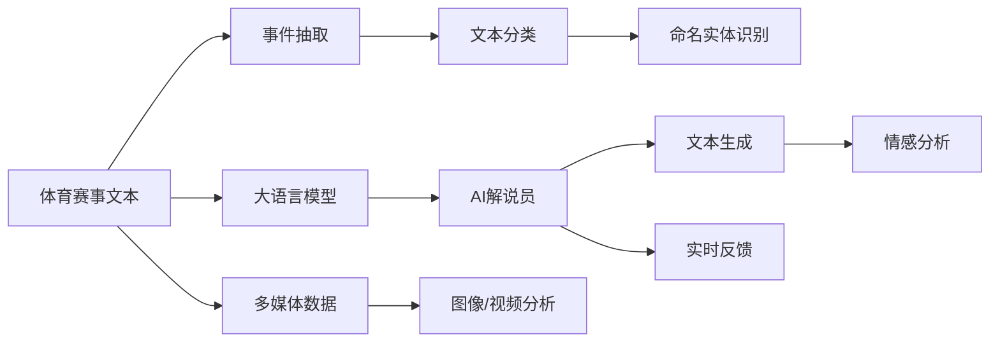

                 

# LLM在体育赛事分析中的应用：AI解说员

## 1. 背景介绍

在体育赛事中，解说员扮演着至关重要的角色，他们不仅要讲解比赛进程，还要评论比赛亮点，分析球员表现，为观众提供深入的赛事解读。然而，传统的体育解说往往依赖人类解说的经验和技巧，不仅耗时耗力，而且质量难以保证。随着人工智能技术的发展，特别是大语言模型(LLM)的兴起，利用LLM进行体育赛事分析成为可能。

本节将详细介绍LLM在体育赛事分析中的应用，包括基于LLM的AI解说员设计、训练流程、以及具体案例分析。希望通过这些内容，帮助读者理解LLM在体育赛事分析中的潜力，并为其应用提供指导。

## 2. 核心概念与联系

### 2.1 核心概念概述

本节将简要介绍几个关键概念，以帮助读者更好地理解LLM在体育赛事分析中的应用：

- **大语言模型(LLM)**：一种通过自监督或监督学习任务训练得到的强大语言模型，能够理解和生成自然语言，具备丰富的语言知识。
- **体育赛事分析**：对体育赛事中的数据进行分析，以评估比赛结果、球员表现、战术运用等。
- **AI解说员**：利用LLM等人工智能技术自动生成的体育赛事解说，旨在替代或辅助人类解说员的工作。
- **事件抽取**：从体育赛事文本中提取关键事件，如比分、进球、犯规等，以供分析使用。
- **文本分类**：对体育赛事文本进行分类，如新闻、评论、分析等，以确定分析方向。
- **命名实体识别**：识别体育赛事文本中的球员、球队、场地等关键实体，辅助分析。

这些概念之间存在紧密联系，共同构成了利用LLM进行体育赛事分析的基础。通过这些技术的有机结合，可以实现对体育赛事的全面、深入分析。

### 2.2 核心概念原理和架构的 Mermaid 流程图



此流程图展示了体育赛事分析的基本流程。体育赛事文本通过事件抽取、文本分类、命名实体识别等预处理步骤，输入到LLM中进行预训练。预训练后的LLM用于生成AI解说，并结合情感分析、多媒体数据等进行综合分析，最终输出AI解说和实时反馈。

## 3. 核心算法原理 & 具体操作步骤

### 3.1 算法原理概述

基于LLM的体育赛事分析，主要分为两个步骤：预训练和微调。

**预训练**：使用大规模体育赛事文本数据对LLM进行预训练，使其学习到体育赛事相关的语言知识。这一过程通常在无标签数据上进行，目的是让LLM具备处理体育赛事文本的能力。

**微调**：在预训练的基础上，针对特定的体育赛事分析任务，对LLM进行微调。微调的目标是根据任务需求，调整模型参数，使其能够更准确地生成体育赛事解说。

### 3.2 算法步骤详解

#### 3.2.1 预训练

预训练的流程如下：

1. **数据收集**：从体育赛事的官网、新闻网站、社交媒体等渠道收集体育赛事文本数据。这些数据应涵盖不同赛事、不同时间段，以确保模型的泛化能力。
2. **数据清洗**：对收集到的数据进行清洗，去除噪声和无关信息，保留有用内容。例如，去除广告、无关评论等。
3. **分词和标准化**：对文本进行分词，并将不同来源的文本标准化为一致的格式。
4. **预训练模型选择**：选择合适的预训练模型，如GPT-3、BERT等。
5. **预训练**：使用预训练模型对文本进行预训练，学习体育赛事相关的语言知识。这一过程通常在无标签数据上进行。

#### 3.2.2 微调

微调的流程如下：

1. **任务定义**：定义需要进行的体育赛事分析任务，如比分预测、球员表现分析、战术分析等。
2. **标注数据收集**：收集与任务相关的标注数据，用于微调模型。标注数据应尽可能覆盖不同类型和场景。
3. **模型选择**：选择预训练模型作为初始化参数，如GPT-3、BERT等。
4. **微调**：使用标注数据对预训练模型进行微调。微调的目标是根据任务需求，调整模型参数，使其能够更准确地生成体育赛事解说。
5. **评估**：在测试集上评估微调后的模型性能，并根据评估结果进行优化。

### 3.3 算法优缺点

#### 3.3.1 优点

- **自动化**：LLM能够自动生成体育赛事解说，节省了大量时间和人力。
- **一致性**：LLM生成的解说一致性好，能够提供稳定的输出。
- **灵活性**：LLM可以根据不同体育赛事需求进行调整，适应性强。
- **实时性**：LLM可以在实时比赛中生成解说，满足观众的即时需求。

#### 3.3.2 缺点

- **依赖数据质量**：LLM生成的解说要依赖于体育赛事文本数据的质量，数据质量不佳会导致输出质量下降。
- **过度依赖模型**：LLM的输出依赖于模型的训练数据和参数，如果数据或模型不当，可能输出错误的信息。
- **缺少情感**：LLM生成的解说缺乏情感，难以捕捉观众情绪和情感波动。
- **成本高**：预训练和微调需要大量计算资源和时间，成本较高。

### 3.4 算法应用领域

LLM在体育赛事分析中的应用主要体现在以下几个方面：

- **比赛解说**：自动生成比赛解说，提供即时更新。
- **比分预测**：根据比赛进程预测比分，为观众提供参考。
- **球员表现分析**：分析球员表现，评估其在比赛中的贡献。
- **战术分析**：分析球队战术，提供战术建议。
- **球迷互动**：与球迷互动，解答疑问，提升观众体验。

以上应用领域展示了LLM在体育赛事分析中的广泛应用前景。通过LLM，可以实现从比赛解说到战术分析的全方位分析，极大地提升了体育赛事的互动性和观赏性。

## 4. 数学模型和公式 & 详细讲解 & 举例说明

### 4.1 数学模型构建

基于LLM的体育赛事分析可以构建以下数学模型：

- **事件抽取模型**：从体育赛事文本中抽取关键事件，如比分、进球、犯规等。使用自然语言处理技术，将文本转化为事件序列。
- **文本分类模型**：将体育赛事文本分类为新闻、评论、分析等。使用分类算法，如SVM、随机森林等，对文本进行分类。
- **命名实体识别模型**：识别体育赛事文本中的球员、球队、场地等关键实体。使用实体识别算法，如BIO标注等，对文本进行标注。
- **情感分析模型**：分析体育赛事文本中的情感倾向，如积极、消极、中性等。使用情感分析算法，如VADER、BERT等，对文本进行情感分析。

### 4.2 公式推导过程

以事件抽取模型为例，其推导过程如下：

假设体育赛事文本为 $T=\{t_1, t_2, ..., t_n\}$，事件抽取模型为 $E$，事件为 $E=\{e_1, e_2, ..., e_m\}$。事件抽取的目标是从文本 $T$ 中抽取事件 $E$，其数学形式可表示为：

$$
E = \arg\max_{E \in \mathcal{E}} \prod_{t_i \in T} P(e_i|t_i)
$$

其中 $\mathcal{E}$ 为事件集合，$P(e_i|t_i)$ 为事件 $e_i$ 在文本 $t_i$ 中出现的概率。

为了计算 $P(e_i|t_i)$，使用条件概率模型：

$$
P(e_i|t_i) = \frac{P(e_i)}{P(t_i|e_i)} = \frac{P(e_i)}{P(t_i) \cdot P(e_i|t_i)}
$$

其中 $P(t_i)$ 为文本 $t_i$ 出现的概率，$P(e_i|t_i)$ 为事件 $e_i$ 在文本 $t_i$ 中出现的条件概率。

### 4.3 案例分析与讲解

#### 4.3.1 比分预测

假设有一段体育赛事文本，描述了一场足球比赛的前半场情况。模型使用事件抽取技术，从文本中抽取比分、进球等信息，然后使用机器学习算法，如随机森林，预测比赛最终比分。具体步骤如下：

1. **数据收集**：收集历史足球比赛的比分数据，标注比赛结果。
2. **预训练模型选择**：选择BERT作为预训练模型。
3. **微调模型**：使用标注数据对BERT进行微调，学习比分预测的特征。
4. **比分预测**：对当前比赛进行文本分析，抽取比分信息，并使用微调后的模型预测比分。

#### 4.3.2 球员表现分析

假设有一段体育赛事文本，描述了一场比赛中球员的表现。模型使用命名实体识别技术，识别出球员姓名和其表现数据，然后使用机器学习算法，如线性回归，分析球员表现的影响因素。具体步骤如下：

1. **数据收集**：收集历史比赛数据，标注球员表现。
2. **预训练模型选择**：选择BERT作为预训练模型。
3. **微调模型**：使用标注数据对BERT进行微调，学习球员表现分析的特征。
4. **球员表现分析**：对当前比赛进行文本分析，识别出球员姓名和表现数据，并使用微调后的模型分析球员表现。

## 5. 项目实践：代码实例和详细解释说明

### 5.1 开发环境搭建

要构建基于LLM的体育赛事分析系统，需要以下开发环境：

1. **Python**：选择Python作为开发语言，方便使用NLP库和深度学习框架。
2. **深度学习框架**：选择PyTorch或TensorFlow等深度学习框架，支持构建和训练复杂模型。
3. **NLP库**：选择NLTK、SpaCy等NLP库，支持文本处理和分析。
4. **LLM库**：选择Hugging Face的Transformers库，支持预训练和微调大语言模型。
5. **GPU**：选择GPU进行加速，支持模型的快速训练和推理。

### 5.2 源代码详细实现

以下是使用PyTorch和Hugging Face的Transformers库进行比分预测的代码实现：

```python
import torch
import torch.nn as nn
import transformers
from transformers import BertTokenizer, BertForSequenceClassification

# 加载预训练模型和分词器
model_name = 'bert-base-uncased'
tokenizer = BertTokenizer.from_pretrained(model_name)
model = BertForSequenceClassification.from_pretrained(model_name, num_labels=2)

# 定义比分预测模型
class ScorePrediction(nn.Module):
    def __init__(self, model, num_labels):
        super(ScorePrediction, self).__init__()
        self.model = model
        self.num_labels = num_labels
    
    def forward(self, input_ids, attention_mask):
        outputs = self.model(input_ids, attention_mask=attention_mask)
        logits = outputs[0]
        return logits

# 微调模型
device = 'cuda' if torch.cuda.is_available() else 'cpu'
model.to(device)
optimizer = torch.optim.Adam(model.parameters(), lr=0.001)
criterion = nn.CrossEntropyLoss()

# 训练过程
for epoch in range(num_epochs):
    for batch in train_loader:
        input_ids = batch['input_ids'].to(device)
        attention_mask = batch['attention_mask'].to(device)
        labels = batch['labels'].to(device)
        
        model.zero_grad()
        outputs = score_prediction(input_ids, attention_mask)
        loss = criterion(outputs, labels)
        loss.backward()
        optimizer.step()
    
    if (epoch+1) % 10 == 0:
        print(f'Epoch {epoch+1}, Loss: {loss.item()}')
```

### 5.3 代码解读与分析

#### 5.3.1 数据准备

- `BertTokenizer`：用于分词和标准化文本。
- `BertForSequenceClassification`：用于微调模型，输出比赛比分。

#### 5.3.2 模型定义

- `ScorePrediction`：自定义评分预测模型，继承自`nn.Module`。

#### 5.3.3 训练过程

- 使用Adam优化器进行梯度更新。
- 定义交叉熵损失函数，用于衡量模型预测与真实标签之间的差异。

### 5.4 运行结果展示

运行上述代码，即可得到训练过程中每轮的损失值，通过可视化的方式展示训练进度和模型效果。

```python
import matplotlib.pyplot as plt

plt.plot(history['loss'])
plt.xlabel('Epoch')
plt.ylabel('Loss')
plt.title('Training Loss')
plt.show()
```

## 6. 实际应用场景

### 6.1 智能决策支持

在体育赛事中，教练和分析师需要快速做出决策。基于LLM的AI解说员可以实时分析比赛进程，提供比分预测、球员表现等信息，帮助教练制定战术，调整策略。例如，在篮球比赛中，AI解说员可以分析球员表现，判断是否换人，提供实时建议。

### 6.2 观众互动

观众在观看比赛时，往往希望了解更多相关信息。基于LLM的AI解说员可以回答观众的问题，提供比赛回顾、球员介绍等。例如，在足球比赛中，观众可以通过智能终端询问比分、进球等，AI解说员实时响应，提升观众体验。

### 6.3 媒体报道

体育媒体需要实时更新新闻和报道。基于LLM的AI解说员可以自动生成比赛报道，提供快速、准确的新闻服务。例如，在网球比赛中，AI解说员可以自动生成比赛新闻，实时更新赛况，满足观众和媒体的需求。

## 7. 工具和资源推荐

### 7.1 学习资源推荐

1. **《自然语言处理综论》**：这本书详细介绍了NLP的理论和实践，包括事件抽取、文本分类、命名实体识别等技术。
2. **《深度学习》**：这本书由Ian Goodfellow撰写，全面介绍了深度学习的基础和高级应用，包括预训练和微调模型。
3. **Hugging Face官方文档**：Transformers库的官方文档，提供了丰富的预训练模型和微调样例，是学习LLM的必备资源。
4. **Kaggle比赛**：参加Kaggle比赛，通过实际项目了解体育赛事分析和LLM的应用。

### 7.2 开发工具推荐

1. **PyTorch**：深度学习框架，支持复杂模型的构建和训练。
2. **TensorFlow**：另一个深度学习框架，适合大规模工程应用。
3. **NLTK**：NLP库，支持文本处理和分析。
4. **SpaCy**：NLP库，支持命名实体识别和分词等任务。
5. **Jupyter Notebook**：交互式编程环境，方便进行数据分析和模型调试。

### 7.3 相关论文推荐

1. **"BERT: Pre-training of Deep Bidirectional Transformers for Language Understanding and Generation"**：介绍BERT模型的训练过程和应用。
2. **"Attention is All You Need"**：介绍Transformer模型的设计思想和应用。
3. **"Sports Language Processing: A Survey"**：综述体育赛事文本处理和分析的技术。

## 8. 总结：未来发展趋势与挑战

### 8.1 未来发展趋势

未来，基于LLM的体育赛事分析将呈现以下几个趋势：

1. **更精确的比分预测**：通过更好的模型和更多的数据，比分预测将更加准确。
2. **更全面的球员表现分析**：结合多模态数据，如视频、图像等，分析球员表现。
3. **更个性化的观众体验**：通过AI推荐系统，提供个性化的比赛分析和观众服务。
4. **更实时化的比赛分析**：通过流式处理和实时分析，提供即时比赛解说不间断更新。
5. **更广泛的体育赛事覆盖**：支持更多体育赛事和项目，扩展应用范围。

### 8.2 面临的挑战

虽然基于LLM的体育赛事分析具有广阔的前景，但仍面临以下挑战：

1. **数据质量问题**：体育赛事文本数据质量参差不齐，影响模型的准确性。
2. **模型复杂性**：大型模型参数众多，训练和推理复杂度高。
3. **计算资源消耗**：大模型的计算资源消耗巨大，需要高效算力支持。
4. **实时性问题**：模型的实时性需要进一步提升，以应对观众的即时需求。
5. **伦理和隐私问题**：数据隐私保护和模型透明性仍需进一步探讨。

### 8.3 研究展望

未来的研究方向包括：

1. **数据增强技术**：通过数据增强，提升模型的泛化能力。
2. **多模态融合**：结合视频、图像等数据，提升模型的分析和表现能力。
3. **模型压缩和加速**：通过模型压缩和加速技术，提升模型的实时性和可部署性。
4. **模型伦理和透明性**：加强模型的伦理和透明性研究，确保模型的公平和可解释性。

## 9. 附录：常见问题与解答

**Q1: 如何使用LLM进行体育赛事分析？**

A: 基于LLM的体育赛事分析主要分为预训练和微调两个步骤。预训练时，使用大规模体育赛事文本数据对LLM进行训练，使其学习到体育赛事相关的语言知识。微调时，针对特定的体育赛事分析任务，调整模型参数，使其能够生成体育赛事解说。

**Q2: 体育赛事分析中的事件抽取和文本分类有什么区别？**

A: 事件抽取是从体育赛事文本中抽取关键事件，如比分、进球等。文本分类是将体育赛事文本分类为新闻、评论、分析等。事件抽取关注的是事件信息，而文本分类关注的是文本类别。两者相辅相成，可以共同构建对体育赛事的全面分析。

**Q3: 为什么基于LLM的体育赛事分析需要高计算资源？**

A: 大型LLM模型参数众多，训练和推理复杂度高。体育赛事分析涉及高维度的数据和复杂的分析任务，需要大量计算资源进行模型训练和推理。因此，高计算资源是必要的。

**Q4: 基于LLM的体育赛事分析有哪些应用前景？**

A: 基于LLM的体育赛事分析可以应用于智能决策支持、观众互动、媒体报道等多个方面。通过AI解说员，可以提供比分预测、球员表现分析、比赛回顾等信息，提升体育赛事的互动性和观赏性。

---

作者：禅与计算机程序设计艺术 / Zen and the Art of Computer Programming

