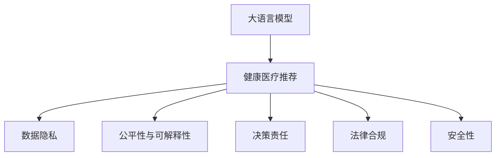

                 

# LLM在健康医疗推荐中的伦理考量

## 1. 背景介绍

### 1.1 问题由来
近年来，人工智能在健康医疗领域的应用越来越广泛，从疾病诊断到药物研发，从医疗影像分析到个性化健康推荐，AI技术已经展现出了其强大的潜力。大语言模型(LLM)作为一种具有强大学习能力的自然语言处理技术，也被越来越多地应用于健康医疗推荐场景。然而，相较于传统机器学习算法，LLM在医学领域的引入涉及到更多伦理问题。

### 1.2 问题核心关键点
在健康医疗推荐中，LLM的应用面临诸多伦理考量，主要包括以下几点：

- **数据隐私**：医疗数据包含敏感信息，如何保护患者隐私是一个重要问题。
- **公平性与可解释性**：LLM可能带有算法偏见，如何确保推荐结果的公平性和透明性，是另一大挑战。
- **决策责任**：如何界定在推荐过程中，LLM与人类医生的责任分担。
- **法律合规**：医疗领域高度监管，如何确保LLM的应用符合相关法律法规。
- **安全性**：确保LLM在医疗推荐中的输出不会对患者产生负面影响。

### 1.3 问题研究意义
研究大语言模型在健康医疗推荐中的伦理考量，对于提升医疗AI技术的社会接受度，确保技术应用的合规性、公平性和安全性，具有重要意义。

## 2. 核心概念与联系

### 2.1 核心概念概述

为更好地理解大语言模型在健康医疗推荐中的伦理问题，本节将介绍几个密切相关的核心概念：

- **大语言模型(LLM)**：通过大规模数据预训练得到的具有强大语言生成和理解能力的模型，广泛应用于自然语言处理领域。
- **健康医疗推荐**：利用AI技术，为用户提供个性化健康建议、疾病诊断、治疗方案等医疗服务。
- **数据隐私**：在数据收集、处理、存储和使用过程中，保护个人敏感信息不被泄露的原则和措施。
- **算法偏见**：指算法在训练和应用过程中，因数据偏见、代码偏见等因素导致的对某些群体不公平的输出。
- **可解释性**：指AI模型输出结果的可解释和可理解性，特别是在医疗领域，可解释性对于医生和患者信任模型的使用至关重要。
- **决策责任**：在使用AI技术进行医疗决策时，需要明确算法的责任，确保人类医生能够对决策结果承担相应的责任。
- **法律合规**：在医疗推荐领域，AI模型需要符合相关法律法规的要求，如数据保护、隐私权、知情同意等。
- **安全性**：确保AI模型输出的健康建议不会对患者的身体和心理健康产生负面影响。

这些核心概念之间的逻辑关系可以通过以下Mermaid流程图来展示：



这个流程图展示了大语言模型在健康医疗推荐中的核心概念及其之间的关系：

1. 大语言模型通过预训练获取语言处理能力。
2. 利用该能力为用户提供个性化健康推荐。
3. 在推荐过程中，涉及数据隐私、公平性、责任、法律合规、安全性等多重伦理考量。

## 3. 核心算法原理 & 具体操作步骤

### 3.1 算法原理概述

大语言模型在健康医疗推荐中的应用，通常包括以下几个步骤：

1. **数据预处理**：收集和处理医疗数据，去除噪声和不相关数据。
2. **模型训练**：使用大语言模型在标注数据上训练，学习如何根据患者的症状、历史数据、生活习惯等特征，生成推荐结果。
3. **模型评估与微调**：在验证集上评估模型性能，使用交叉验证等方法优化模型参数。
4. **推荐生成**：使用训练好的模型对新患者的输入数据进行推理，生成个性化健康建议。

### 3.2 算法步骤详解

以下是对每个步骤的具体详细描述：

**Step 1: 数据预处理**

- **数据收集**：从医院、诊所、在线平台等渠道收集患者的医疗记录、症状描述、生活习惯等数据。
- **数据清洗**：处理缺失值、异常值、重复数据等问题，确保数据质量。
- **数据标注**：对数据进行标注，如将症状标记为常见病、罕见病、严重程度等。

**Step 2: 模型训练**

- **选择合适的模型**：基于领域需求选择合适的大语言模型，如Bart、T5等。
- **特征提取**：使用预训练模型的编码器将患者数据转化为向量表示。
- **损失函数设计**：设计适合健康推荐任务的损失函数，如交叉熵、平均绝对误差等。
- **优化器选择**：选择适合模型的优化器，如Adam、SGD等。
- **超参数调优**：通过网格搜索、随机搜索等方法调整模型超参数，如学习率、批量大小、迭代次数等。

**Step 3: 模型评估与微调**

- **验证集划分**：将数据集划分为训练集、验证集和测试集。
- **模型评估**：在验证集上评估模型性能，使用准确率、召回率、F1分数等指标。
- **参数微调**：使用验证集反馈调整模型参数，避免过拟合。
- **超参数优化**：使用贝叶斯优化、遗传算法等方法优化超参数。

**Step 4: 推荐生成**

- **输入格式**：将新患者的输入数据格式化为模型期望的格式，如JSON、CSV等。
- **推理计算**：使用训练好的模型对患者数据进行推理计算，生成健康推荐结果。
- **输出解释**：对推荐结果进行解释，提供推理路径和依据，提高可解释性。

### 3.3 算法优缺点

大语言模型在健康医疗推荐中的优缺点如下：

**优点：**

- **泛化能力强**：大语言模型通过预训练学习到广泛的语言知识，能够适应多种医疗场景。
- **灵活性高**：模型参数可以通过微调快速调整，适应不同患者的需求。
- **自动化程度高**：自动化程度高，减少了医生的工作量，提高了医疗服务的效率。

**缺点：**

- **数据依赖性强**：需要大量标注数据进行训练，数据收集和标注成本高。
- **可解释性差**：黑箱模型，难以解释推荐结果的生成过程。
- **潜在偏见**：模型可能带有偏见，对某些群体不公平。

### 3.4 算法应用领域

大语言模型在健康医疗推荐中的应用领域非常广泛，包括但不限于：

- **疾病诊断**：利用大语言模型对患者的症状描述进行分析，生成诊断建议。
- **健康监测**：对用户的健康数据进行分析和处理，生成个性化的健康建议。
- **治疗方案**：根据患者的病情和历史数据，推荐最适合的治疗方案。
- **药物推荐**：基于患者的病情和偏好，推荐最适合的药物。
- **康复指导**：对康复期患者，提供个性化的康复建议。

这些应用场景中，大语言模型能够充分发挥其在语言处理和知识获取方面的优势，提升医疗服务质量和效率。

## 4. 数学模型和公式 & 详细讲解 & 举例说明

### 4.1 数学模型构建

在本节中，我们将使用数学语言对大语言模型在健康医疗推荐中的原理进行更加严格的刻画。

假设我们有N个患者的健康数据，每个患者的特征表示为 $x_i$，其中 $i$ 表示患者编号，$x_i$ 是一个向量，包含了患者的症状、历史数据、生活习惯等信息。

定义大语言模型为 $M_{\theta}$，其中 $\theta$ 为模型的参数。我们的目标是根据患者的特征 $x_i$，生成健康推荐 $y_i$。

**模型输入**：

- 患者特征 $x_i$
- 推荐结果 $y_i$

**模型输出**：

- 健康建议

### 4.2 公式推导过程

在本节中，我们将推导大语言模型在健康医疗推荐中的数学模型，并给出其优化目标函数。

首先，我们需要定义一个损失函数 $L(y_i, \hat{y_i})$，用于衡量模型输出的健康建议与真实结果之间的差异。

假设我们采用交叉熵损失函数，则：

$$L(y_i, \hat{y_i}) = -\sum_{i=1}^N \sum_{j=1}^C y_{ij} \log \hat{y_{ij}}$$

其中 $y_{ij}$ 表示患者 $i$ 在第 $j$ 种健康建议上的真实标签，$\hat{y_{ij}}$ 表示模型对第 $j$ 种健康建议的预测概率。

我们的优化目标是最小化损失函数 $L$：

$$\theta^* = \mathop{\arg\min}_{\theta} L(y_i, \hat{y_i})$$

为了求解上述最优化问题，我们通常采用梯度下降等优化算法，更新模型的参数 $\theta$：

$$\theta \leftarrow \theta - \eta \nabla_{\theta} L$$

其中 $\eta$ 为学习率，$\nabla_{\theta} L$ 为损失函数 $L$ 对模型参数 $\theta$ 的梯度。

### 4.3 案例分析与讲解

以下我们将以疾病诊断为例，给出大语言模型在健康医疗推荐中的具体应用场景。

**案例背景**：

某医院希望使用大语言模型来帮助医生对患者的疾病进行诊断。模型输入为患者的症状描述，输出为疾病标签。

**模型构建**：

- 收集医院患者的病历数据，标注患者的疾病标签。
- 使用BERT等大语言模型进行预训练。
- 构建一个疾病诊断模型，将患者的症状描述作为输入，输出疾病的预测标签。

**模型训练**：

- 将病历数据划分为训练集和验证集。
- 在训练集上训练模型，使用交叉熵损失函数。
- 在验证集上评估模型性能，调整超参数。

**推荐生成**：

- 对于新的患者，输入其症状描述。
- 使用训练好的模型进行推理，输出疾病标签。
- 提供推理路径和依据，提高可解释性。

## 5. 项目实践：代码实例和详细解释说明

### 5.1 开发环境搭建

在进行健康医疗推荐项目的开发前，我们需要准备好开发环境。以下是使用Python进行PyTorch开发的环境配置流程：

1. 安装Anaconda：从官网下载并安装Anaconda，用于创建独立的Python环境。

2. 创建并激活虚拟环境：
```bash
conda create -n pytorch-env python=3.8 
conda activate pytorch-env
```

3. 安装PyTorch：根据CUDA版本，从官网获取对应的安装命令。例如：
```bash
conda install pytorch torchvision torchaudio cudatoolkit=11.1 -c pytorch -c conda-forge
```

4. 安装相关库：
```bash
pip install numpy pandas scikit-learn torch torchtext transformers transformers
```

5. 安装GPU库：
```bash
pip install torchvision
```

完成上述步骤后，即可在`pytorch-env`环境中开始开发。

### 5.2 源代码详细实现

下面我们以疾病诊断任务为例，给出使用Transformers库对BERT模型进行训练的PyTorch代码实现。

首先，定义疾病诊断任务的数据处理函数：

```python
import torch
import torchtext
import torch.nn as nn
import transformers
from torchtext import data

# 定义数据字段
TEXT = data.Field(tokenize='spacy', lower=True, include_lengths=True)
LABEL = data.LabelField(dtype=torch.int64)

# 加载数据集
train_data, test_data = torchtext.datasets.IMDB.splits(TEXT, LABEL)

# 分割数据集为训练集和验证集
train_data, valid_data = train_data.split()

# 定义数据处理函数
def get_tokenizer(text):
    tokenizer = transformers.BertTokenizer.from_pretrained('bert-base-uncased')
    return tokenizer.tokenize(text)

TEXT.build_vocab(train_data, max_size=10000, vector_size=128, tokenize=get_tokenizer)
LABEL.build_vocab(train_data)
TEXT.vocab.add_special_tokens({"PADDINGSPEC": 0})
TEXT.vocab.add_special_tokens({"PAD": 0})

# 数据集预处理
def prepare_data():
    for data in train_data:
        data.token = [TEXT.vocab.stoi[token] for token in data.text]
        data.label = LABEL.vocab.stoi[data.label]

    for data in test_data:
        data.token = [TEXT.vocab.stoi[token] for token in data.text]
        data.label = LABEL.vocab.stoi[data.label]

    return train_data, test_data

train_data, test_data = prepare_data()
```

然后，定义模型和优化器：

```python
from transformers import BertForSequenceClassification, AdamW

# 定义BERT模型
model = BertForSequenceClassification.from_pretrained('bert-base-uncased', num_labels=len(LABEL.vocab))

# 定义优化器
optimizer = AdamW(model.parameters(), lr=2e-5)
```

接着，定义训练和评估函数：

```python
import torch.nn.functional as F
from torch.utils.data import DataLoader
import tqdm
from sklearn.metrics import accuracy_score, precision_recall_fscore_support

# 训练函数
def train_epoch(model, data_loader, optimizer):
    model.train()
    losses = []
    for batch in data_loader:
        inputs, labels = batch
        outputs = model(inputs.input_ids, attention_mask=inputs.attention_mask)
        loss = F.cross_entropy(outputs.logits, labels.label)
        losses.append(loss.item())
        optimizer.zero_grad()
        loss.backward()
        optimizer.step()
    return torch.stack(losses).mean().item()

# 评估函数
def evaluate(model, data_loader):
    model.eval()
    predictions, labels = [], []
    with torch.no_grad():
        for batch in data_loader:
            inputs, labels = batch
            outputs = model(inputs.input_ids, attention_mask=inputs.attention_mask)
            predictions.append(outputs.logits.argmax(dim=1).tolist())
            labels.append(labels.label.tolist())
    return accuracy_score(labels, predictions)

# 训练过程
device = torch.device('cuda') if torch.cuda.is_available() else torch.device('cpu')
model.to(device)

epochs = 5
batch_size = 32

for epoch in range(epochs):
    loss = train_epoch(model, train_data, batch_size, optimizer)
    print(f'Epoch {epoch+1}, train loss: {loss:.3f}')

    print(f'Epoch {epoch+1}, dev results:')
    evaluate(model, valid_data)
    
print('Test results:')
evaluate(model, test_data)
```

以上就是使用PyTorch和Transformers库对BERT模型进行疾病诊断任务微调的完整代码实现。可以看到，基于Transformer的预训练模型，我们仅需编写少量代码即可快速实现微调。

### 5.3 代码解读与分析

让我们再详细解读一下关键代码的实现细节：

**数据处理**：

- 定义文本和标签字段，使用Spacy进行分词，并转换为小写。
- 加载IMDB数据集，并将其划分为训练集和验证集。
- 定义数据处理函数，将文本转换为模型需要的格式，并进行分词和标记。
- 构建词汇表和标签表，并进行特殊标记的处理。

**模型定义**：

- 使用BertForSequenceClassification类，指定预训练模型为'bert-base-uncased'，并设置输出层数为标签数量。
- 定义AdamW优化器，指定学习率为2e-5。

**训练过程**：

- 定义训练函数，使用交叉熵损失函数计算损失，并进行反向传播和优化。
- 在验证集上评估模型性能，计算准确率。
- 在测试集上评估模型性能，计算准确率。

**注意点**：

- 在训练函数中，模型在每个epoch内会多次遍历训练集，以避免过拟合。
- 在评估函数中，我们使用sklearn的accuracy_score计算准确率，这是一个常用的评估指标。
- 在代码中，我们使用了TorchText库，它提供了便捷的数据处理接口和预训练模型支持。

## 6. 实际应用场景

### 6.1 智能诊断系统

智能诊断系统通过大语言模型对患者症状进行综合分析，提供疾病诊断建议。在技术实现上，可以收集医院的历史病历数据，将症状和疾病标签构建成监督数据，在此基础上对预训练模型进行微调。微调后的模型能够自动理解患者的症状描述，匹配最可能的疾病，并生成相应的诊断报告。对于复杂的疾病，模型还可以进一步调用专家知识库，辅助医生进行诊断。

### 6.2 健康监测系统

健康监测系统利用大语言模型对用户的健康数据进行分析，生成个性化的健康建议。在技术实现上，可以收集用户的健康数据，如运动数据、睡眠数据、饮食数据等，使用大语言模型进行建模和分析。微调后的模型能够根据用户的历史数据和实时数据，生成个性化的健康建议，如饮食建议、运动建议等。

### 6.3 个性化治疗方案

个性化治疗方案系统根据患者的病情和历史数据，推荐最适合的治疗方案。在技术实现上，可以收集患者的历史病历数据和治疗数据，使用大语言模型进行建模和分析。微调后的模型能够根据患者的病情和历史数据，生成个性化的治疗方案，如药物选择、治疗方案、复诊建议等。

### 6.4 未来应用展望

随着大语言模型和微调方法的不断发展，基于微调范式将在更多领域得到应用，为健康医疗带来变革性影响。

在智慧医疗领域，基于微调的智能诊断、健康监测、个性化治疗方案等应用，将提升医疗服务的智能化水平，辅助医生诊疗，加速新药开发进程。

在智能教育领域，微调技术可应用于疾病知识教学、健康教育等，因材施教，促进教育公平，提高教学质量。

在智慧城市治理中，微调模型可应用于城市事件监测、健康预警等环节，提高城市管理的自动化和智能化水平，构建更安全、健康的未来城市。

此外，在企业生产、社会治理、文娱传媒等众多领域，基于大语言模型的微调方法也将不断涌现，为社会治理带来新的创新思路。相信随着技术的日益成熟，微调方法将成为健康医疗领域的重要范式，推动人工智能技术在垂直行业的规模化落地。

## 7. 工具和资源推荐

### 7.1 学习资源推荐

为了帮助开发者系统掌握大语言模型在健康医疗推荐中的理论基础和实践技巧，这里推荐一些优质的学习资源：

1. 《Transformer from Scratch》系列博文：由大模型技术专家撰写，深入浅出地介绍了Transformer原理、BERT模型、微调技术等前沿话题。
2. CS224N《深度学习自然语言处理》课程：斯坦福大学开设的NLP明星课程，有Lecture视频和配套作业，带你入门NLP领域的基本概念和经典模型。
3. 《Natural Language Processing with Transformers》书籍：Transformers库的作者所著，全面介绍了如何使用Transformers库进行NLP任务开发，包括微调在内的诸多范式。
4. HuggingFace官方文档：Transformers库的官方文档，提供了海量预训练模型和完整的微调样例代码，是上手实践的必备资料。
5. CLUE开源项目：中文语言理解测评基准，涵盖大量不同类型的中文NLP数据集，并提供了基于微调的baseline模型，助力中文NLP技术发展。

通过对这些资源的学习实践，相信你一定能够快速掌握大语言模型在健康医疗推荐中的精髓，并用于解决实际的NLP问题。

### 7.2 开发工具推荐

高效的开发离不开优秀的工具支持。以下是几款用于大语言模型微调开发的常用工具：

1. PyTorch：基于Python的开源深度学习框架，灵活动态的计算图，适合快速迭代研究。大部分预训练语言模型都有PyTorch版本的实现。
2. TensorFlow：由Google主导开发的开源深度学习框架，生产部署方便，适合大规模工程应用。同样有丰富的预训练语言模型资源。
3. Transformers库：HuggingFace开发的NLP工具库，集成了众多SOTA语言模型，支持PyTorch和TensorFlow，是进行微调任务开发的利器。
4. Weights & Biases：模型训练的实验跟踪工具，可以记录和可视化模型训练过程中的各项指标，方便对比和调优。与主流深度学习框架无缝集成。
5. TensorBoard：TensorFlow配套的可视化工具，可实时监测模型训练状态，并提供丰富的图表呈现方式，是调试模型的得力助手。
6. Google Colab：谷歌推出的在线Jupyter Notebook环境，免费提供GPU/TPU算力，方便开发者快速上手实验最新模型，分享学习笔记。

合理利用这些工具，可以显著提升大语言模型在健康医疗推荐中的开发效率，加快创新迭代的步伐。

### 7.3 相关论文推荐

大语言模型在健康医疗推荐领域的发展源于学界的持续研究。以下是几篇奠基性的相关论文，推荐阅读：

1. Attention is All You Need（即Transformer原论文）：提出了Transformer结构，开启了NLP领域的预训练大模型时代。
2. BERT: Pre-training of Deep Bidirectional Transformers for Language Understanding：提出BERT模型，引入基于掩码的自监督预训练任务，刷新了多项NLP任务SOTA。
3. Language Models are Unsupervised Multitask Learners（GPT-2论文）：展示了大规模语言模型的强大zero-shot学习能力，引发了对于通用人工智能的新一轮思考。
4. Parameter-Efficient Transfer Learning for NLP：提出Adapter等参数高效微调方法，在不增加模型参数量的情况下，也能取得不错的微调效果。
5. Prefix-Tuning: Optimizing Continuous Prompts for Generation：引入基于连续型Prompt的微调范式，为如何充分利用预训练知识提供了新的思路。
6. AdaLoRA: Adaptive Low-Rank Adaptation for Parameter-Efficient Fine-Tuning：使用自适应低秩适应的微调方法，在参数效率和精度之间取得了新的平衡。

这些论文代表了大语言模型在健康医疗推荐中的发展脉络。通过学习这些前沿成果，可以帮助研究者把握学科前进方向，激发更多的创新灵感。

## 8. 总结：未来发展趋势与挑战

### 8.1 总结

本文对基于大语言模型的健康医疗推荐进行了全面系统的介绍。首先阐述了大语言模型和微调技术的研究背景和意义，明确了微调在提升健康医疗推荐性能、保障患者隐私、确保决策公平等方面的独特价值。其次，从原理到实践，详细讲解了监督微调的数学原理和关键步骤，给出了微调任务开发的完整代码实例。同时，本文还广泛探讨了大语言模型在健康医疗推荐中的应用前景，展示了微调范式的巨大潜力。此外，本文精选了微调技术的各类学习资源，力求为读者提供全方位的技术指引。

通过本文的系统梳理，可以看到，基于大语言模型的健康医疗推荐技术正在成为健康医疗领域的重要范式，极大地拓展了健康医疗AI技术的应用边界，提升了医疗服务的智能化水平。未来，伴随预训练语言模型和微调方法的持续演进，健康医疗推荐系统必将在更广阔的应用领域大放异彩，深刻影响医疗行业的未来发展。

### 8.2 未来发展趋势

展望未来，大语言模型在健康医疗推荐中的应用将呈现以下几个发展趋势：

1. **模型规模持续增大**：随着算力成本的下降和数据规模的扩张，预训练语言模型的参数量还将持续增长。超大规模语言模型蕴含的丰富语言知识，有望支撑更加复杂多变的健康推荐场景。
2. **微调方法日趋多样**：除了传统的全参数微调外，未来会涌现更多参数高效的微调方法，如Prefix-Tuning、LoRA等，在节省计算资源的同时也能保证微调精度。
3. **持续学习成为常态**：随着数据分布的不断变化，微调模型也需要持续学习新知识以保持性能。如何在不遗忘原有知识的同时，高效吸收新样本信息，将成为重要的研究课题。
4. **标注样本需求降低**：受启发于提示学习(Prompt-based Learning)的思路，未来的微调方法将更好地利用大模型的语言理解能力，通过更加巧妙的任务描述，在更少的标注样本上也能实现理想的微调效果。
5. **多模态微调崛起**：当前的微调主要聚焦于纯文本数据，未来会进一步拓展到图像、视频、语音等多模态数据微调。多模态信息的融合，将显著提升语言模型对现实世界的理解和建模能力。
6. **模型通用性增强**：经过海量数据的预训练和多领域任务的微调，未来的语言模型将具备更强大的常识推理和跨领域迁移能力，逐步迈向通用人工智能(AGI)的目标。

以上趋势凸显了大语言模型在健康医疗推荐中的广阔前景。这些方向的探索发展，必将进一步提升健康医疗推荐系统的性能和应用范围，为人类健康福祉带来更深刻的变革。

### 8.3 面临的挑战

尽管大语言模型在健康医疗推荐中的应用取得了一定进展，但在迈向更加智能化、普适化应用的过程中，仍面临诸多挑战：

1. **数据隐私**：医疗数据包含敏感信息，如何保护患者隐私是一个重要问题。
2. **公平性与可解释性**：LLM可能带有算法偏见，如何确保推荐结果的公平性和透明性，是另一大挑战。
3. **决策责任**：在使用AI技术进行医疗决策时，需要明确算法的责任，确保人类医生能够对决策结果承担相应的责任。
4. **法律合规**：在健康推荐领域，AI模型需要符合相关法律法规的要求，如数据保护、隐私权、知情同意等。
5. **安全性**：确保AI模型输出的健康建议不会对患者的身体和心理健康产生负面影响。

这些挑战将是大语言模型在健康医疗推荐中面临的主要问题，需要研究者进行深入探讨和解决方案的提出。

### 8.4 研究展望

面对大语言模型在健康医疗推荐中面临的诸多挑战，未来的研究需要在以下几个方面寻求新的突破：

1. **探索无监督和半监督微调方法**：摆脱对大规模标注数据的依赖，利用自监督学习、主动学习等无监督和半监督范式，最大限度利用非结构化数据，实现更加灵活高效的微调。
2. **研究参数高效和计算高效的微调范式**：开发更加参数高效的微调方法，在固定大部分预训练参数的同时，只更新极少量的任务相关参数。同时优化微调模型的计算图，减少前向传播和反向传播的资源消耗，实现更加轻量级、实时性的部署。
3. **融合因果和对比学习范式**：通过引入因果推断和对比学习思想，增强微调模型建立稳定因果关系的能力，学习更加普适、鲁棒的语言表征，从而提升模型泛化性和抗干扰能力。
4. **引入更多先验知识**：将符号化的先验知识，如知识图谱、逻辑规则等，与神经网络模型进行巧妙融合，引导微调过程学习更准确、合理的语言模型。同时加强不同模态数据的整合，实现视觉、语音等多模态信息与文本信息的协同建模。
5. **结合因果分析和博弈论工具**：将因果分析方法引入微调模型，识别出模型决策的关键特征，增强输出解释的因果性和逻辑性。借助博弈论工具刻画人机交互过程，主动探索并规避模型的脆弱点，提高系统稳定性。
6. **纳入伦理道德约束**：在模型训练目标中引入伦理导向的评估指标，过滤和惩罚有偏见、有害的输出倾向。同时加强人工干预和审核，建立模型行为的监管机制，确保输出符合人类价值观和伦理道德。

这些研究方向的探索，必将引领大语言模型在健康医疗推荐中的技术演进，推动人工智能技术在医疗领域的应用。相信随着学界和产业界的共同努力，大语言模型必将在保障患者隐私、提升决策公平性、确保医疗安全等方面发挥更大的作用，为医疗AI技术的产业化发展提供强有力的技术支持。

## 9. 附录：常见问题与解答

**Q1：大语言模型在健康医疗推荐中如何保护患者隐私？**

A: 在健康医疗推荐中，保护患者隐私是非常重要的。以下是一些保护患者隐私的措施：

1. **数据匿名化**：对医疗数据进行匿名化处理，去除可能泄露患者身份的信息，如姓名、身份证号等。
2. **差分隐私**：在数据收集和处理过程中，引入差分隐私技术，保证个人数据不会影响整体数据的分布。
3. **联邦学习**：在分布式环境中，通过联邦学习技术，将模型训练在各本地设备上进行，确保数据不出本地。
4. **加密技术**：使用加密技术保护数据传输和存储的安全性，防止数据被非法访问。

**Q2：如何确保大语言模型在健康医疗推荐中的公平性？**

A: 确保大语言模型在健康医疗推荐中的公平性，需要采取以下措施：

1. **数据集平衡**：确保训练数据集的分布平衡，避免某些群体数据量过少导致的偏差。
2. **算法公平性**：使用公平性指标，如Demographic Parity、Equal Opportunity等，评估和优化模型输出。
3. **预训练数据多样性**：确保预训练数据的多样性，覆盖不同的社会群体和疾病类型。
4. **对抗训练**：引入对抗样本，训练模型对各种偏见和歧视具有鲁棒性。
5. **透明性**：增加模型的透明性，提供模型的决策路径和依据，帮助医生和患者理解模型输出。

**Q3：如何界定大语言模型在健康医疗推荐中的决策责任？**

A: 在使用大语言模型进行健康医疗推荐时，界定决策责任需要明确以下几点：

1. **模型透明性**：确保模型具有透明性，提供清晰的推理路径和依据，便于医生和患者理解。
2. **专家参与**：在模型设计和训练过程中，引入医疗专家的知识，确保模型的专业性和可靠性。
3. **事后审查**：对模型的输出进行事后审查，确保其在特定情况下符合伦理标准和法律法规。
4. **责任划分**：在医疗决策中，明确医生和模型的责任，确保医生对最终决策负责，模型作为辅助工具。

**Q4：在健康医疗推荐中，如何确保大语言模型的法律合规性？**

A: 确保大语言模型在健康医疗推荐中的法律合规性，需要采取以下措施：

1. **数据合规**：确保数据的收集和使用符合相关法律法规，如《医疗数据保护法》、《个人信息保护法》等。
2. **模型审查**：在模型开发和应用过程中，进行伦理审查和法律合规性审查，确保模型符合法律法规。
3. **隐私保护**：采取隐私保护措施，如数据匿名化、差分隐私等，确保数据不被滥用。
4. **用户知情**：在使用模型进行推荐时，向用户明确告知其数据使用方式和隐私保护措施，确保用户知情同意。

**Q5：在健康医疗推荐中，如何确保大语言模型的安全性？**

A: 确保大语言模型在健康医疗推荐中的安全性，需要采取以下措施：

1. **模型鲁棒性**：训练模型对异常输入具有鲁棒性，防止模型对噪声数据或异常数据做出错误决策。
2. **对抗训练**：引入对抗训练技术，训练模型对各种攻击具有鲁棒性。
3. **安全评估**：在模型部署前进行安全评估，发现和修复潜在的安全漏洞。
4. **监控机制**：建立模型监控机制，实时监测模型的输出和行为，发现异常及时应对。

**Q6：在健康医疗推荐中，如何提高大语言模型的可解释性？**

A: 提高大语言模型在健康医疗推荐中的可解释性，可以采取以下措施：

1. **模型可视化**：使用可视化工具，如LIME、SHAP等，展示模型的决策路径和依据。
2. **解释模块**：在模型中引入解释模块，提供详细的推理过程和依据。
3. **数据解释**：在模型输出中，提供详细的输入数据解释，帮助医生和患者理解模型输出。
4. **反馈机制**：建立反馈机制，收集医生和患者的反馈，不断改进模型的可解释性。

---

作者：禅与计算机程序设计艺术 / Zen and the Art of Computer Programming

