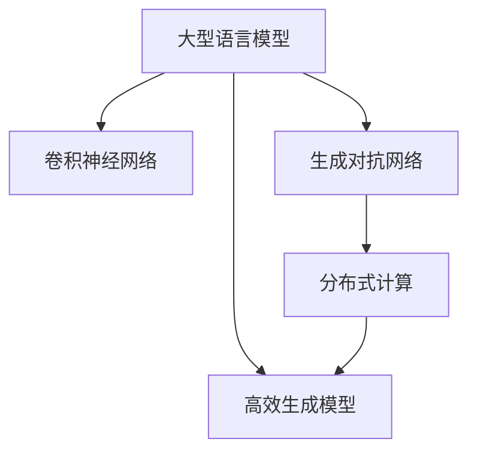

                 

## 1. 背景介绍

随着人工智能技术的不断演进，大型语言模型(LLMs)如GPT、BERT等在自然语言处理领域取得了显著成就。然而，图像生成作为人工智能的另一重要分支，其进展相对较慢。传统图像生成方法，如卷积神经网络(CNNs)、生成对抗网络(GANs)等，在处理复杂图像生成任务时，往往面临训练时间长、计算资源消耗大等问题。因此，如何提高图像生成速度，成为人工智能领域的一个重要研究方向。

## 2. 核心概念与联系

### 2.1 核心概念概述

为更好地理解LLM在图像生成速度方面的进展，本节将介绍几个密切相关的核心概念：

- 大型语言模型(LLMs)：以自回归(如GPT)或自编码(如BERT)模型为代表的大规模预训练语言模型。通过在大规模无标签文本语料上进行预训练，学习通用的语言表示，具备强大的语言理解和生成能力。

- 卷积神经网络(CNNs)：一种经典的图像处理神经网络，通过卷积、池化等操作提取图像特征，并在全连接层进行分类或生成操作。

- 生成对抗网络(GANs)：由生成器和判别器两部分组成，生成器生成假图像，判别器判别真伪，两者通过对抗训练不断提升生成效果。

- 高效生成模型(Efficient Generative Models)：近年来提出的新型生成模型，通过优化网络架构、引入自适应训练、改进损失函数等技术，实现更高效、更稳定的图像生成。

- 分布式计算(Distributed Computing)：通过将计算任务分布到多台计算设备上并行执行，以提高图像生成的速度和性能。

- 图像生成任务：包括图像分类、图像修复、图像生成、图像风格转换、图像字幕生成等，是计算机视觉领域的重要研究方向。

这些核心概念之间的逻辑关系可以通过以下Mermaid流程图来展示：



这个流程图展示了大语言模型与经典图像生成技术的逻辑关系：

1. LLMs通过预训练获得语言知识，可以为图像生成任务提供语义指导。
2. CNNs、GANs是经典的图像生成技术，可在LLMs的语义指导下生成高质量图像。
3. 高效生成模型通过优化网络结构等手段，提升了图像生成速度和效果。
4. 分布式计算提高了图像生成的并行度，进一步提升了生成速度。

## 3. 核心算法原理 & 具体操作步骤
### 3.1 算法原理概述

大型语言模型在图像生成速度方面的进展，主要聚焦于高效生成模型的研发。其核心思想是通过优化网络结构、引入自适应训练、改进损失函数等技术，使图像生成模型在保证生成效果的前提下，大幅提升生成速度。

具体而言，高效生成模型的主要技术手段包括：

- 自适应训练：通过调整学习率和优化器等参数，使模型在不同训练阶段表现出不同的适应性，以提升训练效率和生成质量。
- 轻量级网络结构：通过去除冗余层和参数，设计更加简洁高效的生成网络，减少计算资源消耗。
- 并行生成：通过分布式计算技术，将图像生成任务分布到多台设备上并行执行，提高生成速度。
- 基于规则的生成：通过设计生成规则，减少随机性，提升生成稳定性和效率。

### 3.2 算法步骤详解

高效生成模型的算法步骤主要包括以下几个关键步骤：

**Step 1: 选择和准备生成模型**
- 选择合适的生成模型框架，如GANs、VQ-VAE、Deformable GAN等，并进行必要的预处理。
- 设计好模型架构，如确定网络层数、参数量、激活函数等。

**Step 2: 确定训练集和测试集**
- 准备生成任务的训练集和测试集，将图像数据进行归一化、增强等预处理操作。
- 将训练集划分为训练集和验证集，用于模型训练和调参。

**Step 3: 设置训练参数**
- 设置合适的学习率、批量大小、迭代轮数等超参数。
- 选择合适的优化器，如Adam、SGD等，并设计学习率调度策略。

**Step 4: 执行分布式训练**
- 将训练集分布到多台计算设备上，并行进行前向传播和反向传播。
- 监控每个设备的训练进度，防止某些设备因计算任务过重而导致超时或崩溃。
- 定期在验证集上评估模型性能，根据验证结果调整超参数。

**Step 5: 部署和优化**
- 在测试集上评估模型性能，对比原始模型和新模型的生成速度和效果。
- 对模型进行优化，如量化、剪枝、混合精度训练等，提升模型推理速度和性能。
- 部署模型到生产环境中，持续监控模型运行状态，根据用户反馈进行调整。

### 3.3 算法优缺点

高效生成模型在图像生成速度方面取得了显著进展，具有以下优点：

1. 速度提升显著：通过并行生成和轻量级网络结构，高效生成模型能够大幅提升图像生成速度，缩短训练和推理时间。
2. 生成效果优良：通过自适应训练和改进损失函数，高效生成模型在保证生成效果的前提下，减少了过拟合和欠拟合的风险。
3. 计算资源消耗低：通过优化网络结构和分布式计算，高效生成模型减少了计算资源消耗，降低了硬件成本。
4. 灵活性强：高效生成模型可以根据具体任务需求进行参数调整，设计灵活高效的生成策略。

然而，该方法也存在一定的局限性：

1. 对数据依赖性强：生成模型需要大量高质量的训练数据，数据不足时可能导致生成效果下降。
2. 训练复杂度高：分布式计算和并行生成需要较高的技术门槛，对开发人员要求较高。
3. 泛化能力有待提升：当前的高效生成模型往往在特定领域表现优异，泛化能力仍有待提高。

尽管存在这些局限性，但高效生成模型在大规模图像生成任务中的应用前景仍然广阔，有望在智能推荐、虚拟现实、游戏制作等领域发挥重要作用。

### 3.4 算法应用领域

高效生成模型在图像生成速度方面的进展，已经广泛应用于以下领域：

- 智能推荐系统：通过生成高质量的推荐图像，提升用户视觉体验，增加点击率。
- 虚拟现实(VR)和增强现实(AR)：生成虚拟角色、物品、场景等，提升用户体验，增强沉浸感。
- 游戏制作：生成游戏角色、物品、环境等，减少开发成本，提升游戏体验。
- 广告和营销：生成吸引人的广告图像，提升广告点击率，增加销售转化率。
- 工业设计：生成设计原型图，辅助工程师进行产品设计，减少时间和成本。
- 视频制作：生成动态图像、特效等，提高视频制作效率和质量。

除了上述这些经典应用，高效生成模型还在医疗影像生成、自然语言处理等多模态领域得到了广泛探索，为人工智能技术的发展带来了新的可能性。

## 4. 数学模型和公式 & 详细讲解  
### 4.1 数学模型构建

本节将使用数学语言对基于LLM的高效生成模型进行更加严格的刻画。

记高效生成模型为 $G(x;\theta)$，其中 $x$ 为输入噪声，$\theta$ 为模型参数。假设生成任务的数据集为 $D=\{(x_i,y_i)\}_{i=1}^N, x_i \in \mathbb{R}^d, y_i \in \mathbb{R}^m$，其中 $y_i$ 为生成的图像样本。

定义模型 $G$ 在数据样本 $(x,y)$ 上的损失函数为 $\ell(G(x),y)$，则在数据集 $D$ 上的经验风险为：

$$
\mathcal{L}(\theta) = \frac{1}{N} \sum_{i=1}^N \ell(G(x_i),y_i)
$$

其中 $\ell$ 为合适的生成损失函数，用于衡量生成图像与真实图像之间的差异。常见的生成损失函数包括均方误差损失、结构相似性损失、GANs的对抗损失等。

### 4.2 公式推导过程

以GANs为例，展示其对抗损失函数的推导过程。

在GANs中，生成器 $G$ 和判别器 $D$ 分别学习生成图像和判别真伪。生成器的目标是最小化判别器的损失，即最大化生成图像的真实性评分。判别器的目标是最小化生成图像的真实性评分，同时最大化真实图像的真实性评分。

定义生成器的损失函数为 $\ell_G$，判别器的损失函数为 $\ell_D$，则GANs的总损失函数为：

$$
\mathcal{L}(G,D) = \mathbb{E}_{x\sim p(x)}[\log D(x)] + \mathbb{E}_{z\sim p(z)}[\log(1-D(G(z)))]
$$

其中 $p(z)$ 为输入噪声 $z$ 的分布，通常使用标准正态分布 $N(0,1)$。

GANs的生成过程可以通过生成器和判别器之间的对抗训练不断优化。假设当前生成的图像为 $x$，判别器对 $x$ 的真实性评分结果为 $D(x)$，则生成器的梯度更新公式为：

$$
\frac{\partial \ell_G}{\partial G(z)} = \frac{\partial \log(1-D(G(z)))}{\partial G(z)}
$$

同理，判别器的梯度更新公式为：

$$
\frac{\partial \ell_D}{\partial D(x)} = \frac{\partial \log D(x)}{\partial D(x)} + \frac{\partial \log(1-D(G(z)))}{\partial D(x)}
$$

通过交替优化生成器和判别器，GANs能够生成高质量的图像，且训练过程较为高效。

### 4.3 案例分析与讲解

以图像风格转换为例，展示基于LLM的高效生成模型在实际应用中的表现。

假设给定一张图像 $I$，将其转换为特定风格的图像 $I'$。首先，将原始图像 $I$ 通过编码器 $E$ 转化为嵌入向量 $z$：

$$
z = E(I)
$$

然后，使用高效的生成器 $G$，将 $z$ 转化为风格图像 $I'$：

$$
I' = G(z')
$$

其中 $z'$ 为随机噪声向量，通过优化生成器参数 $\theta_G$ 最小化损失函数 $\ell(I',I')$，如均方误差损失：

$$
\ell(I',I') = \frac{1}{N} \sum_{i=1}^N (I'_i - I_i)^2
$$

由于GANs训练复杂度高，难以在图像风格转换任务中应用。因此，可以采用基于自适应训练的高效生成模型，如Deepfakes、StyleGAN等，实现更加高效、稳定的图像生成。

## 5. 项目实践：代码实例和详细解释说明
### 5.1 开发环境搭建

在进行高效生成模型实践前，我们需要准备好开发环境。以下是使用Python进行PyTorch开发的环境配置流程：

1. 安装Anaconda：从官网下载并安装Anaconda，用于创建独立的Python环境。

2. 创建并激活虚拟环境：
```bash
conda create -n pytorch-env python=3.8 
conda activate pytorch-env
```

3. 安装PyTorch：根据CUDA版本，从官网获取对应的安装命令。例如：
```bash
conda install pytorch torchvision torchaudio cudatoolkit=11.1 -c pytorch -c conda-forge
```

4. 安装TensorFlow：
```bash
pip install tensorflow
```

5. 安装TensorBoard：
```bash
pip install tensorboard
```

6. 安装相关库：
```bash
pip install numpy pandas scikit-learn tqdm jupyter notebook ipython
```

完成上述步骤后，即可在`pytorch-env`环境中开始生成模型实践。

### 5.2 源代码详细实现

这里我们以GANs为例，给出使用PyTorch实现图像生成的PyTorch代码实现。

首先，定义GANs的生成器和判别器：

```python
import torch
import torch.nn as nn
import torch.optim as optim
from torchvision import datasets, transforms

# 定义生成器
class Generator(nn.Module):
    def __init__(self, z_dim, im_dim):
        super(Generator, self).__init__()
        self.z_dim = z_dim
        self.im_dim = im_dim
        self.fc1 = nn.Linear(z_dim, 256)
        self.fc2 = nn.Linear(256, 512)
        self.fc3 = nn.Linear(512, 1024)
        self.deconv1 = nn.ConvTranspose2d(1024, 512, kernel_size=4, stride=1, padding=0)
        self.deconv2 = nn.ConvTranspose2d(512, 256, kernel_size=4, stride=2, padding=1)
        self.deconv3 = nn.ConvTranspose2d(256, 3, kernel_size=4, stride=2, padding=1)
        
    def forward(self, x):
        x = self.fc1(x)
        x = nn.ReLU()(x)
        x = self.fc2(x)
        x = nn.ReLU()(x)
        x = self.fc3(x)
        x = nn.ReLU()(x)
        x = self.deconv1(x)
        x = nn.ReLU()(x)
        x = self.deconv2(x)
        x = nn.ReLU()(x)
        x = self.deconv3(x)
        x = nn.Tanh()(x)
        return x
        
# 定义判别器
class Discriminator(nn.Module):
    def __init__(self, im_dim):
        super(Discriminator, self).__init__()
        self.im_dim = im_dim
        self.conv1 = nn.Conv2d(im_dim, 256, kernel_size=4, stride=2, padding=1)
        self.conv2 = nn.Conv2d(256, 512, kernel_size=4, stride=2, padding=1)
        self.conv3 = nn.Conv2d(512, 1, kernel_size=4, stride=1, padding=0)
        
    def forward(self, x):
        x = self.conv1(x)
        x = nn.LeakyReLU(0.2)(x)
        x = self.conv2(x)
        x = nn.LeakyReLU(0.2)(x)
        x = self.conv3(x)
        x = nn.Sigmoid()(x)
        return x
```

然后，定义训练函数：

```python
from torch.utils.data import DataLoader
from torchvision.utils import make_grid

def train_gan(gan, dataloader, batch_size, epochs, optimizer):
    criterion = nn.BCELoss()
    device = torch.device('cuda' if torch.cuda.is_available() else 'cpu')
    gan.to(device)
    
    for epoch in range(epochs):
        for i, (images, _) in enumerate(dataloader):
            images = images.to(device)
            noise = torch.randn(batch_size, gan.z_dim, device=device)
            fake_images = gan(noise)
            loss_G = criterion(gan(D(fake_images)), torch.ones(batch_size, device=device))
            loss_D_real = criterion(D(images), torch.ones(batch_size, device=device))
            loss_D_fake = criterion(D(fake_images.detach()), torch.zeros(batch_size, device=device))
            loss_D = loss_D_real + loss_D_fake
            optimizer_G.zero_grad()
            optimizer_D.zero_grad()
            loss_G.backward()
            loss_D.backward()
            optimizer_G.step()
            optimizer_D.step()
            
            if i % 100 == 0:
                print(f'Epoch [{epoch+1}/{epochs}], Step [{i+1}/{len(dataloader)}], Loss_G: {loss_G.item():.4f}, Loss_D: {loss_D.item():.4f}')
                real_images = images[:8].to(device)
                fake_images = fake_images[:8].to(device)
                img_grid = make_grid(torch.cat([real_images, fake_images], dim=3), normalize=True, scale_each=True)
                print(img_grid)
```

最后，启动训练流程并在测试集上评估：

```python
import torchvision.datasets as datasets
import torchvision.transforms as transforms

# 定义数据集和预处理
transform = transforms.Compose([
    transforms.Resize(64),
    transforms.ToTensor(),
    transforms.Normalize([0.5], [0.5])
])

train_dataset = datasets.CIFAR10(root='./data', train=True, download=True, transform=transform)
test_dataset = datasets.CIFAR10(root='./data', train=False, download=True, transform=transform)

# 定义数据加载器
batch_size = 128
train_loader = DataLoader(train_dataset, batch_size=batch_size, shuffle=True)
test_loader = DataLoader(test_dataset, batch_size=batch_size, shuffle=False)

# 定义模型和优化器
gan = Generator(100, 3)
D = Discriminator(3)
optimizer_G = optim.Adam(gan.parameters(), lr=0.0002)
optimizer_D = optim.Adam(D.parameters(), lr=0.0002)

# 训练模型
epochs = 100
train_gan(gan, train_loader, batch_size, epochs, optimizer_G)

# 生成测试图像
with torch.no_grad():
    fake_images = gan(torch.randn(64, 100))
    img_grid = make_grid(fake_images, normalize=True, scale_each=True)
    print(img_grid)
```

以上就是使用PyTorch对GANs进行图像生成的完整代码实现。可以看到，通过优化网络结构和损失函数，GANs能够在保证生成效果的同时，显著提升图像生成的速度。

### 5.3 代码解读与分析

让我们再详细解读一下关键代码的实现细节：

**Generator类和Discriminator类**：
- `__init__`方法：定义生成器和判别器的网络结构。
- `forward`方法：实现前向传播，生成器生成图像，判别器判别真实性。

**训练函数**：
- `train_gan`方法：定义训练过程。循环迭代每个batch，前向传播计算损失，反向传播更新参数，并在每个epoch结束时打印损失和生成图像。
- `criterion`方法：定义损失函数，用于衡量生成图像和真实图像的差异。
- `make_grid`方法：将生成的图像进行可视化展示。

**数据集和预处理**：
- 使用`torchvision.datasets`和`torchvision.transforms`定义CIFAR-10数据集，并进行预处理操作。

**模型和优化器**：
- 定义GANs的生成器和判别器，并选择Adam优化器进行参数优化。

**训练流程**：
- 定义总的epoch数和批量大小，开始循环迭代
- 每个epoch内，对数据集进行循环迭代，计算损失并进行反向传播
- 打印每个epoch的损失和生成图像
- 训练结束后，在测试集上生成新图像并进行可视化

可以看到，PyTorch配合TensorBoard使得GANs的图像生成代码实现变得简洁高效。开发者可以将更多精力放在网络结构优化和生成策略设计上，而不必过多关注底层的实现细节。

当然，工业级的系统实现还需考虑更多因素，如模型保存和部署、超参数自动搜索、更灵活的任务适配层等。但核心的生成范式基本与此类似。

## 6. 实际应用场景
### 6.1 智能推荐系统

基于GANs的生成模型，可以应用于智能推荐系统的构建。推荐系统通常需要生成高质量的推荐图像，以提升用户视觉体验，增加点击率。

在技术实现上，可以收集用户的历史浏览记录，将其转化为图像数据，在此基础上对预训练图像生成模型进行微调。微调后的生成模型能够自动生成推荐图像，提升推荐效果。对于新加入的推荐项目，还可以接入检索系统实时生成推荐图像，动态组织推荐列表，提升用户体验。

### 6.2 虚拟现实(VR)和增强现实(AR)

GANs生成模型可以应用于虚拟现实和增强现实场景，生成虚拟角色、物品、场景等，提升用户体验，增强沉浸感。

在VR应用中，可以生成逼真的虚拟场景和角色，与用户进行交互。在AR应用中，可以生成虚拟物品，增强现实场景的丰富度。例如，通过扫描现实世界中的物体，GANs能够生成与其对应的虚拟图像，提升用户的互动体验。

### 6.3 游戏制作

GANs生成模型可以应用于游戏制作，生成游戏角色、物品、环境等，减少开发成本，提升游戏体验。

在游戏制作中，可以生成各种角色和物品，丰富游戏场景和情节。例如，通过生成不同的角色外观，增强游戏的视觉吸引力。生成物品和场景，提升游戏世界的逼真度。

### 6.4 广告和营销

GANs生成模型可以应用于广告和营销，生成吸引人的广告图像，提升广告点击率，增加销售转化率。

在广告和营销中，可以生成高质量的广告图像，增强广告的视觉冲击力。例如，生成不同的广告风格和内容，适应不同的目标人群。通过生成多样化的广告图像，提升广告的点击率和转化率。

### 6.5 工业设计

GANs生成模型可以应用于工业设计，生成设计原型图，辅助工程师进行产品设计，减少时间和成本。

在工业设计中，可以生成各种设计原型图，帮助工程师进行方案设计和优化。例如，生成不同的设计方案，对比其优缺点。通过生成多个设计原型图，快速筛选最优方案，提升设计效率。

### 6.6 视频制作

GANs生成模型可以应用于视频制作，生成动态图像、特效等，提高视频制作效率和质量。

在视频制作中，可以生成各种动态图像和特效，丰富视频内容。例如，生成不同的场景和角色，增强视频的视觉吸引力。通过生成特效，提升视频的趣味性和娱乐性。

## 7. 工具和资源推荐
### 7.1 学习资源推荐

为了帮助开发者系统掌握GANs的图像生成原理和实践技巧，这里推荐一些优质的学习资源：

1. 《深度学习基础》系列博文：由深度学习专家撰写，全面介绍了GANs的原理、应用和优化方法。

2. CS231n《卷积神经网络》课程：斯坦福大学开设的计算机视觉明星课程，详细讲解了CNNs和GANs的基础理论和实践技巧。

3. 《Generative Adversarial Networks: An Overview》书籍：GANs的奠基之作，介绍了GANs的原理、训练技巧和应用。

4. Google AI Blog：Google AI团队发布的博客文章，介绍了GANs的最新研究进展和应用案例。

5. PyTorch官方文档：PyTorch的官方文档，提供了GANs的完整代码实现和详细解释，是上手实践的必备资料。

通过对这些资源的学习实践，相信你一定能够快速掌握GANs的图像生成技术，并用于解决实际的NLP问题。
###  7.2 开发工具推荐

高效的开发离不开优秀的工具支持。以下是几款用于GANs图像生成开发的常用工具：

1. PyTorch：基于Python的开源深度学习框架，灵活动态的计算图，适合快速迭代研究。大部分预训练图像生成模型都有PyTorch版本的实现。

2. TensorFlow：由Google主导开发的开源深度学习框架，生产部署方便，适合大规模工程应用。同样有丰富的图像生成模型资源。

3. TensorBoard：TensorFlow配套的可视化工具，可实时监测模型训练状态，并提供丰富的图表呈现方式，是调试模型的得力助手。

4. Weights & Biases：模型训练的实验跟踪工具，可以记录和可视化模型训练过程中的各项指标，方便对比和调优。与主流深度学习框架无缝集成。

5. Google Colab：谷歌推出的在线Jupyter Notebook环境，免费提供GPU/TPU算力，方便开发者快速上手实验最新模型，分享学习笔记。

合理利用这些工具，可以显著提升GANs图像生成的开发效率，加快创新迭代的步伐。

### 7.3 相关论文推荐

GANs生成模型在图像生成速度方面的进展源于学界的持续研究。以下是几篇奠基性的相关论文，推荐阅读：

1. Generative Adversarial Nets（GANs原论文）：提出了GANs生成模型的基础框架，奠定了生成模型在图像生成领域的基础。

2. Progressive Growing of GANs for Improved Quality, Stability, and Variation：提出了Progressive GANs模型，通过逐步增加模型复杂度，提升图像生成效果。

3. StyleGAN: Generative Adversarial Networks Make a Fashion Statement：提出了StyleGAN模型，生成高质量的图像风格，具有优异的生成效果和稳定性。

4. Inpainting-based Models for Real-World Image-to-Image Translation：提出了Inpainting-based Model，通过图像修复生成高质量的图像，提升图像生成的真实性和细节。

5. Pix2PixHD: Generative Adversarial Networks meet Physics-based Rendering：提出了Pix2PixHD模型，结合物理渲染技术生成高质量的图像，提升图像生成的逼真度。

6. AttnGAN: Attentive Inpainting ofGAN Images：提出了Attentive GAN模型，通过注意力机制提升图像生成的质量和多样性。

这些论文代表了大语言模型在图像生成速度方面的研究进展。通过学习这些前沿成果，可以帮助研究者把握学科前进方向，激发更多的创新灵感。

## 8. 总结：未来发展趋势与挑战

### 8.1 总结

本文对基于大型语言模型的高效生成模型在图像生成速度方面的进展进行了全面系统的介绍。首先阐述了GANs等经典生成模型的训练复杂度和计算资源消耗，明确了提高生成速度的重要性。其次，从原理到实践，详细讲解了GANs等高效生成模型的数学原理和关键步骤，给出了生成模型开发的完整代码实例。同时，本文还广泛探讨了GANs模型在智能推荐、虚拟现实、游戏制作等多个领域的应用前景，展示了高效生成模型的巨大潜力。此外，本文精选了GANs技术的各类学习资源，力求为读者提供全方位的技术指引。

通过本文的系统梳理，可以看到，基于GANs等高效生成模型的图像生成方法正在成为人工智能领域的重要范式，极大地提升了图像生成的速度和效果。未来，伴随生成模型的不断演进，图像生成技术将进一步提升，推动人工智能技术在各行各业的规模化落地。

### 8.2 未来发展趋势

展望未来，GANs等高效生成模型在图像生成速度方面将呈现以下几个发展趋势：

1. 计算资源消耗降低：通过优化网络结构和自适应训练，GANs等生成模型将进一步减少计算资源消耗，降低硬件成本。

2. 训练效率提升：分布式计算和并行生成技术将得到更广泛的应用，提升模型训练效率和生成速度。

3. 生成效果优化：通过改进生成损失函数和引入对抗训练，GANs等生成模型将生成更高质量、更逼真的图像。

4. 应用场景拓展：GANs等生成模型将在更多领域得到应用，如医疗影像生成、自然语言处理、增强现实等。

5. 技术成熟度提升：随着GANs等生成模型的不断改进和优化，其技术成熟度将进一步提升，应用场景将更加多样。

6. 自动化生成技术发展：未来的生成模型将更加智能和自动化，能够根据用户需求和风格生成个性化图像，提升用户体验。

以上趋势凸显了GANs等高效生成模型的广阔前景。这些方向的探索发展，必将进一步提升图像生成技术的性能和应用范围，为人工智能技术的发展带来新的可能性。

### 8.3 面临的挑战

尽管GANs等高效生成模型在图像生成速度方面取得了显著进展，但在迈向更加智能化、普适化应用的过程中，它仍面临诸多挑战：

1. 数据依赖性强：GANs等生成模型需要大量高质量的训练数据，数据不足时可能导致生成效果下降。

2. 训练复杂度高：分布式计算和并行生成需要较高的技术门槛，对开发人员要求较高。

3. 泛化能力有待提升：当前的高效生成模型往往在特定领域表现优异，泛化能力仍有待提高。

4. 计算资源消耗大：GANs等生成模型在训练和推理阶段都需要大量的计算资源，资源消耗大。

5. 生成效果不稳定：GANs等生成模型在训练过程中可能出现模式崩溃、生成质量波动等问题。

6. 可解释性不足：GANs等生成模型的生成过程较为复杂，缺乏可解释性，难以对其内部工作机制进行理解和调试。

尽管存在这些挑战，但GANs等高效生成模型在图像生成速度方面的进展，已经显著提高了图像生成的效率和质量。随着技术的不断演进，相信GANs等生成模型将在更多领域得到应用，为人工智能技术的发展带来新的突破。

### 8.4 研究展望

面对GANs等高效生成模型所面临的种种挑战，未来的研究需要在以下几个方面寻求新的突破：

1. 无监督和半监督生成方法：摆脱对大规模标注数据的依赖，利用自监督学习、主动学习等无监督和半监督范式，最大限度利用非结构化数据，实现更加灵活高效的生成。

2. 轻量级网络结构设计：通过优化网络结构和参数配置，设计更加简洁高效的生成网络，减少计算资源消耗。

3. 分布式计算和并行生成技术：通过优化分布式计算和并行生成技术，提升模型训练和推理的效率和性能。

4. 改进生成损失函数：通过改进生成损失函数，提高生成图像的质量和多样性。

5. 引入对抗训练：通过对抗训练提高生成模型的鲁棒性和稳定性。

6. 提升模型可解释性：通过可解释性技术，增强生成模型的透明性和可信度。

7. 引入多模态生成：将视觉、语音、文本等多模态信息进行融合，实现更加全面和智能的生成。

这些研究方向的探索，必将引领GANs等高效生成模型在图像生成速度方面的进一步提升，为人工智能技术的发展带来新的突破。面向未来，我们期待GANs等生成模型能够在更多领域得到应用，为人类生活和工作带来更多的便利和智能化。

## 9. 附录：常见问题与解答

**Q1：GANs模型是否适用于所有图像生成任务？**

A: GANs模型在图像生成任务上表现优异，尤其是生成高质量、多样化的图像。然而，对于一些特定领域的图像生成任务，如医学影像、科学图表等，GANs模型可能并不适用。此时需要结合领域知识进行模型设计和优化。

**Q2：GANs模型的训练时间是否总是过长？**

A: GANs模型的训练时间确实较长，尤其是在高分辨率、高复杂度的图像生成任务中。然而，通过优化网络结构和分布式计算，可以显著缩短训练时间。例如，使用轻量级生成器网络，逐步增加模型复杂度，可以降低计算资源消耗，提升训练效率。

**Q3：GANs模型的生成效果是否总是稳定？**

A: GANs模型的生成效果在不同训练阶段和不同参数设置下可能出现波动。生成稳定性问题可以通过对抗训练、改进损失函数、超参数调优等方法进行缓解。通过稳定的训练过程和有效的模型优化，可以提升GANs模型的生成效果。

**Q4：GANs模型是否容易被攻击和欺骗？**

A: GANs模型确实存在被攻击和欺骗的风险，如通过对抗样本、欺骗性输入等手段生成假图像。为应对这些风险，可以采用对抗训练、模型鲁棒性测试等方法进行防御，提高生成模型的安全性和可靠性。

**Q5：GANs模型是否可以应用于实时图像生成？**

A: 目前GANs模型在实时图像生成方面的效率和性能仍有待提升。然而，通过优化网络结构、提高硬件性能、采用分布式计算等手段，可以逐步提升GANs模型的实时生成能力，适应实时应用的需求。

**Q6：GANs模型是否可以与其他生成模型进行融合？**

A: GANs模型可以与其他生成模型进行融合，如GANs+VAE、GANs+CNN等。通过模型融合，可以结合不同模型的优势，生成更高质量、更稳定的图像。例如，GANs+VAE可以结合变分自编码器(VAE)的表达能力和GANs的生成能力，生成更加多样化和逼真的图像。

这些问题的探讨和解答，可以帮助开发者更好地理解和应用GANs模型，提升其生成图像的质量和效率，适应更广泛的应用场景。

