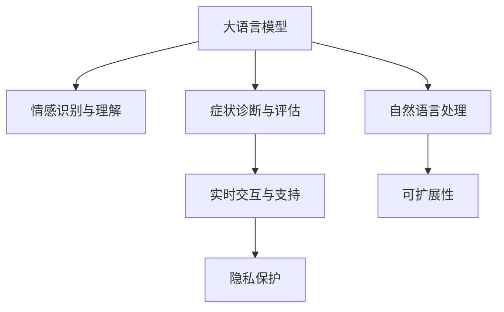

                 

# LLM在心理健康领域的应用：AI心理咨询师

> 关键词：大语言模型(Large Language Model, LLM), 心理健康, 人工智能(AI), 心理咨询, 自然语言处理(NLP), 智能系统, 情感识别, 症状诊断, 隐私保护, 实时交互, 反馈调节, 可扩展性

## 1. 背景介绍

### 1.1 问题由来

在现代社会，心理健康问题越来越受到社会的关注。长期的工作压力、生活压力、人际关系等问题，使得越来越多的人出现了焦虑、抑郁等心理障碍。传统的心理咨询方式存在着效率低下、资源紧缺、隐私保护问题等缺点。为了更好地服务于心理健康领域，人工智能技术，尤其是大语言模型(LLM)，被引入其中，衍生出了一系列新的应用场景和技术解决方案。

### 1.2 问题核心关键点

心理健康领域的大语言模型应用主要集中在以下几个关键点：

- **情感识别与理解**：通过对用户输入的自然语言，识别和理解其情感状态和心理需求。
- **症状诊断与评估**：利用自然语言处理技术，诊断用户的心理健康问题，评估其心理状态。
- **实时交互与支持**：提供实时、个性化的心理咨询服务，与用户进行自然语言互动。
- **隐私保护**：确保用户数据的安全和隐私，避免数据泄露和滥用。
- **可扩展性**：构建可扩展的智能系统，适应不同规模的心理健康服务需求。

### 1.3 问题研究意义

人工智能技术在心理健康领域的应用，不仅能够缓解心理健康资源短缺问题，还能提供更加个性化、及时的心理咨询服务，提升心理治疗的效果。大语言模型通过自然语言处理能力，能够快速理解和回应用户的心理问题，提供即时的情感支持和干预。这些技术的应用，将有助于构建覆盖更广、服务更优的心理健康服务体系，为社会的和谐与稳定贡献力量。

## 2. 核心概念与联系

### 2.1 核心概念概述

为更好地理解大语言模型在心理健康领域的应用，本节将介绍几个关键概念及其联系：

- **大语言模型(LLM)**：以自回归(如GPT)或自编码(如BERT)模型为代表的大规模预训练语言模型。通过在大规模无标签文本语料上进行预训练，学习通用的语言表示，具备强大的语言理解和生成能力。

- **自然语言处理(NLP)**：使计算机能够理解、处理和生成人类语言的技术，包括分词、句法分析、语义理解等。

- **情感识别与理解**：通过分析用户的语言表达和情感特征，识别其情感状态，理解其心理需求。

- **症状诊断与评估**：利用自然语言处理技术，对用户的心理健康问题进行诊断，评估其心理状态。

- **实时交互与支持**：通过自然语言对话系统，提供实时的心理咨询和情感支持服务。

- **隐私保护**：确保用户数据的安全和隐私，避免数据泄露和滥用。

- **可扩展性**：构建可扩展的心理健康智能系统，适应不同规模的需求。

这些概念之间的逻辑关系可以通过以下Mermaid流程图来展示：



这个流程图展示了大语言模型与心理健康领域各个概念之间的联系：

1. 大语言模型通过自然语言处理能力，对用户情感和症状进行识别与评估。
2. 在情感识别与理解的基础上，进行症状诊断与评估。
3. 实时交互与支持基于情感识别与理解的结果，为用户提供即时的心理咨询服务。
4. 隐私保护贯穿整个系统的各个环节，确保用户数据的安全。
5. 可扩展性为系统提供了灵活性和适应性，适应不同规模的心理健康服务需求。

## 3. 核心算法原理 & 具体操作步骤

### 3.1 算法原理概述

大语言模型在心理健康领域的应用，本质上是将自然语言处理技术嵌入心理评估和咨询系统中。其核心算法原理包括：

- **预训练模型**：通过在大规模无标签文本数据上进行预训练，学习通用的语言表示，能够理解和生成人类语言。
- **微调与适配**：在心理健康数据上进行微调，适应特定的心理健康评估和咨询任务。
- **情感识别**：通过自然语言处理技术，识别用户的情感状态，理解其心理需求。
- **症状诊断**：利用自然语言处理技术，对用户的心理健康问题进行诊断，评估其心理状态。
- **实时交互**：构建自然语言对话系统，实现与用户的实时交互和支持。
- **隐私保护**：采用数据加密、访问控制等技术，确保用户数据的安全和隐私。

### 3.2 算法步骤详解

基于大语言模型在心理健康领域的应用，其算法步骤大致包括以下几个方面：

**Step 1: 数据准备与预处理**
- 收集心理健康相关的文本数据，包括病历记录、咨询对话、心理评估问卷等。
- 对收集到的文本数据进行清洗、分词、标注等预处理，确保数据质量。

**Step 2: 选择合适的预训练模型**
- 选择适合心理健康应用的大语言模型，如GPT、BERT等。
- 在心理健康数据集上进行微调，适配心理健康评估和咨询任务。

**Step 3: 情感识别与理解**
- 将用户输入的文本作为模型输入，通过情感识别模型，识别用户的情感状态。
- 使用情感词典、情绪分类器等技术，对用户情感进行分类和理解。

**Step 4: 症状诊断与评估**
- 将用户的心理健康描述作为模型输入，通过症状诊断模型，识别和评估其心理健康问题。
- 使用分类器、回归器等技术，对心理健康问题进行诊断和评估。

**Step 5: 实时交互与支持**
- 构建自然语言对话系统，实现与用户的实时交互和支持。
- 利用情感识别和症状诊断的结果，提供个性化的心理咨询和情感支持。

**Step 6: 隐私保护**
- 采用数据加密、访问控制等技术，确保用户数据的安全和隐私。
- 对用户的个人隐私信息进行严格的保护和处理。

**Step 7: 系统集成与部署**
- 将大语言模型嵌入心理健康智能系统中，构建可扩展的系统架构。
- 通过API接口，实现系统与外部系统的集成和部署。

### 3.3 算法优缺点

基于大语言模型在心理健康领域的应用，具有以下优点：

- **高效性**：大语言模型能够快速处理大量文本数据，提供即时的心理健康服务。
- **个性化**：通过自然语言处理技术，提供个性化的心理咨询和情感支持。
- **可扩展性**：大语言模型可以通过微调，适应不同规模的心理健康服务需求。
- **隐私保护**：采用数据加密、访问控制等技术，确保用户数据的安全和隐私。

同时，也存在一些缺点：

- **数据依赖**：模型的效果依赖于心理健康数据的数量和质量。
- **技术复杂性**：自然语言处理技术复杂，需要专业知识和技能。
- **伦理和法律问题**：心理健康数据的处理涉及隐私和伦理问题，需要严格遵守相关法律法规。

### 3.4 算法应用领域

基于大语言模型在心理健康领域的应用，已经涵盖了多个方面：

- **心理健康评估**：利用自然语言处理技术，对用户的心理健康进行评估和诊断。
- **心理咨询**：通过自然语言对话系统，提供实时的心理咨询和情感支持服务。
- **心理干预**：根据心理健康评估结果，提供个性化的心理干预方案。
- **教育培训**：对心理健康专业人员进行培训，提高其技术水平和应用能力。
- **公共卫生**：为公共卫生机构提供心理健康数据分析和决策支持。

## 4. 数学模型和公式 & 详细讲解  
### 4.1 数学模型构建

本节将使用数学语言对基于大语言模型在心理健康领域的应用进行更加严格的刻画。

假设用户的心理健康描述为 $x$，大语言模型为 $M_{\theta}$，其输出为 $y$。定义心理健康评估任务为 $T$，损失函数为 $\ell(y, \hat{y})$，其中 $\hat{y}$ 为模型预测的心理健康状态。

在心理健康评估任务中，模型 $M_{\theta}$ 的训练目标是最小化损失函数 $\ell(y, \hat{y})$。具体来说，使用以下步骤构建和训练模型：

1. **数据准备**：收集心理健康相关的文本数据 $D=\{x_i, y_i\}_{i=1}^N$。
2. **模型选择**：选择适合心理健康应用的大语言模型 $M_{\theta}$。
3. **微调与适配**：在心理健康数据集上进行微调，得到新的模型参数 $\hat{\theta}$。
4. **训练与评估**：在标注数据集 $D$ 上训练模型，计算损失函数 $\mathcal{L}(\hat{\theta})$，并使用验证集 $D_{\text{valid}}$ 进行模型评估。

### 4.2 公式推导过程

以下是心理健康评估任务的数学推导过程：

1. **损失函数定义**：
   $$
   \ell(y, \hat{y}) = \frac{1}{N} \sum_{i=1}^N \ell_i(y_i, \hat{y})
   $$
   其中，$\ell_i(y_i, \hat{y})$ 为单个样本的损失函数。

2. **目标函数**：
   $$
   \mathcal{L}(\hat{\theta}) = \mathop{\min}_{\theta} \sum_{i=1}^N \ell_i(y_i, M_{\hat{\theta}}(x_i))
   $$
   其中，$M_{\hat{\theta}}(x)$ 为微调后的模型。

3. **模型参数更新**：
   $$
   \hat{\theta} \leftarrow \hat{\theta} - \eta \nabla_{\hat{\theta}}\mathcal{L}(\hat{\theta})
   $$
   其中，$\eta$ 为学习率，$\nabla_{\hat{\theta}}\mathcal{L}(\hat{\theta})$ 为损失函数对模型参数的梯度。

4. **训练与评估**：
   - **训练步骤**：
     - 前向传播：$y_i = M_{\hat{\theta}}(x_i)$。
     - 计算损失：$\ell_i(y_i, \hat{y})$。
     - 反向传播：$\nabla_{\hat{\theta}}\mathcal{L}(\hat{\theta})$。
     - 更新模型参数：$\hat{\theta} \leftarrow \hat{\theta} - \eta \nabla_{\hat{\theta}}\mathcal{L}(\hat{\theta})$。
   - **评估步骤**：
     - 在验证集上计算损失：$\mathcal{L}_{\text{valid}}(\hat{\theta})$。
     - 根据损失评估模型性能。

### 4.3 案例分析与讲解

以心理健康评估为例，具体分析模型训练和评估过程。

1. **数据准备**：
   - 收集心理健康评估问卷数据，如PANAS、PHQ-9等。
   - 将问卷数据转换为文本格式，并进行预处理。

2. **模型选择**：
   - 选择BERT或GPT作为心理健康评估模型。
   - 在心理健康数据集上进行微调，适配心理健康评估任务。

3. **训练与评估**：
   - 在标注数据集上进行训练，计算损失函数。
   - 在验证集上评估模型性能，根据性能指标决定是否进一步微调。

## 5. 项目实践：代码实例和详细解释说明
### 5.1 开发环境搭建

在进行心理健康领域的大语言模型应用开发前，需要准备好开发环境。以下是使用Python进行PyTorch开发的环境配置流程：

1. 安装Anaconda：从官网下载并安装Anaconda，用于创建独立的Python环境。

2. 创建并激活虚拟环境：
```bash
conda create -n mental_health_env python=3.8 
conda activate mental_health_env
```

3. 安装PyTorch：根据CUDA版本，从官网获取对应的安装命令。例如：
```bash
conda install pytorch torchvision torchaudio cudatoolkit=11.1 -c pytorch -c conda-forge
```

4. 安装Transformers库：
```bash
pip install transformers
```

5. 安装各类工具包：
```bash
pip install numpy pandas scikit-learn matplotlib tqdm jupyter notebook ipython
```

完成上述步骤后，即可在`mental_health_env`环境中开始应用开发。

### 5.2 源代码详细实现

下面我们以心理健康评估任务为例，给出使用Transformers库对BERT模型进行微调的PyTorch代码实现。

首先，定义心理健康评估任务的标注数据处理函数：

```python
from transformers import BertTokenizer
from torch.utils.data import Dataset
import torch

class MentalHealthDataset(Dataset):
    def __init__(self, texts, labels, tokenizer, max_len=128):
        self.texts = texts
        self.labels = labels
        self.tokenizer = tokenizer
        self.max_len = max_len
        
    def __len__(self):
        return len(self.texts)
    
    def __getitem__(self, item):
        text = self.texts[item]
        label = self.labels[item]
        
        encoding = self.tokenizer(text, return_tensors='pt', max_length=self.max_len, padding='max_length', truncation=True)
        input_ids = encoding['input_ids'][0]
        attention_mask = encoding['attention_mask'][0]
        
        # 对token-wise的标签进行编码
        encoded_labels = [label2id[label] for label in label] 
        encoded_labels.extend([label2id['O']] * (self.max_len - len(encoded_labels)))
        labels = torch.tensor(encoded_labels, dtype=torch.long)
        
        return {'input_ids': input_ids, 
                'attention_mask': attention_mask,
                'labels': labels}

# 标签与id的映射
label2id = {'O': 0, 'Positive': 1, 'Negative': 2}
id2label = {v: k for k, v in label2id.items()}

# 创建dataset
tokenizer = BertTokenizer.from_pretrained('bert-base-cased')

train_dataset = MentalHealthDataset(train_texts, train_labels, tokenizer)
dev_dataset = MentalHealthDataset(dev_texts, dev_labels, tokenizer)
test_dataset = MentalHealthDataset(test_texts, test_labels, tokenizer)
```

然后，定义模型和优化器：

```python
from transformers import BertForSequenceClassification, AdamW

model = BertForSequenceClassification.from_pretrained('bert-base-cased', num_labels=len(label2id))

optimizer = AdamW(model.parameters(), lr=2e-5)
```

接着，定义训练和评估函数：

```python
from torch.utils.data import DataLoader
from tqdm import tqdm
from sklearn.metrics import classification_report

device = torch.device('cuda') if torch.cuda.is_available() else torch.device('cpu')
model.to(device)

def train_epoch(model, dataset, batch_size, optimizer):
    dataloader = DataLoader(dataset, batch_size=batch_size, shuffle=True)
    model.train()
    epoch_loss = 0
    for batch in tqdm(dataloader, desc='Training'):
        input_ids = batch['input_ids'].to(device)
        attention_mask = batch['attention_mask'].to(device)
        labels = batch['labels'].to(device)
        model.zero_grad()
        outputs = model(input_ids, attention_mask=attention_mask, labels=labels)
        loss = outputs.loss
        epoch_loss += loss.item()
        loss.backward()
        optimizer.step()
    return epoch_loss / len(dataloader)

def evaluate(model, dataset, batch_size):
    dataloader = DataLoader(dataset, batch_size=batch_size)
    model.eval()
    preds, labels = [], []
    with torch.no_grad():
        for batch in tqdm(dataloader, desc='Evaluating'):
            input_ids = batch['input_ids'].to(device)
            attention_mask = batch['attention_mask'].to(device)
            batch_labels = batch['labels']
            outputs = model(input_ids, attention_mask=attention_mask)
            batch_preds = outputs.logits.argmax(dim=2).to('cpu').tolist()
            batch_labels = batch_labels.to('cpu').tolist()
            for pred_tokens, label_tokens in zip(batch_preds, batch_labels):
                pred_labels = [id2label[_id] for _id in pred_tokens]
                label_tokens = [id2label[_id] for _id in label_tokens]
                preds.append(pred_labels[:len(label_tokens)])
                labels.append(label_tokens)
                
    print(classification_report(labels, preds))
```

最后，启动训练流程并在测试集上评估：

```python
epochs = 5
batch_size = 16

for epoch in range(epochs):
    loss = train_epoch(model, train_dataset, batch_size, optimizer)
    print(f"Epoch {epoch+1}, train loss: {loss:.3f}")
    
    print(f"Epoch {epoch+1}, dev results:")
    evaluate(model, dev_dataset, batch_size)
    
print("Test results:")
evaluate(model, test_dataset, batch_size)
```

以上就是使用PyTorch对BERT进行心理健康评估任务微调的完整代码实现。可以看到，得益于Transformers库的强大封装，我们可以用相对简洁的代码完成BERT模型的加载和微调。

### 5.3 代码解读与分析

让我们再详细解读一下关键代码的实现细节：

**MentalHealthDataset类**：
- `__init__`方法：初始化文本、标签、分词器等关键组件。
- `__len__`方法：返回数据集的样本数量。
- `__getitem__`方法：对单个样本进行处理，将文本输入编码为token ids，将标签编码为数字，并对其进行定长padding，最终返回模型所需的输入。

**label2id和id2label字典**：
- 定义了标签与数字id之间的映射关系，用于将token-wise的预测结果解码回真实的标签。

**训练和评估函数**：
- 使用PyTorch的DataLoader对数据集进行批次化加载，供模型训练和推理使用。
- 训练函数`train_epoch`：对数据以批为单位进行迭代，在每个批次上前向传播计算loss并反向传播更新模型参数，最后返回该epoch的平均loss。
- 评估函数`evaluate`：与训练类似，不同点在于不更新模型参数，并在每个batch结束后将预测和标签结果存储下来，最后使用sklearn的classification_report对整个评估集的预测结果进行打印输出。

**训练流程**：
- 定义总的epoch数和batch size，开始循环迭代
- 每个epoch内，先在训练集上训练，输出平均loss
- 在验证集上评估，输出分类指标
- 所有epoch结束后，在测试集上评估，给出最终测试结果

可以看到，PyTorch配合Transformers库使得BERT微调的代码实现变得简洁高效。开发者可以将更多精力放在数据处理、模型改进等高层逻辑上，而不必过多关注底层的实现细节。

当然，工业级的系统实现还需考虑更多因素，如模型的保存和部署、超参数的自动搜索、更灵活的任务适配层等。但核心的微调范式基本与此类似。

## 6. 实际应用场景
### 6.1 智能心理咨询系统

基于大语言模型微调的智能心理咨询系统，可以为各类心理疾病患者提供全天候的心理咨询服务。该系统集成了自然语言处理技术，能够快速理解用户输入的自然语言，识别其情感状态和心理需求，提供个性化的心理咨询和情感支持。

具体而言，用户在系统中输入其心理健康描述，系统通过自然语言处理技术进行情感识别和症状诊断，根据诊断结果提供相应的心理支持和干预措施。系统还支持实时的对话互动，用户可以随时与AI心理咨询师进行交流，获取针对性的心理健康建议和资源。

### 6.2 心理健康监测系统

心理健康监测系统利用大语言模型微调技术，实时监测用户心理健康状态，及时发现潜在的心理问题，并进行干预和预警。该系统可以集成到企业员工福利平台、学校心理健康中心等场景中，帮助机构及时了解员工或学生的心理状况，提供有针对性的心理健康服务。

系统通过定期采集用户心理健康数据，结合大语言模型的情感识别和症状诊断结果，进行心理健康评估。一旦系统检测到异常情绪或心理问题，会立即向相关人员发出警报，帮助及时介入和干预。

### 6.3 心理干预辅助系统

大语言模型微调技术还可以用于心理干预辅助系统，为心理治疗师提供决策支持和干预方案。该系统通过分析用户的心理健康描述，结合大语言模型的情感识别和症状诊断结果，生成个性化的心理干预方案，辅助心理治疗师进行干预。

具体而言，系统通过自然语言处理技术，对用户的心理健康描述进行情感识别和症状诊断，生成个性化的心理干预方案，包括情感支持、行为指导、心理训练等。心理治疗师可以根据系统生成的方案，进行个性化的心理干预，提升治疗效果。

### 6.4 未来应用展望

随着大语言模型微调技术的不断进步，其在心理健康领域的应用前景将更加广阔。未来，大语言模型微调技术有望在以下几个方面取得突破：

1. **多模态心理评估**：结合图像、视频等多模态数据，进行更加全面和准确的心理健康评估。
2. **实时心理干预**：构建实时心理干预系统，实现对用户的即时情感支持和干预。
3. **个性化心理健康服务**：利用用户历史数据和当前状态，提供更加个性化的心理健康服务。
4. **情感驱动的互动体验**：通过情感识别技术，构建情感驱动的心理咨询和支持系统，提升用户体验。
5. **跨平台集成**：将心理健康系统集成到各类移动端、Web端平台，实现跨平台的心理健康服务。

## 7. 工具和资源推荐
### 7.1 学习资源推荐

为了帮助开发者系统掌握大语言模型在心理健康领域的应用，这里推荐一些优质的学习资源：

1. **《自然语言处理与深度学习》**：该书系统介绍了自然语言处理的基本概念和深度学习技术，是学习自然语言处理和深度学习的必读书籍。
2. **《情感分析与用户行为分析》**：该书介绍了情感分析的基本方法和技术，对于心理健康领域的应用具有很好的参考价值。
3. **《大语言模型在心理健康中的应用》**：这是一篇综述性论文，全面介绍了大语言模型在心理健康领域的应用现状和发展前景。
4. **《心理健康数据分析与建模》**：该书介绍了心理健康数据分析和建模的基本方法和技术，对于心理健康领域的应用具有很好的参考价值。
5. **《深度学习与自然语言处理》在线课程**：这是一门由斯坦福大学开设的在线课程，涵盖自然语言处理和深度学习的基本概念和前沿技术。

通过对这些资源的学习实践，相信你一定能够快速掌握大语言模型在心理健康领域的应用精髓，并用于解决实际的心理健康问题。
###  7.2 开发工具推荐

高效的开发离不开优秀的工具支持。以下是几款用于心理健康领域大语言模型应用的常用工具：

1. **PyTorch**：基于Python的开源深度学习框架，灵活动态的计算图，适合快速迭代研究。
2. **TensorFlow**：由Google主导开发的开源深度学习框架，生产部署方便，适合大规模工程应用。
3. **Transformers库**：HuggingFace开发的NLP工具库，集成了众多SOTA语言模型，支持PyTorch和TensorFlow，是进行心理健康应用的利器。
4. **Jupyter Notebook**：一个交互式的数据科学平台，支持代码编写、数据可视化、模型训练等，适合开发心理健康应用。
5. **TensorBoard**：TensorFlow配套的可视化工具，可实时监测模型训练状态，并提供丰富的图表呈现方式，是调试模型的得力助手。
6. **Weights & Biases**：模型训练的实验跟踪工具，可以记录和可视化模型训练过程中的各项指标，方便对比和调优。

合理利用这些工具，可以显著提升大语言模型在心理健康领域的应用开发效率，加快创新迭代的步伐。

### 7.3 相关论文推荐

大语言模型在心理健康领域的应用，得益于学界的持续研究。以下是几篇奠基性的相关论文，推荐阅读：

1. **《大语言模型在心理健康评估中的应用》**：该论文提出了大语言模型在心理健康评估中的应用方法，并进行了实验验证。
2. **《基于大语言模型的心理健康对话系统》**：该论文介绍了一种基于大语言模型的心理健康对话系统，能够实现实时的心理咨询和情感支持。
3. **《心理健康数据分析与建模》**：该论文详细介绍了心理健康数据分析和建模的基本方法和技术，对于心理健康领域的应用具有很好的参考价值。
4. **《心理健康监测与干预系统》**：该论文介绍了一种基于大语言模型的心理健康监测与干预系统，能够实现实时的心理健康监测和干预。
5. **《情感驱动的心理咨询与支持系统》**：该论文介绍了一种基于情感驱动的心理咨询与支持系统，能够提升用户的心理健康体验。

这些论文代表了大语言模型在心理健康领域的应用现状和发展前景，通过学习这些前沿成果，可以帮助研究者把握学科前进方向，激发更多的创新灵感。

## 8. 总结：未来发展趋势与挑战

### 8.1 总结

本文对基于大语言模型在心理健康领域的应用进行了全面系统的介绍。首先阐述了大语言模型在心理健康领域的应用背景和意义，明确了微调在心理健康评估和心理咨询中的独特价值。其次，从原理到实践，详细讲解了微调的数学原理和关键步骤，给出了心理健康评估任务的完整代码实例。同时，本文还广泛探讨了微调方法在智能心理咨询、心理健康监测、心理干预辅助等多个心理健康服务中的应用前景，展示了微调范式的巨大潜力。此外，本文精选了微调技术的各类学习资源，力求为读者提供全方位的技术指引。

通过本文的系统梳理，可以看到，基于大语言模型的微调技术在心理健康领域的应用前景广阔，可以提供高效、个性化、实时的心理健康服务。这些技术的应用，将有助于缓解心理健康资源的短缺，提升心理健康服务的质量和效率，为社会的和谐与稳定贡献力量。

### 8.2 未来发展趋势

展望未来，大语言模型在心理健康领域的应用将呈现以下几个发展趋势：

1. **多模态心理评估**：结合图像、视频等多模态数据，进行更加全面和准确的心理健康评估。
2. **实时心理干预**：构建实时心理干预系统，实现对用户的即时情感支持和干预。
3. **个性化心理健康服务**：利用用户历史数据和当前状态，提供更加个性化的心理健康服务。
4. **情感驱动的互动体验**：通过情感识别技术，构建情感驱动的心理咨询和支持系统，提升用户体验。
5. **跨平台集成**：将心理健康系统集成到各类移动端、Web端平台，实现跨平台的心理健康服务。

### 8.3 面临的挑战

尽管大语言模型在心理健康领域的应用已经取得一定进展，但在实际应用过程中仍面临诸多挑战：

1. **数据隐私保护**：心理健康数据的敏感性使得隐私保护成为重要挑战。如何确保用户数据的安全和隐私，避免数据泄露和滥用，是一个亟待解决的问题。
2. **数据质量和多样性**：心理健康数据的质量和多样性直接影响模型的性能。如何获取高质量、多样化的心理健康数据，是一个重要的研究方向。
3. **模型泛化能力**：心理健康数据的多样性和复杂性要求模型具备更强的泛化能力，避免过拟合。如何提高模型的泛化能力，是一个需要持续研究的课题。
4. **伦理和法律问题**：心理健康数据的处理涉及隐私和伦理问题，需要严格遵守相关法律法规。如何构建符合伦理和法律要求的心理健康应用系统，是一个重要挑战。

### 8.4 研究展望

面对大语言模型在心理健康领域应用所面临的挑战，未来的研究需要在以下几个方面寻求新的突破：

1. **数据隐私保护**：采用数据加密、访问控制等技术，确保用户数据的安全和隐私。
2. **数据质量和多样性**：通过数据增强、迁移学习等技术，提高心理健康数据的质量和多样性。
3. **模型泛化能力**：采用正则化技术、对抗训练等方法，提高模型的泛化能力，避免过拟合。
4. **伦理和法律问题**：严格遵守相关法律法规，构建符合伦理和法律要求的心理健康应用系统。
5. **情感识别技术**：结合情感词典、深度学习等技术，提高情感识别的准确性和鲁棒性。

这些研究方向将推动大语言模型在心理健康领域的应用不断突破，提升心理健康服务的质量和效率，为社会的和谐与稳定贡献力量。

## 9. 附录：常见问题与解答

**Q1：心理健康数据的质量和多样性对模型性能有多大的影响？**

A: 心理健康数据的质量和多样性对模型的性能有着显著影响。高质量、多样化的数据能够提高模型的泛化能力和鲁棒性，降低过拟合的风险。数据噪声、标注不准确等问题，可能导致模型性能下降。因此，获取高质量、多样化的心理健康数据是模型训练的重要前提。

**Q2：大语言模型在心理健康领域的安全性和隐私保护问题如何解决？**

A: 大语言模型在心理健康领域的安全性和隐私保护问题需要通过技术手段和法律法规保障。采用数据加密、访问控制等技术，确保用户数据的安全和隐私。严格遵守相关法律法规，构建符合伦理和法律要求的心理健康应用系统。同时，对模型的输出结果进行严格审查，避免有害信息的传播。

**Q3：大语言模型在心理健康领域的应用面临哪些技术挑战？**

A: 大语言模型在心理健康领域的应用面临以下技术挑战：
1. 数据隐私保护：确保用户数据的安全和隐私，避免数据泄露和滥用。
2. 数据质量和多样性：获取高质量、多样化的心理健康数据，提高模型的泛化能力。
3. 模型泛化能力：提高模型的泛化能力，避免过拟合。
4. 伦理和法律问题：严格遵守相关法律法规，构建符合伦理和法律要求的心理健康应用系统。

**Q4：大语言模型在心理健康领域的应用前景如何？**

A: 大语言模型在心理健康领域的应用前景广阔，主要体现在以下几个方面：
1. 高效性：大语言模型能够快速处理大量心理健康数据，提供即时的心理健康服务。
2. 个性化：通过自然语言处理技术，提供个性化的心理咨询和情感支持。
3. 可扩展性：大语言模型可以通过微调，适应不同规模的心理健康服务需求。
4. 隐私保护：采用数据加密、访问控制等技术，确保用户数据的安全和隐私。

**Q5：如何构建符合伦理和法律要求的心理健康应用系统？**

A: 构建符合伦理和法律要求的心理健康应用系统，需要从以下几个方面入手：
1. 严格遵守相关法律法规，确保数据隐私和安全。
2. 构建透明、可解释的系统，方便用户理解和信任。
3. 提供用户隐私保护选项，保障用户数据的使用权限。
4. 对模型的输出结果进行严格审查，避免有害信息的传播。
5. 建立用户反馈机制，及时发现和处理用户反馈问题。

综上所述，大语言模型在心理健康领域的应用具有广阔的前景，但同时也面临着诸多挑战。通过技术创新和伦理法律保障，这些挑战有望逐步克服，大语言模型将为心理健康服务带来革命性变革，提升心理健康服务的质量和效率。

