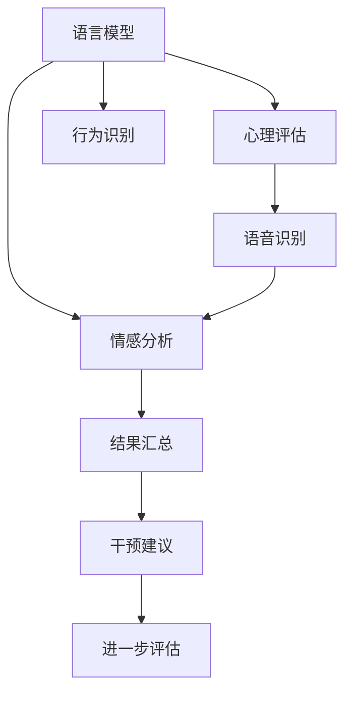
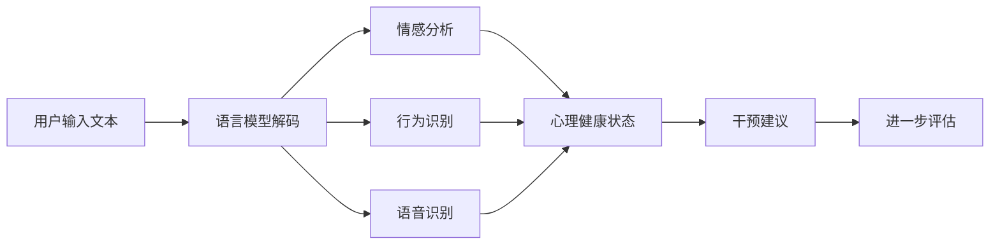

                 

# LLM在心理分析中的应用：AI辅助心理评估

> 关键词：语言模型,心理分析,心理评估,人工智能,自然语言处理(NLP),机器学习,大数据,心理健康,辅助诊断,情感分析,语音识别

## 1. 背景介绍

### 1.1 问题由来
随着人工智能技术的迅速发展，大语言模型（LLM）在多个领域展现出了其独特的优势。其中，在心理分析领域，LLM尤其是基于Transformer架构的模型，由于其卓越的语言理解和生成能力，已经开始被广泛应用于辅助心理评估、情感分析、行为识别等。本文旨在探讨LLM在心理分析中的应用，以及如何利用AI技术对心理评估进行辅助和优化。

### 1.2 问题核心关键点
LLM在心理分析中的核心应用主要集中在以下几个方面：
- 心理评估：利用LLM对用户输入的自然语言文本进行分析，判断其心理健康状况，并提供针对性的评估结果。
- 情感分析：通过分析用户的语言表达，判断其情感状态，识别潜在的心理健康问题。
- 行为识别：通过对用户的行为模式进行分析，预测其行为变化趋势，识别心理问题的早期迹象。
- 语音识别：利用语音识别技术结合LLM，分析用户的语音特征，辅助心理评估。

### 1.3 问题研究意义
LLM在心理分析中的应用，不仅能够提高心理健康评估的效率和准确性，还能够为心理疾病的早期发现和及时干预提供重要支持。特别是在心理健康资源相对匮乏的地区，利用AI技术进行心理评估，能够显著提升心理健康服务水平。此外，通过大规模数据分析，还可以为心理健康政策制定和公共卫生管理提供依据。

## 2. 核心概念与联系

### 2.1 核心概念概述

在进行心理分析时，LLM需要与多个相关概念和技术进行互动。以下是对这些核心概念的概述：

- **语言模型**：基于神经网络的模型，能够学习并生成自然语言文本。常见的模型包括GPT、BERT、T5等。
- **心理评估**：通过一系列标准化的问卷、访谈等方式，评估个体的心理健康状况，包括抑郁、焦虑、压力等。
- **情感分析**：通过对文本中的情感词汇、情感强度等进行分析，判断文本的情感倾向。
- **行为识别**：通过分析用户在社交媒体、手机应用等平台上的行为数据，识别其行为模式和趋势。
- **语音识别**：将用户的语音转换成文本，结合LLM进行心理评估。

这些概念之间的逻辑关系可以通过以下Mermaid流程图来展示：



### 2.2 核心概念原理和架构的 Mermaid 流程图

下面将使用Mermaid绘制一幅流程图，以直观展示LLM在心理分析中的应用流程：



## 3. 核心算法原理 & 具体操作步骤

### 3.1 算法原理概述

基于LLM的心理分析过程主要包括以下几个步骤：

1. **文本输入**：用户输入自然语言文本，例如日记、社交媒体帖子、语音记录等。
2. **语言模型解码**：利用LLM对输入文本进行解码，生成文本表示。
3. **情感分析**：通过情感分析模型对文本进行情感倾向判断，识别用户情绪。
4. **行为识别**：结合用户行为数据，识别异常行为模式，预测潜在风险。
5. **语音识别**：将用户的语音转换为文本，进行心理健康评估。
6. **结果汇总与干预建议**：将上述分析结果汇总，生成心理健康评估报告，并根据评估结果提出干预建议。
7. **进一步评估**：根据用户反馈和行为变化，进行进一步的心理健康评估和干预。

### 3.2 算法步骤详解

#### 3.2.1 数据收集与预处理

1. **文本收集**：收集用户输入的自然语言文本，包括日记、社交媒体帖子、语音记录等。
2. **文本预处理**：对文本进行分词、去除停用词、标准化等预处理操作。

#### 3.2.2 语言模型解码

1. **模型选择**：选择适合的LLM模型，如GPT-3、BERT等。
2. **解码操作**：将预处理后的文本输入到模型中进行解码，得到文本表示。

#### 3.2.3 情感分析

1. **情感词典构建**：构建或使用已有的情感词典，例如AFINN、NRC情感词典等。
2. **情感分析**：通过情感词典匹配和情感强度计算，判断文本的情感倾向。

#### 3.2.4 行为识别

1. **行为数据收集**：收集用户在社交媒体、手机应用等平台上的行为数据。
2. **行为模式识别**：利用机器学习算法，识别用户的异常行为模式。

#### 3.2.5 语音识别

1. **语音采集**：使用麦克风采集用户的语音。
2. **语音转换**：利用语音识别技术将语音转换为文本。
3. **文本处理**：对转换后的文本进行分词、去除停用词等预处理操作。

#### 3.2.6 结果汇总与干预建议

1. **结果汇总**：将情感分析、行为识别、语音识别等结果汇总，生成心理健康评估报告。
2. **干预建议**：根据评估结果，提出相应的干预建议，例如心理咨询、药物治疗等。

#### 3.2.7 进一步评估

1. **用户反馈收集**：收集用户的反馈，了解其对干预建议的反应。
2. **行为变化监测**：监测用户的行为变化，评估干预效果。
3. **评估更新**：根据反馈和行为变化，更新心理健康评估报告。

### 3.3 算法优缺点

#### 3.3.1 优点

1. **高效性**：LLM能够快速处理大量的自然语言文本，提供实时的心理健康评估。
2. **准确性**：利用深度学习模型，LLM能够准确识别文本中的情感倾向和行为模式。
3. **广泛适用性**：LLM可以应用于多种自然语言文本格式，包括文字、语音等。
4. **可扩展性**：通过微调或迁移学习，LLM可以适应不同的心理评估任务和用户群体。

#### 3.3.2 缺点

1. **数据依赖**：LLM的性能高度依赖于输入数据的质量和数量。
2. **隐私问题**：用户输入的文本和语音数据可能涉及隐私，需要进行严格的隐私保护。
3. **模型偏见**：LLM可能存在性别、种族等方面的偏见，需要进一步优化。
4. **资源消耗**：大模型通常需要大量的计算资源，可能存在资源消耗高的问题。

### 3.4 算法应用领域

LLM在心理分析中的应用领域广泛，主要包括以下几个方面：

1. **心理健康评估**：利用LLM对用户输入的自然语言文本进行心理健康评估，识别心理健康问题。
2. **情感分析**：通过分析用户输入的情感词汇、情感强度等，判断其情感状态。
3. **行为识别**：结合用户行为数据，预测其行为变化趋势，识别潜在风险。
4. **语音识别**：利用语音识别技术结合LLM，进行心理健康评估。

## 4. 数学模型和公式 & 详细讲解 & 举例说明

### 4.1 数学模型构建

在本节中，我们将详细构建基于LLM的心理健康评估模型的数学模型。

假设我们有一个包含N个样本的文本数据集 $\{(x_i, y_i)\}_{i=1}^N$，其中 $x_i$ 为自然语言文本，$y_i$ 为心理健康评估结果（0表示正常，1表示异常）。我们的目标是训练一个二分类模型 $M_{\theta}$，使得对于新的文本 $x$，模型能够准确预测其心理健康状态 $y$。

### 4.2 公式推导过程

#### 4.2.1 损失函数

我们的目标是最小化交叉熵损失函数 $\mathcal{L}(\theta)$：

$$
\mathcal{L}(\theta) = -\frac{1}{N}\sum_{i=1}^N [y_i \log M_{\theta}(x_i) + (1-y_i) \log (1-M_{\theta}(x_i))]
$$

其中 $M_{\theta}(x_i)$ 为模型对文本 $x_i$ 的预测结果。

#### 4.2.2 优化算法

利用随机梯度下降（SGD）优化算法更新模型参数 $\theta$：

$$
\theta \leftarrow \theta - \eta \nabla_{\theta} \mathcal{L}(\theta)
$$

其中 $\eta$ 为学习率。

#### 4.2.3 评估指标

我们通常使用准确率、精确率、召回率、F1分数等评估指标来衡量模型的性能。

### 4.3 案例分析与讲解

假设我们有一个包含100个样本的数据集，其中50个样本为心理健康正常，50个样本为异常。我们可以使用上述模型对数据集进行训练和评估。

## 5. 项目实践：代码实例和详细解释说明

### 5.1 开发环境搭建

在进行心理分析的LLM项目实践前，我们需要准备好开发环境。以下是使用Python进行PyTorch开发的环境配置流程：

1. 安装Anaconda：从官网下载并安装Anaconda，用于创建独立的Python环境。
2. 创建并激活虚拟环境：
```bash
conda create -n llm-env python=3.8 
conda activate llm-env
```
3. 安装PyTorch：根据CUDA版本，从官网获取对应的安装命令。例如：
```bash
conda install pytorch torchvision torchaudio cudatoolkit=11.1 -c pytorch -c conda-forge
```
4. 安装Transformers库：
```bash
pip install transformers
```
5. 安装各类工具包：
```bash
pip install numpy pandas scikit-learn matplotlib tqdm jupyter notebook ipython
```

完成上述步骤后，即可在`llm-env`环境中开始项目实践。

### 5.2 源代码详细实现

这里我们以BERT模型为例，使用PyTorch实现基于LLM的心理健康评估模型。

首先，定义模型和优化器：

```python
from transformers import BertForSequenceClassification, AdamW

model = BertForSequenceClassification.from_pretrained('bert-base-cased', num_labels=2)

optimizer = AdamW(model.parameters(), lr=2e-5)
```

然后，定义训练和评估函数：

```python
from torch.utils.data import DataLoader
from tqdm import tqdm
from sklearn.metrics import classification_report

device = torch.device('cuda') if torch.cuda.is_available() else torch.device('cpu')
model.to(device)

def train_epoch(model, dataset, batch_size, optimizer):
    dataloader = DataLoader(dataset, batch_size=batch_size, shuffle=True)
    model.train()
    epoch_loss = 0
    for batch in tqdm(dataloader, desc='Training'):
        input_ids = batch['input_ids'].to(device)
        attention_mask = batch['attention_mask'].to(device)
        labels = batch['labels'].to(device)
        model.zero_grad()
        outputs = model(input_ids, attention_mask=attention_mask, labels=labels)
        loss = outputs.loss
        epoch_loss += loss.item()
        loss.backward()
        optimizer.step()
    return epoch_loss / len(dataloader)

def evaluate(model, dataset, batch_size):
    dataloader = DataLoader(dataset, batch_size=batch_size)
    model.eval()
    preds, labels = [], []
    with torch.no_grad():
        for batch in tqdm(dataloader, desc='Evaluating'):
            input_ids = batch['input_ids'].to(device)
            attention_mask = batch['attention_mask'].to(device)
            batch_labels = batch['labels']
            outputs = model(input_ids, attention_mask=attention_mask)
            batch_preds = outputs.logits.argmax(dim=2).to('cpu').tolist()
            batch_labels = batch_labels.to('cpu').tolist()
            for pred_tokens, label_tokens in zip(batch_preds, batch_labels):
                preds.append(pred_tokens[:len(label_tokens)])
                labels.append(label_tokens)
    return classification_report(labels, preds)
```

最后，启动训练流程并在测试集上评估：

```python
epochs = 5
batch_size = 16

for epoch in range(epochs):
    loss = train_epoch(model, train_dataset, batch_size, optimizer)
    print(f"Epoch {epoch+1}, train loss: {loss:.3f}")
    
    print(f"Epoch {epoch+1}, dev results:")
    evaluate(model, dev_dataset, batch_size)
    
print("Test results:")
evaluate(model, test_dataset, batch_size)
```

以上就是使用PyTorch对BERT进行心理健康评估模型微调的完整代码实现。可以看到，得益于Transformers库的强大封装，我们可以用相对简洁的代码完成BERT模型的加载和微调。

### 5.3 代码解读与分析

让我们再详细解读一下关键代码的实现细节：

**模型与优化器定义**：
- `BertForSequenceClassification`：用于二分类任务的BERT模型。
- `AdamW`：优化器，学习率为2e-5。

**训练和评估函数**：
- `train_epoch`：在训练集上进行模型训练，返回平均损失。
- `evaluate`：在验证集和测试集上进行模型评估，返回分类报告。

**训练流程**：
- 循环5个epoch，在每个epoch内对训练集进行训练，并在验证集上进行评估。
- 在训练时，将模型置为训练模式，使用随机梯度下降更新模型参数。
- 在评估时，将模型置为评估模式，不更新参数，对验证集和测试集进行评估，并输出分类报告。

可以看到，PyTorch配合Transformers库使得BERT微调的代码实现变得简洁高效。开发者可以将更多精力放在数据处理、模型改进等高层逻辑上，而不必过多关注底层的实现细节。

当然，工业级的系统实现还需考虑更多因素，如模型的保存和部署、超参数的自动搜索、更灵活的任务适配层等。但核心的微调范式基本与此类似。

## 6. 实际应用场景

### 6.1 智能心理健康管理系统

基于大语言模型微调的心理学分析技术，可以广泛应用于智能心理健康管理系统的构建。传统心理健康管理系统依赖人工评估，耗费大量人力物力，且评估结果主观性强。而使用微调后的心理学分析模型，可以实时自动评估用户的心理健康状态，及时发现心理健康问题，提供个性化的心理支持。

在技术实现上，可以收集用户的心理健康问卷、行为数据、语音记录等，将这些数据输入微调后的心理学分析模型中，生成心理健康评估报告。系统根据报告结果，向用户提供相应的心理支持或建议，例如在线咨询、心理辅导等。对于严重的心理健康问题，系统还可以自动触发紧急干预机制，通知相关部门进行干预。

### 6.2 教育心理健康监测

在教育领域，基于大语言模型的心理学分析技术可以用于心理健康监测。通过收集学生的学习行为数据、心理健康问卷、社交媒体动态等，利用微调后的心理学分析模型进行评估，及时发现学生可能存在的心理健康问题。学校可以根据评估结果，为学生提供针对性的心理健康支持，例如心理咨询、心理辅导等，促进学生的心理健康和学业发展。

### 6.3 企业员工心理健康评估

在企业中，基于大语言模型的心理学分析技术可以用于员工心理健康评估。通过收集员工的日常行为数据、心理健康问卷、语音记录等，利用微调后的心理学分析模型进行评估，及时发现员工的潜在心理健康问题。企业可以根据评估结果，为员工提供相应的心理健康支持，例如员工关怀、心理咨询等，增强员工的工作满意度和工作效率。

### 6.4 未来应用展望

随着大语言模型微调技术的不断发展，心理学分析技术的应用领域将进一步拓展，为心理健康服务带来更多创新和突破。

在智慧医疗领域，基于大语言模型的心理学分析技术可以用于心理健康评估和治疗。通过收集病人的心理健康问卷、语音记录等数据，利用微调后的心理学分析模型进行评估，为医生提供辅助诊断和治疗建议。此外，心理学分析技术还可以用于心理疾病的早期发现和预防，提高公共卫生水平。

在智能教育领域，基于大语言模型的心理学分析技术可以用于学生心理健康监测和干预。通过收集学生的学习行为数据、心理健康问卷等，利用微调后的心理学分析模型进行评估，及时发现学生可能存在的心理健康问题。学校可以根据评估结果，为学生提供针对性的心理健康支持，例如心理咨询、心理辅导等，促进学生的心理健康和学业发展。

在企业中，基于大语言模型的心理学分析技术可以用于员工心理健康评估和干预。通过收集员工的日常行为数据、心理健康问卷、语音记录等，利用微调后的心理学分析模型进行评估，及时发现员工的潜在心理健康问题。企业可以根据评估结果，为员工提供相应的心理健康支持，例如员工关怀、心理咨询等，增强员工的工作满意度和工作效率。

## 7. 工具和资源推荐

### 7.1 学习资源推荐

为了帮助开发者系统掌握大语言模型微调的理论基础和实践技巧，这里推荐一些优质的学习资源：

1. 《Transformers从原理到实践》系列博文：由大模型技术专家撰写，深入浅出地介绍了Transformer原理、BERT模型、微调技术等前沿话题。
2. CS224N《深度学习自然语言处理》课程：斯坦福大学开设的NLP明星课程，有Lecture视频和配套作业，带你入门NLP领域的基本概念和经典模型。
3. 《Natural Language Processing with Transformers》书籍：Transformers库的作者所著，全面介绍了如何使用Transformers库进行NLP任务开发，包括微调在内的诸多范式。
4. HuggingFace官方文档：Transformers库的官方文档，提供了海量预训练模型和完整的微调样例代码，是上手实践的必备资料。
5. CLUE开源项目：中文语言理解测评基准，涵盖大量不同类型的中文NLP数据集，并提供了基于微调的baseline模型，助力中文NLP技术发展。

通过对这些资源的学习实践，相信你一定能够快速掌握大语言模型微调的精髓，并用于解决实际的NLP问题。

### 7.2 开发工具推荐

高效的开发离不开优秀的工具支持。以下是几款用于大语言模型微调开发的常用工具：

1. PyTorch：基于Python的开源深度学习框架，灵活动态的计算图，适合快速迭代研究。大部分预训练语言模型都有PyTorch版本的实现。
2. TensorFlow：由Google主导开发的开源深度学习框架，生产部署方便，适合大规模工程应用。同样有丰富的预训练语言模型资源。
3. Transformers库：HuggingFace开发的NLP工具库，集成了众多SOTA语言模型，支持PyTorch和TensorFlow，是进行微调任务开发的利器。
4. Weights & Biases：模型训练的实验跟踪工具，可以记录和可视化模型训练过程中的各项指标，方便对比和调优。与主流深度学习框架无缝集成。
5. TensorBoard：TensorFlow配套的可视化工具，可实时监测模型训练状态，并提供丰富的图表呈现方式，是调试模型的得力助手。
6. Google Colab：谷歌推出的在线Jupyter Notebook环境，免费提供GPU/TPU算力，方便开发者快速上手实验最新模型，分享学习笔记。

合理利用这些工具，可以显著提升大语言模型微调任务的开发效率，加快创新迭代的步伐。

### 7.3 相关论文推荐

大语言模型和微调技术的发展源于学界的持续研究。以下是几篇奠基性的相关论文，推荐阅读：

1. Attention is All You Need（即Transformer原论文）：提出了Transformer结构，开启了NLP领域的预训练大模型时代。
2. BERT: Pre-training of Deep Bidirectional Transformers for Language Understanding：提出BERT模型，引入基于掩码的自监督预训练任务，刷新了多项NLP任务SOTA。
3. Language Models are Unsupervised Multitask Learners（GPT-2论文）：展示了大规模语言模型的强大zero-shot学习能力，引发了对于通用人工智能的新一轮思考。
4. Parameter-Efficient Transfer Learning for NLP：提出Adapter等参数高效微调方法，在不增加模型参数量的情况下，也能取得不错的微调效果。
5. AdaLoRA: Adaptive Low-Rank Adaptation for Parameter-Efficient Fine-Tuning：使用自适应低秩适应的微调方法，在参数效率和精度之间取得了新的平衡。
6. Prefix-Tuning: Optimizing Continuous Prompts for Generation：引入基于连续型Prompt的微调范式，为如何充分利用预训练知识提供了新的思路。

这些论文代表了大语言模型微调技术的发展脉络。通过学习这些前沿成果，可以帮助研究者把握学科前进方向，激发更多的创新灵感。

## 8. 总结：未来发展趋势与挑战

### 8.1 总结

本文对基于大语言模型的心理学分析进行了全面系统的介绍。首先阐述了心理学分析的瓶颈和需求，明确了LLM在心理健康评估中的独特价值。其次，从原理到实践，详细讲解了基于LLM的心理健康评估模型的数学原理和关键步骤，给出了心理分析任务的完整代码实例。同时，本文还广泛探讨了LLM在智能心理健康管理系统、教育心理健康监测、企业员工心理健康评估等多个领域的应用前景，展示了LLM的巨大潜力。此外，本文精选了心理学分析技术的各类学习资源，力求为读者提供全方位的技术指引。

通过本文的系统梳理，可以看到，基于大语言模型的心理学分析技术正在成为心理健康服务的重要范式，极大地提高了心理健康评估的效率和准确性，为心理疾病的早期发现和及时干预提供了重要支持。未来，伴随心理学分析技术的不断演进，基于LLM的心理健康评估必将在更广阔的领域得到应用，为心理健康服务带来更多创新和突破。

### 8.2 未来发展趋势

展望未来，心理学分析技术将呈现以下几个发展趋势：

1. **深度学习与心理学结合**：心理学分析将更加依赖于深度学习模型的应用，提升评估的准确性和自动化水平。
2. **多模态融合**：心理学分析将融合语音识别、行为数据等多种模态信息，提供更全面、准确的心理健康评估。
3. **实时评估**：心理学分析将逐步实现实时评估，提供更加动态、灵活的心理健康支持。
4. **跨领域应用**：心理学分析技术将扩展到更多领域，如智慧医疗、智能教育等，为更多用户提供心理健康服务。

### 8.3 面临的挑战

尽管心理学分析技术已经取得了瞩目成就，但在迈向更加智能化、普适化应用的过程中，它仍面临着诸多挑战：

1. **数据质量与隐私保护**：高质量数据的获取和隐私保护始终是心理学分析面临的难题。
2. **模型公平性**：心理学分析模型可能存在性别、种族等方面的偏见，需要进一步优化。
3. **资源消耗**：大模型通常需要大量的计算资源，可能存在资源消耗高的问题。
4. **模型可解释性**：心理学分析模型的输出往往缺乏可解释性，难以满足监管和审计需求。
5. **模型鲁棒性**：心理学分析模型可能对数据分布的变化敏感，需要进一步增强其鲁棒性。

### 8.4 研究展望

面对心理学分析面临的这些挑战，未来的研究需要在以下几个方面寻求新的突破：

1. **数据增强与数据质量提升**：通过数据增强和质量提升技术，提高心理学分析模型的训练效果和鲁棒性。
2. **隐私保护与匿名化**：研究如何保护用户隐私，同时充分利用数据进行心理学分析。
3. **模型公平性优化**：研究如何消除模型偏见，提升心理学分析模型的公平性。
4. **多模态融合与跨领域应用**：研究如何融合多种模态数据，拓展心理学分析的应用领域。
5. **实时评估与在线支持**：研究如何实现实时评估，提供灵活、动态的心理健康支持。
6. **模型可解释性增强**：研究如何增强心理学分析模型的可解释性，满足监管和审计需求。

这些研究方向将推动心理学分析技术的不断进步，为心理健康服务带来更多创新和突破。

## 9. 附录：常见问题与解答

**Q1：如何选择合适的LLM模型？**

A: 选择合适的LLM模型需要考虑任务的复杂度和数据规模。对于大规模数据集，可以选择大模型如GPT-3、BERT等，而对于小规模数据集，可以选择参数相对较小的模型。此外，还需要考虑模型的可解释性、计算效率等因素。

**Q2：如何缓解心理学分析中的过拟合问题？**

A: 过拟合是心理学分析面临的主要挑战之一。常见的缓解策略包括：
1. 数据增强：通过回译、近义替换等方式扩充训练集。
2. 正则化：使用L2正则、Dropout、Early Stopping等防止过拟合。
3. 模型裁剪：去除不必要的层和参数，减小模型尺寸，加快推理速度。
4. 多模型集成：训练多个心理学分析模型，取平均输出，抑制过拟合。

**Q3：心理学分析模型在落地部署时需要注意哪些问题？**

A: 将心理学分析模型转化为实际应用，还需要考虑以下因素：
1. 模型裁剪：去除不必要的层和参数，减小模型尺寸，加快推理速度。
2. 量化加速：将浮点模型转为定点模型，压缩存储空间，提高计算效率。
3. 服务化封装：将模型封装为标准化服务接口，便于集成调用。
4. 弹性伸缩：根据请求流量动态调整资源配置，平衡服务质量和成本。
5. 监控告警：实时采集系统指标，设置异常告警阈值，确保服务稳定性。

**Q4：心理学分析模型的应用效果如何评估？**

A: 心理学分析模型的应用效果通常通过以下几个指标进行评估：
1. 准确率：模型预测结果与真实结果的一致性。
2. 精确率：模型预测为正样本的样本中，实际为正样本的比例。
3. 召回率：实际为正样本的样本中，被模型预测为正样本的比例。
4. F1分数：精确率和召回率的调和平均，综合评估模型性能。

这些指标可以帮助我们全面了解心理学分析模型的应用效果，及时发现并优化模型问题。

---

作者：禅与计算机程序设计艺术 / Zen and the Art of Computer Programming

