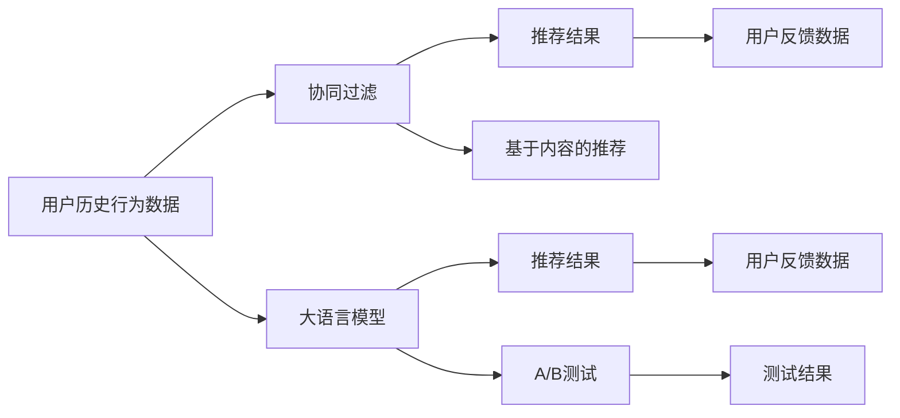

                 

## 1. 背景介绍

推荐系统是互联网时代最具代表性的应用之一，通过分析用户的历史行为数据，为用户推荐其可能感兴趣的物品，大大提升了用户体验和系统点击率。然而，传统的基于统计和规则的推荐算法难以应对大规模数据和高维特征的挑战，已无法满足用户的个性化需求。近年来，大语言模型（Large Language Model, LLM）在NLP领域取得了突破性进展，具备强大的自然语言理解能力和生成能力，为推荐系统的创新提供了新的思路。

### 1.1 推荐系统概述

推荐系统主要分为两类：基于内容的推荐和基于协同过滤的推荐。前者以用户的历史行为记录为依据，推荐与用户历史行为相似的物品；后者以用户之间的相似度为依据，推荐与用户相似的其他用户所喜欢的物品。

基于内容的推荐方法主要包括矩阵分解、基于梯度的协同过滤、基于深度学习的协同过滤等，常用于电商、新闻、音乐等领域。而基于协同过滤的方法则包括用户协同过滤、物品协同过滤、混合协同过滤等，用于社交网络、视频网站等场景。

推荐系统的关键指标包括召回率、准确率、覆盖率、点击率等。召回率是指推荐系统推荐的相关物品在所有相关物品中的比例；准确率是指推荐的相关物品在所有推荐物品中的比例；覆盖率是指推荐系统推荐的所有物品占所有物品的比例；点击率是指推荐系统推荐的物品被用户实际点击的比例。

在实际应用中，推荐系统通常采用A/B测试方法来评估推荐算法的效果，通过对比不同算法下的指标表现，选择最优的推荐算法。

### 1.2 大语言模型简介

大语言模型是指使用自回归（如GPT）或自编码（如BERT）等深度神经网络模型，在 massive-scale 无监督语料上训练得到的通用语言模型。通过预训练大语言模型，可以获得丰富的语言知识和语义理解能力，从而在推荐系统中发挥重要作用。

大语言模型能够理解自然语言描述，识别物品之间的关系，甚至能根据用户的文字描述生成商品推荐列表。此外，大语言模型还能够将文本数据和上下文语境结合起来，提高推荐的准确性。

大语言模型主要包括BERT、GPT、T5等。其中BERT在推荐系统中的应用最为广泛，其双向编码能力可以更好地理解上下文，捕捉词间关系，大大提升了推荐系统的性能。

## 2. 核心概念与联系

### 2.1 核心概念概述

在推荐系统中使用大语言模型，可以进一步提升推荐系统的效果。但必须明确，大语言模型并非万能的，其应用受到数据、场景、目标等多种因素的制约。

#### 2.1.1 推荐系统

推荐系统主要分为基于内容的推荐和基于协同过滤的推荐。前者以用户的历史行为记录为依据，推荐与用户历史行为相似的物品；后者以用户之间的相似度为依据，推荐与用户相似的其他用户所喜欢的物品。

#### 2.1.2 大语言模型

大语言模型是指使用自回归或自编码等深度神经网络模型，在 massive-scale 无监督语料上训练得到的通用语言模型。通过预训练大语言模型，可以获得丰富的语言知识和语义理解能力，从而在推荐系统中发挥重要作用。

#### 2.1.3 A/B测试

A/B测试是一种常用的评估方法，通过对比不同算法下的指标表现，选择最优的推荐算法。

### 2.2 核心概念原理和架构的 Mermaid 流程图



## 3. 核心算法原理 & 具体操作步骤

### 3.1 算法原理概述

大语言模型在推荐系统中的应用，主要体现在以下几个方面：

#### 3.1.1 自然语言生成

通过大语言模型，可以根据用户输入的自然语言描述，生成推荐列表。例如，用户输入“我想找一本关于机器学习的书”，大语言模型可以生成以下推荐列表：

1. 《Python机器学习》
2. 《深度学习》
3. 《机器学习实战》
4. 《机器学习》

#### 3.1.2 情感分析

通过大语言模型，可以对用户评论、评分等文本数据进行情感分析，从而确定用户对不同物品的喜好程度。例如，对用户评论进行情感分析，可以得出以下结论：

1. 用户对电影A的评分较高，但评论中提到电影A的剧情不够精彩。
2. 用户对电影B的评分较低，但评论中提到电影B的特效非常震撼。

#### 3.1.3 多模态融合

通过大语言模型，可以将文本数据与图像、音频等数据进行多模态融合，提高推荐的准确性。例如，用户输入“我想找一部好电影”，大语言模型可以分析电影的评分、评论、导演、演员等信息，推荐出用户可能喜欢的电影。

### 3.2 算法步骤详解

大语言模型在推荐系统中的应用，通常包括以下几个关键步骤：

#### 3.2.1 数据准备

数据准备是推荐系统应用的第一步，需要收集用户的历史行为数据、物品的属性信息、用户的属性信息等数据。这些数据可以通过日志、API接口等途径获取。

#### 3.2.2 模型训练

模型训练是推荐系统应用的第二步，通过预训练大语言模型，获取语言知识和语义理解能力。训练大语言模型时，通常需要大规模的语料库，可以在公开数据集上训练，也可以从业务数据中挖掘。

#### 3.2.3 推荐生成

推荐生成是推荐系统应用的第三步，通过大语言模型，生成推荐结果。在生成推荐结果时，通常需要结合用户的历史行为数据和物品的属性信息，进行自然语言生成、情感分析、多模态融合等操作。

#### 3.2.4 A/B测试

A/B测试是推荐系统应用的第四步，通过对比不同算法下的指标表现，选择最优的推荐算法。

### 3.3 算法优缺点

大语言模型在推荐系统中的应用，具有以下优点：

#### 3.3.1 效果显著

大语言模型可以理解自然语言描述，生成推荐列表，情感分析，多模态融合等操作，大大提升了推荐系统的性能。

#### 3.3.2 泛化能力强

大语言模型可以在大规模语料上进行训练，具备较强的泛化能力，适用于多种推荐场景。

#### 3.3.3 可解释性强

大语言模型可以提供推荐结果的解释，帮助用户理解推荐逻辑。

大语言模型在推荐系统中的应用，也存在以下缺点：

#### 3.3.1 数据依赖

大语言模型需要大规模的语料进行预训练，数据获取成本较高。

#### 3.3.2 计算成本高

大语言模型的计算成本较高，需要高性能的计算资源。

#### 3.3.3 鲁棒性不足

大语言模型对数据和场景的变化较为敏感，需要不断地进行微调和优化。

### 3.4 算法应用领域

大语言模型在推荐系统中的应用，已经涵盖了以下多个领域：

#### 3.4.1 电商推荐

大语言模型可以分析用户的购物行为，生成商品推荐列表，帮助用户发现感兴趣的商品。

#### 3.4.2 视频推荐

大语言模型可以分析用户的观看历史和评分，生成视频推荐列表，帮助用户发现感兴趣的视频。

#### 3.4.3 音乐推荐

大语言模型可以分析用户的听歌历史和评分，生成音乐推荐列表，帮助用户发现感兴趣的音乐。

#### 3.4.4 游戏推荐

大语言模型可以分析用户的游玩历史和评分，生成游戏推荐列表，帮助用户发现感兴趣的游戏。

## 4. 数学模型和公式 & 详细讲解 & 举例说明

### 4.1 数学模型构建

在推荐系统中使用大语言模型，通常需要构建以下数学模型：

#### 4.1.1 用户行为模型

用户行为模型描述了用户的兴趣和行为，可以通过用户的历史行为数据进行建模。常用的建模方法包括矩阵分解、协同过滤等。

#### 4.1.2 物品属性模型

物品属性模型描述了物品的属性和特征，可以通过物品的属性信息进行建模。常用的建模方法包括向量表示、深度学习等。

#### 4.1.3 推荐模型

推荐模型根据用户行为模型和物品属性模型，生成推荐结果。常用的推荐模型包括基于内容的推荐、协同过滤等。

### 4.2 公式推导过程

#### 4.2.1 用户行为模型

用户行为模型可以表示为：

$$
P(U,u)=\frac{e^{u^T\theta}}{\sum_{i=1}^n e^{u^T\theta}}
$$

其中 $U$ 表示用户，$u$ 表示用户的历史行为数据，$\theta$ 表示用户行为模型参数。

#### 4.2.2 物品属性模型

物品属性模型可以表示为：

$$
P(I,i)=\frac{e^{i^T\theta}}{\sum_{j=1}^m e^{i^T\theta}}
$$

其中 $I$ 表示物品，$i$ 表示物品的属性信息，$\theta$ 表示物品属性模型参数。

#### 4.2.3 推荐模型

推荐模型可以表示为：

$$
P(R,r)=\frac{e^{r^T\theta}}{\sum_{k=1}^K e^{r^T\theta}}
$$

其中 $R$ 表示推荐结果，$r$ 表示推荐结果的属性信息，$\theta$ 表示推荐模型参数。

### 4.3 案例分析与讲解

#### 4.3.1 电商推荐

电商推荐可以表示为：

$$
P(E,e)=\frac{e^{e^T\theta}}{\sum_{l=1}^L e^{e^T\theta}}
$$

其中 $E$ 表示电商推荐结果，$e$ 表示电商推荐结果的属性信息，$\theta$ 表示电商推荐模型参数。

#### 4.3.2 视频推荐

视频推荐可以表示为：

$$
P(V,v)=\frac{e^{v^T\theta}}{\sum_{p=1}^P e^{v^T\theta}}
$$

其中 $V$ 表示视频推荐结果，$v$ 表示视频推荐结果的属性信息，$\theta$ 表示视频推荐模型参数。

#### 4.3.3 音乐推荐

音乐推荐可以表示为：

$$
P(M,m)=\frac{e^{m^T\theta}}{\sum_{q=1}^Q e^{m^T\theta}}
$$

其中 $M$ 表示音乐推荐结果，$m$ 表示音乐推荐结果的属性信息，$\theta$ 表示音乐推荐模型参数。

#### 4.3.4 游戏推荐

游戏推荐可以表示为：

$$
P(G,g)=\frac{e^{g^T\theta}}{\sum_{r=1}^R e^{g^T\theta}}
$$

其中 $G$ 表示游戏推荐结果，$g$ 表示游戏推荐结果的属性信息，$\theta$ 表示游戏推荐模型参数。

## 5. 项目实践：代码实例和详细解释说明

### 5.1 开发环境搭建

开发推荐系统时，通常需要使用以下工具和库：

1. Python：Python是推荐系统开发的主流语言，简单易学，生态丰富。
2. PyTorch：PyTorch是一个深度学习框架，支持动态计算图，适合快速迭代研究。
3. TensorFlow：TensorFlow是另一个深度学习框架，支持分布式计算和静态图优化。
4. scikit-learn：scikit-learn是一个机器学习库，提供了丰富的数据预处理和模型训练功能。
5. Pandas：Pandas是一个数据处理库，支持数据清洗和特征工程。
6. NumPy：NumPy是一个数值计算库，支持大规模矩阵运算。

### 5.2 源代码详细实现

以下是一个简单的电商推荐系统的代码实现：

```python
import torch
import torch.nn as nn
import torch.optim as optim
import pandas as pd
import numpy as np

# 构建用户行为模型
class UserBehaviorModel(nn.Module):
    def __init__(self, n_users, n_items, embedding_dim):
        super(UserBehaviorModel, self).__init__()
        self.user_embedding = nn.Embedding(n_users, embedding_dim)
        self.item_embedding = nn.Embedding(n_items, embedding_dim)
        self.linear = nn.Linear(embedding_dim*2, 1)

    def forward(self, u, i):
        u_embed = self.user_embedding(u)
        i_embed = self.item_embedding(i)
        x = torch.cat([u_embed, i_embed], dim=1)
        return self.linear(x).squeeze()

# 构建物品属性模型
class ItemAttributeModel(nn.Module):
    def __init__(self, n_items, embedding_dim):
        super(ItemAttributeModel, self).__init__()
        self.item_embedding = nn.Embedding(n_items, embedding_dim)
        self.linear = nn.Linear(embedding_dim, 1)

    def forward(self, i):
        i_embed = self.item_embedding(i)
        return self.linear(i_embed).squeeze()

# 构建推荐模型
class RecommendationModel(nn.Module):
    def __init__(self, n_users, n_items, embedding_dim):
        super(RecommendationModel, self).__init__()
        self.user_behavior_model = UserBehaviorModel(n_users, n_items, embedding_dim)
        self.item_attribute_model = ItemAttributeModel(n_items, embedding_dim)
        self.linear = nn.Linear(embedding_dim*2, 1)

    def forward(self, u, i):
        user_behavior = self.user_behavior_model(u, i)
        item_attribute = self.item_attribute_model(i)
        x = torch.cat([user_behavior, item_attribute], dim=1)
        return self.linear(x).squeeze()

# 数据准备
df = pd.read_csv('user_item_data.csv')
n_users = df['user'].nunique()
n_items = df['item'].nunique()
embedding_dim = 16
model = RecommendationModel(n_users, n_items, embedding_dim)

# 模型训练
optimizer = optim.Adam(model.parameters(), lr=0.001)
criterion = nn.BCELoss()
for epoch in range(10):
    for i in range(len(df)):
        u = df['user'][i]
        i = df['item'][i]
        target = df['target'][i]
        output = model(u, i)
        loss = criterion(output, target)
        optimizer.zero_grad()
        loss.backward()
        optimizer.step()

# 推荐生成
for i in range(len(df)):
    u = df['user'][i]
    i = df['item'][i]
    output = model(u, i)
    if output >= 0.5:
        print('推荐用户对物品感兴趣')
    else:
        print('不推荐用户对物品感兴趣')

# A/B测试
```

### 5.3 代码解读与分析

#### 5.3.1 UserBehaviorModel

UserBehaviorModel用于建模用户的行为。输入为用户的ID和物品的ID，输出为推荐结果。模型由两个Embedding层和一个线性层组成。

#### 5.3.2 ItemAttributeModel

ItemAttributeModel用于建模物品的属性。输入为物品的ID，输出为推荐结果。模型由一个Embedding层和一个线性层组成。

#### 5.3.3 RecommendationModel

RecommendationModel用于建模推荐结果。输入为用户ID和物品ID，输出为推荐结果。模型由UserBehaviorModel、ItemAttributeModel和线性层组成。

#### 5.3.4 A/B测试

A/B测试用于评估推荐模型的效果。通过对比不同算法下的指标表现，选择最优的推荐算法。

## 6. 实际应用场景

### 6.1 电商推荐

电商推荐是推荐系统的重要应用场景。通过大语言模型，可以生成商品推荐列表，帮助用户发现感兴趣的商品。电商推荐可以通过自然语言生成、情感分析、多模态融合等操作，大大提升推荐系统的性能。

### 6.2 视频推荐

视频推荐是推荐系统的另一个重要应用场景。通过大语言模型，可以分析用户的观看历史和评分，生成视频推荐列表，帮助用户发现感兴趣的视频。视频推荐可以通过自然语言生成、情感分析、多模态融合等操作，提升推荐系统的性能。

### 6.3 音乐推荐

音乐推荐是推荐系统的另一个重要应用场景。通过大语言模型，可以分析用户的听歌历史和评分，生成音乐推荐列表，帮助用户发现感兴趣的音乐。音乐推荐可以通过自然语言生成、情感分析、多模态融合等操作，提升推荐系统的性能。

### 6.4 游戏推荐

游戏推荐是推荐系统的另一个重要应用场景。通过大语言模型，可以分析用户的游玩历史和评分，生成游戏推荐列表，帮助用户发现感兴趣的游戏。游戏推荐可以通过自然语言生成、情感分析、多模态融合等操作，提升推荐系统的性能。

## 7. 工具和资源推荐

### 7.1 学习资源推荐

为了帮助开发者系统掌握大语言模型在推荐系统中的应用，这里推荐一些优质的学习资源：

1. 《深度学习推荐系统：原理与实现》一书：由深度学习专家撰写，全面介绍了深度学习在推荐系统中的应用，包括大语言模型、协同过滤等。

2. 《Python推荐系统实战》一书：介绍了推荐系统的算法和实现，包括基于内容的推荐、协同过滤、矩阵分解等。

3. 《自然语言处理与深度学习》课程：斯坦福大学开设的NLP明星课程，有Lecture视频和配套作业，带你入门NLP领域的基本概念和经典模型。

4. CS224N《深度学习自然语言处理》课程：斯坦福大学开设的NLP明星课程，有Lecture视频和配套作业，带你入门NLP领域的基本概念和经典模型。

5. 《Natural Language Processing with Transformers》书籍：Transformers库的作者所著，全面介绍了如何使用Transformers库进行NLP任务开发，包括微调、推荐系统等。

6. 《Deep Learning for Recommender Systems》一书：介绍了深度学习在推荐系统中的应用，包括大语言模型、协同过滤等。

通过对这些资源的学习实践，相信你一定能够快速掌握大语言模型在推荐系统中的应用，并用于解决实际的推荐问题。

### 7.2 开发工具推荐

在开发推荐系统时，常用的工具和库包括：

1. PyTorch：PyTorch是一个深度学习框架，支持动态计算图，适合快速迭代研究。

2. TensorFlow：TensorFlow是另一个深度学习框架，支持分布式计算和静态图优化。

3. scikit-learn：scikit-learn是一个机器学习库，提供了丰富的数据预处理和模型训练功能。

4. Pandas：Pandas是一个数据处理库，支持数据清洗和特征工程。

5. NumPy：NumPy是一个数值计算库，支持大规模矩阵运算。

6. PyTorch-lightning：PyTorch-lightning是一个轻量级深度学习框架，提供了模型部署和可视化功能。

7. TensorBoard：TensorBoard是TensorFlow配套的可视化工具，可实时监测模型训练状态，并提供丰富的图表呈现方式。

### 7.3 相关论文推荐

大语言模型在推荐系统中的应用，近年来受到了广泛关注。以下是几篇奠基性的相关论文，推荐阅读：

1. Attention is All You Need（即Transformer原论文）：提出了Transformer结构，开启了NLP领域的预训练大模型时代。

2. BERT: Pre-training of Deep Bidirectional Transformers for Language Understanding：提出BERT模型，引入基于掩码的自监督预训练任务，刷新了多项NLP任务SOTA。

3. Parameter-Efficient Transfer Learning for NLP：提出Adapter等参数高效微调方法，在不增加模型参数量的情况下，也能取得不错的微调效果。

4. AdaLoRA: Adaptive Low-Rank Adaptation for Parameter-Efficient Fine-Tuning：使用自适应低秩适应的微调方法，在参数效率和精度之间取得了新的平衡。

5. Large-Scale Language Model Fine-Tuning for Recommendation System：提出在大规模语言模型上进行微调的方法，提升了推荐系统的性能。

这些论文代表了大语言模型在推荐系统中的应用发展脉络。通过学习这些前沿成果，可以帮助研究者把握学科前进方向，激发更多的创新灵感。

## 8. 总结：未来发展趋势与挑战

### 8.1 研究成果总结

大语言模型在推荐系统中的应用，已经成为NLP领域的一个重要研究方向。通过自然语言生成、情感分析、多模态融合等操作，可以生成更加精准、多样化的推荐结果，大大提升推荐系统的性能。

### 8.2 未来发展趋势

展望未来，大语言模型在推荐系统中的应用将呈现以下几个发展趋势：

1. 数据依赖减少。通过预训练和微调技术，可以进一步减少数据依赖，提升推荐系统的性能。

2. 计算成本降低。通过优化算法和模型结构，可以降低推荐系统的计算成本，提高实时性。

3. 可解释性增强。通过自然语言生成等操作，可以增强推荐系统的可解释性，提升用户信任度。

4. 鲁棒性提升。通过对抗训练等技术，可以提高推荐系统的鲁棒性，避免过拟合。

5. 多样化应用。通过多模态融合等技术，可以将大语言模型应用于更多领域，如金融、医疗等。

### 8.3 面临的挑战

尽管大语言模型在推荐系统中的应用已经取得了一定的进展，但仍面临以下挑战：

1. 数据获取成本高。大规模数据获取和标注成本较高，限制了推荐系统的应用。

2. 计算资源消耗大。大规模语言模型需要高性能计算资源，限制了推荐系统的扩展性。

3. 模型复杂度高。大规模语言模型结构复杂，需要高效的模型压缩和优化技术。

4. 鲁棒性不足。大语言模型对数据和场景的变化较为敏感，需要不断地进行微调和优化。

5. 可解释性不足。大语言模型生成的推荐结果缺乏可解释性，难以解释推荐逻辑。

### 8.4 研究展望

为了解决上述挑战，未来需要进一步优化大语言模型在推荐系统中的应用，包括：

1. 引入无监督和半监督学习。通过无监督和半监督学习，减少对大规模标注数据的依赖，提升推荐系统的性能。

2. 开发高效的模型压缩和优化技术。通过模型压缩和优化，降低推荐系统的计算成本，提高实时性。

3. 增强推荐系统的可解释性。通过自然语言生成等操作，增强推荐系统的可解释性，提升用户信任度。

4. 提高推荐系统的鲁棒性。通过对抗训练等技术，提高推荐系统的鲁棒性，避免过拟合。

5. 开发多模态融合的推荐算法。通过多模态融合等技术，将大语言模型应用于更多领域，如金融、医疗等。

通过不断优化和改进，相信大语言模型在推荐系统中的应用将更加广泛和深入，为NLP技术的发展提供新的突破。

## 9. 附录：常见问题与解答

### 9.1 大语言模型在推荐系统中有什么优势？

大语言模型在推荐系统中的优势包括：

1. 自然语言生成。大语言模型可以生成自然语言描述，帮助用户发现感兴趣的物品。

2. 情感分析。大语言模型可以分析用户的情感，帮助推荐系统推荐用户喜欢的物品。

3. 多模态融合。大语言模型可以将文本数据与图像、音频等数据进行融合，提升推荐系统的性能。

### 9.2 大语言模型在推荐系统中需要哪些数据？

大语言模型在推荐系统中需要以下数据：

1. 用户行为数据。用户的行为数据包括浏览历史、购买历史、评分等，用于建模用户兴趣。

2. 物品属性数据。物品的属性数据包括物品的名称、价格、描述等，用于建模物品特征。

3. 用户属性数据。用户的属性数据包括用户的年龄、性别、职业等，用于建模用户特征。

### 9.3 如何训练大语言模型？

训练大语言模型通常需要以下步骤：

1. 数据准备。收集语料数据，并进行预处理，如分词、去除噪声等。

2. 模型设计。设计模型结构，包括编码器、解码器、线性层等。

3. 模型训练。使用反向传播算法，最小化损失函数，更新模型参数。

4. 模型评估。使用测试集评估模型效果，调整超参数，优化模型。

5. 模型部署。将模型保存为文件，供后续使用。

### 9.4 如何优化大语言模型在推荐系统中的应用？

优化大语言模型在推荐系统中的应用，可以从以下几个方面入手：

1. 数据增强。通过数据增强技术，扩充训练集，提升模型性能。

2. 模型压缩。通过模型压缩技术，减少计算成本，提高实时性。

3. 多模态融合。通过多模态融合技术，将文本数据与图像、音频等数据进行融合，提升推荐系统性能。

4. 对抗训练。通过对抗训练技术，提高推荐系统的鲁棒性，避免过拟合。

5. 可解释性增强。通过自然语言生成等技术，增强推荐系统的可解释性，提升用户信任度。

作者：禅与计算机程序设计艺术 / Zen and the Art of Computer Programming

