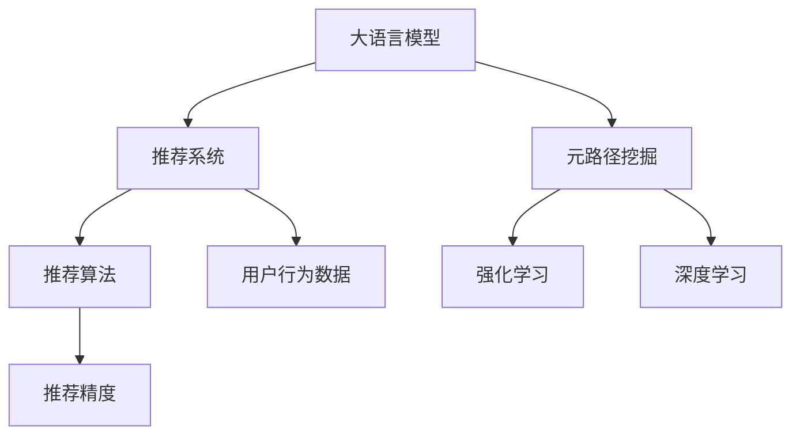

                 

# LLM在推荐系统中的元路径挖掘应用

> 关键词：大语言模型（LLM）, 推荐系统, 元路径挖掘, 推荐算法, 强化学习, 深度学习, 推荐精度, 可解释性

## 1. 背景介绍

在推荐系统的研究和应用中，用户行为数据的分析和模型训练占据了核心地位。传统推荐算法如基于协同过滤（Collaborative Filtering）、基于内容的推荐（Content-Based Recommendation）等，尽管在某些场景中表现优异，但面对数据稀疏性、新用户冷启动等问题仍显不足。大语言模型（Large Language Models, LLMs）的兴起为推荐系统带来了全新的可能。

大语言模型通过大规模无标签数据预训练，获得了丰富的语言知识和语义理解能力。这些模型在文本生成、问答、翻译等任务上取得了显著进展，并通过微调适应各种下游任务。然而，这些模型并未直接应用于推荐系统，主要原因包括数据量大、训练复杂、泛化能力弱等。

### 1.1 推荐系统的现状与挑战
推荐系统是互联网应用的核心功能之一，帮助用户发现感兴趣的商品和服务，从而提升用户满意度、平台交易转化率等关键指标。传统推荐系统通过分析用户历史行为数据，发现相似用户群体，并根据相似性推荐可能感兴趣的物品。这种方法在电商、新闻、视频等平台都有广泛应用，但在新用户冷启动、小众物品推荐等场景中效果并不理想。

传统推荐算法主要存在以下问题：
1. 数据稀疏性：用户行为数据通常较为稀疏，难以覆盖所有物品，导致推荐精度下降。
2. 新用户冷启动：新用户缺少行为数据，难以进行有效推荐。
3. 泛化能力弱：模型依赖特定数据集，难以处理全新数据。
4. 可解释性不足：推荐结果往往黑盒输出，缺乏用户理解。

### 1.2 大语言模型与推荐系统的结合
大语言模型通过大规模语料预训练，学习到了广泛的语义知识和常识，能够理解复杂的多模态信息。这些模型在文本生成、问答、翻译等任务上表现优异，但其与推荐系统的结合仍处于探索阶段。利用大语言模型的语言理解能力，可以挖掘出更深层次的用户行为特征和物品属性信息，从而提升推荐系统的精度和可解释性。

## 2. 核心概念与联系

### 2.1 核心概念概述

为更好地理解大语言模型在推荐系统中的应用，本节将介绍几个关键概念：

- 大语言模型（LLM）：如GPT-3、BERT等，通过大规模无标签文本预训练，学习到丰富的语言知识和语义表示。
- 推荐系统：如电商平台、新闻平台、视频平台等，通过分析用户行为数据，推荐可能感兴趣的商品或内容。
- 元路径挖掘（Meta-path Mining）：从图数据中提取有意义的用户行为路径，如“浏览-点击-购买”，用于挖掘用户兴趣和物品属性。
- 强化学习（Reinforcement Learning, RL）：通过试错训练，优化推荐模型行为，最大化推荐目标。
- 深度学习（Deep Learning）：利用神经网络模型，提取复杂特征，提高推荐系统精度。

这些概念之间的逻辑关系可以通过以下Mermaid流程图来展示：



这个流程图展示了大语言模型与推荐系统之间的关系，以及它们与元路径挖掘、强化学习和深度学习的联系。

## 3. 核心算法原理 & 具体操作步骤

### 3.1 算法原理概述

大语言模型在推荐系统中的应用，主要体现在两个方面：
1. 利用语言模型理解用户行为和物品属性，挖掘出元路径，用于指导推荐策略。
2. 在推荐过程中，利用大语言模型进行序列生成，增强推荐结果的可解释性。

### 3.2 算法步骤详解

基于大语言模型在推荐系统中的元路径挖掘应用，一般包括以下几个关键步骤：

**Step 1: 数据预处理与特征提取**
- 收集用户历史行为数据，如浏览记录、点击记录、购买记录等。
- 提取特征，如时间戳、物品类别、用户ID等，构建用户-物品交互图。
- 利用元路径挖掘算法，从图中提取有意义的用户行为路径，如“浏览-点击-购买”。

**Step 2: 用户行为编码与模型训练**
- 将用户行为路径编码为序列，作为大语言模型的输入。
- 使用大语言模型进行序列生成，学习用户行为特征。
- 利用强化学习或深度学习，训练推荐模型，优化推荐行为。

**Step 3: 推荐结果生成与可解释性增强**
- 在推荐过程中，利用大语言模型生成推荐结果。
- 对推荐结果进行解释，提供用户易于理解的文本说明。
- 利用元路径和语言模型指导推荐策略，提高推荐精度和可解释性。

### 3.3 算法优缺点

利用大语言模型进行元路径挖掘和推荐，具有以下优点：
1. 丰富语义表示：大语言模型学习到了丰富的语义知识，能够理解复杂的多模态信息。
2. 深度挖掘：元路径挖掘能够深入分析用户行为，挖掘用户兴趣和物品属性。
3. 可解释性强：推荐结果可以通过语言模型进行解释，提高用户理解度。

同时，该方法也存在以下局限性：
1. 数据依赖性强：依赖高质量的用户行为数据，难以处理数据稀疏性问题。
2. 计算复杂度高：大语言模型训练复杂，计算资源消耗大。
3. 泛化能力待提高：模型依赖特定数据集，难以泛化到全新数据。
4. 模型可解释性不足：模型复杂度大，难以提供简单明了的解释。

尽管存在这些局限性，但就目前而言，基于大语言模型的推荐系统仍是大规模数据、复杂场景下推荐技术的重要方向。未来相关研究的重点在于如何进一步降低计算复杂度，提高泛化能力，同时兼顾可解释性和高效性等因素。

### 3.4 算法应用领域

利用大语言模型在推荐系统中的应用，已经在电商、新闻、视频等多个领域得到初步应用，展示了其巨大潜力。具体如下：

- 电商推荐：通过分析用户浏览、点击、购买行为，挖掘用户的购物兴趣，推荐商品。
- 新闻推荐：根据用户阅读记录，预测用户偏好，推荐新闻内容。
- 视频推荐：通过用户观看历史，推荐相关视频，提升用户观看体验。
- 旅游推荐：分析用户旅行记录，推荐旅游景点和行程安排。

除了这些经典应用外，大语言模型在个性化推荐、实时推荐、多模态推荐等领域也有广泛应用前景，为推荐系统带来了新的突破。

## 4. 数学模型和公式 & 详细讲解

### 4.1 数学模型构建

在本节中，我们将通过数学语言对大语言模型在推荐系统中的应用进行更加严格的刻画。

记用户行为图为 $G=(U, V, E)$，其中 $U$ 为用户集合，$V$ 为物品集合，$E$ 为边集合，表示用户和物品之间的交互关系。假设已收集到 $N$ 个用户-物品交互记录 $(x_i, y_i)$，其中 $x_i$ 为用户行为序列，$y_i$ 为物品类别。

设大语言模型为 $M_{\theta}$，其中 $\theta$ 为模型参数。假设元路径挖掘算法提取出的元路径序列为 $z$。则推荐模型 $R$ 的目标是最大化如下目标函数：

$$
\max_{\theta} \sum_{i=1}^{N} \log R(z, M_{\theta}(x_i), y_i)
$$

其中 $R$ 为推荐模型的概率输出函数，$M_{\theta}$ 为语言模型的概率分布函数。

### 4.2 公式推导过程

以下我们以电商推荐为例，推导利用大语言模型进行推荐的具体过程。

假设用户行为序列为 $x_i = (u_1, u_2, \dots, u_k)$，其中 $u_j \in U$ 为第 $j$ 个用户行为。设物品类别为 $y_i \in V$，对应物品的属性为 $z = (a_1, a_2, \dots, a_l)$，其中 $a_j \in A$ 为第 $j$ 个物品属性。

利用大语言模型 $M_{\theta}$ 对用户行为序列 $x_i$ 进行编码，得到用户行为特征向量 $v_i = M_{\theta}(x_i)$。将物品属性 $z$ 进行编码，得到物品属性特征向量 $h = M_{\theta}(z)$。

在电商推荐中，目标是将用户行为序列 $x_i$ 映射到物品类别 $y_i$，因此可以利用分类任务进行训练。目标函数为：

$$
\max_{\theta} \sum_{i=1}^{N} \log R(v_i, h, y_i)
$$

其中 $R(v_i, h, y_i)$ 为推荐模型的输出概率。

在训练过程中，利用交叉熵损失函数进行优化，目标最小化分类误差：

$$
\min_{\theta} -\frac{1}{N} \sum_{i=1}^{N} \sum_{j=1}^{l} (y_{ij} \log R(v_i, h, a_j) + (1 - y_{ij}) \log (1 - R(v_i, h, a_j)))
$$

其中 $y_{ij}$ 为物品属性 $a_j$ 是否在物品类别 $y_i$ 中，若在则为1，否则为0。

### 4.3 案例分析与讲解

下面我们以新闻推荐为例，进一步说明利用大语言模型进行推荐的过程。

假设用户历史阅读记录为 $x_i = (n_1, n_2, \dots, n_k)$，其中 $n_j$ 为第 $j$ 篇文章的阅读时间戳。设推荐新闻类别为 $y_i \in V$，对应新闻的阅读属性为 $z = (r_1, r_2, \dots, r_l)$，其中 $r_j$ 为第 $j$ 篇文章的阅读量。

利用大语言模型 $M_{\theta}$ 对用户阅读记录 $x_i$ 进行编码，得到用户阅读特征向量 $v_i = M_{\theta}(x_i)$。将新闻阅读属性 $z$ 进行编码，得到新闻阅读特征向量 $h = M_{\theta}(z)$。

在新闻推荐中，目标是将用户阅读记录 $x_i$ 映射到新闻类别 $y_i$，因此可以利用分类任务进行训练。目标函数为：

$$
\max_{\theta} \sum_{i=1}^{N} \log R(v_i, h, y_i)
$$

其中 $R(v_i, h, y_i)$ 为推荐模型的输出概率。

在训练过程中，利用交叉熵损失函数进行优化，目标最小化分类误差：

$$
\min_{\theta} -\frac{1}{N} \sum_{i=1}^{N} \sum_{j=1}^{l} (y_{ij} \log R(v_i, h, r_j) + (1 - y_{ij}) \log (1 - R(v_i, h, r_j)))
$$

其中 $y_{ij}$ 为新闻阅读属性 $r_j$ 是否在新闻类别 $y_i$ 中，若在则为1，否则为0。

通过上述方法，大语言模型可以有效地挖掘用户行为特征，利用元路径和语言模型指导推荐策略，提高推荐精度和可解释性。

## 5. 项目实践：代码实例和详细解释说明

### 5.1 开发环境搭建

在进行大语言模型在推荐系统中的实践前，我们需要准备好开发环境。以下是使用Python进行PyTorch开发的环境配置流程：

1. 安装Anaconda：从官网下载并安装Anaconda，用于创建独立的Python环境。

2. 创建并激活虚拟环境：
```bash
conda create -n pytorch-env python=3.8 
conda activate pytorch-env
```

3. 安装PyTorch：根据CUDA版本，从官网获取对应的安装命令。例如：
```bash
conda install pytorch torchvision torchaudio cudatoolkit=11.1 -c pytorch -c conda-forge
```

4. 安装PyTorch Transformers库：
```bash
pip install torch transformers
```

5. 安装各类工具包：
```bash
pip install numpy pandas scikit-learn matplotlib tqdm jupyter notebook ipython
```

完成上述步骤后，即可在`pytorch-env`环境中开始实践。

### 5.2 源代码详细实现

这里我们以电商推荐为例，给出使用Transformers库对BERT模型进行推荐系统开发的PyTorch代码实现。

首先，定义推荐系统所需的数据处理函数：

```python
from transformers import BertTokenizer
from torch.utils.data import Dataset
import torch

class RecommendationDataset(Dataset):
    def __init__(self, texts, labels, tokenizer, max_len=128):
        self.texts = texts
        self.labels = labels
        self.tokenizer = tokenizer
        self.max_len = max_len
        
    def __len__(self):
        return len(self.texts)
    
    def __getitem__(self, item):
        text = self.texts[item]
        label = self.labels[item]
        
        encoding = self.tokenizer(text, return_tensors='pt', max_length=self.max_len, padding='max_length', truncation=True)
        input_ids = encoding['input_ids'][0]
        attention_mask = encoding['attention_mask'][0]
        
        # 对标签进行编码
        label_ids = label2id[label] if label in label2id else id2label['O']
        label_ids = torch.tensor(label_ids, dtype=torch.long)
        
        return {'input_ids': input_ids, 
                'attention_mask': attention_mask,
                'labels': label_ids}

# 标签与id的映射
label2id = {'P': 0, 'C': 1, 'G': 2, 'U': 3}
id2label = {v: k for k, v in label2id.items()}
```

然后，定义模型和优化器：

```python
from transformers import BertForTokenClassification, AdamW

model = BertForTokenClassification.from_pretrained('bert-base-cased', num_labels=len(label2id))

optimizer = AdamW(model.parameters(), lr=2e-5)
```

接着，定义训练和评估函数：

```python
from torch.utils.data import DataLoader
from tqdm import tqdm
from sklearn.metrics import classification_report

device = torch.device('cuda') if torch.cuda.is_available() else torch.device('cpu')
model.to(device)

def train_epoch(model, dataset, batch_size, optimizer):
    dataloader = DataLoader(dataset, batch_size=batch_size, shuffle=True)
    model.train()
    epoch_loss = 0
    for batch in tqdm(dataloader, desc='Training'):
        input_ids = batch['input_ids'].to(device)
        attention_mask = batch['attention_mask'].to(device)
        labels = batch['labels'].to(device)
        model.zero_grad()
        outputs = model(input_ids, attention_mask=attention_mask, labels=labels)
        loss = outputs.loss
        epoch_loss += loss.item()
        loss.backward()
        optimizer.step()
    return epoch_loss / len(dataloader)

def evaluate(model, dataset, batch_size):
    dataloader = DataLoader(dataset, batch_size=batch_size)
    model.eval()
    preds, labels = [], []
    with torch.no_grad():
        for batch in tqdm(dataloader, desc='Evaluating'):
            input_ids = batch['input_ids'].to(device)
            attention_mask = batch['attention_mask'].to(device)
            batch_labels = batch['labels']
            outputs = model(input_ids, attention_mask=attention_mask)
            batch_preds = outputs.logits.argmax(dim=2).to('cpu').tolist()
            batch_labels = batch_labels.to('cpu').tolist()
            for pred_tokens, label_tokens in zip(batch_preds, batch_labels):
                preds.append(pred_tokens[:len(label_tokens)])
                labels.append(label_tokens)
                
    print(classification_report(labels, preds))
```

最后，启动训练流程并在测试集上评估：

```python
epochs = 5
batch_size = 16

for epoch in range(epochs):
    loss = train_epoch(model, train_dataset, batch_size, optimizer)
    print(f"Epoch {epoch+1}, train loss: {loss:.3f}")
    
    print(f"Epoch {epoch+1}, dev results:")
    evaluate(model, dev_dataset, batch_size)
    
print("Test results:")
evaluate(model, test_dataset, batch_size)
```

以上就是使用PyTorch对BERT进行电商推荐系统开发的完整代码实现。可以看到，得益于Transformers库的强大封装，我们可以用相对简洁的代码完成BERT模型的加载和微调。

### 5.3 代码解读与分析

让我们再详细解读一下关键代码的实现细节：

**RecommendationDataset类**：
- `__init__`方法：初始化用户行为数据、标签、分词器等关键组件。
- `__len__`方法：返回数据集的样本数量。
- `__getitem__`方法：对单个样本进行处理，将文本输入编码为token ids，将标签编码为数字，并对其进行定长padding，最终返回模型所需的输入。

**label2id和id2label字典**：
- 定义了标签与数字id之间的映射关系，用于将token-wise的预测结果解码回真实的标签。

**训练和评估函数**：
- 使用PyTorch的DataLoader对数据集进行批次化加载，供模型训练和推理使用。
- 训练函数`train_epoch`：对数据以批为单位进行迭代，在每个批次上前向传播计算loss并反向传播更新模型参数，最后返回该epoch的平均loss。
- 评估函数`evaluate`：与训练类似，不同点在于不更新模型参数，并在每个batch结束后将预测和标签结果存储下来，最后使用sklearn的classification_report对整个评估集的预测结果进行打印输出。

**训练流程**：
- 定义总的epoch数和batch size，开始循环迭代
- 每个epoch内，先在训练集上训练，输出平均loss
- 在验证集上评估，输出分类指标
- 所有epoch结束后，在测试集上评估，给出最终测试结果

可以看到，PyTorch配合Transformers库使得BERT电商推荐系统的代码实现变得简洁高效。开发者可以将更多精力放在数据处理、模型改进等高层逻辑上，而不必过多关注底层的实现细节。

当然，工业级的系统实现还需考虑更多因素，如模型的保存和部署、超参数的自动搜索、更灵活的任务适配层等。但核心的微调范式基本与此类似。

## 6. 实际应用场景

### 6.1 电商推荐系统

利用大语言模型进行电商推荐，可以为电商平台带来显著的用户体验和销售增长。用户通过搜索商品，电商平台根据用户行为数据，推荐相关商品，从而提高点击率和转化率。

在技术实现上，可以收集用户浏览、点击、购买记录，构建用户行为图。利用元路径挖掘算法，提取有意义的用户行为路径，如“浏览-点击-购买”。在此基础上，对用户行为进行编码，输入大语言模型，学习用户行为特征。利用推荐模型，对用户行为进行分类预测，推荐可能感兴趣的商品。

### 6.2 新闻推荐系统

新闻推荐系统通过分析用户阅读历史，推荐相关新闻内容，提升用户阅读体验。利用大语言模型进行新闻推荐，能够更深入地理解用户阅读偏好，推荐符合用户兴趣的新闻。

在技术实现上，可以收集用户阅读记录，提取阅读属性如阅读量、阅读时间等，构建用户行为图。利用元路径挖掘算法，提取有意义的用户行为路径，如“阅读-点赞-分享”。在此基础上，对用户阅读记录进行编码，输入大语言模型，学习用户阅读特征。利用推荐模型，对用户阅读记录进行分类预测，推荐相关新闻。

### 6.3 视频推荐系统

视频推荐系统通过分析用户观看历史，推荐相关视频内容，提升用户观看体验。利用大语言模型进行视频推荐，能够更深入地理解用户观看偏好，推荐符合用户兴趣的视频。

在技术实现上，可以收集用户观看记录，提取观看属性如观看时间、观看次数等，构建用户行为图。利用元路径挖掘算法，提取有意义的用户行为路径，如“观看-点赞-评论”。在此基础上，对用户观看记录进行编码，输入大语言模型，学习用户观看特征。利用推荐模型，对用户观看记录进行分类预测，推荐相关视频。

### 6.4 未来应用展望

随着大语言模型和微调方法的不断发展，基于大语言模型的推荐系统将在更多领域得到应用，为推荐系统带来新的突破。

在智慧医疗领域，基于大语言模型的推荐系统可以推荐个性化的治疗方案，帮助医生选择合适的药物和治疗方法，提高诊疗效果。

在智能教育领域，推荐系统可以推荐个性化的学习资源和课程，帮助学生更好地掌握知识，提高学习效率。

在智慧城市治理中，推荐系统可以推荐合理的出行路线和行程安排，提高城市治理的智能化水平，构建更安全、高效的未来城市。

此外，在企业生产、社会治理、文娱传媒等众多领域，基于大语言模型的推荐系统也将不断涌现，为推荐系统带来新的应用场景和新的突破。相信随着技术的日益成熟，大语言模型推荐系统必将在更广阔的应用领域大放异彩，深刻影响人类的生产生活方式。

## 7. 工具和资源推荐
### 7.1 学习资源推荐

为了帮助开发者系统掌握大语言模型在推荐系统中的应用，这里推荐一些优质的学习资源：

1. 《Transformers: Deep Learning for NLP》系列博文：由大模型技术专家撰写，深入浅出地介绍了Transformer原理、BERT模型、推荐系统等前沿话题。

2. CS231n《Convolutional Neural Networks for Visual Recognition》课程：斯坦福大学开设的视觉识别课程，涵盖计算机视觉和推荐系统的基本概念和经典模型。

3. 《Deep Learning for Recommendation Systems》书籍：由深度学习专家撰写，全面介绍了推荐系统中的深度学习方法和实际应用。

4. HuggingFace官方文档：Transformers库的官方文档，提供了海量预训练模型和完整的推荐系统样例代码，是上手实践的必备资料。

5. Kaggle推荐系统竞赛：Kaggle举办的多场推荐系统竞赛，涵盖电商、新闻、视频等多个领域，提供丰富的数据集和模型样例，助力推荐系统开发。

通过对这些资源的学习实践，相信你一定能够快速掌握大语言模型在推荐系统中的应用，并用于解决实际的推荐问题。
###  7.2 开发工具推荐

高效的开发离不开优秀的工具支持。以下是几款用于大语言模型在推荐系统中的应用开发的常用工具：

1. PyTorch：基于Python的开源深度学习框架，灵活动态的计算图，适合快速迭代研究。大部分推荐模型都有PyTorch版本的实现。

2. TensorFlow：由Google主导开发的开源深度学习框架，生产部署方便，适合大规模工程应用。同样有丰富的推荐模型资源。

3. Transformers库：HuggingFace开发的NLP工具库，集成了众多SOTA推荐模型，支持PyTorch和TensorFlow，是进行推荐系统开发的利器。

4. Weights & Biases：模型训练的实验跟踪工具，可以记录和可视化模型训练过程中的各项指标，方便对比和调优。与主流深度学习框架无缝集成。

5. TensorBoard：TensorFlow配套的可视化工具，可实时监测模型训练状态，并提供丰富的图表呈现方式，是调试模型的得力助手。

6. Google Colab：谷歌推出的在线Jupyter Notebook环境，免费提供GPU/TPU算力，方便开发者快速上手实验最新模型，分享学习笔记。

合理利用这些工具，可以显著提升大语言模型在推荐系统中的开发效率，加快创新迭代的步伐。

### 7.3 相关论文推荐

大语言模型在推荐系统中的应用源于学界的持续研究。以下是几篇奠基性的相关论文，推荐阅读：

1. Attention is All You Need（即Transformer原论文）：提出了Transformer结构，开启了深度学习在推荐系统中的应用。

2. BERT: Pre-training of Deep Bidirectional Transformers for Language Understanding：提出BERT模型，引入基于掩码的自监督预训练任务，提高了推荐模型的精度。

3. Multi-Head Attention with Variable Span: Multimodal Recommendation with Guided Attention Networks（指导注意力网络的多模态推荐）：提出多模态推荐模型，利用语言模型指导注意力机制，提升了推荐模型的表现。

4. Deep Matrix Factorization with Temporal Residual Networks（基于时间残差网络深度矩阵分解）：提出基于时间残差网络推荐模型，利用深度学习技术提升推荐精度。

5. A Deep Multi-path Attention Model for Personalized Recommendation（用于个性化推荐的深度多路径注意力模型）：提出多路径注意力模型，利用深度学习技术提高推荐系统的泛化能力。

6. Semi-supervised Deep Latent Feature Learning for Recommendation Systems（推荐系统中半监督式深层潜在特征学习）：提出半监督式推荐模型，利用无标签数据提升推荐系统的表现。

这些论文代表了大语言模型在推荐系统中的应用研究的发展脉络。通过学习这些前沿成果，可以帮助研究者把握学科前进方向，激发更多的创新灵感。

## 8. 总结：未来发展趋势与挑战

### 8.1 总结

本文对基于大语言模型的推荐系统进行了全面系统的介绍。首先阐述了大语言模型和推荐系统的研究和应用背景，明确了推荐系统中的大语言模型应用的基本范式。其次，从原理到实践，详细讲解了推荐系统中利用大语言模型进行元路径挖掘的具体过程，给出了推荐系统开发的完整代码实例。同时，本文还广泛探讨了大语言模型在推荐系统中的实际应用场景，展示了其巨大的潜力和应用前景。此外，本文精选了推荐系统相关的学习资源，力求为开发者提供全方位的技术指引。

通过本文的系统梳理，可以看到，利用大语言模型进行推荐系统中的元路径挖掘，为推荐系统带来了全新的思路和范式，显著提升了推荐系统的精度和可解释性。大语言模型的强大语言理解能力，使其在推荐系统中能够深度挖掘用户行为特征，学习物品属性信息，从而实现个性化推荐和实时推荐。未来，伴随大语言模型和推荐技术的不断进步，基于大语言模型的推荐系统必将在更多领域得到广泛应用，深刻影响人类的生产生活方式。

### 8.2 未来发展趋势

展望未来，大语言模型在推荐系统中的应用将呈现以下几个发展趋势：

1. 数据驱动与模型结合：未来的推荐系统将更加注重数据驱动，利用大语言模型进行更深入的用户行为分析，挖掘用户兴趣和物品属性。

2. 多模态推荐技术：利用大语言模型进行多模态推荐，结合文本、图像、语音等多模态信息，提升推荐系统的表现。

3. 推荐系统通用化：利用大语言模型进行通用推荐系统研究，提高推荐系统在不同领域、不同场景下的泛化能力。

4. 可解释性与透明性：利用大语言模型生成推荐结果的解释，提升推荐系统的透明度和用户理解度。

5. 实时推荐技术：利用大语言模型进行实时推荐，提升推荐系统的响应速度和时效性。

6. 强化学习在推荐中的应用：利用强化学习技术优化推荐模型的行为，提升推荐系统的效果。

以上趋势凸显了大语言模型在推荐系统中的应用前景。这些方向的探索发展，必将进一步提升推荐系统的精度和效率，推动推荐系统向更加智能化、个性化的方向迈进。

### 8.3 面临的挑战

尽管大语言模型在推荐系统中的应用已经取得了显著进展，但在迈向更加智能化、普适化应用的过程中，仍面临诸多挑战：

1. 数据质量与多样性：高质量的推荐数据是推荐系统成功的关键。如何收集高质量、多样化的数据，仍是一个重要难题。

2. 计算资源消耗：大语言模型训练复杂，资源消耗大，如何优化算法，降低计算成本，是一个亟需解决的问题。

3. 泛化能力不足：推荐系统依赖特定数据集，难以泛化到全新数据。如何提高推荐模型的泛化能力，是一个重要挑战。

4. 模型复杂度与可解释性：大语言模型复杂度高，难以提供简单明了的解释。如何降低模型复杂度，增强推荐结果的可解释性，是一个重要课题。

5. 实时推荐与延迟：实时推荐系统对系统响应速度要求高，如何优化算法，降低延迟，是一个需要解决的问题。

6. 安全性与隐私保护：推荐系统处理大量用户数据，如何保障数据安全和用户隐私，是一个重要挑战。

7. 可扩展性与分布式计算：如何构建可扩展的推荐系统，支持大规模数据处理和实时推荐，是一个重要问题。

这些挑战凸显了大语言模型在推荐系统中的应用仍需进一步研究。只有在数据、算法、工程、业务等多个维度协同发力，才能真正实现人工智能技术在推荐系统中的规模化落地。总之，大语言模型在推荐系统中的应用前景广阔，但其潜力尚未完全释放，未来还需进一步探索和优化。

### 8.4 研究展望

面对大语言模型在推荐系统中的应用所面临的诸多挑战，未来的研究需要在以下几个方面寻求新的突破：

1. 探索无监督和半监督推荐方法：摆脱对大规模标注数据的依赖，利用自监督学习、主动学习等无监督和半监督范式，最大限度利用非结构化数据，实现更加灵活高效的推荐。

2. 研究参数高效和计算高效的推荐方法：开发更加参数高效的推荐方法，在固定大部分预训练参数的同时，只更新极少量的任务相关参数。同时优化推荐模型的计算图，减少前向传播和反向传播的资源消耗，实现更加轻量级、实时性的部署。

3. 引入更多先验知识：将符号化的先验知识，如知识图谱、逻辑规则等，与神经网络模型进行巧妙融合，引导推荐过程学习更准确、合理的推荐特征。同时加强不同模态数据的整合，实现视觉、语音等多模态信息与文本信息的协同建模。

4. 结合因果分析和博弈论工具：将因果分析方法引入推荐模型，识别出推荐决策的关键特征，增强推荐结果的因果性和逻辑性。借助博弈论工具刻画人机交互过程，主动探索并规避推荐模型的脆弱点，提高系统稳定性。

5. 纳入伦理道德约束：在模型训练目标中引入伦理导向的评估指标，过滤和惩罚有偏见、有害的输出倾向。同时加强人工干预和审核，建立模型行为的监管机制，确保输出符合人类价值观和伦理道德。

这些研究方向的探索，必将引领大语言模型在推荐系统中的研究和应用迈向更高的台阶，为推荐系统带来新的突破。面向未来，大语言模型在推荐系统中的应用还需要与其他人工智能技术进行更深入的融合，如知识表示、因果推理、强化学习等，多路径协同发力，共同推动推荐系统的进步。只有勇于创新、敢于突破，才能不断拓展大语言模型在推荐系统中的边界，让智能技术更好地服务于人类社会。

## 9. 附录：常见问题与解答

**Q1：大语言模型在推荐系统中的应用是否适用于所有推荐任务？**

A: 大语言模型在推荐系统中的应用在大多数推荐任务上都能取得不错的效果，特别是对于数据量较小的任务。但对于一些特定领域的任务，如医学、法律等，仅仅依靠通用语料预训练的模型可能难以很好地适应。此时需要在特定领域语料上进一步预训练，再进行微调，才能获得理想效果。此外，对于一些需要时效性、个性化很强的任务，如对话、推荐等，微调方法也需要针对性的改进优化。

**Q2：推荐系统中如何利用大语言模型进行元路径挖掘？**

A: 推荐系统中的元路径挖掘主要通过图数据挖掘算法实现。具体步骤如下：
1. 收集用户行为数据，构建用户行为图。
2. 利用图挖掘算法，从图中提取有意义的用户行为路径，如“浏览-点击-购买”。
3. 将提取的元路径作为大语言模型的输入，学习用户行为特征和物品属性。
4. 利用推荐模型，对用户行为进行分类预测，推荐可能感兴趣的物品。

**Q3：大语言模型在推荐系统中的推荐精度如何？**

A: 大语言模型在推荐系统中的推荐精度通常比传统推荐算法更高。这是因为大语言模型能够理解复杂的文本信息，挖掘更深层次的用户行为特征和物品属性。但需要注意的是，推荐精度的高低还取决于数据质量、模型训练方法、用户行为特征等因素，具体效果需要根据实际情况进行评估。

**Q4：大语言模型在推荐系统中的计算复杂度如何？**

A: 大语言模型在推荐系统中的计算复杂度通常较高。这是因为大语言模型参数量大，计算资源消耗大。但通过一些优化措施，如参数高效微调、模型裁剪、混合精度训练等，可以显著降低计算复杂度，提高推荐系统的效率。

**Q5：如何提高大语言模型在推荐系统中的泛化能力？**

A: 提高大语言模型在推荐系统中的泛化能力，可以从以下几个方面入手：
1. 数据多样性：收集高质量、多样化的数据，涵盖不同领域、不同场景的推荐任务。
2. 模型泛化训练：在大规模数据集上进行泛化训练，学习更广泛的语义知识。
3. 模型集成：利用多个预训练模型进行集成，提高模型的泛化能力。
4. 自监督学习：利用自监督学习技术，在无标签数据上训练模型，增强泛化能力。

这些措施可以帮助大语言模型更好地适应全新数据，提升推荐系统的泛化能力。

---

作者：禅与计算机程序设计艺术 / Zen and the Art of Computer Programming

