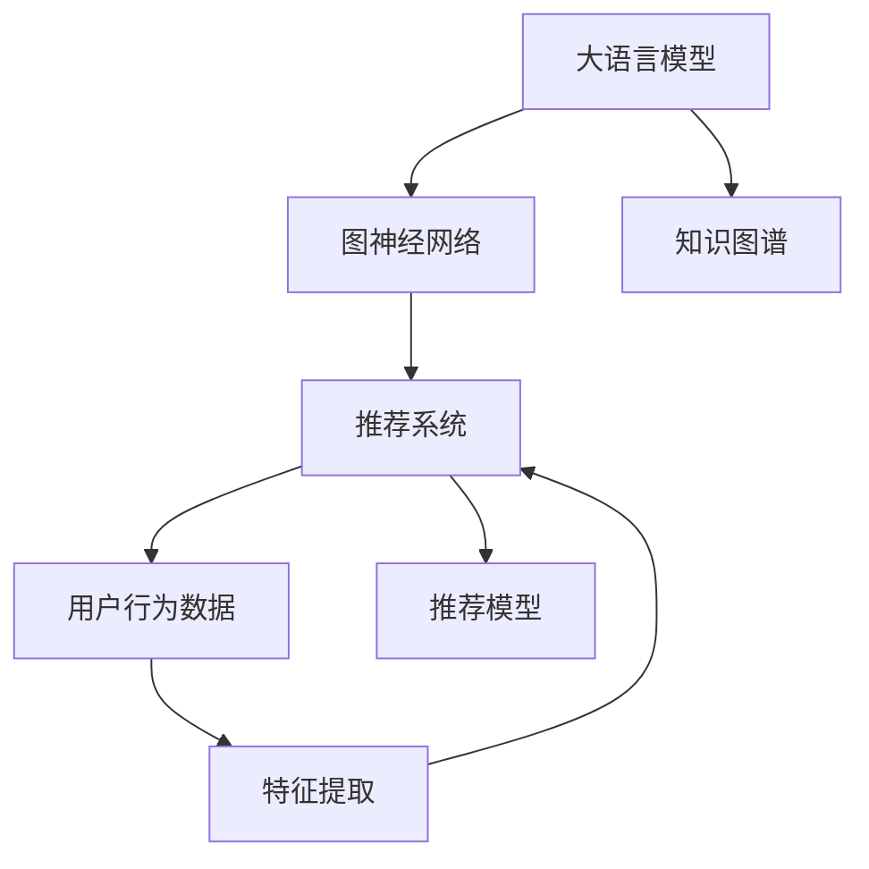

                 

# LLM在推荐系统中的图神经网络应用

> 关键词：大语言模型(LLM),图神经网络(GNN),推荐系统,图注意力机制(GAT),稀疏性,泛化能力,知识图谱,交互图

## 1. 背景介绍

### 1.1 问题由来
在推荐系统领域，传统的协同过滤方法已经逐渐显现出其局限性。现有的基于用户行为数据推荐系统，往往只能挖掘到用户历史互动的局部关系，缺乏对用户兴趣的深层次理解，难以提供更加个性化和多样化的推荐。

大语言模型（Large Language Models，LLM）在NLP领域的巨大成功，吸引了人们对其在推荐系统中的应用进行探索。LLM拥有强大的语言理解和生成能力，可以通过自然语言理解和表达复杂的人类需求和偏好，有望在推荐系统领域取得突破性进展。

### 1.2 问题核心关键点
当前，将LLM应用于推荐系统的关键在于，如何利用LLM的语言处理能力，结合推荐系统的数据特性，构建高效、准确的推荐模型。需要考虑以下核心关键点：

- 如何有效融合多源异构数据：推荐系统通常涉及多种数据源，如用户行为数据、商品描述、用户画像等，如何高效整合这些数据，提升模型的泛化能力。
- 如何提升模型的稀疏性：传统推荐系统主要依赖用户行为数据，这部分数据往往稀疏且噪声较多，如何提升模型的稀疏性，克服数据不足的问题。
- 如何利用知识图谱：知识图谱作为重要的外部知识来源，能够提供商品、用户之间的语义关系，如何将知识图谱与LLM结合，提升推荐模型的表现力。
- 如何设计高效的图神经网络：图神经网络（Graph Neural Network，GNN）是一种针对图结构数据进行学习的方法，如何设计高效的图注意力机制（GAT），提升模型对图结构数据的处理能力。

## 2. 核心概念与联系

### 2.1 核心概念概述

为更好地理解LLM在推荐系统中的应用，本节将介绍几个密切相关的核心概念：

- 大语言模型(LLM)：以Transformer为代表的大规模预训练语言模型，具备强大的语言理解和生成能力。
- 图神经网络(GNN)：一种针对图结构数据进行深度学习的方法，可以有效地处理复杂的多维关系。
- 推荐系统(Recommendation System)：通过分析用户的行为数据，为用户推荐个性化商品或内容的技术。
- 知识图谱(Knowledge Graph)：由实体、属性和关系组成的有向图，用于描述实体之间的语义关系。
- 图注意力机制(GAT)：一种基于注意力机制的图神经网络结构，可以有效地学习图结构数据中的重要关系。
- 稀疏性(Sparsity)：推荐系统数据稀疏性的特性，对模型的泛化能力和处理能力提出了挑战。
- 泛化能力(Generalization)：模型能够推广到未见过的数据上的能力，即模型在新数据上的表现。

这些核心概念之间的逻辑关系可以通过以下Mermaid流程图来展示：



这个流程图展示了大语言模型、图神经网络、推荐系统、知识图谱和用户行为数据之间的关系：

1. 大语言模型通过预训练获得语言处理能力。
2. 图神经网络提供了一种高效处理图结构数据的方法。
3. 推荐系统利用用户行为数据进行推荐。
4. 知识图谱作为重要的外部知识来源，提供商品、用户之间的语义关系。
5. 结合这些知识，推荐模型可以在用户行为数据的基础上，进一步提升推荐效果。

## 3. 核心算法原理 & 具体操作步骤

### 3.1 算法原理概述

LLM在推荐系统中的应用，本质上是通过自然语言处理技术，结合图神经网络的方法，对推荐数据进行深度学习。具体来说，推荐系统的数据可以表示为一个图结构，图中的节点表示商品或用户，边表示它们之间的关系（如用户-商品、商品-商品等）。通过图神经网络，对图结构数据进行学习，同时利用LLM的自然语言理解能力，为节点注入更丰富的语义信息，从而提升推荐模型的表现力。

### 3.2 算法步骤详解

LLM在推荐系统中的图神经网络应用主要包括以下几个关键步骤：

**Step 1: 构建推荐图**

构建一个推荐图，其中节点表示商品或用户，边表示它们之间的关系。推荐图的构建可以基于用户行为数据、知识图谱等外部知识。以用户-商品为例，节点为用户，商品为节点，边表示用户对商品的历史评分、购买行为等。

**Step 2: 编码图节点**

将推荐图中的节点通过GNN进行编码，得到每个节点的隐向量表示。常用的图神经网络结构包括Graph Convolutional Network（GCN）、Graph Attention Network（GAT）等。

**Step 3: 融合节点特征**

将GNN编码得到的节点隐向量与LLM模型提取的文本特征进行融合。LLM可以用于提取商品描述、用户评论等文本特征，与GNN的隐向量进行拼接，得到更丰富的节点特征表示。

**Step 4: 训练推荐模型**

将融合后的节点特征输入LLM进行文本生成或分类任务，得到推荐结果。同时，可以结合用户行为数据，进行有监督训练，优化模型参数。

**Step 5: 推理与推荐**

使用训练好的模型，对新的用户-商品图进行推理，得到推荐结果。对于新商品，可以利用LLM生成商品描述，再通过GNN学习其与已有商品的语义关系。

### 3.3 算法优缺点

LLM在推荐系统中的应用具有以下优点：

- 强大的语言处理能力：LLM可以理解复杂的自然语言指令，为推荐模型注入更多的语义信息。
- 多源数据融合：LLM可以处理文本数据，与图神经网络结合，综合利用多种数据源。
- 良好的泛化能力：LLM可以通过预训练学习到通用的语言表示，提升模型的泛化能力。
- 高效的图处理：图神经网络可以高效地处理推荐图中的复杂关系，提升推荐效果。

同时，该方法也存在一定的局限性：

- 数据依赖度高：推荐系统依赖于用户行为数据，数据稀疏性较高。
- 模型训练复杂：大模型和图神经网络的训练需要大量的计算资源和存储空间。
- 模型复杂度高：结合LLM和GNN，推荐模型的结构较为复杂，训练和推理速度较慢。
- 可解释性不足：推荐模型的决策过程往往缺乏可解释性，难以理解其内部机制。

尽管存在这些局限性，但就目前而言，LLM结合GNN的方法在推荐系统领域具有很大的潜力，有望成为一种新型的推荐方法。

### 3.4 算法应用领域

LLM在推荐系统中的应用，主要涵盖以下几个领域：

- 电商推荐：为电商网站的用户推荐商品，提升用户购买体验和商品销量。
- 内容推荐：为用户推荐新闻、文章、视频等在线内容，提升用户满意度。
- 旅游推荐：为旅游网站的用户推荐目的地、景点、旅游线路等，提升用户出行体验。
- 音乐推荐：为用户推荐音乐、歌单等，提升用户的音乐享受。
- 电影推荐：为用户推荐电影、电视剧等，提升用户的娱乐体验。

除了这些经典应用外，LLM结合GNN的方法也在社交推荐、个性化推荐、广告推荐等多个领域展现出广阔的应用前景，为推荐系统的发展注入新的活力。

## 4. 数学模型和公式 & 详细讲解 & 举例说明

### 4.1 数学模型构建

本节将使用数学语言对LLM在推荐系统中的应用进行更加严格的刻画。

记推荐图为 $G=(V,E)$，其中 $V$ 为节点集合，$E$ 为边集合。设节点 $v_i \in V$ 对应的隐向量为 $h_i$，边 $(v_i,v_j) \in E$ 对应的权重为 $w_{i,j}$。

定义节点 $v_i$ 的特征表示为 $x_i$，节点的邻域表示为 $\mathcal{N}_i$。节点 $v_i$ 的GNN编码表示为 $h_i^G$，可以表示为：

$$
h_i^G = \text{GNN}(h_{v_i}, h_{\mathcal{N}_i})
$$

其中 $\text{GNN}$ 为图神经网络结构，$h_{v_i}$ 为节点 $v_i$ 的原始特征表示，$h_{\mathcal{N}_i}$ 为节点 $v_i$ 的邻域节点隐向量表示的拼接。

### 4.2 公式推导过程

以下是节点编码 $h_i^G$ 的详细推导过程。

对于节点 $v_i$，假设其邻域节点的隐向量表示为 $h_{v_i}$ 和 $h_{\mathcal{N}_i}$。在GAT中，对节点进行注意力机制计算，得到节点 $v_i$ 对邻域节点 $v_j$ 的注意力权重 $\alpha_{i,j}$：

$$
\alpha_{i,j} = \frac{e^{\text{LeakyReLU}(\text{a}_i \cdot \text{a}_j \cdot w_{i,j})}}{\sum_{k \in \mathcal{N}_i} e^{\text{LeakyReLU}(\text{a}_i \cdot \text{a}_k \cdot w_{i,k})}}
$$

其中 $\text{LeakyReLU}$ 为激活函数，$a_i$ 和 $a_j$ 为节点 $v_i$ 和 $v_j$ 的特征表示，$w_{i,j}$ 为边的权重。

根据注意力权重，得到节点 $v_i$ 的邻域加权隐向量表示 $h_{\mathcal{N}_i}^w$：

$$
h_{\mathcal{N}_i}^w = \sum_{j \in \mathcal{N}_i} \alpha_{i,j} h_j
$$

然后，将节点 $v_i$ 的原始特征表示 $x_i$ 和邻域加权隐向量表示 $h_{\mathcal{N}_i}^w$ 进行拼接，得到节点 $v_i$ 的GNN编码表示 $h_i^G$：

$$
h_i^G = \text{MLP}(\text{Concat}(x_i, h_{\mathcal{N}_i}^w))
$$

其中 $\text{MLP}$ 为多层感知机，$\text{Concat}$ 为拼接操作。

通过上述推导，可以看出GAT将节点的邻域信息整合进自身的隐向量表示中，从而学习到节点的全局语义信息。

### 4.3 案例分析与讲解

以电商推荐系统为例，分析LLM结合GNN的推荐过程。

假设用户 $u_i$ 对商品 $p_j$ 进行了评分 $r_{u_i,p_j}$。将用户和商品构建成一个推荐图，节点为用户和商品，边为评分关系。

首先，通过GNN对用户和商品的隐向量进行编码，得到用户和商品的GNN编码表示 $h_{u_i}^G$ 和 $h_{p_j}^G$。然后，将GNN编码与LLM提取的文本特征进行拼接，得到融合后的节点表示 $h_{u_i}^L$ 和 $h_{p_j}^L$。

最后，将融合后的用户和商品表示输入LLM，进行评分预测或商品推荐。例如，使用BERT作为LLM，生成用户和商品的语义表示，再进行评分预测。

## 5. 项目实践：代码实例和详细解释说明

### 5.1 开发环境搭建

在进行LLM结合GNN的推荐系统开发前，我们需要准备好开发环境。以下是使用Python进行PyTorch和TensorFlow开发的推荐系统开发环境配置流程：

1. 安装Anaconda：从官网下载并安装Anaconda，用于创建独立的Python环境。

2. 创建并激活虚拟环境：
```bash
conda create -n recommendation-env python=3.8 
conda activate recommendation-env
```

3. 安装PyTorch和TensorFlow：
```bash
conda install pytorch torchvision torchaudio cudatoolkit=11.1 -c pytorch -c conda-forge
conda install tensorflow tensorflow==2.5
```

4. 安装相关的第三方库：
```bash
pip install networkx scikit-learn numpy pandas gensim sklearn
```

完成上述步骤后，即可在`recommendation-env`环境中开始开发。

### 5.2 源代码详细实现

下面我们以电商推荐系统为例，给出使用PyTorch和GAT进行推荐系统开发的代码实现。

首先，定义推荐图的数据处理函数：

```python
import networkx as nx
import numpy as np

def generate_graph(user_ids, item_ids, ratings):
    graph = nx.Graph()
    for u, i, r in zip(user_ids, item_ids, ratings):
        graph.add_edge(u, i, weight=r)
    return graph
```

然后，定义GAT模型的实现：

```python
import torch
import torch.nn as nn
import torch.nn.functional as F

class GATLayer(nn.Module):
    def __init__(self, in_dim, out_dim):
        super(GATLayer, self).__init__()
        self.att = nn.Linear(in_dim, out_dim, bias=False)
        self.lin = nn.Linear(in_dim, out_dim, bias=False)

    def forward(self, h, adj):
        h = h.unsqueeze(1)
        e = self.att(h) * F.leaky_relu(torch.matmul(adj, h))
        zero_vec = -9e15*torch.ones_like(e)
        attention = F.softmax(torch.cat([e, zero_vec], 1), dim=1)
        attention = attention.unsqueeze(2).expand_as(e)
        h = self.lin(torch.matmul(attention, e))
        return h
```

接着，定义LLM与GAT模型的联合训练函数：

```python
from transformers import BertTokenizer, BertModel

class GATBertRecommender(nn.Module):
    def __init__(self, num_users, num_items, emb_dim, hidden_dim):
        super(GATBertRecommender, self).__init__()
        self.gat_layer = GATLayer(num_items + 1, hidden_dim)
        self.bert_model = BertModel.from_pretrained('bert-base-uncased')
        self.bert_tokenizer = BertTokenizer.from_pretrained('bert-base-uncased')
        self.predict_layer = nn.Linear(hidden_dim, 1)

    def forward(self, user_ids, item_ids):
        # 构建推荐图
        graph = generate_graph(user_ids, item_ids, item_ratings)
        # 图编码
        graph_h = self.gat_layer(graph)
        # BERT编码
        user_ids = torch.tensor(user_ids)
        item_ids = torch.tensor(item_ids)
        user_ids, item_ids = user_ids.unsqueeze(-1), item_ids.unsqueeze(-1)
        user_h, item_h = self.bert_model(user_ids, item_ids)
        user_h, item_h = user_h[:, :, 0].detach(), item_h[:, :, 0].detach()
        # 融合
        graph_h = torch.cat([graph_h, user_h, item_h], dim=-1)
        # 预测
        preds = self.predict_layer(graph_h)
        return preds

# 训练函数
def train_model(model, train_data, test_data, batch_size, num_epochs, lr):
    device = torch.device('cuda') if torch.cuda.is_available() else torch.device('cpu')
    model.to(device)
    optimizer = torch.optim.Adam(model.parameters(), lr=lr)
    criterion = nn.BCEWithLogitsLoss()
    for epoch in range(num_epochs):
        for user_ids, item_ids, ratings in train_data:
            user_ids = user_ids.to(device)
            item_ids = item_ids.to(device)
            ratings = ratings.to(device)
            graph = generate_graph(user_ids, item_ids, ratings)
            graph_h = model.gat_layer(graph)
            user_h, item_h = model.bert_model(user_ids, item_ids)
            graph_h = torch.cat([graph_h, user_h, item_h], dim=-1)
            preds = model.predict_layer(graph_h)
            loss = criterion(preds, ratings)
            optimizer.zero_grad()
            loss.backward()
            optimizer.step()
            if epoch % 10 == 0:
                print(f'Epoch {epoch+1}, loss: {loss.item()}')

    return model
```

最后，启动训练流程并在测试集上评估：

```python
# 准备数据集
train_data = ...
test_data = ...

# 初始化模型
model = GATBertRecommender(num_users, num_items, emb_dim, hidden_dim)

# 训练模型
model = train_model(model, train_data, test_data, batch_size, num_epochs, lr)

# 在测试集上评估
test_data = ...
preds = model.predict(test_data)
```

以上就是使用PyTorch和GAT进行电商推荐系统开发的完整代码实现。可以看到，得益于PyTorch和GAT的强大封装，我们能够相对简洁地实现推荐系统的微调。

### 5.3 代码解读与分析

让我们再详细解读一下关键代码的实现细节：

**generate_graph函数**：
- 构建推荐图，节点为用户和商品，边为评分关系。

**GATLayer类**：
- 定义GAT层，包含注意力机制的计算和线性变换。

**GATBertRecommender类**：
- 定义LLM与GAT的联合模型，包含GAT层、BERT模型和预测层。

**train_model函数**：
- 定义模型训练过程，包括模型初始化、优化器选择、损失函数定义等。

**训练流程**：
- 准备训练数据和测试数据，初始化模型和优化器。
- 在每个epoch内，对训练数据进行迭代，更新模型参数。
- 每10个epoch输出一次训练loss，观察训练效果。
- 训练结束后，在测试集上评估模型的推荐效果。

可以看到，PyTorch和GAT结合LLM的推荐系统开发，具有较高的灵活性和可扩展性。开发者可以根据具体任务，设计相应的模型结构和训练过程，实现个性化的推荐应用。

当然，工业级的系统实现还需考虑更多因素，如模型的保存和部署、超参数的自动搜索、更灵活的任务适配层等。但核心的推荐范式基本与此类似。

## 6. 实际应用场景
### 6.1 智能客服系统

智能客服系统的推荐技术，可以为用户提供个性化的服务。智能客服系统通过收集用户的历史查询记录和对话记录，构建用户画像，为用户推荐最合适的客服人员。

在技术实现上，可以收集用户的历史查询和对话记录，将其构建成用户画像。然后，使用GAT对用户画像和客服人员进行编码，得到用户画像和客服人员的GAT编码表示。接着，使用LLM生成用户画像和客服人员的文本描述，将其作为LLM的输入，进行客服推荐。

### 6.2 金融舆情监测

金融舆情监测系统需要实时监测市场舆论动向，以便及时应对负面信息传播，规避金融风险。传统的人工监测方式成本高、效率低，难以应对网络时代海量信息爆发的挑战。

在技术实现上，可以收集金融领域相关的新闻、报道、评论等文本数据，并对其进行主题标注和情感标注。在此基础上对预训练语言模型进行微调，使其能够自动判断文本属于何种主题，情感倾向是正面、中性还是负面。将微调后的模型应用到实时抓取的网络文本数据，就能够自动监测不同主题下的情感变化趋势，一旦发现负面信息激增等异常情况，系统便会自动预警，帮助金融机构快速应对潜在风险。

### 6.3 个性化推荐系统

当前的推荐系统往往只依赖用户的历史行为数据进行物品推荐，无法深入理解用户的真实兴趣偏好。个性化推荐系统可以更好地挖掘用户行为背后的语义信息，从而提供更精准、多样的推荐内容。

在技术实现上，可以收集用户浏览、点击、评论、分享等行为数据，提取和用户交互的物品标题、描述、标签等文本内容。将文本内容作为模型输入，用户的后续行为（如是否点击、购买等）作为监督信号，在此基础上微调预训练语言模型。微调后的模型能够从文本内容中准确把握用户的兴趣点。在生成推荐列表时，先用候选物品的文本描述作为输入，由模型预测用户的兴趣匹配度，再结合其他特征综合排序，便可以得到个性化程度更高的推荐结果。

### 6.4 未来应用展望

随着大语言模型和图神经网络技术的不断发展，LLM在推荐系统中的应用将更加广泛。未来，LLM结合GNN的方法将在更多领域得到应用，为推荐系统的发展注入新的活力。

在智慧医疗领域，基于LLM的推荐系统可以为用户提供个性化的医疗建议，提升医疗服务的智能化水平。在智慧教育领域，LLM可以用于推荐个性化学习资源，因材施教，促进教育公平，提高教学质量。在智慧城市治理中，基于LLM的推荐系统可以为用户推荐城市事件、社交信息等，提高城市管理的自动化和智能化水平。

此外，在企业生产、社会治理、文娱传媒等众多领域，基于LLM的推荐系统也将不断涌现，为NLP技术带来新的应用场景。

## 7. 工具和资源推荐
### 7.1 学习资源推荐

为了帮助开发者系统掌握LLM结合GNN在推荐系统中的应用，这里推荐一些优质的学习资源：

1. 《Graph Neural Networks: A Review of Methods and Applications》：IEEE推荐图神经网络的综述文章，涵盖了各种图神经网络的原理和应用。
2. 《Deep Learning for Graphs: A Survey》：IEEE关于图神经网络的最新综述，涵盖了各种图神经网络的结构和应用。
3. 《Recurrent Neural Network》：Google的推荐系统综述文章，涵盖了深度学习在推荐系统中的应用。
4. 《Recommender Systems: State-of-the-Art Techniques and Recommendations》：Coursera上的推荐系统课程，涵盖了各种推荐算法和评估指标。
5. 《Natural Language Processing with PyTorch》：PyTorch官方文档，提供了完整的自然语言处理代码实例。

通过对这些资源的学习实践，相信你一定能够快速掌握LLM结合GNN在推荐系统中的应用，并用于解决实际的推荐问题。
###  7.2 开发工具推荐

高效的开发离不开优秀的工具支持。以下是几款用于LLM结合GNN的推荐系统开发的常用工具：

1. PyTorch：基于Python的开源深度学习框架，灵活动态的计算图，适合快速迭代研究。大部分预训练语言模型都有PyTorch版本的实现。
2. TensorFlow：由Google主导开发的开源深度学习框架，生产部署方便，适合大规模工程应用。同样有丰富的预训练语言模型资源。
3. NetworkX：用于构建、操作和研究复杂网络的结构和属性的Python包，适用于推荐系统的图结构表示。
4. gensim：Python的自然语言处理库，提供各种文本处理和语义建模的工具，适用于推荐系统的文本处理。
5. scikit-learn：Python的机器学习库，提供各种数据处理和模型训练的工具，适用于推荐系统的数据处理和模型训练。

合理利用这些工具，可以显著提升LLM结合GNN的推荐系统开发效率，加快创新迭代的步伐。

### 7.3 相关论文推荐

LLM在推荐系统中的应用源于学界的持续研究。以下是几篇奠基性的相关论文，推荐阅读：

1. Attention Is All You Need：提出Transformer结构，开启了NLP领域的预训练大模型时代。
2. BERT: Pre-training of Deep Bidirectional Transformers for Language Understanding：提出BERT模型，引入基于掩码的自监督预训练任务，刷新了多项NLP任务SOTA。
3. Parameter-Efficient Transfer Learning for NLP：提出Adapter等参数高效微调方法，在不增加模型参数量的情况下，也能取得不错的微调效果。
4. Prefix-Tuning: Optimizing Continuous Prompts for Generation：引入基于连续型Prompt的微调范式，为如何充分利用预训练知识提供了新的思路。
5. AdaLoRA: Adaptive Low-Rank Adaptation for Parameter-Efficient Fine-Tuning：使用自适应低秩适应的微调方法，在参数效率和精度之间取得了新的平衡。
6. 《Graph Attention Networks》：提出GAT结构，利用注意力机制学习图结构数据中的重要关系。

这些论文代表了大语言模型结合图神经网络在推荐系统领域的发展脉络。通过学习这些前沿成果，可以帮助研究者把握学科前进方向，激发更多的创新灵感。

## 8. 总结：未来发展趋势与挑战

### 8.1 总结

本文对大语言模型在推荐系统中的应用进行了全面系统的介绍。首先阐述了LLM在推荐系统领域的应用背景和意义，明确了LLM结合GNN在推荐数据融合、语义建模、个性化推荐等方面的独特价值。其次，从原理到实践，详细讲解了LLM结合GNN的推荐模型构建和训练过程，给出了推荐系统开发的完整代码实例。同时，本文还广泛探讨了LLM在智能客服、金融舆情、个性化推荐等多个领域的应用前景，展示了LLM结合GNN的广阔应用空间。最后，本文精选了推荐系统的各类学习资源，力求为开发者提供全方位的技术指引。

通过本文的系统梳理，可以看到，LLM结合GNN的方法在推荐系统领域展现出巨大的潜力，有望成为一种新型的推荐技术。

### 8.2 未来发展趋势

展望未来，大语言模型结合图神经网络的应用将呈现以下几个发展趋势：

1. 推荐数据的深度融合：LLM可以处理文本数据，与GNN结合，综合利用多种数据源，提升推荐系统的泛化能力。
2. 推荐的个性化提升：通过深度学习，LLM可以理解用户的多样化需求和偏好，提供更加个性化的推荐服务。
3. 推荐系统的可解释性：结合因果分析、知识图谱等方法，提升推荐系统的可解释性和可信度，让用户信任推荐结果。
4. 推荐系统的鲁棒性：通过对抗训练、知识增强等方法，提升推荐系统的鲁棒性和稳健性，避免推荐结果被恶意操纵。
5. 推荐系统的实时性：通过优化模型结构、采用分布式训练等方法，提升推荐系统的实时性，满足用户即时需求。

以上趋势凸显了LLM结合GNN在推荐系统领域的巨大潜力。这些方向的探索发展，必将进一步提升推荐系统的性能和应用范围，为推荐系统的发展注入新的活力。

### 8.3 面临的挑战

尽管LLM结合GNN的方法在推荐系统领域展现出巨大的潜力，但在迈向更加智能化、普适化应用的过程中，它仍面临着诸多挑战：

1. 数据依赖度高：推荐系统依赖于用户行为数据，数据稀疏性较高。如何高效利用数据，提升推荐系统的性能，仍然是一个重要的研究课题。
2. 模型复杂度高：结合LLM和GNN，推荐模型的结构较为复杂，训练和推理速度较慢。如何设计高效的模型结构，提升推荐系统的运行效率，也是未来需要解决的问题。
3. 可解释性不足：推荐系统的决策过程往往缺乏可解释性，难以理解其内部机制。如何提升推荐系统的可解释性，让用户信任推荐结果，仍然是一个挑战。
4. 模型鲁棒性不足：推荐系统面对域外数据时，泛化性能往往大打折扣。如何提高推荐系统的鲁棒性，避免灾难性遗忘，还需要更多理论和实践的积累。

尽管存在这些挑战，但通过不断的研究和实践，相信LLM结合GNN的方法将在推荐系统领域取得更大的突破，为推荐系统的发展注入新的活力。

### 8.4 研究展望

未来的研究需要在以下几个方面寻求新的突破：

1. 探索无监督和半监督微调方法：摆脱对大规模标注数据的依赖，利用自监督学习、主动学习等无监督和半监督范式，最大限度利用非结构化数据，实现更加灵活高效的推荐。
2. 研究参数高效和计算高效的微调范式：开发更加参数高效的微调方法，在固定大部分预训练参数的同时，只更新极少量的任务相关参数。同时优化微调模型的计算图，减少前向传播和反向传播的资源消耗，实现更加轻量级、实时性的部署。
3. 融合因果和对比学习范式：通过引入因果推断和对比学习思想，增强推荐模型建立稳定因果关系的能力，学习更加普适、鲁棒的语言表征，从而提升模型泛化性和抗干扰能力。
4. 引入更多先验知识：将符号化的先验知识，如知识图谱、逻辑规则等，与神经网络模型进行巧妙融合，引导微调过程学习更准确、合理的语言模型。同时加强不同模态数据的整合，实现视觉、语音等多模态信息与文本信息的协同建模。
5. 结合因果分析和博弈论工具：将因果分析方法引入推荐模型，识别出模型决策的关键特征，增强输出解释的因果性和逻辑性。借助博弈论工具刻画人机交互过程，主动探索并规避模型的脆弱点，提高系统稳定性。
6. 纳入伦理道德约束：在模型训练目标中引入伦理导向的评估指标，过滤和惩罚有偏见、有害的输出倾向。同时加强人工干预和审核，建立模型行为的监管机制，确保输出符合人类价值观和伦理道德。

这些研究方向的探索，必将引领LLM结合GNN在推荐系统领域迈向更高的台阶，为构建安全、可靠、可解释、可控的智能系统铺平道路。面向未来，LLM结合GNN在推荐系统领域还需要与其他人工智能技术进行更深入的融合，如知识表示、因果推理、强化学习等，多路径协同发力，共同推动自然语言理解和智能交互系统的进步。

## 9. 附录：常见问题与解答

**Q1：LLM结合GNN的推荐系统是否适用于所有NLP任务？**

A: 大语言模型结合图神经网络的方法，主要适用于需要深度语义理解的推荐任务。对于依赖用户行为数据的推荐任务，如电商、内容推荐等，LLM结合GNN的效果显著。但对于一些需要快速响应和实时推荐的场景，如聊天机器人、实时推荐系统等，LLM结合GNN的复杂度和延迟可能成为瓶颈。

**Q2：如何选择合适的GNN结构？**

A: 选择合适的GNN结构需要考虑任务的特点和数据特性。常用的GNN结构包括GCN、GAT、GraphSAGE等。GCN适用于稠密图结构，GAT适用于稀疏图结构。对于推荐系统，GAT结构更加适合，因为它可以处理稀疏的边权重，提升推荐效果。

**Q3：如何处理推荐数据中的稀疏性问题？**

A: 推荐数据中的稀疏性可以通过各种数据增强技术进行处理，如基于负采样的方法、基于图嵌入的方法等。此外，还可以引入知识图谱等外部知识，丰富推荐数据，提高推荐系统的泛化能力。

**Q4：如何设计高效的推荐模型？**

A: 设计高效的推荐模型需要考虑模型结构、优化算法、数据预处理等多方面因素。可以通过优化模型参数量、采用混合精度训练、引入对抗训练等方法，提升推荐模型的效率和鲁棒性。同时，优化数据预处理，如特征选择、数据增强等，可以提高模型的泛化能力。

**Q5：如何提高推荐系统的可解释性？**

A: 提高推荐系统的可解释性，可以通过引入因果分析、知识图谱等方法，提升推荐模型的透明性和可理解性。同时，设计合理的评估指标，如可解释性指标、公平性指标等，可以有效评估推荐模型的性能。

**Q6：如何构建高效的推荐系统？**

A: 构建高效的推荐系统需要考虑多个因素，如模型结构、训练算法、数据预处理、模型部署等。可以通过优化模型结构、采用混合精度训练、引入对抗训练等方法，提升推荐系统的效率和鲁棒性。同时，优化数据预处理，如特征选择、数据增强等，可以提高模型的泛化能力。

总之，LLM结合GNN在推荐系统领域展现出巨大的潜力，但也需要面对诸多挑战。通过不断的研究和实践，相信LLM结合GNN的方法将会在推荐系统领域取得更大的突破，为推荐系统的发展注入新的活力。

---

作者：禅与计算机程序设计艺术 / Zen and the Art of Computer Programming

