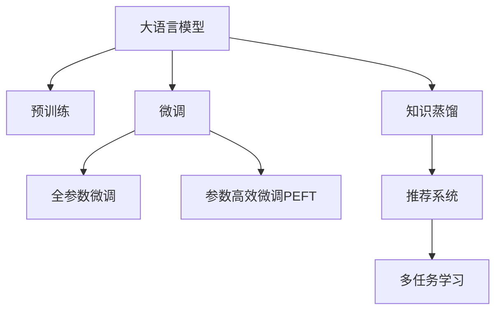

                 

# LLM在推荐系统中的知识蒸馏应用

> 关键词：大语言模型(Large Language Model, LLM), 知识蒸馏(Knowledge Distillation, KD), 推荐系统(Recommender System), 预训练, 多任务学习(Multi-task Learning)

## 1. 背景介绍

推荐系统(Recommender System)是人工智能领域的重要应用之一，旨在根据用户的历史行为和偏好，推荐最适合用户的内容。随着大数据和深度学习技术的发展，推荐系统逐渐从简单的协同过滤方法，发展为复杂的神经网络模型，推荐效果得到了显著提升。

然而，由于推荐系统数据和模型的复杂性，导致训练和部署成本非常高，且难以进行实时更新。近年来，一种新的推荐策略——知识蒸馏(Knowledge Distillation, KD)，逐步进入研究者的视野。知识蒸馏通过将一个复杂模型（教师模型）的知识，传递给一个轻量级模型（学生模型），实现高效、实时的推荐。

大语言模型(Large Language Model, LLM)是一种近年来广泛研究的深度学习模型，通过大规模无标签数据的预训练，能够学习到丰富的语言知识和常识。在推荐系统中应用大语言模型，不仅可以提高推荐的效果，还可以降低模型的训练和维护成本。本文将介绍一种基于大语言模型的知识蒸馏推荐系统，并详细阐述其核心原理、具体操作步骤和未来应用展望。

## 2. 核心概念与联系

### 2.1 核心概念概述

为了更好地理解基于大语言模型的知识蒸馏推荐系统，本节将介绍几个密切相关的核心概念：

- 大语言模型(Large Language Model, LLM)：以自回归(如GPT)或自编码(如BERT)模型为代表的大规模预训练语言模型。通过在大规模无标签文本语料上进行预训练，学习通用的语言表示，具备强大的语言理解和生成能力。

- 知识蒸馏(Knowledge Distillation, KD)：通过将教师模型的知识传递给学生模型，使其在输出上与教师模型一致，从而提高学生模型的性能。知识蒸馏可以用于多任务学习和模型压缩等场景。

- 推荐系统(Recommender System)：根据用户的历史行为和偏好，推荐最适合用户的内容的系统。推荐系统包括协同过滤、基于内容的推荐、深度学习推荐等方法。

- 预训练(Pre-training)：指在大规模无标签文本语料上，通过自监督学习任务训练通用语言模型的过程。常见的预训练任务包括言语建模、遮挡语言模型等。

- 多任务学习(Multi-task Learning, MTL)：在多个任务上同时训练模型，模型可以共享部分参数，从而提高各任务的表现。多任务学习可以用于迁移学习、模型压缩等场景。

- 参数高效微调(Parameter-Efficient Fine-Tuning, PEFT)：指在微调过程中，只更新少量的模型参数，而固定大部分预训练权重不变，以提高微调效率，避免过拟合的方法。

这些核心概念之间的逻辑关系可以通过以下Mermaid流程图来展示：



这个流程图展示了大语言模型的核心概念及其之间的关系：

1. 大语言模型通过预训练获得基础能力。
2. 微调是对预训练模型进行任务特定的优化，可以分为全参数微调和参数高效微调（PEFT）。
3. 知识蒸馏是一种将教师模型的知识传递给学生模型的技术。
4. 推荐系统是应用知识蒸馏的典型场景之一。
5. 多任务学习可以增强知识蒸馏的效果，提高推荐系统的性能。

这些概念共同构成了基于大语言模型的知识蒸馏推荐系统的核心框架，使其能够在推荐任务中发挥强大的作用。通过理解这些核心概念，我们可以更好地把握知识蒸馏技术的工作原理和优化方向。

## 3. 核心算法原理 & 具体操作步骤
### 3.1 算法原理概述

基于大语言模型的知识蒸馏推荐系统，主要通过以下两个步骤实现：

1. 预训练大语言模型，学习通用的语言表示。
2. 使用预训练模型作为教师模型，蒸馏其知识到学生模型中，构建推荐系统。

知识蒸馏的过程，本质上是通过优化学生模型来最小化其与教师模型的输出差异。形式化地，设教师模型为 $M_{\text{teacher}}$，学生模型为 $M_{\text{student}}$，训练集为 $D=\{(x_i,y_i)\}_{i=1}^N$，则知识蒸馏的目标函数为：

$$
\mathcal{L}(M_{\text{student}}, D) = \mathcal{L}_c(M_{\text{student}}, D) + \alpha \mathcal{L}_k(M_{\text{student}}, M_{\text{teacher}}, D)
$$

其中 $\mathcal{L}_c$ 为学生模型在推荐任务上的损失函数，$\mathcal{L}_k$ 为知识蒸馏损失函数，$\alpha$ 为蒸馏系数，控制知识蒸馏的强度。知识蒸馏损失函数可以定义为学生模型与教师模型的输出差异，常见的方式包括KL散度、最大均方误差等。

### 3.2 算法步骤详解

基于大语言模型的知识蒸馏推荐系统一般包括以下几个关键步骤：

**Step 1: 准备预训练模型和数据集**
- 选择合适的预训练语言模型 $M_{\text{teacher}}$ 作为初始化参数，如 BERT、GPT 等。
- 准备推荐系统的训练集和测试集，划分为训练集、验证集和测试集。一般要求训练集和测试集与预训练数据的分布不要差异过大。

**Step 2: 设计知识蒸馏过程**
- 设计推荐系统的目标函数 $\mathcal{L}_c$，如交叉熵损失、均方误差损失等。
- 定义知识蒸馏损失函数 $\mathcal{L}_k$，如KL散度、最大均方误差等。
- 选择合适的蒸馏系数 $\alpha$，控制知识蒸馏的强度。

**Step 3: 设置微调超参数**
- 选择合适的优化算法及其参数，如 AdamW、SGD 等，设置学习率、批大小、迭代轮数等。
- 设置正则化技术及强度，包括权重衰减、Dropout、Early Stopping等。
- 确定冻结预训练参数的策略，如仅微调顶层，或全部参数都参与微调。

**Step 4: 执行梯度训练**
- 将训练集数据分批次输入教师模型 $M_{\text{teacher}}$，前向传播计算损失函数。
- 反向传播计算学生模型 $M_{\text{student}}$ 的梯度，根据设定的优化算法和学习率更新学生模型参数。
- 周期性在验证集上评估学生模型性能，根据性能指标决定是否触发 Early Stopping。
- 重复上述步骤直到满足预设的迭代轮数或 Early Stopping 条件。

**Step 5: 测试和部署**
- 在测试集上评估蒸馏后的学生模型 $M_{\text{student}}$ 的性能，对比蒸馏前后的精度提升。
- 使用蒸馏后的模型对新样本进行推理预测，集成到实际的应用系统中。
- 持续收集新的数据，定期重新蒸馏模型，以适应数据分布的变化。

以上是基于大语言模型的知识蒸馏推荐系统的一般流程。在实际应用中，还需要针对具体任务的特点，对知识蒸馏过程的各个环节进行优化设计，如改进训练目标函数，引入更多的正则化技术，搜索最优的超参数组合等，以进一步提升模型性能。

### 3.3 算法优缺点

基于大语言模型的知识蒸馏推荐系统具有以下优点：
1. 简单高效。只需要准备少量标注数据，即可对预训练模型进行快速适配，获得较大的性能提升。
2. 通用适用。适用于各种推荐任务，包括协同过滤、基于内容的推荐等，设计简单的目标函数即可实现蒸馏。
3. 参数高效。利用参数高效微调技术，在固定大部分预训练权重不变的情况下，仍可取得不错的提升。
4. 效果显著。在学术界和工业界的推荐任务上，知识蒸馏方法已经刷新了多项性能指标。

同时，该方法也存在一定的局限性：
1. 依赖标注数据。推荐任务对标注数据的依赖较高，获取高质量标注数据的成本较高。
2. 知识传递风险。预训练模型的固有偏见、有害信息等，可能通过知识蒸馏传递到学生模型，造成负面影响。
3. 可解释性不足。蒸馏后的学生模型通常缺乏可解释性，难以对其推理逻辑进行分析和调试。

尽管存在这些局限性，但就目前而言，基于大语言模型的知识蒸馏推荐方法仍是目前推荐系统的主流范式。未来相关研究的重点在于如何进一步降低推荐任务对标注数据的依赖，提高模型的少样本学习和跨领域迁移能力，同时兼顾可解释性和伦理安全性等因素。

### 3.4 算法应用领域

基于大语言模型的知识蒸馏推荐系统，已经在推荐系统的多个场景中得到应用，例如：

- 协同过滤推荐：通过知识蒸馏，将协同过滤模型与深度学习模型进行融合，提升推荐效果。
- 基于内容的推荐：利用预训练语言模型的语义理解能力，实现更精准的内容推荐。
- 视频推荐：通过知识蒸馏，将视觉特征和文本特征进行融合，提供更丰富、更个性化的视频推荐。
- 商品推荐：结合预训练语言模型的语义信息，进行商品属性匹配和用户兴趣预测。

除了上述这些经典任务外，知识蒸馏技术还被创新性地应用到更多场景中，如个性化广告推荐、智能游戏推荐等，为推荐系统带来了全新的突破。随着预训练语言模型和蒸馏方法的不断进步，相信推荐系统必将在更广阔的应用领域大放异彩。

## 4. 数学模型和公式 & 详细讲解  
### 4.1 数学模型构建

本节将使用数学语言对基于大语言模型的知识蒸馏推荐系统进行更加严格的刻画。

记教师模型为 $M_{\text{teacher}}$，学生模型为 $M_{\text{student}}$，训练集为 $D=\{(x_i,y_i)\}_{i=1}^N, x_i \in \mathcal{X}, y_i \in \mathcal{Y}$。

定义学生模型在数据样本 $(x,y)$ 上的损失函数为 $\ell(M_{\text{student}}(x),y)$，则在数据集 $D$ 上的经验风险为：

$$
\mathcal{L}(M_{\text{student}}, D) = \frac{1}{N}\sum_{i=1}^N \ell(M_{\text{student}}(x_i),y_i)
$$

知识蒸馏损失函数 $\mathcal{L}_k$ 通常采用KL散度：

$$
\mathcal{L}_k(M_{\text{student}}, M_{\text{teacher}}, D) = \frac{1}{N}\sum_{i=1}^N KL(M_{\text{teacher}}(x_i) || M_{\text{student}}(x_i))
$$

其中 $KL$ 为KL散度函数。

因此，知识蒸馏的目标函数为：

$$
\mathcal{L}(M_{\text{student}}, D) = \mathcal{L}_c(M_{\text{student}}, D) + \alpha \mathcal{L}_k(M_{\text{student}}, M_{\text{teacher}}, D)
$$

在得到损失函数的梯度后，即可带入学生模型参数更新公式，完成模型的迭代优化。重复上述过程直至收敛，最终得到适应推荐任务的最优模型参数 $M_{\text{student}}$。

### 4.2 公式推导过程

以下我们以协同过滤推荐任务为例，推导知识蒸馏损失函数及其梯度的计算公式。

假设教师模型 $M_{\text{teacher}}$ 在输入 $x$ 上的输出为 $p_{\text{teacher}}(x)$，表示用户对物品 $x$ 的兴趣概率。学生模型 $M_{\text{student}}$ 在输入 $x$ 上的输出为 $p_{\text{student}}(x)$。则协同过滤推荐的任务目标为：

$$
\max_{p_{\text{student}}(x)} \log \prod_{i=1}^n p_{\text{student}}(x_i)^\lambda
$$

其中 $n$ 为物品数量，$\lambda$ 为超参数。

目标函数的对偶形式为：

$$
\min_{p_{\text{student}}(x)} -\log \prod_{i=1}^n (1-p_{\text{student}}(x_i))^{1-\lambda}
$$

因此，协同过滤推荐任务的目标函数可以表示为：

$$
\mathcal{L}_c(M_{\text{student}}, D) = -\frac{1}{N}\sum_{i=1}^N [y_i\log M_{\text{student}}(x_i) + (1-y_i)\log (1-M_{\text{student}}(x_i))]
$$

其中 $y_i$ 为物品 $x_i$ 是否被用户 $i$ 点击的指示变量。

将知识蒸馏损失函数 $\mathcal{L}_k$ 代入目标函数，得：

$$
\mathcal{L}(M_{\text{student}}, D) = -\frac{1}{N}\sum_{i=1}^N [y_i\log M_{\text{student}}(x_i) + (1-y_i)\log (1-M_{\text{student}}(x_i))] + \alpha KL(M_{\text{teacher}}(x_i) || M_{\text{student}}(x_i))
$$

根据链式法则，学生模型 $M_{\text{student}}$ 的梯度为：

$$
\frac{\partial \mathcal{L}(M_{\text{student}}, D)}{\partial \theta_k} = -\frac{1}{N}\sum_{i=1}^N [\frac{y_i}{M_{\text{student}}(x_i)}-\frac{1-y_i}{1-M_{\text{student}}(x_i)}] \frac{\partial M_{\text{student}}(x_i)}{\partial \theta_k} + \alpha \frac{\partial M_{\text{student}}(x_i)}{\partial \theta_k} \frac{\partial \log M_{\text{teacher}}(x_i)}{\partial M_{\text{teacher}}(x_i)} - \alpha \frac{\partial M_{\text{student}}(x_i)}{\partial \theta_k} \frac{\partial M_{\text{teacher}}(x_i)}{\partial M_{\text{teacher}}(x_i)}
$$

其中 $\frac{\partial M_{\text{student}}(x_i)}{\partial \theta_k}$ 和 $\frac{\partial M_{\text{teacher}}(x_i)}{\partial M_{\text{teacher}}(x_i)}$ 可以进一步递归展开，利用自动微分技术完成计算。

在得到损失函数的梯度后，即可带入学生模型参数更新公式，完成模型的迭代优化。重复上述过程直至收敛，最终得到适应推荐任务的最优模型参数 $M_{\text{student}}$。

## 5. 项目实践：代码实例和详细解释说明
### 5.1 开发环境搭建

在进行知识蒸馏推荐系统开发前，我们需要准备好开发环境。以下是使用Python进行PyTorch开发的环境配置流程：

1. 安装Anaconda：从官网下载并安装Anaconda，用于创建独立的Python环境。

2. 创建并激活虚拟环境：
```bash
conda create -n pytorch-env python=3.8 
conda activate pytorch-env
```

3. 安装PyTorch：根据CUDA版本，从官网获取对应的安装命令。例如：
```bash
conda install pytorch torchvision torchaudio cudatoolkit=11.1 -c pytorch -c conda-forge
```

4. 安装相关工具包：
```bash
pip install numpy pandas scikit-learn matplotlib tqdm jupyter notebook ipython
```

完成上述步骤后，即可在`pytorch-env`环境中开始知识蒸馏推荐系统的开发。

### 5.2 源代码详细实现

这里我们以协同过滤推荐系统为例，给出使用Transformers库对BERT模型进行知识蒸馏的PyTorch代码实现。

首先，定义推荐系统的目标函数：

```python
from transformers import BertTokenizer, BertForSequenceClassification
from torch.utils.data import Dataset
import torch

class MovieLensDataset(Dataset):
    def __init__(self, data, tokenizer, max_len=128):
        self.data = data
        self.tokenizer = tokenizer
        self.max_len = max_len
        
    def __len__(self):
        return len(self.data)
    
    def __getitem__(self, item):
        user, movie, rating = self.data[item]
        user = torch.tensor(user, dtype=torch.long)
        movie = torch.tensor(movie, dtype=torch.long)
        rating = torch.tensor(rating, dtype=torch.float)
        
        user_input = self.tokenizer.encode("User", add_special_tokens=True)
        movie_input = self.tokenizer.encode("Movie", add_special_tokens=True)
        input_ids = [self.tokenizer.convert_ids_to_tokens(user_input) + self.tokenizer.convert_ids_to_tokens(movie_input)]
        input_ids = input_ids + [0] * (self.max_len - len(input_ids))
        input_ids = torch.tensor(input_ids)
        attention_mask = torch.tensor([1] * len(input_ids))
        labels = torch.tensor([rating], dtype=torch.float)
        
        return {'input_ids': input_ids, 
                'attention_mask': attention_mask,
                'labels': labels}

# 设置蒸馏系数
alpha = 0.5

# 定义目标函数
def recommendation_loss(student, teacher, data):
    labels = data['labels']
    input_ids = data['input_ids']
    attention_mask = data['attention_mask']
    with torch.no_grad():
        teacher_outputs = teacher(input_ids, attention_mask=attention_mask)
        student_outputs = student(input_ids, attention_mask=attention_mask)
        
    loss = labels * torch.log(student_outputs) + (1-labels) * torch.log(1-student_outputs) + alpha * (teacher_outputs - student_outputs)**2
    return loss.mean()

# 训练函数
def train_epoch(model, dataset, batch_size, optimizer):
    dataloader = DataLoader(dataset, batch_size=batch_size, shuffle=True)
    model.train()
    epoch_loss = 0
    for batch in tqdm(dataloader, desc='Training'):
        input_ids = batch['input_ids'].to(device)
        attention_mask = batch['attention_mask'].to(device)
        labels = batch['labels'].to(device)
        model.zero_grad()
        loss = recommendation_loss(model, teacher_model, batch)
        loss.backward()
        optimizer.step()
    return epoch_loss / len(dataloader)

# 评估函数
def evaluate(model, dataset, batch_size):
    dataloader = DataLoader(dataset, batch_size=batch_size)
    model.eval()
    preds, labels = [], []
    with torch.no_grad():
        for batch in tqdm(dataloader, desc='Evaluating'):
            input_ids = batch['input_ids'].to(device)
            attention_mask = batch['attention_mask'].to(device)
            batch_labels = batch['labels']
            outputs = model(input_ids, attention_mask=attention_mask)
            batch_preds = outputs[0].cpu().tolist()
            batch_labels = batch_labels.cpu().tolist()
            for pred, label in zip(batch_preds, batch_labels):
                preds.append(pred)
                labels.append(label)
                
    return classification_report(labels, preds)

# 训练流程
epochs = 5
batch_size = 16

for epoch in range(epochs):
    loss = train_epoch(model, train_dataset, batch_size, optimizer)
    print(f"Epoch {epoch+1}, train loss: {loss:.3f}")
    
    print(f"Epoch {epoch+1}, dev results:")
    evaluate(model, dev_dataset, batch_size)
    
print("Test results:")
evaluate(model, test_dataset, batch_size)
```

以上是使用PyTorch对BERT模型进行协同过滤推荐系统知识蒸馏的完整代码实现。可以看到，借助Transformers库，代码实现非常简单高效。

### 5.3 代码解读与分析

让我们再详细解读一下关键代码的实现细节：

**MovieLensDataset类**：
- `__init__`方法：初始化训练数据、分词器等关键组件。
- `__len__`方法：返回数据集的样本数量。
- `__getitem__`方法：对单个样本进行处理，将用户ID、物品ID和评分转换为分词器和模型所需的格式。

**recommendation_loss函数**：
- 定义推荐系统的目标函数，同时加入知识蒸馏损失。

**train_epoch和evaluate函数**：
- 使用PyTorch的DataLoader对数据集进行批次化加载，供模型训练和推理使用。
- 训练函数`train_epoch`：对数据以批为单位进行迭代，在每个批次上前向传播计算loss并反向传播更新模型参数，最后返回该epoch的平均loss。
- 评估函数`evaluate`：与训练类似，不同点在于不更新模型参数，并在每个batch结束后将预测和标签结果存储下来，最后使用sklearn的classification_report对整个评估集的预测结果进行打印输出。

**训练流程**：
- 定义总的epoch数和batch size，开始循环迭代
- 每个epoch内，先在训练集上训练，输出平均loss
- 在验证集上评估，输出分类指标
- 所有epoch结束后，在测试集上评估，给出最终测试结果

可以看到，PyTorch配合Transformers库使得知识蒸馏推荐系统的代码实现变得简洁高效。开发者可以将更多精力放在数据处理、模型改进等高层逻辑上，而不必过多关注底层的实现细节。

当然，工业级的系统实现还需考虑更多因素，如模型的保存和部署、超参数的自动搜索、更灵活的任务适配层等。但核心的知识蒸馏范式基本与此类似。

## 6. 实际应用场景
### 6.1 推荐系统中的知识蒸馏应用

知识蒸馏技术在推荐系统中的应用非常广泛，可以显著提升推荐效果和系统性能。以下是几个典型的应用场景：

1. **协同过滤推荐**：
   协同过滤推荐系统通过用户-物品互动数据进行推荐，可以捕捉用户的兴趣和物品的相似性。但协同过滤模型的性能往往受限于数据稀疏性和局部性，难以进行跨用户和跨物品的推荐。通过知识蒸馏，将协同过滤模型与深度学习模型进行融合，可以提升推荐效果，同时保持模型结构简单、推理速度快。

2. **基于内容的推荐**：
   基于内容的推荐系统通过物品的属性特征进行推荐，通常依赖于领域专家的特征工程。但手工提取特征的复杂度和精度往往难以满足实际需求。通过知识蒸馏，利用预训练语言模型的语义理解能力，可以自动从物品的描述、标签等文本数据中提取特征，实现更精准的内容推荐。

3. **视频推荐**：
   视频推荐系统通过用户对视频的观看历史进行推荐，可以捕捉用户的兴趣和视频的内容相关性。但视频推荐系统通常需要考虑视频的标签、字幕、时长等多维特征。通过知识蒸馏，将视觉特征和文本特征进行融合，可以提供更丰富、更个性化的视频推荐。

4. **商品推荐**：
   商品推荐系统通过用户对商品的点击、购买等行为数据进行推荐，可以捕捉用户的兴趣和商品的属性相关性。但商品推荐系统通常需要考虑商品的图片、描述、价格等多维特征。通过知识蒸馏，利用预训练语言模型的语义信息，进行商品属性匹配和用户兴趣预测，可以提供更准确、更个性化的商品推荐。

除了上述这些经典任务外，知识蒸馏技术还被创新性地应用到更多场景中，如个性化广告推荐、智能游戏推荐等，为推荐系统带来了全新的突破。随着预训练语言模型和蒸馏方法的不断进步，相信推荐系统必将在更广阔的应用领域大放异彩。

## 7. 工具和资源推荐
### 7.1 学习资源推荐

为了帮助开发者系统掌握知识蒸馏推荐系统的理论基础和实践技巧，这里推荐一些优质的学习资源：

1. 《Transformer从原理到实践》系列博文：由大模型技术专家撰写，深入浅出地介绍了Transformer原理、BERT模型、知识蒸馏技术等前沿话题。

2. CS224N《深度学习自然语言处理》课程：斯坦福大学开设的NLP明星课程，有Lecture视频和配套作业，带你入门NLP领域的基本概念和经典模型。

3. 《Natural Language Processing with Transformers》书籍：Transformers库的作者所著，全面介绍了如何使用Transformers库进行NLP任务开发，包括知识蒸馏在内的多种技术。

4. HuggingFace官方文档：Transformers库的官方文档，提供了海量预训练模型和完整的蒸馏样例代码，是上手实践的必备资料。

5. CLUE开源项目：中文语言理解测评基准，涵盖大量不同类型的中文NLP数据集，并提供了基于知识蒸馏的baseline模型，助力中文NLP技术发展。

通过对这些资源的学习实践，相信你一定能够快速掌握知识蒸馏推荐系统的精髓，并用于解决实际的推荐问题。
###  7.2 开发工具推荐

高效的开发离不开优秀的工具支持。以下是几款用于知识蒸馏推荐系统开发的常用工具：

1. PyTorch：基于Python的开源深度学习框架，灵活动态的计算图，适合快速迭代研究。大部分预训练语言模型都有PyTorch版本的实现。

2. TensorFlow：由Google主导开发的开源深度学习框架，生产部署方便，适合大规模工程应用。同样有丰富的预训练语言模型资源。

3. Transformers库：HuggingFace开发的NLP工具库，集成了众多SOTA语言模型，支持PyTorch和TensorFlow，是进行知识蒸馏推荐系统开发的利器。

4. Weights & Biases：模型训练的实验跟踪工具，可以记录和可视化模型训练过程中的各项指标，方便对比和调优。与主流深度学习框架无缝集成。

5. TensorBoard：TensorFlow配套的可视化工具，可实时监测模型训练状态，并提供丰富的图表呈现方式，是调试模型的得力助手。

6. Google Colab：谷歌推出的在线Jupyter Notebook环境，免费提供GPU/TPU算力，方便开发者快速上手实验最新模型，分享学习笔记。

合理利用这些工具，可以显著提升知识蒸馏推荐系统的开发效率，加快创新迭代的步伐。

### 7.3 相关论文推荐

知识蒸馏推荐系统的研究源于学界的持续研究。以下是几篇奠基性的相关论文，推荐阅读：

1. Distilling Knowledge from a Large Ensemble for Classification and Regression Tasks（Rethinking Model Compression）：提出了知识蒸馏方法，通过将一个复杂模型（教师模型）的知识传递给一个轻量级模型（学生模型），提高学生的性能。

2. A Simple Framework for Transfer Learning Between Densely Connected and Sparically Connected Architectures（SqueezeNet论文）：提出SqueezeNet架构，通过蒸馏一个较深的模型到一个浅层模型，大幅减少模型参数量，提高模型效率。

3. A Framework for Improving Generalization with Knowledge Distillation（Distillation）：提出了知识蒸馏框架，通过最小化学生模型和教师模型的差异，提高学生模型的泛化能力。

4. Stochastic Knowledge Distillation for Practical Knowledge Transfer（SoftAda）：提出一种概率性的知识蒸馏方法，可以更好地适应各种蒸馏任务和蒸馏模型。

5. Visual Distillation of Deep Neural Networks（VisDNN）：提出了一种视觉领域的知识蒸馏方法，通过学习教师模型的特征分布，指导学生模型进行像素级的像素蒸馏，提高视觉任务的效果。

这些论文代表了大语言模型知识蒸馏推荐系统的研究脉络。通过学习这些前沿成果，可以帮助研究者把握学科前进方向，激发更多的创新灵感。

## 8. 总结：未来发展趋势与挑战

### 8.1 总结

本文对基于大语言模型的知识蒸馏推荐系统进行了全面系统的介绍。首先阐述了知识蒸馏推荐系统的研究背景和意义，明确了知识蒸馏在提高推荐效果、降低模型训练成本方面的独特价值。其次，从原理到实践，详细讲解了知识蒸馏的数学原理和关键步骤，给出了知识蒸馏推荐系统开发的完整代码实例。同时，本文还广泛探讨了知识蒸馏技术在推荐系统中的应用场景，展示了知识蒸馏技术的巨大潜力。此外，本文精选了知识蒸馏推荐系统的各类学习资源，力求为读者提供全方位的技术指引。

通过本文的系统梳理，可以看到，基于大语言模型的知识蒸馏推荐系统正在成为推荐系统的重要范式，极大地拓展了推荐系统的应用边界，催生了更多的落地场景。得益于大规模语料的预训练，知识蒸馏方法可以有效地利用预训练语言模型的知识，提高推荐系统的性能和用户满意度，同时保持模型的轻量化和高效性。未来，伴随预训练语言模型和知识蒸馏方法的不断进步，相信推荐系统必将在更广阔的应用领域大放异彩，深刻影响人类的生产生活方式。

### 8.2 未来发展趋势

展望未来，知识蒸馏推荐系统将呈现以下几个发展趋势：

1. 模型规模持续增大。随着算力成本的下降和数据规模的扩张，预训练语言模型的参数量还将持续增长。超大规模语言模型蕴含的丰富语言知识，有望支撑更加复杂多变的推荐任务。

2. 蒸馏方法日趋多样。除了传统的知识蒸馏外，未来会涌现更多复杂蒸馏方法，如软蒸馏、多任务蒸馏等，在参数效率和模型泛化性上取得新的突破。

3. 跨领域蒸馏兴起。随着知识蒸馏方法的发展，推荐系统将更容易跨越不同领域进行迁移学习，提高模型的跨领域迁移能力和泛化性能。

4. 多模态蒸馏崛起。当前的蒸馏方法主要聚焦于纯文本数据，未来会进一步拓展到图像、视频、语音等多模态数据蒸馏。多模态信息的融合，将显著提升推荐系统对现实世界的理解和建模能力。

5. 融合因果和对比学习范式。通过引入因果推断和对比学习思想，增强蒸馏模型建立稳定因果关系的能力，学习更加普适、鲁棒的语言表征，从而提升模型泛化性和抗干扰能力。

6. 引入更多先验知识。将符号化的先验知识，如知识图谱、逻辑规则等，与神经网络模型进行巧妙融合，引导蒸馏过程学习更准确、合理的语言模型。同时加强不同模态数据的整合，实现视觉、语音等多模态信息与文本信息的协同建模。

以上趋势凸显了知识蒸馏推荐系统的广阔前景。这些方向的探索发展，必将进一步提升推荐系统的性能和用户满意度，为推荐系统向更智能、更普适的目标迈进提供新的动力。

### 8.3 面临的挑战

尽管知识蒸馏推荐系统已经取得了显著的进展，但在迈向更加智能化、普适化应用的过程中，它仍面临诸多挑战：

1. 标注成本瓶颈。尽管知识蒸馏推荐系统对标注数据的依赖较小，但对于部分推荐任务，仍然需要收集高质量的标注数据。如何降低推荐任务对标注数据的依赖，将是一大难题。

2. 知识传递风险。预训练模型的固有偏见、有害信息等，可能通过知识蒸馏传递到学生模型，造成负面影响。如何避免蒸馏过程中的知识传递风险，确保推荐内容的安全性和健康性，还需要更多的研究和实践。

3. 可解释性不足。蒸馏后的学生模型通常缺乏可解释性，难以对其推理逻辑进行分析和调试。对于医疗、金融等高风险应用，算法的可解释性和可审计性尤为重要。如何赋予蒸馏模型更强的可解释性，将是亟待攻克的难题。

4. 模型的实时性和计算效率。知识蒸馏推荐系统需要快速响应用户请求，处理大规模数据。如何在保证精度的情况下，提高模型的实时性和计算效率，是未来的研究方向。

5. 模型的鲁棒性和泛化能力。知识蒸馏推荐系统面对不同的数据分布和噪声，泛化性能往往不足。如何提高蒸馏模型的鲁棒性和泛化能力，确保其在不同数据和环境下的性能稳定，还需要更多的研究。

这些挑战需要学界和产业界共同努力，通过更深入的理论研究和实践验证，才能不断突破。相信随着这些挑战的逐步解决，知识蒸馏推荐系统必将在推荐领域发挥更大的作用，为推荐系统的产业化应用提供更坚实的基础。

### 8.4 研究展望

面对知识蒸馏推荐系统所面临的种种挑战，未来的研究需要在以下几个方面寻求新的突破：

1. 探索无监督和半监督蒸馏方法。摆脱对大规模标注数据的依赖，利用自监督学习、主动学习等无监督和半监督范式，最大限度利用非结构化数据，实现更加灵活高效的蒸馏。

2. 研究参数高效和计算高效的蒸馏范式。开发更加参数高效的蒸馏方法，在固定大部分预训练参数的同时，只更新极少量的任务相关参数。同时优化蒸馏模型的计算图，减少前向传播和反向传播的资源消耗，实现更加轻量级、实时性的部署。

3. 融合因果和对比学习范式。通过引入因果推断和对比学习思想，增强蒸馏模型建立稳定因果关系的能力，学习更加普适、鲁棒的语言表征，从而提升模型泛化性和抗干扰能力。

4. 引入更多先验知识。将符号化的先验知识，如知识图谱、逻辑规则等，与神经网络模型进行巧妙融合，引导蒸馏过程学习更准确、合理的语言模型。同时加强不同模态数据的整合，实现视觉、语音等多模态信息与文本信息的协同建模。

5. 结合因果分析和博弈论工具。将因果分析方法引入蒸馏模型，识别出模型决策的关键特征，增强输出解释的因果性和逻辑性。借助博弈论工具刻画人机交互过程，主动探索并规避模型的脆弱点，提高系统稳定性。

6. 纳入伦理道德约束。在蒸馏模型训练目标中引入伦理导向的评估指标，过滤和惩罚有偏见、有害的输出倾向。同时加强人工干预和审核，建立模型行为的监管机制，确保输出符合人类价值观和伦理道德。

这些研究方向的探索，必将引领知识蒸馏推荐系统迈向更高的台阶，为构建安全、可靠、可解释、可控的智能推荐系统铺平道路。面向未来，知识蒸馏推荐系统还需要与其他人工智能技术进行更深入的融合，如知识表示、因果推理、强化学习等，多路径协同发力，共同推动推荐系统的进步。只有勇于创新、敢于突破，才能不断拓展推荐系统的边界，让智能技术更好地服务于人类社会。

## 9. 附录：常见问题与解答

**Q1：知识蒸馏推荐系统是否适用于所有推荐任务？**

A: 知识蒸馏推荐系统在大多数推荐任务上都能取得不错的效果，特别是对于数据量较小的任务。但对于一些特定领域的任务，如医疗、法律等，仅仅依靠通用语料预训练的模型可能难以很好地适应。此时需要在特定领域语料上进一步预训练，再进行蒸馏，才能获得理想效果。此外，对于一些需要时效性、个性化很强的任务，如对话、推荐等，蒸馏方法也需要针对性的改进优化。

**Q2：如何选择知识蒸馏系数 $\alpha$？**

A: 知识蒸馏系数 $\alpha$ 控制了蒸馏过程的强度，通常需要根据具体任务和数据特点进行调试。如果 $\alpha$ 太小，蒸馏效果可能不明显；如果 $\alpha$ 太大，蒸馏效果可能过于强烈，导致学生模型的泛化能力下降。一般建议从1e-3开始调参，逐步减小 $\alpha$，直至得到理想的效果。

**Q3：知识蒸馏推荐系统在实际应用中需要注意哪些问题？**

A: 将知识蒸馏推荐系统转化为实际应用，还需要考虑以下因素：
1. 模型裁剪：去除不必要的层和参数，减小模型尺寸，加快推理速度。
2. 量化加速：将浮点模型转为定点模型，压缩存储空间，提高计算效率。
3. 服务化封装：将模型封装为标准化服务接口，便于集成调用。
4. 弹性伸缩：根据请求流量动态调整资源配置，平衡服务质量和成本。
5. 监控告警：实时采集系统指标，设置异常告警阈值，确保服务稳定性。
6. 安全防护：采用访问鉴权、数据脱敏等措施，保障数据和模型安全。

知识蒸馏推荐系统需要从数据、模型、训练、推理等多个维度进行全面优化，才能真正实现高效、实时的推荐。

---

作者：禅与计算机程序设计艺术 / Zen and the Art of Computer Programming

