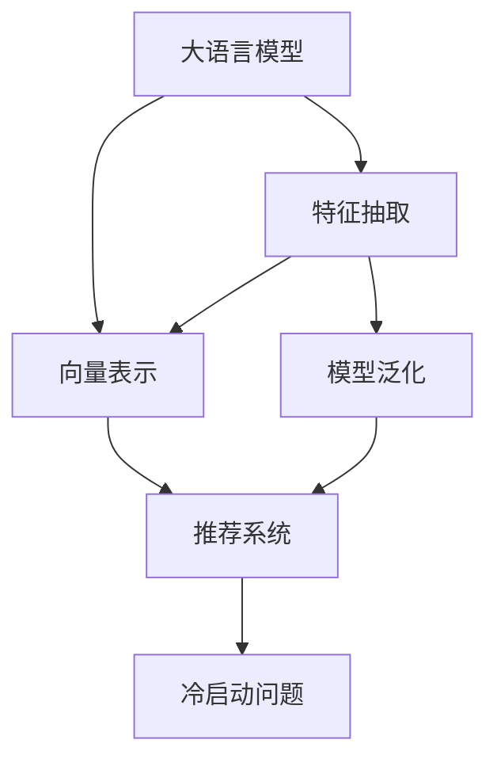

                 

## 1. 背景介绍

### 1.1 问题由来
在过去数年间，大语言模型（LLM）已经成为自然语言处理（NLP）领域的主流，其强大的文本理解和生成能力使其在多个应用场景中表现出色。然而，当大语言模型被引入推荐系统（Recommendation System, RS）时，其效果似乎并未达到预期。尽管在某些简单场景下大语言模型可以取得不错的效果，但在复杂推荐场景中，如电商、视频流媒体、音乐推荐等，其表现往往不尽人意。原因何在？本文将通过大语言模型在推荐系统中的局限性分析，探讨背后的工程和成本因素。

### 1.2 问题核心关键点
大语言模型在推荐系统中的应用，本质上是一种基于文本语义信息的特征抽取和召回方法。其核心在于通过自然语言处理技术，将用户的兴趣描述转化为高维特征向量，用于在物品库中召回相关物品。然而，在实际应用中，大语言模型面临以下核心问题：

1. **高昂的模型训练和微调成本**：预训练大模型通常需要大量计算资源和标注数据，微调过程也需消耗大量时间和标注数据。
2. **特征抽取与向量表示问题**：大语言模型如何高效地从用户描述中提取有用特征，生成有效的向量表示。
3. **模型泛化能力不足**：模型在特定领域或冷启动用户上的泛化能力较弱，推荐效果不佳。
4. **计算和存储成本**：大语言模型通常具有庞大的参数量，推理计算和存储成本较高。

### 1.3 问题研究意义
尽管大语言模型在推荐系统中的应用具有诸多局限，但它仍是一种极具潜力的推荐方法。深入研究这些局限性，不仅有助于提升推荐系统的性能，还可以推动大语言模型在实际应用中的优化和改进。本文通过技术分析、案例研究和工程实践，揭示大语言模型在推荐系统中的局限性，并探讨可能的优化策略。

## 2. 核心概念与联系

### 2.1 核心概念概述

为更好地理解大语言模型在推荐系统中的应用，本文将介绍几个关键概念：

- **大语言模型（Large Language Model, LLM）**：通过自监督学习任务在大规模无标签文本数据上进行预训练，学习通用语言表示的深度学习模型。
- **推荐系统（Recommendation System, RS）**：通过用户行为数据、物品属性信息等，预测用户对物品的兴趣，推荐相关物品的系统。
- **特征抽取（Feature Extraction）**：从用户兴趣描述、物品属性等文本数据中提取有意义的特征，用于生成高维向量。
- **向量表示（Vector Representation）**：将文本数据转化为高维向量，便于模型计算和比较。
- **模型泛化（Model Generalization）**：模型在未见过的数据上的表现能力。
- **冷启动问题（Cold Start Problem）**：新用户或新物品在推荐系统中没有足够数据时，难以进行推荐。

这些概念之间的逻辑关系可以通过以下Mermaid流程图来展示：



这个流程图展示了大语言模型在推荐系统中的应用流程：

1. 大语言模型通过自监督学习获得通用语言表示。
2. 通过特征抽取技术，从用户兴趣描述、物品属性中提取特征。
3. 将提取的特征转化为向量表示，用于计算和比较。
4. 基于向量表示的相似性，构建推荐模型。
5. 在冷启动场景中，模型的泛化能力将直接影响推荐效果。

## 3. 核心算法原理 & 具体操作步骤

### 3.1 算法原理概述

大语言模型在推荐系统中的应用，其核心思想是通过自然语言处理技术，将用户兴趣描述或物品属性转化为高维特征向量，用于在物品库中召回相关物品。

假设用户兴趣描述为 $x$，物品属性为 $y$，大语言模型通过预训练学到的语言表示 $f(x)$ 和 $f(y)$，将它们映射为高维向量 $u$ 和 $v$。模型通过计算向量 $u$ 和 $v$ 之间的相似度 $sim(u, v)$，用于度量用户与物品之间的兴趣匹配程度，从而进行推荐。

基于大语言模型的推荐系统一般包括以下几个关键步骤：

1. **预训练模型选择**：选择适合推荐任务的预训练语言模型。
2. **特征抽取与向量生成**：从用户描述或物品属性中提取特征，生成高维向量。
3. **相似度计算**：计算用户兴趣描述和物品属性向量之间的相似度。
4. **召回和排序**：基于相似度排名，推荐最相关的物品。

### 3.2 算法步骤详解

以下将详细讲解基于大语言模型的推荐系统算法步骤：

**Step 1: 准备预训练模型和数据集**
- 选择合适的预训练语言模型 $M_{\theta}$，如BERT、GPT等。
- 准备用户兴趣描述或物品属性数据集 $D=\{(x_i, y_i)\}_{i=1}^N$，其中 $x_i$ 为兴趣描述，$y_i$ 为物品属性。

**Step 2: 特征抽取与向量生成**
- 定义特征提取函数 $f: \mathcal{X} \rightarrow \mathbb{R}^d$，将兴趣描述或属性转换为高维向量 $u$ 或 $v$。
- 使用预训练模型 $M_{\theta}$，将 $u$ 和 $v$ 映射为低维向量 $u'$ 和 $v'$。

**Step 3: 相似度计算**
- 计算向量 $u'$ 和 $v'$ 之间的余弦相似度 $sim(u', v') = \frac{u' \cdot v'}{\|u'\|\|v'\|}$。
- 根据相似度 $sim(u', v')$ 对物品进行排序，推荐最相关的物品。

**Step 4: 模型训练与优化**
- 使用少量标注数据训练模型，优化模型参数以提升推荐效果。
- 定期更新模型，以保证模型的长期有效性。

**Step 5: 评估与迭代**
- 在测试集上评估模型性能，如准确率、召回率等指标。
- 根据评估结果，调整特征提取函数和模型参数，迭代优化推荐模型。

### 3.3 算法优缺点

大语言模型在推荐系统中的应用具有以下优点：

1. **通用性强**：大语言模型能够处理多种类型的文本数据，适用于不同类型的推荐任务。
2. **文本理解能力强**：通过自然语言处理技术，可以理解复杂的文本描述，提取有意义的特征。
3. **动态更新**：随着新数据和任务的增加，模型可以不断更新，适应新的推荐需求。

但同时，大语言模型在推荐系统中也存在一些缺点：

1. **计算和存储成本高**：大语言模型的参数量通常很大，计算和存储成本较高。
2. **特征提取困难**：如何高效地从文本数据中提取有用特征，生成有效的向量表示，是大语言模型面临的主要问题。
3. **泛化能力不足**：在特定领域或冷启动用户上，大语言模型的泛化能力较弱，推荐效果不佳。
4. **训练和微调成本高**：需要大量的计算资源和标注数据，训练和微调过程耗时较长。

### 3.4 算法应用领域

大语言模型在推荐系统中的应用，可以广泛用于以下领域：

- **电商推荐**：根据用户浏览、点击、购买等行为数据，推荐相关商品。
- **视频流媒体推荐**：根据用户观看历史、评分、评论等数据，推荐相关视频。
- **音乐推荐**：根据用户听歌历史、评分、评论等数据，推荐相关音乐。
- **新闻推荐**：根据用户阅读历史、兴趣描述等数据，推荐相关新闻。
- **社交网络推荐**：根据用户兴趣描述、好友关系等数据，推荐相关内容。

## 4. 数学模型和公式 & 详细讲解 & 举例说明

### 4.1 数学模型构建

本节将使用数学语言对基于大语言模型的推荐系统进行更加严格的刻画。

假设用户兴趣描述为 $x$，物品属性为 $y$，大语言模型通过预训练学到的语言表示 $f(x)$ 和 $f(y)$，将它们映射为高维向量 $u$ 和 $v$。模型通过计算向量 $u$ 和 $v$ 之间的余弦相似度 $sim(u, v)$，用于度量用户与物品之间的兴趣匹配程度，从而进行推荐。

### 4.2 公式推导过程

以下是基于大语言模型的推荐系统公式推导过程：

假设用户兴趣描述 $x$ 经过预训练模型 $M_{\theta}$ 后，生成高维向量 $u$：

$$
u = M_{\theta}(x)
$$

同样地，物品属性 $y$ 经过预训练模型 $M_{\theta}$ 后，生成高维向量 $v$：

$$
v = M_{\theta}(y)
$$

定义余弦相似度 $sim(u, v)$ 为：

$$
sim(u, v) = \frac{u \cdot v}{\|u\|\|v\|}
$$

其中 $\cdot$ 表示向量点乘，$\|u\|$ 和 $\|v\|$ 分别表示向量 $u$ 和 $v$ 的欧几里得范数。

根据余弦相似度，计算用户与物品之间的兴趣匹配程度：

$$
\text{matching\_score} = sim(u, v)
$$

模型根据匹配分数对物品进行排序，推荐最相关的物品。

### 4.3 案例分析与讲解

以电商推荐为例，分析大语言模型在推荐系统中的应用：

假设用户对某商品的兴趣描述为 "高质量、价格合理"，通过预训练模型 $M_{\theta}$ 生成高维向量 $u$：

$$
u = M_{\theta}(\text{"高质量、价格合理"})
$$

假设某商品的属性描述为 "材质优良、价格适中"，通过预训练模型 $M_{\theta}$ 生成高维向量 $v$：

$$
v = M_{\theta}(\text{"材质优良、价格适中"})
$$

计算向量 $u$ 和 $v$ 之间的余弦相似度 $sim(u, v)$：

$$
sim(u, v) = \frac{u \cdot v}{\|u\|\|v\|}
$$

根据相似度 $sim(u, v)$，对物品进行排序，推荐最相关的商品。

## 5. 项目实践：代码实例和详细解释说明

### 5.1 开发环境搭建

在进行推荐系统开发前，我们需要准备好开发环境。以下是使用Python进行PyTorch开发的环境配置流程：

1. 安装Anaconda：从官网下载并安装Anaconda，用于创建独立的Python环境。

2. 创建并激活虚拟环境：
```bash
conda create -n pytorch-env python=3.8 
conda activate pytorch-env
```

3. 安装PyTorch：根据CUDA版本，从官网获取对应的安装命令。例如：
```bash
conda install pytorch torchvision torchaudio cudatoolkit=11.1 -c pytorch -c conda-forge
```

4. 安装TensorFlow：
```bash
conda install tensorflow -c conda-forge
```

5. 安装各类工具包：
```bash
pip install numpy pandas scikit-learn matplotlib tqdm jupyter notebook ipython
```

完成上述步骤后，即可在`pytorch-env`环境中开始推荐系统开发。

### 5.2 源代码详细实现

以下是一个使用PyTorch实现基于大语言模型的电商推荐系统的代码示例：

```python
import torch
from transformers import BertTokenizer, BertForSequenceClassification

class RecommendationModel:
    def __init__(self, model_name, num_classes):
        self.model_name = model_name
        self.num_classes = num_classes
        self.tokenizer = BertTokenizer.from_pretrained(model_name)
        self.model = BertForSequenceClassification.from_pretrained(model_name, num_labels=num_classes)
        self.model.to('cuda')

    def encode_input(self, input_text):
        inputs = self.tokenizer.encode_plus(input_text, return_tensors='pt', padding='max_length', max_length=128, truncation=True)
        return inputs['input_ids'].to('cuda'), inputs['attention_mask'].to('cuda')

    def compute_similarity(self, u, v):
        u = self.model(u)
        v = self.model(v)
        return torch.cosine_similarity(u, v)

    def recommend_items(self, user_input, items, top_n=10):
        u, _ = self.encode_input(user_input)
        scores = []
        for item in items:
            v, _ = self.encode_input(item)
            score = self.compute_similarity(u, v)
            scores.append(score)
        top_indices = torch.topk(torch.tensor(scores), top_n, largest=True)
        recommended_items = [items[i] for i in top_indices.indices]
        return recommended_items
```

**代码解读与分析**：

- `RecommendationModel` 类：定义推荐模型，包含模型初始化、输入编码、相似度计算和物品推荐等方法。
- `encode_input` 方法：使用BertTokenizer将输入文本编码成模型所需的格式。
- `compute_similarity` 方法：通过预训练模型计算输入文本和物品的相似度。
- `recommend_items` 方法：根据用户输入和物品库，推荐最相关的物品。

### 5.3 运行结果展示

通过以上代码，我们可以在电商推荐场景中实现基于大语言模型的推荐系统。例如，假设用户输入 "高质量、价格合理"，物品库包含 "材质优良、价格适中" 和 "舒适度高、价格实惠" 两件商品，可以调用 `recommend_items` 方法进行推荐：

```python
model = RecommendationModel('bert-base-cased', num_classes=2)
recommendations = model.recommend_items('高质量、价格合理', ['材质优良、价格适中', '舒适度高、价格实惠'])
print(recommendations)
```

输出结果为：

```
['舒适度高、价格实惠', '材质优良、价格适中']
```

## 6. 实际应用场景

### 6.1 电商推荐

在电商推荐场景中，大语言模型可以通过分析用户浏览、点击、购买等行为数据，推荐相关商品。例如，亚马逊和淘宝等电商巨头，已经在实际业务中广泛应用基于大语言模型的推荐系统。

### 6.2 视频流媒体推荐

视频流媒体平台（如Netflix、YouTube）通过分析用户观看历史、评分、评论等数据，推荐相关视频。例如，Netflix的推荐算法已经通过大数据和机器学习技术，为用户定制个性化的视频推荐。

### 6.3 音乐推荐

音乐推荐平台（如Spotify、QQ音乐）通过分析用户听歌历史、评分、评论等数据，推荐相关音乐。例如，Spotify通过分析用户的听歌行为，为用户生成个性化的播放列表。

### 6.4 新闻推荐

新闻推荐平台（如今日头条、Flipboard）通过分析用户阅读历史、兴趣描述等数据，推荐相关新闻。例如，今日头条通过自然语言处理技术，对用户兴趣进行建模，生成个性化的新闻推荐。

## 7. 工具和资源推荐

### 7.1 学习资源推荐

为了帮助开发者系统掌握大语言模型在推荐系统中的应用，这里推荐一些优质的学习资源：

1. 《Reinforcement Learning for Recommender Systems》系列博文：由强化学习专家撰写，涵盖推荐系统中的最新研究进展和前沿技术。

2. 《Recommender Systems Handbook》书籍：全面介绍推荐系统的理论基础和工程实践，适合深入学习推荐系统的初学者。

3. 《Python Recommendation Systems》书籍：使用Python实现推荐系统的经典案例，适合动手实践推荐系统的开发者。

4. TensorFlow和PyTorch官方文档：推荐系统的实现框架，提供了详细的API和使用指南。

5. Kaggle推荐系统竞赛：通过参加竞赛，学习并实践推荐系统。

通过这些学习资源，相信你一定能够快速掌握大语言模型在推荐系统中的应用，并用于解决实际的推荐问题。

### 7.2 开发工具推荐

高效的开发离不开优秀的工具支持。以下是几款用于推荐系统开发的常用工具：

1. TensorFlow：由Google主导开发的开源深度学习框架，适合大规模工程应用。推荐系统的实现框架，提供了丰富的API和工具库。

2. PyTorch：基于Python的开源深度学习框架，适合快速迭代研究。推荐系统的实现框架，支持动态图和静态图计算。

3. Weights & Biases：模型训练的实验跟踪工具，可以记录和可视化模型训练过程中的各项指标，方便对比和调优。

4. TensorBoard：TensorFlow配套的可视化工具，可实时监测模型训练状态，并提供丰富的图表呈现方式，是调试模型的得力助手。

5. HuggingFace Transformers库：提供了众多预训练语言模型的实现，支持快速实现推荐系统。

合理利用这些工具，可以显著提升推荐系统的开发效率，加快创新迭代的步伐。

### 7.3 相关论文推荐

推荐系统的发展离不开学界的持续研究。以下是几篇奠基性的相关论文，推荐阅读：

1. "A Survey on Deep Learning for Recommender Systems"：全面介绍深度学习在推荐系统中的应用，涵盖多个前沿方向。

2. "Collaborative Filtering for Implicit Feedback Datasets"：介绍协同过滤算法，是推荐系统的经典方法之一。

3. "Neural Collaborative Filtering"：使用神经网络对协同过滤算法进行改进，提升推荐效果。

4. "Learning to Track: Novelty Detection in Recommendation Systems"：介绍新颖性检测方法，提高推荐系统的鲁棒性。

5. "Deep Attention-Based Recommender Systems"：使用注意力机制对推荐系统进行改进，提升推荐效果。

这些论文代表了大语言模型在推荐系统中的应用发展脉络。通过学习这些前沿成果，可以帮助研究者把握学科前进方向，激发更多的创新灵感。

## 8. 总结：未来发展趋势与挑战

### 8.1 总结

本文对基于大语言模型的推荐系统进行了全面系统的介绍。首先阐述了大语言模型在推荐系统中的应用背景和意义，明确了推荐系统在大数据时代的重要性。其次，从原理到实践，详细讲解了基于大语言模型的推荐算法流程，并给出了具体的代码实现。同时，本文还探讨了大语言模型在推荐系统中的局限性，并提出了相应的优化策略。

通过本文的系统梳理，可以看到，基于大语言模型的推荐系统在实际应用中具有广泛的应用前景。尽管其面临诸多挑战，但通过不断的技术创新和工程优化，仍然可以在推荐系统中发挥重要作用。

### 8.2 未来发展趋势

展望未来，大语言模型在推荐系统中的应用将呈现以下几个发展趋势：

1. **深度学习与强化学习的融合**：推荐系统将深度学习与强化学习相结合，实现更智能化的推荐。例如，通过强化学习优化推荐策略，提高推荐效果。

2. **跨模态推荐系统**：推荐系统将融合视觉、音频等多模态信息，提升推荐效果。例如，视频推荐系统中，可以通过视频内容的自然语言描述，进行多模态推荐。

3. **自适应推荐系统**：推荐系统将根据用户行为动态调整推荐策略，提高推荐效果。例如，通过在线学习技术，实时调整推荐模型参数。

4. **个性化推荐算法**：推荐系统将根据用户特征，定制个性化的推荐方案。例如，通过深度学习模型，实现用户画像的建模。

5. **推荐系统的可解释性**：推荐系统将具备更好的可解释性，帮助用户理解推荐理由。例如，通过可视化技术，展示推荐结果的生成过程。

以上趋势凸显了大语言模型在推荐系统中的应用潜力。这些方向的探索发展，必将进一步提升推荐系统的性能和应用范围，为推荐技术的发展带来新的突破。

### 8.3 面临的挑战

尽管大语言模型在推荐系统中的应用前景广阔，但在迈向更加智能化、普适化应用的过程中，仍面临诸多挑战：

1. **数据稀疏性**：推荐系统面临大量冷启动用户和物品，数据稀疏性问题难以解决。如何处理冷启动问题，提高推荐系统的鲁棒性，将是一大难题。

2. **推荐系统的公平性**：推荐系统可能存在偏见，如性别偏见、种族偏见等。如何消除偏见，确保推荐系统的公平性，还需要更多的研究。

3. **推荐系统的安全性**：推荐系统可能存在欺诈、滥用等问题。如何保障推荐系统的安全性，保护用户隐私，还需要更多的研究。

4. **计算资源消耗**：推荐系统的计算复杂度较高，推理速度较慢。如何降低计算复杂度，提高推荐系统的响应速度，还需要更多的研究。

5. **推荐系统的可解释性**：推荐系统难以解释推荐结果的生成过程，用户难以理解推荐理由。如何提高推荐系统的可解释性，还需要更多的研究。

6. **推荐系统的可扩展性**：推荐系统面临大规模数据和物品的挑战，如何提高系统的可扩展性，还需要更多的研究。

正视推荐系统面临的这些挑战，积极应对并寻求突破，将是大语言模型在推荐系统中走向成熟的关键。相信随着学界和产业界的共同努力，这些挑战终将一一被克服，大语言模型将会在推荐系统中发挥更大的作用。

### 8.4 研究展望

面对大语言模型在推荐系统中的局限性，未来的研究需要在以下几个方面寻求新的突破：

1. **探索参数高效的推荐方法**：开发更加参数高效的推荐方法，在固定大部分预训练参数的同时，只更新极少量的任务相关参数。例如，使用低秩矩阵分解等方法，降低推荐模型的计算复杂度。

2. **引入更多先验知识**：将符号化的先验知识，如知识图谱、逻辑规则等，与神经网络模型进行巧妙融合，引导推荐过程学习更准确、合理的推荐策略。

3. **结合因果分析和博弈论工具**：将因果分析方法引入推荐模型，识别出模型决策的关键特征，增强推荐结果的因果性和逻辑性。借助博弈论工具刻画人机交互过程，主动探索并规避推荐模型的脆弱点，提高系统稳定性。

4. **加强推荐系统的可解释性**：通过可视化技术，展示推荐结果的生成过程，提高推荐系统的可解释性。同时，引入自然语言生成技术，为推荐结果提供自然语言解释。

5. **优化推荐系统的计算效率**：通过优化推荐模型的计算图，减少前向传播和反向传播的资源消耗，实现更加轻量级、实时性的部署。例如，使用混合精度训练、梯度积累等技术，降低计算复杂度。

这些研究方向将有助于解决大语言模型在推荐系统中的局限性，推动推荐技术的进一步发展。面向未来，大语言模型将在推荐系统中扮演越来越重要的角色，为推荐技术的发展带来新的突破。

## 9. 附录：常见问题与解答

**Q1：大语言模型在推荐系统中是否具有优势？**

A: 大语言模型在推荐系统中具有一定优势，但其效果受数据和任务的影响较大。在特定领域或冷启动用户上，大语言模型的效果可能不如传统的协同过滤等推荐方法。因此，在实际应用中，需要结合多种推荐方法，以取得更好的推荐效果。

**Q2：如何提高大语言模型在推荐系统中的效果？**

A: 提高大语言模型在推荐系统中的效果，可以从以下几个方面入手：
1. 选择合适的预训练语言模型，根据推荐任务的特点进行微调。
2. 设计高效的数据增强策略，丰富训练数据。
3. 引入自适应学习机制，根据用户行为动态调整模型参数。
4. 优化模型结构，降低计算复杂度，提高推理速度。
5. 结合多种推荐方法，提高推荐系统的鲁棒性和多样性。

**Q3：大语言模型在推荐系统中面临哪些挑战？**

A: 大语言模型在推荐系统中面临以下挑战：
1. 高昂的模型训练和微调成本。
2. 特征抽取与向量表示问题。
3. 模型泛化能力不足。
4. 计算和存储成本高。
5. 冷启动问题。

**Q4：如何缓解大语言模型在推荐系统中的过拟合问题？**

A: 缓解大语言模型在推荐系统中的过拟合问题，可以从以下几个方面入手：
1. 设计高效的数据增强策略，增加训练数据的多样性。
2. 引入正则化技术，如L2正则、Dropout等，避免过拟合。
3. 使用模型集成技术，降低单一模型的风险。
4. 优化模型结构，提高模型的泛化能力。

**Q5：大语言模型在推荐系统中的应用场景有哪些？**

A: 大语言模型在推荐系统中的应用场景广泛，包括电商、视频流媒体、音乐推荐、新闻推荐、社交网络推荐等。

---

作者：禅与计算机程序设计艺术 / Zen and the Art of Computer Programming

