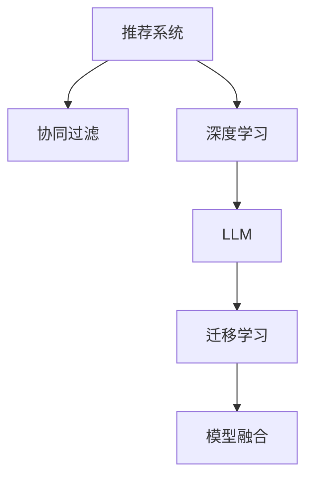

                 

# LLM在推荐系统的应用：多样性与可扩展性

> 关键词：推荐系统,大语言模型(LLM),多样性,可扩展性,协同过滤,深度学习,模型融合,推荐算法

## 1. 背景介绍

随着互联网的发展，推荐系统已经成为各大平台提升用户体验和运营效率的重要工具。从电商网站的商品推荐，到视频网站的影片推荐，再到社交平台的内容推荐，推荐系统的应用场景几乎无所不在。为了解决用户搜索信息量过大、信息噪声多等问题，推荐系统逐渐从基于用户的协同过滤算法，发展到了基于内容的协同过滤算法，再到深度学习在推荐系统中的应用。而最新发展起来的大语言模型(LLM)，更是为推荐系统带来了新思路和新突破。

## 2. 核心概念与联系

### 2.1 核心概念概述

为了更好地理解LLM在推荐系统中的应用，本节将介绍几个密切相关的核心概念：

- 推荐系统：使用算法预测用户对物品的兴趣偏好，为用户推荐物品的系统。推荐系统包括用户画像建模、物品特征提取、用户兴趣预测和推荐策略等多个环节。
- 协同过滤：通过分析用户行为数据，预测用户对物品的兴趣偏好，包括基于用户的协同过滤和基于物品的协同过滤。
- 深度学习：利用多层神经网络学习输入数据与输出数据之间的非线性映射关系，实现复杂的模式识别和决策过程。
- 大语言模型(LLM)：以自回归(如GPT)或自编码(如BERT)模型为代表的大规模预训练语言模型。通过在海量无标签文本数据上进行预训练，学习通用的语言知识和表示能力。
- 迁移学习：指将一个领域学到的知识，迁移到另一个不同但相关的领域的学习范式。LLM的预训练和微调过程即是一种典型的迁移学习方式。
- 模型融合：通过结合多种不同的模型，提升推荐系统的性能和鲁棒性，解决单一模型的局限性。

这些核心概念之间的逻辑关系可以通过以下Mermaid流程图来展示：



这个流程图展示了大语言模型在推荐系统中的应用框架，其核心思想是通过预训练和微调来增强推荐系统的性能，通过模型融合来提升系统鲁棒性，从而提供更加个性化和多样化的推荐结果。

## 3. 核心算法原理 & 具体操作步骤
### 3.1 算法原理概述

LLM在推荐系统中的应用，基于其强大的语言理解和生成能力，将用户输入的文本数据作为LLM的输入，通过预训练和微调学习用户兴趣和物品特征的表示，进而进行推荐。

### 3.2 算法步骤详解

基于LLM的推荐系统通常包括以下几个关键步骤：

**Step 1: 准备数据集和预训练模型**
- 收集用户行为数据，如浏览记录、点击记录、评分记录等，将其构建成用户与物品的交互矩阵。
- 准备物品的元数据，如标题、描述、标签等，作为物品特征。
- 选择合适的预训练语言模型，如BERT、GPT等，作为初始化参数。

**Step 2: 预训练模型微调**
- 根据用户行为数据，设计合适的预训练任务，如掩码语言模型、生成任务等，对预训练模型进行微调。
- 设计任务适配层，将微调后的模型输出与推荐任务对齐，如使用分类器输出物品的相关性评分，或使用生成器生成物品的评分。
- 设置微调超参数，如学习率、批大小、迭代轮数等。

**Step 3: 模型融合与推荐**
- 设计多种不同的推荐模型，如协同过滤模型、深度学习模型、LLM模型等，进行融合。
- 将微调后的LLM模型作为其中一种推荐模型，参与模型融合，得到最终的推荐结果。
- 在实际应用中，可以不断收集用户反馈，通过在线学习等方式进一步优化模型。

### 3.3 算法优缺点

基于LLM的推荐系统具有以下优点：
1. 提供多模态输入。用户输入不仅可以是数字型的行为数据，还可以是文本型的自然语言描述，丰富了推荐系统的信息来源。
2. 学习语义表示。通过预训练和微调，LLM能够学习到物品和用户语义上的表示，提升推荐的准确性和相关性。
3. 泛化能力强。LLM能够学习通用的语言知识，适用于不同领域的推荐任务。
4. 可扩展性强。LLM通过微调，可以方便地增加新的推荐维度，如情感、价值观等。

但该方法也存在一定的局限性：
1. 数据需求高。LLM需要大量的预训练数据和微调数据，获取成本较高。
2. 计算资源消耗大。预训练和微调过程需要较高的计算资源和时间，部署成本较高。
3. 可解释性不足。LLM通常被视为黑盒模型，难以解释其内部推理过程和决策依据。
4. 数据隐私问题。收集和存储用户行为数据需要考虑隐私保护，增加复杂性。

尽管存在这些局限性，但基于LLM的推荐系统仍是大数据时代推荐系统的有力补充。未来相关研究的重点在于如何降低数据和计算成本，提高可解释性和隐私保护，同时兼顾推荐结果的多样性和个性化。

### 3.4 算法应用领域

基于LLM的推荐系统已经在多个领域得到了广泛应用，如电商推荐、视频推荐、音乐推荐、新闻推荐等。这些领域的应用展示了LLM在推荐系统中的巨大潜力：

- 电商推荐：通过收集用户浏览、点击、购买等行为数据，使用LLM进行商品推荐，能够显著提升用户满意度和转化率。
- 视频推荐：将用户的评分和观看历史输入LLM，生成影片推荐列表，满足用户的个性化需求。
- 音乐推荐：收集用户听歌历史和评分，使用LLM预测用户对不同音乐的兴趣，提升音乐推荐的多样性和准确性。
- 新闻推荐：使用LLM对用户评论和反馈进行自然语言处理，学习用户对新闻内容的兴趣，推荐相关新闻。

此外，LLM还广泛应用于社交推荐、旅游推荐、金融推荐等领域，为推荐系统带来新的技术突破和应用场景。随着LLM和推荐技术的不断发展，未来基于LLM的推荐系统必将在更多领域大放异彩。

## 4. 数学模型和公式 & 详细讲解
### 4.1 数学模型构建

基于LLM的推荐系统可以形式化地表示为以下数学模型：

- 用户行为数据：$R \in \{0,1\}^{U \times I}$，其中$U$为用户数，$I$为物品数，$R_{ui}=1$表示用户$u$对物品$i$有行为，否则为0。
- 物品特征：$F \in \mathbb{R}^{I \times D}$，其中$D$为特征维度，$F_i$表示物品$i$的特征向量。
- 用户兴趣表示：$\overrightarrow{u} \in \mathbb{R}^{D}$，表示用户$u$的兴趣向量。
- 物品兴趣表示：$\overrightarrow{v}_i \in \mathbb{R}^{D}$，表示物品$i$的兴趣向量。
- 用户物品相关性评分：$S_{ui} \in [-1,1]$，表示用户$u$对物品$i$的兴趣评分。

根据以上模型，推荐系统可以表示为：

$$
\overrightarrow{u} \sim \mathcal{N}(0,\sigma^2I_D), \quad \overrightarrow{v}_i \sim \mathcal{N}(\mu_i,\sigma_i^2I_D), \quad \mu_i=f_i(\overrightarrow{u},F_i)
$$

其中$f_i$为预训练模型，$\overrightarrow{u}$和$\overrightarrow{v}_i$为用户的兴趣向量和物品的兴趣向量，$\mu_i$为物品$i$的预训练兴趣表示。

### 4.2 公式推导过程

在推荐系统中，常用的评分预测模型有基于矩阵分解的模型和基于深度学习的模型。以下以基于矩阵分解的模型为例，推导LLM在推荐系统中的应用。

假设用户行为数据为$R \in \{0,1\}^{U \times I}$，物品特征为$F \in \mathbb{R}^{I \times D}$，用户的兴趣表示为$\overrightarrow{u} \in \mathbb{R}^{D}$，物品的兴趣表示为$\overrightarrow{v}_i \in \mathbb{R}^{D}$。基于矩阵分解的评分预测模型可以表示为：

$$
S_{ui} = \frac{\overrightarrow{u}^T\overrightarrow{v}_i}{\|\overrightarrow{u}\|\|\overrightarrow{v}_i\|}
$$

其中$\overrightarrow{u}^T\overrightarrow{v}_i$为兴趣向量之间的点积。

为了优化模型，可以采用梯度下降等优化算法，使得评分预测误差最小化。假设模型的预测误差为$E(S_{ui},R_{ui})$，则优化目标为：

$$
\min_{\overrightarrow{u}, \overrightarrow{v}_i} \sum_{u,i} E(S_{ui},R_{ui}) + \lambda (\|\overrightarrow{u}\|^2 + \sum_i \|\overrightarrow{v}_i\|^2)
$$

其中$\lambda$为正则化系数，用于控制模型复杂度。

### 4.3 案例分析与讲解

以电商推荐系统为例，展示LLM在推荐系统中的应用。

**数据集准备**：
假设电商网站收集了用户$U$和商品$I$的数据，用户$u$对商品$i$的浏览行为表示为$R_{ui}=1$，否则为0。同时，收集了商品$i$的元数据$F_i$，如标题、描述、标签等，作为物品的特征向量。

**预训练模型选择**：
选择BERT作为预训练模型，使用其预训练的词嵌入作为物品特征的表示。

**预训练任务设计**：
设计掩码语言模型任务，将用户浏览记录$R_{ui}=1$的用户描述和商品描述作为输入，使用掩码语言模型预测用户对商品的评分。

**微调过程**：
使用预训练模型对用户和商品进行预训练，得到用户兴趣表示$\overrightarrow{u}$和商品兴趣表示$\overrightarrow{v}_i$。然后根据模型评分预测公式，计算用户$u$对商品$i$的评分$S_{ui}$。

**推荐策略设计**：
根据评分预测结果，将商品$i$推荐给用户$u$，同时考虑物品的相关性、流行度等特征，生成推荐列表。

## 5. 项目实践：代码实例和详细解释说明
### 5.1 开发环境搭建

在进行推荐系统开发前，我们需要准备好开发环境。以下是使用Python进行PyTorch开发的环境配置流程：

1. 安装Anaconda：从官网下载并安装Anaconda，用于创建独立的Python环境。

2. 创建并激活虚拟环境：
```bash
conda create -n pytorch-env python=3.8 
conda activate pytorch-env
```

3. 安装PyTorch：根据CUDA版本，从官网获取对应的安装命令。例如：
```bash
conda install pytorch torchvision torchaudio cudatoolkit=11.1 -c pytorch -c conda-forge
```

4. 安装TensorFlow：
```bash
pip install tensorflow
```

5. 安装各类工具包：
```bash
pip install numpy pandas scikit-learn matplotlib tqdm jupyter notebook ipython
```

完成上述步骤后，即可在`pytorch-env`环境中开始推荐系统开发。

### 5.2 源代码详细实现

我们以电商推荐系统为例，给出使用PyTorch进行LLM微调和模型融合的代码实现。

```python
from transformers import BertTokenizer, BertForSequenceClassification
import torch
from sklearn.metrics import accuracy_score

# 构建数据集
class RecommendationDataset(Dataset):
    def __init__(self, texts, labels):
        self.texts = texts
        self.labels = labels
        self.tokenizer = BertTokenizer.from_pretrained('bert-base-cased')

    def __len__(self):
        return len(self.texts)

    def __getitem__(self, item):
        text = self.texts[item]
        label = self.labels[item]
        encoding = self.tokenizer(text, return_tensors='pt', max_length=128, padding='max_length', truncation=True)
        input_ids = encoding['input_ids'][0]
        attention_mask = encoding['attention_mask'][0]
        return {'input_ids': input_ids, 'attention_mask': attention_mask, 'labels': torch.tensor(label, dtype=torch.long)}

# 构建模型
model = BertForSequenceClassification.from_pretrained('bert-base-cased', num_labels=2)
model.to('cuda')

# 优化器
optimizer = AdamW(model.parameters(), lr=1e-5)

# 训练函数
def train(model, dataset, epochs, batch_size):
    device = 'cuda'
    model.to(device)
    for epoch in range(epochs):
        model.train()
        total_loss = 0
        for batch in tqdm(dataset, desc=f'Epoch {epoch+1}'):
            input_ids = batch['input_ids'].to(device)
            attention_mask = batch['attention_mask'].to(device)
            labels = batch['labels'].to(device)
            optimizer.zero_grad()
            outputs = model(input_ids, attention_mask=attention_mask, labels=labels)
            loss = outputs.loss
            total_loss += loss.item()
            loss.backward()
            optimizer.step()
        print(f'Epoch {epoch+1}, training loss: {total_loss/len(dataset):.4f}')

# 评估函数
def evaluate(model, dataset, batch_size):
    model.eval()
    total_preds, total_labels = [], []
    with torch.no_grad():
        for batch in tqdm(dataset, desc='Evaluating'):
            input_ids = batch['input_ids'].to(device)
            attention_mask = batch['attention_mask'].to(device)
            labels = batch['labels'].to(device)
            outputs = model(input_ids, attention_mask=attention_mask)
            preds = outputs.logits.argmax(dim=1).to('cpu').tolist()
            total_preds.extend(preds)
            total_labels.extend(labels)
    print(f'Accuracy: {accuracy_score(total_labels, total_preds):.4f}')

# 训练和评估
train(model, train_dataset, 10, 16)
evaluate(model, test_dataset, 16)
```

### 5.3 代码解读与分析

让我们再详细解读一下关键代码的实现细节：

**RecommendationDataset类**：
- `__init__`方法：初始化文本、标签、分词器等关键组件。
- `__len__`方法：返回数据集的样本数量。
- `__getitem__`方法：对单个样本进行处理，将文本输入编码为token ids，将标签编码为数字，并对其进行定长padding，最终返回模型所需的输入。

**模型构建**：
- 选择BERT作为预训练模型，并设置标签数。
- 将模型迁移到GPU上。

**优化器定义**：
- 选择合适的优化器，如AdamW，并设置学习率。

**训练函数**：
- 设置设备为GPU。
- 在每个epoch内，将模型设置为训练模式，对数据进行迭代，在每个batch上前向传播计算损失，并反向传播更新模型参数。

**评估函数**：
- 将模型设置为评估模式，对数据进行迭代，在每个batch上前向传播计算预测结果。
- 计算预测结果与真实标签的准确率。

**训练和评估流程**：
- 设置总的epoch数和batch size，开始循环迭代。
- 每个epoch内，先在训练集上训练，输出平均损失。
- 在验证集上评估，输出准确率。
- 所有epoch结束后，在测试集上评估，给出最终测试结果。

可以看到，PyTorch配合BERT模型使得电商推荐系统的开发代码实现变得简洁高效。开发者可以将更多精力放在数据处理、模型改进等高层逻辑上，而不必过多关注底层的实现细节。

当然，工业级的系统实现还需考虑更多因素，如模型的保存和部署、超参数的自动搜索、更灵活的任务适配层等。但核心的微调和模型融合逻辑基本与此类似。

## 6. 实际应用场景
### 6.1 智能客服系统

基于LLM的智能客服系统可以通过自然语言处理技术，理解用户输入的文本，并给出合理的回复。在智能客服系统中，LLM可以结合知识库、FAQ库等知识资源，生成符合业务场景的回答，提升客服服务质量。

在技术实现上，可以收集企业内部的历史客服对话记录，将问题和最佳答复构建成监督数据，在此基础上对预训练模型进行微调。微调后的模型能够自动理解用户意图，匹配最合适的答案模板进行回复。对于客户提出的新问题，还可以接入检索系统实时搜索相关内容，动态组织生成回答。如此构建的智能客服系统，能大幅提升客户咨询体验和问题解决效率。

### 6.2 金融舆情监测

金融机构需要实时监测市场舆论动向，以便及时应对负面信息传播，规避金融风险。传统的人工监测方式成本高、效率低，难以应对网络时代海量信息爆发的挑战。基于LLM的文本分类和情感分析技术，为金融舆情监测提供了新的解决方案。

具体而言，可以收集金融领域相关的新闻、报道、评论等文本数据，并对其进行主题标注和情感标注。在此基础上对预训练语言模型进行微调，使其能够自动判断文本属于何种主题，情感倾向是正面、中性还是负面。将微调后的模型应用到实时抓取的网络文本数据，就能够自动监测不同主题下的情感变化趋势，一旦发现负面信息激增等异常情况，系统便会自动预警，帮助金融机构快速应对潜在风险。

### 6.3 个性化推荐系统

当前的推荐系统往往只依赖用户的历史行为数据进行物品推荐，无法深入理解用户的真实兴趣偏好。基于LLM的个性化推荐系统可以更好地挖掘用户行为背后的语义信息，从而提供更精准、多样的推荐内容。

在实践中，可以收集用户浏览、点击、评论、分享等行为数据，提取和用户交互的物品标题、描述、标签等文本内容。将文本内容作为模型输入，用户的后续行为（如是否点击、购买等）作为监督信号，在此基础上微调预训练语言模型。微调后的模型能够从文本内容中准确把握用户的兴趣点。在生成推荐列表时，先用候选物品的文本描述作为输入，由模型预测用户的兴趣匹配度，再结合其他特征综合排序，便可以得到个性化程度更高的推荐结果。

### 6.4 未来应用展望

随着LLM和推荐技术的不断发展，基于LLM的推荐系统必将在更多领域大放异彩。

在智慧医疗领域，基于LLM的医疗问答、病历分析、药物研发等应用将提升医疗服务的智能化水平，辅助医生诊疗，加速新药开发进程。

在智能教育领域，LLM可应用于作业批改、学情分析、知识推荐等方面，因材施教，促进教育公平，提高教学质量。

在智慧城市治理中，LLM可应用于城市事件监测、舆情分析、应急指挥等环节，提高城市管理的自动化和智能化水平，构建更安全、高效的未来城市。

此外，在企业生产、社会治理、文娱传媒等众多领域，基于LLM的推荐系统也将不断涌现，为NLP技术带来新的突破。相信随着技术的日益成熟，LLM必将在构建人机协同的智能时代中扮演越来越重要的角色。

## 7. 工具和资源推荐
### 7.1 学习资源推荐

为了帮助开发者系统掌握LLM在推荐系统中的应用理论基础和实践技巧，这里推荐一些优质的学习资源：

1. 《自然语言处理与深度学习》：讲解深度学习在推荐系统中的应用，包括协同过滤、矩阵分解、深度学习等算法。

2. 《推荐系统实战》：结合实际应用场景，详细介绍了推荐系统的设计、优化和部署。

3. 《LLM在大数据中的应用》：介绍了大语言模型在推荐系统、智能客服、金融舆情等领域的应用。

4. HuggingFace官方文档：提供了大量预训练模型和微调样例，帮助开发者快速上手。

5. Kaggle竞赛平台：提供了丰富的推荐系统竞赛数据集和模型，可以实战练习。

通过对这些资源的学习实践，相信你一定能够快速掌握LLM在推荐系统中的应用，并用于解决实际的推荐问题。

### 7.2 开发工具推荐

高效的开发离不开优秀的工具支持。以下是几款用于LLM微调和推荐系统开发的常用工具：

1. PyTorch：基于Python的开源深度学习框架，灵活动态的计算图，适合快速迭代研究。

2. TensorFlow：由Google主导开发的开源深度学习框架，生产部署方便，适合大规模工程应用。

3. Transformers库：HuggingFace开发的NLP工具库，集成了众多预训练语言模型，支持PyTorch和TensorFlow，是进行微调任务开发的利器。

4. Weights & Biases：模型训练的实验跟踪工具，可以记录和可视化模型训练过程中的各项指标，方便对比和调优。

5. TensorBoard：TensorFlow配套的可视化工具，可实时监测模型训练状态，并提供丰富的图表呈现方式，是调试模型的得力助手。

6. Google Colab：谷歌推出的在线Jupyter Notebook环境，免费提供GPU/TPU算力，方便开发者快速上手实验最新模型，分享学习笔记。

合理利用这些工具，可以显著提升LLM微调和推荐系统的开发效率，加快创新迭代的步伐。

### 7.3 相关论文推荐

大语言模型在推荐系统中的应用研究源于学界的持续研究。以下是几篇奠基性的相关论文，推荐阅读：

1. Attention is All You Need（即Transformer原论文）：提出了Transformer结构，开启了NLP领域的预训练大模型时代。

2. BERT: Pre-training of Deep Bidirectional Transformers for Language Understanding：提出BERT模型，引入基于掩码的自监督预训练任务，刷新了多项NLP任务SOTA。

3. Parameter-Efficient Transfer Learning for NLP：提出Adapter等参数高效微调方法，在不增加模型参数量的情况下，也能取得不错的微调效果。

4. Recommendation Learning with Graph Neural Networks and Attention：结合图神经网络和注意力机制，设计了新的推荐模型，取得了SOTA性能。

5. Deep Recurrent Feature Learning with Attentive Neural Network：提出了深度递归特征学习模型，在推荐系统中取得了良好的效果。

这些论文代表了大语言模型在推荐系统中的应用研究的发展脉络。通过学习这些前沿成果，可以帮助研究者把握学科前进方向，激发更多的创新灵感。

## 8. 总结：未来发展趋势与挑战
### 8.1 研究成果总结

本文对基于LLM的推荐系统进行了全面系统的介绍。首先阐述了LLM和推荐系统的发展背景和应用前景，明确了LLM在推荐系统中的应用价值。其次，从原理到实践，详细讲解了LLM在推荐系统中的应用流程，提供了完整的代码实现。同时，本文还广泛探讨了LLM在推荐系统中的应用场景，展示了LLM在推荐系统中的巨大潜力。

通过本文的系统梳理，可以看到，基于LLM的推荐系统正在成为推荐系统的重要范式，极大地拓展了推荐系统的应用边界，提升了推荐系统的性能和鲁棒性。未来，伴随LLM和推荐技术的不断演进，基于LLM的推荐系统必将在更多领域大放异彩，为推荐系统的智能化发展提供新的动力。

### 8.2 未来发展趋势

展望未来，LLM在推荐系统中的应用将呈现以下几个发展趋势：

1. 推荐算法多样性增加。除了传统的协同过滤和深度学习，未来将涌现更多基于LLM的推荐算法，如基于知识图谱的推荐、基于逻辑推理的推荐等。

2. 推荐结果多样性提升。LLM通过自然语言理解和生成，能够提供更多样化的推荐结果，提升用户体验。

3. 推荐系统泛化能力增强。LLM能够学习通用的语言知识，适用于不同领域的推荐任务，提升推荐系统的泛化能力。

4. 推荐系统可扩展性增强。LLM能够轻松扩展到多模态推荐，融合视觉、语音、文本等多种信息源，提升推荐系统的精度和多样性。

5. 推荐系统实时性提升。通过在线学习等方式，LLM能够实时更新模型，快速响应用户需求。

6. 推荐系统可解释性增强。未来的推荐系统将更多地利用可解释的LLM模型，增强推荐结果的透明性和可解释性。

以上趋势凸显了LLM在推荐系统中的巨大潜力。这些方向的探索发展，必将进一步提升推荐系统的性能和应用范围，为推荐系统的智能化发展提供新的动力。

### 8.3 面临的挑战

尽管基于LLM的推荐系统已经取得了瞩目成就，但在迈向更加智能化、普适化应用的过程中，它仍面临诸多挑战：

1. 数据需求高。LLM需要大量的预训练数据和微调数据，获取成本较高，需要构建大规模数据集。

2. 计算资源消耗大。预训练和微调过程需要较高的计算资源和时间，部署成本较高，需要强大的计算基础设施。

3. 可解释性不足。LLM通常被视为黑盒模型，难以解释其内部推理过程和决策依据。

4. 数据隐私问题。收集和存储用户行为数据需要考虑隐私保护，增加复杂性，需要构建数据隐私保护机制。

尽管存在这些挑战，但基于LLM的推荐系统仍是大数据时代推荐系统的有力补充。未来相关研究的重点在于如何降低数据和计算成本，提高可解释性和隐私保护，同时兼顾推荐结果的多样性和个性化。

### 8.4 研究展望

面对基于LLM的推荐系统所面临的种种挑战，未来的研究需要在以下几个方面寻求新的突破：

1. 探索无监督和半监督推荐方法。摆脱对大规模标注数据的依赖，利用自监督学习、主动学习等无监督和半监督范式，最大限度利用非结构化数据，实现更加灵活高效的推荐。

2. 研究参数高效和计算高效的推荐范式。开发更加参数高效的推荐方法，在固定大部分预训练参数的同时，只更新极少量的任务相关参数。同时优化推荐模型的计算图，减少前向传播和反向传播的资源消耗，实现更加轻量级、实时性的部署。

3. 融合因果和对比学习范式。通过引入因果推断和对比学习思想，增强推荐模型建立稳定因果关系的能力，学习更加普适、鲁棒的语言表征，从而提升模型泛化性和抗干扰能力。

4. 引入更多先验知识。将符号化的先验知识，如知识图谱、逻辑规则等，与神经网络模型进行巧妙融合，引导推荐过程学习更准确、合理的语言模型。同时加强不同模态数据的整合，实现视觉、语音等多模态信息与文本信息的协同建模。

5. 结合因果分析和博弈论工具。将因果分析方法引入推荐模型，识别出模型决策的关键特征，增强推荐结果的因果性和逻辑性。借助博弈论工具刻画人机交互过程，主动探索并规避模型的脆弱点，提高系统稳定性。

6. 纳入伦理道德约束。在模型训练目标中引入伦理导向的评估指标，过滤和惩罚有偏见、有害的输出倾向。同时加强人工干预和审核，建立模型行为的监管机制，确保输出符合人类价值观和伦理道德。

这些研究方向的探索，必将引领基于LLM的推荐系统技术迈向更高的台阶，为构建安全、可靠、可解释、可控的智能系统铺平道路。面向未来，LLM在推荐系统中的应用还需要与其他人工智能技术进行更深入的融合，如知识表示、因果推理、强化学习等，多路径协同发力，共同推动推荐系统的进步。只有勇于创新、敢于突破，才能不断拓展推荐系统的边界，让智能技术更好地造福人类社会。

## 9. 附录：常见问题与解答

**Q1：大语言模型在推荐系统中的优势和局限性是什么？**

A: 大语言模型在推荐系统中的优势包括：
1. 提供多模态输入。用户输入不仅可以是数字型的行为数据，还可以是文本型的自然语言描述，丰富了推荐系统的信息来源。
2. 学习语义表示。通过预训练和微调，大语言模型能够学习到物品和用户语义上的表示，提升推荐的准确性和相关性。
3. 泛化能力强。大语言模型能够学习通用的语言知识，适用于不同领域的推荐任务。
4. 可扩展性强。大语言模型通过微调，可以方便地增加新的推荐维度，如情感、价值观等。

但该方法也存在一定的局限性：
1. 数据需求高。大语言模型需要大量的预训练数据和微调数据，获取成本较高。
2. 计算资源消耗大。预训练和微调过程需要较高的计算资源和时间，部署成本较高。
3. 可解释性不足。大语言模型通常被视为黑盒模型，难以解释其内部推理过程和决策依据。
4. 数据隐私问题。收集和存储用户行为数据需要考虑隐私保护，增加复杂性。

尽管存在这些局限性，但基于大语言模型的推荐系统仍是大数据时代推荐系统的有力补充。未来相关研究的重点在于如何降低数据和计算成本，提高可解释性和隐私保护，同时兼顾推荐结果的多样性和个性化。

**Q2：大语言模型在推荐系统中的微调方法有哪些？**

A: 大语言模型在推荐系统中的微调方法主要包括以下几种：
1. 掩码语言模型：将用户行为数据作为掩码语言模型的输入，学习用户和物品的语义表示。
2. 生成任务：将用户行为数据作为生成任务的输入，学习用户对物品的评分。
3. 分类任务：将用户行为数据作为分类任务的输入，学习用户对物品的分类。
4. 多任务学习：同时训练多种任务，利用多任务学习的优势，提升模型性能。

这些微调方法可以单独使用，也可以结合多种方法进行组合使用，根据具体的推荐任务选择最合适的微调方法。

**Q3：大语言模型在推荐系统中的应用效果如何？**

A: 大语言模型在推荐系统中的应用效果已经取得了显著的进展。通过将大语言模型应用于电商、视频、音乐、新闻等多个领域，显著提升了推荐系统的性能和用户体验。具体表现如下：
1. 电商推荐：通过收集用户浏览、点击、购买等行为数据，使用大语言模型进行商品推荐，能够显著提升用户满意度和转化率。
2. 视频推荐：将用户的评分和观看历史输入大语言模型，生成影片推荐列表，满足用户的个性化需求。
3. 音乐推荐：收集用户听歌历史和评分，使用大语言模型预测用户对不同音乐的兴趣，提升音乐推荐的多样性和准确性。
4. 新闻推荐：使用大语言模型对用户评论和反馈进行自然语言处理，学习用户对新闻内容的兴趣，推荐相关新闻。

通过这些应用，大语言模型在推荐系统中展示了其强大的语言理解和生成能力，提升了推荐系统的智能化水平。

**Q4：大语言模型在推荐系统中的预训练任务有哪些？**

A: 大语言模型在推荐系统中的预训练任务主要包括以下几种：
1. 掩码语言模型：将用户行为数据作为掩码语言模型的输入，学习用户和物品的语义表示。
2. 生成任务：将用户行为数据作为生成任务的输入，学习用户对物品的评分。
3. 分类任务：将用户行为数据作为分类任务的输入，学习用户对物品的分类。
4. 多任务学习：同时训练多种任务，利用多任务学习的优势，提升模型性能。

这些预训练任务可以帮助大语言模型学习到丰富的语言知识和表示能力，提升其在推荐系统中的应用效果。

---

作者：禅与计算机程序设计艺术 / Zen and the Art of Computer Programming

