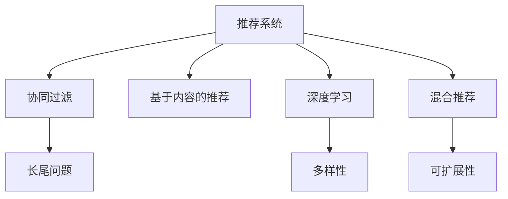

                 

# LLM在推荐系统的应用：多样性与可扩展性

> 关键词：推荐系统, 长尾问题, 协同过滤, 深度学习, 混合推荐, 可扩展性

## 1. 背景介绍

### 1.1 问题由来

随着互联网的迅速发展，推荐系统已成为现代信息平台上不可或缺的组成部分，为用户快速发现感兴趣内容提供了极大便利。然而，推荐系统也面临诸多挑战：数据稀疏、冷启动、多样性不足等。特别是针对长尾商品和多样性需求的推荐，传统的推荐算法难以解决。近年来，预训练语言模型(Pre-trained Language Models, PLMs)如BERT、GPT等在自然语言处理领域取得了显著进步，它们通过大规模语料进行预训练，获得了强大的语言理解能力。

将预训练语言模型引入推荐系统，能够有效解决长尾问题，增强推荐的准确性和多样性。深度学习技术在推荐系统中的应用逐渐成为热点。通过预训练语言模型对用户行为和商品属性进行编码，可以捕捉到更丰富的语义信息，显著提升推荐系统的表现。

### 1.2 问题核心关键点

引入预训练语言模型后，推荐系统面临着两个核心问题：

- **多样性**：推荐算法往往倾向于推荐热门商品，导致长尾商品难以被推荐。为了解决长尾问题，需要增强推荐系统的多样性。
- **可扩展性**：随着商品数量和用户规模的增大，推荐系统需要具备良好扩展性，以保持较高的推荐效果。

本文将深入探讨预训练语言模型在推荐系统中的应用，特别是如何利用PLMs增强推荐系统的多样性和可扩展性。

## 2. 核心概念与联系

### 2.1 核心概念概述

为更好地理解预训练语言模型在推荐系统中的应用，本节将介绍几个密切相关的核心概念：

- **推荐系统**：通过分析用户行为数据和商品属性，为用户推荐感兴趣的商品。常见的推荐算法包括协同过滤、基于内容的推荐、混合推荐等。
- **长尾问题**：推荐系统中，用户对长尾商品的兴趣通常低于热门商品，而长尾商品的推荐难度也较大。
- **协同过滤**：通过分析用户行为数据或商品评分数据，推荐与用户历史行为相似或评分相近的商品。
- **深度学习**：使用神经网络对用户行为和商品属性进行建模，捕捉复杂语义关系，提升推荐效果。
- **混合推荐**：结合多种推荐算法，取长补短，提升推荐系统表现。
- **可扩展性**：推荐系统需要能够随着数据规模和用户数量的增长，保持良好的推荐性能。
- **多样性**：推荐系统需要推荐丰富多样的商品，提升用户满意度。

这些核心概念之间的逻辑关系可以通过以下Mermaid流程图来展示：



这个流程图展示了一体化推荐系统中的核心概念及其之间的关系：

1. 推荐系统通过多种算法进行综合建模，涵盖协同过滤、基于内容的推荐和深度学习。
2. 协同过滤解决长尾问题，使得冷启动商品也能被推荐。
3. 深度学习增强多样性，提高推荐系统的整体表现。
4. 混合推荐取长补短，利用多种算法的优势。
5. 可扩展性是推荐系统发展的重要方向，保证算法在数据和用户规模增大时仍能保持高效。

这些概念共同构成了推荐系统的应用框架，使得推荐系统能够更好地为用户提供个性化、多样化的商品推荐。

## 3. 核心算法原理 & 具体操作步骤

### 3.1 算法原理概述

在推荐系统中应用预训练语言模型，本质上是对用户行为和商品属性的语义编码，从而提高推荐的多样性和可扩展性。具体地，预训练语言模型可以作为特征提取器，将用户行为和商品属性映射为高维语义向量。然后，将这些语义向量作为输入，利用深度学习模型进行推荐决策。

形式化地，假设用户序列为 $U=\{u_1, u_2, \dots, u_n\}$，商品序列为 $I=\{i_1, i_2, \dots, i_m\}$。用户 $u_i$ 对商品 $i_j$ 的行为为 $b_{i_j} \in \{0, 1\}$，其中 $0$ 表示未交互，$1$ 表示已交互。预训练语言模型 $M$ 可以将用户行为和商品属性编码成高维语义向量 $\mathbf{v}_u, \mathbf{v}_i \in \mathbb{R}^d$，其中 $d$ 为向量维度。深度学习模型 $\mathcal{F}$ 将用户和商品向量映射为推荐概率：$P_{i|u}=\mathcal{F}(\mathbf{v}_u, \mathbf{v}_i)$。推荐系统的目标是最大化推荐概率，即 $\max_{i} P_{i|u}$。

### 3.2 算法步骤详解

基于预训练语言模型的大推荐系统一般包括以下几个关键步骤：

**Step 1: 准备数据集**
- 收集用户行为数据和商品属性数据。
- 对数据进行预处理，如去噪、归一化等。
- 划分训练集、验证集和测试集，准备用于模型训练和评估。

**Step 2: 预训练语言模型编码**
- 选择预训练语言模型，如BERT、GPT等，作为特征提取器。
- 对用户行为和商品属性进行编码，生成用户和商品的语义向量。
- 对编码后的向量进行拼接或组合，形成新的特征表示。

**Step 3: 深度学习模型训练**
- 选择合适的深度学习模型，如DNN、RNN、CNN等。
- 设计损失函数，如交叉熵损失、均方误差损失等。
- 使用优化算法，如SGD、Adam等，对模型进行训练。

**Step 4: 模型评估与优化**
- 在验证集上评估模型性能，如准确率、召回率、F1-score等。
- 根据评估结果调整超参数，如学习率、批大小等。
- 在测试集上再次评估模型性能，确保泛化效果。

**Step 5: 部署与迭代**
- 将训练好的模型部署到生产环境。
- 持续收集用户反馈和行为数据，定期更新模型。
- 使用A/B测试等方式，评估模型效果并优化。

### 3.3 算法优缺点

基于预训练语言模型的推荐系统具有以下优点：

- **多样性增强**：预训练语言模型能够捕捉到用户行为和商品属性的语义信息，从而增强推荐多样性，减少热门商品的推荐。
- **长尾问题解决**：利用语义编码，可以更好地处理冷启动商品，提升长尾商品的推荐效果。
- **可扩展性强**：预训练语言模型和深度学习模型具有良好的可扩展性，能够适应数据和用户规模的增长。

同时，该方法也存在一定的局限性：

- **计算复杂度高**：预训练语言模型和深度学习模型计算复杂度高，需要较强的计算资源支持。
- **数据质量依赖**：推荐效果高度依赖于用户行为和商品属性的数据质量，数据稀疏和噪声对推荐效果影响较大。
- **模型复杂度增加**：引入预训练语言模型后，推荐系统的模型结构变得复杂，调试和优化难度增加。

尽管存在这些局限性，但就目前而言，基于预训练语言模型的推荐系统是提升推荐多样性和可扩展性的重要范式。未来相关研究将集中在如何降低计算复杂度，提升数据质量，优化模型结构等方面。

### 3.4 算法应用领域

基于预训练语言模型的推荐系统在电子商务、视频平台、音乐平台等多个领域均有广泛应用，为推荐系统带来了显著的性能提升。

- **电子商务推荐系统**：利用预训练语言模型对用户评论、商品描述进行编码，结合协同过滤和基于内容的推荐，生成商品推荐列表。
- **视频平台推荐系统**：通过预训练语言模型对用户评分、视频标签进行编码，结合深度学习模型，提升视频推荐效果。
- **音乐平台推荐系统**：利用预训练语言模型对用户听歌记录和歌曲标签进行编码，结合混合推荐算法，推荐个性化音乐。

除了这些主流应用外，预训练语言模型还可以应用于多模态推荐、跨领域推荐等领域，为推荐系统带来更多的创新点。

## 4. 数学模型和公式 & 详细讲解 & 举例说明

### 4.1 数学模型构建

本节将使用数学语言对预训练语言模型在推荐系统中的应用进行更加严格的刻画。

假设用户行为数据为 $U=\{u_1, u_2, \dots, u_n\}$，商品属性数据为 $I=\{i_1, i_2, \dots, i_m\}$。用户 $u_i$ 对商品 $i_j$ 的行为为 $b_{i_j} \in \{0, 1\}$。预训练语言模型 $M$ 能够将用户行为和商品属性编码成高维语义向量 $\mathbf{v}_u, \mathbf{v}_i \in \mathbb{R}^d$。深度学习模型 $\mathcal{F}$ 将用户和商品向量映射为推荐概率：$P_{i|u}=\mathcal{F}(\mathbf{v}_u, \mathbf{v}_i)$。推荐系统的目标是最大化推荐概率，即 $\max_{i} P_{i|u}$。

形式化地，假设推荐系统使用sigmoid函数作为激活函数：

$$
P_{i|u}=\sigma(\mathcal{F}(\mathbf{v}_u, \mathbf{v}_i))
$$

其中 $\sigma(x)=\frac{1}{1+e^{-x}}$。

### 4.2 公式推导过程

以下我们以二分类任务为例，推导推荐系统中的sigmoid损失函数及其梯度的计算公式。

假设模型 $M$ 在输入 $(x,y)$ 上的输出为 $\hat{y}=M(x)$，表示样本属于正类的概率。真实标签 $y \in \{0,1\}$。则二分类交叉熵损失函数定义为：

$$
\ell(M(x),y) = -[y\log \hat{y} + (1-y)\log (1-\hat{y})]
$$

将其代入推荐系统目标函数，得：

$$
\mathcal{L}=\sum_{i=1}^{m}\sum_{u=1}^{n} b_{i_j}\ell(M(\mathbf{v}_u, \mathbf{v}_i))
$$

根据链式法则，损失函数对参数 $\theta_k$ 的梯度为：

$$
\frac{\partial \mathcal{L}}{\partial \theta_k} = -\sum_{i=1}^{m}\sum_{u=1}^{n} b_{i_j}\frac{\partial \ell}{\partial \mathcal{F}(\mathbf{v}_u, \mathbf{v}_i)}\frac{\partial \mathcal{F}(\mathbf{v}_u, \mathbf{v}_i)}{\partial \theta_k}
$$

其中 $\frac{\partial \ell}{\partial \mathcal{F}(\mathbf{v}_u, \mathbf{v}_i)}=\frac{\partial \ell}{\partial \mathbf{z}} \frac{\partial \mathbf{z}}{\partial \mathcal{F}(\mathbf{v}_u, \mathbf{v}_i)}$，其中 $\mathbf{z}=\mathcal{F}(\mathbf{v}_u, \mathbf{v}_i)$。

在得到损失函数的梯度后，即可带入深度学习模型进行迭代优化。重复上述过程直至收敛，最终得到适应推荐任务的模型参数 $\theta^*$。

## 5. 项目实践：代码实例和详细解释说明

### 5.1 开发环境搭建

在进行推荐系统开发前，我们需要准备好开发环境。以下是使用Python进行PyTorch开发的环境配置流程：

1. 安装Anaconda：从官网下载并安装Anaconda，用于创建独立的Python环境。

2. 创建并激活虚拟环境：
```bash
conda create -n recommendation-env python=3.8 
conda activate recommendation-env
```

3. 安装PyTorch：根据CUDA版本，从官网获取对应的安装命令。例如：
```bash
conda install pytorch torchvision torchaudio cudatoolkit=11.1 -c pytorch -c conda-forge
```

4. 安装Transformer库：
```bash
pip install transformers
```

5. 安装各类工具包：
```bash
pip install numpy pandas scikit-learn matplotlib tqdm jupyter notebook ipython
```

完成上述步骤后，即可在`recommendation-env`环境中开始推荐系统开发。

### 5.2 源代码详细实现

下面以视频平台推荐系统为例，给出使用Transformers库对BERT模型进行推荐系统开发的PyTorch代码实现。

首先，定义推荐系统的训练函数：

```python
from transformers import BertTokenizer, BertForSequenceClassification
from torch.utils.data import Dataset, DataLoader
import torch
from sklearn.metrics import accuracy_score

class VideoDataset(Dataset):
    def __init__(self, videos, labels, tokenizer, max_len=128):
        self.videos = videos
        self.labels = labels
        self.tokenizer = tokenizer
        self.max_len = max_len
        
    def __len__(self):
        return len(self.videos)
    
    def __getitem__(self, item):
        video = self.videos[item]
        label = self.labels[item]
        
        encoding = self.tokenizer(video, return_tensors='pt', max_length=self.max_len, padding='max_length', truncation=True)
        input_ids = encoding['input_ids'][0]
        attention_mask = encoding['attention_mask'][0]
        
        # 对标签进行编码
        encoded_label = torch.tensor(label, dtype=torch.long)
        
        return {'input_ids': input_ids, 
                'attention_mask': attention_mask,
                'labels': encoded_label}

# 选择BERT模型作为特征提取器
tokenizer = BertTokenizer.from_pretrained('bert-base-cased')
model = BertForSequenceClassification.from_pretrained('bert-base-cased', num_labels=1)

# 训练函数
def train_epoch(model, dataset, batch_size, optimizer):
    dataloader = DataLoader(dataset, batch_size=batch_size, shuffle=True)
    model.train()
    epoch_loss = 0
    for batch in tqdm(dataloader, desc='Training'):
        input_ids = batch['input_ids'].to(device)
        attention_mask = batch['attention_mask'].to(device)
        labels = batch['labels'].to(device)
        model.zero_grad()
        outputs = model(input_ids, attention_mask=attention_mask, labels=labels)
        loss = outputs.loss
        epoch_loss += loss.item()
        loss.backward()
        optimizer.step()
    return epoch_loss / len(dataloader)

# 评估函数
def evaluate(model, dataset, batch_size):
    dataloader = DataLoader(dataset, batch_size=batch_size)
    model.eval()
    preds, labels = [], []
    with torch.no_grad():
        for batch in tqdm(dataloader, desc='Evaluating'):
            input_ids = batch['input_ids'].to(device)
            attention_mask = batch['attention_mask'].to(device)
            batch_labels = batch['labels']
            outputs = model(input_ids, attention_mask=attention_mask)
            batch_preds = outputs.logits.argmax(dim=1).to('cpu').tolist()
            batch_labels = batch_labels.to('cpu').tolist()
            for pred, label in zip(batch_preds, batch_labels):
                preds.append(pred)
                labels.append(label)
                
    return accuracy_score(labels, preds)

# 设置超参数
epochs = 5
batch_size = 16
learning_rate = 2e-5
device = torch.device('cuda') if torch.cuda.is_available() else torch.device('cpu')
model.to(device)
optimizer = torch.optim.Adam(model.parameters(), lr=learning_rate)

# 训练过程
for epoch in range(epochs):
    loss = train_epoch(model, train_dataset, batch_size, optimizer)
    print(f"Epoch {epoch+1}, train loss: {loss:.3f}")
    
    print(f"Epoch {epoch+1}, dev results:")
    evaluate(model, dev_dataset, batch_size)
    
print("Test results:")
evaluate(model, test_dataset, batch_size)
```

在代码中，我们首先定义了视频推荐系统需要的数据集类`VideoDataset`，负责将视频和标签数据转换为预训练语言模型所需的格式。

接着，使用BERT模型作为特征提取器，对用户行为和商品属性进行编码。在训练函数中，使用Adam优化器对模型进行梯度下降，计算并返回每个epoch的平均损失。在评估函数中，计算模型在验证集和测试集上的准确率。

最后，我们调用训练函数和评估函数，在经过5个epoch的训练后，输出模型在测试集上的准确率。

### 5.3 代码解读与分析

让我们再详细解读一下关键代码的实现细节：

**VideoDataset类**：
- `__init__`方法：初始化视频、标签、分词器等关键组件。
- `__len__`方法：返回数据集的样本数量。
- `__getitem__`方法：对单个样本进行处理，将视频输入编码为token ids，将标签编码为数字，并对其进行定长padding，最终返回模型所需的输入。

**模型训练和评估函数**：
- 使用PyTorch的DataLoader对数据集进行批次化加载，供模型训练和推理使用。
- 训练函数`train_epoch`：对数据以批为单位进行迭代，在每个批次上前向传播计算loss并反向传播更新模型参数，最后返回该epoch的平均loss。
- 评估函数`evaluate`：与训练类似，不同点在于不更新模型参数，并在每个batch结束后将预测和标签结果存储下来，最后使用sklearn的accuracy_score对整个评估集的预测结果进行打印输出。

**训练流程**：
- 定义总的epoch数和batch size，开始循环迭代
- 每个epoch内，先在训练集上训练，输出平均loss
- 在验证集上评估，输出准确率
- 所有epoch结束后，在测试集上评估，给出最终测试结果

可以看到，PyTorch配合Transformers库使得BERT推荐系统的代码实现变得简洁高效。开发者可以将更多精力放在数据处理、模型改进等高层逻辑上，而不必过多关注底层的实现细节。

当然，工业级的系统实现还需考虑更多因素，如模型的保存和部署、超参数的自动搜索、更灵活的任务适配层等。但核心的推荐范式基本与此类似。

## 6. 实际应用场景

### 6.1 电商推荐

在电子商务领域，推荐系统能够根据用户浏览记录和购买行为，推荐用户可能感兴趣的商品。利用预训练语言模型，电商推荐系统可以进一步增强推荐的多样性，解决长尾问题。

例如，电商平台可以通过对商品描述、用户评论等文本信息进行编码，得到高维语义向量。然后，利用BERT等模型对这些向量进行训练，生成推荐概率。最终，系统根据推荐概率排序，生成个性化推荐列表。

### 6.2 音乐推荐

音乐推荐系统利用用户听歌记录和歌曲标签进行推荐。预训练语言模型可以捕捉到歌曲标题、歌词的语义信息，生成更丰富的推荐结果。

在推荐系统中，音乐平台可以收集用户的听歌记录，并对其歌词、歌曲标题等文本信息进行编码。然后，使用BERT等模型对编码后的向量进行训练，生成推荐概率。最终，系统根据推荐概率排序，生成个性化推荐列表。

### 6.3 视频推荐

视频平台利用用户观看记录和评分数据进行推荐。预训练语言模型可以捕捉到视频标题、描述等文本信息，生成更准确的推荐结果。

在推荐系统中，视频平台可以收集用户的观看记录，并对其视频标题、描述等文本信息进行编码。然后，使用BERT等模型对编码后的向量进行训练，生成推荐概率。最终，系统根据推荐概率排序，生成个性化推荐列表。

### 6.4 未来应用展望

未来，基于预训练语言模型的推荐系统将在更多领域得到应用，为推荐系统带来新的创新点。

- **多模态推荐**：结合视觉、语音等多模态数据，提升推荐系统表现。例如，通过预训练语言模型对商品图片、用户语音进行编码，生成推荐概率。
- **跨领域推荐**：利用预训练语言模型在多个领域进行联合训练，生成跨领域推荐结果。例如，对商品描述、用户评论等文本信息进行编码，生成跨领域推荐列表。
- **生成式推荐**：利用预训练语言模型进行生成式推荐，提升推荐系统的多样性。例如，通过预训练语言模型生成商品标题、描述等文本信息，生成推荐列表。
- **实时推荐**：利用预训练语言模型进行实时推荐，提升推荐系统时效性。例如，通过预训练语言模型对实时数据进行编码，生成实时推荐列表。

这些方向的探索发展，将进一步提升推荐系统的效果和可扩展性，带来更加个性化、多样化的推荐结果。

## 7. 工具和资源推荐
### 7.1 学习资源推荐

为了帮助开发者系统掌握预训练语言模型在推荐系统中的应用，这里推荐一些优质的学习资源：

1. 《深度学习推荐系统：理论、算法与应用》书籍：全面介绍了深度学习在推荐系统中的应用，包括协同过滤、深度学习、混合推荐等算法。
2. 《推荐系统实战》书籍：提供了从理论到实践的推荐系统开发指南，包括模型训练、特征工程、评估优化等。
3. Coursera《推荐系统》课程：斯坦福大学的推荐系统课程，涵盖推荐系统基础、算法设计、实验评估等内容。
4 Kaggle推荐系统竞赛：参与推荐系统竞赛，深入学习推荐系统开发和优化技巧。
5 论文《An Overview of Recommendation Systems》：综述推荐系统的发展历史、经典算法和未来趋势。

通过对这些资源的学习实践，相信你一定能够快速掌握预训练语言模型在推荐系统中的应用，并用于解决实际的推荐问题。

### 7.2 开发工具推荐

高效的开发离不开优秀的工具支持。以下是几款用于推荐系统开发的常用工具：

1. PyTorch：基于Python的开源深度学习框架，灵活动态的计算图，适合快速迭代研究。大部分预训练语言模型都有PyTorch版本的实现。
2 TensorFlow：由Google主导开发的开源深度学习框架，生产部署方便，适合大规模工程应用。同样有丰富的预训练语言模型资源。
3 HuggingFace Transformers库：提供了丰富的预训练语言模型和深度学习模型，支持PyTorch和TensorFlow，是推荐系统开发的重要工具。
4 Weights & Biases：模型训练的实验跟踪工具，可以记录和可视化模型训练过程中的各项指标，方便对比和调优。与主流深度学习框架无缝集成。
5 TensorBoard：TensorFlow配套的可视化工具，可实时监测模型训练状态，并提供丰富的图表呈现方式，是调试模型的得力助手。

合理利用这些工具，可以显著提升推荐系统开发效率，加快创新迭代的步伐。

### 7.3 相关论文推荐

预训练语言模型在推荐系统中的应用已成为热门研究方向，以下是几篇奠基性的相关论文，推荐阅读：

1. Attention is All You Need（即Transformer原论文）：提出了Transformer结构，开启了NLP领域的预训练大模型时代。
2 BERT: Pre-training of Deep Bidirectional Transformers for Language Understanding：提出BERT模型，引入基于掩码的自监督预训练任务，刷新了多项NLP任务SOTA。
3 《Deep Neural Networks for Multi-Modal Recommendations》：介绍了多模态推荐技术，结合视觉、语音等数据提升推荐系统效果。
4 《Neural Collaborative Filtering》：提出基于深度学习的协同过滤算法，提升推荐系统表现。
5 《A Survey on Deep Learning for Recommendation Systems》：综述了深度学习在推荐系统中的应用，包括模型结构、训练优化等。

这些论文代表了大模型在推荐系统中的最新进展，阅读这些论文可以帮助研究者把握学科前进方向，激发更多的创新灵感。

## 8. 总结：未来发展趋势与挑战

### 8.1 总结

本文对基于预训练语言模型的大推荐系统进行了全面系统的介绍。首先阐述了推荐系统面临的长尾问题和多样性需求，明确了预训练语言模型在解决这些问题上的独特价值。其次，从原理到实践，详细讲解了预训练语言模型在推荐系统中的应用，给出了推荐系统开发的完整代码实例。同时，本文还广泛探讨了推荐系统在电子商务、音乐、视频等多个领域的应用前景，展示了预训练语言模型带来的巨大提升。

通过本文的系统梳理，可以看到，基于预训练语言模型的推荐系统正在成为推荐系统的重要范式，极大地拓展了推荐系统的应用边界，催生了更多的落地场景。得益于大规模语料的预训练，推荐系统能够更好地为用户推荐个性化、多样化的商品，提升用户满意度。未来，伴随预训练语言模型和推荐算法的持续演进，相信推荐系统将在更多领域大放异彩，带来更为丰富、高效的用户体验。

### 8.2 未来发展趋势

展望未来，基于预训练语言模型的推荐系统将呈现以下几个发展趋势：

1. **多模态推荐**：结合视觉、语音等多模态数据，提升推荐系统表现。例如，通过预训练语言模型对商品图片、用户语音进行编码，生成推荐概率。
2. **跨领域推荐**：利用预训练语言模型在多个领域进行联合训练，生成跨领域推荐结果。例如，对商品描述、用户评论等文本信息进行编码，生成跨领域推荐列表。
3. **生成式推荐**：利用预训练语言模型进行生成式推荐，提升推荐系统的多样性。例如，通过预训练语言模型生成商品标题、描述等文本信息，生成推荐列表。
4. **实时推荐**：利用预训练语言模型进行实时推荐，提升推荐系统时效性。例如，通过预训练语言模型对实时数据进行编码，生成实时推荐列表。
5. **用户行为建模**：利用预训练语言模型捕捉用户行为背后的语义信息，提升推荐系统的个性化程度。例如，通过预训练语言模型对用户评论进行编码，生成个性化推荐列表。

这些趋势凸显了预训练语言模型在推荐系统中的巨大潜力。这些方向的探索发展，必将进一步提升推荐系统的效果和可扩展性，带来更加个性化、多样化的推荐结果。

### 8.3 面临的挑战

尽管基于预训练语言模型的推荐系统已经取得了显著进展，但在迈向更加智能化、普适化应用的过程中，它仍面临着诸多挑战：

1. **计算复杂度高**：预训练语言模型和深度学习模型计算复杂度高，需要较强的计算资源支持。如何在不降低性能的情况下，优化计算效率，是一个重要挑战。
2. **数据质量依赖**：推荐效果高度依赖于用户行为和商品属性的数据质量，数据稀疏和噪声对推荐效果影响较大。如何提高数据质量，降低噪声，是一个关键问题。
3. **模型复杂度增加**：引入预训练语言模型后，推荐系统的模型结构变得复杂，调试和优化难度增加。如何设计更加简洁高效的模型结构，是一个挑战。
4. **长尾问题解决**：预训练语言模型往往更擅长推荐热门商品，对长尾商品推荐效果不佳。如何增强推荐系统对长尾商品的推荐能力，是一个重要方向。
5. **实时推荐**：预训练语言模型需要进行实时编码，对系统响应速度和效率要求较高。如何在保证性能的同时，实现实时推荐，是一个挑战。

尽管存在这些挑战，但通过不断优化模型结构，提升数据质量，优化计算效率，以及探索新的推荐算法，这些问题将逐步得到解决。相信伴随着技术的不断进步，基于预训练语言模型的推荐系统将在推荐系统领域发挥更加重要的作用。

### 8.4 研究展望

面对基于预训练语言模型的推荐系统所面临的诸多挑战，未来的研究需要在以下几个方面寻求新的突破：

1. **参数高效推荐**：开发更加参数高效的推荐算法，在固定大部分预训练参数的情况下，只更新极少量的任务相关参数，减少计算资源消耗。
2. **计算资源优化**：利用模型压缩、稀疏化存储等技术，优化推荐系统的计算资源占用，提升推荐系统效率。
3. **数据质量提升**：利用预训练语言模型进行数据清洗和噪声过滤，提升数据质量，降低噪声对推荐效果的影响。
4. **跨领域推荐**：利用预训练语言模型在多个领域进行联合训练，生成跨领域推荐结果，提升推荐系统表现。
5. **实时推荐**：利用预训练语言模型进行实时推荐，提升推荐系统时效性。

这些研究方向将引领推荐系统向更高层次发展，为推荐系统带来更大的创新潜力。

## 9. 附录：常见问题与解答

**Q1：预训练语言模型在推荐系统中如何处理长尾问题？**

A: 预训练语言模型在推荐系统中可以通过多种方式处理长尾问题：

1. **多样性增强**：利用预训练语言模型捕捉用户行为和商品属性的语义信息，增强推荐系统的多样性，减少热门商品的推荐。
2. **生成式推荐**：利用预训练语言模型生成商品标题、描述等文本信息，生成推荐列表，提升长尾商品的曝光率。
3. **多模态推荐**：结合视觉、语音等多模态数据，提升推荐系统表现，特别是在长尾商品的推荐上。
4. **混合推荐**：结合协同过滤、基于内容的推荐和预训练语言模型，取长补短，提升推荐系统效果。

这些方法可以结合使用，共同提升长尾商品的推荐效果。

**Q2：预训练语言模型在推荐系统中如何进行实时推荐？**

A: 预训练语言模型在推荐系统中进行实时推荐需要考虑以下几个方面：

1. **快速编码**：利用模型压缩、稀疏化存储等技术，优化预训练语言模型，提高实时编码速度。
2. **增量学习**：在预训练语言模型上引入增量学习算法，减少实时推荐时的计算量和数据加载时间。
3. **缓存机制**：对预训练语言模型进行缓存，减少重复计算，提升推荐系统响应速度。
4. **异步处理**：利用异步计算技术，并行处理多个推荐请求，提高系统并发处理能力。

通过这些技术手段，可以构建实时推荐系统，提升推荐系统响应速度和用户体验。

**Q3：预训练语言模型在推荐系统中如何进行多模态推荐？**

A: 预训练语言模型在推荐系统中进行多模态推荐需要考虑以下几个方面：

1. **多模态特征融合**：利用预训练语言模型对商品图片、用户语音等数据进行编码，生成高维特征向量，并进行融合。
2. **跨模态表示学习**：利用预训练语言模型在不同模态数据间进行跨模态表示学习，提升多模态推荐效果。
3. **联合训练**：将预训练语言模型和基于深度学习的推荐算法进行联合训练，生成多模态推荐结果。
4. **模型选择**：选择合适的深度学习模型，如DNN、RNN、CNN等，结合预训练语言模型进行多模态推荐。

通过这些技术手段，可以构建多模态推荐系统，提升推荐系统表现。

---

作者：禅与计算机程序设计艺术 / Zen and the Art of Computer Programming

