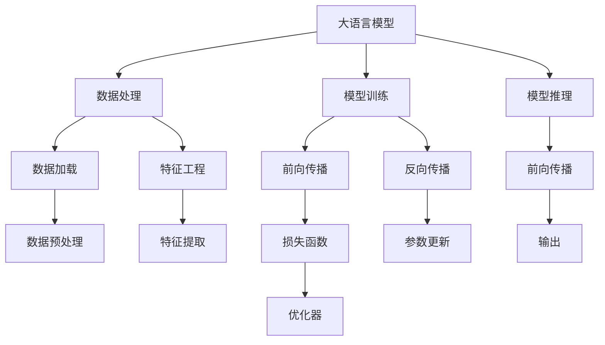

                 

# 大语言模型在推荐系统中的成本：硬件需求

> 关键词：推荐系统, 硬件需求, 大语言模型, 深度学习, 数据处理, 模型训练, 计算资源

## 1. 背景介绍

### 1.1 问题由来
在数字化时代，推荐系统成为互联网公司为用户提供个性化服务的重要工具。传统的推荐系统基于协同过滤、内容过滤等方法，主要依赖用户的历史行为数据进行个性化推荐。但这种方法存在冷启动问题、数据稀疏性等缺陷，难以覆盖所有用户和场景。

近年来，基于深度学习的大语言模型（Large Language Models, LLMs）逐渐成为推荐系统的热门选择。LLMs通过对大规模无标签文本数据进行预训练，学习到丰富的语言知识和表征能力，在推荐任务上展现出了独特的优势。然而，与传统机器学习方法相比，大语言模型的训练和推理所需计算资源更巨大，这也成为了大规模应用的一大挑战。

本文将详细探讨LLM在推荐系统中的硬件需求，从数据处理、模型训练、模型推理等方面，全面评估LLM推荐的成本和性能。

### 1.2 问题核心关键点
- 大语言模型在推荐系统中的应用成本主要体现在数据处理、模型训练和模型推理三个环节。
- 数据处理包括数据预处理、特征工程和数据加载等，涉及大量I/O操作和数据转换。
- 模型训练涉及模型的前向传播和反向传播，需要大量的计算资源。
- 模型推理涉及模型的前向传播，同样需要大量计算资源。
- 如何优化数据处理和模型训练、推理流程，降低计算成本，是大语言模型在推荐系统中落地应用的关键。

## 2. 核心概念与联系

### 2.1 核心概念概述

为了更好地理解大语言模型在推荐系统中的硬件需求，我们首先介绍几个关键概念：

- **大语言模型（LLMs）**：如GPT、BERT等，通过对大规模无标签文本数据进行预训练，学习到丰富的语言知识和表征能力，能够在推荐任务上表现优异。
- **推荐系统**：通过分析用户历史行为数据，为用户推荐个性化内容，提升用户满意度。
- **计算资源**：包括CPU、GPU、TPU等硬件设备，以及存储、带宽等资源。
- **数据处理**：包括数据预处理、特征工程和数据加载等，涉及大量I/O操作和数据转换。
- **模型训练**：涉及模型的前向传播和反向传播，需要大量的计算资源。
- **模型推理**：涉及模型的前向传播，同样需要大量计算资源。

这些概念之间的逻辑关系可以通过以下Mermaid流程图来展示：



这个流程图展示了大语言模型在推荐系统中的应用流程：

1. 大语言模型通过数据处理获得输入数据。
2. 在模型训练环节，对数据进行前向传播和反向传播，更新模型参数。
3. 在模型推理环节，对新数据进行前向传播，生成推荐结果。

## 3. 核心算法原理 & 具体操作步骤
### 3.1 算法原理概述

大语言模型在推荐系统中的应用，本质上是一种监督学习范式。其核心思想是：将大语言模型作为推荐模型的特征提取器，通过训练使模型能够根据用户历史行为数据，预测用户对新内容的评分，从而进行个性化推荐。

形式化地，假设推荐系统的训练集为 $D=\{(x_i, y_i)\}_{i=1}^N, x_i$ 为用户历史行为数据， $y_i$ 为用户对内容的评分。定义模型 $M_{\theta}$，其中 $\theta$ 为模型参数。微调的目标是最小化经验风险，即找到最优参数：

$$
\theta^* = \mathop{\arg\min}_{\theta} \mathcal{L}(M_{\theta},D)
$$

其中 $\mathcal{L}$ 为针对推荐任务设计的损失函数，用于衡量模型预测评分与真实标签之间的差异。常见的损失函数包括均方误差损失、交叉熵损失等。

### 3.2 算法步骤详解

大语言模型在推荐系统中的应用，可以分为以下几个关键步骤：

**Step 1: 数据预处理与特征工程**

1. **数据加载**：将用户历史行为数据加载到内存中，涉及大量I/O操作和数据转换。
2. **数据预处理**：清洗和标准化数据，去除噪声和无效数据。
3. **特征工程**：提取和构建用于模型的输入特征，如用户行为时间戳、内容特征等。

**Step 2: 模型训练**

1. **前向传播**：将预处理后的数据输入大语言模型，进行特征提取。
2. **损失函数计算**：计算模型预测评分与真实标签之间的差异。
3. **反向传播**：根据损失函数计算梯度，更新模型参数。
4. **优化器**：选择合适的优化器，如Adam、SGD等，控制学习率。

**Step 3: 模型推理**

1. **前向传播**：将新数据输入模型，进行特征提取和评分预测。
2. **输出**：根据模型输出评分，进行个性化推荐。

### 3.3 算法优缺点

大语言模型在推荐系统中的应用，具有以下优点：

1. **强大的语言理解能力**：LLMs能够理解复杂的自然语言描述，提取输入特征，提升推荐效果。
2. **通用的特征提取器**：LLMs可以作为通用的特征提取器，适应不同的推荐任务和数据类型。
3. **高效的多任务学习**：LLMs可以通过微调学习多种推荐任务，提升模型的多任务性能。

同时，也存在一些缺点：

1. **高计算成本**：LLMs的参数规模庞大，训练和推理所需的计算资源巨大。
2. **数据依赖性强**：LLMs的效果依赖于训练数据的质量和数量，数据获取成本高。
3. **模型复杂度高**：LLMs的模型结构复杂，需要大量的计算资源进行优化和调整。
4. **可解释性差**：LLMs作为黑盒模型，难以解释其内部决策机制，不利于模型的调试和优化。

### 3.4 算法应用领域

大语言模型在推荐系统中的应用，已经在游戏、音乐、电影、电商等多个领域得到了广泛应用，取得了显著的效果。例如：

- **游戏推荐**：根据玩家的游戏历史行为数据，推荐相关游戏内容，提升游戏体验。
- **音乐推荐**：通过分析用户的听歌历史和评分数据，推荐相似音乐和热门歌曲。
- **电影推荐**：分析用户的观影历史和评分，推荐相似电影和热门电影。
- **电商推荐**：根据用户的购物历史和评分，推荐相关商品和热门商品。

除了上述这些经典任务外，大语言模型还创新性地应用于更多场景中，如用户画像生成、热点事件预测、内容生成等，为推荐系统带来了新的突破。

## 4. 数学模型和公式 & 详细讲解 & 举例说明

### 4.1 数学模型构建

在本节中，我们将使用数学语言对大语言模型在推荐系统中的应用进行更加严格的刻画。

假设推荐系统中的训练集为 $D=\{(x_i, y_i)\}_{i=1}^N, x_i$ 为输入特征， $y_i$ 为输出评分。模型的目标是最小化经验风险：

$$
\mathcal{L}(\theta) = \frac{1}{N} \sum_{i=1}^N \ell(y_i, M_{\theta}(x_i))
$$

其中 $\ell$ 为损失函数，通常使用均方误差损失函数：

$$
\ell(y_i, \hat{y}_i) = \frac{1}{2}(y_i - \hat{y}_i)^2
$$

### 4.2 公式推导过程

以下我们将推导均方误差损失函数及其梯度的计算公式。

对于给定的数据点 $(x_i, y_i)$，模型的输出为 $\hat{y}_i = M_{\theta}(x_i)$。则均方误差损失函数为：

$$
\ell(y_i, \hat{y}_i) = \frac{1}{2}(y_i - \hat{y}_i)^2
$$

将其代入经验风险公式，得：

$$
\mathcal{L}(\theta) = \frac{1}{2N} \sum_{i=1}^N (y_i - M_{\theta}(x_i))^2
$$

根据链式法则，损失函数对参数 $\theta$ 的梯度为：

$$
\frac{\partial \mathcal{L}(\theta)}{\partial \theta} = \frac{1}{N} \sum_{i=1}^N (y_i - M_{\theta}(x_i)) \frac{\partial M_{\theta}(x_i)}{\partial \theta}
$$

其中 $\frac{\partial M_{\theta}(x_i)}{\partial \theta}$ 可进一步递归展开，利用自动微分技术完成计算。

### 4.3 案例分析与讲解

以一个简单的电影推荐系统为例，分析均方误差损失函数的计算过程。

假设模型 $M_{\theta}$ 输入为用户的观影历史，输出为对新电影的评分预测。模型通过多个预训练层提取特征，最后使用全连接层进行评分预测。在训练过程中，模型使用均方误差损失函数进行优化。

假设训练数据集 $D=\{(x_i, y_i)\}_{i=1}^N$，其中 $x_i$ 为用户的观影历史， $y_i$ 为用户对新电影的评分。模型的预测输出为 $\hat{y}_i = M_{\theta}(x_i)$，则均方误差损失函数为：

$$
\ell(y_i, \hat{y}_i) = \frac{1}{2}(y_i - \hat{y}_i)^2
$$

将其代入经验风险公式，得：

$$
\mathcal{L}(\theta) = \frac{1}{2N} \sum_{i=1}^N (y_i - \hat{y}_i)^2
$$

通过反向传播算法计算损失函数对模型参数 $\theta$ 的梯度，控制学习率 $\eta$，更新模型参数：

$$
\theta \leftarrow \theta - \eta \frac{\partial \mathcal{L}(\theta)}{\partial \theta}
$$

在模型训练和推理过程中，LLMs的参数量巨大，计算资源需求高。因此，需要采用多种优化方法降低计算成本，如数据增强、模型剪枝、分布式训练等。

## 5. 项目实践：代码实例和详细解释说明
### 5.1 开发环境搭建

在进行LLM推荐系统开发前，我们需要准备好开发环境。以下是使用Python进行TensorFlow开发的环境配置流程：

1. 安装Anaconda：从官网下载并安装Anaconda，用于创建独立的Python环境。

2. 创建并激活虚拟环境：
```bash
conda create -n tf-env python=3.8 
conda activate tf-env
```

3. 安装TensorFlow：根据CUDA版本，从官网获取对应的安装命令。例如：
```bash
conda install tensorflow -c pytorch -c conda-forge
```

4. 安装PyTorch和相关工具包：
```bash
pip install torch torchvision torchaudio cudatoolkit=11.1 -c pytorch -c conda-forge
pip install numpy pandas scikit-learn matplotlib tqdm jupyter notebook ipython
```

完成上述步骤后，即可在`tf-env`环境中开始开发。

### 5.2 源代码详细实现

下面以BERT模型为例，给出使用TensorFlow对电影推荐系统进行微调的完整代码实现。

首先，定义推荐系统的训练集和测试集：

```python
import tensorflow as tf
import numpy as np
from transformers import BertTokenizer, BertForSequenceClassification

# 创建训练集和测试集
train_dataset = tf.data.Dataset.from_tensor_slices(train_data)
test_dataset = tf.data.Dataset.from_tensor_slices(test_data)

# 设置数据预处理函数
def preprocess_function(examples):
    text = examples['text']
    label = examples['label']
    tokenizer = BertTokenizer.from_pretrained('bert-base-uncased')
    encoding = tokenizer(text, truncation=True, padding='max_length', max_length=256)
    input_ids = tf.convert_to_tensor(encoding['input_ids'])
    attention_mask = tf.convert_to_tensor(encoding['attention_mask'])
    return {'input_ids': input_ids, 'attention_mask': attention_mask, 'labels': tf.convert_to_tensor(label)}

train_dataset = train_dataset.map(preprocess_function).shuffle(10000).batch(32)
test_dataset = test_dataset.map(preprocess_function).batch(32)
```

然后，定义模型和优化器：

```python
# 加载BERT模型
model = BertForSequenceClassification.from_pretrained('bert-base-uncased', num_labels=10)

# 定义优化器和损失函数
optimizer = tf.keras.optimizers.Adam(learning_rate=2e-5)
loss_fn = tf.keras.losses.MeanSquaredError()

# 定义训练函数
@tf.function
def train_step(batch):
    with tf.GradientTape() as tape:
        input_ids = batch['input_ids']
        attention_mask = batch['attention_mask']
        labels = batch['labels']
        logits = model(input_ids, attention_mask=attention_mask)[0]
        loss = loss_fn(labels, logits)
    grads = tape.gradient(loss, model.trainable_variables)
    optimizer.apply_gradients(zip(grads, model.trainable_variables))
    return loss.numpy()

# 定义评估函数
@tf.function
def evaluate_step(batch):
    input_ids = batch['input_ids']
    attention_mask = batch['attention_mask']
    labels = batch['labels']
    logits = model(input_ids, attention_mask=attention_mask)[0]
    return logits.numpy(), labels.numpy()
```

最后，启动训练流程并在测试集上评估：

```python
epochs = 5
batch_size = 32

for epoch in range(epochs):
    train_loss = 0
    for batch in train_dataset:
        loss = train_step(batch)
        train_loss += loss
    print(f'Epoch {epoch+1}, train loss: {train_loss/len(train_dataset)}')
    
    test_losses, test_labels = [], []
    for batch in test_dataset:
        logits, labels = evaluate_step(batch)
        test_losses.append(tf.keras.losses.mean_squared_error(labels, logits).numpy())
        test_labels.append(labels.numpy())
    print(f'Epoch {epoch+1}, test loss: {np.mean(test_losses)}')
```

以上就是使用TensorFlow对BERT进行电影推荐系统微调的完整代码实现。可以看到，得益于TensorFlow的强大封装，我们可以用相对简洁的代码完成BERT模型的加载和微调。

### 5.3 代码解读与分析

让我们再详细解读一下关键代码的实现细节：

**train_step函数**：
- 定义了模型在单个批次上的训练过程。
- 使用GradientTape记录梯度，并通过Adam优化器更新模型参数。

**evaluate_step函数**：
- 定义了模型在单个批次上的评估过程。
- 使用前向传播计算模型输出和损失。

**train函数和evaluate函数**：
- 定义了模型在训练集和测试集上的训练和评估流程。

通过上述代码，我们可以看到，使用TensorFlow对BERT模型进行微调的过程与PyTorch类似，都需要定义数据集、模型、优化器和损失函数，然后通过循环迭代完成训练和评估。

## 6. 实际应用场景
### 6.1 智能推荐系统

基于大语言模型微调的智能推荐系统，已经成为互联网公司提升用户体验的重要手段。推荐系统通过对用户历史行为数据进行分析，为用户推荐个性化内容，提升用户满意度。

在技术实现上，可以收集用户的历史行为数据，将行为数据作为输入，使用微调后的推荐模型进行预测，生成推荐结果。对于新用户或冷启动场景，可以通过数据增强、多模态融合等方法，进一步提升推荐效果。

### 6.2 游戏推荐系统

游戏推荐系统通过分析用户的游戏行为数据，为用户推荐感兴趣的游戏内容，提升游戏体验。基于大语言模型微调的推荐系统，能够更好地理解游戏描述和用户需求，提供更精准的推荐结果。

在实现上，可以使用微调后的游戏推荐模型，对用户的游戏行为进行特征提取和评分预测，生成推荐列表。同时，可以结合数据增强、多任务学习等技术，进一步提升推荐效果。

### 6.3 电商推荐系统

电商推荐系统通过分析用户的购物历史和评分数据，为用户推荐相关商品和热门商品，提升用户购物体验。基于大语言模型微调的推荐系统，能够更好地理解商品描述和用户需求，提供更精准的推荐结果。

在实现上，可以使用微调后的电商推荐模型，对用户的历史购物数据进行特征提取和评分预测，生成推荐列表。同时，可以结合数据增强、多模态融合等技术，进一步提升推荐效果。

### 6.4 未来应用展望

随着大语言模型和推荐系统的不断发展，基于微调的推荐系统将在更多领域得到应用，为传统行业带来变革性影响。

在智慧医疗领域，基于微调的医疗推荐系统，可以为医生推荐最新的医疗知识、药物信息，辅助医生诊疗，提升医疗服务水平。

在智能教育领域，基于微调的教育推荐系统，可以为学生推荐适合的教材、习题、课程，提供个性化学习方案，提升学习效果。

在智慧城市治理中，基于微调的城市推荐系统，可以为市民推荐文化活动、旅游景点，提供智能生活服务，提升城市管理水平。

此外，在企业生产、社会治理、文娱传媒等众多领域，基于大语言模型微调的人工智能推荐系统也将不断涌现，为经济社会发展注入新的动力。相信随着技术的日益成熟，微调范式将成为推荐系统的重要范式，推动推荐技术向更广阔的领域加速渗透。

## 7. 工具和资源推荐
### 7.1 学习资源推荐

为了帮助开发者系统掌握大语言模型在推荐系统中的应用，这里推荐一些优质的学习资源：

1. 《深度学习推荐系统：原理与实现》书籍：介绍推荐系统的基本原理和实现方法，涵盖矩阵分解、协同过滤、深度学习等多种技术。

2. 《TensorFlow推荐系统实战》教程：结合TensorFlow框架，介绍推荐系统的模型设计和工程实践。

3. 《推荐系统前沿技术》课程：介绍推荐系统的最新技术和应用，涵盖深度学习、多模态推荐、可解释性推荐等多种前沿方向。

4. 《Recommender Systems》课程：由Cornell大学开设的推荐系统课程，提供系统全面的推荐系统知识体系和实践指导。

通过学习这些资源，相信你一定能够快速掌握大语言模型在推荐系统中的应用技巧，并用于解决实际的推荐问题。

### 7.2 开发工具推荐

高效的开发离不开优秀的工具支持。以下是几款用于大语言模型在推荐系统开发的工具：

1. TensorFlow：由Google主导开发的深度学习框架，生产部署方便，适合大规模工程应用。

2. PyTorch：基于Python的开源深度学习框架，灵活动态的计算图，适合快速迭代研究。

3. Transformers库：HuggingFace开发的NLP工具库，集成了众多预训练语言模型，支持多种深度学习框架。

4. Weights & Biases：模型训练的实验跟踪工具，可以记录和可视化模型训练过程中的各项指标，方便对比和调优。

5. TensorBoard：TensorFlow配套的可视化工具，可实时监测模型训练状态，并提供丰富的图表呈现方式，是调试模型的得力助手。

合理利用这些工具，可以显著提升大语言模型在推荐系统中的开发效率，加快创新迭代的步伐。

### 7.3 相关论文推荐

大语言模型在推荐系统中的应用，源于学界的持续研究。以下是几篇奠基性的相关论文，推荐阅读：

1. 《Deep Recommendation Systems: A Survey》：综述推荐系统的最新进展和技术应用，涵盖协同过滤、矩阵分解、深度学习等多种方法。

2. 《Neural Collaborative Filtering》：提出神经协同过滤方法，通过深度学习提升推荐系统的效果。

3. 《Adaptive Mixture Models for Sequential Recommendations》：提出自适应混合模型，提升推荐系统的动态性和鲁棒性。

4. 《Attention Is All You Need》：提出Transformer结构，用于自然语言处理和推荐系统，提升了模型对复杂信息的理解能力。

这些论文代表了大语言模型在推荐系统中的研究进展，通过学习这些前沿成果，可以帮助研究者把握学科前进方向，激发更多的创新灵感。

## 8. 总结：未来发展趋势与挑战
### 8.1 总结

本文对基于大语言模型在推荐系统中的应用进行全面系统的介绍。首先阐述了LLMs在推荐系统中的硬件需求，明确了推荐系统的数据处理、模型训练和模型推理的计算成本。其次，从原理到实践，详细讲解了LLMs在推荐系统中的微调过程，给出了完整的代码实例。同时，本文还广泛探讨了LLMs在推荐系统中的应用场景，展示了微调范式的巨大潜力。此外，本文精选了微调技术的各类学习资源，力求为读者提供全方位的技术指引。

通过本文的系统梳理，可以看到，基于大语言模型的推荐系统正在成为推荐系统的热门选择，极大地拓展了推荐系统的应用边界，催生了更多的落地场景。受益于大规模语料的预训练，微调模型以更低的时间和标注成本，在小样本条件下也能取得不错的效果，有力推动了推荐技术的产业化进程。未来，伴随预训练语言模型和微调方法的持续演进，推荐系统必将迎来新的突破，为推荐技术的发展注入新的动力。

### 8.2 未来发展趋势

展望未来，基于大语言模型在推荐系统中的应用将呈现以下几个发展趋势：

1. 模型规模持续增大。随着算力成本的下降和数据规模的扩张，预训练语言模型的参数量还将持续增长。超大规模语言模型蕴含的丰富语言知识，有望支撑更加复杂多变的推荐任务。

2. 微调方法日趋多样。除了传统的全参数微调外，未来会涌现更多参数高效的微调方法，如AdaLoRA、LoRA等，在节省计算资源的同时也能保证微调精度。

3. 持续学习成为常态。随着数据分布的不断变化，微调模型也需要持续学习新知识以保持性能。如何在不遗忘原有知识的同时，高效吸收新样本信息，将成为重要的研究课题。

4. 标注样本需求降低。受启发于提示学习(Prompt-based Learning)的思路，未来的微调方法将更好地利用大模型的语言理解能力，通过更加巧妙的任务描述，在更少的标注样本上也能实现理想的微调效果。

5. 多模态推荐崛起。当前的推荐系统主要聚焦于文本数据，未来会进一步拓展到图像、视频、语音等多模态数据推荐。多模态信息的融合，将显著提升推荐系统对现实世界的理解和建模能力。

6. 推荐模型的可解释性增强。推荐系统需要具备更高的可解释性，以便于用户理解推荐逻辑和决策过程，增强用户的信任和接受度。

以上趋势凸显了大语言模型在推荐系统中的应用前景。这些方向的探索发展，必将进一步提升推荐系统的性能和应用范围，为推荐技术的发展注入新的动力。

### 8.3 面临的挑战

尽管基于大语言模型的推荐系统已经取得了瞩目成就，但在迈向更加智能化、普适化应用的过程中，它仍面临着诸多挑战：

1. 标注成本瓶颈。虽然微调大大降低了标注数据的需求，但对于长尾应用场景，难以获得充足的高质量标注数据，成为制约微调性能的瓶颈。如何进一步降低微调对标注样本的依赖，将是一大难题。

2. 模型鲁棒性不足。当前推荐模型面对域外数据时，泛化性能往往大打折扣。对于测试样本的微小扰动，推荐模型的预测也容易发生波动。如何提高推荐模型的鲁棒性，避免灾难性遗忘，还需要更多理论和实践的积累。

3. 推理效率有待提高。大规模语言模型虽然精度高，但在实际部署时往往面临推理速度慢、内存占用大等效率问题。如何在保证性能的同时，简化模型结构，提升推理速度，优化资源占用，将是重要的优化方向。

4. 可解释性亟需加强。当前推荐模型更像是"黑盒"系统，难以解释其内部决策机制，不利于模型的调试和优化。

5. 安全性有待保障。推荐系统可能学习到有偏见、有害的信息，通过微调传递到推荐结果中，产生误导性、歧视性的输出，给实际应用带来安全隐患。

6. 知识整合能力不足。现有的推荐模型往往局限于任务内数据，难以灵活吸收和运用更广泛的先验知识。如何让推荐过程更好地与外部知识库、规则库等专家知识结合，形成更加全面、准确的信息整合能力，还有很大的想象空间。

正视推荐系统面临的这些挑战，积极应对并寻求突破，将是大语言模型在推荐系统中走向成熟的必由之路。相信随着学界和产业界的共同努力，这些挑战终将一一被克服，大语言模型在推荐系统中必将发挥更大的作用。

### 8.4 研究展望

面对大语言模型在推荐系统中的挑战，未来的研究需要在以下几个方面寻求新的突破：

1. 探索无监督和半监督推荐方法。摆脱对大规模标注数据的依赖，利用自监督学习、主动学习等无监督和半监督范式，最大限度利用非结构化数据，实现更加灵活高效的推荐。

2. 研究参数高效和计算高效的推荐方法。开发更加参数高效的推荐方法，在固定大部分预训练参数的同时，只更新极少量的任务相关参数。同时优化推荐模型的计算图，减少前向传播和反向传播的资源消耗，实现更加轻量级、实时性的部署。

3. 融合因果和对比学习范式。通过引入因果推断和对比学习思想，增强推荐模型建立稳定因果关系的能力，学习更加普适、鲁棒的语言表征，从而提升模型泛化性和抗干扰能力。

4. 引入更多先验知识。将符号化的先验知识，如知识图谱、逻辑规则等，与神经网络模型进行巧妙融合，引导推荐过程学习更准确、合理的语言模型。同时加强不同模态数据的整合，实现视觉、语音等多模态信息与文本信息的协同建模。

5. 结合因果分析和博弈论工具。将因果分析方法引入推荐模型，识别出模型决策的关键特征，增强输出解释的因果性和逻辑性。借助博弈论工具刻画人机交互过程，主动探索并规避推荐模型的脆弱点，提高系统稳定性。

6. 纳入伦理道德约束。在推荐模型训练目标中引入伦理导向的评估指标，过滤和惩罚有偏见、有害的输出倾向。同时加强人工干预和审核，建立模型行为的监管机制，确保输出符合人类价值观和伦理道德。

这些研究方向的探索，必将引领基于大语言模型的推荐系统技术迈向更高的台阶，为推荐系统的发展注入新的动力。面向未来，大语言模型在推荐系统中还需要与其他人工智能技术进行更深入的融合，如知识表示、因果推理、强化学习等，多路径协同发力，共同推动推荐系统的进步。只有勇于创新、敢于突破，才能不断拓展推荐系统的边界，让推荐技术更好地服务于人类社会。

## 9. 附录：常见问题与解答

**Q1：推荐系统的数据处理主要包括哪些步骤？**

A: 推荐系统的数据处理主要包括以下几个步骤：
1. 数据加载：将原始数据文件加载到内存中。
2. 数据清洗：去除噪声、重复和无效数据，保证数据质量。
3. 数据归一化：对数据进行归一化处理，使得数据符合模型输入要求。
4. 数据转换：将原始数据转换为模型可接受的格式，如将文本转换为向量表示。
5. 数据划分：将数据划分为训练集、验证集和测试集，用于模型训练、调参和评估。

**Q2：推荐模型的损失函数通常使用哪种类型？**

A: 推荐模型的损失函数通常使用均方误差损失函数，即：
$$
\ell(y_i, \hat{y}_i) = \frac{1}{2}(y_i - \hat{y}_i)^2
$$
其中 $y_i$ 为真实标签， $\hat{y}_i$ 为模型预测值。

**Q3：推荐系统中的大语言模型通常使用哪种架构？**

A: 推荐系统中的大语言模型通常使用Transformer架构，如BERT、GPT等。Transformer具有较好的并行计算能力和语言建模能力，适合处理复杂的推荐任务。

**Q4：如何降低推荐模型的计算成本？**

A: 降低推荐模型的计算成本可以从以下几个方面入手：
1. 数据增强：通过数据增强技术，生成更多的训练样本，提高模型的泛化能力。
2. 模型压缩：使用模型压缩技术，如知识蒸馏、量化加速等，减小模型参数量，提高计算效率。
3. 分布式训练：采用分布式训练技术，利用多台计算机并行计算，提高训练速度。
4. 硬件优化：使用高效的硬件设备，如GPU、TPU等，提高计算性能。

**Q5：推荐系统的模型推理过程是怎样的？**

A: 推荐系统的模型推理过程主要包括以下几个步骤：
1. 数据加载：将推荐任务的数据加载到内存中。
2. 特征提取：对数据进行特征提取，生成模型输入。
3. 模型前向传播：将输入数据传递给模型，计算模型的输出。
4. 评分预测：根据模型的输出，预测用户对物品的评分。
5. 推荐生成：根据评分预测结果，生成推荐列表。

通过上述代码，我们可以看到，使用TensorFlow对BERT模型进行推荐系统微调的过程与PyTorch类似，都需要定义数据集、模型、优化器和损失函数，然后通过循环迭代完成训练和评估。

---

作者：禅与计算机程序设计艺术 / Zen and the Art of Computer Programming

