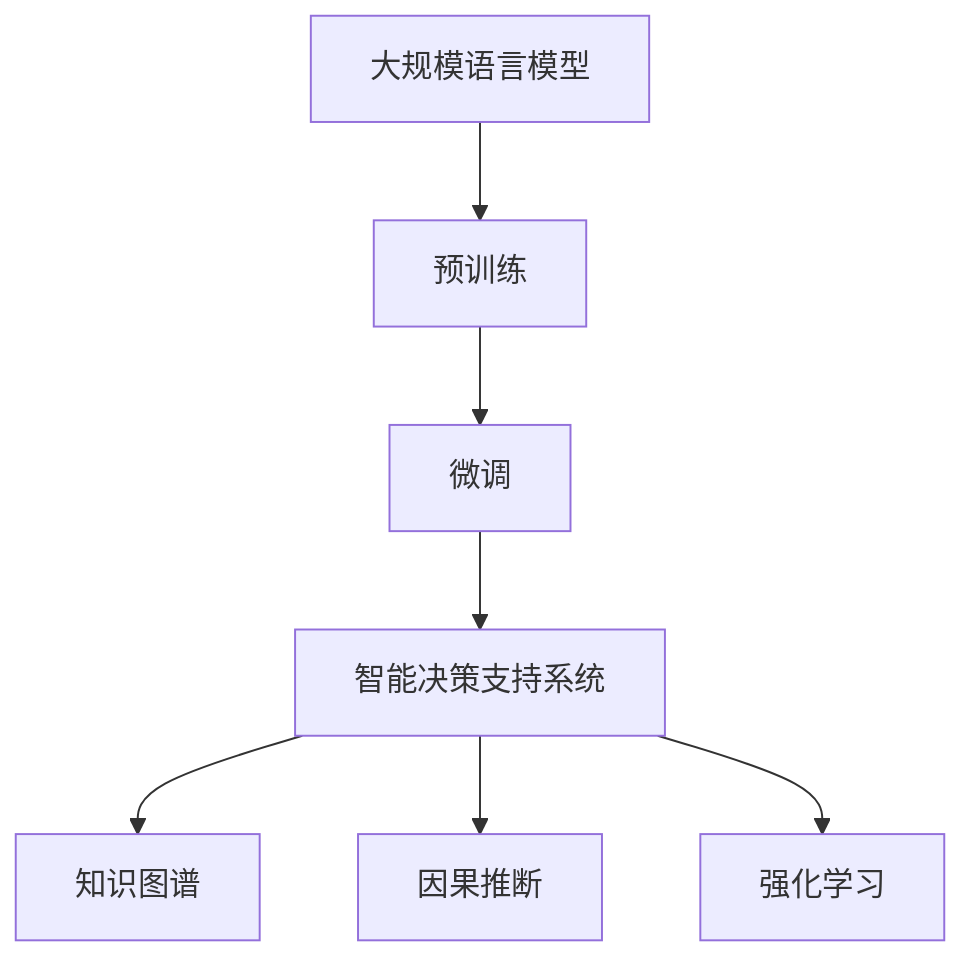

                 

# LLM在智能决策支持中的应用

## 1. 背景介绍

在现代社会中，决策支持系统（Decision Support System, DSS）正扮演着越来越重要的角色，尤其在医疗、金融、能源、制造业等领域。传统的决策支持系统主要依赖人工规则和经验，难以应对复杂多变的数据和动态变化的业务环境。智能决策支持系统则利用先进的AI技术，自动从海量数据中提取知识、构建模型，辅助用户进行更科学、更高效的决策。

大规模语言模型（Large Language Model, LLM）作为AI技术的重要分支，凭借其强大的自然语言理解和生成能力，成为构建智能决策支持系统的重要工具。在医疗决策、金融风控、客户服务、市场分析等多个领域，LLM已经展现出巨大的应用潜力。本文将从核心概念、算法原理、应用实践等方面，深入探讨LLM在智能决策支持中的应用，以期为相关研究和实践提供参考。

## 2. 核心概念与联系

### 2.1 核心概念概述

- **大规模语言模型（LLM）**：指通过自监督或监督学习任务训练得到的具有丰富语言知识和表达能力的神经网络模型，如BERT、GPT等。LLM能够理解自然语言文本，生成自然语言文本，具备强大的语言表示能力。

- **预训练与微调**：预训练指在大规模无标签文本上训练模型，学习通用的语言表示。微调指在预训练模型的基础上，使用下游任务的少量标注数据进行有监督学习，优化模型在该任务上的性能。

- **智能决策支持系统（DSS）**：通过人工智能技术辅助用户进行决策的计算机系统，可以自动从数据中提取知识、构建模型，提供决策建议。

- **知识图谱（Knowledge Graph, KG）**：由实体、关系、属性构成的网络结构，用于组织和表示实体之间的语义关系。知识图谱与LLM结合，可以实现语义级的知识推理和决策支持。

- **因果推断（Causal Inference）**：用于研究变量之间因果关系的统计学和机器学习方法，帮助LLM更好地理解因果逻辑，提升决策准确性。

- **强化学习（Reinforcement Learning, RL）**：利用环境反馈信息，通过优化决策策略提升模型性能。在DSS中，可以结合RL优化决策模型，使其在实际应用中不断学习并改进。

### 2.2 核心概念原理和架构的 Mermaid 流程图



## 3. 核心算法原理 & 具体操作步骤

### 3.1 算法原理概述

LLM在智能决策支持中的应用，主要通过预训练-微调框架，从无标签文本中学习语言表示，再通过下游任务的标注数据进行微调，优化模型在该任务上的性能。微调后的LLM模型能够自动从数据中提取特征，构建知识图谱，进行因果推断和强化学习，辅助用户进行科学决策。

具体来说，预训练阶段主要在大规模无标签文本上训练模型，学习通用的语言表示。微调阶段则通过下游任务的标注数据，调整模型参数，使其能够适应特定的决策需求。微调后的LLM模型可以自动从知识图谱中提取实体和关系，进行语义推理，辅助用户理解决策情境，识别因果关系。结合因果推断和强化学习，LLM可以进一步优化决策策略，提高决策准确性和鲁棒性。

### 3.2 算法步骤详解

#### 3.2.1 预训练阶段

1. **选择预训练模型**：根据应用场景选择合适的预训练语言模型，如BERT、GPT等。
2. **准备预训练数据**：收集大规模无标签文本数据，进行预处理和分词。
3. **训练预训练模型**：在预训练数据上训练模型，学习通用的语言表示。
4. **评估预训练效果**：在验证集上评估预训练模型的性能，根据评估结果调整训练参数。

#### 3.2.2 微调阶段

1. **准备微调数据**：收集下游任务的标注数据，进行数据预处理。
2. **设计任务适配层**：根据任务类型，设计合适的输出层和损失函数。
3. **设置微调超参数**：选择优化算法、学习率、批大小等微调超参数。
4. **执行微调训练**：在微调数据上训练模型，更新参数。
5. **评估微调效果**：在验证集上评估微调模型的性能，根据评估结果调整微调参数。
6. **应用微调模型**：将微调后的模型应用于智能决策支持系统，进行决策辅助。

### 3.3 算法优缺点

#### 3.3.1 优点

1. **高效性**：通过预训练-微调框架，LLM可以在小规模标注数据上快速达到较优性能。
2. **泛化性强**：预训练模型具备较强的泛化能力，适用于多种不同类型的决策支持任务。
3. **灵活性高**：微调模型可以根据任务需求灵活调整，适应复杂多变的业务环境。
4. **应用广泛**：LLM在医疗、金融、制造等多个领域都有广泛应用，具有广泛的应用前景。

#### 3.3.2 缺点

1. **数据依赖高**：微调效果很大程度上依赖于标注数据的质量和数量，获取高质量标注数据的成本较高。
2. **模型复杂度高**：预训练模型参数量较大，训练和推理耗时较长，计算资源需求较高。
3. **可解释性差**：LLM模型的决策过程复杂，难以解释其内部工作机制和决策逻辑。
4. **鲁棒性不足**：微调模型对输入数据的变化敏感，可能出现泛化能力不足的问题。

### 3.4 算法应用领域

#### 3.4.1 医疗决策支持

在医疗领域，智能决策支持系统利用LLM进行病历分析、疾病诊断、治疗方案推荐等。通过微调预训练模型，LLM能够自动提取病历文本中的关键信息，进行语义推理，辅助医生进行决策。例如，在诊断肺癌时，LLM可以从电子病历中提取症状、影像学特征等信息，结合医学知识图谱，进行因果推断和诊断建议。

#### 3.4.2 金融风险控制

金融领域需要实时监测市场风险，评估信用风险、投资回报等。智能决策支持系统利用LLM进行风险预警、信用评分、投资组合优化等。通过微调预训练模型，LLM能够自动处理金融数据，识别异常交易和风险信号，进行风险控制。例如，在信用评分中，LLM可以从客户的财务记录和行为数据中提取特征，结合因果推断模型，预测客户的违约概率。

#### 3.4.3 客户服务支持

客户服务是企业的重要环节，智能决策支持系统利用LLM进行自动回复、客户细分、情感分析等。通过微调预训练模型，LLM能够自动理解和处理客户咨询，提供个性化的服务。例如，在自动回复中，LLM可以从客户问题中提取关键词，结合知识图谱，生成合适的回答。

#### 3.4.4 市场分析决策

市场分析需要处理海量数据，提取市场趋势和洞察。智能决策支持系统利用LLM进行数据处理、趋势分析、竞争对手分析等。通过微调预训练模型，LLM能够自动从数据中提取特征，构建知识图谱，进行语义推理。例如，在市场分析中，LLM可以从新闻、社交媒体、销售数据中提取关键信息，构建市场知识图谱，识别市场趋势和竞争对手。

## 4. 数学模型和公式 & 详细讲解 & 举例说明

### 4.1 数学模型构建

#### 4.1.1 预训练模型构建

预训练模型可以采用自回归模型（如GPT）或自编码模型（如BERT）。以BERT为例，其预训练目标包括掩码语言模型（Masked Language Model, MLM）和下一句预测（Next Sentence Prediction, NSP）：

$$
\text{MLM Loss} = -\sum_{i=1}^n\log p(w_i|\{w_j\}_{j\ne i})
$$

$$
\text{NSP Loss} = -\sum_{i=1}^n\log p(\text{NSP}(x_i,y_i))
$$

其中，$w_i$ 为输入文本中的第$i$个词，$p(\cdot)$ 为概率分布，$y_i$ 为下一句或掩码位置。

#### 4.1.2 微调模型构建

微调模型通常设计为输出层和损失函数。以分类任务为例，微调模型的输出层为线性分类器，损失函数为交叉熵损失：

$$
\text{Cross-Entropy Loss} = -\sum_{i=1}^n y_i\log \hat{y}_i
$$

其中，$y_i$ 为真实标签，$\hat{y}_i$ 为模型预测的概率。

### 4.2 公式推导过程

#### 4.2.1 掩码语言模型损失函数

掩码语言模型损失函数用于衡量模型对输入文本的预测能力。假设输入文本为$x$，掩码位置为$\{m_i\}$，掩码词为$w_{m_i}$，模型预测结果为$\hat{w}_{m_i}$：

$$
\text{MLM Loss} = -\sum_{m_i\in \text{Mask Positions}} \log p(w_{m_i}|\{x_j\}_{j\ne m_i})
$$

其中，$p(\cdot)$ 为概率分布，$x$ 为输入文本，$\{m_i\}$ 为掩码位置集合。

#### 4.2.2 下一句预测损失函数

下一句预测损失函数用于衡量模型对文本序列关系的预测能力。假设输入文本为$(x_i,y_i)$，下一句预测结果为$\hat{y}_i$：

$$
\text{NSP Loss} = -\log p(y_i|\{x_j\}_{j\ne i})
$$

其中，$y_i$ 为下一句标签，$x$ 为输入文本，$p(\cdot)$ 为概率分布。

### 4.3 案例分析与讲解

以医疗决策支持为例，微调BERT模型进行疾病诊断。假设输入文本为电子病历$x$，标签为疾病类型$y$，微调模型设计为线性分类器，损失函数为交叉熵损失：

$$
\text{Cross-Entropy Loss} = -\sum_{i=1}^n y_i\log \hat{y}_i
$$

其中，$y_i$ 为真实疾病类型，$\hat{y}_i$ 为模型预测的概率。

在微调过程中，利用掩码语言模型和下一句预测任务进行预训练，然后在医疗病历数据上进行微调，学习疾病诊断知识。微调后的模型可以自动从病历中提取特征，结合医学知识图谱进行因果推断，提供诊断建议。

## 5. 项目实践：代码实例和详细解释说明

### 5.1 开发环境搭建

#### 5.1.1 软件环境配置

- **Python**：Python 3.x
- **PyTorch**：1.7.0以上
- **Hugging Face Transformers**：4.5.1以上
- **TensorBoard**：2.8.0以上

#### 5.1.2 环境搭建

1. 安装Anaconda，创建虚拟环境：
```bash
conda create -n dss-env python=3.7 
conda activate dss-env
```

2. 安装所需的库：
```bash
conda install torch torchvision torchaudio transformers numpy pandas scikit-learn scipy matplotlib jupyter notebook
```

3. 安装TensorBoard：
```bash
pip install tensorboard
```

### 5.2 源代码详细实现

以微调BERT模型进行疾病诊断为例，代码实现如下：

#### 5.2.1 数据预处理

```python
import pandas as pd
from transformers import BertTokenizer

# 读取病历数据
df = pd.read_csv('medical_records.csv')

# 数据预处理
tokenizer = BertTokenizer.from_pretrained('bert-base-uncased')
encoded_data = tokenizer(df['text'], truncation=True, padding=True)

# 划分训练集和验证集
train_encoded_data = encoded_data[:int(0.8 * len(encoded_data))]
val_encoded_data = encoded_data[int(0.8 * len(encoded_data)):]
```

#### 5.2.2 模型构建

```python
from transformers import BertForSequenceClassification

# 构建微调模型
model = BertForSequenceClassification.from_pretrained('bert-base-uncased', num_labels=10)
model.to('cuda')
```

#### 5.2.3 训练与评估

```python
from transformers import AdamW, get_linear_schedule_with_warmup

# 设置超参数
lr = 2e-5
epochs = 5
train_batch_size = 16
val_batch_size = 16
max_grad_norm = 1.0

# 定义优化器和学习率调度器
optimizer = AdamW(model.parameters(), lr=lr)
total_steps = len(train_encoded_data) // train_batch_size * epochs
scheduler = get_linear_schedule_with_warmup(optimizer, num_warmup_steps=0, num_training_steps=total_steps)

# 训练模型
model.train()
for epoch in range(epochs):
    total_loss = 0
    for batch in train_encoded_data:
        inputs = tokenizer(batch, padding='max_length', truncation=True, return_tensors='pt').to('cuda')
        outputs = model(**inputs)
        loss = outputs.loss
        total_loss += loss.item()
        optimizer.zero_grad()
        loss.backward()
        torch.nn.utils.clip_grad_norm_(model.parameters(), max_grad_norm)
        scheduler.step()
    print(f"Epoch {epoch+1}, train loss: {total_loss/len(train_encoded_data):.4f}")

# 评估模型
model.eval()
val_loss = 0
for batch in val_encoded_data:
    inputs = tokenizer(batch, padding='max_length', truncation=True, return_tensors='pt').to('cuda')
    outputs = model(**inputs)
    val_loss += outputs.loss.item()
print(f"Validation loss: {val_loss/len(val_encoded_data):.4f}")
```

#### 5.2.4 代码解读与分析

在上述代码中，首先使用BERT Tokenizer对病历文本进行分词，然后构建微调模型，设置优化器和学习率调度器。在训练过程中，使用AdamW优化器，设置学习率和学习率调度器，通过前向传播和反向传播更新模型参数。在评估过程中，使用验证集对模型进行评估，输出验证集上的损失。

### 5.3 运行结果展示

在训练结束后，可以使用TensorBoard对模型进行可视化，分析模型性能。TensorBoard可以显示训练过程中的各种指标，如损失、准确率、梯度等，帮助开发者优化模型。

## 6. 实际应用场景

### 6.1 医疗决策支持

在医疗决策支持系统中，LLM可以辅助医生进行病历分析、疾病诊断、治疗方案推荐等。以疾病诊断为例，微调BERT模型可以从电子病历中提取关键信息，进行语义推理，辅助医生进行诊断。例如，在诊断肺癌时，LLM可以从电子病历中提取症状、影像学特征等信息，结合医学知识图谱，进行因果推断和诊断建议。

### 6.2 金融风险控制

在金融领域，智能决策支持系统利用LLM进行风险预警、信用评分、投资组合优化等。通过微调预训练模型，LLM能够自动处理金融数据，识别异常交易和风险信号，进行风险控制。例如，在信用评分中，LLM可以从客户的财务记录和行为数据中提取特征，结合因果推断模型，预测客户的违约概率。

### 6.3 客户服务支持

客户服务是企业的重要环节，智能决策支持系统利用LLM进行自动回复、客户细分、情感分析等。通过微调预训练模型，LLM能够自动理解和处理客户咨询，提供个性化的服务。例如，在自动回复中，LLM可以从客户问题中提取关键词，结合知识图谱，生成合适的回答。

### 6.4 市场分析决策

市场分析需要处理海量数据，提取市场趋势和洞察。智能决策支持系统利用LLM进行数据处理、趋势分析、竞争对手分析等。通过微调预训练模型，LLM能够自动从数据中提取特征，构建知识图谱，进行语义推理。例如，在市场分析中，LLM可以从新闻、社交媒体、销售数据中提取关键信息，构建市场知识图谱，识别市场趋势和竞争对手。

## 7. 工具和资源推荐

### 7.1 学习资源推荐

为了帮助开发者系统掌握LLM在智能决策支持中的应用，这里推荐一些优质的学习资源：

1. 《深度学习理论与实践》系列博文：深入讲解深度学习理论，包含大量实用案例和代码实现。
2. Coursera《深度学习》课程：由斯坦福大学教授Andrew Ng开设，涵盖深度学习基础和应用。
3. CS231n《卷积神经网络》课程：斯坦福大学开设的计算机视觉经典课程，帮助理解深度学习在计算机视觉中的应用。
4. 《Python深度学习》书籍：由François Chollet所著，介绍TensorFlow和Keras深度学习框架的使用。
5. 《自然语言处理综论》书籍：由Daniel Jurafsky和James H. Martin所著，全面介绍自然语言处理的基本概念和前沿技术。
6. Hugging Face官方文档：提供详细的Transformers库使用方法，涵盖预训练模型和微调样例代码。

### 7.2 开发工具推荐

为了高效开发智能决策支持系统，推荐以下开发工具：

1. PyTorch：灵活的深度学习框架，提供强大的自动微分和计算图功能。
2. TensorFlow：强大的分布式计算框架，支持GPU加速和生产部署。
3. Hugging Face Transformers：提供丰富的预训练模型和微调工具，支持多种NLP任务。
4. TensorBoard：用于模型训练和推理的可视化工具，提供丰富的图表和指标。
5. Jupyter Notebook：交互式的编程环境，支持代码调试和数据可视化。
6. Weights & Biases：用于模型实验的跟踪工具，记录训练过程中的各种指标。

### 7.3 相关论文推荐

LLM在智能决策支持领域的应用涉及多个交叉学科，以下是几篇相关领域的经典论文，推荐阅读：

1. "BERT: Pre-training of Deep Bidirectional Transformers for Language Understanding"（BERT论文）：提出BERT模型，引入掩码语言模型任务，提升自然语言处理的效果。
2. "A Survey on Knowledge Graphs and Their Applications in Healthcare"：综述知识图谱在医疗领域的应用，提供丰富的知识图谱构建和查询方法。
3. "Causal Inference in Economics and Epidemiology"：介绍因果推断在经济学和流行病学中的应用，为智能决策支持系统提供理论支持。
4. "A Survey on Causal Inference Methods in Healthcare Informatics"：综述因果推断在医疗信息学中的应用，提供多种因果推断方法。
5. "Reinforcement Learning for Healthcare Decision-Making"：介绍强化学习在医疗决策中的应用，提供决策优化算法。

## 8. 总结：未来发展趋势与挑战

### 8.1 总结

本文对LLM在智能决策支持中的应用进行了全面系统的介绍。首先阐述了LLM和微调技术的研究背景和意义，明确了其在医疗、金融、客户服务、市场分析等多个领域的应用潜力。其次，从原理到实践，详细讲解了LLM在智能决策支持系统中的算法原理和操作步骤，给出了微调任务开发的完整代码实例。最后，本文还广泛探讨了LLM在智能决策支持系统中的应用前景和未来发展趋势，提供了相关的学习资源和开发工具，力求为读者提供全方位的技术指引。

通过本文的系统梳理，可以看到，LLM在智能决策支持系统中的应用前景广阔，具有重要的战略价值。LLM能够自动从海量数据中提取知识，构建知识图谱，进行因果推断和强化学习，辅助用户进行科学决策。未来，随着LLM技术的发展，其在智能决策支持系统中的应用将更加深入和广泛，成为推动人工智能技术发展的重要力量。

### 8.2 未来发展趋势

展望未来，LLM在智能决策支持系统中的应用将呈现以下几个发展趋势：

1. **深度融合知识图谱**：LLM将与知识图谱深度融合，构建语义级的知识推理和决策支持，提升决策的准确性和鲁棒性。
2. **引入因果推断**：结合因果推断方法，LLM能够更好地理解因果逻辑，提升决策的可解释性和可靠性。
3. **结合强化学习**：LLM结合强化学习，能够自适应地优化决策策略，提升决策效率和效果。
4. **多模态信息融合**：LLM将结合视觉、语音等多模态信息，提升决策的全面性和准确性。
5. **跨领域知识迁移**：LLM将在多个领域进行知识迁移和优化，提升跨领域决策能力。
6. **自适应学习**：LLM能够自适应地从新数据中学习，不断优化决策模型，保持决策性能的实时性和适应性。

### 8.3 面临的挑战

尽管LLM在智能决策支持系统中展现出巨大潜力，但在实际应用中仍面临以下挑战：

1. **数据依赖**：微调效果很大程度上依赖于标注数据的质量和数量，获取高质量标注数据的成本较高。
2. **计算资源需求高**：预训练模型参数量较大，训练和推理耗时较长，计算资源需求较高。
3. **可解释性不足**：LLM模型的决策过程复杂，难以解释其内部工作机制和决策逻辑。
4. **鲁棒性不足**：微调模型对输入数据的变化敏感，可能出现泛化能力不足的问题。
5. **安全性有待提升**：预训练模型可能学习到有害信息，需要通过数据和算法层面进行过滤和处理，确保系统安全性。

### 8.4 研究展望

面对LLM在智能决策支持系统中面临的挑战，未来的研究需要在以下几个方面寻求新的突破：

1. **降低数据依赖**：探索无监督和半监督学习范式，利用自监督学习、主动学习等方法，最大限度利用非结构化数据，实现更加灵活高效的微调。
2. **提升计算效率**：开发更加参数高效和计算高效的微调方法，减少前向传播和反向传播的资源消耗，实现更加轻量级、实时性的部署。
3. **增强可解释性**：引入因果推断和符号化知识，增强LLM模型的可解释性和逻辑性，提高决策的可信度和透明性。
4. **保障安全性**：在模型训练目标中引入伦理导向的评估指标，过滤和惩罚有害的输出倾向，加强人工干预和审核，确保系统安全性。
5. **融合多模态信息**：结合视觉、语音等多模态信息，提升决策的全面性和准确性。
6. **提升知识迁移能力**：在多个领域进行知识迁移和优化，提升跨领域决策能力。

这些研究方向将推动LLM在智能决策支持系统中的应用不断深化，为构建安全、可靠、可解释、可控的智能系统铺平道路，引领人工智能技术迈向更高的台阶。

## 9. 附录：常见问题与解答

### 9.1 Q1: 如何选择合适的预训练模型？

A: 选择预训练模型时应考虑任务需求和数据特性。例如，对于文本分类任务，可以选择BERT或GPT作为预训练模型，对于文本生成任务，可以选择GPT-2或GPT-3。对于特定领域任务，可以选择在该领域上进行预训练的模型，如针对医疗领域的BERT-MED模型。

### 9.2 Q2: 微调过程中如何进行超参数调优？

A: 微调过程中的超参数调优主要通过网格搜索、随机搜索和贝叶斯优化等方法进行。超参数包括学习率、批大小、优化器等。通常使用验证集上的性能指标进行调优，如准确率、损失等。可以使用TensorBoard等可视化工具，跟踪训练过程中的指标，帮助调优。

### 9.3 Q3: 如何提高微调模型的鲁棒性？

A: 提高微调模型的鲁棒性可以通过数据增强、对抗训练、正则化等方法。数据增强方法包括文本回译、近义词替换等，对抗训练方法包括生成对抗样本进行训练，正则化方法包括L2正则、Dropout等。此外，可以使用知识图谱和多任务学习等方法，提高模型的泛化能力和鲁棒性。

### 9.4 Q4: 如何在微调中平衡计算效率和模型性能？

A: 平衡计算效率和模型性能可以通过参数高效微调方法实现。例如，使用Adapter方法，仅微调模型的一部分参数，保留大部分预训练权重，减少计算资源消耗。此外，可以采用分布式训练和混合精度训练等方法，提高计算效率。

### 9.5 Q5: 如何增强LLM的可解释性？

A: 增强LLM的可解释性可以通过引入因果推断、符号化知识等方法。例如，在决策过程中引入因果推断，解释变量之间的因果关系，增强决策的可解释性。引入符号化知识，如知识图谱，增强LLM的逻辑性和透明性。

---

作者：禅与计算机程序设计艺术 / Zen and the Art of Computer Programming

