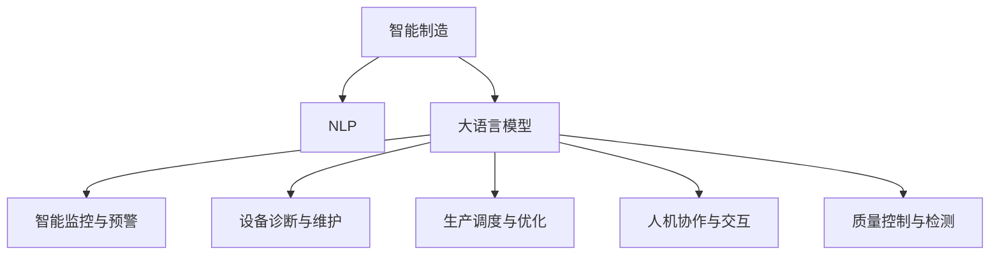

                 

# LLM在智能制造中的应用前景

> 关键词：智能制造,自然语言处理,大语言模型,工业4.0,数字化转型,制造自动化,生产效率

## 1. 背景介绍

### 1.1 问题由来

近年来，随着工业4.0时代的到来，智能制造已经成为各制造企业数字化转型升级的重要方向。然而，传统的自动化系统往往只能进行机械式的执行操作，缺乏自适应和自学习的能力。如何在智能制造系统中引入人机交互的自然语言处理(NLP)能力，实现灵活、智能的决策支持，成为了当前智能制造领域的热点问题。

大语言模型(Large Language Model, LLM)作为当前NLP领域的重要技术，通过在大规模无标签文本数据上进行预训练，学习到丰富的语言知识和常识，具有强大的自然语言理解和生成能力。将大语言模型引入智能制造系统，可以赋予机器更为智能的语言处理能力，提升智能制造的自动化和智能化水平。

### 1.2 问题核心关键点

目前，大语言模型在智能制造系统中的应用主要集中于以下几个方面：

1. **智能监控与预警**：通过语音或文本交互，大语言模型能够实时监测生产环境，识别异常情况并及时预警，保障生产安全。
2. **设备诊断与维护**：利用自然语言处理技术，大语言模型可以自动分析设备运行数据，预测设备故障，指导维护工作。
3. **生产调度与优化**：通过理解生产任务描述，大语言模型能够制定最优的生产调度方案，优化生产流程。
4. **人机协作与交互**：在智能制造系统中，大语言模型作为人机交互的重要媒介，辅助工人完成复杂任务，提高生产效率。
5. **质量控制与检测**：通过文本或语音反馈，大语言模型可以参与质量检测过程，自动识别和标注产品缺陷。

### 1.3 问题研究意义

研究大语言模型在智能制造系统中的应用，对于推动智能制造的智能化和自动化，提升生产效率和质量，具有重要意义：

1. **提升生产效率**：大语言模型能够在复杂的生产环境中，快速理解任务描述，制定最优的生产计划和调度方案，优化生产流程，提高生产效率。
2. **保障生产安全**：通过实时监控和预警系统，大语言模型能够及时识别异常情况，避免生产事故，保障生产安全。
3. **提升产品质量**：大语言模型可以参与质量检测过程，自动识别和标注产品缺陷，提升产品质量控制水平。
4. **降低人力成本**：通过辅助工人完成复杂任务，大语言模型可以有效减少人力需求，降低人力成本。
5. **推动产业升级**：大语言模型技术在智能制造系统中的应用，将推动传统制造向智能化、自动化方向转型，提升制造业的竞争力。

## 2. 核心概念与联系

### 2.1 核心概念概述

为更好地理解大语言模型在智能制造中的应用，本节将介绍几个密切相关的核心概念：

- 智能制造(Smart Manufacturing)：以信息物理系统(CPS)为支撑，通过互联网、物联网、云计算等技术，实现制造过程的数字化、智能化和网络化。
- 自然语言处理(NLP)：研究如何让计算机能够理解、处理和生成自然语言的技术，包括语言模型、文本分类、信息抽取、问答系统等。
- 大语言模型(Large Language Model, LLM)：指基于大规模无标签文本数据进行预训练，学习到丰富语言知识和常识的深度学习模型，如GPT、BERT、T5等。
- 工业4.0(Industry 4.0)：指通过信息通信技术(ICT)、云计算、物联网等手段，实现智能化生产、柔性制造和精准物流的工业革命。
- 数字化转型(Digital Transformation)：指企业通过数字化技术改造和优化业务流程，提升竞争力和创新能力的过程。

这些核心概念之间的逻辑关系可以通过以下Mermaid流程图来展示：



这个流程图展示了大语言模型在智能制造中的核心应用场景，以及这些场景如何通过NLP技术进行具体实现。

## 3. 核心算法原理 & 具体操作步骤
### 3.1 算法原理概述

大语言模型在智能制造中的应用，本质上是一个将NLP技术与智能制造系统相结合的工程实践过程。其核心思想是：利用大语言模型的自然语言处理能力，对智能制造系统中的各类任务进行智能化处理，提升系统的决策能力和自动化水平。

具体而言，大语言模型通过以下步骤实现其在智能制造系统中的应用：

1. **任务适配层设计**：根据具体的智能制造任务需求，设计合适的任务适配层，将大语言模型的输出转化为对应的制造指令或决策结果。
2. **数据预处理**：将智能制造系统中的各类文本数据（如生产日志、设备数据、操作指令等）进行预处理，转化为模型可以处理的输入格式。
3. **模型微调**：在预训练大语言模型上，使用智能制造系统中的标注数据进行微调，优化模型的预测性能。
4. **结果后处理**：对大语言模型的输出进行后处理，确保其符合智能制造系统的实际需求，提高决策的可靠性和准确性。

### 3.2 算法步骤详解

大语言模型在智能制造系统中的应用，具体包括以下关键步骤：

**Step 1: 任务适配层设计**

不同的智能制造任务需要不同的任务适配层，以将大语言模型的输出转化为可执行的指令或决策结果。例如：

- **智能监控与预警**：设计一套文本分类模型，用于识别设备异常和生产问题，并生成预警信息。
- **设备诊断与维护**：构建一个问答系统，根据设备运行数据和操作日志，自动解答设备的故障诊断和维护问题。
- **生产调度与优化**：开发一个生成式文本模型，根据生产任务描述和资源约束，生成最优的生产调度方案。
- **人机协作与交互**：设计一个对话系统，根据工人输入的指令和反馈，提供智能化的操作指导和建议。
- **质量控制与检测**：构建一个序列标注模型，用于自动检测和标注产品缺陷，生成质量报告。

**Step 2: 数据预处理**

智能制造系统中产生的数据类型多样，包括文本、图像、视频等，需要进行格式统一和清洗。以下是一些常见的数据预处理步骤：

- **文本数据**：清洗文本中的噪声和特殊字符，分词、去除停用词等，最终转化为模型所需的输入格式。
- **图像数据**：通过预处理技术，如裁剪、缩放、灰度化等，将图像数据转化为统一的大小和格式。
- **视频数据**：通过帧抽样、帧间差分等技术，提取关键帧信息，转化为视频流。
- **传感器数据**：对设备传感器采集的数据进行标准化和归一化处理，转化为数字信号。

**Step 3: 模型微调**

在智能制造系统中，大语言模型通常需要进行微调，以适应该系统特定的任务需求。以下是一些常见的微调步骤：

- **模型选择**：根据任务需求选择合适的预训练模型，如GPT、BERT、T5等。
- **数据准备**：收集智能制造系统中的标注数据，划分为训练集、验证集和测试集。
- **超参数设置**：选择合适的优化算法及其参数，如AdamW、SGD等，设置学习率、批大小、迭代轮数等。
- **模型训练**：将预处理后的数据输入模型进行训练，使用标注数据更新模型参数，最小化损失函数。
- **结果评估**：在验证集上评估模型性能，根据性能指标决定是否触发Early Stopping。
- **模型保存**：保存训练好的模型，用于后续的推理和应用。

**Step 4: 结果后处理**

大语言模型的输出通常需要进行后处理，以确保其符合智能制造系统的实际需求。以下是一些常见的后处理步骤：

- **文本生成**：对大语言模型的输出进行语法校验和语义修正，生成符合规范的文本结果。
- **图像识别**：对大语言模型的输出进行二值化、滤波等处理，转化为可执行的图像数据。
- **视频分析**：对大语言模型的输出进行帧识别和跟踪，提取关键信息。
- **质量检测**：对大语言模型的输出进行自动标注和分类，生成质量报告。

### 3.3 算法优缺点

大语言模型在智能制造系统中的应用具有以下优点：

1. **灵活性强**：大语言模型能够理解和处理自然语言描述，适应各种复杂的智能制造场景。
2. **泛化能力强**：基于大规模无标签文本数据的预训练，大语言模型具备强大的泛化能力，能够处理各种不同类型的数据。
3. **决策透明**：通过自然语言处理技术，大语言模型的决策过程具有可解释性，便于对模型进行调优和调试。
4. **扩展性好**：大语言模型可以根据任务需求进行微调，扩展性较好。

同时，大语言模型在智能制造系统中的应用也存在一些局限性：

1. **数据依赖性强**：大语言模型的性能很大程度上依赖于标注数据的质量和数量，获取高质量标注数据的成本较高。
2. **计算资源消耗大**：大语言模型参数量较大，推理和训练时需要大量的计算资源和存储资源。
3. **输出结果可靠性差**：大语言模型的输出结果可能会受到输入数据的影响，需要进行后处理以提高其可靠性。
4. **模型训练时间长**：大语言模型需要进行预训练和微调，训练时间较长，难以实时响应生产需求。
5. **系统复杂度高**：将大语言模型引入智能制造系统，需要搭建复杂的系统架构，增加了系统的复杂性。

### 3.4 算法应用领域

大语言模型在智能制造系统中的应用，主要集中在以下几个领域：

- **智能监控与预警**：利用自然语言处理技术，对生产环境进行实时监控，自动识别异常情况并生成预警信息。
- **设备诊断与维护**：通过分析设备运行数据和操作日志，构建设备故障诊断和维护系统。
- **生产调度与优化**：根据生产任务描述和资源约束，生成最优的生产调度方案。
- **人机协作与交互**：辅助工人完成复杂任务，提高生产效率和质量。
- **质量控制与检测**：自动检测和标注产品缺陷，生成质量报告。

此外，大语言模型还可以应用于供应链管理、智能物流、生产计划制定等智能制造系统中的其他环节，提升系统的智能化水平和生产效率。

## 4. 数学模型和公式 & 详细讲解  
### 4.1 数学模型构建

本节将使用数学语言对大语言模型在智能制造系统中的应用进行更加严格的刻画。

假设智能制造系统中的任务为 $T$，数据集为 $D=\{(x_i,y_i)\}_{i=1}^N, x_i \in X, y_i \in Y$，其中 $X$ 为输入空间，$Y$ 为输出空间。定义模型 $M_{\theta}$ 在输入 $x$ 上的输出为 $\hat{y}=M_{\theta}(x) \in Y$，则任务 $T$ 的损失函数 $\ell(M_{\theta}(x),y)$ 可以表示为：

$$
\ell(M_{\theta}(x),y) = \begin{cases} 
\ell_{\text{分类}}(\hat{y},y) & \text{if } T \text{ 为分类任务} \\
\ell_{\text{回归}}(\hat{y},y) & \text{if } T \text{ 为回归任务} 
\end{cases}
$$

其中 $\ell_{\text{分类}}(\hat{y},y)$ 和 $\ell_{\text{回归}}(\hat{y},y)$ 分别为分类损失和回归损失函数。

假设智能制造系统中的标注数据集为 $D=\{(x_i,y_i)\}_{i=1}^N$，模型 $M_{\theta}$ 在数据集 $D$ 上的经验风险为：

$$
\mathcal{L}(\theta) = \frac{1}{N} \sum_{i=1}^N \ell(M_{\theta}(x_i),y_i)
$$

在模型微调过程中，我们使用监督学习的方法，通过标注数据更新模型参数 $\theta$，使得模型 $M_{\theta}$ 在任务 $T$ 上的损失函数最小化。具体而言，我们使用以下梯度下降算法来更新模型参数：

$$
\theta \leftarrow \theta - \eta \nabla_{\theta}\mathcal{L}(\theta) - \eta\lambda\theta
$$

其中 $\eta$ 为学习率，$\lambda$ 为正则化系数，$\nabla_{\theta}\mathcal{L}(\theta)$ 为损失函数对参数 $\theta$ 的梯度，可以通过反向传播算法高效计算。

### 4.2 公式推导过程

以下我们以智能监控与预警任务为例，推导分类损失函数及其梯度的计算公式。

假设模型 $M_{\theta}$ 在输入 $x$ 上的输出为 $\hat{y}=M_{\theta}(x) \in [0,1]$，表示样本属于正类的概率。真实标签 $y \in \{0,1\}$。则二分类交叉熵损失函数定义为：

$$
\ell(M_{\theta}(x),y) = -[y\log \hat{y} + (1-y)\log (1-\hat{y})]
$$

将其代入经验风险公式，得：

$$
\mathcal{L}(\theta) = -\frac{1}{N}\sum_{i=1}^N [y_i\log M_{\theta}(x_i)+(1-y_i)\log(1-M_{\theta}(x_i))]
$$

根据链式法则，损失函数对参数 $\theta_k$ 的梯度为：

$$
\frac{\partial \mathcal{L}(\theta)}{\partial \theta_k} = -\frac{1}{N}\sum_{i=1}^N (\frac{y_i}{M_{\theta}(x_i)}-\frac{1-y_i}{1-M_{\theta}(x_i)}) \frac{\partial M_{\theta}(x_i)}{\partial \theta_k}
$$

其中 $\frac{\partial M_{\theta}(x_i)}{\partial \theta_k}$ 可进一步递归展开，利用自动微分技术完成计算。

在得到损失函数的梯度后，即可带入参数更新公式，完成模型的迭代优化。重复上述过程直至收敛，最终得到适应智能制造任务的最优模型参数 $\theta^*$。

## 5. 项目实践：代码实例和详细解释说明
### 5.1 开发环境搭建

在进行智能制造系统中的大语言模型应用实践前，我们需要准备好开发环境。以下是使用Python进行PyTorch开发的环境配置流程：

1. 安装Anaconda：从官网下载并安装Anaconda，用于创建独立的Python环境。

2. 创建并激活虚拟环境：
```bash
conda create -n pytorch-env python=3.8 
conda activate pytorch-env
```

3. 安装PyTorch：根据CUDA版本，从官网获取对应的安装命令。例如：
```bash
conda install pytorch torchvision torchaudio cudatoolkit=11.1 -c pytorch -c conda-forge
```

4. 安装Transformers库：
```bash
pip install transformers
```

5. 安装各类工具包：
```bash
pip install numpy pandas scikit-learn matplotlib tqdm jupyter notebook ipython
```

完成上述步骤后，即可在`pytorch-env`环境中开始智能制造系统中的大语言模型应用实践。

### 5.2 源代码详细实现

下面以智能监控与预警任务为例，给出使用Transformers库对BERT模型进行微调的PyTorch代码实现。

首先，定义智能监控与预警任务的数据处理函数：

```python
from transformers import BertTokenizer
from torch.utils.data import Dataset
import torch

class MonitorDataset(Dataset):
    def __init__(self, data, tokenizer, max_len=128):
        self.data = data
        self.tokenizer = tokenizer
        self.max_len = max_len
        
    def __len__(self):
        return len(self.data)
    
    def __getitem__(self, item):
        text = self.data[item]
        
        encoding = self.tokenizer(text, return_tensors='pt', max_length=self.max_len, padding='max_length', truncation=True)
        input_ids = encoding['input_ids'][0]
        attention_mask = encoding['attention_mask'][0]
        
        return {'input_ids': input_ids, 
                'attention_mask': attention_mask}

# 创建dataset
tokenizer = BertTokenizer.from_pretrained('bert-base-cased')

train_dataset = MonitorDataset(train_data, tokenizer)
dev_dataset = MonitorDataset(dev_data, tokenizer)
test_dataset = MonitorDataset(test_data, tokenizer)
```

然后，定义模型和优化器：

```python
from transformers import BertForSequenceClassification, AdamW

model = BertForSequenceClassification.from_pretrained('bert-base-cased', num_labels=2)

optimizer = AdamW(model.parameters(), lr=2e-5)
```

接着，定义训练和评估函数：

```python
from torch.utils.data import DataLoader
from tqdm import tqdm
from sklearn.metrics import accuracy_score

device = torch.device('cuda') if torch.cuda.is_available() else torch.device('cpu')
model.to(device)

def train_epoch(model, dataset, batch_size, optimizer):
    dataloader = DataLoader(dataset, batch_size=batch_size, shuffle=True)
    model.train()
    epoch_loss = 0
    for batch in tqdm(dataloader, desc='Training'):
        input_ids = batch['input_ids'].to(device)
        attention_mask = batch['attention_mask'].to(device)
        labels = batch['labels'].to(device)
        model.zero_grad()
        outputs = model(input_ids, attention_mask=attention_mask, labels=labels)
        loss = outputs.loss
        epoch_loss += loss.item()
        loss.backward()
        optimizer.step()
    return epoch_loss / len(dataloader)

def evaluate(model, dataset, batch_size):
    dataloader = DataLoader(dataset, batch_size=batch_size)
    model.eval()
    preds, labels = [], []
    with torch.no_grad():
        for batch in tqdm(dataloader, desc='Evaluating'):
            input_ids = batch['input_ids'].to(device)
            attention_mask = batch['attention_mask'].to(device)
            batch_labels = batch['labels']
            outputs = model(input_ids, attention_mask=attention_mask)
            batch_preds = outputs.logits.argmax(dim=2).to('cpu').tolist()
            batch_labels = batch_labels.to('cpu').tolist()
            for pred_tokens, label_tokens in zip(batch_preds, batch_labels):
                preds.append(pred_tokens[:len(label_tokens)])
                labels.append(label_tokens)
                
    print('Accuracy:', accuracy_score(labels, preds))
```

最后，启动训练流程并在测试集上评估：

```python
epochs = 5
batch_size = 16

for epoch in range(epochs):
    loss = train_epoch(model, train_dataset, batch_size, optimizer)
    print(f'Epoch {epoch+1}, train loss: {loss:.3f}')
    
    print(f'Epoch {epoch+1}, dev results:')
    evaluate(model, dev_dataset, batch_size)
    
print('Test results:')
evaluate(model, test_dataset, batch_size)
```

以上就是使用PyTorch对BERT进行智能监控与预警任务微调的完整代码实现。可以看到，得益于Transformers库的强大封装，我们可以用相对简洁的代码完成BERT模型的加载和微调。

### 5.3 代码解读与分析

让我们再详细解读一下关键代码的实现细节：

**MonitorDataset类**：
- `__init__`方法：初始化文本数据、分词器等关键组件。
- `__len__`方法：返回数据集的样本数量。
- `__getitem__`方法：对单个样本进行处理，将文本输入编码为token ids，最终返回模型所需的输入。

**模型和优化器**：
- `BertForSequenceClassification`类：定义分类任务适配层，用于处理二分类任务的输出。
- `AdamW`优化器：设置学习率为2e-5，用于更新模型参数。

**训练和评估函数**：
- 使用PyTorch的DataLoader对数据集进行批次化加载，供模型训练和推理使用。
- 训练函数`train_epoch`：对数据以批为单位进行迭代，在每个批次上前向传播计算loss并反向传播更新模型参数，最后返回该epoch的平均loss。
- 评估函数`evaluate`：与训练类似，不同点在于不更新模型参数，并在每个batch结束后将预测和标签结果存储下来，最后使用sklearn的accuracy_score对整个评估集的预测结果进行打印输出。

**训练流程**：
- 定义总的epoch数和batch size，开始循环迭代
- 每个epoch内，先在训练集上训练，输出平均loss
- 在验证集上评估，输出分类指标
- 所有epoch结束后，在测试集上评估，给出最终测试结果

可以看到，PyTorch配合Transformers库使得BERT微调的代码实现变得简洁高效。开发者可以将更多精力放在数据处理、模型改进等高层逻辑上，而不必过多关注底层的实现细节。

当然，工业级的系统实现还需考虑更多因素，如模型的保存和部署、超参数的自动搜索、更灵活的任务适配层等。但核心的微调范式基本与此类似。

## 6. 实际应用场景
### 6.1 智能监控与预警

智能监控与预警是大语言模型在智能制造系统中最重要的应用场景之一。通过语音或文本交互，大语言模型能够实时监控生产环境，自动识别异常情况并及时预警，保障生产安全。

在技术实现上，可以收集生产环境中的各类传感器数据，如温度、压力、振动等，构建一个文本描述格式的数据集。利用BERT等预训练模型，在标注数据上进行微调，使得模型能够理解和处理这些传感器数据，生成预警信息。例如：

- 当设备温度超过预设阈值时，模型生成“设备温度过高，请检查”的预警信息。
- 当设备振动异常时，模型生成“设备振动异常，请立即停机”的预警信息。

通过智能监控与预警系统，制造企业可以及时发现生产异常，防止事故发生，提高生产安全水平。

### 6.2 设备诊断与维护

大语言模型在设备诊断与维护中的应用，主要体现在对设备运行数据的自动分析上。通过构建一个问答系统，大语言模型可以解答设备的故障诊断和维护问题。例如：

- 工人输入“设备运行异常”，模型自动回答“请提供设备运行数据”。
- 工人输入设备运行数据，模型自动诊断故障原因并给出维护建议。

通过设备诊断与维护系统，制造企业可以减少设备维护的停机时间，提高设备的使用效率和维护水平。

### 6.3 生产调度与优化

在生产调度与优化环节，大语言模型可以辅助制定最优的生产计划和调度方案。通过理解生产任务描述，模型能够自动生成调度方案，优化生产流程。例如：

- 工人输入“明天需要生产X产品”，模型自动生成“计划提前1小时开始，调度X、Y两条生产线并行生产”的调度方案。
- 工人输入“生产任务延迟了”，模型自动重新调整生产计划，协调资源。

通过生产调度与优化系统，制造企业可以实时动态调整生产计划，提高生产效率和资源利用率。

### 6.4 人机协作与交互

大语言模型在智能制造系统中，可以作为人机协作与交互的重要媒介，辅助工人完成复杂任务。例如：

- 工人输入“如何安装新设备”，模型自动回答“请按照以下步骤操作”，并生成详细的安装指南。
- 工人输入“设备出现故障”，模型自动引导工人进行故障排查和维护。

通过人机协作与交互系统，制造企业可以减轻工人的负担，提升工作效率和质量。

### 6.5 质量控制与检测

在质量控制与检测环节，大语言模型可以自动检测和标注产品缺陷，生成质量报告。例如：

- 工人输入“产品检查结果”，模型自动进行质量检测，标记出不合格的产品。
- 工人输入“产品缺陷描述”，模型自动分析缺陷原因并给出改进建议。

通过质量控制与检测系统，制造企业可以及时发现和纠正产品缺陷，提升产品质量和客户满意度。

## 7. 工具和资源推荐
### 7.1 学习资源推荐

为了帮助开发者系统掌握大语言模型在智能制造中的应用理论基础和实践技巧，这里推荐一些优质的学习资源：

1. 《Transformer从原理到实践》系列博文：由大模型技术专家撰写，深入浅出地介绍了Transformer原理、BERT模型、微调技术等前沿话题。

2. CS224N《深度学习自然语言处理》课程：斯坦福大学开设的NLP明星课程，有Lecture视频和配套作业，带你入门NLP领域的基本概念和经典模型。

3. 《Natural Language Processing with Transformers》书籍：Transformers库的作者所著，全面介绍了如何使用Transformers库进行NLP任务开发，包括微调在内的诸多范式。

4. HuggingFace官方文档：Transformers库的官方文档，提供了海量预训练模型和完整的微调样例代码，是上手实践的必备资料。

5. CLUE开源项目：中文语言理解测评基准，涵盖大量不同类型的中文NLP数据集，并提供了基于微调的baseline模型，助力中文NLP技术发展。

通过对这些资源的学习实践，相信你一定能够快速掌握大语言模型在智能制造中的应用精髓，并用于解决实际的制造问题。
###  7.2 开发工具推荐

高效的开发离不开优秀的工具支持。以下是几款用于智能制造系统中的大语言模型微调开发的常用工具：

1. PyTorch：基于Python的开源深度学习框架，灵活动态的计算图，适合快速迭代研究。大部分预训练语言模型都有PyTorch版本的实现。

2. TensorFlow：由Google主导开发的开源深度学习框架，生产部署方便，适合大规模工程应用。同样有丰富的预训练语言模型资源。

3. Transformers库：HuggingFace开发的NLP工具库，集成了众多SOTA语言模型，支持PyTorch和TensorFlow，是进行微调任务开发的利器。

4. Weights & Biases：模型训练的实验跟踪工具，可以记录和可视化模型训练过程中的各项指标，方便对比和调优。与主流深度学习框架无缝集成。

5. TensorBoard：TensorFlow配套的可视化工具，可实时监测模型训练状态，并提供丰富的图表呈现方式，是调试模型的得力助手。

6. Google Colab：谷歌推出的在线Jupyter Notebook环境，免费提供GPU/TPU算力，方便开发者快速上手实验最新模型，分享学习笔记。

合理利用这些工具，可以显著提升大语言模型在智能制造系统中的应用开发效率，加快创新迭代的步伐。

### 7.3 相关论文推荐

大语言模型在智能制造系统中的应用源于学界的持续研究。以下是几篇奠基性的相关论文，推荐阅读：

1. Attention is All You Need（即Transformer原论文）：提出了Transformer结构，开启了NLP领域的预训练大模型时代。

2. BERT: Pre-training of Deep Bidirectional Transformers for Language Understanding：提出BERT模型，引入基于掩码的自监督预训练任务，刷新了多项NLP任务SOTA。

3. Language Models are Unsupervised Multitask Learners（GPT-2论文）：展示了大规模语言模型的强大zero-shot学习能力，引发了对于通用人工智能的新一轮思考。

4. Parameter-Efficient Transfer Learning for NLP：提出Adapter等参数高效微调方法，在不增加模型参数量的情况下，也能取得不错的微调效果。

5. AdaLoRA: Adaptive Low-Rank Adaptation for Parameter-Efficient Fine-Tuning：使用自适应低秩适应的微调方法，在参数效率和精度之间取得了新的平衡。

6. Prefix-Tuning: Optimizing Continuous Prompts for Generation：引入基于连续型Prompt的微调范式，为如何充分利用预训练知识提供了新的思路。

这些论文代表了大语言模型在智能制造系统中的应用发展脉络。通过学习这些前沿成果，可以帮助研究者把握学科前进方向，激发更多的创新灵感。

## 8. 总结：未来发展趋势与挑战

### 8.1 总结

本文对大语言模型在智能制造系统中的应用进行了全面系统的介绍。首先阐述了大语言模型和智能制造系统研究背景和意义，明确了微调在提升生产效率、保障生产安全和优化生产流程方面的独特价值。其次，从原理到实践，详细讲解了智能制造系统中大语言模型的数学模型和关键步骤，给出了智能监控与预警等任务应用的完整代码实例。同时，本文还广泛探讨了大语言模型在智能制造系统中的应用场景，展示了其广阔的应用前景。

通过本文的系统梳理，可以看到，大语言模型在智能制造系统中的应用前景广阔，具备强大的自然语言处理能力，能够提升系统的智能化水平和生产效率。大语言模型在智能制造系统中的成功应用，必将成为智能制造领域的重要方向，推动传统制造向智能化、自动化方向转型。

### 8.2 未来发展趋势

展望未来，大语言模型在智能制造系统中的应用将呈现以下几个发展趋势：

1. **模型规模持续增大**：随着算力成本的下降和数据规模的扩张，预训练语言模型的参数量还将持续增长。超大规模语言模型蕴含的丰富语言知识，有望支撑更加复杂多变的智能制造场景。

2. **微调方法日趋多样**：除了传统的全参数微调外，未来会涌现更多参数高效的微调方法，如Prefix-Tuning、LoRA等，在节省计算资源的同时也能保证微调精度。

3. **持续学习成为常态**：随着数据分布的不断变化，微调模型也需要持续学习新知识以保持性能。如何在不遗忘原有知识的同时，高效吸收新样本信息，将成为重要的研究课题。

4. **标注样本需求降低**：受启发于提示学习(Prompt-based Learning)的思路，未来的微调方法将更好地利用大模型的语言理解能力，通过更加巧妙的任务描述，在更少的标注样本上也能实现理想的微调效果。

5. **多模态微调崛起**：当前的微调主要聚焦于纯文本数据，未来会进一步拓展到图像、视频、语音等多模态数据微调。多模态信息的融合，将显著提升语言模型对现实世界的理解和建模能力。

6. **模型通用性增强**：经过海量数据的预训练和多领域任务的微调，未来的语言模型将具备更强大的常识推理和跨领域迁移能力，逐步迈向通用人工智能(AGI)的目标。

以上趋势凸显了大语言模型在智能制造系统中的应用前景。这些方向的探索发展，必将进一步提升智能制造系统的性能和自动化水平，为制造企业带来更高的生产效率和更好的客户体验。

### 8.3 面临的挑战

尽管大语言模型在智能制造系统中的应用已经取得了瞩目成就，但在迈向更加智能化、普适化应用的过程中，它仍面临着诸多挑战：

1. **数据依赖性强**：大语言模型的性能很大程度上依赖于标注数据的质量和数量，获取高质量标注数据的成本较高。如何进一步降低微调对标注样本的依赖，将是一大难题。

2. **模型鲁棒性不足**：当前微调模型面对域外数据时，泛化性能往往大打折扣。对于测试样本的微小扰动，微调模型的预测也容易发生波动。如何提高微调模型的鲁棒性，避免灾难性遗忘，还需要更多理论和实践的积累。

3. **推理效率有待提高**：大规模语言模型虽然精度高，但在实际部署时往往面临推理速度慢、内存占用大等效率问题。如何在保证性能的同时，简化模型结构，提升推理速度，优化资源占用，将是重要的优化方向。

4. **可解释性亟需加强**：当前微调模型更像是"黑盒"系统，难以解释其内部工作机制和决策逻辑。对于医疗、金融等高风险应用，算法的可解释性和可审计性尤为重要。如何赋予微调模型更强的可解释性，将是亟待攻克的难题。

5. **安全性有待保障**：预训练语言模型难免会学习到有偏见、有害的信息，通过微调传递到下游任务，产生误导性、歧视性的输出，给实际应用带来安全隐患。如何从数据和算法层面消除模型偏见，避免恶意用途，确保输出的安全性，也将是重要的研究课题。

6. **知识整合能力不足**：现有的微调模型往往局限于任务内数据，难以灵活吸收和运用更广泛的先验知识。如何让微调过程更好地与外部知识库、规则库等专家知识结合，形成更加全面、准确的信息整合能力，还有很大的想象空间。

正视微调面临的这些挑战，积极应对并寻求突破，将是大语言模型在智能制造系统中迈向成熟的必由之路。相信随着学界和产业界的共同努力，这些挑战终将一一被克服，大语言模型在智能制造系统中的应用必将在未来大放异彩。

### 8.4 研究展望

面对大语言模型在智能制造系统中面临的挑战，未来的研究需要在以下几个方面寻求新的突破：

1. **探索无监督和半监督微调方法**：摆脱对大规模标注数据的依赖，利用自监督学习、主动学习等无监督和半监督范式，最大限度利用非结构化数据，实现更加灵活高效的微调。

2. **研究参数高效和计算高效的微调范式**：开发更加参数高效的微调方法，在固定大部分预训练参数的同时，只更新极少量的任务相关参数。同时优化微调模型的计算图，减少前向传播和反向传播的资源消耗，实现更加轻量级、实时性的部署。

3. **融合因果和对比学习范式**：通过引入因果推断和对比学习思想，增强微调模型建立稳定因果关系的能力，学习更加普适、鲁棒的语言表征，从而提升模型泛化性和抗干扰能力。

4. **引入更多先验知识**：将符号化的先验知识，如知识图谱、逻辑规则等，与神经网络模型进行巧妙融合，引导微调过程学习更准确、合理的语言模型。同时加强不同模态数据的整合，实现视觉、语音等多模态信息与文本信息的协同建模。

5. **结合因果分析和博弈论工具**：将因果分析方法引入微调模型，识别出模型决策的关键特征，增强输出解释的因果性和逻辑性。借助博弈论工具刻画人机交互过程，主动探索并规避模型的脆弱点，提高系统稳定性。

6. **纳入伦理道德约束**：在模型训练目标中引入伦理导向的评估指标，过滤和惩罚有偏见、有害的输出倾向。同时加强人工干预和审核，建立模型行为的监管机制，确保输出符合人类价值观和伦理道德。

这些研究方向的探索，必将引领大语言模型在智能制造系统中的应用走向更高的台阶，为构建安全、可靠、可解释、可控的智能系统铺平道路。面向未来，大语言模型在智能制造系统中的应用还需要与其他人工智能技术进行更深入的融合，如知识表示、因果推理、强化学习等，多路径协同发力，共同推动自然语言理解和智能交互系统的进步。只有勇于创新、敢于突破，才能不断拓展语言模型的边界，让智能技术更好地造福人类社会。

## 9. 附录：常见问题与解答
**Q1：大语言模型在智能制造系统中是否可以处理多种类型的文本数据？**

A: 是的，大语言模型可以处理多种类型的文本数据，包括传感器数据、操作日志、生产任务描述等。通过文本处理技术和预训练模型，大语言模型可以理解和处理这些不同类型的文本数据，生成有意义的输出。例如，传感器数据可以转化为文本描述，操作日志可以提取关键信息，生产任务描述可以生成调度方案。

**Q2：大语言模型在智能制造系统中的应用是否需要大量标注数据？**

A: 是的，大语言模型在智能制造系统中的应用通常需要大量的标注数据进行微调。由于智能制造系统中的数据种类繁多，对标注数据的依赖性较强。标注数据的数量和质量直接影响到模型的性能。因此，获取高质量标注数据是智能制造系统中大语言模型应用的重要前提。

**Q3：大语言模型在智能制造系统中的应用是否需要高性能的计算资源？**

A: 是的，大语言模型在智能制造系统中的应用通常需要高性能的计算资源。由于大语言模型参数量较大，推理和训练时需要大量的计算资源和存储资源。因此，高性能的计算设备（如GPU、TPU）和大容量存储设备是不可或缺的。

**Q4：大语言模型在智能制造系统中的应用是否需要高可解释性？**

A: 是的，大语言模型在智能制造系统中的应用通常需要高可解释性。由于智能制造系统中的决策具有较高的风险，对模型的可解释性要求较高。大语言模型的输出需要能够解释其决策过程和依据，便于进行人工干预和审核。

**Q5：大语言模型在智能制造系统中的应用是否需要多模态数据融合？**

A: 是的，大语言模型在智能制造系统中的应用通常需要多模态数据融合。由于智能制造系统中的数据通常不仅仅是文本数据，还包括图像、视频、传感器数据等多种类型的数据。通过多模态数据的融合，可以提升大语言模型的理解能力和决策水平。

**Q6：大语言模型在智能制造系统中的应用是否需要高鲁棒性？**

A: 是的，大语言模型在智能制造系统中的应用通常需要高鲁棒性。由于智能制造系统中的数据和任务变化较快，大语言模型需要具备较高的鲁棒性，以应对各种异常情况和意外变化。

---

作者：禅与计算机程序设计艺术 / Zen and the Art of Computer Programming

