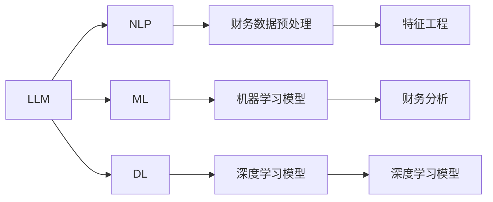

                 

# LLM在智能财务分析中的潜在贡献

> 关键词：语言模型, 财务分析, 数据分析, 智能决策, 风险管理, 数据挖掘

## 1. 背景介绍

随着人工智能技术的发展，大语言模型（Large Language Models, LLM）在处理自然语言处理（NLP）任务上取得了显著进展。这些模型如GPT、BERT等，通过大规模无标签数据的预训练，学习到了丰富的语言知识和常识，能够理解并生成自然语言文本。然而，在实际应用中，LLM更多地被关注于聊天机器人、内容生成等任务，而其在财务分析领域的应用潜力尚未得到充分挖掘。

### 1.1 财务分析概述
财务分析是企业经营管理中至关重要的一环，通过收集和分析财务数据，可以提供公司经营状况、财务风险、投资决策等关键信息。传统的财务分析主要依赖于财务报表、财务比率等数据，存在数据单一、计算繁琐、解释复杂等问题。而智能财务分析的引入，可以借助大语言模型的高效计算和智能推理能力，提升财务分析的精度和效率。

### 1.2 智能财务分析的优势
1. **大数据处理能力**：智能财务分析可以处理海量数据，包括财务报表、市场数据、交易数据等，挖掘其中隐含的规律和趋势。
2. **实时性**：LLM能够实时分析最新财务数据，提供动态的财务报告和预警。
3. **多维度分析**：除了传统的财务比率分析，智能财务分析还能够结合市场情绪、行业趋势等多维度信息，进行综合分析。
4. **自然语言理解**：通过自然语言处理技术，智能财务分析可以理解用户提出的非结构化问题，并给出相应的分析和建议。

### 1.3 挑战与机遇
尽管智能财务分析具有诸多优势，但其应用仍面临一些挑战：
1. **数据质量问题**：财务数据来源多样，存在噪音和偏差，如何处理和清洗这些数据是智能分析的难点。
2. **解释性和透明度**：传统的财务分析报告难以理解，智能财务分析需要提供更直观、易懂的解释和可视化结果。
3. **隐私和安全**：财务数据的敏感性要求智能分析系统具备更高的安全性和隐私保护能力。
4. **合规性**：智能财务分析需要符合行业和地区的法律法规要求，确保分析结果的合法合规。

## 2. 核心概念与联系

### 2.1 核心概念概述

本节将介绍与智能财务分析相关的几个核心概念及其相互联系：

- **大语言模型（LLM）**：一种通过大规模无标签数据预训练，并能够在特定任务上进行微调的语言模型。
- **财务数据预处理**：对原始财务数据进行清洗、转换、标准化等处理，使其适合进行机器学习分析。
- **特征工程**：在数据分析中，通过工程手段提取出对模型有用的特征，以提高模型的预测能力。
- **机器学习（ML）**：利用算法和模型对数据进行学习和分析，以做出预测或决策。
- **深度学习（DL）**：一种基于神经网络的机器学习方法，特别适用于处理复杂数据结构。
- **自然语言处理（NLP）**：一种使计算机能够理解、解释和生成人类语言的AI技术。

### 2.2 核心概念联系

这些核心概念之间存在紧密的联系：

1. **LLM与NLP**：LLM是NLP技术的一个重要分支，通过预训练和微调，可以处理复杂的自然语言数据，包括财务报告、新闻公告等。
2. **LLM与ML**：LLM可以嵌入机器学习流程中，如用于特征提取、数据清洗、模式识别等。
3. **ML与财务分析**：机器学习模型可以处理财务数据，挖掘其中的规律和趋势，为财务分析提供支持。
4. **特征工程与LLM**：特征工程是数据分析中的重要步骤，LLM可以通过自动特征提取，提升模型效果。

以下是一个简单的Mermaid流程图，展示了这些概念之间的联系：



## 3. 核心算法原理 & 具体操作步骤

### 3.1 算法原理概述

基于大语言模型的智能财务分析，其核心原理是将财务数据转换为自然语言描述，然后使用LLM进行分析和推理。主要包括以下步骤：

1. **财务数据预处理**：清洗和标准化财务数据，转换为文本格式。
2. **自然语言理解（NLU）**：使用NLP技术解析财务文本，提取关键信息。
3. **语义表示**：将文本信息转换为向量表示，便于模型处理。
4. **预测和推理**：使用LLM对向量进行预测或推理，生成分析报告或推荐。

### 3.2 算法步骤详解

**Step 1: 数据预处理**
- 收集财务数据：包括会计报表、现金流、投资收益等。
- 数据清洗：处理缺失值、异常值、数据类型不一致等问题。
- 数据转换：将财务数据转换为文本格式，如自然语言描述。

**Step 2: 自然语言理解（NLU）**
- 分词和词性标注：对文本进行分词，并标注每个词的词性。
- 命名实体识别（NER）：识别文本中的关键实体，如公司名、日期、金额等。
- 依存句法分析：解析句子结构，理解句子成分之间的关系。

**Step 3: 语义表示**
- 词嵌入：将每个词转换为向量表示，如Word2Vec、GloVe等。
- 句向量表示：使用BERT等预训练模型，生成句子级别的向量表示。
- 特征提取：使用K-means、PCA等方法，从句子向量中提取出关键特征。

**Step 4: 预测和推理**
- 微调模型：将预训练的LLM模型进行微调，适应财务分析任务。
- 推理过程：将文本输入模型，生成分析报告或推荐。
- 结果解释：解释模型的推理过程和输出结果。

### 3.3 算法优缺点

基于LLM的智能财务分析方法具有以下优点：

- **高效性**：利用LLM的高效计算能力，可以迅速处理大量财务数据。
- **广泛适用性**：LLM可以适应多种财务分析任务，从基本的报表分析到复杂的投资决策。
- **自然语言处理能力**：能够理解非结构化数据，处理多样化的文本信息。
- **动态分析**：可以实时更新模型，适应新的财务数据。

但该方法也存在以下缺点：

- **数据依赖性强**：依赖高质量的财务数据，数据清洗和预处理工作量较大。
- **模型复杂度高**：LLM的模型结构复杂，训练和推理需要较高计算资源。
- **可解释性差**：LLM的推理过程复杂，难以解释模型的决策机制。
- **鲁棒性问题**：财务数据噪声和异常值较多，模型可能对噪声敏感。

### 3.4 算法应用领域

智能财务分析基于大语言模型的技术，可以应用于以下多个领域：

1. **财务报表分析**：使用LLM自动解析财务报表，生成财务报表分析报告。
2. **财务预测**：通过历史财务数据，预测公司未来的财务表现。
3. **风险管理**：识别财务风险，进行风险评估和预警。
4. **投资决策**：基于财务数据和市场信息，提供投资建议和决策支持。
5. **自动化会计**：使用LLM自动处理日常的会计事务，提升会计工作效率。
6. **智能客服**：为客户提供财务咨询服务，解答财务相关问题。

## 4. 数学模型和公式 & 详细讲解  
### 4.1 数学模型构建

本节将使用数学语言对智能财务分析的基本模型进行描述。

假设有一组历史财务数据 $D=\{(x_i,y_i)\}_{i=1}^N$，其中 $x_i$ 为财务文本， $y_i$ 为相应的分析结果，如公司价值、投资回报等。

定义一个简单的线性回归模型 $f(x;\theta)=\theta_0+\theta_1x$，其中 $\theta=(\theta_0,\theta_1)$ 为模型参数。

模型的训练目标是最小化预测误差 $e_i=f(x_i;\theta)-y_i$，即：

$$
\min_{\theta} \sum_{i=1}^N e_i^2 = \min_{\theta} \sum_{i=1}^N (f(x_i;\theta)-y_i)^2
$$

通过梯度下降等优化算法，最小化上述目标函数，即可得到模型参数 $\theta$。

### 4.2 公式推导过程

以上述线性回归模型为例，推导其梯度下降算法的实现：

设损失函数 $L(\theta)=\frac{1}{2N}\sum_{i=1}^N (f(x_i;\theta)-y_i)^2$，其对参数 $\theta$ 的梯度为：

$$
\nabla_{\theta}L = \frac{1}{N}\sum_{i=1}^N (f(x_i;\theta)-y_i) \nabla_{\theta}f(x_i;\theta) = \frac{1}{N}\sum_{i=1}^N (f(x_i;\theta)-y_i)(1)
$$

采用梯度下降法更新模型参数：

$$
\theta \leftarrow \theta - \eta \nabla_{\theta}L
$$

其中 $\eta$ 为学习率，$\nabla_{\theta}L$ 为损失函数对参数 $\theta$ 的梯度。

### 4.3 案例分析与讲解

以一家公司的年度财务报告为例，假设目标是预测该公司下一年的市场价值。首先将财务报告转换为文本，然后使用BERT模型进行预训练和微调，得到模型的预测结果。

假设财务报告中包含以下关键信息：

- 净利润：2023年净利润为500万元
- 资产总额：年末资产总额为5亿元
- 负债总额：年末负债总额为2亿元
- 现金流：现金流入5000万元，现金流出4000万元

将这些信息转换为文本描述：

- "2023年净利润为500万元"
- "年末资产总额为5亿元"
- "年末负债总额为2亿元"
- "现金流入5000万元，现金流出4000万元"

使用BERT模型对文本进行预训练和微调，得到文本的向量表示。通过线性回归模型，结合市场数据和其他因素，对公司的市场价值进行预测。

## 5. 项目实践：代码实例和详细解释说明

### 5.1 开发环境搭建

在进行智能财务分析的实践前，需要搭建好开发环境。以下是Python开发环境的配置流程：

1. 安装Python：从官网下载并安装Python，并确保安装版本为3.7或以上。
2. 安装Anaconda：从官网下载并安装Anaconda，用于创建独立的Python环境。
3. 创建并激活虚拟环境：
```bash
conda create -n fin-analysis-env python=3.7
conda activate fin-analysis-env
```

4. 安装相关库：
```bash
pip install torch transformers pandas numpy scikit-learn
```

完成上述步骤后，即可在`fin-analysis-env`环境中开始智能财务分析的实践。

### 5.2 源代码详细实现

下面以使用BERT模型对财务报告进行情感分析为例，给出智能财务分析的代码实现。

首先，定义财务报告数据的预处理函数：

```python
from transformers import BertTokenizer
from torch.utils.data import Dataset
import torch

class FinancialReportDataset(Dataset):
    def __init__(self, texts, labels, tokenizer, max_len=128):
        self.texts = texts
        self.labels = labels
        self.tokenizer = tokenizer
        self.max_len = max_len
        
    def __len__(self):
        return len(self.texts)
    
    def __getitem__(self, item):
        text = self.texts[item]
        label = self.labels[item]
        
        encoding = self.tokenizer(text, return_tensors='pt', max_length=self.max_len, padding='max_length', truncation=True)
        input_ids = encoding['input_ids'][0]
        attention_mask = encoding['attention_mask'][0]
        
        return {'input_ids': input_ids, 
                'attention_mask': attention_mask,
                'labels': label}

# 定义财务报告的标签，如正向、负向等
labels = {'Positive': 1, 'Negative': 0}

# 创建dataset
tokenizer = BertTokenizer.from_pretrained('bert-base-cased')

train_dataset = FinancialReportDataset(train_texts, train_labels, tokenizer)
dev_dataset = FinancialReportDataset(dev_texts, dev_labels, tokenizer)
test_dataset = FinancialReportDataset(test_texts, test_labels, tokenizer)
```

然后，定义模型和优化器：

```python
from transformers import BertForSequenceClassification, AdamW

model = BertForSequenceClassification.from_pretrained('bert-base-cased', num_labels=len(labels))

optimizer = AdamW(model.parameters(), lr=2e-5)
```

接着，定义训练和评估函数：

```python
from torch.utils.data import DataLoader
from tqdm import tqdm
from sklearn.metrics import accuracy_score

device = torch.device('cuda') if torch.cuda.is_available() else torch.device('cpu')
model.to(device)

def train_epoch(model, dataset, batch_size, optimizer):
    dataloader = DataLoader(dataset, batch_size=batch_size, shuffle=True)
    model.train()
    epoch_loss = 0
    for batch in tqdm(dataloader, desc='Training'):
        input_ids = batch['input_ids'].to(device)
        attention_mask = batch['attention_mask'].to(device)
        labels = batch['labels'].to(device)
        model.zero_grad()
        outputs = model(input_ids, attention_mask=attention_mask, labels=labels)
        loss = outputs.loss
        epoch_loss += loss.item()
        loss.backward()
        optimizer.step()
    return epoch_loss / len(dataloader)

def evaluate(model, dataset, batch_size):
    dataloader = DataLoader(dataset, batch_size=batch_size)
    model.eval()
    preds, labels = [], []
    with torch.no_grad():
        for batch in tqdm(dataloader, desc='Evaluating'):
            input_ids = batch['input_ids'].to(device)
            attention_mask = batch['attention_mask'].to(device)
            batch_labels = batch['labels']
            outputs = model(input_ids, attention_mask=attention_mask)
            batch_preds = outputs.logits.argmax(dim=2).to('cpu').tolist()
            batch_labels = batch_labels.to('cpu').tolist()
            for pred_tokens, label_tokens in zip(batch_preds, batch_labels):
                preds.append(pred_tokens)
                labels.append(label_tokens)
                
    return accuracy_score(labels, preds)

```

最后，启动训练流程并在测试集上评估：

```python
epochs = 5
batch_size = 16

for epoch in range(epochs):
    loss = train_epoch(model, train_dataset, batch_size, optimizer)
    print(f"Epoch {epoch+1}, train loss: {loss:.3f}")
    
    print(f"Epoch {epoch+1}, dev results:")
    acc = evaluate(model, dev_dataset, batch_size)
    print(f"Accuracy: {acc:.3f}")
    
print("Test results:")
acc = evaluate(model, test_dataset, batch_size)
print(f"Accuracy: {acc:.3f}")
```

以上就是使用PyTorch对BERT模型进行财务报告情感分析的代码实现。可以看到，通过简短的代码，就可以对财务报告进行情感分析，评估其正向或负向情感倾向。

### 5.3 代码解读与分析

让我们再详细解读一下关键代码的实现细节：

**FinancialReportDataset类**：
- `__init__`方法：初始化文本、标签、分词器等关键组件。
- `__len__`方法：返回数据集的样本数量。
- `__getitem__`方法：对单个样本进行处理，将文本输入转换为token ids，并将标签转换为数字，最终返回模型所需的输入。

**标签与id的映射**：
- 定义了标签与数字id之间的映射关系，用于将预测结果解码为具体的情感倾向。

**训练和评估函数**：
- 使用PyTorch的DataLoader对数据集进行批次化加载，供模型训练和推理使用。
- 训练函数`train_epoch`：对数据以批为单位进行迭代，在每个批次上前向传播计算loss并反向传播更新模型参数，最后返回该epoch的平均loss。
- 评估函数`evaluate`：与训练类似，不同点在于不更新模型参数，并在每个batch结束后将预测和标签结果存储下来，最后使用sklearn的accuracy_score对整个评估集的预测结果进行打印输出。

**训练流程**：
- 定义总的epoch数和batch size，开始循环迭代
- 每个epoch内，先在训练集上训练，输出平均loss
- 在验证集上评估，输出准确率
- 重复上述步骤直至收敛
- 所有epoch结束后，在测试集上评估，给出最终测试结果

可以看到，PyTorch配合Transformers库使得BERT微调的代码实现变得简洁高效。开发者可以将更多精力放在数据处理、模型改进等高层逻辑上，而不必过多关注底层的实现细节。

当然，工业级的系统实现还需考虑更多因素，如模型的保存和部署、超参数的自动搜索、更灵活的任务适配层等。但核心的微调范式基本与此类似。

## 6. 实际应用场景

### 6.1 智能财务报表分析

智能财务报表分析是大语言模型在财务分析领域的一个重要应用场景。通过自动解析财务报表，提取关键信息，可以为投资者和分析师提供更为精准、高效的财务分析报告。

假设有一份财务报表，包含了公司的收入、成本、利润等关键指标。使用智能财务分析系统，可以自动解析报表，生成结构化数据，并根据预设的指标进行分析和比较。例如，分析公司的毛利率、净利率等关键指标，并生成相应的财务报表分析报告。

### 6.2 财务风险预警

财务风险预警是大语言模型在智能财务分析中的另一个重要应用场景。通过实时监测财务数据，智能系统可以及时发现并预警潜在的财务风险。

例如，当公司的应收账款过高，或者现金流状况异常时，智能系统可以立即发出警报，提醒管理人员采取相应的应对措施。通过结合市场情绪和行业趋势等信息，智能系统还可以预测财务风险的发生概率，并给出相应的建议。

### 6.3 投资决策支持

投资决策支持是智能财务分析的重要应用领域。通过分析和处理大量的财务数据和市场信息，智能系统可以为投资者提供全方位的投资决策支持。

例如，智能系统可以分析公司的财务报表、市场表现、行业趋势等信息，生成投资建议和分析报告。通过自然语言处理技术，智能系统还可以回答投资者的非结构化问题，如“公司的估值是否合理？”“公司未来的增长潜力如何？”等。

### 6.4 未来应用展望

随着大语言模型和智能财务分析技术的不断发展，未来的应用场景将更加丰富和多样化。以下是一些潜在的应用方向：

1. **自动化审计**：使用智能财务分析系统，自动检查财务报表的准确性和合规性，提高审计效率和准确性。
2. **跨行业财务分析**：智能系统可以处理不同行业的财务数据，进行跨行业比较和分析，帮助企业制定更好的财务策略。
3. **智能财务咨询**：智能系统可以回答投资者的各种财务问题，提供专业的财务咨询和建议。
4. **风险管理**：智能系统可以实时监测和管理各种财务风险，提供实时的风险预警和应对策略。
5. **数据可视化**：智能系统可以将复杂的财务数据进行可视化展示，帮助管理人员更好地理解和分析数据。

## 7. 工具和资源推荐

### 7.1 学习资源推荐

为了帮助开发者系统掌握大语言模型在智能财务分析中的应用，这里推荐一些优质的学习资源：

1. 《深度学习与自然语言处理》课程：斯坦福大学开设的深度学习课程，涵盖了深度学习、自然语言处理等领域的核心知识。
2. 《财务分析与决策》书籍：详细介绍了财务分析的基本概念、方法和应用。
3. 《深度学习在金融中的应用》文章：探讨了深度学习在金融领域的各种应用，包括风险管理、投资决策等。
4. HuggingFace官方文档：提供丰富的预训练语言模型和微调样例代码，是学习大语言模型的重要资源。
5. TensorFlow官方文档：提供详细的TensorFlow使用指南和样例代码，适合进行大模型微调和部署。

通过对这些资源的学习实践，相信你一定能够快速掌握大语言模型在智能财务分析中的应用，并用于解决实际的财务问题。

### 7.2 开发工具推荐

高效的开发离不开优秀的工具支持。以下是几款用于智能财务分析开发的常用工具：

1. Python：广泛使用的编程语言，拥有丰富的第三方库和框架，支持大模型微调和部署。
2. PyTorch：基于Python的深度学习框架，灵活易用，适合进行大模型微调和推理。
3. TensorFlow：由Google开发的大型深度学习框架，支持分布式计算和高效的模型训练。
4. Jupyter Notebook：交互式编程环境，支持代码编写和可视化展示，适合进行模型实验和调试。
5. Google Colab：免费的在线Jupyter Notebook环境，支持GPU加速和自动保存，方便实验和分享。

合理利用这些工具，可以显著提升智能财务分析的开发效率，加快创新迭代的步伐。

### 7.3 相关论文推荐

大语言模型和智能财务分析的发展得益于学界的持续研究。以下是几篇奠基性的相关论文，推荐阅读：

1. Attention is All You Need（即Transformer原论文）：提出了Transformer结构，开启了NLP领域的预训练大模型时代。
2. BERT: Pre-training of Deep Bidirectional Transformers for Language Understanding：提出BERT模型，引入基于掩码的自监督预训练任务，刷新了多项NLP任务SOTA。
3. Financial Sentiment Analysis using Deep Learning：探讨了使用深度学习技术进行金融情感分析的可行性。
4. Deep Learning in Finance：分析了深度学习在金融领域的各种应用，包括风险管理、投资决策等。
5. Machine Learning Applications in Finance：介绍了机器学习在金融领域的具体应用，包括信用评分、欺诈检测等。

这些论文代表了大语言模型和智能财务分析的发展脉络。通过学习这些前沿成果，可以帮助研究者把握学科前进方向，激发更多的创新灵感。

## 8. 总结：未来发展趋势与挑战

### 8.1 研究成果总结

本文对大语言模型在智能财务分析中的应用进行了全面系统的介绍。首先阐述了智能财务分析的背景和优势，明确了LLM在财务分析中的应用潜力。其次，从原理到实践，详细讲解了智能财务分析的数学模型和关键步骤，给出了智能财务分析的代码实例。同时，本文还广泛探讨了智能财务分析在财务报表分析、风险预警、投资决策等领域的应用前景，展示了LLM在智能财务分析中的广泛应用。

通过本文的系统梳理，可以看到，基于大语言模型的智能财务分析方法具有高效、广谱、自然语言处理能力强等优势，可以为财务分析提供强大的支持。未来，伴随技术的不断进步，LLM在财务分析中的应用将更加深入和广泛。

### 8.2 未来发展趋势

展望未来，大语言模型在智能财务分析中的应用将呈现以下几个发展趋势：

1. **深度学习与传统财务分析的结合**：将深度学习与传统财务分析方法结合，提供更加全面和准确的财务分析结果。
2. **多模态融合**：结合财务数据、市场数据、社交媒体数据等多种数据源，进行多模态分析，提升财务分析的精度和深度。
3. **实时性提升**：通过引入在线学习技术，实现模型的动态更新，提升财务分析的实时性。
4. **知识图谱的引入**：结合知识图谱等外部知识库，增强财务分析的智能化水平，提高模型的泛化能力和鲁棒性。
5. **自动化审计**：利用智能财务分析系统，实现自动化的财务审计和合规检查，提升审计效率和准确性。
6. **跨行业分析**：智能系统可以处理不同行业的财务数据，进行跨行业比较和分析，提供跨行业的财务决策支持。

### 8.3 面临的挑战

尽管大语言模型在智能财务分析中具有诸多优势，但在应用过程中仍面临一些挑战：

1. **数据质量问题**：财务数据存在噪音和偏差，如何处理和清洗这些数据是智能分析的难点。
2. **模型复杂度**：LLM的模型结构复杂，训练和推理需要较高计算资源。
3. **可解释性问题**：模型的决策过程复杂，难以解释模型的推理机制。
4. **隐私和安全**：财务数据的敏感性要求智能分析系统具备更高的安全性和隐私保护能力。
5. **技术门槛高**：智能财务分析需要具备一定的技术背景和经验，非技术专业人员难以掌握。
6. **法律合规性**：智能财务分析需要符合行业和地区的法律法规要求，确保分析结果的合法合规。

### 8.4 研究展望

面对智能财务分析面临的诸多挑战，未来的研究需要在以下几个方面寻求新的突破：

1. **数据清洗和预处理技术**：开发更加高效的数据清洗和预处理技术，提升数据质量。
2. **模型压缩和优化**：通过模型压缩、稀疏化存储等方法，优化模型结构和推理效率。
3. **解释性提升**：引入可解释性模型和可视化工具，提高模型的透明性和可解释性。
4. **隐私和安全保护**：设计隐私保护和安全机制，确保财务数据的安全性和隐私性。
5. **自动化审计工具**：开发自动化审计工具，提升审计效率和准确性。
6. **跨行业财务分析框架**：构建跨行业的财务分析框架，提供多行业财务决策支持。

这些研究方向将引领智能财务分析技术迈向更高的台阶，为构建智能财务系统提供坚实基础。面向未来，智能财务分析技术必将与深度学习、知识图谱、多模态分析等技术深度融合，为财务决策提供更加全面、准确、高效的智能支持。

## 9. 附录：常见问题与解答

**Q1：智能财务分析的主要优势是什么？**

A: 智能财务分析具有以下主要优势：
1. **高效性**：利用大语言模型的计算能力，可以迅速处理大量财务数据，提升分析效率。
2. **广谱性**：可以处理多种财务数据，包括财务报表、现金流、市场数据等，提供全方位的财务分析。
3. **自然语言处理能力**：能够理解非结构化数据，处理多样化的文本信息。
4. **实时性**：可以实时监测和分析财务数据，提供实时的财务报告和预警。
5. **跨行业分析**：可以处理不同行业的财务数据，进行跨行业比较和分析。

**Q2：智能财务分析的主要应用场景是什么？**

A: 智能财务分析可以应用于以下几个主要场景：
1. **财务报表分析**：自动解析财务报表，提取关键信息，生成分析报告。
2. **财务风险预警**：实时监测财务数据，及时发现和预警潜在的财务风险。
3. **投资决策支持**：结合财务数据和市场信息，提供投资建议和决策支持。
4. **自动化审计**：自动检查财务报表的准确性和合规性，提高审计效率和准确性。
5. **跨行业财务分析**：处理不同行业的财务数据，进行跨行业比较和分析。

**Q3：智能财务分析的挑战和应对策略是什么？**

A: 智能财务分析面临以下挑战：
1. **数据质量问题**：财务数据存在噪音和偏差，如何处理和清洗这些数据是智能分析的难点。应对策略是开发高效的数据清洗和预处理技术。
2. **模型复杂度**：LLM的模型结构复杂，训练和推理需要较高计算资源。应对策略是优化模型结构和推理效率。
3. **可解释性问题**：模型的决策过程复杂，难以解释模型的推理机制。应对策略是引入可解释性模型和可视化工具。
4. **隐私和安全**：财务数据的敏感性要求智能分析系统具备更高的安全性和隐私保护能力。应对策略是设计隐私保护和安全机制。
5. **技术门槛高**：智能财务分析需要具备一定的技术背景和经验，非技术专业人员难以掌握。应对策略是提供易于使用的智能分析工具和接口。
6. **法律合规性**：智能财务分析需要符合行业和地区的法律法规要求，确保分析结果的合法合规。应对策略是建立合规审查机制。

通过以上应对策略，可以有效克服智能财务分析面临的挑战，提升分析的准确性和可信度。

**Q4：智能财务分析的未来发展方向是什么？**

A: 智能财务分析的未来发展方向包括：
1. **深度学习与传统财务分析的结合**：将深度学习与传统财务分析方法结合，提供更加全面和准确的财务分析结果。
2. **多模态融合**：结合财务数据、市场数据、社交媒体数据等多种数据源，进行多模态分析，提升财务分析的精度和深度。
3. **实时性提升**：通过引入在线学习技术，实现模型的动态更新，提升财务分析的实时性。
4. **知识图谱的引入**：结合知识图谱等外部知识库，增强财务分析的智能化水平，提高模型的泛化能力和鲁棒性。
5. **自动化审计**：利用智能财务分析系统，实现自动化的财务审计和合规检查，提升审计效率和准确性。
6. **跨行业分析**：智能系统可以处理不同行业的财务数据，进行跨行业比较和分析，提供跨行业的财务决策支持。

这些方向将引领智能财务分析技术迈向更高的台阶，为财务决策提供更加全面、准确、高效的智能支持。

---

作者：禅与计算机程序设计艺术 / Zen and the Art of Computer Programming

