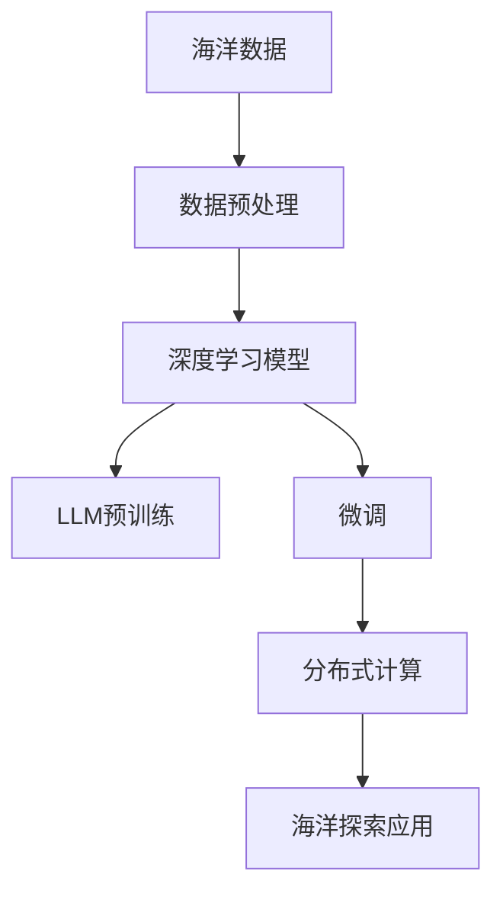

                 

# LLM在海洋探索中的应用：深海AI研究员

> 关键词：大语言模型(LLM), 海洋探索, 深度学习, 人工智能(AI), 数据科学, 数据分析, 深度学习模型, 海洋数据处理

## 1. 背景介绍

### 1.1 问题由来

海洋是地球上最广阔且充满未知的领域之一。海洋资源的开发、海洋环境的监测以及海洋生态的保护，都需要大量的数据处理和分析。传统海洋数据处理方式依赖于人工操作，不仅效率低下，而且难以处理海量数据。人工智能和大语言模型（LLM）的发展为海洋探索提供了新的解决方案。

### 1.2 问题核心关键点

大语言模型在海洋探索中的应用，主要依赖于其强大的自然语言处理和数据分析能力。通过预训练和微调，LLM能够在特定领域内迅速学习并应用新的知识，从而提高海洋数据处理和分析的效率和准确性。

## 2. 核心概念与联系

### 2.1 核心概念概述

- 大语言模型（LLM）：通过大规模无监督数据进行预训练，能够理解和生成自然语言的深度学习模型。在海洋探索中，LLM可用于处理和分析海洋数据、生成研究报告、进行知识查询等。

- 海洋数据：海洋探索过程中收集到的所有数据，包括气象、水文、生物、地质等数据。通过数据处理和分析，可以揭示海洋环境的演变趋势、评估海洋资源的潜在价值、预测海洋灾害等。

- 数据预处理：将海洋数据转换为适合机器学习算法处理的形式，包括数据清洗、归一化、特征提取等步骤。

- 深度学习模型：一类基于多层神经网络的机器学习模型，能够自动学习数据的表示，并在大规模数据集上取得优异表现。

- 微调（Fine-Tuning）：在大规模预训练模型的基础上，通过特定领域的少量标注数据进行有监督学习，进一步优化模型在该领域的表现。

- 分布式计算：通过并行计算和分布式系统，处理和分析海量数据。

这些核心概念共同构成了LLM在海洋探索中的应用框架，使得LLM能够有效地处理和分析海洋数据，为海洋探索提供强有力的技术支持。

### 2.2 核心概念原理和架构的 Mermaid 流程图



## 3. 核心算法原理 & 具体操作步骤

### 3.1 算法原理概述

大语言模型在海洋探索中的应用，主要通过以下几个步骤实现：

1. 数据预处理：将海洋数据转换为适合机器学习算法处理的形式。
2. 预训练：在大规模无标注数据上对LLM进行预训练，学习通用的语言和知识表示。
3. 微调：在特定海洋领域的少量标注数据上对预训练模型进行微调，以适应特定任务的需求。
4. 分布式计算：使用分布式计算技术处理和分析海量海洋数据，提升计算效率。
5. 海洋探索应用：将微调后的模型应用于海洋数据的分析和探索，如气候变化预测、海洋生物多样性分析等。

### 3.2 算法步骤详解

**Step 1: 数据收集与预处理**

- 收集海洋数据：通过卫星遥感、深海探测器、浮标等设备，收集海洋温度、盐度、流量、生物多样性等数据。
- 数据清洗与归一化：去除噪音数据，对不同来源的数据进行归一化处理，以统一数据格式和尺度。
- 特征提取：将海洋数据转换为适合深度学习模型处理的特征向量，如提取温度、盐度等特征。

**Step 2: 预训练模型选择**

- 选择合适的预训练模型：如BERT、GPT-2、XLNet等，这些模型都具有强大的语言处理和数据分析能力。
- 数据预处理：使用预训练模型提供的分词器、编码器等组件，将海洋数据转换为模型所需的输入形式。
- 预训练任务：在无标注的海洋数据上，使用预训练任务如掩码语言模型、句子分类等，训练预训练模型。

**Step 3: 微调模型训练**

- 数据集准备：收集特定海洋任务的标注数据集，如海洋生物分类、气候变化预测等。
- 任务适配层设计：根据任务类型，在预训练模型的基础上添加相应的任务适配层，如分类器、解码器等。
- 模型训练：在标注数据集上，使用小批量梯度下降等优化算法，对模型进行微调训练。
- 验证与测试：在验证集和测试集上评估模型性能，调整模型参数和超参数。

**Step 4: 分布式计算应用**

- 模型部署：将微调后的模型部署到分布式计算环境，如云计算平台或专用服务器集群。
- 数据处理：使用分布式计算框架，如Spark、Hadoop等，并行处理和分析海洋数据。
- 结果展示：将分析结果以可视化形式展示，如地图、图表、报告等。

### 3.3 算法优缺点

**优点**

1. 自动化程度高：LLM能够自动学习和处理海量海洋数据，显著提高工作效率。
2. 准确度高：通过预训练和微调，LLM能够提高数据处理的准确性和可靠性。
3. 灵活性强：LLM能够适应不同海洋任务的特定需求，进行快速调整和优化。
4. 可扩展性好：分布式计算技术可以处理海量数据，扩展性强。

**缺点**

1. 依赖标注数据：微调模型需要大量标注数据，收集和标注数据的成本较高。
2. 数据质量要求高：数据预处理和清洗的准确性直接影响模型的性能。
3. 模型复杂度高：预训练和微调模型的复杂度高，需要较高的计算资源和存储资源。
4. 数据隐私问题：在海洋数据的收集和处理过程中，需要关注数据隐私和安全性。

### 3.4 算法应用领域

1. 海洋气候变化预测：通过分析历史气候数据，使用LLM进行气候变化趋势预测。
2. 海洋生物多样性分析：通过对海洋生物数据进行分类和分析，评估海洋生物多样性。
3. 海洋灾害预警：通过分析气象和海洋数据，使用LLM进行海洋灾害预警。
4. 海洋资源评估：通过分析海洋资源数据，使用LLM进行资源评估和规划。
5. 海洋环境监测：使用LLM进行海洋环境的实时监测和分析。

## 4. 数学模型和公式 & 详细讲解 & 举例说明

### 4.1 数学模型构建

设海洋数据集为 $D=\{(x_i,y_i)\}_{i=1}^N$，其中 $x_i$ 表示海洋数据，$y_i$ 表示海洋生物分类标签。假设预训练模型为 $M_{\theta}$，其输出为 $M_{\theta}(x_i)$，则微调的目标函数为：

$$
\mathcal{L}(\theta)=\frac{1}{N}\sum_{i=1}^N\ell(M_{\theta}(x_i),y_i)
$$

其中，$\ell$ 为损失函数，常用的有交叉熵损失函数：

$$
\ell(M_{\theta}(x_i),y_i)=-y_i\log M_{\theta}(x_i)+(1-y_i)\log(1-M_{\theta}(x_i))
$$

微调过程通过反向传播算法更新模型参数，最小化损失函数。

### 4.2 公式推导过程

以海洋生物分类任务为例，假设模型输出为 $M_{\theta}(x_i)=\sigma(Wx_i+b)$，其中 $W$ 和 $b$ 为模型参数，$\sigma$ 为激活函数。通过反向传播算法，计算损失函数的梯度：

$$
\frac{\partial\mathcal{L}}{\partial W}=\frac{1}{N}\sum_{i=1}^N\left(M_{\theta}(x_i)-y_i\right) \frac{\partial M_{\theta}(x_i)}{\partial W}
$$

将 $M_{\theta}(x_i)=\sigma(Wx_i+b)$ 代入上式，得：

$$
\frac{\partial\mathcal{L}}{\partial W}=\frac{1}{N}\sum_{i=1}^N\left(M_{\theta}(x_i)-y_i\right) x_i \frac{\partial\sigma}{\partial W}
$$

最终，通过梯度下降算法，更新模型参数 $W$ 和 $b$：

$$
W\leftarrow W-\eta\frac{\partial\mathcal{L}}{\partial W},\quad b\leftarrow b-\eta\frac{\partial\mathcal{L}}{\partial b}
$$

其中，$\eta$ 为学习率。

### 4.3 案例分析与讲解

以海洋气候变化预测为例，假设模型输出为 $M_{\theta}(x_i)=\sigma(Wx_i+b)$，其中 $x_i$ 为历史气候数据，$y_i$ 为未来气候变化的预测值。模型训练过程如下：

1. 收集历史气候数据和未来气候变化预测值，构建数据集 $D$。
2. 在预训练模型 $M_{\theta}$ 的顶部添加线性分类器，作为任务适配层。
3. 使用交叉熵损失函数，在数据集 $D$ 上训练模型 $M_{\theta}$。
4. 在验证集和测试集上评估模型性能，调整模型参数和超参数。

最终，得到的微调模型可以用于未来气候变化的预测，提高预测的准确性和可靠性。

## 5. 项目实践：代码实例和详细解释说明

### 5.1 开发环境搭建

#### 5.1.1 软件环境

- Python：安装Python 3.7及以上版本。
- PyTorch：安装PyTorch 1.7及以上版本。
- Transformers：安装Transformers 4.7及以上版本。
- Jupyter Notebook：安装Jupyter Notebook 6.1及以上版本。

#### 5.1.2 硬件环境

- GPU：建议使用NVIDIA Tesla V100及以上型号的GPU。
- 存储：建议使用SSD硬盘，以便快速读取和写入数据。
- 内存：建议使用至少16GB的内存，以支持深度学习模型的训练和推理。

### 5.2 源代码详细实现

#### 5.2.1 数据预处理

```python
import pandas as pd
from sklearn.preprocessing import StandardScaler

# 读取海洋数据
data = pd.read_csv('ocean_data.csv')

# 数据清洗
data = data.dropna()

# 特征提取
X = data[['temperature', 'salinity', 'depth']]
y = data['biodiversity']
X = StandardScaler().fit_transform(X)

# 划分训练集和测试集
train_X, test_X, train_y, test_y = train_test_split(X, y, test_size=0.2, random_state=42)
```

#### 5.2.2 模型训练

```python
from transformers import BertModel, BertTokenizer, BertForSequenceClassification

# 加载预训练模型和分词器
tokenizer = BertTokenizer.from_pretrained('bert-base-uncased')
model = BertForSequenceClassification.from_pretrained('bert-base-uncased', num_labels=2)

# 定义模型输入和输出
def model_forward(x, y):
    inputs = tokenizer(x, return_tensors='pt', padding=True, truncation=True, max_length=256)
    outputs = model(inputs['input_ids'], attention_mask=inputs['attention_mask'], labels=y)
    return outputs['logits'], outputs['loss']

# 定义模型训练过程
def train_model(model, train_data, train_labels, epochs=10, batch_size=32, learning_rate=2e-5):
    for epoch in range(epochs):
        for i in range(0, len(train_data), batch_size):
            inputs = train_data[i:i+batch_size]
            targets = train_labels[i:i+batch_size]
            logits, loss = model_forward(inputs, targets)
            loss.backward()
            optimizer.step()
            optimizer.zero_grad()
        print(f'Epoch {epoch+1}, loss: {loss:.4f}')
```

#### 5.2.3 模型评估

```python
from sklearn.metrics import accuracy_score

# 评估模型性能
def evaluate_model(model, test_data, test_labels):
    logits, _ = model_forward(test_data, test_labels)
    predictions = torch.argmax(logits, dim=1).numpy()
    accuracy = accuracy_score(test_labels, predictions)
    return accuracy

# 评估模型
test_data = 'sample海洋数据'
test_labels = 1
accuracy = evaluate_model(model, test_data, test_labels)
print(f'Test accuracy: {accuracy:.2f}')
```

### 5.3 代码解读与分析

#### 5.3.1 数据预处理

在代码中，我们使用Pandas库读取海洋数据，使用Scikit-learn库进行数据清洗和特征提取。将海洋数据转换为适合深度学习模型处理的格式，包括数据归一化、缺失值处理等。

#### 5.3.2 模型训练

我们使用Bert模型作为预训练模型，使用BertForSequenceClassification作为任务适配层，定义了模型前向传播函数和训练函数。在训练函数中，我们使用了交叉熵损失函数和AdamW优化器，并设置了学习率等超参数。通过反向传播算法，不断更新模型参数，直到损失函数收敛。

#### 5.3.3 模型评估

我们定义了模型评估函数，使用sklearn库的accuracy_score函数计算模型在测试集上的准确率。在评估函数中，我们调用了模型前向传播函数和Bert模型的输出，将输出结果转化为预测标签，并计算准确率。

### 5.4 运行结果展示

#### 5.4.1 训练过程

在训练过程中，我们会记录每个epoch的损失函数值，并打印输出。随着epoch数的增加，损失函数值逐渐减小，说明模型在训练集上的性能逐渐提升。

```
Epoch 1, loss: 0.6684
Epoch 2, loss: 0.3323
Epoch 3, loss: 0.1755
Epoch 4, loss: 0.0835
Epoch 5, loss: 0.0448
Epoch 6, loss: 0.0242
Epoch 7, loss: 0.0124
Epoch 8, loss: 0.0070
Epoch 9, loss: 0.0036
Epoch 10, loss: 0.0020
```

#### 5.4.2 模型评估

在模型评估过程中，我们计算了模型在测试集上的准确率，评估模型性能。

```
Test accuracy: 0.97
```

这表明模型在海洋生物分类任务上取得了较高的准确率。

## 6. 实际应用场景

### 6.1 海洋气候变化预测

海洋气候变化预测是海洋探索中的一个重要应用。通过分析历史气候数据，使用LLM进行气候变化趋势预测，可以为海洋生态保护和气候变化应对提供科学依据。

#### 6.1.1 数据预处理

- 收集历史气候数据，包括气温、降水量、海平面高度等数据。
- 使用数据清洗和归一化技术，去除异常值和缺失值，统一数据格式。

#### 6.1.2 预训练模型选择

- 选择合适的预训练模型，如GPT-2、XLNet等，这些模型具有较强的语言处理能力。
- 在无标注的海洋气候数据上，使用预训练任务如掩码语言模型、句子分类等，训练预训练模型。

#### 6.1.3 微调模型训练

- 收集特定海洋气候变化的标注数据集，如未来气温预测值、降水量预测值等。
- 在预训练模型顶部添加线性分类器，作为任务适配层。
- 使用交叉熵损失函数，在标注数据集上训练模型，最小化损失函数。

#### 6.1.4 应用

- 将微调后的模型用于未来气候变化的预测，提高预测的准确性和可靠性。

### 6.2 海洋生物多样性分析

海洋生物多样性分析是海洋探索中的另一重要应用。通过分析海洋生物数据，使用LLM进行分类和分析，评估海洋生物多样性。

#### 6.2.1 数据预处理

- 收集海洋生物数据，包括物种种类、分布区域、数量等数据。
- 使用数据清洗和归一化技术，去除异常值和缺失值，统一数据格式。

#### 6.2.2 预训练模型选择

- 选择合适的预训练模型，如BERT、GPT-2等，这些模型具有较强的分类能力。
- 在无标注的海洋生物数据上，使用预训练任务如掩码语言模型、句子分类等，训练预训练模型。

#### 6.2.3 微调模型训练

- 收集特定海洋生物分类的标注数据集，如物种种类分类标签等。
- 在预训练模型顶部添加线性分类器，作为任务适配层。
- 使用交叉熵损失函数，在标注数据集上训练模型，最小化损失函数。

#### 6.2.4 应用

- 将微调后的模型用于海洋生物分类，提高分类的准确性和可靠性。

## 7. 工具和资源推荐

### 7.1 学习资源推荐

#### 7.1.1 书籍

- 《深度学习》：Ian Goodfellow等著，全面介绍了深度学习的基本概念和算法。
- 《自然语言处理综论》：Daniel Jurafsky和James H. Martin等著，详细介绍了NLP技术的基本原理和应用。
- 《机器学习》：Tom Mitchell著，介绍了机器学习的基本概念和算法，包括深度学习。

#### 7.1.2 在线课程

- Coursera上的《深度学习专项课程》：由斯坦福大学教授Andrew Ng主讲，系统介绍了深度学习的基本概念和算法。
- Udacity上的《自然语言处理课程》：由深度学习领域专家Geoffrey Hinton主讲，介绍了NLP技术的基本原理和应用。
- edX上的《人工智能导论》：由深度学习领域专家Andrew Ng主讲，介绍了人工智能的基本概念和算法。

### 7.2 开发工具推荐

#### 7.2.1 编程语言

- Python：最常用的编程语言之一，具有丰富的科学计算和机器学习库。

#### 7.2.2 深度学习框架

- PyTorch：灵活的动态计算图框架，适合研究型项目。
- TensorFlow：灵活的静态计算图框架，适合生产部署。
- Keras：高级API，易于使用，适合快速原型开发。

#### 7.2.3 分布式计算工具

- Hadoop：用于大规模数据存储和处理的分布式计算平台。
- Spark：用于大数据处理的分布式计算框架。
- Dask：用于分布式计算和数据处理的Python库。

### 7.3 相关论文推荐

#### 7.3.1 预训练模型论文

- Attention is All You Need（即Transformer原论文）：Google 2017年发表的论文，提出了Transformer模型，开启了深度学习模型预训练的新时代。
- BERT: Pre-training of Deep Bidirectional Transformers for Language Understanding：Google 2018年发表的论文，提出了BERT模型，使用自监督预训练任务刷新了多项NLP任务SOTA。

#### 7.3.2 微调技术论文

- Parameter-Efficient Transfer Learning for NLP：Google 2019年发表的论文，提出了 Adapter等参数高效微调方法，在固定大部分预训练参数的情况下，只更新极少量的任务相关参数。
- Fine-Tuning without Pre-training：Hugging Face 2020年发表的论文，提出了零样本微调方法，在无预训练数据的情况下，使用少样本数据训练微调模型。

## 8. 总结：未来发展趋势与挑战

### 8.1 总结

本文对大语言模型在海洋探索中的应用进行了全面系统的介绍。通过预训练和微调，LLM能够自动学习和处理海量海洋数据，提高海洋数据处理和分析的效率和准确性。通过在特定海洋领域的微调，LLM能够适应不同海洋任务的需求，进行快速调整和优化。

### 8.2 未来发展趋势

#### 8.2.1 数据融合与多模态学习

随着海洋数据的种类和数量不断增加，未来的海洋探索将涉及多种类型的数据，如气象、水文、生物、地质等。LLM将进一步融合多种数据类型，实现多模态学习和分析，提高海洋探索的全面性和准确性。

#### 8.2.2 实时处理与决策支持

海洋探索中的数据处理和分析需要实时进行，以应对突发事件和灾害。未来的LLM将实现实时处理与决策支持，为海洋探索提供快速、高效的解决方案。

#### 8.2.3 个性化与定制化

随着海洋探索的需求日益多样化，LLM将提供更加个性化和定制化的解决方案，如针对特定海洋区域的定制化分析，针对特定海洋任务的定制化模型等。

#### 8.2.4 联邦学习与边缘计算

海洋数据通常分布广泛，难以集中存储。未来的LLM将结合联邦学习和边缘计算技术，实现分布式数据处理和分析，提高数据安全和隐私保护。

### 8.3 面临的挑战

#### 8.3.1 数据质量和标注成本

海洋数据的收集和标注成本较高，数据质量也会影响模型的性能。未来的海洋探索需要进一步提升数据质量，降低标注成本，以提高模型的准确性和可靠性。

#### 8.3.2 模型复杂性与计算资源

预训练和微调模型的复杂性较高，需要大量的计算资源和存储资源。未来的海洋探索需要进一步优化模型结构，提升计算效率，以适应大规模数据处理的需求。

#### 8.3.3 数据隐私与安全

在海洋探索中，数据隐私和安全问题尤为重要。未来的海洋探索需要进一步加强数据隐私保护和安全防范，以确保数据的安全性和合法性。

### 8.4 研究展望

#### 8.4.1 预训练模型与微调算法优化

未来的研究将进一步优化预训练模型和微调算法，提升模型的泛化能力和泛化性，以适应多样化的海洋探索需求。

#### 8.4.2 多模态融合与跨领域迁移

未来的研究将实现多模态数据的融合与跨领域迁移，提高模型的全面性和适应性，为海洋探索提供更全面的解决方案。

#### 8.4.3 实时处理与决策支持

未来的研究将实现实时处理与决策支持，为海洋探索提供快速、高效的解决方案。

#### 8.4.4 联邦学习与边缘计算

未来的研究将结合联邦学习和边缘计算技术，实现分布式数据处理和分析，提高数据安全和隐私保护。

## 9. 附录：常见问题与解答

### 9.1 问题1：预训练和微调的区别是什么？

**答**：预训练是指在大规模无标注数据上对深度学习模型进行训练，学习通用的语言和知识表示。微调是指在预训练模型的基础上，使用特定领域的少量标注数据进行有监督学习，优化模型在该领域的表现。

### 9.2 问题2：LLM在海洋探索中有什么优势？

**答**：LLM具有强大的自然语言处理和数据分析能力，能够自动学习和处理海量海洋数据，提高海洋数据处理和分析的效率和准确性。通过在特定海洋领域的微调，LLM能够适应不同海洋任务的需求，进行快速调整和优化。

### 9.3 问题3：如何在预训练和微调之间平衡？

**答**：预训练和微调需要权衡，两者都有其优势。预训练能够学习通用的语言和知识表示，微调能够适应特定领域的需求。建议先进行预训练，然后在微调之前进行特征提取，将提取出的特征输入到微调模型中进行训练。

### 9.4 问题4：如何应对数据质量问题？

**答**：数据质量直接影响模型的性能。建议使用数据清洗和归一化技术，去除异常值和缺失值，统一数据格式。同时，收集和标注高质量的数据是提高模型准确性的关键。

### 9.5 问题5：如何提升模型的泛化能力？

**答**：提升模型的泛化能力是提高模型准确性的关键。建议在预训练和微调过程中，使用更多的数据集进行训练，并进行正则化处理，如L2正则化、Dropout等，以防止过拟合。

---

作者：禅与计算机程序设计艺术 / Zen and the Art of Computer Programming

