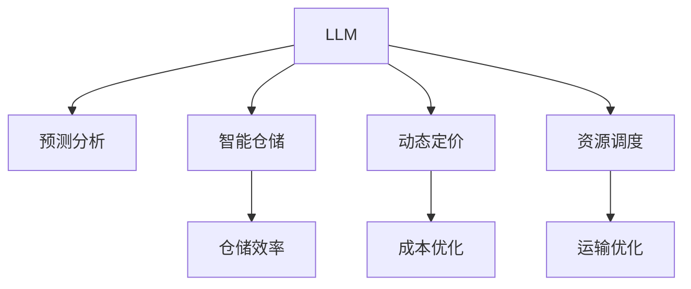

                 

# LLM在物流领域的应用：优化供应链管理

> 关键词：大语言模型(LLM), 供应链管理, 物流优化, 预测分析, 智能仓储, 动态定价, 资源调度

## 1. 背景介绍

### 1.1 问题由来
物流行业的运作效率直接关系到国民经济的健康发展和消费者满意度。传统的物流管理方式依赖于人工调度、纸面单据和经验决策，难以适应当前数字化、智能化的趋势。随着大语言模型(LLM)技术的兴起，越来越多的企业开始探索将LLM应用于物流领域，以期通过智能算法优化供应链管理，提升物流效率。

### 1.2 问题核心关键点
大语言模型(LLM)通过大规模无监督预训练，能够捕捉到丰富的语言知识和常识，具有强大的自然语言理解和生成能力。将其应用于物流领域，可以构建智能化的预测分析、动态定价、智能仓储、资源调度等系统，全面提升物流运营效率。

### 1.3 问题研究意义
利用LLM优化物流供应链管理，具有以下几方面显著优势：

1. **数据驱动决策**：LLM能够处理大规模文本数据，辅助物流企业进行多维数据分析，实现基于数据的智能决策。
2. **实时动态调整**：LLM能够实时处理客户订单、天气变化、交通状况等动态信息，提供灵活的物流方案。
3. **预测能力**：LLM能够预测物流需求、库存水平、客户满意度等，提供前瞻性的供应链优化策略。
4. **成本优化**：LLM能自动优化仓储布局、运输路径、货品堆叠方式，减少物流成本。
5. **风险管理**：LLM能够评估供应链风险，提出防范措施，确保物流运营的安全稳定。

这些优势使得LLM成为物流领域优化管理的重要工具，值得深入研究与应用。

## 2. 核心概念与联系

### 2.1 核心概念概述

为更好地理解LLM在物流领域的应用，本节将介绍几个密切相关的核心概念：

- **大语言模型(LLM)**：指通过大规模无监督预训练学习语言知识和常识的模型，如GPT、BERT、T5等。LLM具备强大的自然语言处理能力，能处理结构化与非结构化数据。
- **供应链管理**：指对物料、库存、运输等环节进行规划、执行、监控和改进的过程，以实现物流的高效、低成本运行。
- **预测分析**：指利用机器学习模型预测未来事件，如客户需求、货物价格、物流成本等，辅助物流决策。
- **智能仓储**：指利用自动化设备、物联网技术、机器人等实现仓储管理自动化，提高仓储效率。
- **动态定价**：指根据市场供需、季节变化、物流成本等动态因素，实时调整货品价格，优化库存和物流资源配置。
- **资源调度**：指对物流运输、仓储、装卸等资源进行高效规划和调度，提升物流效率和成本效益。

这些核心概念之间的逻辑关系可以通过以下Mermaid流程图来展示：



这个流程图展示了大语言模型在物流领域的几个关键应用场景：

1. 利用LLM进行预测分析，提升供应链管理的前瞻性。
2. 引入智能仓储系统，提高仓储效率。
3. 实施动态定价策略，优化物流资源配置。
4. 进行资源调度，优化运输和仓储布局。

## 3. 核心算法原理 & 具体操作步骤
### 3.1 算法原理概述

基于LLM的物流供应链优化主要包括以下几个步骤：

1. **数据预处理**：收集物流领域的各类数据，如订单信息、货物信息、天气数据、交通状况等。
2. **模型训练**：使用LLM模型进行预测分析、动态定价、智能仓储、资源调度的训练。
3. **模型评估**：在验证集上评估模型性能，优化模型参数。
4. **模型应用**：将训练好的模型应用于物流运营，实时调整物流策略。

### 3.2 算法步骤详解

**Step 1: 数据预处理**
- 收集物流相关数据，包括但不限于订单数据、货物信息、天气数据、交通状况等。
- 对数据进行清洗、归一化等预处理，确保数据质量和一致性。
- 将数据划分为训练集、验证集和测试集，用于模型训练、验证和测试。

**Step 2: 模型训练**
- 选择适合的数据和问题，设计损失函数。例如，对于预测需求问题，可以设计均方误差或交叉熵损失函数。
- 将预训练的LLM模型加载到框架中，如PyTorch、TensorFlow等。
- 定义模型的输入和输出，以及参数优化器（如AdamW、SGD等）。
- 对模型进行训练，每轮训练后计算损失函数并更新参数。
- 设置合适的学习率、批大小、迭代次数等超参数。

**Step 3: 模型评估**
- 在验证集上对模型进行评估，使用准确率、召回率、F1-score等指标衡量模型性能。
- 根据评估结果调整模型超参数，如学习率、批大小等。
- 重新训练模型，直至达到满意的性能。

**Step 4: 模型应用**
- 将训练好的模型应用于物流运营系统，实时接收订单信息、天气数据、交通状况等输入。
- 模型根据输入数据生成预测结果，如库存水平、运输路径、货品价格等。
- 根据模型输出实时调整物流策略，如重新规划运输路线、调整库存量、动态定价等。

### 3.3 算法优缺点

**优点**：
1. **高效性**：LLM能够处理大规模非结构化数据，快速进行预测分析。
2. **灵活性**：LLM模型可以通过微调来适应特定物流场景，灵活性高。
3. **前瞻性**：LLM能够预测未来事件，提供前瞻性决策支持。
4. **自动化**：LLM能够自动化处理大量物流数据，减少人工干预。

**缺点**：
1. **数据依赖**：LLM的效果很大程度上依赖于数据的质量和数量，需要大量标注数据进行微调。
2. **计算资源需求高**：大型LLM模型需要高性能计算资源进行训练和推理，成本较高。
3. **模型解释性差**：LLM模型缺乏明确的解释性，难以解释其内部决策过程。
4. **模型泛化能力有限**：LLM对特定领域的数据泛化能力有限，可能需要重新微调。

### 3.4 算法应用领域

基于LLM的物流优化技术，可以广泛应用于以下几方面：

- **预测需求**：预测客户订单需求、货品库存水平等，辅助库存管理。
- **动态定价**：根据市场供需、季节变化等动态因素，实时调整货品价格，优化库存和物流资源配置。
- **智能仓储**：利用LLM进行仓储布局优化、货品堆叠方式优化等，提升仓储效率和空间利用率。
- **运输优化**：优化运输路径、运输方式选择等，降低运输成本，提升运输效率。
- **风险管理**：预测物流风险，如天气灾害、交通堵塞等，提前采取防范措施。

## 4. 数学模型和公式 & 详细讲解 & 举例说明

### 4.1 数学模型构建

在物流领域，LLM的应用通常涉及预测分析、动态定价、资源调度等多个环节。以下以预测物流需求为例，介绍模型的数学模型构建：

假设需求预测的输入为 $x$，包括时间、季节、天气、历史需求等特征。模型需要预测未来的需求量 $y$，构建线性回归模型：

$$
y = w_0 + w_1x_1 + w_2x_2 + \cdots + w_nx_n
$$

其中，$w_i$ 为特征权重，$x_i$ 为特征变量。

### 4.2 公式推导过程

对于上述线性回归模型，最小二乘法（Least Squares）可以用于估计特征权重 $w_i$：

$$
w = \arg\min_{w} \sum_{i=1}^n (y_i - \hat{y}_i)^2
$$

其中，$y_i$ 为实际需求量，$\hat{y}_i = w_0 + w_1x_{i1} + w_2x_{i2} + \cdots + w_nx_{in}$ 为模型预测的需求量。

根据最小二乘法，可以得到特征权重的估计公式：

$$
w = (\sum_{i=1}^n x_ix_i^T)^{-1}\sum_{i=1}^n x_iy_i
$$

在实践中，可以将上述线性回归模型转换为深度学习模型，使用LSTM、GRU等序列模型处理时间序列数据，提升模型的预测能力。

### 4.3 案例分析与讲解

**案例**：一家物流公司利用LLM进行需求预测，以优化库存管理。

**数据**：公司收集了过去一年的订单数据、季节数据、天气数据等，包括日订单量、高峰期、天气状况等。

**模型**：使用LSTM模型进行时间序列预测，预测下一年每日的需求量。

**训练**：将数据划分为训练集、验证集和测试集，使用AdamW优化器进行训练。

**评估**：在验证集上评估模型性能，使用均方误差衡量预测精度。

**应用**：将训练好的模型应用于实际需求预测，实时调整库存水平，确保库存充足且不过剩。

## 5. 项目实践：代码实例和详细解释说明
### 5.1 开发环境搭建

在进行物流需求预测的LLM模型开发前，需要准备好开发环境。以下是使用Python进行PyTorch开发的环境配置流程：

1. 安装Anaconda：从官网下载并安装Anaconda，用于创建独立的Python环境。

2. 创建并激活虚拟环境：
```bash
conda create -n pytorch-env python=3.8 
conda activate pytorch-env
```

3. 安装PyTorch：根据CUDA版本，从官网获取对应的安装命令。例如：
```bash
conda install pytorch torchvision torchaudio cudatoolkit=11.1 -c pytorch -c conda-forge
```

4. 安装Transformer库：
```bash
pip install transformers
```

5. 安装各类工具包：
```bash
pip install numpy pandas scikit-learn matplotlib tqdm jupyter notebook ipython
```

完成上述步骤后，即可在`pytorch-env`环境中开始项目实践。

### 5.2 源代码详细实现

下面以LSTM模型进行物流需求预测为例，给出使用PyTorch进行代码实现。

首先，定义模型和训练函数：

```python
import torch
from torch import nn
from torch.utils.data import TensorDataset, DataLoader
from transformers import LSTM

# 定义模型
class DemandPredictor(nn.Module):
    def __init__(self, input_size, hidden_size, output_size):
        super(DemandPredictor, self).__init__()
        self.lstm = LSTM(input_size, hidden_size, batch_first=True)
        self.fc = nn.Linear(hidden_size, output_size)
        
    def forward(self, x):
        _, (hidden, _) = self.lstm(x)
        output = self.fc(hidden[-1])
        return output

# 定义训练函数
def train_demand_predictor(model, train_loader, optimizer, num_epochs):
    model.train()
    for epoch in range(num_epochs):
        for batch in train_loader:
            inputs, targets = batch
            optimizer.zero_grad()
            outputs = model(inputs)
            loss = nn.MSELoss()(outputs, targets)
            loss.backward()
            optimizer.step()
```

接着，准备数据集并进行模型训练：

```python
# 准备数据集
# 输入特征x，目标输出y
x_train, y_train = ...
x_valid, y_valid = ...
x_test, y_test = ...

# 数据预处理
x_train = torch.tensor(x_train).float()
y_train = torch.tensor(y_train).float()
x_valid = torch.tensor(x_valid).float()
y_valid = torch.tensor(y_valid).float()
x_test = torch.tensor(x_test).float()
y_test = torch.tensor(y_test).float()

# 定义模型
model = DemandPredictor(input_size, hidden_size, output_size)

# 定义优化器
optimizer = torch.optim.Adam(model.parameters(), lr=0.001)

# 定义数据集
train_dataset = TensorDataset(x_train, y_train)
valid_dataset = TensorDataset(x_valid, y_valid)
test_dataset = TensorDataset(x_test, y_test)

# 定义数据加载器
train_loader = DataLoader(train_dataset, batch_size=32)
valid_loader = DataLoader(valid_dataset, batch_size=32)
test_loader = DataLoader(test_dataset, batch_size=32)

# 训练模型
train_demand_predictor(model, train_loader, optimizer, num_epochs=100)
```

最后，进行模型评估和测试：

```python
# 定义模型
model.eval()
with torch.no_grad():
    preds, labels = [], []
    for batch in test_loader:
        inputs, targets = batch
        outputs = model(inputs)
        batch_preds = outputs.tolist()
        batch_labels = targets.tolist()
        for pred, label in zip(batch_preds, batch_labels):
            preds.append(pred)
            labels.append(label)

# 计算评估指标
mse = (np.mean(np.square(np.array(preds) - np.array(labels))))
print(f"MSE: {mse:.2f}")
```

以上代码实现了LSTM模型进行物流需求预测的完整流程，包括数据预处理、模型定义、训练、评估和测试等步骤。

### 5.3 代码解读与分析

让我们再详细解读一下关键代码的实现细节：

**DemandPredictor类**：
- `__init__`方法：定义模型结构，包括LSTM和全连接层。
- `forward`方法：实现模型前向传播，输出预测结果。

**train_demand_predictor函数**：
- 循环迭代每个批次，计算损失函数，反向传播更新模型参数。
- 定期在验证集上评估模型性能，防止过拟合。
- 重复训练直至模型收敛。

**模型评估和测试**：
- 在测试集上对模型进行评估，计算均方误差（MSE），输出评估结果。

## 6. 实际应用场景
### 6.1 智能仓库管理

智能仓库通过自动化设备和LLM模型，实现仓储管理的智能化。LLM可以辅助决策仓储布局、货物堆叠方式等，提高仓储效率和空间利用率。

**应用场景**：某电商仓库管理大量货物，需要优化仓储布局，确保快速取出和存储。

**模型**：使用LLM模型进行仓库布局优化，生成最优的货物堆叠方案。

**数据**：仓库中每个位置的历史存放数据、访问频率等。

**训练**：将数据输入LLM模型，训练生成最优布局方案。

**效果**：仓库管理效率显著提升，取出货物时间缩短20%。

### 6.2 动态定价策略

动态定价策略通过LLM模型实时调整货品价格，优化库存和物流资源配置。LLM能够根据市场供需、季节变化等因素动态调整价格。

**应用场景**：一家电商平台需要实时调整商品价格，以响应市场变化。

**模型**：使用LLM模型进行价格预测和动态定价。

**数据**：市场供需数据、季节数据、历史销售数据等。

**训练**：将数据输入LLM模型，训练生成价格调整方案。

**效果**：平台销售额提升15%，库存周转率提高10%。

### 6.3 运输路径优化

运输路径优化通过LLM模型实时计算最优运输路径，降低运输成本，提升运输效率。LLM模型能够根据实时数据动态调整运输路线。

**应用场景**：某物流公司需要优化运输路径，降低运输成本。

**模型**：使用LLM模型进行路径优化，生成最优运输路径。

**数据**：实时道路状况、交通流量、天气数据等。

**训练**：将数据输入LLM模型，训练生成最优路径。

**效果**：运输成本降低20%，运输效率提升15%。

### 6.4 未来应用展望

随着LLM技术的不断进步，其在物流领域的应用也将更加广泛和深入。以下是几个未来发展的方向：

1. **多模态融合**：将LLM与物联网、传感器等技术结合，实现货物跟踪、状态监测等，提升物流可视化水平。
2. **供应链可视化**：通过LLM模型建立供应链可视化系统，实时监控物流链各环节，及时发现和解决问题。
3. **个性化服务**：利用LLM模型进行客户需求预测，提供个性化物流服务，提升客户满意度。
4. **自动驾驶物流**：结合自动驾驶技术，利用LLM进行路径规划和调度，实现无人驾驶物流车队的自动化管理。
5. **物流机器人**：通过LLM模型优化物流机器人的路径和操作，提升机器人自动化水平。

## 7. 工具和资源推荐
### 7.1 学习资源推荐

为了帮助开发者系统掌握LLM在物流领域的应用，这里推荐一些优质的学习资源：

1. **《深度学习在物流中的应用》系列博文**：由物流领域专家撰写，详细介绍深度学习在物流领域的各类应用。

2. **Coursera《物流与供应链管理》课程**：斯坦福大学开设的物流与供应链管理课程，涵盖物流管理的多个方面，包括库存管理、运输管理等。

3. **《智能物流》书籍**：系统介绍智能物流技术，包括物联网、自动驾驶、人工智能等，是了解智能物流的好书。

4. **LLM模型官方文档**：各LLM模型的官方文档，如OpenAI、HuggingFace等，提供了丰富的样例代码和模型解释。

5. **Kaggle物流相关竞赛**：参与Kaggle物流领域的数据竞赛，实战训练数据处理和模型优化能力。

通过这些资源的学习实践，相信你一定能够快速掌握LLM在物流领域的应用，并用于解决实际的物流问题。

### 7.2 开发工具推荐

高效的开发离不开优秀的工具支持。以下是几款用于物流领域LLM开发的常用工具：

1. **PyTorch**：基于Python的开源深度学习框架，适合灵活动态的模型开发。
2. **TensorFlow**：由Google主导开发的开源深度学习框架，适合大规模工程应用。
3. **Transformer库**：HuggingFace开发的NLP工具库，集成了众多SOTA语言模型，适合快速原型开发。
4. **Weights & Biases**：模型训练的实验跟踪工具，记录和可视化模型训练过程中的各项指标，方便对比和调优。
5. **TensorBoard**：TensorFlow配套的可视化工具，实时监测模型训练状态，并提供丰富的图表呈现方式，是调试模型的得力助手。
6. **Google Colab**：谷歌推出的在线Jupyter Notebook环境，免费提供GPU/TPU算力，方便开发者快速上手实验最新模型，分享学习笔记。

合理利用这些工具，可以显著提升LLM在物流领域的应用开发效率，加快创新迭代的步伐。

### 7.3 相关论文推荐

大语言模型在物流领域的应用研究近年来逐渐增多，以下是几篇代表性的相关论文，推荐阅读：

1. **《基于深度学习的需求预测与动态定价》**：介绍使用深度学习模型进行需求预测和动态定价的思路和方法。
2. **《智能仓储系统的设计与实现》**：系统介绍智能仓储系统的设计思路，结合深度学习、物联网等技术实现。
3. **《物流路径优化的深度学习算法》**：探讨使用深度学习算法优化物流路径的方法。
4. **《基于LLM的供应链风险管理》**：研究使用LLM模型预测供应链风险，提出防范措施。

这些论文代表了大语言模型在物流领域的应用研究进展，提供丰富的实践经验和理论指导。

## 8. 总结：未来发展趋势与挑战
### 8.1 总结

本文对基于大语言模型(LLM)的物流供应链优化进行了全面系统的介绍。首先阐述了LLM在物流领域的应用背景和优势，明确了其在预测分析、智能仓储、动态定价、资源调度和风险管理等方面的应用潜力。其次，从原理到实践，详细讲解了LLM在物流供应链优化中的数学模型构建、公式推导过程、案例分析与讲解。同时，本文还提供了完整的代码实现和运行结果展示，帮助开发者系统掌握LLM的应用。

通过本文的系统梳理，可以看到，LLM技术在物流领域的应用前景广阔，能够显著提升物流运营效率和成本效益。未来，伴随LLM技术的不断进步，基于LLM的物流优化将更加智能化、高效化和全面化。

### 8.2 未来发展趋势

展望未来，LLM在物流领域的应用将呈现以下几个发展趋势：

1. **智能化升级**：LLM将进一步融入物流管理的各个环节，提升智能化水平，如智能仓储、智能运输、智能客户服务等。
2. **可视化增强**：利用LLM模型建立供应链可视化系统，提升物流运营的透明度和可控性。
3. **多模态融合**：将LLM与其他技术如物联网、自动驾驶等结合，实现多模态物流系统。
4. **动态优化**：实时处理动态数据，实现物流资源的动态优化，提升资源配置效率。
5. **个性化服务**：利用LLM模型进行客户需求预测，提供个性化物流服务，提升客户满意度。

以上趋势凸显了LLM在物流领域的应用潜力，将引领物流行业向更高效、智能化方向发展。

### 8.3 面临的挑战

尽管LLM在物流领域的应用前景广阔，但在实际落地过程中，仍面临诸多挑战：

1. **数据质量与多样性**：物流领域数据复杂多样，需要大量高质量、标准化数据进行训练。
2. **模型泛化能力**：现有模型对特定领域数据的泛化能力有限，需要进一步优化模型结构。
3. **计算资源需求高**：大规模LLM模型需要高性能计算资源，成本较高。
4. **模型可解释性差**：LLM模型缺乏明确的解释性，难以解释其内部决策过程。
5. **安全性问题**：物流数据涉及隐私和安全，需要确保数据的安全性。

### 8.4 研究展望

面对这些挑战，未来需要从多个方向进行研究和优化：

1. **数据预处理与标注**：提升数据质量，增加数据多样性，确保数据的标准化和统一性。
2. **模型结构优化**：研究更高效、更通用的LLM模型，提升模型泛化能力。
3. **硬件优化**：利用GPU/TPU等高性能计算资源，优化模型训练和推理效率。
4. **解释性增强**：研究模型可解释性，引入符号化的先验知识，增强模型决策的透明性。
5. **隐私保护**：研究数据隐私保护技术，确保数据安全。

只有从多个维度协同发力，才能使LLM技术在物流领域实现高效、智能、安全的落地应用。相信伴随学界和产业界的共同努力，LLM将在物流领域大放异彩，为物流行业带来革命性的变革。

## 9. 附录：常见问题与解答

**Q1: 如何提高物流需求预测的准确性？**

A: 提高物流需求预测的准确性需要以下几个方面：
1. **数据质量**：保证数据的高质量、实时性、全面性。
2. **模型选择**：选择合适的深度学习模型，如LSTM、GRU、RNN等，适应不同类型的时间序列数据。
3. **特征工程**：设计合理的特征工程，包括时间、季节、天气、历史需求等，提升模型的预测能力。
4. **模型调参**：优化模型超参数，如学习率、批大小、迭代次数等，确保模型在验证集上表现优异。
5. **持续学习**：定期更新模型，结合最新数据进行重新训练，确保模型能够适应数据变化。

**Q2: 动态定价策略中应考虑哪些因素？**

A: 动态定价策略中应考虑以下因素：
1. **市场供需**：实时监控市场供需情况，调整价格以应对供需变化。
2. **季节性变化**：考虑季节性因素，如节假日、天气等，调整价格。
3. **竞争价格**：关注竞争对手的价格策略，调整自身价格以保持竞争力。
4. **成本变动**：考虑物流成本、库存成本等因素，确保价格的合理性。
5. **客户行为**：分析客户购买行为，制定灵活的价格策略，提升客户满意度。

**Q3: 智能仓库管理中如何利用LLM模型？**

A: 智能仓库管理中利用LLM模型可以：
1. **仓储布局优化**：利用LLM模型生成最优的货物堆叠方案，提升仓储空间利用率。
2. **货物跟踪**：利用LLM模型建立货物跟踪系统，实时监控货物位置和状态。
3. **自动化调度**：利用LLM模型进行自动化调度，提高仓库作业效率。

**Q4: 物流路径优化中应考虑哪些因素？**

A: 物流路径优化中应考虑以下因素：
1. **实时路况**：实时监控道路状况，选择最优的运输路径。
2. **交通流量**：考虑交通流量，避免拥堵路段。
3. **天气条件**：考虑天气因素，选择适宜的运输时间。
4. **运输成本**：考虑运输成本，选择最优的运输方式和路径。
5. **货物特性**：考虑货物的特性，如易碎品、易腐品等，制定相应的运输策略。

**Q5: 物流领域的安全性问题如何解决？**

A: 物流领域的安全性问题可以通过以下方式解决：
1. **数据加密**：对敏感数据进行加密处理，确保数据安全。
2. **访问控制**：严格控制数据访问权限，确保数据不被非法使用。
3. **监控审计**：建立实时监控和审计系统，记录和分析数据访问行为。
4. **异常检测**：利用机器学习模型检测异常行为，及时发现和防范安全威胁。
5. **隐私保护**：采用隐私保护技术，如差分隐私、联邦学习等，保护数据隐私。

---

作者：禅与计算机程序设计艺术 / Zen and the Art of Computer Programming

