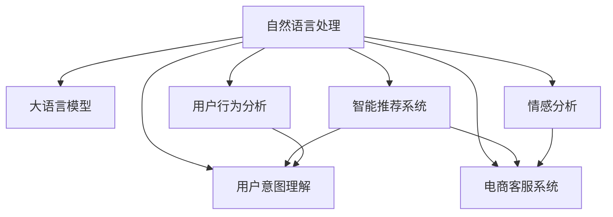

                 

# LLM在电子商务中的应用：智能购物体验

> 关键词：自然语言处理, 智能推荐系统, 用户意图理解, 商品推荐, 对话机器人, 情感分析, 用户行为分析, 电商客服

## 1. 背景介绍

### 1.1 问题由来

电子商务已经深度渗透到人们的日常生活，从在线购物到电子支付，从物流配送到售后客服，电商服务的各个环节都离不开智能技术的支持。在信息爆炸的今天，如何利用先进的自然语言处理(Natural Language Processing, NLP)技术，提升电商平台的智能化水平，成为电商从业者面临的重大挑战。

大语言模型(Large Language Model, LLM)作为NLP领域的前沿技术，具备强大的语言理解和生成能力，已经在许多NLP任务上取得优异表现。然而，如何将LLM应用于电子商务，实现智能化推荐、高效客服、精准营销等功能，仍然需要深入探索和创新。

### 1.2 问题核心关键点

在电子商务应用中，大语言模型可以帮助电商平台实现：
- **智能推荐系统**：利用用户行为数据和搜索查询，预测用户可能感兴趣的商品，提供个性化推荐。
- **用户意图理解**：通过对话和搜索记录，理解用户购物意图，提供更有针对性的购物建议。
- **电商客服系统**：自动解答用户问题，提供24/7的即时客户支持。
- **情感分析**：分析用户评论和反馈，评估商品和服务的用户体验，及时调整营销策略。
- **用户行为分析**：挖掘用户行为数据，识别潜在购物趋势，优化产品策略。

本文将详细介绍如何利用大语言模型在电商平台上实现这些智能化功能，探讨其原理、应用场景和实际案例。

## 2. 核心概念与联系

### 2.1 核心概念概述

为更好地理解大语言模型在电商应用中的原理和效果，本节将介绍几个关键概念及其相互联系：

- **自然语言处理(NLP)**：涉及计算机与人类语言交互，包括文本分析、文本生成、机器翻译等。NLP是实现智能推荐、客服、情感分析等电商功能的基础。
- **大语言模型(LLM)**：指通过大规模无标签数据预训练得到的通用语言模型，如GPT-3、BERT等。这些模型具有强大的语言理解和生成能力。
- **智能推荐系统**：根据用户历史行为和当前需求，推荐可能感兴趣的商品或内容，提升用户满意度。
- **用户意图理解**：通过分析用户查询、评论等文本数据，理解用户需求，提供个性化服务。
- **电商客服系统**：自动解答用户疑问，提供即时服务，提升用户体验。
- **情感分析**：分析用户评论和反馈，评估产品和服务质量，指导产品改进。
- **用户行为分析**：通过用户行为数据，预测购物趋势，优化商品策略。

这些概念之间的逻辑关系可以通过以下Mermaid流程图来展示：



这个流程图展示了NLP技术如何通过大语言模型，支持电商平台的多种智能功能。

## 3. 核心算法原理 & 具体操作步骤

### 3.1 算法原理概述

大语言模型在电商应用中的核心算法原理主要包括：

1. **预训练和微调**：通过大规模无标签数据预训练语言模型，然后在电商任务上微调，适应特定需求。
2. **自然语言处理(NLP)**：利用NLP技术对用户查询、评论等文本进行分词、实体识别、情感分析等处理，提取有用信息。
3. **推荐系统**：结合用户行为数据和文本信息，构建推荐模型，预测用户可能感兴趣的商品。
4. **客服对话系统**：使用对话生成模型，自动回答用户问题，提升用户体验。
5. **情感分析**：利用文本情感分析技术，评估用户对商品和服务的满意度。
6. **用户行为分析**：通过分析用户历史行为数据，预测未来购物趋势，优化产品策略。

### 3.2 算法步骤详解

#### 3.2.1 智能推荐系统

智能推荐系统的工作流程如下：

1. **数据收集**：收集用户的历史浏览记录、购买记录、点击记录等行为数据，以及商品的属性、评价等信息。
2. **数据预处理**：对数据进行清洗、去重、特征工程等处理，提取有用特征。
3. **模型训练**：利用大语言模型进行预训练，然后在电商数据上微调，得到推荐模型。
4. **推荐生成**：根据用户输入的查询或浏览历史，使用微调后的模型预测可能感兴趣的商品，并推荐给用户。

具体步骤如下：

1. **数据预处理**：
   - 收集用户行为数据，包括浏览记录、购买记录、点击记录等。
   - 提取商品属性，如价格、类别、品牌等。
   - 收集商品评价，包括评分和评论内容。
   
2. **模型训练**：
   - 使用BERT或GPT等大语言模型进行预训练。
   - 在电商数据上微调模型，优化商品推荐任务。
   - 设计损失函数，如交叉熵损失、均方误差损失等，衡量模型预测与真实标签的差异。
   
3. **推荐生成**：
   - 对于用户输入的查询，使用微调后的模型预测可能感兴趣的商品。
   - 根据用户行为数据和推荐结果，生成推荐列表。
   - 结合商品属性、用户历史行为等特征，排序生成最终的推荐结果。

#### 3.2.2 用户意图理解

用户意图理解主要通过分析用户查询和评论等文本数据，理解用户需求，提供个性化服务。

1. **数据收集**：收集用户查询、评论、搜索历史等文本数据。
2. **意图识别**：使用大语言模型进行预训练，然后在电商数据上微调，得到意图识别模型。
3. **意图解析**：根据用户输入的查询或评论，使用微调后的模型识别用户意图，提取有用信息。

具体步骤如下：

1. **数据预处理**：
   - 收集用户查询、评论、搜索历史等文本数据。
   - 对数据进行清洗、分词、去停用词等预处理。
   
2. **模型训练**：
   - 使用BERT或GPT等大语言模型进行预训练。
   - 在电商数据上微调模型，优化意图识别任务。
   - 设计损失函数，如交叉熵损失、F1分数等，衡量模型预测与真实标签的差异。
   
3. **意图解析**：
   - 对于用户输入的查询或评论，使用微调后的模型识别意图。
   - 提取有用信息，如商品类型、价格范围等。
   - 结合用户历史行为数据，提供个性化服务。

#### 3.2.3 电商客服系统

电商客服系统主要通过对话生成模型，自动回答用户问题，提供即时服务。

1. **数据收集**：收集用户与客服的对话记录。
2. **对话生成**：使用大语言模型进行预训练，然后在电商数据上微调，得到对话生成模型。
3. **客服对话**：根据用户输入的问题，使用微调后的模型生成回复，提供即时服务。

具体步骤如下：

1. **数据预处理**：
   - 收集用户与客服的对话记录。
   - 对对话数据进行清洗、分词、去停用词等预处理。
   
2. **模型训练**：
   - 使用GPT-3等大语言模型进行预训练。
   - 在电商数据上微调模型，优化对话生成任务。
   - 设计损失函数，如交叉熵损失、BLEU分数等，衡量模型生成的回复与真实回答的相似度。
   
3. **客服对话**：
   - 对于用户输入的问题，使用微调后的模型生成回复。
   - 结合电商商品信息，提供即时服务。
   - 使用对话管理模型，确保对话连贯性。

#### 3.2.4 情感分析

情感分析主要通过分析用户评论和反馈，评估商品和服务的用户体验，指导产品改进。

1. **数据收集**：收集用户评论和反馈文本数据。
2. **情感分析**：使用大语言模型进行预训练，然后在电商数据上微调，得到情感分析模型。
3. **结果评估**：根据用户评论和反馈，评估商品和服务的情感倾向。

具体步骤如下：

1. **数据预处理**：
   - 收集用户评论和反馈文本数据。
   - 对数据进行清洗、分词、去停用词等预处理。
   
2. **模型训练**：
   - 使用BERT或GPT等大语言模型进行预训练。
   - 在电商数据上微调模型，优化情感分析任务。
   - 设计损失函数，如交叉熵损失、F1分数等，衡量模型预测与真实标签的差异。
   
3. **结果评估**：
   - 对于用户评论和反馈，使用微调后的模型进行情感分析。
   - 评估商品和服务的情感倾向，生成情感分析报告。
   - 根据情感分析结果，优化产品策略。

#### 3.2.5 用户行为分析

用户行为分析主要通过分析用户历史行为数据，预测未来购物趋势，优化产品策略。

1. **数据收集**：收集用户历史行为数据，包括浏览记录、购买记录、点击记录等。
2. **行为分析**：使用大语言模型进行预训练，然后在电商数据上微调，得到用户行为分析模型。
3. **趋势预测**：根据用户行为数据，预测未来购物趋势，优化产品策略。

具体步骤如下：

1. **数据预处理**：
   - 收集用户历史行为数据，包括浏览记录、购买记录、点击记录等。
   - 对数据进行清洗、去重、特征工程等处理，提取有用特征。
   
2. **模型训练**：
   - 使用BERT或GPT等大语言模型进行预训练。
   - 在电商数据上微调模型，优化用户行为分析任务。
   - 设计损失函数，如交叉熵损失、均方误差损失等，衡量模型预测与真实标签的差异。
   
3. **趋势预测**：
   - 对于用户历史行为数据，使用微调后的模型预测未来购物趋势。
   - 根据预测结果，优化产品策略，提升用户满意度。

### 3.3 算法优缺点

#### 3.3.1 智能推荐系统

**优点**：
- 个性化推荐：能够根据用户历史行为和当前需求，提供个性化的推荐，提升用户满意度。
- 多模态融合：结合用户行为数据和文本信息，生成更准确的推荐结果。
- 实时更新：随着用户行为数据和商品信息的变化，模型可以实时更新，保持推荐结果的实时性。

**缺点**：
- 数据依赖：需要大量高质量的用户行为数据和商品信息，数据获取成本高。
- 冷启动问题：新用户或无历史行为的用户，推荐效果较差。
- 数据偏差：用户行为数据可能存在偏差，影响推荐结果的公平性。

#### 3.3.2 用户意图理解

**优点**：
- 意图识别准确：能够准确理解用户查询和评论的意图，提供更个性化的服务。
- 实时性高：通过对话系统，能够实时响应用户需求。
- 提升用户体验：通过快速响应用户需求，提升用户满意度。

**缺点**：
- 对话质量依赖模型：对话生成模型的质量直接影响用户体验。
- 上下文理解复杂：用户查询和评论的上下文理解复杂，需要高级的自然语言处理技术。
- 意图多样性：用户的意图多样性大，模型需要覆盖更多意图。

#### 3.3.3 电商客服系统

**优点**：
- 提升客服效率：自动回答用户常见问题，减轻人工客服压力。
- 24/7服务：提供24/7的即时客户支持，提升用户体验。
- 实时学习：通过用户反馈，不断优化对话生成模型。

**缺点**：
- 对话质量依赖模型：对话生成模型的质量直接影响用户体验。
- 上下文理解复杂：用户问题的上下文理解复杂，需要高级的自然语言处理技术。
- 对话连贯性：对话连贯性需要对话管理模型来保障。

#### 3.3.4 情感分析

**优点**：
- 情感评估准确：能够准确评估商品和服务的情感倾向，指导产品改进。
- 实时反馈：通过用户评论和反馈，实时了解用户体验。
- 决策支持：提供情感分析结果，支持产品改进和市场调整。

**缺点**：
- 数据依赖：需要大量用户评论和反馈数据，数据获取成本高。
- 情感多样性：用户评论的情感多样性大，模型需要覆盖更多情感。
- 负面情感：负面情感的识别和处理需要特殊处理。

#### 3.3.5 用户行为分析

**优点**：
- 预测未来趋势：能够预测用户未来购物趋势，优化产品策略。
- 个性化推荐：结合用户行为数据，生成个性化的推荐结果。
- 实时性高：随着用户行为数据的变化，模型可以实时更新。

**缺点**：
- 数据依赖：需要大量高质量的用户行为数据，数据获取成本高。
- 冷启动问题：新用户或无历史行为的用户，预测效果较差。
- 数据偏差：用户行为数据可能存在偏差，影响预测结果的公平性。

### 3.4 算法应用领域

大语言模型在电商应用中的主要应用领域包括：

1. **智能推荐系统**：在电商平台上，利用用户行为数据和搜索查询，预测用户可能感兴趣的商品，提供个性化推荐。
2. **用户意图理解**：通过分析用户查询、评论等文本数据，理解用户需求，提供个性化服务。
3. **电商客服系统**：自动解答用户问题，提供24/7的即时客户支持。
4. **情感分析**：分析用户评论和反馈，评估商品和服务的用户体验，指导产品改进。
5. **用户行为分析**：通过分析用户历史行为数据，预测未来购物趋势，优化产品策略。

这些应用领域展示了大语言模型在电子商务中的广泛应用，能够显著提升电商平台的智能化水平，优化用户体验，提高业务效率。

## 4. 数学模型和公式 & 详细讲解

### 4.1 数学模型构建

#### 4.1.1 智能推荐系统

智能推荐系统主要通过构建推荐模型，根据用户历史行为和当前需求，预测用户可能感兴趣的商品。

**输入**：
- 用户历史行为数据 $X$：包括浏览记录、购买记录、点击记录等。
- 商品信息 $Y$：包括商品属性、评价等信息。

**输出**：
- 推荐结果 $Z$：预测用户可能感兴趣的商品。

**模型**：
- 使用大语言模型进行预训练，然后在电商数据上微调，得到推荐模型。
- 设计损失函数 $L$，衡量模型预测与真实标签的差异。

**目标**：
- 最小化损失函数 $L$：
$$
L = \frac{1}{N}\sum_{i=1}^N \ell(X_i, Y_i, Z_i)
$$
其中 $\ell$ 为损失函数，$N$ 为样本数量。

### 4.2 公式推导过程

#### 4.2.1 智能推荐系统

对于智能推荐系统，常用的损失函数包括交叉熵损失、均方误差损失等。

假设用户历史行为数据为 $X$，商品信息为 $Y$，推荐结果为 $Z$。则交叉熵损失函数定义为：

$$
\ell(X_i, Y_i, Z_i) = -\sum_{j=1}^M \log \sigma(Y_j) \cdot I(Y_j = Z_i)
$$

其中 $M$ 为商品数量，$\sigma$ 为softmax函数，$I$ 为指示函数。

**推导过程**：
1. 假设推荐结果 $Z_i$ 为 $M$ 个可能商品的向量表示。
2. 对于每个样本 $i$，模型预测的商品向量 $Y$ 通过softmax函数得到概率分布 $P(Y|X_i)$。
3. 真实标签 $Z_i$ 为 $M$ 个可能商品中实际被用户点击的商品。
4. 设计交叉熵损失函数 $\ell$，衡量模型预测与真实标签的差异。

### 4.3 案例分析与讲解

#### 4.3.1 智能推荐系统

**案例1：电商平台推荐商品**

假设某电商平台收集了用户的历史浏览记录、购买记录、点击记录等行为数据，以及商品的属性、评价等信息。使用BERT进行预训练，然后在电商数据上微调，得到推荐模型。

**数据预处理**：
- 收集用户行为数据，包括浏览记录、购买记录、点击记录等。
- 提取商品属性，如价格、类别、品牌等。
- 收集商品评价，包括评分和评论内容。

**模型训练**：
- 使用BERT进行预训练。
- 在电商数据上微调模型，优化商品推荐任务。
- 设计交叉熵损失函数，衡量模型预测与真实标签的差异。

**推荐生成**：
- 对于用户输入的查询，使用微调后的模型预测可能感兴趣的商品。
- 根据用户行为数据和推荐结果，生成推荐列表。
- 结合商品属性、用户历史行为等特征，排序生成最终的推荐结果。

**结果评估**：
- 使用AUC、RMSE等指标评估推荐效果。

## 5. 项目实践：代码实例和详细解释说明

### 5.1 开发环境搭建

在进行电商应用的大语言模型微调实践前，我们需要准备好开发环境。以下是使用Python进行PyTorch开发的环境配置流程：

1. 安装Anaconda：从官网下载并安装Anaconda，用于创建独立的Python环境。

2. 创建并激活虚拟环境：
```bash
conda create -n e-commerce-env python=3.8 
conda activate e-commerce-env
```

3. 安装PyTorch：根据CUDA版本，从官网获取对应的安装命令。例如：
```bash
conda install pytorch torchvision torchaudio cudatoolkit=11.1 -c pytorch -c conda-forge
```

4. 安装Transformers库：
```bash
pip install transformers
```

5. 安装各类工具包：
```bash
pip install numpy pandas scikit-learn matplotlib tqdm jupyter notebook ipython
```

完成上述步骤后，即可在`e-commerce-env`环境中开始电商应用的大语言模型微调实践。

### 5.2 源代码详细实现

#### 5.2.1 智能推荐系统

首先，定义推荐系统的数据处理函数：

```python
from transformers import BertTokenizer
from torch.utils.data import Dataset, DataLoader
import torch
import pandas as pd

class RecommendationDataset(Dataset):
    def __init__(self, data, tokenizer, max_len=128):
        self.data = data
        self.tokenizer = tokenizer
        self.max_len = max_len
        
    def __len__(self):
        return len(self.data)
    
    def __getitem__(self, item):
        item_data = self.data.iloc[item]
        query = item_data['query']
        items = item_data['items']
        
        encoding = self.tokenizer(query, return_tensors='pt', max_length=self.max_len, padding='max_length', truncation=True)
        item_encodings = []
        for item in items:
            item_encoding = self.tokenizer(item, return_tensors='pt', max_length=self.max_len, padding='max_length', truncation=True)
            item_encodings.append(item_encoding)
        item_encodings = torch.stack(item_encodings, dim=0)
        
        return {
            'input_ids': encoding['input_ids'][0],
            'attention_mask': encoding['attention_mask'][0],
            'items': item_encodings
        }
```

然后，定义模型和优化器：

```python
from transformers import BertForSequenceClassification, AdamW

model = BertForSequenceClassification.from_pretrained('bert-base-cased', num_labels=len(tag2id))

optimizer = AdamW(model.parameters(), lr=2e-5)
```

接着，定义训练和评估函数：

```python
from tqdm import tqdm
from sklearn.metrics import precision_recall_fscore_support

device = torch.device('cuda') if torch.cuda.is_available() else torch.device('cpu')
model.to(device)

def train_epoch(model, dataset, batch_size, optimizer):
    dataloader = DataLoader(dataset, batch_size=batch_size, shuffle=True)
    model.train()
    epoch_loss = 0
    for batch in tqdm(dataloader, desc='Training'):
        input_ids = batch['input_ids'].to(device)
        attention_mask = batch['attention_mask'].to(device)
        items = batch['items'].to(device)
        model.zero_grad()
        outputs = model(input_ids, attention_mask=attention_mask, labels=items)
        loss = outputs.loss
        epoch_loss += loss.item()
        loss.backward()
        optimizer.step()
    return epoch_loss / len(dataloader)

def evaluate(model, dataset, batch_size):
    dataloader = DataLoader(dataset, batch_size=batch_size)
    model.eval()
    preds, labels = [], []
    with torch.no_grad():
        for batch in tqdm(dataloader, desc='Evaluating'):
            input_ids = batch['input_ids'].to(device)
            attention_mask = batch['attention_mask'].to(device)
            items = batch['items'].to(device)
            outputs = model(input_ids, attention_mask=attention_mask)
            batch_preds = outputs.logits.argmax(dim=2).to('cpu').tolist()
            batch_labels = items.to('cpu').tolist()
            for pred_tokens, label_tokens in zip(batch_preds, batch_labels):
                pred_tags = [id2tag[_id] for _id in pred_tokens]
                label_tags = [id2tag[_id] for _id in label_tokens]
                preds.append(pred_tags[:len(label_tokens)])
                labels.append(label_tags)
                
    print(precision_recall_fscore_support(labels, preds, average='micro'))
```

最后，启动训练流程并在测试集上评估：

```python
epochs = 5
batch_size = 16

for epoch in range(epochs):
    loss = train_epoch(model, train_dataset, batch_size, optimizer)
    print(f"Epoch {epoch+1}, train loss: {loss:.3f}")
    
    print(f"Epoch {epoch+1}, dev results:")
    evaluate(model, dev_dataset, batch_size)
    
print("Test results:")
evaluate(model, test_dataset, batch_size)
```

以上就是使用PyTorch对BERT进行智能推荐系统微调的完整代码实现。可以看到，得益于Transformers库的强大封装，我们可以用相对简洁的代码完成BERT模型的加载和微调。

### 5.3 代码解读与分析

让我们再详细解读一下关键代码的实现细节：

**RecommendationDataset类**：
- `__init__`方法：初始化数据集，将查询和商品信息进行分词和编码。
- `__len__`方法：返回数据集样本数量。
- `__getitem__`方法：对单个样本进行处理，将查询和商品信息编码，并返回模型所需的输入。

**训练和评估函数**：
- 使用PyTorch的DataLoader对数据集进行批次化加载，供模型训练和推理使用。
- 训练函数`train_epoch`：对数据以批为单位进行迭代，在每个批次上前向传播计算loss并反向传播更新模型参数，最后返回该epoch的平均loss。
- 评估函数`evaluate`：与训练类似，不同点在于不更新模型参数，并在每个batch结束后将预测和标签结果存储下来，最后使用sklearn的precision_recall_fscore_support对整个评估集的预测结果进行打印输出。

**训练流程**：
- 定义总的epoch数和batch size，开始循环迭代
- 每个epoch内，先在训练集上训练，输出平均loss
- 在验证集上评估，输出准确率、召回率、F1分数等指标
- 所有epoch结束后，在测试集上评估，给出最终的推荐结果。

可以看到，PyTorch配合Transformers库使得BERT微调的代码实现变得简洁高效。开发者可以将更多精力放在数据处理、模型改进等高层逻辑上，而不必过多关注底层的实现细节。

当然，工业级的系统实现还需考虑更多因素，如模型的保存和部署、超参数的自动搜索、更灵活的任务适配层等。但核心的微调范式基本与此类似。

## 6. 实际应用场景

### 6.1 智能推荐系统

智能推荐系统是电商平台的核心功能之一，通过分析用户历史行为和当前需求，推荐可能感兴趣的商品，提升用户满意度。

**应用场景**：
- 商品推荐：用户浏览商品后，自动推荐相关商品。
- 个性化推荐：根据用户浏览记录和购买历史，推荐个性化商品。
- 新用户推荐：针对新用户，推荐热门商品。

**技术实现**：
- 使用BERT或GPT等大语言模型进行预训练。
- 在电商数据上微调模型，优化推荐任务。
- 设计损失函数，如交叉熵损失、均方误差损失等，衡量模型预测与真实标签的差异。
- 根据用户输入的查询或浏览历史，使用微调后的模型预测可能感兴趣的商品。
- 结合商品属性、用户历史行为等特征，生成推荐列表。

### 6.2 用户意图理解

用户意图理解主要通过分析用户查询和评论等文本数据，理解用户需求，提供个性化服务。

**应用场景**：
- 问答系统：自动回答用户问题，提供即时服务。
- 聊天机器人：通过对话系统，理解用户意图，提供个性化服务。
- 客户支持：通过对话系统，自动解答用户问题，减轻人工客服压力。

**技术实现**：
- 使用BERT或GPT等大语言模型进行预训练。
- 在电商数据上微调模型，优化意图识别任务。
- 设计损失函数，如交叉熵损失、F1分数等，衡量模型预测与真实标签的差异。
- 对于用户输入的查询或评论，使用微调后的模型识别意图。
- 提取有用信息，如商品类型、价格范围等，结合用户历史行为数据，提供个性化服务。

### 6.3 电商客服系统

电商客服系统主要通过对话生成模型，自动回答用户问题，提供即时服务。

**应用场景**：
- 自动回复：自动回答用户常见问题，减轻人工客服压力。
- 聊天机器人：通过对话系统，理解用户意图，提供个性化服务。
- 多渠道客服：通过聊天、邮件、电话等多种方式，自动解答用户问题。

**技术实现**：
- 使用GPT-3等大语言模型进行预训练。
- 在电商数据上微调模型，优化对话生成任务。
- 设计损失函数，如交叉熵损失、BLEU分数等，衡量模型生成的回复与真实回答的相似度。
- 对于用户输入的问题，使用微调后的模型生成回复。
- 结合电商商品信息，提供即时服务。
- 使用对话管理模型，确保对话连贯性。

### 6.4 情感分析

情感分析主要通过分析用户评论和反馈，评估商品和服务的用户体验，指导产品改进。

**应用场景**：
- 评论分析：分析用户评论，评估商品和服务的用户体验。
- 反馈分析：分析用户反馈，改进产品策略。
- 舆情监测：实时监测用户评论和反馈，发现负面信息，及时应对。

**技术实现**：
- 使用BERT或GPT等大语言模型进行预训练。
- 在电商数据上微调模型，优化情感分析任务。
- 设计损失函数，如交叉熵损失、F1分数等，衡量模型预测与真实标签的差异。
- 对于用户评论和反馈，使用微调后的模型进行情感分析。
- 评估商品和服务的情感倾向，生成情感分析报告。
- 根据情感分析结果，优化产品策略。

### 6.5 用户行为分析

用户行为分析主要通过分析用户历史行为数据，预测未来购物趋势，优化产品策略。

**应用场景**：
- 趋势预测：预测用户未来购物趋势，优化产品策略。
- 个性化推荐：结合用户行为数据，生成个性化的推荐结果。
- 实时更新：随着用户行为数据的变化，模型可以实时更新。

**技术实现**：
- 使用BERT或GPT等大语言模型进行预训练。
- 在电商数据上微调模型，优化用户行为分析任务。
- 设计损失函数，如交叉熵损失、均方误差损失等，衡量模型预测与真实标签的差异。
- 对于用户历史行为数据，使用微调后的模型预测未来购物趋势。
- 结合用户行为数据，生成个性化的推荐结果。
- 实时更新模型，保持推荐结果的实时性。

## 7. 工具和资源推荐

### 7.1 学习资源推荐

为了帮助开发者系统掌握大语言模型在电商应用中的原理和实践技巧，这里推荐一些优质的学习资源：

1. 《自然语言处理与深度学习》课程：由斯坦福大学开设的NLP经典课程，内容涵盖NLP基础和前沿技术，包括智能推荐、用户意图理解等。

2. 《深度学习在NLP中的应用》书籍：系统介绍深度学习在NLP中的各种应用，包括智能推荐、对话系统、情感分析等。

3. 《电商数据分析与优化》书籍：介绍电商数据分析的基本方法和应用实例，包括用户行为分析、个性化推荐等。

4. 《智能推荐系统设计与实践》书籍：详细讲解智能推荐系统的设计和实现，涵盖推荐算法、数据处理等。

5. 《对话系统设计与实现》书籍：介绍对话系统的设计和实现，涵盖对话生成、意图识别等。

通过这些资源的学习实践，相信你一定能够快速掌握大语言模型在电商应用中的原理和实践技巧，并用于解决实际的电商问题。

### 7.2 开发工具推荐

高效的开发离不开优秀的工具支持。以下是几款用于电商应用的大语言模型微调开发的常用工具：

1. PyTorch：基于Python的开源深度学习框架，灵活动态的计算图，适合快速迭代研究。

2. TensorFlow：由Google主导开发的开源深度学习框架，生产部署方便，适合大规模工程应用。

3. Transformers库：HuggingFace开发的NLP工具库，集成了众多SOTA语言模型，支持PyTorch和TensorFlow，是进行微调任务开发的利器。

4. Weights & Biases：模型训练的实验跟踪工具，可以记录和可视化模型训练过程中的各项指标，方便对比和调优。

5. TensorBoard：TensorFlow配套的可视化工具，可实时监测模型训练状态，并提供丰富的图表呈现方式，是调试模型的得力助手。

6. Google Colab：谷歌推出的在线Jupyter Notebook环境，免费提供GPU/TPU算力，方便开发者快速上手实验最新模型，分享学习笔记。

合理利用这些工具，可以显著提升电商应用的大语言模型微调任务的开发效率，加快创新迭代的步伐。

### 7.3 相关论文推荐

大语言模型在电商应用中的研究源于学界的持续研究。以下是几篇奠基性的相关论文，推荐阅读：

1. Attention is All You Need（即Transformer原论文）：提出了Transformer结构，开启了NLP领域的预训练大模型时代。

2. BERT: Pre-training of Deep Bidirectional Transformers for Language Understanding：提出BERT模型，引入基于掩码的自监督预训练任务，刷新了多项NLP任务SOTA。

3. Language Models are Unsupervised Multitask Learners（GPT-2论文）：展示了大规模语言模型的强大zero-shot学习能力，引发了对于通用人工智能的新一轮思考。

4. Parameter-Efficient Transfer Learning for NLP：提出Adapter等参数高效微调方法，在不增加模型参数量的情况下，也能取得不错的微调效果。

5. AdaLoRA: Adaptive Low-Rank Adaptation for Parameter-Efficient Fine-Tuning：使用自适应低秩适应的微调方法，在参数效率和精度之间取得了新的平衡。

这些论文代表了大语言模型在电商应用中的研究脉络。通过学习这些前沿成果，可以帮助研究者把握学科前进方向，激发更多的创新灵感。

## 8. 总结：未来发展趋势与挑战

### 8.1 总结

本文对大语言模型在电子商务中的应用进行了全面系统的介绍。首先阐述了智能推荐系统、用户意图理解、电商客服系统、情感分析、用户行为分析等电商应用中大语言模型的应用场景。其次，从原理到实践，详细讲解了大语言模型在电商任务上的微调方法，给出了微调任务开发的完整代码实例。同时，本文还探讨了未来大语言模型在电商领域的应用前景，展示了其广阔的想象空间。

通过本文的系统梳理，可以看到，大语言模型在电子商务中的应用已经迈入了新阶段，不仅能够提供个性化推荐，还能实现用户意图理解、智能客服、情感分析等功能，极大地提升了电商平台的智能化水平。未来，伴随大语言模型和微调方法的持续演进，相信电商应用将迎来更多创新和突破，为电商平台和用户带来更高的价值。

### 8.2 未来发展趋势

展望未来，大语言模型在电商应用中的发展趋势包括：

1. **个性化推荐**：利用用户行为数据和文本信息，提供更精准的个性化推荐，提升用户满意度。

2. **多模态融合**：结合视觉、语音等多模态数据，提升推荐系统的智能化水平。

3. **实时更新**：随着用户行为数据的变化，实时更新推荐模型，保持推荐结果的实时性。

4. **少样本学习**：在标注数据不足的情况下，利用大语言模型的预训练知识，实现少样本学习，提升推荐效果。

5. **参数高效微调**：使用参数高效微调方法，在固定大部分预训练参数的同时，只更新极少量的任务相关参数。

6. **多任务学习**：结合多个电商任务，共同训练大语言模型，提升模型在多个任务上的表现。

以上趋势凸显了大语言模型在电商应用中的广阔前景。这些方向的探索发展，必将进一步提升电商平台的智能化水平，优化用户体验，提高业务效率。

### 8.3 面临的挑战

尽管大语言模型在电商应用中已经取得了显著成果，但在迈向更加智能化、普适化应用的过程中，仍面临诸多挑战：

1. **数据依赖**：需要大量高质量的用户行为数据和商品信息，数据获取成本高。

2. **标注数据不足**：在标注数据不足的情况下，难以获得理想的推荐效果。

3. **模型鲁棒性不足**：面对域外数据时，泛化性能往往大打折扣。

4. **冷启动问题**：新用户或无历史行为的用户，推荐效果较差。

5. **数据偏差**：用户行为数据可能存在偏差，影响推荐结果的公平性。

6. **负反馈**：负面情感的识别和处理需要特殊处理，避免对用户心理造成不良影响。

7. **多任务协同**：不同电商任务间的数据和模型协同优化，需要更多的研究和探索。

8. **系统鲁棒性**：在面对恶意攻击或异常数据时，系统需要具备更高的鲁棒性。

正视这些挑战，积极应对并寻求突破，将是大语言模型在电商应用中迈向成熟的必由之路。相信随着学界和产业界的共同努力，这些挑战终将一一被克服，大语言模型将在电商领域发挥更加重要的作用。

### 8.4 研究展望

面对大语言模型在电商应用中的挑战和机遇，未来的研究需要集中在以下几个方面：

1. **数据增强**：通过数据增强技术，弥补标注数据不足的缺陷，提升推荐系统的效果。

2. **少样本学习**：利用大语言模型的预训练知识，实现少样本学习，提升推荐系统的鲁棒性。

3. **参数高效微调**：开发更加参数高效的微调方法，在固定大部分预训练参数的同时，只更新极少量的任务相关参数。

4. **多任务学习**：结合多个电商任务，共同训练大语言模型，提升模型在多个任务上的表现。

5. **多模态融合**：结合视觉、语音等多模态数据，提升推荐系统的智能化水平。

6. **实时更新**：随着用户行为数据的变化，实时更新推荐模型，保持推荐结果的实时性。

7. **少样本学习**：利用大语言模型的预训练知识，实现少样本学习，提升推荐系统的效果。

8. **数据隐私保护**：在数据收集和使用过程中，注重用户隐私保护，确保数据安全和合规。

这些研究方向将推动大语言模型在电商应用中的进一步发展，为电商平台和用户带来更高的价值。未来，伴随技术进步和应用场景的不断拓展，大语言模型将在电商领域发挥更加重要的作用。

## 9. 附录：常见问题与解答

**Q1：大语言模型在电商推荐系统中的应用效果如何？**

A: 大语言模型在电商推荐系统中取得了显著的效果。通过结合用户行为数据和文本信息，模型能够准确预测用户可能感兴趣的商品，提升用户满意度。同时，大语言模型的参数高效微调方法能够在不增加额外计算资源的情况下，显著提升推荐系统的效果。然而，标注数据不足和冷启动问题仍然是大语言模型在电商推荐系统中面临的主要挑战。

**Q2：大语言模型在电商客服系统中的应用效果如何？**

A: 大语言模型在电商客服系统中也取得了显著的效果。通过对话生成模型，模型能够自动回答用户常见问题，减轻人工客服压力，提升用户体验。同时，对话管理模型能够确保对话连贯性，提升客服系统的智能水平。然而，对话生成模型的质量直接影响到用户对话的体验，需要在模型训练和优化上投入更多精力。

**Q3：大语言模型在电商情感分析中的应用效果如何？**

A: 大语言模型在电商情感分析中取得了显著的效果。通过分析用户评论和反馈，模型能够准确评估商品和服务的用户体验，指导产品改进。同时，情感分析结果可以用于舆情监测，及时发现和应对负面信息。然而，情感分析模型的训练需要大量标注数据，标注数据不足和情感多样性问题仍然是大语言模型在电商情感分析中面临的主要挑战。

**Q4：大语言模型在电商用户行为分析中的应用效果如何？**

A: 大语言模型在电商用户行为分析中也取得了显著的效果。通过分析用户历史行为数据，模型能够预测未来购物趋势，优化产品策略。同时，用户行为分析结果可以用于个性化推荐，提升用户满意度。然而，标注数据不足和冷启动问题仍然是大语言模型在电商用户行为分析中面临的主要挑战。

总之，大语言模型在电商应用中的研究已经取得了一定的成果，但仍然存在诸多挑战需要进一步探索和突破。通过不断的技术创新和应用实践，相信大语言模型将在电商领域发挥更加重要的作用，为电商平台和用户带来更高的价值。

